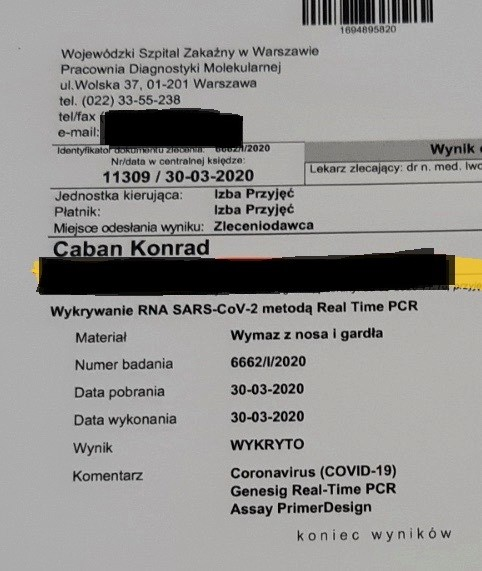
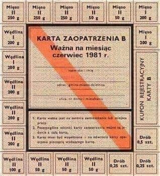
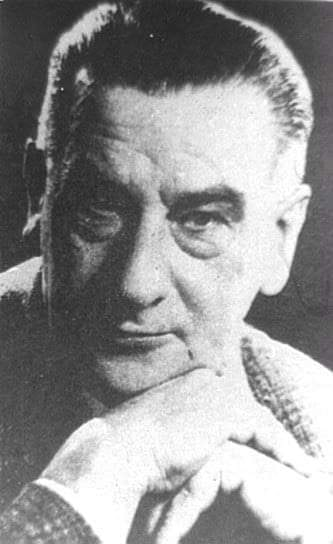

### 2020

Usunięty ćwierk

  

Banki obecnie (oprócz dwóch PEKAO SA i Alior) wprowadzają wymóg 20% wkładu własnego pod kredyty hipoteczne oraz podnoszą marże.

1. Utrata pracy przez ludzi
2. Droższy kredyt
3. Trudniej dostępny kredyt
4. Więcej nieruchomosci na rynku
5. Mniej klientów

Przecena nieruchomości ± 20% powinna wystąpić w ~Q420, natomiast kierunkiem właściwym dla XAU to $2000.

Rząd w dobie kryzysu nie będzie dyscyplinował Suwerena ale przede wszystkim w niego wpompuje pieniądze. Szkoda tylko, że zgodnie z art. 220ust.2 Konstytucji RP tym faktycznym suwerenem nie są Polacy ale banki komercyjne, bo tylko od nich Rząd może pożyczać pieniądze po kryzysie (zakaz od NBP) przez co mają instrumenty trzymania Państwa za twarz. Dyscyplinować więc będzie poddanych i przed poddanymi będzie udawał, że:

1. To oni są suwerenem, a nie siłą roboczą, której zwyczajnie się nie opłaca tracić zbyt wiele,
2. Dając pieniądze faktycznemu Suwerenowi daje im.
3. Tarcza jest dla nich, a nie po to, aby suweren rzekomy jakoś dotrwał do czasu, gdy wraz z majątkiem stanie się łupem Suwerena prawdziwego.
Dlatego niebawem będzie wysyp zadłużonych i Ci dzisiejsi mogą się wtedy nie dopchać do nas o pomoc (jeśli rzecz jasna będzie miał kto pomagać jeśli długo będzie strasznie źle).

Zatem mamy rozleniwiony, głęboko przez lata udziecinniony salariat z nowymi domami na kredyt, jednocześnie bardzo biedny, z drugiej strony mamy otoczenie banków komercyjnych u którego ten salariat jest zakredytowany, dlatego aż niemożliwym wydaje się scenariusz gdzie kapitał instytucjonalny nie pokusi się przejąć przecenionych aktywów zagubionego w rzeczywistości salariatu spychając go w obszary prekariatu.

---

Zawieszenie wypłat 13. emerytury, tymczasowa redukcja 500 plus, uwolnienie przedsiębiorców od ciężarów finansowych, powstrzymanie spirali zatorów płatniczych oraz dostarczenie przedsiębiorstwom dodatkowej płynności przez system bankowy – to postulaty trzynastu profesorów i doktorów ekonomii, m.in. byłych członków Rady Polityki Pieniężnej, którzy podpisali się pod drugim już wspólnym apelem do rządu o jak najszybsze podjęcie skutecznych działań osłonowych dla polskiej gospodarki.

Ekonomiści zaznaczają, że „nieuchronne staje się wyraźne zwiększenie długu publicznego – nominalnie i w relacji do PKB”. Ich zdaniem potrzeby finansowe państwa w 2020 r. mogą sięgnąć 130-150 mld zł.

Dodają, że Polskę czeka zasadnicza nowelizacja ustawy budżetowej. „Trzeba jej dokonać po wnikliwym przeglądzie wszystkich wydatków budżetowych, aby ograniczyć poziom wydatków, które nie są w tym roku niezbędne. W szczególności na okres co najmniej 3 lat (2020-2022) trzeba zrezygnować z reguły przeznaczania na wydatki wojskowe 2 proc. PKB. Niezbędne będzie także zawieszenie na ten okres części sztywnych wydatków socjalnych (w szczególności dotyczy to 13. emerytury i ograniczenia wypłaty 500+ do poziomu sprzed jej rozszerzenia)” – tłumaczą.

<a href="./documents/april/Alert-Gospodarczy-2-OEES.pdf" target="_blank">Alert gospodarczy</a>

---

Nie ma w "tarczy antykryzysowej" żadnych przepisów, które regulowałyby kwestię wakacji kredytowych dla osób, które stracą źródło utrzymania na skutek kryzysu. Banki zobowiązały się jedynie przez prezydentem do tego, by udzielać ich na 3 miesiące. Na własnych warunkach - i zarabiając na tym.

Tak zwana "tarcza antykryzysowa" w żaden sposób nie pomoże osobom prywatnym czy małym przedsiębiorcom, którzy na skutek kryzysu wywołanego przez epidemię COVID-19 utracą dochody i nie będą dawali rady spłacać kredytów. Ustawodawca odsyła nas tu do banków, które na prośbę prezydenta Andrzeja Dudy zgodziły się łaskawie odraczać spłatę rat na trzy miesiące. Oczywiście nie za darmo. Banki będą na tym zarabiać, koszty zawieszenia rat poniosą zaś sami kredytobiorcy.

Tymczasem według większości szacunków w najbliższych miesiącach bezrobocie w Polsce może wzrosnąć z obecnych ok. 5,5 proc. do ok 10 proc. Zaznaczmy tu, że prognozy te dotyczą przede wszystkim osób zatrudnionych na umowy o pracę. Według wyliczeń firmy Personnel Service utrata pracy może czekać aż 2 mln ludzi – w tym także tych zatrudnionych na umowy cywilnoprawne lub samozatrudnionych. Wciąż nie do oszacowania jest liczba tych pracowników, samozatrudnionych i mikroprzedsiębiorców, którzy wprawdzie zachowają źródło utrzymania, ale ich dochody znacząco lub drastycznie spadną.

  

---

  

---

> Hospitals are threatening to fire health-care workers who publicize their working conditions during the coronavirus pandemic -- and have in some cases followed through.
> Ming Lin, an emergency room physician in Washington state, said he was told Friday he was out of a job because he’d given an interview to a newspaper about a Facebook post detailing what he believed to be inadequate protective equipment and testing. In Chicago, a nurse was fired after emailing colleagues that she wanted to wear a more protective mask while on duty. In New York, the NYU Langone Health system has warned employees they could be terminated if they talk to the media without authorization.
> “Hospitals are muzzling nurses and other health-care workers in an attempt to preserve their image,” said Ruth Schubert, a spokeswoman for the Washington State Nurses Association. “It is outrageous.”
> Hospitals have traditionally had strict media guidelines to protect patient privacy, urging staff to talk with journalists only through official public relations offices. But the pandemic has ushered in a new era, Schubert said.
> Health-care workers “must have the ability to tell the public what is really going on inside the facilities where they are caring for Covid-19 patients,” she said.

---

Pandemia koronawirusa poza jednoznacznym wpływem na zdrowie i życie społeczeństwa, ma również wymiar gospodarczo-ekonomiczny.

Poza informacjami od lekarzy, otrzymuję również sygnały od przedsiębiorców i pracowników innych niż ochrona zdrowia gałęzi gospodarki.

Wiele miejsc pracy zaczyna dawać pracownikom dwa rozwiązania do wyboru – albo obniżka wynagrodzenia o 20 proc., albo wypowiedzenie. Często dotyczy to osób z wyższym wykształceniem, które otrzymywały dotychczas wynagrodzenie w przedziale 3000-4000 złotych brutto miesięcznie, co sprawy, że ich pensja ustali się na poziomie lub niebezpiecznie zbliży do płacy minimalnej.

Jak wiemy, motorem napędowy gospodarki („wyrobnikami PKB”) są głównie mali przedsiębiorcy. To ich w czasie kryzysu rząd powinien chronić najbardziej, to o nich należy zadbać, aby po wygaśnięciu pandemii, można było jakoś wystartować.

Nie inaczej działają rządy wielu krajów europejskich:
Dania – 75-90 proc. wynagrodzenia do czerwca pokryje państwo.
Francja – 100 proc. wynagrodzeń dla otrzymujących płacę minimalną i 70 proc. dla pozostałych pokryje państwo.
Czechy – 100 proc. (zwrot firmom 80 proc.).
Hiszpania – 70 proc. pokryje państwo.

W Polsce przedsiębiorcy dostaną możliwość uzyskania (zwrotnej) mini-pożyczki do 5000 złotych, w przypadku utraty dochodów w wysokości co najmniej 15 proc. istnieje możliwość zmniejszenia kosztów pracy do 80 proc. dotychczasowych, a koszt tych 80 proc. zostanie solidarnie podzielony pomiędzy państwo (40 proc.) i pracodawców (40 proc.). Firmy, które wstrzymają się od pracy (zawieszą działalność), będą mogły obniżyć wynagrodzenia pracowników o 50 proc.

Abstrahując od (nie)przygotowania systemu opieki zdrowotnej do walki z pandemią, państwo nie jest przygotowane do utrzymania na rynku mikro/mini-przedsiębiorców, którzy mają ogromny wpływ na rozwój gospodarczy i przez to budżet państwa.

Nie sztuką jest umiejętnie zarządzać sukcesem. Sztuką jest wygrać z kryzysem.

---

Cytat:

Nie mogę znieść powszechnego zakłamania medialno-informacyjnego, które dotyczy rozprzestrzeniania się wirusa COVID-19 i “panowania” rządu nad sytuacją. Jest to bardzo ważna kwestia ponieważ dotyczy nas wszystkich. Z góry przepraszam za błędy, ludzi wrażliwych na interpunkcję i konstrukcję języka polskiego, proszę przymknijcie na to na chwilę oko.

W poście zamierzam opisać jak nie funkcjonuje system, jak karmią nas kłamstwami, jak bardzo ważnym elementem w tej całej układance, a właściwie najważniejszym, jest nasza odpowiedzialność, świadomość i prewencja. Post będzie długi, ale myślę, że warty lektury.

Mój brat przeszedł POZYTYWNIE test na obecność koronawirusa w organizmie (gratuluję Konrad pozytywnej oceny). Jedynymi objawami, które posiadał były: UTRATA WĘCHU i SMAKU + plus delikatne kłucie w klatce piersiowej przy bardzo głębokim wdechu. Żadnej gorączki (przez cały czas temperatura idealna 36,6), żadnego kaszlu czy duszności, generalnie nic więcej,samopoczucie 10/10.

POWRÓT- RZEKOME SPRAWDZANIE NA GRANICY

Konrad wrócił do Polski z Anglii, gdzie pracował na barze w którym średnio przewija się ok 2 tys. osób na dobę, zwłaszcza w piątki i w soboty. Było to ok. 2,5 tyg. temu, wówczas w Polsce wprowadzono pierwsze obostrzenia dot. zgromadzeń publicznych, zamknięto szkoły, bary, restauracje a także granice dla obcokrajowców. W Anglii funkcjonowało wszystko bez zmian. Na barze razem z moim bratem pracowała osoba najprawdopodobniej zakażona i kaszląca. Po tak fantastycznym wstępie szanse na to, że mój brat został zarażony wynosił generalnie jakieś 80%. Dodajmy do tego dwudniowy powrót do Polski, zatłoczonym autobusem, z kaszlącymi ludźmi, wówczas szanse skaczą nam do 100%.

W autobusie było ok. 70 osób, wszystkie wróciły z Anglii, wówczas liczba potwierdzonych zakażeń na wyspach była 3 krotnie większa niż u nas. Na granicy jedyne co zrobiono to zmierzono temperaturę przyjezdnym i kazano wypełnić formularz (bardzo wiarygodne zwłaszcza, że koronawirus jest zaraźliwy nawet gdy objawy jeszcze nie miały szansy wystąpić, za czym idzie brak jakiejkolwiek temperatury) . W związku z tym, że moi rodzice pracują w Ochronie Zdrowia, wspólnie zdecydowaliśmy, że mój brat nie może wrócić do domu, wówczas przy potencjalnym zakażeniu, mógłby zarazić moich rodziców, a oni, CAŁY SZPITAL. Wynajęliśmy mu mieszkanie, bo mieliśmy taką możliwość, ilu ludzi nie ma takiej możliwości, tu odpowiedzcie sobie sami. Jedynymi osobami z którymi mój brat się kontaktował byli pasażerowie autobusu oraz Pan prowadzący Ubera, który został już odpowiednio poinformowany.

SANEPID I INNE BAJKI

4 dnia po przyjeździe mój brat dostał zaniku zmysłu węchu i smaku, całkowitego. Poza tym i lekkim kłuciu przy głębokim wdechu, nic, zupełnie nic. Objawy trwały 3 dni a potem wszystko wróciło do normy, ok , zdrowy chłopak, chciałoby się rzec. Poinformował o tym zdarzeniu moich rodziców, a oni po konsultacjach z lekarzami, którzy z nimi współpracują, na podstawie objawów stwierdzili, że w 99% mój brat został ukoronowany. Kazaliśmy mu zadzwonić do sanepidu i do szpitali zakaźnych, efekt był żaden. Pani z sanepidu robiła łaskę, rozmawiając z nim, powiedziała, że to nie są objawy, mimo iż są, to samo usłyszał od ludzi odbierających telefony ze szpitali zakaźnych. Nie są to objawy, nie są wpisane jako objawy, nie ma gorączki, nie ma kaszlu, nie ma wirusa, nie ma rączek, nie ma ciasteczek, wiadomo! Kazali mu siedzieć w domu, ale też bez przesady, bo po co za długo, jak mu przejdzie to niech wyjdzie, niech wraca do domu i niech zarazi więcej ludzi to i emerytur nie będzie trzeba wypłacać. Moi rodzice w międzyczasie walczyli o to aby Konradowi wykonano test, wszyscy otwarcie im mówili, że nikt mu nie zrobi testu, testy wykonują ludziom w bardzo ciężkim stanie. Cóż wydaje mi się, że ludzie w bardzo ciężkim stanie są mniejszym zagrożeniem dla innych, ponieważ nie przemieszczają się swobodnie i beztrosko, bez objawów przy okazji zakupów zarażając mnóstwo ludzi.

Udało się, okazało się, że robią testy na Wolskiej, ale nie jest łatwo się tam dostać, musisz mieć ostre objawy, więc gdyby nie wzmożone śledztwo w tym zakresie, testu by nie było. W poniedziałek z rana wykonano rzeczone badanie, w poniedziałek również, czyli RÓWNO 2 TYG. PO ODBYCIU KWARANTANNY, Konrad zadzwonił ponownie do sanepidu. Dzwonił chyba dwie godziny, powiedział Pani o sytuacji, oczywiście, nadal nie był zarejestrowany, nie figurował jako osoba z podejrzeniem, nikt nie wiedział o jego istnieniu, mimo, iż my sami o to zabiegaliśmy i dzwoniliśmy aby go zarejestrować. Pani powiedziała mu, że jak odsiedział dwa tygodnie to niech wraca, koniec kwarantanny witajcie Malediwy! Czekaliśmy na wynik testu zanim wróci do domu, i co? WYNIK TESTU POZYTYWNY!. Wróciłby do domu z niespodzianką dla rodziców i przy okazji dla szpitala. Teraz ma siedzieć kolejne dwa tygodnie w kwarantannie, gdzie? tego jeszcze nie wiemy, w szpitalu raczej nie, bo po co ma zajmować miejsce dla ciężko chorych ludzi, wiadomo, czy państwo da mu izolatkę w akademiku jak obiecywało, hmmmm póki co nic nam na ten temat nie wiadomo, pewne jest jedno, nie może wrócić do domu.

PODSUMOWANIE

Gdybyśmy się słuchali rad sanepidu, szpitali zakaźnych i ich instrukcji, gdybyśmy nie walczyli o test, Konrad zaraziłby mnóstwo ludzi, a co najważniejsze rodziców, którzy zainfekowali by cały szpital, CAŁY JEDEN DUŻY WARSZAWSKI SZPITAL byłby wyłączony przez opieszałość państwa, brak procedur, brak możliwości wykonania testów, i ignorowanie bezobjawowych nosicieli wirusa COVID-19. Wnioski nasuwają się same, to co podaje rząd i ministerstwo zdrowia jest nieprawdą, zarażonych jest dużo, dużo więcej, NIKT ICH NIE BADA, INFORMACJE SĄ AKTUALIZOWANE CZĘŚCIOWO BO JAK WIDAĆ MIMO CIĄGŁEGO PRZYPOMINANIA, BAZY DANYCH NIE SĄ UZUPEŁNIANE. Powtarzam NIKT z sanepidu się nim nie zainteresował, nikt nie zadzwonił, nie został wpisany do rejestru pomimo trzech telefonów z naszej strony, nikt go nie sprawdzał czy siedzi w domu.

To nie umierający czy zamknięci już ludzie w szpitalach zarażają!!! Tylko Ci którzy z pozoru są zdrowi.

Znajomi Konrada mieli dokładnie identyczne sytuacje, dotyczące objawów i całej przeprawy z sanepidem i systemem. Jedna z jego koleżanek również zarażona (nie zbadana oczywiście, bo po co) miała identyczne objawy, ma rodziców lekarzy, którzy teraz siedzą w domu, nikt im nie kazał, nikt ich nawet nie zbadał, musieli wziąć zwolnienie na własną rękę.

Tak się dba w naszym kraju o bezpieczeństwo i zdrowie obywateli, o godne warunki dla ludzi pracujących w ochronie zdrowia.

31.03 czyli dopiero dziś wprowadzono oficjalnie nakaz izolacji osób przyjezdnych i rozszerzenie kwarantanny na domowników, HIT! żart, mało zabawny, ale jednak. Sytuacja o której mówię miała miejsce 2 tygodnie temu, sami wiecie ilu ludzi do tego czasu wróciło do Polski.

WAŻNE, WAŻNE, JUŻ KOŃCZĘ

2 TYGODNIE siedzenia w domu TO ZA MAŁO!!!!! jak widać, nawet przy osobie zdrowej, młodej bez żadnych chorób, nigdy nie hospitalizowanej, mój brat był w szpitalu jedynie przy okazji swoich własnych narodzin.

Jestem córką medyków, moi rodzice, moi bliscy, moi znajomi będą leczyć Was i Wasze rodziny, będą narażać życie dla Was i dla Waszych rodzin, dlatego SIEDŹCIE W DOMU. Proszę Was o to, zwłaszcza my młodzi ludzie, którzy możemy zarażać bez żadnych objawów, to my najbardziej rozsiewamy ten syf, a nikt nas nie zbada i nie wykluczy. To jedyne co możemy zrobić przy tak niewydolnym systemie opieki zdrowotnej.

To z czym mamy do czynienia teraz, czyli niesprawny system, brak pracowników, podstawowego sprzętu, i wiele, wiele innych problemów, jest to wynik zaniedbań nie tylko tego rządu, ale również wszystkich poprzednich, jest to wynik zaniedbań, które trwały i trwają już kilkadziesiąt lat! Uwierzcie mi, wiem co mówię bo obserwuje to przez 27 lat z domu, w którym słucham o absurdach i zaniedbaniach w tym zakresie, a także z doświadczenia własnego jako pacjentki, bo ze względu na moją chorobę i wrodzoną pierdołowatość, od urodzenia raz na jakiś czas odwiedzam przybytek zwany szpitalem. Może gdy minie ta pandemia zaczniemy walczyć o to co najważniejsze i najbardziej istotne czyli o życie naszych bliskich i nasze, a także o godną śmierć.

  

---

Koronawirus nie pozostaje bez wpływu na wiele rynków. Wprowadzony przez rząd stan zagrożenia epidemicznego wiąże się z zakazem najmu krótkoterminowego, przez co w Warszawie do odwołania nie może działać Airbnb. Jednak spłaty kredytów nie zostały zawieszone przez państwo jak we Włoszech, a czynsze wciąż trzeba płacić, podczas gdy epidemia wydaje się nie odpuszczać. Właściciele mogą być pozbawieni dochodów jeszcze przez miesiące. Na portalach ogłoszeniowych błyskawicznie pojawiły się mieszkania na wynajem długoterminowy, które jeszcze niedawno były dostępne na Airbnb. Aby sprawdzić, ile takich ogłoszeń zostało opublikowanych, porównaliśmy główne zdjęcie ofert na Airbnb sprzed kilku miesięcy ze zdjęciami z ogłoszeń wynajmu mieszkań dostępnych na otodom i Gumtree.

---

George Orwell in the house

The CDC today also removed information on its website that detailed how many people in the country had been tested for the virus. It now only displays the number of confirmed cases. CDC has not yet responded to a request for comment.

---

### 1981

Władze PRL wprowadziły reglamentowaną sprzedaż wyrobów mięsnych.
Uchwałę w tej sprawie podjęto już 28 lutego 1981 roku, realizując w ten sposób 11 postulat strajkujących pracowników Stoczni Gdańskiej z sierpnia 1980 roku, który brzmiał:
" Wprowadzić na mięso i przetwory kartki – bony żywnościowe (do czasu opanowania sytuacji na rynku)."
Uchwała szczegółowo precyzowała ile mięsa i wędlin mogą nabyć przedstawiciele poszczególnych grup zawodowych.

  

### 1962

58 lat temu po raz pierwszy można było usłyszeć Program Trzeci Polskiego Radia. Pomysł powołania do życia tej stacji zrodził się w głowie ówczesnego prezesa Komitetu do Spraw Radia i Telewizji Włodzimierza Sokorskiego. Początkowo zasięg Trójki był ograniczony i obejmował województwa : mazowieckie, opolskie i katowckie, a i sama oferta programowa również nie była adresowana do zbyt szerokiej grupy słuchaczy, ponieważ była ona dosyć odbiegająca od standardowego - łatwego w odbiorze programu radiowego. Serwowano tu od początku muzykę młodzieżową wywodzącą się z nurtu nowej ery big - beatu i alternatywy. Do dziś jedną z najbardziej kojarzonych z tym programem audycji jes Lista Przebojów Trójki.

  

### 1949

Helena Wolińska – w rzeczywistości to Fajg Minga Danielak, przyszła na świat w Warszawie w 1919 roku. Okrutna stalinowska prokurator. To ona jako prokurator Naczelnej Prokuratury Wojskowej, w listopadzie 1950 roku usankcjonowała aresztowanie szefa Kedywu AK generała Augusta Emila Fieldorfa, który stał się ofiarą stalinowskiego "mordu sądowego".
Już przed wojną zaczęła swoją przygodę z komunizmem. W 1936 wstąpiła do Komunistycznego Związku Młodzieży Polski, przed wojną rozpoczęła studia na Wydziale Prawa Uniwersytetu Warszawskiego, które ukończyła w 1948. W czasie II wojny światowej Wolińska uciekła z warszawskiego getta. Od 1 sierpnia 1942 do 31 lipca 1944 służyła w Gwardii Ludowej i Armii Ludowej, kierowała biurem Sztabu Głównego AL. Od 1944 roku związana z komunistyczno-sowieckim aparatem bezpieczeństwa. Od 1 sierpnia 1944 do 31 marca 1949 szefowa Wydziału Kadr w Komendzie Głównej Milicji Obywatelskiej. Od 1 kwietnia 1949 do dnia zwolnienia ze służby – 25 listopada 1954 w Ludowym Wojsku Polskim, m.in. w Naczelnej Prokuraturze Wojskowej.
Komunistka już w wieku 30 lat została podpułkownikiem, później zasiadała w komisji weryfikującej sędziów i prokuratorów wojskowych, w ramach fali czystek i represji w Wojsku Polskim. Przez trzy lata zaś była sekretarzem Podstawowej Organizacji Partyjnej PZPR w Naczelnej Prokuraturze Wojskowej.
Generał Nil nie był bynajmniej jedyną ofiarą stalinowskiej prokurator. Wśród tych znalazł się nawet Władysław Bartoszewski, który pisał oto takie słowa, kiedy Brytyjczycy nie chcieli wydać stalinowskiej prokurator: „Zatwierdzając akt oskarżenia wobec mnie ppłk. Wolińska wiedziała, że działałem w „Żegocie” (podziemnej Radzie Pomocy Żydom). Jestem przykładem, że tłumaczenia pewnych ludzi wokół Wolińskiej i jej samej, że trwa wokół niej jakaś antysemicka akcja, są bzdurą”- tyle Władysław Bartoszewski. Kiedy żona jej ofiary Krystyna Sobolewska przyszła błagać ją o litość dla męża, ta ją wyrzuciła z gabinetu oświadczając, że to najgorszy jej dzień w życiu, bo umarł tyran komunistyczny Józef Stalin. Ofiary Wolińskiej ich rodziny mówiły na nią komunistyczny potwór i inkwizytorka. Żona innej ofiary stalinowskiego aparatu tak zapamiętała bezwzględną Wolińską: „nigdy nie wstawała z krzesła. Nigdy nie wykazywała większego zainteresowania tym co mówię”. Liczba ofiar stalinowskiej prokurator jest znaczą, ale trudna do oszacowania. Prywatnie była partnerką komunisty, który z ramienia Moskwy szefował sztabowi GL i AL. Potem wyszła za Włodzimierza Brusa. Pracowała w Instytucie Nauk Społecznych przy KC PZPR, a od 1957 była pracownikiem naukowym Wyższej Szkoły Nauk Społecznych przy KC PZPR, skąd zwolniono ją w 1968 w po Marcu 1968. Wkrótce potem Wolińska wraz z mężem, prof. Włodzimierzem Brusem, wyjechała z Polski. Na początku lat 70. osiadła w Wielkiej Brytanii.
Faktyczna możliwość osądzenia zbrodni stalinowskich zaistniała dopiero po 1989. W 1998 r. Ministerstwo Sprawiedliwości Rzeczypospolitej Polskiej wystosowało do władz brytyjskich wniosek o ekstradycję Wolińskiej, zarzucając jej bezprawne pozbawienie wolności w latach 1950–1953 24 żołnierzy Armii Krajowej, w tym gen. bryg. Augusta Emila Fieldorfa „Nila” (21 listopada 1950 wydała postanowienie o tymczasowym aresztowaniu Fieldorfa i nadzorowała prowadzone przeciwko niemu śledztwo). Wniosek ekstradycyjny został odrzucony przez Brytyjczyków w 2006 z uzasadnieniem, iż Wolińska została naturalizowana w Wielkiej Brytanii jak repatriant-bezpaństwowiec, ofiara czystek etnicznych, a w chwili wyjazdu władze PRL wydały jej tzw. dokument podróżny, stwierdzający, że nie jest obywatelką polską. Sama stalinowska prokurator, wtedy już oskarżona stwierdziła, że przedstawione jej zarzuty mają charakter polityczny i antysemicki, zaś w Polsce nie może w konsekwencji oczekiwać sprawiedliwego sądu. Czyli stara śpiewka komunistycznych przestępców chcących ujść sprawiedliwości. Przez lata nie przeszkadzało to brać jej od polskiego podatnika wysoką emeryturę. Dopiero w 2006 roku MON zmniejszył jej ( ale nie odebrał) wysokie uposażenie, jakim się cieszyła, uzasadniając to brakiem wysługi lat. Stalinowska prokurator dożyła niczym w pączek w maśle do 89 roku życia, nigdy nie została osądzona. Jej ofiary nie miały tyle szczęścia. Zmarła jako Helena Brus 28 listopada 2008 roku w Wielkiej Brytanii.

Źródło: Tadeusz Płużański, Lista oprawców, Wikipedia, W. Brytania: zmarła stalinowska prokurator Helena Wolińska, której ekstradycji domagał się od lat Polski sąd [w:] Gazeta Prawna z 28.11.2008.
Fotografia z Wikipedii. : Helena Wolińska (1919-2008) - prokurator wojskowy w powojennej komunistycznej Polsce w randze pułkownika podpułkownik, zaangażowany w próby pokazowe reżimu stalinowskiego w latach 50. XX wieku

### 1924

https://pl.wikipedia.org/wiki/Reforma_walutowa_W%C5%82adys%C5%82awa_Grabskiego

### 1902

W Sankt Petersburgu urodził się Józef Mackiewicz (zdjęcie) pisarz, publicysta, żołnierz Armii Krajowej, zajadły antykomunista. Znienawidzony przez Rosjan do tego stopnia, że ich agentura uwikłała go w donosicielstwo i zdradę stanu na korzyść Niemiec, co omal nie skończyło się jego śmiercią. Pod koniec 1942 roku został skazany na karę śmierci przez sąd specjalny Armii Krajowej. Życie zawdzięcza tylko temu, że jego niedoszły kat, oficer wywiadu AK Sergiusz Piasecki odmówił wykonania wyroku, komendant Okręgu Wileńskiego AK podpułkownik Aleksander Krzyżanowski uniewinnił go.
W maju 1943 roku na zaproszenie Niemiec i za zgodą polskich władz podziemnych brał udział w pracach ekshumacyjnych w Katyniu. Po powrocie z miejsca kaźni polskich oficerów udzielił wywiadu Gońcowi Codziennemu pt "Widziałem na własne oczy". W roku 1944 w wydawanym przez siebie piśmie "Alarm" przestrzegał przed kolejną, tym razem sowiecką okupacją.
W 1945 roku Józef Mackiewicz został oczyszczony z zarzutu kolaboracji z hitlerowcami przez sąd koleżeński
Stowarzyszenia Dziennikarzy Polskich . W Rzymie ukazał się też reportaż J. Mackiewicza o mordzie w Ponarach.
Mackiewicz był autorem pierwszej publikacji na temat zbrodni w Katyniu wydanej w języku angielskim The Katyn Wood Murders.
Jego twórczość, chociaż ogromna, do dziś nie jest zbyt szeroko znana, głównie z tego względu, że jej publikacje powstrzymywały przez lata ekipy rządzące.
Chcąc poznać jego poglądy i twórczość warto sięgnąć po takie pozycje jak "Nie trzeba głośno mówić", "W cieniu krzyża", "Watykan w cieniu czerwonej gwiazdy" czy "Zbrodnia bez sądu i kary".
W 1971 roku prezydent RP na Uchodźstwie August Zaleski odznaczył go Krzyżem Komandorskim
Orderu Polonia Restituta.
Zmarł 31 stycznia 1985 roku.
Tak mówił o nim Czesław Miłosz:

"Mrukliwy, z tych, których trochę krzywy nos zagląda w kieliszek, w maciejówce, często w samodziale i długich butach, mógłby uchodzić za szaraczkowego szlachcica prosto ze wsi. Lubił nocą popijać w wileńskich restauracjach"

  

### 1901

<https://pl.wikipedia.org/wiki/Sergiusz_Piasecki>

---

<a href="https://github.com/TomaszWaszczyk/historia.waszczyk.com/edit/master/src/content/april-1.md" target="_blank">Edytuj tę stronę dzieląc się własnymi notatkami!</a>
