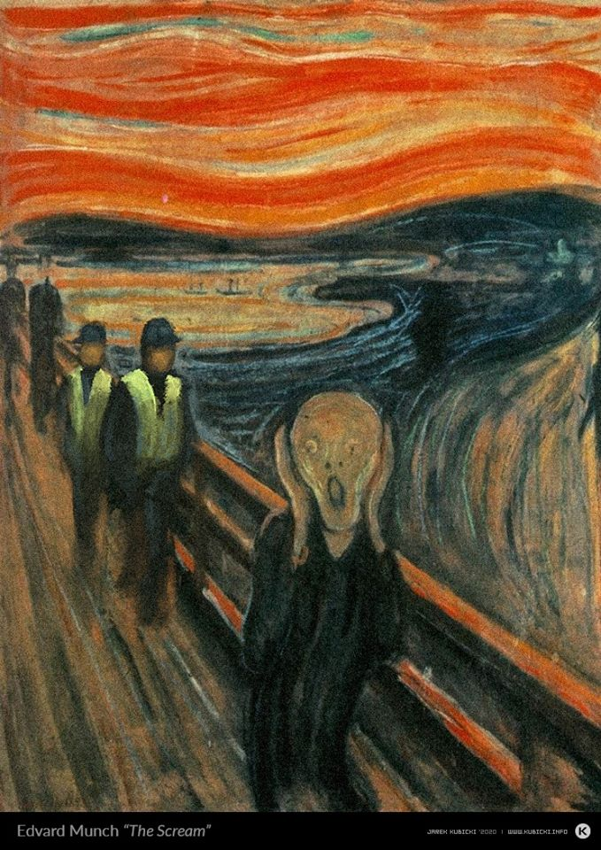
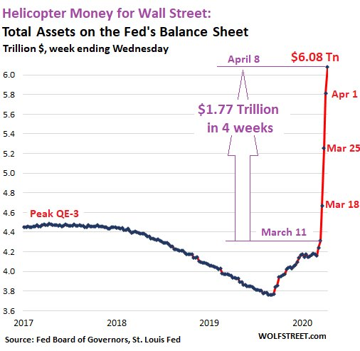

### 2020

#### Z tarczy antykryzysowej zniknęły kontrowersyjne przepisy

Z rządowego projektu nieoczekiwanie zniknęły przepisy krytykowane przez ekspertów i opozycję. Rozszerzenie zwolnień ze składek ZUS i nowy zasiłek dla rolników w kwarantannie – to najważniejsze założenia nowej tarczy antykryzysowej, którą w środę zajmował się Sejm. Projekt rządowy powstawał w błyskawicznym tempie. Resorty swoje uwagi zgłaszały w weekend, a do parlamentu dokument trafił we wtorek. I zaszły w nim znaczące zmiany. Wyparowały albo znacząco zmieniły się przepisy krytykowane jako groźne dla swobód obywatelskich.

Jednym z kontrowersyjnych pomysłów, które pojawiły się na etapie prac w rządzie, było upowszechnienie przesyłek pocztowych hybrydowych. Już w niedzielę „Rzeczpospolita” alarmowała, że Poczta Polska miałaby otwierać, skanować i wysyłać w formie elektronicznej listy bez zgody adresata. Z projektu wynikało, że miałoby to miejsce m.in. w przypadku przesyłek w postępowaniach administracyjnych, gdzie od daty doręczenia biegną terminy. Z kolei w przypadku m.in. postępowań egzekucyjnych, karnych i karnoskarbowych zgodę na skanowanie listów miałby wyrażać nie adresat, lecz sąd.

---

  

---

  

---

Things to know.

By now you should realize Tax is a joke. We are entering MMT where there is no debt.

The fed is buying all junk bonds.

Bailing out corporate America.

And printing unlimited money.

<!-- Tax in MMT system is plain slavery. -->

When they can literally print what ever they want!

Banks no longer need any reserves 0% now

Fed is buying junk Bonds

Fed is thinking of buying equities

Trillion being printed

Opening talking about MMT (meaning no collateral(Bonds T-bills) to print money

Hedge funds being saved.

And I can keep going on and on.

What you call this is Socialism for the elites

While ppl pay tax and get Inflation

Short term US Dollar is strongest (Look up Milkshake theory)

Long term Inflation

What can you do?

Real estate will not be safe anymore.

Your cash is Trash

Your pension is trash

So then what?

<!-- Buy Physical Gold

Buy Bitcoin -->

### 1870

https://pl.wikipedia.org/wiki/W%C5%82odzimierz_Lenin

https://en.wikipedia.org/wiki/Lenin%27s_Testament

---

<a href="https://github.com/TomaszWaszczyk/historia.waszczyk.com/edit/master/src/content/april-10.md" target="_blank">Edytuj tę stronę dzieląc się własnymi notatkami!</a>
