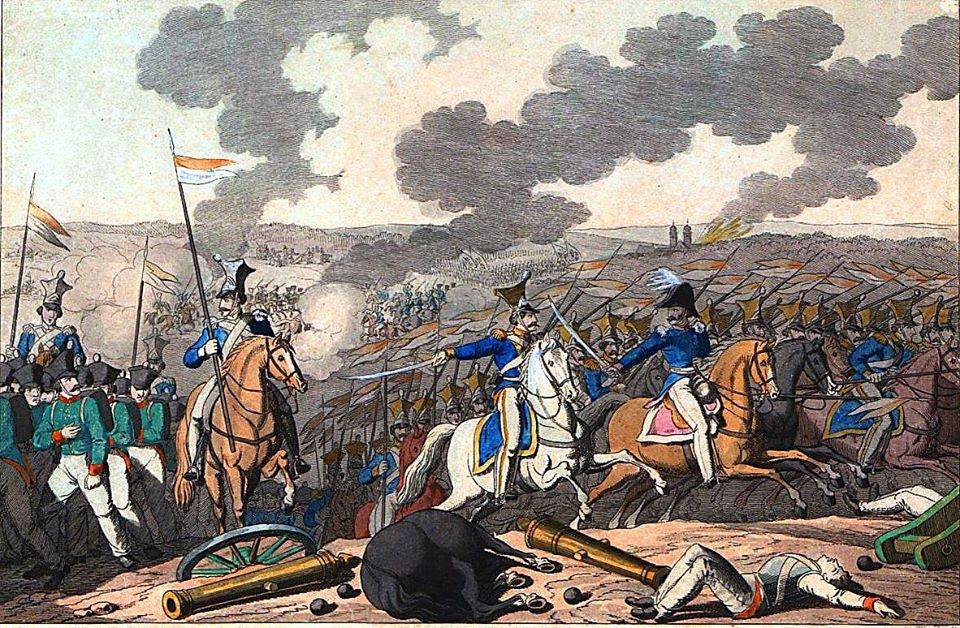

### 2022

Paweł Rybicki:

> Rosjanie przy granicy z Ukrainą fetują swoich sołdatów jadących mordować i rabować Ukraińców. To tyle w sprawie „co myślą wykli rosjanie”

<video width="640" height="480" controls>
<source src="./movies/april/rosjaniecieszasie.mp4" type="video/mp4">
Your browser does not support the video tag.
</video>

### 2020

#### Z tarczy antykryzysowej zniknęły kontrowersyjne przepisy

Z rządowego projektu nieoczekiwanie zniknęły przepisy krytykowane przez ekspertów i opozycję. Rozszerzenie zwolnień ze składek ZUS i nowy zasiłek dla rolników w kwarantannie – to najważniejsze założenia nowej tarczy antykryzysowej, którą w środę zajmował się Sejm. Projekt rządowy powstawał w błyskawicznym tempie. Resorty swoje uwagi zgłaszały w weekend, a do parlamentu dokument trafił we wtorek. I zaszły w nim znaczące zmiany. Wyparowały albo znacząco zmieniły się przepisy krytykowane jako groźne dla swobód obywatelskich.

Jednym z kontrowersyjnych pomysłów, które pojawiły się na etapie prac w rządzie, było upowszechnienie przesyłek pocztowych hybrydowych. Już w niedzielę „Rzeczpospolita” alarmowała, że Poczta Polska miałaby otwierać, skanować i wysyłać w formie elektronicznej listy bez zgody adresata. Z projektu wynikało, że miałoby to miejsce m.in. w przypadku przesyłek w postępowaniach administracyjnych, gdzie od daty doręczenia biegną terminy. Z kolei w przypadku m.in. postępowań egzekucyjnych, karnych i karnoskarbowych zgodę na skanowanie listów miałby wyrażać nie adresat, lecz sąd.

---

  

---

  

---

Things to know.

By now you should realize Tax is a joke. We are entering MMT where there is no debt.

The fed is buying all junk bonds.

Bailing out corporate America.

And printing unlimited money.

<!-- Tax in MMT system is plain slavery. -->

When they can literally print what ever they want!

Banks no longer need any reserves 0% now

Fed is buying junk Bonds

Fed is thinking of buying equities

Trillion being printed

Opening talking about MMT (meaning no collateral(Bonds T-bills) to print money

Hedge funds being saved.

And I can keep going on and on.

What you call this is Socialism for the elites

While ppl pay tax and get Inflation

Short term US Dollar is strongest (Look up Milkshake theory)

Long term Inflation

What can you do?

Real estate will not be safe anymore.

Your cash is Trash

Your pension is trash

So then what?

<!-- Buy Physical Gold

Buy Bitcoin -->

---

  

---

### 2010

  

### 1870

https://pl.wikipedia.org/wiki/W%C5%82odzimierz_Lenin

https://en.wikipedia.org/wiki/Lenin%27s_Testament

### 1831

Powstanie listopadowe: Gen. Ignacy Prądzyński pokonał 10 kwietnia 1831 r. rosyjski korpus gen. Grigorija Rosena w bitwie pod Iganiami. Powstańcza armia polska, ze względu na kunktatorską postawę wodza naczelnego gen. Jana Skrzyneckiego, nie potrafiła wykorzystać sukcesu odniesionego na polu bitwy.

Dla stłumienia powstania listopadowego, 5 lutego 1831 r. do Królestwa Polskiego wkroczyła licząca 115 tys. żołnierzy armia carska pod dowództwem feldmarszałka Iwana Dybicza. Najsilniejszy jej trzon udało się powstrzymać w nierozstrzygniętej bitwie pod Grochowem 25 lutego 1831 r., po której Dybicz wycofał się spod Warszawy.

Po bitwie grochowskiej nowym wodzem naczelnym (w miejsce nieudolnego gen. Michała Radziwiłła) został gen. Jan Skrzynecki, związany politycznie z księciem Adamem Czartoryskim. Skrzynecki wsławił się w kampanii napoleońskiej w 1814 r. oraz w niedawnej potyczce powstania listopadowego pod Dobrem. Mimo że osobiście był bardzo dzielnym oficerem, jako wódz naczelny okazał się nieudolnym kunktatorem, prowadzącym ociężale armię polską, unikającym rozstrzygających bitew z głównymi siłami wroga.

Zakulisowo gen. Skrzynecki prowadził negocjacje z feldmarszałkiem Dybiczem, dotyczące możliwości zakończenia działań wojennych. Korespondencja z dowódcą rosyjskiej armii interwencyjnej - ujawniona 28 marca 1831 r. przez "Dziennik Powszechny Krajowy" - dowodziła, że wódz naczelny wojska polskiego przekroczył zakres swoich uprawnień.

Z wielkimi oporami gen. Skrzynecki przyjął, opracowany przez najzdolniejszego z polskich strategów, Ignacego Prądzyńskiego, plan wiosennej ofensywy. W jej wyniku armia polska już 31 marca pobiła wojska rosyjskie pod Wawrem oraz pod wsią Dębe Wielkie, gdzie przeciwnik stracił 7 tys. żołnierzy, ale gen. Skrzynecki wstrzymał pościg, pozwalając ujść carskiemu VI korpusowi.

10 kwietnia 1831 r. doszło do bitwy grupy gen. Ignacego Prądzyńskiego, składającej się z 11 tys. ludzi, z silnie uzbrojonym korpusem gen. Rosena, który wycofywał się w stronę Siedlec. Straty wojsk carskich wyniosły ok. 5 tys. żołnierzy, w tym ponad 3 tys. zabitych i rannych oraz ponad 1,5 tys. jeńców. Straty polskie wyniosły niewiele ponad 400 żołnierzy.

Obawiając się jednak wyniku ewentualnej walnej bitwy, gen. Skrzynecki znów wstrzymał działania armii polskiej i nakazał odwrót w stronę Warszawy.

Błędna decyzja wodza naczelnego spowodowała, że Polacy zatrzymali się w ataku na Siedlce, gdzie znajdowały się magazyny armii carskiej. Ich zdobycie dawało szansę na uzyskaniu kilku miesięcy przerwy w działaniach wojennych.

Generał Ignacy Prądzyński: Bitwa pod Iganiami

Przybywszy z 6 tys. wojska pod Iganie i mając przed sobą korpus Rozena zatrzymałem się w krzakach między trzęsawiskiem i Muchawcem, ustawiłem szeregi, pozwoliłem im spocząć przez chwilę po męczącym marszu, a sam z generałem Kickim i kilku oficerami starałem się rozpatrzeć w pozycyach Rosyan. Przed nami był cały korpus Rozena, wzmocniony już po porażce. Wieś zajmowała piechota. Liczna kawalerya w kilku liniach tworzyła prawe skrzydło i ciągnęła się aż do wiatraka. Jedna baterya artyleryi lekkiej była przed wsią, druga, słabsza, koło wiatraka. Front wojska rosyskiego rozwijał się prawie równolegle z szosą; skrzydło lewe wspierało się o Muchawiec, którego koryto szło z tyłu tego skrzydła. Po za tą błotnistą rzeczką stały rezerwy; oceniliśmy liczbę wojsk rosyjskich na 12 do 15 tysięcy.

Oddzielała nas równina. Widocznem było, że generał Rozen przyjmie bitwę jedynie w tym celu, aby osłonić przejście swoich oddziałów przez Kostrzyń. Spostrzegliśmy poza frontem rosyjskim artyleryę i bagaże przeciągające po szosie. Kicki, znajdując siły rosyjskie o wiele przeważniejszemi od naszych, był zdania, że powinniśmy się wycofać. Odwrót jednak był niemożliwym: byłby udaremnił całą naszą operacyę i naraził na niebezpieczeństwo korpus Łubieńskiego, który miał przejść przez Kostrzyń. Zresztą korpus ten, mający za chwilę ukazać się na tyłach nieprzyjaciela, tylko w takim razie mógł się przyczynić do kompletnego rozbicia generała Rozena i do zdobycia całej artyleryi, przeniesionej już po za rzekę, gdybym w chwili jego nadejścia walczył całą siłą.

Ta myśl, oraz widok oddziałów, które co chwila przechodziły rzekę, kierując się ku Siedlcom, zdecydowały mię tak, że dałem sygnał do ataku. Obawiając się przedewszystkiem, żeby moje skrzydło lewe nie zostało otoczonem przez liczną konnicę, stojącą na prawem skrzydle rosyjskiem, postanowiłem je odsunąć i oparłem je niedaleko krzaków i błota o wzgórki, na których ustawiłem swoje 4 armaty artyleryi pieszej.

Nie chciałem wreszcie prawego skrzydła rosyjskiego zmuszać do odwrotu; przeciwnie, miałem zamiar, rzuciwszy się na prawo, zająć jak najprędzej przejście przez rzeczkę, przeciąć tym sposobem możność odwrotu Rosyanom i ostatecznie zgnieść ich w chwili, gdy korpus Łubieńskiego stanowczo przechyli zwycięstwo na naszą stronę. Pułk czwarty przeznaczyłem na rezerwę dla skrzydła prawego, jak tylko nadejdzie.

Gdy wyszliśmy z krzaków, przyjęto nas ogniem dwóch bateryj. Bem rzucił się naprzód i odpowiedział ze swych dziesięciu armat, zająwszy odrazu pozycyę; ruch ten wykonał przepysznie. Podczas tej kanonady prawe skrzydło polskie, na którego krańcu znajdował się ósmy pułk liniowy pod dowództwem pułkownika Węgierskiego, wystąpiło do ataku kolumnami batalionowemu, poprzedzone przez tyralierów. Wkrótce i tu zaczęto strzelać. Wówczas Rosyanie na drugim brzegu Muchawca nagle odsłonili w kilku punktach baterye artyleryi ciężkiej, z których posypały się na linię polską pociski z boku, z ukosa a nawet z tyłu. Ogień ten nie był bynajmniej tak morderczym, jakim być powinien, pomimo tego jednak kule świdrujące nasze szeregi, granaty pękające wśród wojska wywarły ogromne wrażenie na żołnierzy.

Nie miałem już armat, ażeby je postawić naprzeciwko tych nowych bateryj; oderwać w, tym celu część tych, które były gdzieindziej zajęte, nie było można, gdyż przez to osłabłby atak, armaty zaś lekkie zwłaszcza na tak znaczną odległość nie zaszkodziłyby nic bateryom. Postanowiłem więc nie zwracać uwagi na to nowe niebezpieczeństwo i parłem wojska do ataku.

Wkrótce lekka artylerya rosyjska musiała się cofnąć za łganie. Część armat ugrzęzła; ósmy pułk polski zajął kraniec wsi i kawałek szosy. Kanonierzy rosyjscy, prażeni ogniem karabinowym na blizki dystans, uciekali ze swemi końmi; ugrzęzłe armaty dostały się do rąk naszych.

Wódz rosyjski zauważył, że wszystkie wojska, zgromadzone na lewym brzegu Muchawca znajdują się w niebezpieczeństwie; formuje więc kolumnę piechoty, którą miał na brzegu prawym; składały ją trzynasty i czternasty pułk jegrów, którzy, przybywszy z korpusem Pahlena 2, nie występowali jeszcze czynnie na tej wojnie i pałali chęcią odznaczenia się. Straszna ta kolumna przyspieszonym krokiem przebyła rzekę, zwróciła się na lewo i wpadła z impetem na pułk ósmy polski, zmieszany już po kilkogodzinnem walce. Palącą się wieś i ugrzęzłe armaty odzyskali znowu Rosyanie, którzy zwrócili się wówczas na prawe nasze skrzydło, obsypywane znowu pociskami z armat, stojacych za Muchawcem.

W tejże chwili nagle ustaje ogień artyleryi polskiej. Bem przybiega z wiadomością, że wyczerpał już całą swoją amunicyę. Pozycya moja stała się krytyczną, postanowiłem ocalić się jednym rzutem potężnym. Front kolumny musiał być zastosowany do szerokości miejsca, którem można było przejść przez rzekę; był więc szczupły, kolumna za to bardzo głęboka. Dowódca jej popełnił błąd, że nie sformował jej batalionami w chwili wyjścia z Igań, wyciągnęła się więc jeszcze bardziej w pościgu za Polakami.

Spostrzegłem tę omyłkę i postanowiłem z niej skorzystać. Poleciłem Kickiemu, aby nie przestawał się cofać w największym o ile możności porządku i pobiegłem do skrzydła lewego. Znalazłem tam piechotę sformowaną w czworoboki, której kazałem stanąć batalionami w ścieśnionej kolumnie, i poprowadziłem ją na prawe skrzydło rosyjskie. Kawalerya, która tam się znajdowała cofnęła się za wieś; poleciłem więc pułkownikowi Ramorino rzucić się dalej z pułkiem pierwszym liniowym i zająć dwór mocno obwarowany, leżący na krańcu wsi. Ramorino rozkaz ten spełnił; ja zaś na czele trzech batalionów pułku piątego, ustawionego gęstemi kolumnami, pędem zwróciłem się na prawo do przejścia przez rzekę.

Podczas gdy moi tyralierzy rozbiegli się po wsi. strzelając do Rosyan, pędziłem szybko przez wieś, zalecając swym żołnierzom, aby nie tracili czasu na strzelanie; posłuchali mnie i nie dali ani jednego wystrzału. Tymczasem kolumna rosyjska spostrzegła grożące jej niebezpieczeństwo; zatrzymała się i cofnęła, ale nie mogła mię już wyprzedzić. Spotkanie zaszło na szosy, zawiązała się mordercza bitwa na bagnety, w której Polacy zwyciężyli.

Kolumna rosyjska została złamana, wszystko, co szło na przedzie, dostało się do niewoli wraz z chorągwią. Część prawego skrzydła rosyjskiego wymknęła się przez przejście w Chodowie albo też uciekała wprost przez Muchawiec, gdzie wielu utonęło. Większą część jednak ugrzęzłych armat zdołano wyciągnąć. Jeden pułk, liczący wprawdzie nie więcej nad 500 ludzi, który zajmował pozycyę w Łączu, spóźnił się z odwrotem. Ponieważ łganie były już w rękach polskich, spotkawszy więc grenadyerów w blizkości szosy, złożył broń bez boju.

Relacya rosyjska określa straty w tej bitwie na 1.000 ludzi zabitych i ranionych; w tej liczbie było kilku oficerów wyższych i znaczna ilość niższych. Polacy wzięli do niewoli 2.000 jeńców, między którymi trzech pułkowników i wielu oficerów. Pułki trzynasty i czternasty były całkiem prawie zniesione. Szef tej brygady generał Dobrowolski i podpułkownik Zirkow, dowódca pułku czternastego otrzymali rany, dowódca pułku 13 pułkownik Bezsonow zabity uderzeniem bagnetu. Relacya mówi, że szczególnie odznaczyły się w tej bitwie trzynasty, czternasty, czterdziesty siódmy i czterdziesty ósmy pułk jegrów, jak również kawalerya Sieversa.

Bezstronność zmusza mię do zanotowania kilka razy postępków niezaszczytnych, dokonanych czy to przez Polaków czy też przez Rosyan. Jeśli mówiłem już i będę mówić jeszcze ze wstrętem o morderstwach, dokonanych przez kilku Polaków na ulicach Warszawy, to również muszę wspomnieć z całą otwartością o okrutnych postępkach ich przeciwników. Wchodząc do Igań, mieliśmy okropny widok świeżo pomordowanych mieszkańców i dzieci, oraz kobiet brzemiennych z powyprówanemi wnętrznościami. Takie jednak okrucieństwa nie leżały w naturze obu narodów, nieczęsto się więc powtarzały w ciągu tej nieszczęsnej wojny.

Bitwa pod Iganiami skończyła się pod wieczór i dopiero wówczas przybył Skrzynecki z korpusem Łubieńskiego; gdyby się nie był spóźnił o dwie godziny, Rożen zostałby zniesiony zupełnie; powtarzali to wszyscy i ogólnie szemrano na błąd, który do pewnego stopnia sparaliżował operacyę. Kto jednak był winowajcą tego? Naczelny wódz w swoim rozkazie dziennym zwalił całą winę na Stryjeńskiego i zrzucił go z dowództwa nad brygadą. Oficer ten domagał się kilka razy śledztwa, któreby wyjaśniło jego zachowanie się podczas bitwy, i za każdym razem żądanie jego pozostawało bez odpowiedzi.

Tymczasem istotnie rzecz się miała tak: Naczelny wódz, z natury niedbały i nie umiejący w czasie całej kampanii obejść się bez wygód, do których przywykł, zamiast wyjść z Latowicza w nocy, jak to było postanowionem, wyruszył dopiero 29 marca (10 kwietnia) dość późno. Przybył późno do Łubieńskiego, którego wojska oczekiwały pod bronią na zajętych dawniej rozmaitych pozycyach.

Skrzynecki, jak tylko przyjechał tam, do tego powozem, skarżył się na ogromne znużenie i nie wydawszy żadnej dyspozycyi, nie rozpytawszy nawet, jak są rozstawione wojska, udał się do wsi, leżącej o kilka wiorst dalej, gdzie zjadł śniadanie i położył się spać. Podczas tego, gdy Skrzynecki spał, rozpoczęliśmy bitwę pod Iganiami; ci, co z nim byli, słyszeli dokładnie każdy wystrzał armatni, widzieli nawet kuryera wysłanego do oddziału rosyjskiego, który stał nad Kostrzyniem i wymieniwszy kilka wystrzałów z naszą artyleryą ustąpił.

Łubieński o wszystkiem zawiadomił Skrzyneckiego, który przybył nareszcie do wojska, ale nie miał żadnych gotowych materyałów do urządzenia przejścia przez Kostrzyń, kawaleryi zaś nie zgromadził u brodu w Suchej. Wówczas dopiero naczelny wódz zabrał się do budowy mostu i posłał spiesznie Stryjeńskiego do Suchej, zapomniawszy dać mu jakąkolwiek instrukcyę. Stryjeński przebył rzekę, spotkawszy zaś kawaleryę rosyjską, bał się ją zaczepiać i nie wiedząc, co dalej robić, posłał po instrukcye. Tym sposobem zaniedbaliśmy skorzystać z dobrej sposobności.

Feldmarszałek tymczasem kazał zniszczyć wszystkie przygotowania, uczynione już do przejścia przez Wisłę z ogromnym wysiłkiem wojsk rosyjskich i wyruszył ze swą armią, aby zająć szosę, oraz marszem flankowym połączyć się z Rozenem. Parki artyleryi zostały skierowane przez Łuków do Siedlec; kolumny wojska obrały sobie drogę krótszą, przez Rózę. W sam dzień bitwy Igańskiej kolumna, idąca z Żelechowa do Stoczka spotkała Skarzyńskiego, którego groźna postawa skłoniła ją do nagłej zmiany kierunku na prawo i do udania się przez Lipniak do Dembia, gdzie się zatrzymała, osłaniając pochód kolumn innych, które zrobiły ogromne koło, idąc przez Żelechów do Łukowa. Kilka oddziałów, oraz znaczna ilość pojedynczych żołnierzy, amunicyi i bagaży, zdążających w kierunku, nakreślonym początkowo dla wojsk wszystkich wpadły same przez się w ręce Polaków. Główna kwatera feldmarszałka przybyła w dniu 30 marca (11 kwietnia) do Siedlec, gdzie w nocy skoncentrowała się cała armia. Być może, iż armia polska mogła była jeszcze wczesnym rankiem uprzedzić feldmarszałka w zajęciu tego miasta i odrzucić go do Międzyrzecza.

Ignacy Prądzyński "Pamiętnik historyczny i wojskowy o wojnie polsko-rosyjskiej w roku 1831"

Polacy spędzili noc w Iganiach, liczba ich wojsk podwoiła się i prawie cała armia mogła się skoncentrować tegoż samego dnia. Ale ani te kombinacye, ani widok pola bitwy, pokrytego trofeami, ani wzgląd na szczupłość sił Rozena nie zdołały skłonić Skrzyneckiego do żadnego kroku, któryby nam pozwolił skorzystać z wczorajszego zwycięstwa. Odjechał natychmiast w celu założenia swej głównej kwatery w Jędrzejowie między Mińskiem i Kałuszynem, poleciwszy wojsku cofnąć się nocną porą poza Kostrzyń.

Tym sposobem bitwa pod Iganiami stała się epizodem, który nie wywarł żadnego wpływu na bieg całej wojny. Trzy lub cztery tysiące więcej czy mniej w armii rosyjskiej nie mogły wpłynąć na ostateczny wynik walki. Pojedyncze zwycięstwo o tyle tylko ma znaczenie, o ile kto umie z niego skorzystać.

Bez wątpienia więc nie warto szafować krwią i narażać się na bitwę tylko dla przyjemności jej wygrania bez zamiaru korzystania ze zwycięstwa. W każdym jednak razie, gdyby Skrzynecki nie zmarnował kilku dni w Latowiczu z powodu swego wahania się, gdyby był odrazu się zdecydował na wyprawę przeciw generałowi Rozenowi, w chwili gdy mu rzucono tę propozycyę, wówczas za jednym zamachem korpus rosyjski byłby zniesiony, a armia feldmarszałka odparta do Międzyrzeca, może nawet za Bug. Ale właśnie naczelny wódz podczas trwania całej wojny nie miał pojęcia o tem, co to jest korzystać ze sposobnej chwili.

Ignacy Prądzyński "Pamiętnik historyczny i wojskowy o wojnie polsko-rosyjskiej w roku 1831" Kraków; Kazimierz Grendyszyński, 1894 (Kraków : W. L. Anczyc i Spółka) - ze zbiorów Biblioteki Narodowej.

  

### 1782

Król Polski Stanisław August Poniatowski (grafika) powołał Komisję Kruszcową- organ, który pełnił funkcję służby geologiczno - górniczej.
Do jej głównych zadań należało bicie monety narodowej oraz poszukiwanie pokładów rud metali, soli kamiennej oraz węgla, a w dalszym czasie złóż bogactw utraconych na skutek I rozbioru Polski.

  

---

<a href="https://github.com/TomaszWaszczyk/historia.waszczyk.com/edit/master/src/content/april-10.md" target="_blank">Edytuj tę stronę dzieląc się własnymi notatkami!</a>
