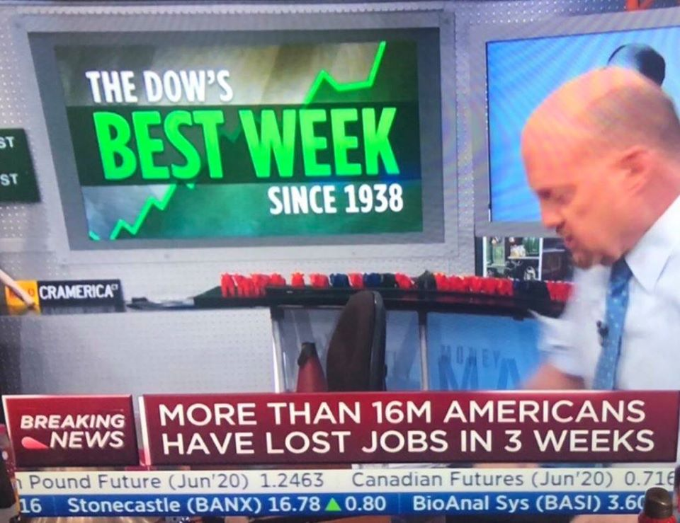
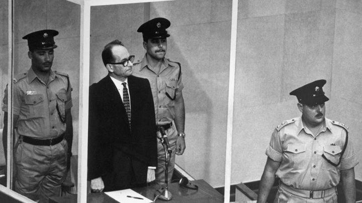
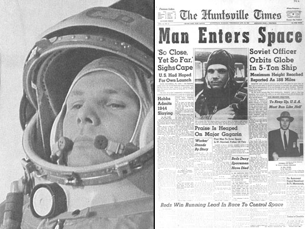
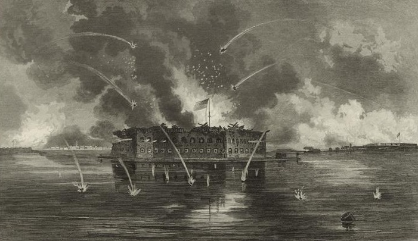

### 2020

Produkować, aby konsumować, i konsumować, aby produkować: nasza współczesna cywilizacja oferowała beznadziejny spektakl amoku bez końca. I nagle wirus zatrzymał ten chocholi taniec – mówi Jędrzejowi Bieleckiemu francuski filozof Alain Finkielkraut.

Wychodzi na to, ze jeżeli ludzie kupują tylko to co na prawdę potrzebują do życia to mamy kryzys finansowy. Cała gospodarka opiera się na niepotrzebnych rzeczach i usługach 🙂

  

<a href="./documents/april/Alert-Gospodarczy-4-OEES.pdf" target="_blank">Alert gospodarczy</a>

...lepiej nie da się podsumować...

  

### 1961

W Izraelu rozpoczął się proces nazistowskiego zbrodniarza wojennego Adolfa Eichmanna.

Od połowy 1941 roku kierując referatem do spraw wysiedleń ludności polskiej i żydowskiej z ziem wcielonych do Rzeszy koordynował i kierował wraz z Rudolfem Hössem ostateczną eksterminacją Żydów. W maju 1945 roku przybrał tożsamość szeregowca Luftwaffe Adolfa Karla Bartha, później podszył się pod nazwisko porucznika 22 dywizji kawalerii Waffen-SS Ottona Eckmenna i pod tym nazwiskiem został osadzony w obozie jenieckim. Kiedy jego prawdziwe nazwisko pojawiło się w Procesie Norymberskim, uciekł z amerykańskiego obozu internowania i jako Otto Heninger ukrywał się do 1950 roku w Zelle w Dolnej Saksonii. Po wyjeździe do Argentyny, otrzymał w dniu 4 kwietnia 1952 roku tamtejszy dowód osobisty na nazwisko Ricardo Klementa, kawalera, urodzonego w Bolzano, z zawodu mechanika.

Późną jesienią 1957 roku Harel Isser – kierujący m.in. Mosadem, otrzymał wiadomość od doktora Fritza Bauera – prokuratora generalnego Hesji, że Eichmann żyje i ukrywa się w Argentynie. Wcześniej mówiono, że zamieszkuje na terenie Syrii, Egiptu, a nawet Kuwejtu.

Jego trzech synów i żona zamieszkiwali w Austrii, ale w kilka lat później wyemigrowali do Argentyny, gdzie Vera Liebl wyszła fikcyjnie za mąż za noszącego inne nazwisko Eichmanna. Zanim doszło do wyjazdu w 1951 roku, Eichmann wysłał do żony list, informując, że „wuj, którego uważała za zmarłego, żyje”. Vera Liebl rozpoznała pismo męża. 

Na ślad hitlerowskiego zbrodniarza naprowadził prokuratora Bauera niemiecki emigrant Lotharem Hermaneu, który wiedział, że Adolf Eichmann jest na liście poszukiwanych. Jego córka Sylwia spotykała się z młodym człowiekiem o imieniu Nick. Kiedy podał jej swoje prawdziwe nazwisko, wszystko stało się jasne. 

Eichmann początkowo pracował w mało znanym przedsiębiorstwie budowlanym Capri, a następnie próbował otworzyć pralnię, szukał zatrudnienia na farmie królików, by ostatecznie zostać brygadzistą w zakładach Mercedes- Benz w Suarez. 

Obawy prokuratora generalnego Hesji powodowały, że nie wystąpił on o ekstradycję Eichmanna, obawiając się, że pracownicy Ambasady mogą ostrzec go przed ewentualnym zatrzymaniem. Informacje przekazał Masadowi. Na początku stycznia 1958 roku agent tego wywiadu Emmanuel Talmor sprawdzał rzetelność informacji. Wątpliwości jego wywoływało zamieszkiwanie zbrodniarza w ubogiej robotniczej dzielnicy przy ulicy Calle Chacabuco. Jakby przeczuwając ewentualne poszukiwania, rodzina Eichmanna przeprowadziła się na drugi koniec Buenos Aires na ulice Calle Garibaldi. 

Agent Mosadu Zwi Ahoroni, przedstawiający się jako przedstawiciel amerykańskiej firmy produkującej maszyny do szycia, wszedł do domu Klementów. 21 marca 1958 roku przypadała dwudziesta piąta rocznica ślubu Eichmanów. Zrobione przez Aharoniego w czasie tej uroczystości zdjęcia, pokazały szczupłego, łysiejącego mężczyznę o wąskich wargach, z wąsami i dużym nosem, na którym były posadowione okulary. Wątpliwości ustąpiły.

Premier i Minister Obrony Izraela Ben Gurion zdecydował: „sprowadźcie Eichmanna żywego lub martwego”. 20 maja 1958 roku Argentyna miała obchodzić sto pięćdziesiątą rocznicę odzyskania niepodległości. Swój przyjazd zapowiedziała między innymi delegacja izraelska z ministrem edukacji Abbą Ebanem na czele. Linie lotnicze EL AL oddały do dyspozycji delegacji specjalny samolot – Britannię „Szepczący olbrzym”. Rozpoczęła się operacja „Eichmann”. 

Lot nr 601 miał odbyć się w dniu 11 maja. Załoga samolotu została dobrana bardzo starannie. Kapitanowi Zwiemu Toharowi polecono zabranie wysoko wykwalifikowanego mechanika na wypadek, gdyby musiał startować bez pomocy argentyńskich służb naziemnych. W dniu 1 maja o świcie szef Mosadu wylądował w Buenos Aires z europejskim paszportem. 

Codziennie rano przez wszystkie dni pobytu, do czasu rozpoczęcia akcji, wychodząc na spacer przemieszczał się do trzystu różnych kawiarni, w dniach i godzinach ich otwarcia, w celu spotkania się z agentami. 11 maja o godzinie 19:35 samochody wypożyczone z ogólnodostępnych garaży, czarny chevrolet sedan i czarny buick, zaparkowały niedaleko domu Eichmanna. O godzinie 20:05 wysiadł on z autobusu i w takcie drogi został wciągnięty do chevroleta. Padły tylko słowa: „jeden ruch i zginiesz”. Po przywiezieniu do „bazy” sprawdzono tatuaż z grupą krwi, powszechny wśród esesmanów. Pytania padały po niemiecku. Eichmann podał bezbłędnie numer legitymacji nazistowskiej 45326 oraz SS-63752.

„Jestem Adolf Eichmann. Wiem, że jestem w rękach Izraelczyków. Znam trochę hebrajski, ponieważ uczyłem się go z Rabinem w Warszawie”. Cytował wersety z Biblii. Podpisał oświadczenie, że zgadza się wyjechać do Izraela, gdzie zostanie wytoczony mu proces. 19 maja 1958 roku samolot EL AL wylądował w Buenos Aires. Czas wylotu do Izraela ustalono o północy dnia następnego. Eichmann miał zostać wniesiony na pokład samolotu w mundurze jako członek załogi, który nagle zachorował. Dokumenty przygotowano perfekcyjnie na nazwisko Ze’ewe Zichroni. Twarz została tak ucharakteryzowana, że nie rozpoznaliby go nawet najbliżsi. Zachowano procedury odprawowe agentów, którzy wsiadali na pokład samolotu jako pasażerowie. Na moment przed startem wieża kontroli lotów nakazała jednak wstrzymanie  lotu. Obawiano się najgorszego i przygotowywano wariant awaryjny, ale nie zaszła potrzeba wprowadzenia go życie. Wynikało to ze stosunkowo długiego przetrzymywania w Argentynie i wszczętych poszukiwaniach zaginionego. Wczesnym rankiem 22 maja samolot wylądował na lotnisku LOD.

Eichmann trafił do dużego więzienia w Camp Iyar nieopodal Hajfy. Zajmował celę o wymiarach 3 na 4 metry, umeblowaną pryczą, stołem i krzesłem. Obok celi była łazienka z toaletą. Światło elektryczne włączone było na stałe. Na czas pobytu „szczególnego więźnia” inne cele zostały opróżnione. W bloku stale przebywało 30 policjantów oraz oddział straży granicznej. Do służby nie dopuszczono nikogo, kto w Holokauście utracił bliskich, aby nie doszło do aktu zemsty. 

Więźnia przesłuchiwał kapitan policji Arner Less, który uciekł z Niemiec jako nastolatek, po dojściu Hitlera do władzy. Jego ojciec, berliński przedsiębiorca, kawaler Krzyża Żelaznego za służbę w pierwszej wojnie światowej, zginął w komorze gazowej w Auschwitz. Less żartował, że zaszczytna służba ojca w czasie wojny sprawiła, że otrzymał przywilej bycia ostatnim wywiezionym z Berlina, a zatem ostatnim, którego zlikwidowano. 

Gdy w trakcie prowadzonych przesłuchań zorientował się, że więzień jest nałogowym palaczem, zastosował taktykę Jana Sehna przesłuchującego Rudolfa Hössa, uzyskując dla niego zwiększony przydział papierosów. Eichmann stawał się wówczas rozmowniejszy i bardziej skoncentrowany na faktach. 

Gdy szef Mosadu zameldował premierowi, że Eichmann jest w Izraelu, ten podobno nie okazał żadnych emocji, chociaż relacje dziennikarskie były inne. Dokonano ponownej identyfikacji tego nazistowskiego zbrodniarza. Słowa Ben Guriona o postawieniu go przed sądem wygłoszone na sesji plenarnej Knesetu o godz. 16:00 wywołały wstrząs i niedowierzanie. Minister Sprawiedliwości Pinhas Rosen reprezentował stanowisko, aby nie ujawniać szczegółów zatrzymania, stwierdzając równocześnie, że obrońcą zostanie każdy wskazany przez Eichmanna adwokat i koszty tej obrony w całości pokryje rząd Izraela. Eichmann wskazał na osobę Roberta Servantiusa, znanego kolońskiego adwokata, który był członkiem zespołu obrońców podczas Procesu Norymberskiego. 

Szef Mosadu Isser Harel, relacjonując zachowanie Eichmanna w więzieniu stwierdził: „On nie rozumie naszego zachowania. Sądził, że będziemy go bić i traktować okrutnie. My traktujemy go zgodnie z prawami obowiązującymi w naszym państwie.”. Społeczność międzynarodowa potępiła jednak działania Izraela, a argentyński Minister Spraw Zagranicznych żądał wyjaśnień i wydania Eichmanna. Pod apelami do Izraela, aby zrezygnował on z procesu, podpisywali się prominentni Żydzi z całego świata, a Amerykański Komitet Żydowski zorganizował nawet grupę doświadczonych prawników. Wszystkie wnioski zmierzały do stwierdzenia, aby Izrael przeprowadził dochodzenie, ale dowody i oskarżonego przekazał Trybunałowi Międzynarodowemu. 

Proces rozpoczął się 11 kwietnia 1961 roku w Jerozolimie. Oskarżający prokurator generalny Gideon Hausner w mowie wstępnej procesu stwierdził: „wraz ze mną, w tym miejscu i o tej godzinie staje sześć milionów oskarżycieli. Nie mogąc jednak przybyć powinni krzyknąć oskarżamy”. Ta wypowiedź zdominowała całe postępowanie sądowe. Zebrany materiał dowodowy – osobowy zamykał się na 3564 stronach akt. Zawnioskowano do bezpośredniego przesłuchania przed sądem stu dziewięćdziesięciu świadków ocalałych z Holokaustu. 15 grudnia 1961 roku Eichmann został skazany na śmierć przez powieszenie, co było pierwszym i jedynym przypadkiem wydania przez izraelski sąd takiego orzeczenia. Odrzucono apelację, a prezydent Icchak Ben Zwi nie skorzystał z prawa łaski. 31 maja 1962 roku Adolf Eichmann usłyszał, że wyrok w jego sprawie jest prawomocny. Po stwierdzeniu prawomocności spieszono się z egzekucją, bowiem władze obawiały się, że w każdej chwili neonaziści niemieccy mogą dokonać porwania dzieci żydowskich, domagając się ich wymiany za Eichmanna. 

Po powrocie do celi skazany napisał kilka listów do rodziny i wypił pół butelki czerwonego wina Carmel. Przed północą do celi przyszedł nonkonformistyczny pastor Hull. Skazany powiedział do niego: „Nie będę dzisiaj z panem dyskutował o Biblii. Nie mam wiele czasu do stracenia.”. W celi pojawił się następnie Rafi Eitan – agent Mosadu, który ujął zbrodniarza. Ten spojrzał na niego i powiedział po niemiecku: „Mam nadzieję, że będziesz następny.”.

Eichmanna zaprowadzono do sali straceń, gdzie wypowiedział ostatnie słowa zgodnie z nazistowską tradycją: „Spotkamy się ponownie. Żyłem wierząc w Boga, posłuszny prawom wojny i wierny fladze. Niech żyją Niemcy, Austria i Argentyna.”. Za parawanem dwaj oficerowie policji jednocześnie nacisnęli swoje przyciski, ale tylko jeden był podłączony do zapadni, aby nazwisko kata pozostało nieznane. Na wykonawcę „technicznego” wyroku wyznaczono Shalma Nagara, dwudziestoletniego jemeńskiego Żyda. W ostatniej woli skazaniec poprosił o białe wino i odmówił założenia worka na szyję. Uznano ten gest za oznakę, że nie boi się swojego losu. 

Aby być zgodnym z faktami, to muszę podać, że niektórzy ze świadków egzekucji twierdzili, że to Nagar zwolnił dźwignię szubienicy, a pozostali mieli spowodować, że czuje się on zwolniony z egzekucji, którą uznawano za zemstę.

Przygotowując zwłoki do kremacji Shalom Nagar nie wiedział, że u uduszonej osoby w płucach pozostaje powietrze. Gdy uniósł zwłoki do góry wydobyło z nich się ono prosto w jego twarz. Odgłos, jak wspomina był koszmarny „grrrreerrerere”, co brzmiało jak „Jemeńczyku”. Prochy Eichmanna rozsypane zostały w Morzu Śródziemnym poza wodami terytorialnymi Izraela. Rozmyły się szczątki człowieka, który dwadzieścia lat wcześniej oświadczył bezlitośnie: „Z uśmiechem położę się do grobu, szczęśliwy, że przy moim udziale usuniętych zostało sześć milionów Żydów.”. Brak skruchy był widoczny, gdy oskarżenie przygotowało w trakcie procesu film o zbrodniach oskarżonego. W czasie projekcji zaczął on reagować widocznym wzburzeniem w stosunku do naczelnika więzienia. Okazało się, że film pokazujący komory gazowe i stosy zwłok nie wywołał u niego żadnego pozytywnego odruchu. Podenerwowanie wywołał fakt, że na rozprawę doprowadzono go w swetrze i szarym garniturze, a nie granatowym, który lubił.

  

---

  

April 12 was already a huge day in space history twenty years before the launch of the first shuttle mission. On that day in 1961, Russian cosmonaut Yuri Gagarin (left, on the way to the launch pad) became the first human in space, making a 108-minute orbital flight in his Vostok 1 spacecraft. Newspapers like The Huntsville Times (right) trumpeted Gagarin's accomplishment.

Mercury astronaut Alan Shepard became the first American in space less than a month later.

The first cooperative human space flight project between the United States and the Soviet Union took place in 1975. The Apollo-Soyuz Test Project was designed to test the compatibility of rendezvous and docking systems for American and Soviet spacecraft and to open the way for future joint manned flights.

Since 1993, the U.S. and Russia have worked together on a number of other space flight projects. The Space Shuttle began visiting the Russian Mir space station in 1994, and in 1995 Norm Thagard became the first U.S. astronaut to take up residency on Mir. Seven U.S. astronauts served with their Russian counterparts aboard the orbiting Mir laboratory from 1995 to 1998. The experience gained from the Mir cooperative effort, as well as lessons learned, paved the way for the International Space Station.

In-orbit construction on the Station began in November 1998, and it has been staffed non-stop with international crews since November 2000. The first Station crew, made up of U.S. commander Bill Shepherd and cosmonauts Yuri Gidzenko and Sergei Krikalev, was launched on board a Russian Soyuz spacecraft. The crew returned to Earth on the Space Shuttle Discovery in March 2001.

---

### 1861

Rozpoczyna się ostrzał Fortu Sumter w Karolinie Południowej, pierwsze starcie inicjujące wojnę secesyjną.

Dnia 10 kwietnia 1861 generał Pierre G.T. Beauregard dowodzący siłami Skonfederowanych Stanów Ameryki, stacjonującymi pod Charleston, zażądał poddania się garnizonu Unii z Fort Sumter. Major Robert Anderson, dowódca załogi, odrzucił to żądanie.

W obliczu odmowy 12 kwietnia 1861 Konfederaci rozpoczęli ostrzał artyleryjski fortu, z którym obrońcy nie byli w stanie sobie poradzić. Major Anderson 13 kwietnia o 14:30 zdecydował o kapitulacji bronionej placówki wojskowej. Unioniści opuścili ją następnego dnia. Żadna ze stron nie odnotowała strat w czasie walk. Śmierć poniosło dwóch żołnierzy Unii, a dwóch zostało rannych podczas ewakuacji 14 kwietnia w wyniku eksplozji jednego z dział.

  

---

<a href="https://github.com/TomaszWaszczyk/historia.waszczyk.com/edit/master/src/content/april-12.md" target="_blank">Edytuj tę stronę dzieląc się własnymi notatkami!</a>
