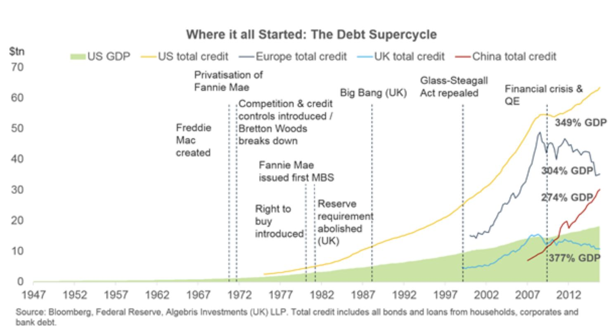
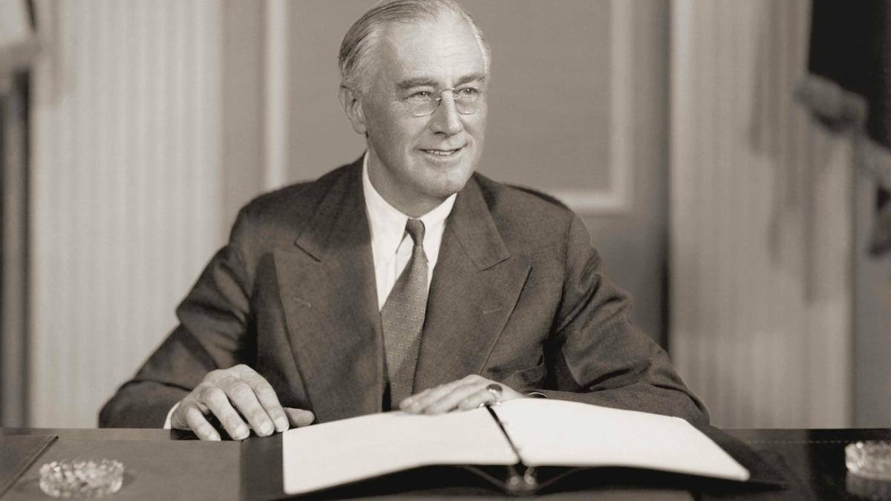

### 2023

The debt supercycle was born: between the 1960s and up to the 2008 crisis, total private debt outgrew GDP by four. Other countries mirrored the same subsidies and financial deregulation measures that supported credit growth in the US. The United Kingdom abolished bank reserve requirements in 1981, and in 1986 the City of London launched its Big Bang expansion plan. Others followed, and private debt caught up with US levels in Europe and most recently in China, where a government-led stimulus plan has doubled credit since 2008.

Let them eat debt policies remain popular today, as the 2007/8 GFC central bank induced crisis repeats yet one more time...

Put simply, corporates, households, banks and governments remain overburdened by the existing stock of debt, the engine of credit creation has broken beyond repair, we need to change our thinking of how the real world works and its relationship to central banking fiat-money as "ever increasing" debt.

Only a complete economic simpleton could believe that Japan total debt to GDP% of 1325.8% , UK total debt % to GDP of 1069.7% and US 765% of GDP and EU 807% of GDP is anything other than pixie dust economics in 2023.

It’s not too late to move, to a debt-free sound money system, based upon surplus production in the real world…

  

### 2022

Fabryki BOSCHa w Suzhou stanęły, podrożeją amortyzatory i hamulce

  

---

Z szacunków japońskiego banku inwestycyjnego Nomura wynika, że częściowy lub pełny lockdown wprowadzono w 45 miastach w Chinach, w których zamieszkuje 26,4% ludności i które wytwarzają 40,3% PKB kraju.

---

### 2020

Produkować, aby konsumować, i konsumować, aby produkować: nasza współczesna cywilizacja oferowała beznadziejny spektakl amoku bez końca. I nagle wirus zatrzymał ten chocholi taniec – mówi Jędrzejowi Bieleckiemu francuski filozof Alain Finkielkraut.

Wychodzi na to, ze jeżeli ludzie kupują tylko to co na prawdę potrzebują do życia to mamy kryzys finansowy. Cała gospodarka opiera się na niepotrzebnych rzeczach i usługach 🙂

  

<a href="./documents/april/Alert-Gospodarczy-4-OEES.pdf" target="_blank">Alert gospodarczy</a>

...lepiej nie da się podsumować...

  

### 1991

Powstaje Giełda Papierów Wartościowych w Warszawie, cztery dni później ma miejsce pierwsza sesja.

### 1961

W Izraelu rozpoczął się proces nazistowskiego zbrodniarza wojennego Adolfa Eichmanna.

Od połowy 1941 roku kierując referatem do spraw wysiedleń ludności polskiej i żydowskiej z ziem wcielonych do Rzeszy koordynował i kierował wraz z Rudolfem Hössem ostateczną eksterminacją Żydów. W maju 1945 roku przybrał tożsamość szeregowca Luftwaffe Adolfa Karla Bartha, później podszył się pod nazwisko porucznika 22 dywizji kawalerii Waffen-SS Ottona Eckmenna i pod tym nazwiskiem został osadzony w obozie jenieckim. Kiedy jego prawdziwe nazwisko pojawiło się w Procesie Norymberskim, uciekł z amerykańskiego obozu internowania i jako Otto Heninger ukrywał się do 1950 roku w Zelle w Dolnej Saksonii. Po wyjeździe do Argentyny, otrzymał w dniu 4 kwietnia 1952 roku tamtejszy dowód osobisty na nazwisko Ricardo Klementa, kawalera, urodzonego w Bolzano, z zawodu mechanika.

Późną jesienią 1957 roku Harel Isser – kierujący m.in. Mosadem, otrzymał wiadomość od doktora Fritza Bauera – prokuratora generalnego Hesji, że Eichmann żyje i ukrywa się w Argentynie. Wcześniej mówiono, że zamieszkuje na terenie Syrii, Egiptu, a nawet Kuwejtu.

Jego trzech synów i żona zamieszkiwali w Austrii, ale w kilka lat później wyemigrowali do Argentyny, gdzie Vera Liebl wyszła fikcyjnie za mąż za noszącego inne nazwisko Eichmanna. Zanim doszło do wyjazdu w 1951 roku, Eichmann wysłał do żony list, informując, że „wuj, którego uważała za zmarłego, żyje”. Vera Liebl rozpoznała pismo męża. 

Na ślad hitlerowskiego zbrodniarza naprowadził prokuratora Bauera niemiecki emigrant Lotharem Hermaneu, który wiedział, że Adolf Eichmann jest na liście poszukiwanych. Jego córka Sylwia spotykała się z młodym człowiekiem o imieniu Nick. Kiedy podał jej swoje prawdziwe nazwisko, wszystko stało się jasne. 

Eichmann początkowo pracował w mało znanym przedsiębiorstwie budowlanym Capri, a następnie próbował otworzyć pralnię, szukał zatrudnienia na farmie królików, by ostatecznie zostać brygadzistą w zakładach Mercedes- Benz w Suarez. 

Obawy prokuratora generalnego Hesji powodowały, że nie wystąpił on o ekstradycję Eichmanna, obawiając się, że pracownicy Ambasady mogą ostrzec go przed ewentualnym zatrzymaniem. Informacje przekazał Masadowi. Na początku stycznia 1958 roku agent tego wywiadu Emmanuel Talmor sprawdzał rzetelność informacji. Wątpliwości jego wywoływało zamieszkiwanie zbrodniarza w ubogiej robotniczej dzielnicy przy ulicy Calle Chacabuco. Jakby przeczuwając ewentualne poszukiwania, rodzina Eichmanna przeprowadziła się na drugi koniec Buenos Aires na ulice Calle Garibaldi. 

Agent Mosadu Zwi Ahoroni, przedstawiający się jako przedstawiciel amerykańskiej firmy produkującej maszyny do szycia, wszedł do domu Klementów. 21 marca 1958 roku przypadała dwudziesta piąta rocznica ślubu Eichmanów. Zrobione przez Aharoniego w czasie tej uroczystości zdjęcia, pokazały szczupłego, łysiejącego mężczyznę o wąskich wargach, z wąsami i dużym nosem, na którym były posadowione okulary. Wątpliwości ustąpiły.

Premier i Minister Obrony Izraela Ben Gurion zdecydował: „sprowadźcie Eichmanna żywego lub martwego”. 20 maja 1958 roku Argentyna miała obchodzić sto pięćdziesiątą rocznicę odzyskania niepodległości. Swój przyjazd zapowiedziała między innymi delegacja izraelska z ministrem edukacji Abbą Ebanem na czele. Linie lotnicze EL AL oddały do dyspozycji delegacji specjalny samolot – Britannię „Szepczący olbrzym”. Rozpoczęła się operacja „Eichmann”. 

Lot nr 601 miał odbyć się w dniu 11 maja. Załoga samolotu została dobrana bardzo starannie. Kapitanowi Zwiemu Toharowi polecono zabranie wysoko wykwalifikowanego mechanika na wypadek, gdyby musiał startować bez pomocy argentyńskich służb naziemnych. W dniu 1 maja o świcie szef Mosadu wylądował w Buenos Aires z europejskim paszportem. 

Codziennie rano przez wszystkie dni pobytu, do czasu rozpoczęcia akcji, wychodząc na spacer przemieszczał się do trzystu różnych kawiarni, w dniach i godzinach ich otwarcia, w celu spotkania się z agentami. 11 maja o godzinie 19:35 samochody wypożyczone z ogólnodostępnych garaży, czarny chevrolet sedan i czarny buick, zaparkowały niedaleko domu Eichmanna. O godzinie 20:05 wysiadł on z autobusu i w takcie drogi został wciągnięty do chevroleta. Padły tylko słowa: „jeden ruch i zginiesz”. Po przywiezieniu do „bazy” sprawdzono tatuaż z grupą krwi, powszechny wśród esesmanów. Pytania padały po niemiecku. Eichmann podał bezbłędnie numer legitymacji nazistowskiej 45326 oraz SS-63752.

„Jestem Adolf Eichmann. Wiem, że jestem w rękach Izraelczyków. Znam trochę hebrajski, ponieważ uczyłem się go z Rabinem w Warszawie”. Cytował wersety z Biblii. Podpisał oświadczenie, że zgadza się wyjechać do Izraela, gdzie zostanie wytoczony mu proces. 19 maja 1958 roku samolot EL AL wylądował w Buenos Aires. Czas wylotu do Izraela ustalono o północy dnia następnego. Eichmann miał zostać wniesiony na pokład samolotu w mundurze jako członek załogi, który nagle zachorował. Dokumenty przygotowano perfekcyjnie na nazwisko Ze’ewe Zichroni. Twarz została tak ucharakteryzowana, że nie rozpoznaliby go nawet najbliżsi. Zachowano procedury odprawowe agentów, którzy wsiadali na pokład samolotu jako pasażerowie. Na moment przed startem wieża kontroli lotów nakazała jednak wstrzymanie  lotu. Obawiano się najgorszego i przygotowywano wariant awaryjny, ale nie zaszła potrzeba wprowadzenia go życie. Wynikało to ze stosunkowo długiego przetrzymywania w Argentynie i wszczętych poszukiwaniach zaginionego. Wczesnym rankiem 22 maja samolot wylądował na lotnisku LOD.

Eichmann trafił do dużego więzienia w Camp Iyar nieopodal Hajfy. Zajmował celę o wymiarach 3 na 4 metry, umeblowaną pryczą, stołem i krzesłem. Obok celi była łazienka z toaletą. Światło elektryczne włączone było na stałe. Na czas pobytu „szczególnego więźnia” inne cele zostały opróżnione. W bloku stale przebywało 30 policjantów oraz oddział straży granicznej. Do służby nie dopuszczono nikogo, kto w Holokauście utracił bliskich, aby nie doszło do aktu zemsty. 

Więźnia przesłuchiwał kapitan policji Arner Less, który uciekł z Niemiec jako nastolatek, po dojściu Hitlera do władzy. Jego ojciec, berliński przedsiębiorca, kawaler Krzyża Żelaznego za służbę w pierwszej wojnie światowej, zginął w komorze gazowej w Auschwitz. Less żartował, że zaszczytna służba ojca w czasie wojny sprawiła, że otrzymał przywilej bycia ostatnim wywiezionym z Berlina, a zatem ostatnim, którego zlikwidowano. 

Gdy w trakcie prowadzonych przesłuchań zorientował się, że więzień jest nałogowym palaczem, zastosował taktykę Jana Sehna przesłuchującego Rudolfa Hössa, uzyskując dla niego zwiększony przydział papierosów. Eichmann stawał się wówczas rozmowniejszy i bardziej skoncentrowany na faktach. 

Gdy szef Mosadu zameldował premierowi, że Eichmann jest w Izraelu, ten podobno nie okazał żadnych emocji, chociaż relacje dziennikarskie były inne. Dokonano ponownej identyfikacji tego nazistowskiego zbrodniarza. Słowa Ben Guriona o postawieniu go przed sądem wygłoszone na sesji plenarnej Knesetu o godz. 16:00 wywołały wstrząs i niedowierzanie. Minister Sprawiedliwości Pinhas Rosen reprezentował stanowisko, aby nie ujawniać szczegółów zatrzymania, stwierdzając równocześnie, że obrońcą zostanie każdy wskazany przez Eichmanna adwokat i koszty tej obrony w całości pokryje rząd Izraela. Eichmann wskazał na osobę Roberta Servantiusa, znanego kolońskiego adwokata, który był członkiem zespołu obrońców podczas Procesu Norymberskiego. 

Szef Mosadu Isser Harel, relacjonując zachowanie Eichmanna w więzieniu stwierdził: „On nie rozumie naszego zachowania. Sądził, że będziemy go bić i traktować okrutnie. My traktujemy go zgodnie z prawami obowiązującymi w naszym państwie.”. Społeczność międzynarodowa potępiła jednak działania Izraela, a argentyński Minister Spraw Zagranicznych żądał wyjaśnień i wydania Eichmanna. Pod apelami do Izraela, aby zrezygnował on z procesu, podpisywali się prominentni Żydzi z całego świata, a Amerykański Komitet Żydowski zorganizował nawet grupę doświadczonych prawników. Wszystkie wnioski zmierzały do stwierdzenia, aby Izrael przeprowadził dochodzenie, ale dowody i oskarżonego przekazał Trybunałowi Międzynarodowemu. 

Proces rozpoczął się 11 kwietnia 1961 roku w Jerozolimie. Oskarżający prokurator generalny Gideon Hausner w mowie wstępnej procesu stwierdził: „wraz ze mną, w tym miejscu i o tej godzinie staje sześć milionów oskarżycieli. Nie mogąc jednak przybyć powinni krzyknąć oskarżamy”. Ta wypowiedź zdominowała całe postępowanie sądowe. Zebrany materiał dowodowy – osobowy zamykał się na 3564 stronach akt. Zawnioskowano do bezpośredniego przesłuchania przed sądem stu dziewięćdziesięciu świadków ocalałych z Holokaustu. 15 grudnia 1961 roku Eichmann został skazany na śmierć przez powieszenie, co było pierwszym i jedynym przypadkiem wydania przez izraelski sąd takiego orzeczenia. Odrzucono apelację, a prezydent Icchak Ben Zwi nie skorzystał z prawa łaski. 31 maja 1962 roku Adolf Eichmann usłyszał, że wyrok w jego sprawie jest prawomocny. Po stwierdzeniu prawomocności spieszono się z egzekucją, bowiem władze obawiały się, że w każdej chwili neonaziści niemieccy mogą dokonać porwania dzieci żydowskich, domagając się ich wymiany za Eichmanna. 

Po powrocie do celi skazany napisał kilka listów do rodziny i wypił pół butelki czerwonego wina Carmel. Przed północą do celi przyszedł nonkonformistyczny pastor Hull. Skazany powiedział do niego: „Nie będę dzisiaj z panem dyskutował o Biblii. Nie mam wiele czasu do stracenia.”. W celi pojawił się następnie Rafi Eitan – agent Mosadu, który ujął zbrodniarza. Ten spojrzał na niego i powiedział po niemiecku: „Mam nadzieję, że będziesz następny.”.

Eichmanna zaprowadzono do sali straceń, gdzie wypowiedział ostatnie słowa zgodnie z nazistowską tradycją: „Spotkamy się ponownie. Żyłem wierząc w Boga, posłuszny prawom wojny i wierny fladze. Niech żyją Niemcy, Austria i Argentyna.”. Za parawanem dwaj oficerowie policji jednocześnie nacisnęli swoje przyciski, ale tylko jeden był podłączony do zapadni, aby nazwisko kata pozostało nieznane. Na wykonawcę „technicznego” wyroku wyznaczono Shalma Nagara, dwudziestoletniego jemeńskiego Żyda. W ostatniej woli skazaniec poprosił o białe wino i odmówił założenia worka na szyję. Uznano ten gest za oznakę, że nie boi się swojego losu. 

Aby być zgodnym z faktami, to muszę podać, że niektórzy ze świadków egzekucji twierdzili, że to Nagar zwolnił dźwignię szubienicy, a pozostali mieli spowodować, że czuje się on zwolniony z egzekucji, którą uznawano za zemstę.

Przygotowując zwłoki do kremacji Shalom Nagar nie wiedział, że u uduszonej osoby w płucach pozostaje powietrze. Gdy uniósł zwłoki do góry wydobyło z nich się ono prosto w jego twarz. Odgłos, jak wspomina był koszmarny „grrrreerrerere”, co brzmiało jak „Jemeńczyku”. Prochy Eichmanna rozsypane zostały w Morzu Śródziemnym poza wodami terytorialnymi Izraela. Rozmyły się szczątki człowieka, który dwadzieścia lat wcześniej oświadczył bezlitośnie: „Z uśmiechem położę się do grobu, szczęśliwy, że przy moim udziale usuniętych zostało sześć milionów Żydów.”. Brak skruchy był widoczny, gdy oskarżenie przygotowało w trakcie procesu film o zbrodniach oskarżonego. W czasie projekcji zaczął on reagować widocznym wzburzeniem w stosunku do naczelnika więzienia. Okazało się, że film pokazujący komory gazowe i stosy zwłok nie wywołał u niego żadnego pozytywnego odruchu. Podenerwowanie wywołał fakt, że na rozprawę doprowadzono go w swetrze i szarym garniturze, a nie granatowym, który lubił.

  

---

  

April 12 was already a huge day in space history twenty years before the launch of the first shuttle mission. On that day in 1961, Russian cosmonaut Yuri Gagarin (left, on the way to the launch pad) became the first human in space, making a 108-minute orbital flight in his Vostok 1 spacecraft. Newspapers like The Huntsville Times (right) trumpeted Gagarin's accomplishment.

Mercury astronaut Alan Shepard became the first American in space less than a month later.

The first cooperative human space flight project between the United States and the Soviet Union took place in 1975. The Apollo-Soyuz Test Project was designed to test the compatibility of rendezvous and docking systems for American and Soviet spacecraft and to open the way for future joint manned flights.

Since 1993, the U.S. and Russia have worked together on a number of other space flight projects. The Space Shuttle began visiting the Russian Mir space station in 1994, and in 1995 Norm Thagard became the first U.S. astronaut to take up residency on Mir. Seven U.S. astronauts served with their Russian counterparts aboard the orbiting Mir laboratory from 1995 to 1998. The experience gained from the Mir cooperative effort, as well as lessons learned, paved the way for the International Space Station.

In-orbit construction on the Station began in November 1998, and it has been staffed non-stop with international crews since November 2000. The first Station crew, made up of U.S. commander Bill Shepherd and cosmonauts Yuri Gidzenko and Sergei Krikalev, was launched on board a Russian Soyuz spacecraft. The crew returned to Earth on the Space Shuttle Discovery in March 2001.

---

### 1945

W trakcie sprawowania urzędu zmarł prezydent USA Franklin Delano Roosevelt. Nowym prezydentem został dotychczasowy wiceprezydent Harry Truman.
Franklin Delano Roosevelt (1882-1945) - amerykański polityk i czterokrotny prezydent Stanów Zjednoczonych, jeden z członków tzw. Wielkiej Trójki. Uczestnik konferencji w Teheranie i Jałcie.

Urodził się 30 stycznia 1882 roku w Hyde Park. Pochodził z rodziny o holenderskich (po stronie ojca) i francuskich (po stronie matki) korzeniach. Szczególny wpływ na młodego Roosevelta miała matka. Ojciec, z powodu podeszłego wieku, nie zajmował się wychowywaniem syna w takim stopniu. Młody Franklin nie uczęszczał do szkół, a jego edukacją zajmowali się wynajmowani nauczyciele. Z tego też powodu miał kiepski kontakt z rówieśnikami. Dopiero w 1896 roku rozpoczyna naukę w szkole Peabody w Groton, którą kończy cztery lata później. Następnie pobierał nauki na Uniwersytecie Harvarda (do 1904 roku) i przez kolejne trzy lata na Columbia University. Po zakończeniu nauki podjął się pracy w firmie w Nowym Jorku, gdzie pozostał do 1911 roku. Stosunkowo szybko rozpoczął też karierę polityczną. Mimo sprzeciwu rodziny, postanowił związać się z Partią Demokratyczną i z jej ramienia w latach 1910-13 sprawował funkcję senatora stanowego. Po wybraniu Woodrowa Wilsona na prezydenta Stanów Zjednoczonych Roosevelt został mianowany asystentem sekretarza marynarki. Wiele podróżował, odwiedzał Europę od wczesnych lat dzieciństwa. Jego kariera stanęła nieco w miejscu, choć pełnił znaczącą funkcję. Niestety, w 1920 roku, kiedy to wybory zwyciężyli republikanie, zmuszony był ustąpić ze stanowiska zajmowanego od elekcji Wilsona. Do 1928 roku pracował w firmie prawniczej, której był współwłaścicielem. W 1921 roku wydarzyło się jednak coś, co pokrzyżowało mu szyki w skutecznym rozwoju kariery. Z powodu szoku termicznego (kąpał się w zimnej wodzie w jeziorze) został sparaliżowany od pasa w dół. Stwierdzono u niego chorobę polio. Mimo iż stracił władzę w nogach, dzięki rehabilitacji, był w stanie utrzymywać się na nich przez krótki czas. Choroba zmusiła go jednak do używania wózka inwalidzkiego. Częściowy paraliż nie załamał Roosevelta, który nigdy nie pogodził się z kalectwem, starając się odzyskać sprawność w kończynach. Wraz z żoną postanowił założyć organizację pomagającą w badaniach nad rozwojem choroby polio. W 1928 roku po raz kolejny rozpoczął karierę polityczną. Został wybrany gubernatorem stanu Nowy Jork. Jego popularność stale rosła, co sprawiło, iż podjął się ubiegania o urząd prezydenta Stanów Zjednoczonych. Wzrost notowań przyniosło mu bowiem opracowanie i zastosowanie planu "New Deal" ("Nowy ład"), który zakładał opanowanie rosnącego kryzysu ekonomicznego i gospodarczego. Jednocześnie Roosevelt ostro krytykował politykę swojego poprzednika na stanowisku prezydenta. W 1932 roku pokonał Alfreda Smitha i został wybrany 32. prezydentem USA. Nie przypuszczał zapewne, iż społeczeństwo amerykańskie wybierze go do pełnienia tej funkcji jeszcze trzykrotnie, co czyni z niego najdłużej rządzącego prezydenta USA i pierwszego (a zarazem ostatniego, wkrótce po jego śmierci Amerykanie wprowadzili poprawkę do konstytucji i obecnie niemożliwe jest przekroczenie dwóch kadencji), który zerwał z zasadą dwukrotnego wyboru.
Jego polityka opierała się początkowo na planie "New Deal". Franklin Delano Roosevelt wprowadził m.in. ubezpieczenia dla bezrobotnych, renty, płace minimalne. Opracowany przez niego plan miał jednak widoczne wady, które ukazały się w pełni podczas pierwszej kadencji Roosevelta. Wzrosła niechęć do ludności murzyńskiej, wzrosła też pozycja komunistów. Z kolei w polityce zagranicznej był przeciwnikiem tradycyjnego amerykańskiego izolacjonizmu, wyrazem czego był nacisk wywierany na Senat w związku z wybuchem II wojny światowej w 1939 roku. Roosevelt nawiązał też stosunki dyplomatyczne ze Związkiem Sowieckiem, którego władze do 1933 roku nie były uznawane przez Amerykanów. Podczas drugiej kadencji (prezydentem po raz drugi został wybrany w 1936 roku) popełnił szereg błędów, które przyniosły spadek popularności nie tylko Roosevelta, ale i Partii Demokratycznej. Dodatkowo prezydent wdał się w spór z Sądem Najwyższym. Błędna polityka wewnętrzna doprowadziła do kolejnego kryzysu ekonomicznego, czego wynikiem był zastój gospodarczy Stanów Zjednoczonych. Wzrost podatków spowodował niezadowolenie opinii publicznej. Tymczasem na światowej scenie politycznej rozgrywały się wydarzenia, które miały zadecydować o wybuchu II wojny światowej. Amerykanie przypatrywali się im biernie, nie mieszając się do europejskich konfliktów. Stopniowo jednak Roosevelt starał się pozyskać Amerykanów do planów zaangażowania się w konflikt, który wybuchł 1 września 1939 roku zaatakowaniem przez hitlerowską III Rzeszę terytorium Polski, co dało początek kampanii wrześniowej.
Tradycyjnie już Stany Zjednoczone nawiązały bardzo dobre konktakty z innym państwem anglojęzycznym, Wielką Brytanią. Szczególnie po wybraniu Winstona Churchilla na premiera Wielkiej Brytanii (10 maja 1940 roku zastąpił on Neville'a Chamberlaina), który starał się pozyskać Amerykanów w celu nawiązania sojuszu antyfaszystowskiego. W 1935 roku Kongres przegłosował Akt Neutralności, co nie zgadzało się z poglądami Roosevelta. Jednak wraz z upływem czasu nastroje izolacjonistyczne w Kongresie zaczęły słabnąć, co skrzętnie wykorzystał prezydent Stanów Zjednoczonych. W marcu 1941 roku podpisany został dokument zwany Lend-Lease Act, który przewidywał znaczną pomoc finansową dla państw walczących przeciwko blokowi faszystowskiemu. W kraju stopniowo rozbudowywano flotę, licząc się z zagrażającym Amerykanom niebezpieczeństwem ze strony Japonii, która prowadziła w tym czasie agresywną kampanię przeciwko Chinom, a następnie państwom alianckim. W 1940 roku Franklin Delano Roosevelt po raz trzeci zostaje wybrany prezydentem USA, łamiąc tym samym niepisane prawo o możliwości tylko dwukrotnego wyboru. 14 sierpnia 1941 roku Roosevelt podpisuje kolejny dokument dotyczący trwającego światowego konfliktu. Tzw. Karta Atlantycka podpisana na pokładzie okrętu "Prince of Wales". Określono w niej cele i zamiary sił sprzymierzonych po zakończeniu wojny. Wprowadzono zasadę samostanowienia oraz niepodległości mniejszych państw a także obietnice współpracy gospodarczej i pokoju. Wkrótce Kartę Atlantycką podpisał szereg państw zrzeszonych wśród aliantów. Teoretycznie neutralność względem dokumentu zachowały Stany Zjednoczone, choć Roosevelt był jednym z głównych inicjatorów podpisania Karty Atlantyckiej. Napięcie w Stanach Zjednoczonych stale rosło, a to za sprawą agresywnych posunięć rządu japońskiego. Wreszcie 7 grudnia 1941 roku japońska flota i lotnictwo zaatakowały amerykańską bazę morską w Pearl Harbor na Hawajach. Kongres, pod wrażeniem świetnego przemówienia prezydenta oraz z powodu nagłego i niezapowiedzianego wybuchu wojny na Pacyfiku, zmuszony był wypowiedzieć wojnę Japonii, stając się tym samym kolejnym krajem walczącym przeciwko Państwom Osi. W ten sposób Roosevelt został głównym politykiem decydującym o losach II wojny światowej. Wokół sprawy Pearl Harbor narosły spore kontrowersje. Prawdopodobnie Roosevelt orientował się w zamierzeniach Japonii, jednakże wykorzystał to do wciągnięcia Amerykanów w wojnę. Obok Winstona Churchilla i Józefa Stalina prezydent USA stworzył tzw. Wielką Trójkę. Trzej przywódcy spotykali się trzykrotnie (trzeci raz już bez Roosevelta, gdyż umarł zanim doszło do konferencji). Po raz pierwszy do spotkania doszło w dniach 28 listopada-1 grudnia 1943 roku w Teheranie. Następnie konferencje odbyły się jeszcze w Jałcie (4-11 lutego 1945 roku) i Poczdamie (16 lipca-2 sierpnia 1945 roku - bez udziału Roosevelta, którego na stanowisku prezydenta zastąpił Harry Truman). Roosevelt spotykał się także z Winstonem Churchillem. 22-26 listopada 1943 roku odbyła się konferencja kairska, na której obok przywódców Stanów Zjednoczonych i Wielkiej Brytanii obecny był Czang Kaj-szek. Dotyczyła ona strategii działań na Dalekim Wschodzie i Pacyfiku oraz powojennego porządku (proponowano m.in. odebranie Japończykom terenów zagarniętych po 1914 roku i utworzenie niepodległego państwa koreańskiego, a także zwrot Mandżurii i Tajwanu Chinom).

Polityka militarna Roosevelta była prosta - wojska amerykańskie angażowały się zarówno na Pacyfiku, jak i w Europie oraz w Afryce, z tym że front dalekowschodni stanowił główną kwestię dla armii amerykańskiej. W Afryce głównie przy pomocy sił amerykańskich przeprowadzono operację "Torch" - 8 listopada 1942 roku, podczas której doszło do lądowania aliantów w Afryce Północnej, co w znacznym stopniu zadecydowało o korzystnym rozstrzygnięciu kampanii na tym froncie. Następnie Amerykanie wzięli udział w lądowaniu na Sycylii (operacja "Husky") i wyzwalaniu Półwyspu Apenińskiego. Największa ilość wojsk Stanów Zjednoczonych wzięła udział w operacji "Overlord", 6 czerwca 1944 roku, podczas której alianci otworzyli tzw. drugi front, lądując w Normandii we Francji. Następnie Amerykanie angażowali się w wyzwalanie Francji i Europy Zachodniej. Tymczasem na froncie pacyficznym sytuacja nie wyglądała tak dobrze. Po ataku na Pearl Harbor nastał półroczny okres porażek armii amerykańskiej. Dopiero po bitwie o Midway w czerwcu 1942 roku karta się odwróciła i strona amerykańska mogła przejść do ofensywy. Ostatecznie, już po śmierci Roosevelta, doprowadziło to do pokonania Japończyków i ich kapitulacji 2 września 1945 roku.
Franklin Delano Roosevelt często jest niedoceniany jako polityk. Mówi się o nim, iż znalazł się pod zbyt wielkim wpływem sowieckiego dyktatora Józefa Stalina, spychając na drugi plan Brytyjczyków. Tymczasem to właśnie Rooseveltowi przypadło w udziale decydowanie o powojennym porządku na świecie. Na konferencjach w Teheranie i Jałcie to właśnie do niego należał decydujący głos rozstrzygający spory pomiędzy Churchillem i Stalinem. W Teheranie zdecydował się na niezwykłe posunięcie - przenosiny do ambasady sowieckiej (pretekstem był zamach rzekomo przygotowany przez Otto Skorzenego), co miała mu za złe strona brytyjska, uważając się za pokrzywdzoną. Podczas konferencji teherańskiej zapadły decyzje na temat otwarcia drugiego frontu we Francji, walk na froncie włoskim, wschodniej granicy Polski czy bezwarunkowej kapitulacji Niemiec (temat ten podejmowany był przez Roosevelta i Churchilla na konferencji w Casablance w dniach 14-24 stycznia 1943 roku). Roosevelt nie zdecydował się na poparcie Churchilla w jego dążeniach do otwarcia drugiego frontu na Bałkanach, bojąc się wzmocnienia Brytyjczyków na arenie międzynarodowej. Jednocześnie poparł terytorialne żądania Stalina, co odbyło się między innymi kosztem Polaków. Postanowienia konferencji w Teheranie zostały utajnione na prośbę Roosevelta, który obawiał się utraty głosów polonii amerykańskiej w zbliżających się wyborach prezydenckich. Jak już pisaliśmy przywódca USA, miał ogromny udział w tworzeniu tzw. jałtańskiego ładu, który stał się podstawą powojennego porządku międzynarodowego. Względem mniejszych narodów, jak mówił Charles de Gaulle, Roosevelt odgrywał rolę wybawiciela uciśnionych, licząc na poparcie polityczne. Podobnie było w sprawie polskiej - prezydent amerykański podejmował w Stanach Zjednoczonych polityków Rządu Emigracyjnego RP, jednak z rozmów tych nie wynikło nic konkretnego. Wróćmy jednak do Jałty, gdzie po raz kolejny zderzyły się poglądy polityków wielkich mocarstw. Uzgodniono podział Niemiec na strefy okupacyjne, wyznaczono wstępne granice odrodzonego państwa polskiego a także ustalono, iż zorganizowana zostanie specjalna komisja koordynująca działania na terenie Niemiec. Roosevelt nadal starał się zacieśnić sojusz z ZSRS; otrzymał zapewnienie, iż Armia Czerwona przystąpi do ofensywy przeciwko Japonii po pokonaniu hitlerowskiej Rzeszy. Prezydent Stanów Zjednoczonych był także inicjatorem powstania międzynarodowej organizacji, która miała zastąpić chory i nieudolny twór, jakim była przedwojenna Liga Narodów. Podjęto zatem pierwsze decyzje w sprawie powołania Organizacji Narodów Zjednoczonych. Roosevelt do Jałty przybył w niedługi czas po kolejnym, czwartym już, zwycięstwie w wyborach na prezydenta USA, a jego głównym celem było wzmocnienie pozycji Stanów Zjednoczonych na arenie międzynarodowej oraz zacieśnienie stosunków z ZSRS (przewidywano ścisły sojusz po zakończeniu działań wojennych). Po konferencji jałtańskiej stan zdrowia Roosevelta stale się pogarszał. Dodatkowo na scenie politycznej doszło do nieporozumień na linii Londyn-Moskwa (szczególnie w sprawie polskiej), a Anglików wsparł w tej walce Waszyngton. 12 kwietnia świat obiegła wiadomość o śmierci prezydenta Roosevelta. Jego obowiązki przejął Harry Truman, który starał się kontynuować politykę poprzednika tylko w niektórych kwestiach. Zasadnicza różnica uwidoczniła się m.in. w podejściu do ZSRS. Okres rządów Trumana zapoczątkował tzw. Zimną Wojnę pomiędzy Stanami Zjednoczonymi a Związkiem Sowieckim.
Za kadencji Roosevelta prace rozwinął szereg naukowców zrzeszonych pod kryptonimem Projektu Manhattan, których głównym dziełem było stworzenie bomby atomowej. Zakończyło się to tragedią Hiroshimy i Nagasaki w sierpniu 1945 roku.

  

### 1861

Rozpoczyna się ostrzał Fortu Sumter w Karolinie Południowej, pierwsze starcie inicjujące wojnę secesyjną.

Dnia 10 kwietnia 1861 generał Pierre G.T. Beauregard dowodzący siłami Skonfederowanych Stanów Ameryki, stacjonującymi pod Charleston, zażądał poddania się garnizonu Unii z Fort Sumter. Major Robert Anderson, dowódca załogi, odrzucił to żądanie.

W obliczu odmowy 12 kwietnia 1861 Konfederaci rozpoczęli ostrzał artyleryjski fortu, z którym obrońcy nie byli w stanie sobie poradzić. Major Anderson 13 kwietnia o 14:30 zdecydował o kapitulacji bronionej placówki wojskowej. Unioniści opuścili ją następnego dnia. Żadna ze stron nie odnotowała strat w czasie walk. Śmierć poniosło dwóch żołnierzy Unii, a dwóch zostało rannych podczas ewakuacji 14 kwietnia w wyniku eksplozji jednego z dział.

  

---

<a href="https://github.com/TomaszWaszczyk/historia.waszczyk.com/edit/master/src/content/april-12.md" target="_blank">Edytuj tę stronę dzieląc się własnymi notatkami!</a>
