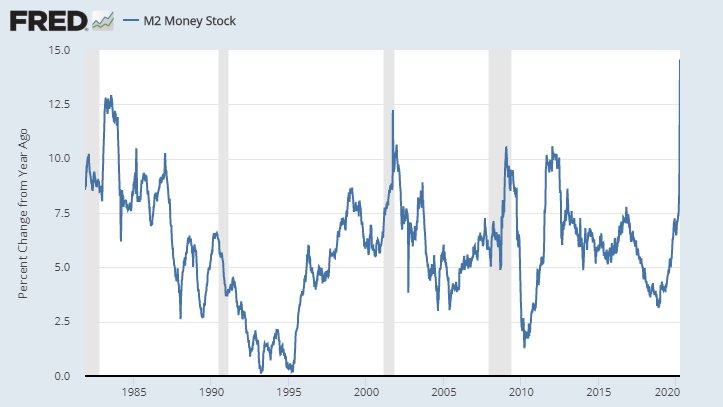
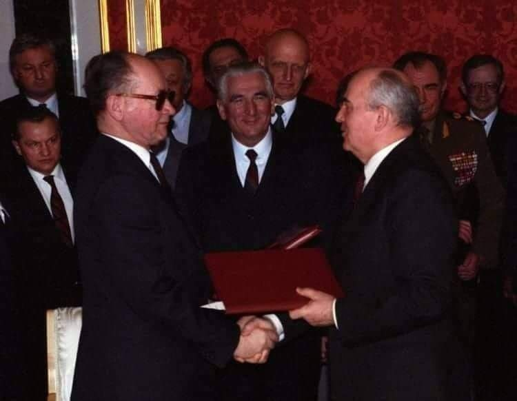
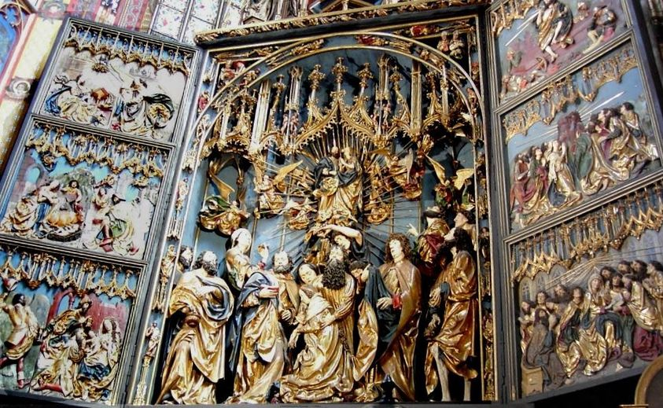
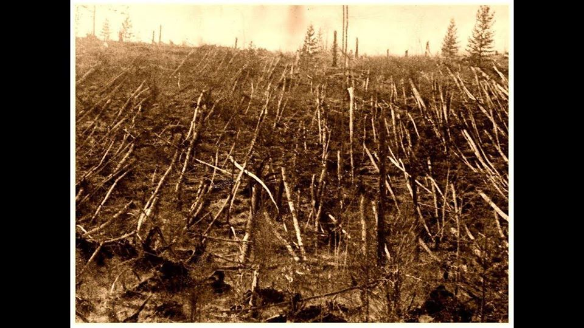

### 2022

> Dawny doradca ds. polityki wojskowej byłej kanclerz Niemiec Angeli Merkel, były generał brygady Erich Vad, w wywiadzie dla agencji dpa sprzeciwił się dostawom broni ciężkiej na Ukrainę. To potencjalnie „droga do III wojny światowej”

### 2020

Steal $20, it’s a crime. Steal $20 trillion, it's called monetary policy.

  

A staggering $976.7B 3-week expansion in M2 money supply has brought its YoY growth rate to a record 14.57%, which has increased by 10.71pp in less than one year. This dramatic acceleration is unprecedented.

---

<video width="640" height="480" controls>
  <source src="./movies/april/obywateliawceluratowaniabudzetu.mp4" type="video/mp4">
Your browser does not support the video tag.
</video>

---

'Jak wygląda sytuacja w szpitalach relacjonuje dr n. med. Tomasz Ozorowski, szef zespołu kontroli zakażeń i szef sztabu kryzysowego, czyli zespołu ds. COVID-19 jednego z poznańskich szpitali, konsultant wojewódzki mikrobiologii:

Odprawa Sztabu Kryzysowego, której nie zapomnę: "Nie mamy masek, nie mamy rękawic, kończą się testy. Kiedy będą?!" – dyrektor szpitala dzwoni przy wszystkich do koordynatora, którego wyznaczył nam minister. "Nie wiem. Przepraszam. Nie, nie wiem, nie wiem, nie wiem. Sorry" – słyszymy. Dociera do nas, że możemy już liczyć tylko na siebie, że "góra" już dawno nas wystawiła. Zapada 10 minutowa cisza. Każdy próbuje przetworzyć w głowie ten komunikat. Ciszę przerywa ordynator: "Mam w domu maszynę do szycia".

To przełom. Ok, jesteśmy sami, ale ruszamy. Decyzja została podjęta – ogarniamy się sami. Bo żadnej pomocy z zewnątrz nie będzie. Telefony do ministra, wojewody, marszałka nic nie dadzą. Wreszcie do nas dociera. Ordynator oddziału chorób wewnętrznych, Lekarz Roku 2019 i jej mąż szyją maski dla całego szpitala. Ordynator onkologii dzwoni do swojej krawcowej. Wszyscy obdzwaniamy znajomych. Uruchamia się słynna polska oddolna inicjatywa.

Kolejna odprawa: na stole lądują spawalnicze przyłbice od znajomego hutnika, część zespołu łączy się na Skype, pokazuje własnoręcznie uszyte maski. Czy chronią? Chronią naszą psychikę.'

---

### 1990

Podczas wizyty prezydenta RP generała Wojciecha Jaruzelskiego w Moskwie miało miejsce przekazanie dokumentów w sprawie Zbrodni Katyńskiej. 
Strona radziecka wyraziła przy tej okazji głębokie ubolewanie z powodu, jak to nazwano " jednej z najcięższych zbrodni okresu stalinizmu", obciążając jednocześnie odpowiedzialnością za nią komisarza NKWD Ławrientija Berię i jego zastępcę Wsiewołoda Mierkułowa.
Podczas wizyty Jaruzelski otrzymał z rąk Michaiła Gorbaczowa (obaj na zdjęciu, po środku Józef Czyrek) między innymi kopie list więźniów skierowanych w kwietniu i maju 1940 roku z obozu jenieckiego w Kozielsku do Smoleńska i z obozu w Ostaszkowie do Kalinina (obecny Twer), a także wykaz akt ewidencyjnych jeńców wojennych, których wywieziono z obozu NKWD w Starobielsku. Prezydent ZSRR oficjalnie zlecił wówczas wyjaśnienie sprawy katyńskiej.

  

### 1957

Kościół Mariacki w Krakowie odzyskał ołtarz Wita Stwosza, wywieziony do Niemiec w czasie II wojny światowej.
Po 18 latach ołtarz Wita Stwosza znów można oglądać w krakowskim kościele Mariackim. We wrześniu 1939 r. prof. Karol Estreicher ukrył figury z ołtarza w katedrze w Sandomierzu, ale Niemcy je znaleźli i wywieźli do schronu na zamku w Norymberdze. Natomiast konstrukcję nośną - skrzynię i skrzydła - nietkniętą od czasów Wita Stwosza rozpiłowali i ukryli w zamku Wiesenthau, 30 km od Norymbergi. Po wojnie Estreicher, któremu pomogli Amerykanie, odnalazł ołtarz i konstrukcję. Wraz z innymi zrabowanymi skarbami dzieło przyjechało do Krakowa pociągiem w maju 1946 r. Renowacja w pracowni konserwatorskiej na Wawelu trwała długo, na swoje miejsce ołtarz wrócił dopiero 11 lat po przywiezieniu do Polski.

  

### 1951

Ginie <https://pl.wikipedia.org/wiki/Mieczys%C5%82aw_Dziemieszkiewicz>

### 1941

W Otwocku 15 letni chłopiec Sławomir Lewiński (zdjęcie) dokonał zniszczenia faszystowskiego godła znajdującego się przed tamtejszą siedzibą gestapo.
Czyn ten miał dosyć poważne konsekwencje dla mieszkańców tego miasta, ponieważ ówczesny niemiecki starosta warszawski nałożył na mieszkańców kontrybucję w wysokości 20 tysięcy złotych, a także przesunął godzinę policyjną z 22 na 20.
W odwecie za zniszczenie hitlerowskiego
godła Niemcy wysadzili w powietrze pomnik
Tadeusza Kościuszki znajdujący się na
ówczesnej Al. Tadeusza Kościuszki w
Otwocku.
Historia 15 letniego Sławka miała jednak swój tragiczny koniec. W wyniku czynu, którego dokonał Niemcy aresztowali kilkunastu zakładników, których chcieli zabić w przypadku, gdyby nie udało się znaleźć sprawcy. Chcąc uniknąć śmierci niewinnych ludzi zgłosił się do ówczesnego otwockiego komendanta gestapo Otto Schlichta ojciec chłopca, który wszystko opowiedział. Wkrótce obaj Lewińscy trafili do obozu koncentracyjnego, gdzie zostali zamordowani.
### 1927

Pierwsi badacze dotarli do miejsca katastrofy tunguskiej z 1908 roku.

30 czerwca 1908 r. o 7:14 rano nad rzeką Podkamienna Tunguzka w środkowej Syberii doszło potężnej eksplozji. Wybuch powalił około 9 milionów drzew w promieniu 40 km. Widoczny był z odległości 650 km, a słyszany niemal dwukrotnie dalej. Wydarzenie to zarejestrowały sejsmografy na całej kuli ziemskiej. Jeszcze przez trzy dni na terenie Europy obserwowano tzw. białe noce. Zamiast zmierzchu pojawiało się złote światło. W Londynie w środku nocy można było czytać gazetę. Rosyjskie magnetometry zwariowały – pokazywały drugi biegun północny.

Dokładny czas eksplozji zarejestrowało obserwatorium meteorologiczne w Irkucku. Kierownik stacji Arkady Woznesieński został zasypany doniesieniami o „ognistej kuli", „świetlnym słupie", „spadającym słońcu", trzęsieniu ziemi tak silnym, że „gosposia popa spadła z ławki" (wg relacji agronoma ze wsi Niżne-Ilińskoje). Pisali do niego przyrodnicy z całej Syberii. Doniesienia były dość spójne: o ogromnej, świecącej kuli, która nadleciała z południa (według niektórych ze wschodu) i następującej po tym serii wybuchów. Na podstawie tych informacji Woznesieński wyliczył trajektorię lotu obiektu oraz miejsce eksplozji. Epicentrum znajdowało się na północ od Bajkału, 60 km od osady Wanawara. Na szczęście była to prawie bezludna okolica. Można było tam spotkać jedynie rzadko rozrzucone osady rdzennych mieszkańców Syberii – Ewenków.

Z katastrofy cudem ocalał tunguski szaman, Iwan Aksenow. Przebywał 20 km od epicentrum – w strefie największych zniszczeń. Opowiadał, że naokoło „nagle poczerwieniało", rozległ się huk i stracił przytomność: „Kiedy się ocknąłem, wszystko wokół waliło się i paliło. Spojrzałem w górę i zobaczyłem lecącego »czorta«. To coś miało podłużny kształt i dwa widoczne na przedzie punkty. Ciągnęło za sobą ogon z ognia".

Mimo ogromnej ilości zebranych danych, Woznesieński nie miał śmiałości złożyć przełożonym z Petersburga oficjalnego raportu ze swoich wyliczeń. Za to świadków było dostatek. Po latach Radziecka Akademia Nauk zgromadziła relacje ok. 920 osób.

Obiekt tunguski opisywano w przeróżny sposób, jako „kulę dwukrotnie większą od słońca z postrzępionym ogonem, z którego sypały się iskry". Porównywano go do „snopa", „miotły" czy „naboju". Mieszkaniec wsi Kondraszyno opisał go jako „samolot bez skrzydeł, czerwony jak pomidor". Niezależnie od barwności porównań oszacowano, że obiekty widziane przez świadków mogły mieć nawet 50 m średnicy.

Badania i hipotezy:

Zaraz po wydarzeniu rozpisały się o nim syberyjskie gazety. Później temat spowszedniał i ucichł. Świat zajął się innymi sprawami – I wojną światową, upadkiem carskiej Rosji, rewolucją bolszewicką. Dopiero po 19 latach od eksplozji geolog z Muzeum Mineralogicznego w Piotrogrodzie (wcześniej Petersburgu), Leonid Kulik otrzymał zgodę na zbadanie miejsca katastrofy. Stało się to m.in. dlatego, że w Związku Radzieckim nie było miejsca na paranormalne zjawiska, a katastrofa tunguska zaczęła już obrastać w legendy. Mówiono, że na trzy dni przed eksplozją psy wyły, ptaki były niespokojne, a zwierzyna leśna opuszczała miejsce przyszłej katastrofy. Prorocze wizje szamanów miały uratować wiele osad, które zostały w porę ostrzyżone przed zbliżającym się nieszczęściem. Kulik wyprawił się to tajgi, by nauką zwalczyć zabobony.

Poszukiwania zakończyły się niepowodzeniem. Teren nie był przyjazny. Ciągnące się kilometrami moczary i roje komarów nie ułatwiały poszukiwań. Mimo to Kulik pozostawił po swoich czterech wyprawach bogaty materiał zdjęciowy. Dzięki niemu mamy najwcześniejsze relacje z miejsca katastrofy. Opisywał wielką kotlinę pokrytą powalonymi i osmolonymi drzewami. Leżały promieniście, ale w samym epicentrum sterczała w niebo grupa pni obdartych z gałęzi. Cały teren pokryty był małymi i płytkimi oczkami wodnymi o średnicy od 1 do 50 m. Badacz przypuszczał, że są to kratery powstałe przez deszcz meteorytów po rozpadzie jednego większego obiektu, który eksplodował nad ziemią. Nie znalazł jednak żadnego śladu samego meteorytu. Przypuszczenie, że nad Syberią eksplodował obiekt z kosmosu złożony z niklu i żelaza zaczęło się chwiać. Urządzenia nie wykryły śladów magnetycznych minerałów ani w ziemi, ani w wodzie. Kulik był bliżej rozwiązania niż mógł przypuszczać, jednak nie potrafił udowodnić swojej hipotezy.

W tym czasie badaniami nad katastrofą tunguską zainteresowała się również Międzynarodowa Unia Astronomiczna. Nie było jednak mowy o tym, by jakikolwiek zachodni naukowiec miał dostęp do miejsca eksplozji. Aż do pierestrojki Gorbaczowa wokół katastrofy narastało wiele niepotwierdzonych hipotez. Było ich ponad sto. Jedna z nich powstała zaraz po II wojnie światowej. Zrzucenie bomb atomowych na Hiroszimę i Nagasaki przypomniało radzieckim naukowcom o wybuchu nad Syberią. Zaczęto go tłumaczyć eksperymentami jądrowymi. Nie wiedziano wówczas jeszcze, że eksplozja tunguska miała siłę około dwóch tysięcy razy większą niż znane wówczas bomby atomowe. I ta hipoteza upadła, ponieważ w rejonie wybuchu nie znaleziono żadnych radioaktywnych śladów. Cały teren był czysty, rozkwitało na nim życie, a przyroda wydawała się być jeszcze aktywniejsza niż przed katastrofą.

Główne hipotezy zakładały dwa rodzaje obiektów: fragment komety lub meteoryt, który eksplodował zanim dotarł do powierzchni ziemi. Uparcie wracały też legendy opowiadające o różnych zjawiskach poprzedzających wybuch. O ile prorocze wizje szamanów można było włożyć między bajki, to zbyt wiele osób widziało dziwne zjawiska świetlne na trzy dni przed wybuchem. W latach 60. ekipa Nikołaja Wasiliewa przeanalizowała 150 relacji o anomaliach atmosferycznych po wybuchu tunguskim. Naukowcy ze zdziwieniem odkryli, że wszystko zaczęło się wcześniej niż przypuszczano – jeszcze przed eksplozją. Postawiono wówczas hipotezę, że obiekt, zanim spadł na ziemię, krążył w atmosferze jako „satelita", uwalniając pył i gazy. Ostatecznie w relacjach świadków często pojawiał się opis ognistego ogona ciągnącego się za obiektem, a także dziwne lśnienie porównywane do tęczy.

Na tej podstawie w 1978 r. czechosłowacki astronom, Lubora Kresák, stwierdził, że przyczyną katastrofy tunguskiej był oderwany fragment komety Enckego. Dzięki temu temat bolidu syberyjskiego ponownie ożywił środowiska naukowe. Zaczęto spoglądać też pod ziemię, nie tylko w gwiazdy. Pojawiła się koncepcja wybuchu gazów podziemnych. Tworzące się przez setki lat napięcia doprowadziły do uwolnienia się dużej ilości metanu. Zapłon mógł być samoistny lub wywołany zderzeniem zwykłego meteorytu z atmosferą. Jako dowód posłużyły znajdowane przez ekspedycje głazy pochodzące z głębokich warstw ziemi. Według naukowców mogła je wydobyć na powierzchnię jedynie potężna eksplozja.

W 2007 r. dwaj naukowcy z Uniwersytetu Bolońskiego – Luca Gasparini i Giuseppe Longo dokonali, jak się wydawało przełomowego odkrycia. Odnaleźli krater powstały w wyniku upadku dużego meteorytu lub fragmentu komety. Miało nim być jezioro Czeko leżące 8 km na północny zachód od epicentrum wybuchu. Koncepcja jednak szybko padła, gdy okazało się, że w pobliżu zbiornika rosną drzewa mające więcej niż 100 lat, a kształt dna jeziora również budzi wątpliwości co do jego pouderzeniowego pochodzenia.

Jeśli mamy finał tej historii badawczej, to dzięki zespołowi Wiktora Kwasnicy z Instytutu Geochemii, Mineralogii i Złóż Naturalnych Narodowej Akademii Nauk Ukrainy w Kijowie. Jeszcze raz poddano analizie próbki zebrane w 1978 r. Pierwotnie myślano, że to fragmenty skał, które uległy przetworzeniu pod wpływem eksplozji. Teraz przy użyciu nowocześniejszych przyrządów (np. transmisyjnego mikroskopu elektronowego) można stwierdzić, że skład próbek jest bez wątpienia charakterystyczny dla meteorytów żelazno-kamiennych.

Dzięki symulacjom komputerowym udało się stwierdzić, że paradoksalnie mniejsze obiekty pozostawiają na miejscu zderzenia więcej okruchów. Tunguska asteroida miała prawdopodobnie wielkość wieżowca. Nadleciała z prędkością 15 km/s, wpadła w atmosferę i uległa rozerwaniu na wysokości ok. 10 km. Mogła całkowicie stopić się i wyparować w żarze eksplozji. Zniszczeń dokonały fale uderzeniowa oraz termiczna. Szczątków należałoby szukać poza strefą powalonych drzew.

Od fantazji do absurdu:

Wybuch w jednym z najbardziej odludnych miejsc na Ziemi i brak śladów meteorytu pobudzał i pobudza wyobraźnię zwolenników teorii niekonwencjonalnych. Nie może między nimi zabraknąć hipotez o udziale UFO. Jedna z nich głosi, że to był sygnał wysłany przez obcą cywilizację. Jego moc została źle obliczona – za słaby na atak lub za mocny jako gestu pokoju. Bardziej rozbudowana historia opowiada o plemieniu Dropów, którzy zamieszkiwali Ziemię i oczekiwali na powrót do domu. Statek ratunkowy niestety rozbił się nad Syberią i Dropowie nadal żyją wśród nas.

Jeszcze inna hipoteza zakładała, że planety są zdolnymi do samoobrony żywymi istotami. Po to właśnie stworzyły płaszcz atmosfery. Dlatego Ziemia kilka dni przed katastrofą przygotowywała się do obrony, generując przeróżne anomalie świetlne i magnetyczne, a w chwili ataku wydała z siebie energetyczne tchnienie i zdmuchnęła agresora.

Jedna z radzieckich ekip widząc niewiarygodną ilość unoszących się nad mokradłami owadów śmiało postawiła tezę, że osiągnęły one masę krytyczną i katastrofę tunguską wywołał samozapłon wielkiej chmary komarów...

W kilku punktach listy hipotez pojawił się też Nikola Tesla – genialny inżynier i wynalazca serbskiego pochodzenia. To jego eksperymenty z elektryką i grawitacją wywołały wybuch na drugiej stronie globu. Miał skonstruować dwa urządzenia, które wysłały sygnał w tym samym czasie – jeden w atmosferę, a drugi skierowany do ziemi. Obie fale spotkały się na północ od Bajkału i zainicjowały eksplozję. Tylko po co to zrobił? W jednej wersji był to eksperyment naukowy, a w innej ratunek przed inwazją z kosmosu.

Brak jakichkolwiek śladów i wskazówek wywoływał u ludzi lęk przez ponad 100 lat. Nie znajdowano wiarygodnego wyjaśnienia. Jesteśmy w stanie stwierdzić, że ostatnie wyjaśnienie ukraińskich naukowców jest prawie satysfakcjonujące. To jednak nadal nic pewnego. Jak to możliwe, że największa katastrofa, jakiej był świadkiem współczesny człowiek, nadal pozostaje tajemnicą?

  

### 1909

https://pl.wikipedia.org/wiki/Adolf_Maria_Bocheński

Adolf Bocheński był dzieckiem genialnym. Od wczesnego dzieciństwa nie czytał bajek, od razu wziął się za poważne książki historyczne. Ponieważ żal mu było tracić czas na szkołę, uczył się w domu i nawet specjalnie przychodzącemu do niego korepetytorowi nakazywał usiąść w fotelu, zająć się lekturą gazety i nie przeszkadzać sobie w intensywnej nauce.

Pierwszą książkę („Tendencje samobójcze narodu polskiego”) Bocheński napisał w wieku 15 lat. Cztery lata później wydał książkę „Ustrój a racja stanu”, która według recenzji Stanisława Mackiewicza była książką po prostu genialną, łączącą niezwykłą erudycję z wielką przenikliwością. W tym czasie studiował już w Paryżu. Po powrocie do kraju zajął się publicystyką i walką o uratowanie rodzinnego majątku – Ponikwy. Tu mała dygresja. Ponikwy były dobrze zarządzanym majątkiem, który bez problemu przetrwał przez zabory i wojnę światową. Zniszczyła je dopiero II RP, która nałożyła na majątki ziemskie tak wysokie podatki, że zapłata ich wymagała sprzedaży części ziemi lub zaciągnięcia pożyczek w bankach. Rodzice Adolfa Bocheńskiego nie chcieli pozbywać się ziemi, a ponieważ do tej pory nie mieli żadnych długów, uznali, że zadłużenie się w banku będzie lepszym wyborem. Niestety mylili się, nie docenili niszczącej siły wysokich stóp procentowych. Wpadli w ten sposób w spiralę zadłużenia, która w latach trzydziestych doprowadziła do przejęcia całego majątku Bocheńskich przez bank.

Bocheński stał się w tym czasie uznanym w wąskich kręgach publicystą. Do jego mistrzów należy zaliczyć Cata -Mackiewicza, Studnickiego, Bobrzyńskiego i Bainville’a. Pisał głównie o sprawach ustrojowych i o polityce zagranicznej. Krytykował zarówno sanację jak i endecję. Przeciwstawiał się etatyzmowi, centralizacji i nacjonalizmowi. Uważał, że niechęć do kapitalizmu jest jednym z największych zagrożeń jego czasów.

W 1937 roku Bocheński wydał swoje największe dzieło „Między Niemcami a Rosją”. Ta świetna analiza praw polityki zagranicznej jasno wskazywała, że nadzieją i ratunkiem dla Polski jest zbliżenie do Niemiec. Bocheński nakazywał realizm w myśleniu o polityce i porzucenie myślenia życzeniowego. Niestety jego wpływ na polską politykę był praktycznie żaden, a jemu została przypięta łatka germanofila.

Gdy wybucha wojna, mający 30 lat Bocheński postanawia iść do wojska. Z powodu słabego zdrowia i cherlawej budowy ciała wojsko go nie chce. Jednak Bocheński, wykorzystując wszystkie swoje znajomości, wkupuje się do armii za cenę przekazania na rzecz oddziału swojego samochodu osobowego. W życiu tego genialnego intelektualisty dochodzi do niespodziewanej przemiany. Bierze udział w kampanii wrześniowej, po której przez Węgry przedostaje się do Francji. Zostaje wysłany pod Narwik, potem ląduje w Bretanii, przebija się przez całą Francję do Tuluzy, skąd przerzuca się na Bliski Wschód. Staje się niezrównanym saperem i dowódcą patroli. Pod Tobrukiem mają go już za nowe wcielenie Kmicica. Łamiąc wszelkie reguły, nocami przedostaje się za linie nieprzyjaciela i podpala włoską wieżę obserwacyjną. Pod Monte Cassino zostaje trzykrotnie ranny, a jego mundur wzbogacił się o dziewięć otworów po kulach. Latem 1944 roku ponownie zostaje ranny. Prosto ze szpitala, zamiast na przepisaną mu rekonwalescencje, uciekł z przestrzelonymi ramieniem i pachwiną prosto na front, walczyć o Ankonę.

Za życia stał się legendą i jednym z największych bohaterów II Korpusu. W uznaniu jego niebywałej odwagi i pogardy dla śmierci otrzymuje zarówno Virtuti Militari jak i trzykrotnie Krzyż Walecznych. Jedni mówią, że szuka śmierci, inni, że jest po prostu niesamowicie odważny.

A jak komentował swoje zachowanie sam Bocheński?„Człowiek uczciwy nie ma prawa przeżyć tej wojny”. Ale to tylko bon mot. Bocheński miał swój plan polityczny. Podobnie jak przed wojną uznał, że jeżeli Polska ma mieć jakiekolwiek szanse na niepodległość i suwerenność, to będzie musiała po wojnie wejść w sojusz z Niemcami przeciwko Sowietom. Wiedział, że po wszystkich zbrodniach, jakich dopuścili się Niemcy, będzie to jeszcze trudniejsze niż przed wojną. Chętnych do popularyzowania czy do przeprowadzenia tego pojednania będzie niewielu. A jeżeli on, Adolf Bocheński, ma jakkolwiek pomóc tej sprawie, to musi najpierw uwiarygodnić się swoim zaangażowaniem w walce z Niemcami. W przeciwnym wypadku Polacy nigdy za nim nie pójdą.

Nadszedł 18 lipca 1944 roku. Ranny, z jedną ręką na temblaku, Adolf Bocheński rozbroił tego dnia dwadzieścia dwie miny. Niestety dwudziesta trzecia mina zakończyła życie jednego z największych polskich umysłów pierwszej połowy XX wieku i legendarnego już wtedy bohatera wojennego.

Niedługo po wojnie Cat-Mackiewicz na prośbę Aleksandra Bocheńskiego zaczął pisać biografię Adolfa. Niestety w trakcie prac nad książką doszło pomiędzy nimi do nieporozumienia i dzieło nigdy nie powstało. Napisanych zostało zaledwie kilkadziesiąt stron. Strasznie tego żałuję, życie Bocheńskiego opisane genialnym piórem Mackiewicza pozwoliłoby
unieśmiertelnić tę tragiczną i niespełnioną postać.

W chwili śmierci Bocheński miał zaledwie 34 lata. Powinien być Adolf Bocheński wymieniany jednym tchem z Krzysztofem Kamilem Baczyńskim, który zginął zaledwie dwa tygodnie później. Niestety o Baczyńskim słyszał każdy, a Bocheński jest dalej znany tylko niektórym.

Mackiewicz pisał: „Gdyby system selekcji elit w Polsce działał tak jak powinien, Adolf Bocheński powinien być naszym ministrem spraw zagranicznych, a nie ginąć jako podporucznik pod Ankoną”. Powinien być ministrem, ale nie był. Bocheński nie miał żadnego wpływu na polską politykę zagraniczną. Był podobnie jak jego mistrzowie – Stanisław Mackiewicz i Władysław Studnicki – na całkowitym marginesie polskiej
polityki i publicystyki.

Cały nakład wydanego w czerwcu 1939 roku przez Studnickiego proroczego „Wobec nadchodzącej wojny” został skonfiskowany, a Stanisław Mackiewicz został w marcu 1939 roku internowany w Berezie Kartuskiej. Tak Polska potraktowała swych najlepszych synów, swe najtęższe umysły potrafiące przejrzeć zakrytą dla innych przyszłość. Czy coś się w tej sprawie od lat trzydziestych XX wieku zmieniło? Czy mamy wreszcie elity rozumiejące podstawy polityki zagranicznej? Czy mechanizm selekcji elit uległ poprawie?

Nie. Dalej selekcja wygląda tak jak wtedy, do władzy dochodzą nie ci, którzy powinni. Wciąż żyjemy złudzeniami, nabieramy się na tani patos i frazes. Uciekamy przez rzeczywistością i rządzącymi nią prawami.

Coś jednak się zmieniło. Pan Bóg mając już chyba dosyć wykorzystywania przez Polaków geniuszu w charakterze kamienia rzucanego na szaniec, nam tych geniuszów ewidentnie skąpi. Trudno się zresztą temu dziwić, marnotrawstwo i rozrzutność do cnót nie należą.

Cat-Mackiewicz mottem swojej nieukończonej biografii Bocheńskiego chciał uczynić fragment „Fortepianu Szopena” Norwida. Wybór jak zwykle u Mackiewicza efektowny, tym bardziej, że sam Bocheński bardzo często ten fragment recytował, tak jakby przeczuwał swą bohaterską śmierć:

Gdy życia koniec szepce do początku:
„Nie stargam Cię ja – nie! – Ja... u-wydatnię!...”

Ale jest inny wiersz, autorstwa Juliusza Słowackiego, w którym prawie każdy wers pasuje do Bocheńskiego. Chodzi oczywiście o „Testament Mój”, który w tym miejscu Czytelnikowi polecam.

---

<a href="https://github.com/TomaszWaszczyk/historia.waszczyk.com/edit/master/src/content/april-13.md" target="_blank">Edytuj tę stronę dzieląc się własnymi notatkami!</a>
