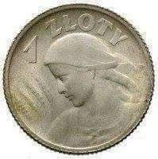

### 2022

Niedzielski o paszporcie covidowym: Instrument, który wygasa

Są wyraźne wskazania, że to jest instrument, który wygasa. Powoli się z nim żegnamy - mówił o paszporcie covidowym w Polsat News Adam Niedzielski. Minister zdrowia odniósł się też do możliwego zniesienia w kwietniu stanu epidemii i zamienienia go na stan zagrożenia epidemią.

---

  

---

### 2020

#### The Financial Stability Board has just launched their consultations on global stablecoins

That's a very much needed initiative at the global policy level. Earlier this year I have had a great opportunity to meet with the FSB working group on stablecoins in Singapore, and now we all can see the first results of their hard work.

---

Widzimy obligacje przedwojennie które nie zostały wykupione, aktualnie Polska również emituje obligacje reklamując je "pewnym zyskiem" w otoczeniu gdzie dług Państwa z roku na rok rocznie.

  

  

  

https://tradingeconomics.com/poland/government-debt

---

  

---

### 1994

Prezesi siedmiu głównych firm tytoniowych w Stanach Zjednoczonych przysięgają, że nikotyna NIE uzależnia.

  

### 1950

Podpisane zostało porozumienie między rządem komunistycznym, a Episkopatem Polski w sprawie zagwarantowania nauczania religii i funkcjonowania Katolickiego Uniwersytetu Lubelskiego.
Budzącą najwięcej kontrowersji kwestią jest punkt 4 tego porozumienia, który brzmi:
" Episkopat w granicach sobie dostępnych
będzie się przeciwstawiał wrogiej Polsce
działalności, a zwłaszcza antypolskim i
rewizjonistycznym wystąpieniom części kleru
niemieckiego."
W praktyce oznaczało to, że wyrażenie zgody na potępianie antykomunistów było ceną jaką za pozostawienie nauki religii w szkole zapłacił Episkopat.
Ze strony Kościoła sygnatariuszem tego porozumienia był kardynał Stefan Wyszyński (zdjęcie), którego działanie ostro potępił papież Pius XII, który chciał nawet cofnąć z tego powodu uznanie dla prymasa.
Porozumienie nie powstrzymało dalszych
represji wobec Kościoła katolickiego. Władze
państwowe od początku nie chciały
respektować jego postanowień. 19 kwietnia
1950 roku powołały Urząd do Spraw Wyznań ,
który wkrótce zaczął niemal samodzielnie
decydować o „obsadzie personalnej placówek
kościelnych” oraz dokonywać oceny księży
pod względem ideologiczno-politycznym. Na
odprawie Urzędu 17 listopada 1950 roku
stwierdzono, że „porozumienie z rządem
powinno stać się orężem walki z klerem.” 2
maja 1950 roku Sejm przeprowadził ustawę o
konfiskacie dóbr kościelnych: zakonnych i
biskupich.

  

### 1943

Zapisek z dziennika Josepha Goebbelsa, który datowany jest na 14 kwietnia 1943 roku:

„Odnalezienie 12 000 polskich oficerów zamordowanych przez GPU zostaje też w możliwie najlepszym stylu włączone do antybolszewickiej propagandy. Spowodowaliśmy wysłanie na miejsce znaleziska neutralnych dziennikarzy i polskich intelektualistów. Raporty, które nadchodzą na ten temat z zagranicy, przyjmują zgrozą. Teraz również Führer wyraził zgodę, abyśmy i my opublikowali dramatyczny meldunek w prasie niemieckiej. Daję wskazówkę, aby ten materiał propagandowy wykorzystać w jak najszerszym zakresie. Będziemy z tego mogli żyć parę tygodni. W każdym razie pojawiła się bardzo dobra okazja, aby w drastyczny sposób przeciwdziałać próbom wybielania bolszewizmu, jakie podejmuje się w Anglii i USA.”

  

### 1939

https://pl.wikipedia.org/wiki/Grona_gniewu

### 1924

1924 roku prezydent Stanisław Wojciechowski wydał rozporządzenie o zmianie ustroju pieniężnego Rzeczypospolitej Polskiej. Zdewaluowaną markę polską Królestwa Polskiego zastąpiono nową walutą o nazwie "Złoty". Pierwsza złotówka pojawiła się w obiegu już 29 kwietnia 1924 roku.

  

### 1917

1917 roku w Warszawie zmarł Ludwik Lejzor Łazarz Zamenhof, znany jako ,,Doktor Esperanto'' - lekarz, poliglota, pacyfista, , współtwórca pierwszego warszawskiego kółka syjonistycznego Chowewej Syjon, twórca języka międzynarodowego esperanto - najbardziej rozpowszechnionego sztucznego języka międzynarodowego, opartego głównie na materiale języków europejskich, głównie germańskich i romańskich.
Esperanto powstało pod wpływem idei humanistycznej dążącej do pokojowego współżycia i porozumienia między narodami. Pierwszy podręcznik do nauki esperanto nosił tytuł ,,Język międzynarodowy. Przedmowa i podręcznik kompletny''. Opublikowano go w 1887 roku. Był to początek ogólnoświatowego rozwoju ruchu esperanckiego. Później Ludwik Zamenhof opracował też antologię literacką przekładów na esperanto Fundamenta krestomatio… (1904).
W 1905 roku odbył się I Światowy Kongres Esperantystów we francuskim miasteczku Boulogne sur Mer. W czasie spotkania powstała deklaracja ideowa ruchu esperanckiego oraz samego języka, która mówiła, że : ,,Esperantyzm jest to dążność do rozprzestrzeniania w całym świecie języka neutralnie ludzkiego, który nie mieszając się we wewnętrzne życie narodów i nie usiłując wyprzeć istniejących języków narodowych umożliwiłby ludziom różnych narodowości porozumiewanie się wzajemnie...”. Sam twórca miał nadzieję, że język esperanto stanie się językiem wszystkich Żydów osiedlających się w Palestynie. Nigdy do tego nie doszło z uwagi na odradzający się ruch języka hebrajskiego.

  

### 1430

1430 roku w Wielkanoc grupa rozbójników pochodzących z Moraw, Czech i Śląska napadła na klasztor Paulinów na Jasnej Górze. Wśród sprawców tego czynu znaleźli się także dwaj polscy szlachcice; Jakub Nadobny z Rogowa oraz Jan Kuropatwo z Łańcuchowa.
Zbóje okradli klasztor, a także zabili kilku zakonników. Włamali się również do kaplicy, w której znajdował się obraz Matki Boskiej. To właśnie wtedy został on uszkodzony tak, że powstały na nim dwie słynne rysy.
Ikona z wizerunkiem Matki Boskiej Czestochowskiej została odnowiona w Krakowie w 1523 roku.

  

---

<a href="https://github.com/TomaszWaszczyk/historia.waszczyk.com/edit/master/src/content/april-14.md" target="_blank">Edytuj tę stronę dzieląc się własnymi notatkami!</a>
