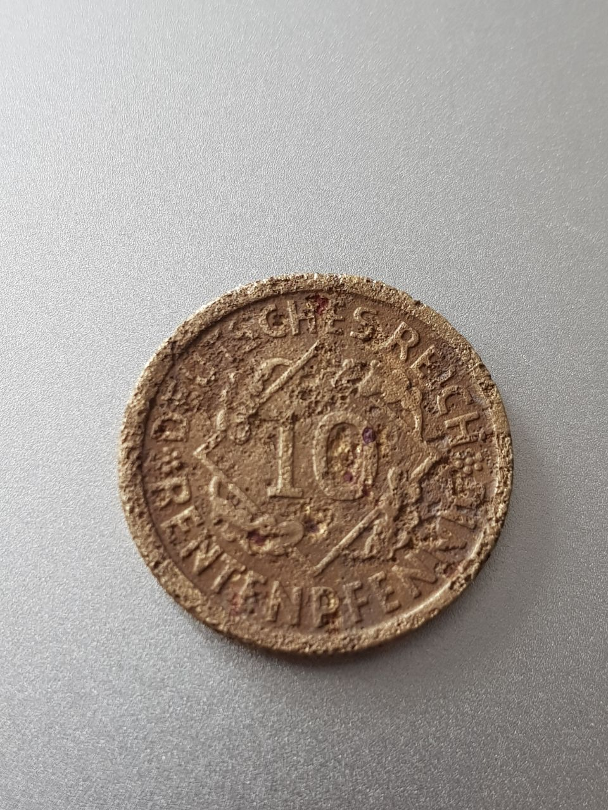
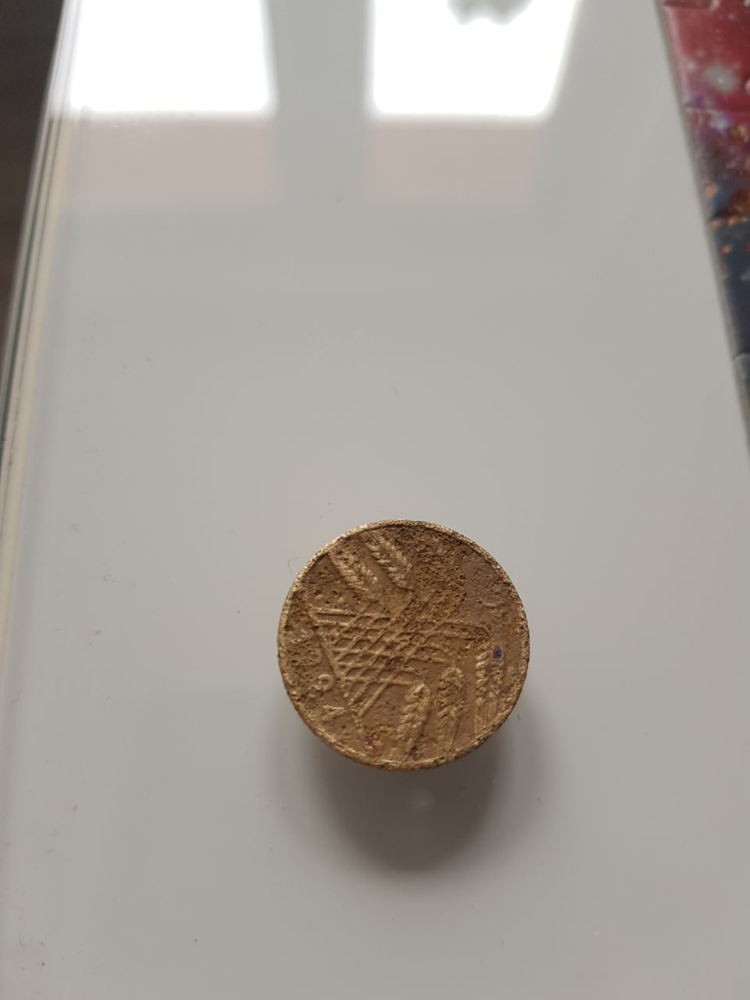
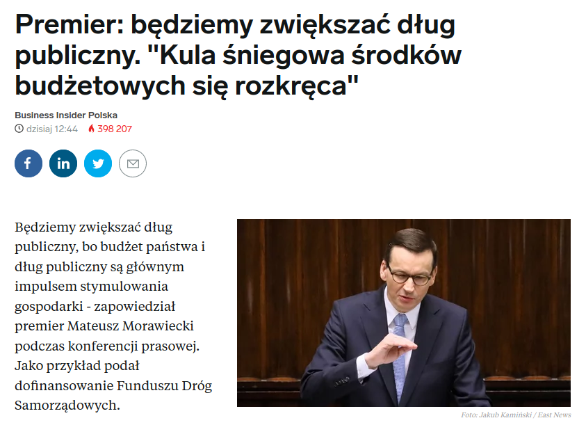
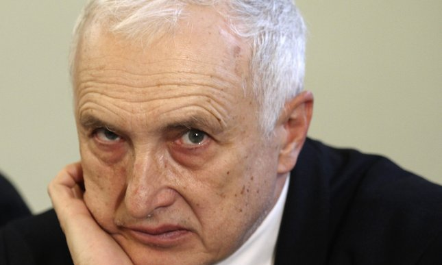
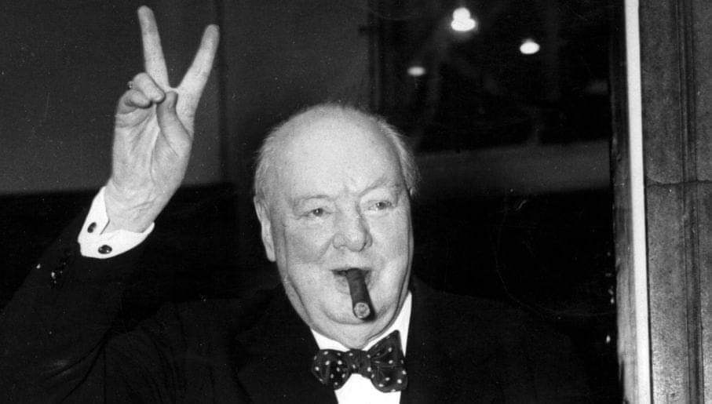

### 2020

After years of research China is trialing a test interface (a wallet) for the country's Central Bank Digital Currency (aka DC/EP).

China is one of the first countries in the world to develop a CBDC. Allowing accounts directly in a central bank might have a profound impact on the whole economy.
To increase the adoption it is said that DCEP will support offline payments.

People's Bank of China had been developing the system with the involvement of the country's four big state-owned banks as well as payments giants Ant Financial and Tencent.
The test is currently being carried out in four Chinese cities, including Xiong'An, Suzhou, Chengdu and Shenzhen.

  

Chińczycy ogłosili powstanie Narodowego Komitetu do spraw Blockchaina i wynika z niego, że w skład powstającego ciała wchodzić będą m.in. przedstawiciele chińskiego banku centralnego oraz pracownicy takich gigantów technologicznych jak Baidu czy Tencent 😲

Głównym zadaniem Komitetu będzie wypracowanie standardów dla całego obszaru technologii blockchain 🧐

Kto by pomyślał, że jakiś rodzaj bazy danych doczeka się własnych komitetów narodowych

---

CZY NIEMCY ZAMYKAJĄ WOLNY RYNEK?

Dawno, dawno temu, w 2016 roku, przed pandemią, chiński koncern chciał przejąć spółkę KUKA, branża robotyki, jeden z liderów. Niemiecki rząd zablokował transakcję.

Pandemia, wszystko nurkuje. Analizujemy jaka gałąź biznesu rozwinie się dzięki kryzysowi, bo przecież każdy kryzys to nowa szansa. Obserwujemy również jaka gałąź jest mocno przelewarowana, selekcja naturalna, kto nie przetrwa kryzysu.

W tym drugim przypadku to znowu mamy dwie opcje, albo upadnie i nigdy nie wstanie, ponieważ się okaże, że to kolejny nadmuchany balonik lub po prostu kryzys to kryzys, ale po zakończeniu pandemii wróci na swoje tory.

Niemiecki rząd jednak upatruje się innych problemów. Obawia się, że fundusze inwestycyjne za którymi stoją państwa spoza UE będą chciały wykorzystać promocję na giełdzie, aby przejąć firmy. Jak wskazuje zachodnie media, największe niebezpieczeństwo może nadejść ze strony chińskiej oraz saudyjskiej.

"Ekonomiczny dziennik „Handelsblatt” przyjrzał się jednak 160 firmom notowanym na frankfurckiej giełdzie. W 17 przypadkach ich wartość jest niższa niż kapitał własny pomniejszony o zobowiązania. W sytuacji takiej znalazły się m.in. gigant ubezpieczeniowy Allianz, koncern chemiczny BASF, linie lotnicze Lufthansa, koncern energetyczny RWE i największy niemiecki bank – Deutsche Bank.".

W środę (8 kwietnia) przyjął on projekt nowelizacji ustawy o stosunkach gospodarczych z zagranicą (Aussenwirtschafstgesetz – AWG).

"Transakcje istotne dla porządku publicznego mają w przyszłości nie dochodzić do skutku do momentu, aż zostanie sprawdzone, czy faktycznie nie stanowią zagrożenia. Sednem nowelizacji jest językowy szczegół. Przejęcie konkretnego przedsiębiorstwa będzie mogło zostać zablokowane przez rząd, jeśli niebezpieczeństwo jest „spodziewane”. Dotychczas musiało być „rzeczywiste”. Ponadto przy wydawaniu zezwolenia na przejęcie będzie też brane pod uwagę bezpieczeństwo partnerów z UE. Słowem: rząd Angeli Merkel znacząco poszerzył swoje pole manewru, ponieważ (jak zwraca uwagę Volker Treier ze Zrzeszenia Niemieckich Izb Przemysłowo-Handlowych DIHK) „spodziewane naruszenie” porządku publicznego jest terminem nieostrym i wyjątkowo pojemnym.

Niechciane przejęcia nie są jednak jedynym problemem w tej sferze, które spędzają sen z oczu niemieckiemu ministrowi gospodarki Peterowi Altmaierowi. Jak zwraca uwagę specjalista od przejęć Kai Lucks, obcy inwestorzy wolą w obecnej sytuacji unikać afiszowania się i zwiększają swoje wpływy w przedsiębiorstwach poprzez dokupywanie akcji. Giełdowa wartość motoryzacyjnego olbrzyma Daimlera jest np. obecnie o około połowę niższa niż przed rokiem. Li Shufu, szef chińskiego holdingu samochodowego Geely, i państwowy koncern BAIC jeszcze przed kryzysem mieli odpowiednio po około 10 proc. i 5 proc. akcji producenta Mercedesa. Również rząd Kuwejtu ma udziały w Daimlerze."

---

### Skarby Mariusza Dzi. - 10 Reichsfening

  

  

---

  

---

### Żyżyński (RPP): NBP mógłby kupować akcje

Dalsze obniżki stóp procentowych nie są wykluczone, ale na tę chwilę podjęte przez RPP działania są raczej wystarczające – powiedział PAP Biznes członek RPP Jerzy Żyżyński. Ekonomista liczy na szybkie odbicie wzrostu PKB i po krótkim okresie stymulacji gospodarki w okresie normalizacji,postuluje powrót stóp na dawne poziomy.

  

rpp„Przestrzeń do dalszego cięcia stóp procentowych jest niewielka. Zawsze byłem zwolennikiem posiadania bufora w polityce monetarnej, co okazało się w obecnej sytuacji bardzo przydatne. Nie jestem za tym, by stopa procentowa spadła do zera, utrudniłoby to prowadzenie polityki monetarnej. Jestem przeciwny temu, by pieniądz był dostępny za darmo” – powiedział Żyżyński.

„Gdy gospodarka wróci do normalnego działania, jeszcze przez chwilę będzie można ją stymulować niskim kosztem pieniądza, ale później trzeba wrócić ze stopami na wyższe poziomy. Mam nadzieję, że będziemy mogli to uczynić względnie szybko. Wydaje się, że referencyjna stopa na poziomie 1,50 proc. jest optymalna dla polskiej gospodarki w normalnym trybie funkcjonowania. Jak tylko będzie to możliwe, będę głosować za podwyżkami stóp” – dodał.

RPP obniżyła główną stopę procentową w Polsce od 17 marca łącznie o 100 pb, w dwóch krokach po 50 pb. Prezes NBP Adam Glapiński powiedział w ubiegłym tygodniu, że bank centralny w ramach swojego mandatu zrobi wszystko, by uratować polską gospodarkę.

Zdaniem ekonomisty, dalsze obniżki stóp byłyby możliwe, gdyby gospodarka „nie odbijała”, pomimo wdrażanej do tej pory stymulacji. Na tę chwilę Żyżyński uważa jednak, że dotychczasowe działania RPP są wystarczające, przy czym Rada „bacznie obserwuje”, jakie będą skutki stymulacji fiskalnej i monetarnej.

„Liczę na szybką odbudowę gospodarki i raczej nie widzę potrzeby dalszego cięcia stóp. Tani pieniądz dla firm będzie potrzebny jeszcze przez pewien czas, żeby rozkręcić akcję kredytową. Gospodarka przecież nie traci mocy produkcyjnych, tylko je wstrzymuje” – powiedział.

„Trzeba reagować stosownie do okoliczności. Rząd zareagował bardzo szybko, dzięki czemu epidemia nie przebiega tak ostro jak na przykład we Włoszech. W ramach swojego mandatu i przy zachowaniu niezależności w działaniach, NBP dostosowuje się do sytuacji jaka jest wynikiem antykryzysowej polityki rządu” – dodał.

Żyżyński uważa, że bez obniżek stóp procentowych kondycja banków mogłaby być gorsza.
„Banki bardziej ucierpiałyby na tym, gdyby ich klienci, którzy są w trudnej sytuacji z powodu utraty dochodów, nie byli w stanie spłacać kredytów. Tylko obniżka stopy procentowej może im to umożliwić - chodzi o ograniczenie skali niespłacanych kredytów. Oczywiście cięcie stóp pogarsza wyniki i kondycję banków, ale bez tych obniżek mogłyby one mieć jeszcze większe problemy. Gdy gospodarka wróci na swoje tory, stopy procentowe powinny wrócić do poprzednich poziomów, co odbuduje też sytuację banków” – powiedział.

Żyżyński wyklucza spadek stopy referencyjnej poniżej zera.

„Ujemne nominalne stopy procentowe to jest pewna nienormalność. Kiedyś mówiono, że to jest niemożliwe, choć rzeczywistość zweryfikowała takie tezy w niektórych systemach finansowych. Jestem przeciwnikiem cięcia stopy referencyjnej w Polsce tak, by nominalnie spadła poniżej zera. W Polsce nie miałoby to sensu, nie widać także takiej potrzeby” – powiedział.

„Sytuacja, w której deponent dopłaca do złożonego depozytu dopuszczalna jest według mnie w specyficznych okolicznościach i przy specyficznych rodzajach wkładów, na przykład gdy deponent chce w wyjątkowy sposób upewnić się o bezpieczeństwo swoich środków – tak działają banki na przykład w Szwajcarii” – dodał.

Spośród członków RPP po raz pierwszy możliwość obniżenia stopy referencyjnej poniżej zera dopuściła w ostatnim wywiadzie dla PAP Biznes Grażyna Ancyparowicz.

Żyżyński wskazał, że NBP może kontynuować podjęte działania i dostosowywać je do okoliczności. Wśród instrumentów, które mógłby jeszcze wykorzystać NBP wskazał skup obligacji korporacyjnych na rynku wtórnym i skup akcji spółek na rynku regulowanym, również wtórnym.

„Rada i zarząd NBP uruchomiły na razie wszystkie narzędzia, którymi dysponujemy – obniżyliśmy stopy procentowe, rozpoczęliśmy skup aktywów, oferujemy kredyt wekslowy. To jest luzowanie ilościowe na miarę naszych możliwości, a skala naszych możliwości nie jest tak duża jak na zachodzie Europy w tym sensie, że tamtejszy rynek finansowy jest dużo głębszy i bardziej rozwinięty. Źle przeprowadzona transformacja ustrojowa skutkuje tym, że w polska gospodarka nie ma zbyt wielu zasobów finansowych. Odnosząc się do dalszych działań banku centralnego, możemy kontynuować podjęte działania i dostosowywać je do okoliczności” – powiedział.

„W instrumentarium NBP, dotychczas niewykorzystywanym, znajduje się jeszcze skup obligacji korporacyjnych na rynku wtórnym, ale papiery te musiałyby być odpowiedniej jakości lub posiadać gwarancje Skarbu Państwa. Teoretycznie NBP mógłby ponadto skupować akcje spółek na rynku regulowanym, również mówimy o rynku wtórnym. NBP przeprowadzał analizy na ten temat” – dodał.

Członkini RPP Grażyna Ancyparowicz powiedziała we wtorek PAP Biznes, że NBP poważnie rozważa rozpoczęcie na rynku wtórnym skupu obligacji korporacyjnych, które mają rating inwestycyjny lub gwarancję rządową.

Ekonomista poinformował, że do tej pory Rada nie rozmawiała o strategii wyjścia z ultra-luźnej polityki. Prace analityczne na ten temat trwają i jest zresztą za wcześnie, by o tym rozmawiać.

Żyżyński liczy na ok. 4-proc. odbicie wzrostu gospodarczego w 2021 r., po niezbyt głębokiej recesji w 2020 r., która może oznaczać również krótki epizod deflacji.

„Obawy o pojawienie się w Polsce recesji w bieżącym roku są uzasadnione, ale być może spadek tempa wzrostu PKB nie będzie głęboki. W 2021 r. liczę jednak na szybkie odbicie w gospodarce i ok. 4-proc. tempo wzrostu. Luzowanie polityki monetarnej przez NBP stanowi mocne wsparcie dla tej prognozy. Wystąpienie recesji może wiązać się z deflacją w 2020 r., gorzej, gdybyśmy popadli w stagflację, jednak później sytuacja powinna wracać do normalności, a inflacja będzie zmierzać w kierunku celu” – powiedział.

Niska stopa oszczędności gospodarstw domowych w Polsce może ograniczać w ocenie Żyżyńskiego przestrzeń do odbicia konsumpcji.

Międzynarodowy Fundusz Walutowy prognozuje, że PKB Polski w 2020 r. spadnie o 4,6 proc., a w 2021 r. odbije o 4,2 proc.

„Trudno obecnie przewidzieć jakie będą konsekwencje ograniczenia aktywności w gospodarce w związku z koronawirusem, również dla wskaźników makroekonomicznych, choć oczywiście stopa bezrobocia wzrośnie, a tempo wzrostu PKB obniży się. Nie mamy jednak wiarygodnych prognoz, sytuacja zmienia się zbyt szybko” – podsumował.

„Złoty nie osłabił się do tej pory tak mocno, jak zakładały najczarniejsze prognozy. 4,55 za euro to niecałe 10 proc. deprecjacji od początku roku, a ja obawiałem się większego osłabienia, okazało się, że moje obawy były mocno przesadzone. Ale pamiętajmy, że i przed kryzysem złoty przez cały czas był sporo, ok. 40 proc. słabszy od swojego parytetu siły nabywczej, więc jego dalsze osłabienie nie byłoby pożądane. Tym niemniej, pogorszenie perspektyw dla gospodarki i luzowanie NBP, jak widać, nie wpływa mocno negatywnie na polską walutę, co jest korzystne dla naszej bardzo importochłonnej gospodarki i może wskazywać na oczekiwania szybkiego jej odbicia po tym kryzysie” – powiedział Żyżyński.

---

### 2018

https://pl.wikipedia.org/wiki/Czes%C5%82aw_Mostek

### 1989

https://pl.wikipedia.org/wiki/Protesty_na_placu_Niebia%C5%84skiego_Spokoju_w_1989

### 1972

Rozpoczęto budowę Huty Katowice. Decyzję o jej budowie podjął we wrześniu 1971 roku osobiście sam ówczesny pierwszy sekretarz KC PZPR Edward Gierek.
Skutkiem tej decyzji, nie licząc rozpoczęcia
15 kwietnia 1972 budowy samego zakładu,
były późniejsze ogromne zmiany struktury
gospodarczej i społecznej na skalę całego
kraju . Oprócz zupełnego przeobrażenia
zagłębiowskiego regionu, polegającego
zarówno na poważnych zmianach
urbanistycznych jak i wielkiej fali migracji
ludności (szczególnie z terenów wschodniej
Polski), równocześnie rozpoczęto realizację
innych, wielkich inwestycji centralnych,
takich jak budowa Linii Hutniczej
Szerokotorowej wraz z taśmociągiem
transportowym rudy żelaza, czy
dziesiątków zakładów pomocniczych.
Wymiernej, sumarycznej wartości pieniężnej
tej decyzji nigdy nie ustalono. Pierwszym dyrektorem tego zakładu został Kazimierz Budzyński. Natomiast honorowym pierwszym pracownikiem.. Leonid Breżniew

  

### 1967

Stocznia Gdańska otrzymała imię Włodzimierza Lenina. Fakt ten ogłosił przybyły z Warszawy członek Biura Politycznego, sekretarz Komitetu Centralnego Polskiej Zjednoczonej Partii Robotniczej Zenon Kliszko.
Oficjalnie nadanie stoczni imienia Lenina było spełnieniem rzekomego postulatu samej załogi. Mniej oficjalna wersja na temat opinii pracowników mówi, że fakt ten został skwitowany przez nich wieloma niecenzuralnymi słowami.

  

### 1943

Premier Wielkiej Brytanii Winston Churchill (zdjęcie) w rozmowie z generałem Władysławem Sikorskim, odnoszącej się do kwestii Zbrodni Katyńskiej stwierdził:
> Są rzeczy, które, choć wiarygodne, nie nadają się do tego, by mówić o nich publicznie.

Ten sam polityk pewien czas później spotkał się z radzieckim ambasadorem w Londynie Majskim. Padły wtedy kolejne słowa w tej sprawie:

>Nawet jeśli wersja niemiecka jest prawdziwa to i tak nie zmieni to stanowiska Londynu wobec Moskwy albowiem „na wojnie wszystko się zdarza".

  

### 1886

1886 roku w Krakowie urodził się Tadeusz Kutrzeba.
Był synem Tomasza Kutrzeby-kapitana armii austriackiej. W wieku 10 lat rozpoczął naukę w szkole realnej w Fischau koło Wiener Neustadt.
W 1903 roku zdał egzamin maturalny w Państowym Gimnazjum Realnym w Wiedniu,by później zostac studentem Wojskowej Akademii Technicznej w Mödling koło Wiednia. W latach 1906-10 służył w 9 Krakowskim Batalionie Saperów. Od 1910 roku studiował w Akademii Sztabu Generalnego w Wiedniu i ukończył wyższy kurs inżynierii.W 1911 roku został porucznikiem. Podczas służby w Sarajewie był świadkiem zamachu na księcia Ferdynanda. W czasie pierwszej wojny światowej służył na fronie włoskim i rosyjskim. W kwietniu 1920 jako szef sztabu 3 Armii
uczestniczył w wyprawie wojsk polskich na Kijów. Podczas odwrotu sprawował od czerwca do sierpnia funkcję szefa sztabu
Frontu Południowo-Wschodniego. W czasie bitwy warszawskiej kierował sztabem Frontu Środkowego, a następnie od sierpnia
do stycznia 1921 został szefem sztabu nowo utworzonej 2 Armii, która uczestniczyła w walkach o Białystok i pościgu za wojskami sowieckimi w kierunku na Grodno i Lidę . W tym czasie awansował do stopnia podpułkownika.
16 marca 1927 r. Prezydent RP Ignacy Mościcki na wniosek Ministra Spraw Wojskowych, Pierwszego Marszałka Polski
Józefa Piłsudskiego awansował go na generała brygady ze starszeństwem z 1 stycznia 1927 r. i 3. lokatą w korpusie
generałów. W czasie wojny obronnej w 1939 roku przeszedł cały szlak jako dowódca Armii "Poznań". W czasie bitwy nad Bzurą dowodził połączynymi Armiami "Poznań " i "Pomorze". To także on z upoważnienia dowódcy Armii "Warszawa" Julisza Rómmla podpisał 28 września 1939 roku Akt Kapitulacji Stolicy. Trafił do niemieckiej niewoli. Przebywał w obozach : Hohnstein,Königstein i Murnau. Organizował tam tajne kursy oficerskie. Z niewoli wyszedł w 1945 roku . Wkrótce wyjechał do Londynu,gdzie między innymi uczestniczył w organizowaniu Instytutu Władysława Sikorskiego. Zmarł na raka 8 stycznia 1947 roku w Londynie.
Generał Tadeusz Kutrzeba był jednym z najbardziej wykształconych polskich wyższych dowódców. Zyskał opinię jednego z najwybitniejszych sztabowców II Rzeczypospolitej.

  

---

<a href="https://github.com/TomaszWaszczyk/historia.waszczyk.com/edit/master/src/content/april-15.md" target="_blank">Edytuj tę stronę dzieląc się własnymi notatkami!</a>
