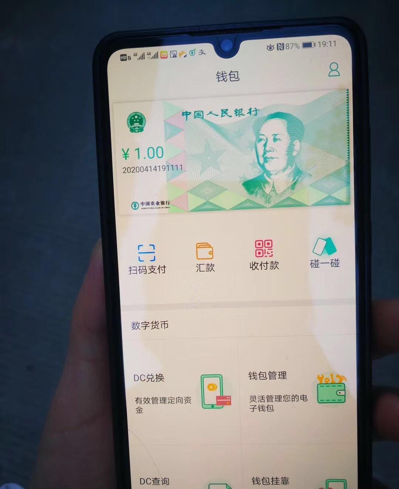

### 2020

---

After years of research China is trialing a test interface (a wallet) for the country's Central Bank Digital Currency (aka DC/EP).

China is one of the first countries in the world to develop a CBDC. Allowing accounts directly in a central bank might have a profound impact on the whole economy.
To increase the adoption it is said that DCEP will support offline payments.

People's Bank of China had been developing the system with the involvement of the country's four big state-owned banks as well as payments giants Ant Financial and Tencent.
The test is currently being carried out in four Chinese cities, including Xiong'An, Suzhou, Chengdu and Shenzhen.

  

Chińczycy ogłosili powstanie Narodowego Komitetu do spraw Blockchaina i wynika z niego, że w skład powstającego ciała wchodzić będą m.in. przedstawiciele chińskiego banku centralnego oraz pracownicy takich gigantów technologicznych jak Baidu czy Tencent 😲

Głównym zadaniem Komitetu będzie wypracowanie standardów dla całego obszaru technologii blockchain 🧐

Kto by pomyślał, że jakiś rodzaj bazy danych doczeka się własnych komitetów narodowych

---

CZY NIEMCY ZAMYKAJĄ WOLNY RYNEK?

Dawno, dawno temu, w 2016 roku, przed pandemią, chiński koncern chciał przejąć spółkę KUKA, branża robotyki, jeden z liderów. Niemiecki rząd zablokował transakcję.

Pandemia, wszystko nurkuje. Analizujemy jaka gałąź biznesu rozwinie się dzięki kryzysowi, bo przecież każdy kryzys to nowa szansa. Obserwujemy również jaka gałąź jest mocno przelewarowana, selekcja naturalna, kto nie przetrwa kryzysu.

W tym drugim przypadku to znowu mamy dwie opcje, albo upadnie i nigdy nie wstanie, ponieważ się okaże, że to kolejny nadmuchany balonik lub po prostu kryzys to kryzys, ale po zakończeniu pandemii wróci na swoje tory.

Niemiecki rząd jednak upatruje się innych problemów. Obawia się, że fundusze inwestycyjne za którymi stoją państwa spoza UE będą chciały wykorzystać promocję na giełdzie, aby przejąć firmy. Jak wskazuje zachodnie media, największe niebezpieczeństwo może nadejść ze strony chińskiej oraz saudyjskiej.

"Ekonomiczny dziennik „Handelsblatt” przyjrzał się jednak 160 firmom notowanym na frankfurckiej giełdzie. W 17 przypadkach ich wartość jest niższa niż kapitał własny pomniejszony o zobowiązania. W sytuacji takiej znalazły się m.in. gigant ubezpieczeniowy Allianz, koncern chemiczny BASF, linie lotnicze Lufthansa, koncern energetyczny RWE i największy niemiecki bank – Deutsche Bank.".

W środę (8 kwietnia) przyjął on projekt nowelizacji ustawy o stosunkach gospodarczych z zagranicą (Aussenwirtschafstgesetz – AWG).

"Transakcje istotne dla porządku publicznego mają w przyszłości nie dochodzić do skutku do momentu, aż zostanie sprawdzone, czy faktycznie nie stanowią zagrożenia. Sednem nowelizacji jest językowy szczegół. Przejęcie konkretnego przedsiębiorstwa będzie mogło zostać zablokowane przez rząd, jeśli niebezpieczeństwo jest „spodziewane”. Dotychczas musiało być „rzeczywiste”. Ponadto przy wydawaniu zezwolenia na przejęcie będzie też brane pod uwagę bezpieczeństwo partnerów z UE. Słowem: rząd Angeli Merkel znacząco poszerzył swoje pole manewru, ponieważ (jak zwraca uwagę Volker Treier ze Zrzeszenia Niemieckich Izb Przemysłowo-Handlowych DIHK) „spodziewane naruszenie” porządku publicznego jest terminem nieostrym i wyjątkowo pojemnym.

Niechciane przejęcia nie są jednak jedynym problemem w tej sferze, które spędzają sen z oczu niemieckiemu ministrowi gospodarki Peterowi Altmaierowi. Jak zwraca uwagę specjalista od przejęć Kai Lucks, obcy inwestorzy wolą w obecnej sytuacji unikać afiszowania się i zwiększają swoje wpływy w przedsiębiorstwach poprzez dokupywanie akcji. Giełdowa wartość motoryzacyjnego olbrzyma Daimlera jest np. obecnie o około połowę niższa niż przed rokiem. Li Shufu, szef chińskiego holdingu samochodowego Geely, i państwowy koncern BAIC jeszcze przed kryzysem mieli odpowiednio po około 10 proc. i 5 proc. akcji producenta Mercedesa. Również rząd Kuwejtu ma udziały w Daimlerze."

### 2018

https://pl.wikipedia.org/wiki/Czes%C5%82aw_Mostek

### 1989

https://pl.wikipedia.org/wiki/Protesty_na_placu_Niebia%C5%84skiego_Spokoju_w_1989

---

<a href="https://github.com/TomaszWaszczyk/historia.waszczyk.com/edit/master/src/content/april-15.md" target="_blank">Edytuj tę stronę dzieląc się własnymi notatkami!</a>
