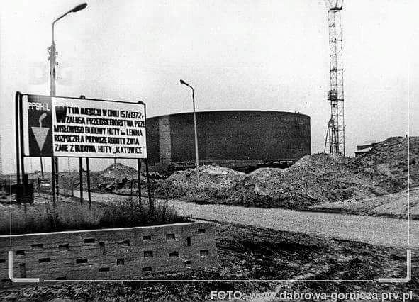

### 2020

After years of research China is trialing a test interface (a wallet) for the country's Central Bank Digital Currency (aka DC/EP).

China is one of the first countries in the world to develop a CBDC. Allowing accounts directly in a central bank might have a profound impact on the whole economy.
To increase the adoption it is said that DCEP will support offline payments.

People's Bank of China had been developing the system with the involvement of the country's four big state-owned banks as well as payments giants Ant Financial and Tencent.
The test is currently being carried out in four Chinese cities, including Xiong'An, Suzhou, Chengdu and Shenzhen.

  

Chińczycy ogłosili powstanie Narodowego Komitetu do spraw Blockchaina i wynika z niego, że w skład powstającego ciała wchodzić będą m.in. przedstawiciele chińskiego banku centralnego oraz pracownicy takich gigantów technologicznych jak Baidu czy Tencent 😲

Głównym zadaniem Komitetu będzie wypracowanie standardów dla całego obszaru technologii blockchain 🧐

Kto by pomyślał, że jakiś rodzaj bazy danych doczeka się własnych komitetów narodowych

---

CZY NIEMCY ZAMYKAJĄ WOLNY RYNEK?

Dawno, dawno temu, w 2016 roku, przed pandemią, chiński koncern chciał przejąć spółkę KUKA, branża robotyki, jeden z liderów. Niemiecki rząd zablokował transakcję.

Pandemia, wszystko nurkuje. Analizujemy jaka gałąź biznesu rozwinie się dzięki kryzysowi, bo przecież każdy kryzys to nowa szansa. Obserwujemy również jaka gałąź jest mocno przelewarowana, selekcja naturalna, kto nie przetrwa kryzysu.

W tym drugim przypadku to znowu mamy dwie opcje, albo upadnie i nigdy nie wstanie, ponieważ się okaże, że to kolejny nadmuchany balonik lub po prostu kryzys to kryzys, ale po zakończeniu pandemii wróci na swoje tory.

Niemiecki rząd jednak upatruje się innych problemów. Obawia się, że fundusze inwestycyjne za którymi stoją państwa spoza UE będą chciały wykorzystać promocję na giełdzie, aby przejąć firmy. Jak wskazuje zachodnie media, największe niebezpieczeństwo może nadejść ze strony chińskiej oraz saudyjskiej.

"Ekonomiczny dziennik „Handelsblatt” przyjrzał się jednak 160 firmom notowanym na frankfurckiej giełdzie. W 17 przypadkach ich wartość jest niższa niż kapitał własny pomniejszony o zobowiązania. W sytuacji takiej znalazły się m.in. gigant ubezpieczeniowy Allianz, koncern chemiczny BASF, linie lotnicze Lufthansa, koncern energetyczny RWE i największy niemiecki bank – Deutsche Bank.".

W środę (8 kwietnia) przyjął on projekt nowelizacji ustawy o stosunkach gospodarczych z zagranicą (Aussenwirtschafstgesetz – AWG).

"Transakcje istotne dla porządku publicznego mają w przyszłości nie dochodzić do skutku do momentu, aż zostanie sprawdzone, czy faktycznie nie stanowią zagrożenia. Sednem nowelizacji jest językowy szczegół. Przejęcie konkretnego przedsiębiorstwa będzie mogło zostać zablokowane przez rząd, jeśli niebezpieczeństwo jest „spodziewane”. Dotychczas musiało być „rzeczywiste”. Ponadto przy wydawaniu zezwolenia na przejęcie będzie też brane pod uwagę bezpieczeństwo partnerów z UE. Słowem: rząd Angeli Merkel znacząco poszerzył swoje pole manewru, ponieważ (jak zwraca uwagę Volker Treier ze Zrzeszenia Niemieckich Izb Przemysłowo-Handlowych DIHK) „spodziewane naruszenie” porządku publicznego jest terminem nieostrym i wyjątkowo pojemnym.

Niechciane przejęcia nie są jednak jedynym problemem w tej sferze, które spędzają sen z oczu niemieckiemu ministrowi gospodarki Peterowi Altmaierowi. Jak zwraca uwagę specjalista od przejęć Kai Lucks, obcy inwestorzy wolą w obecnej sytuacji unikać afiszowania się i zwiększają swoje wpływy w przedsiębiorstwach poprzez dokupywanie akcji. Giełdowa wartość motoryzacyjnego olbrzyma Daimlera jest np. obecnie o około połowę niższa niż przed rokiem. Li Shufu, szef chińskiego holdingu samochodowego Geely, i państwowy koncern BAIC jeszcze przed kryzysem mieli odpowiednio po około 10 proc. i 5 proc. akcji producenta Mercedesa. Również rząd Kuwejtu ma udziały w Daimlerze."

---

### Skarby Mariusza Dzi. - 10 Reichsfening

  

  

---

  

---

### 2018

https://pl.wikipedia.org/wiki/Czes%C5%82aw_Mostek

### 1989

https://pl.wikipedia.org/wiki/Protesty_na_placu_Niebia%C5%84skiego_Spokoju_w_1989

### 1972

Rozpoczęto budowę Huty Katowice. Decyzję o jej budowie podjął we wrześniu 1971 roku osobiście sam ówczesny pierwszy sekretarz KC PZPR Edward Gierek.
Skutkiem tej decyzji, nie licząc rozpoczęcia
15 kwietnia 1972 budowy samego zakładu,
były późniejsze ogromne zmiany struktury
gospodarczej i społecznej na skalę całego
kraju . Oprócz zupełnego przeobrażenia
zagłębiowskiego regionu, polegającego
zarówno na poważnych zmianach
urbanistycznych jak i wielkiej fali migracji
ludności (szczególnie z terenów wschodniej
Polski), równocześnie rozpoczęto realizację
innych, wielkich inwestycji centralnych,
takich jak budowa Linii Hutniczej
Szerokotorowej wraz z taśmociągiem
transportowym rudy żelaza, czy
dziesiątków zakładów pomocniczych.
Wymiernej, sumarycznej wartości pieniężnej
tej decyzji nigdy nie ustalono. Pierwszym dyrektorem tego zakładu został Kazimierz Budzyński. Natomiast honorowym pierwszym pracownikiem.. Leonid Breżniew

  

### 1967

Stocznia Gdańska otrzymała imię Włodzimierza Lenina. Fakt ten ogłosił przybyły z Warszawy członek Biura Politycznego, sekretarz Komitetu Centralnego Polskiej Zjednoczonej Partii Robotniczej Zenon Kliszko.
Oficjalnie nadanie stoczni imienia Lenina było spełnieniem rzekomego postulatu samej załogi. Mniej oficjalna wersja na temat opinii pracowników mówi, że fakt ten został skwitowany przez nich wieloma niecenzuralnymi słowami.

  

### 1943

Premier Wielkiej Brytanii Winston Churchill (zdjęcie) w rozmowie z generałem Władysławem Sikorskim, odnoszącej się do kwestii Zbrodni Katyńskiej stwierdził:
> Są rzeczy, które, choć wiarygodne, nie nadają się do tego, by mówić o nich publicznie.
Ten sam polityk pewien czas później spotkał się z radzieckim ambasadorem w Londynie Majskim. Padły wtedy kolejne słowa w tej sprawie:
>Nawet jeśli wersja niemiecka jest prawdziwa to i tak nie zmieni to stanowiska Londynu wobec Moskwy albowiem „na wojnie wszystko się zdarza".

  

### 1886

1886 roku w Krakowie urodził się Tadeusz Kutrzeba.
Był synem Tomasza Kutrzeby-kapitana armii austriackiej. W wieku 10 lat rozpoczął naukę w szkole realnej w Fischau koło Wiener Neustadt.
W 1903 roku zdał egzamin maturalny w Państowym Gimnazjum Realnym w Wiedniu,by później zostac studentem Wojskowej Akademii Technicznej w Mödling koło Wiednia. W latach 1906-10 służył w 9 Krakowskim Batalionie Saperów. Od 1910 roku studiował w Akademii Sztabu Generalnego w Wiedniu i ukończył wyższy kurs inżynierii.W 1911 roku został porucznikiem. Podczas służby w Sarajewie był świadkiem zamachu na księcia Ferdynanda. W czasie pierwszej wojny światowej służył na fronie włoskim i rosyjskim. W kwietniu 1920 jako szef sztabu 3 Armii
uczestniczył w wyprawie wojsk polskich na Kijów. Podczas odwrotu sprawował od czerwca do sierpnia funkcję szefa sztabu
Frontu Południowo-Wschodniego. W czasie bitwy warszawskiej kierował sztabem Frontu Środkowego, a następnie od sierpnia
do stycznia 1921 został szefem sztabu nowo utworzonej 2 Armii, która uczestniczyła w walkach o Białystok i pościgu za wojskami sowieckimi w kierunku na Grodno i Lidę . W tym czasie awansował do stopnia podpułkownika.
16 marca 1927 r. Prezydent RP Ignacy Mościcki na wniosek Ministra Spraw Wojskowych, Pierwszego Marszałka Polski
Józefa Piłsudskiego awansował go na generała brygady ze starszeństwem z 1 stycznia 1927 r. i 3. lokatą w korpusie
generałów. W czasie wojny obronnej w 1939 roku przeszedł cały szlak jako dowódca Armii "Poznań". W czasie bitwy nad Bzurą dowodził połączynymi Armiami "Poznań " i "Pomorze". To także on z upoważnienia dowódcy Armii "Warszawa" Julisza Rómmla podpisał 28 września 1939 roku Akt Kapitulacji Stolicy. Trafił do niemieckiej niewoli. Przebywał w obozach : Hohnstein,Königstein i Murnau. Organizował tam tajne kursy oficerskie. Z niewoli wyszedł w 1945 roku . Wkrótce wyjechał do Londynu,gdzie między innymi uczestniczył w organizowaniu Instytutu Władysława Sikorskiego. Zmarł na raka 8 stycznia 1947 roku w Londynie.
Generał Tadeusz Kutrzeba był jednym z najbardziej wykształconych polskich wyższych dowódców. Zyskał opinię jednego z najwybitniejszych sztabowców II Rzeczypospolitej.

  

---

<a href="https://github.com/TomaszWaszczyk/historia.waszczyk.com/edit/master/src/content/april-15.md" target="_blank">Edytuj tę stronę dzieląc się własnymi notatkami!</a>
