### 2021

> Moskwa komentuje wydalenie dyplomatów. Polska "jak wasal", zapomina, że "USA są daleko, a Rosja blisko"

### 2020

> Mało zaangażowani i strachliwi lekarze. Według Jacka Sasina to przez nich są problemy w walce z pandemią

> Minister A. Niedzielski: "Pracujemy nad stworzeniem tzw. klauzuli dobrego samarytanina, która pozwoli lekarzom poczuć się bezpiecznie i w ramach walki z COVID-19 błędy, które będą popełniane nieumyślnie, nie będą karane."

---

Polskie dane to ściema, pokazują ok 5%prawdy .
SANEPID UTRUDNIA LEKARZOM POBIERANIE BADAŃ, ŻEBY POBRAĆ BADANIE TRZEBA MIEĆ ZGODĘ DYREKCJI.... TO JEST JAKIŚ ŻART !!! Na wyniki czeka się kilka dni.
Wiem co się dzieje w Pomorskich Szpitalach i nie tylko, to się dzieje w całej Polsce ! To jest dno, drżenie o własne stołki, polityczne lizusostwo, głupota urzędników . To będzie kosztować życie wielu pacjentów i personelu.
Zmuszacie ludzi do misji samobójczych !!!
Ta telewizyjna propaganda sukcesu nijak się ma rzeczywistości.

Jeszcze się nie zaczęło a już się kończy..... już w wielu miejscach nie ma masek, nigdy nie było gogli, kończą się rękawiczki..... W wielu miejscach na wyniki , jeśli udało się gdzieś wysłać, czeka się nawet 6-7 dni....Personel sam za własne pieniądze próbuje kupić sobie sprzęt ochronny... Pracownicy w zakładów rtg, laboratoriów często bez jakiejkolwiek ochrony.... to samo w karetkach
Śmiertelność na oddziałach intensywnej terapii waha się między 15 a 80 %, średni czas pobytu na respiratorze 10-14 dni.
Personel nie powinien wykonywać żadnych zabiegów bez odpowiedniego zabezpieczenia bo jeden martwy lekarz lub pielegniarka = kilkuset martwych pacjentów

Personel powinien być testowany codziennie i bez wyniku testu nie powinien wchodzić do szpitala

Szpitale powinny wynająć pracownikom hotele celem izolacji ich od rodzin.

Nigdy nie myślałam, że czas pandemii będzie też czasem weryfikacji jednej z najsłabszych cech ludzkich ODWAGI CYWILNEJ .

Strach o własne stołki, układy, układanki, wspólne interesy, co kto powie....wygrywa.

Kiedy wreszcie odważycie się mówić będzie juz ZA PÓŹNO!

NIE PRACUJ BEZ ZABEZPIECZENIA !
1 ZAKAŻONY MEDYK = 1000 ZAKAŻONYCH PACJENTÓW = WIĘCEJ ZGONÓW
Do personelu medycznego!
To jest czas na pragmatyzm a nie heroizm
1martwy medyk =1000 martwych pacjentów
Myślcie na kilkanaście miesięcy do przodu.

Co do danych podawanych przez Ministerstwo Zdrowia :

Liczby oficjalnie prezentowane przedstawiają maksymalnie ok 5 % zachorowań, zgonów . I to są dane z przed paru dni, bo ok. 6 dni czeka się na wynik testów. Nie bada się też osób zmarłych ani nie bada się osób ze słabymi objawami....

Brak odpowiedniej ilości testów oraz kodowanie rozpoznań uniemożliwia wgląd w prawdziwą sytuację. Problem kodowanie NIE JEST winą lekarzy, to wina braku przeprowadzanych testów. Nie można postawić diagnozy COVID 19 bez zrobionego testu..... ( W chwili obecnej)

Apeluję do lekarzy! Wpisujcie w historiach choroby, aktach zgonu oba kody (W zależności od sytuacji )! U07.1 oraz U07.2 Nieważne co podaje ministerstwo !
NIE MOŻEMY ZATAJAĆ PRAWDY Z POWODU jakiegoś przepisu!

Rzetelna informacja jest w chwili obecnej JEDYNĄ skuteczną formą walki z pandemią !
Każdy człowiek może kogoś uratować rozpowszechniając PRAWDĘ!

Wszystko się sypie, rozpada, ludzie umierają a administracje wielu jednostek i szpitali marnują pieniądze podatników na przeglądanie PRYWATNYCH kont fejsbukowych i PRYWATNYCH grup.... oraz na wzywaniu pracowników na dywaniki, groźbach itd... Zamiast organizować sprzęt, testy, rozwiązania to śledzą fejsa i to jeszcze z fałszywych kont..... No SUPER! GRATULUJĘ!
ZAJMIJCIE SIĘ DO CHOLERY TYM ZA CO DOSTAJECIE KASE A NIE SIEDZENIEM NA FEJSIE !!!

Smutna prawda o przygotowaniu do pandemii. Czarna.dziura.....

Odpowiedź jest smutna i bolesna.
1. Państwo dużo mówi, bardzo mało robi. Czyli trwa program "opowieści dziwnej treści PLUS" czyli "ściema PLUS". Brak możliwości powszechnego testowania>fałszywe statystyki

Dr. Dorota Szlosowska, pulmonologist.

---

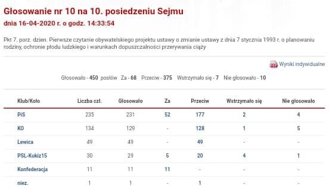  

---

Mnuchin graduated from Yale in 1985 and started working for Goldman Sachs, where his father had been employed since 1957.

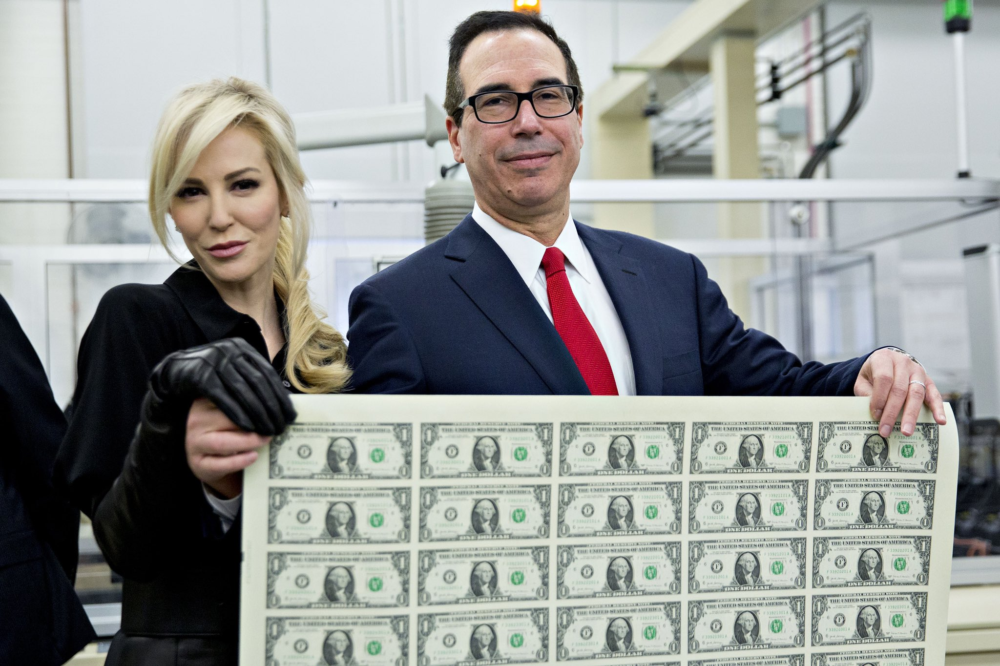  

> “Let them eat 1,200 pieces of paper.” - Steve Mnuchin

What's coming with all this "stimulus":

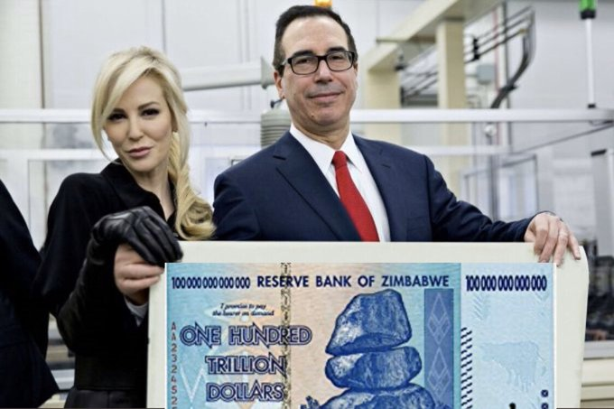  

---

### 1991

W byłym gmachu KC PZPR, na świeżo wylakierowanym parkiecie, przy pożyczonych komputerach, atrapach telefonów, przeprowadzono pierwszą sesję. Notowanych było zaledwie pięć firm, z których niestety żadna nie jest już obecna na GPW.

Zanim jednak odbyła się pierwsza sesja, 12 kwietnia Minister Przekształceń Własnościowych i Minister Finansów reprezentujący Skarb Państwa podpisali akt założycielski Giełdy Papierów Wartościowych. To otworzyło drogę do rozwoju rynku. Kilka dni później, 16 kwietnia w samo południe, w byłym gmachu komitetu centralnego, na świeżo wylakierowanym parkiecie, przy pożyczonych komputerach, atrapach telefonów, przeprowadzono pierwszą sesję.

- Do pierwszej sesji przygotowałem się bardzo intensywnie przez cały rok, ale jak to zwykle z debiutami bywa, wiele najważniejszych spraw trzeba było załatwiać w ostatniej chwili. Bardzo się baliśmy, że arkusz zleceń się nie wypełni, że nie będzie zainteresowania handlem. Baliśmy się, czy kursy transakcyjne uda się ustalić. Nikt z nas nie myślał o żadnej konferencji prasowej, nikt tego nie organizował, ale zjawiło się bardzo dużo ludzi, masę dziennikarzy z kamerami. Dwa razy w życiu byłem świadkiem takiej sytuacji, którą mogę nazwać historyczną. Raz podczas mszy papieskiej w 1978 r., a drugi raz właśnie wtedy, gdy musiałem wygłosić informację o przebiegu pierwszych transakcji. - wspominał kilka lat temu na łamach „Parkietu" Wiesław Rozłucki, pierwszy prezes GPW. - Uruchomienie parkietu w Warszawie to była improwizacja, której jednak towarzyszyła głęboka motywacja, by zbudować giełdę według nowoczesnych wzorców światowych. Pomagali nam partnerzy z Francji, brak doświadczenia nadrabialiśmy zaangażowaniem - dodawał

Podczas pierwszej sesji 16 kwietnia 1991 r. notowanych było 5?? spółek:

- Tonsil

- Próchnik

- Krosno

- Kable

- Exbud

Na pierwszej sesji notowanych było pięć firm: Tonsil, Próchnik, Krosno, Kable, Exbud. Wpłynęło wówczas 112 zleceń kupna i sprzedaży, a łączny obrót giełdy wyniósł 1990 zł.

Dzisiaj żadna ze spółek, która notowana była na pierwszej sesji, nie jest już obecna na GPW. Rynek w ciągu 29 lat przebył jednak bardzo długą drogę. Dzisiaj warszawska giełda jest największym rynkiem w Europie Środkowo – Wschodniej. Na głównym rynku notowane są 444 spółki, a ich łączna kapitalizacja to ponad 800 mld zł. Warszawa pod względem kapitalizacji firm, a także obrotów rynkowych wyraźnie przebija m.in. giełdę wiedeńską, z którą przez lata rywalizowała o prym w Europie Środkowo – Wschodniej.

  

Tak naprawdę giełda warszawska w Pałacu Saskim powstała w 1817 r. z inicjatywy władz Królestwa Polskiego. Spełniała ten sam cel, co starsze od niej giełdy w Londynie i Amsterdamie - obsługiwała dług państwowy. Do pośredniczenia w transakcjach ustanowiono sześciu „meklerów” 😉

Wkrótce uwłaszczenie chłopów i uprzemysłowienie dolały giełdowego paliwa wszystkim, ale giełda została zdominowana przez dwóch arcywrogów: L. Kronenberga oraz J. Blocha. Ta para rywali dominowała w W-wie do tego stopnia, że ich walka destabilizowała rynek finansowy Królestwa. Aby mieć blisko do Saskiego, Bloch zamieszkał w pałacu przy Marszałkowskiej, a Kronenberg wybudował pałac jeszcze bliżej na placu ewangelickim. Na giełdzie wciąż pożyczali pieniądze na bardzo wysoki procent, byle tylko zyskać środki na nowe budowy kolei. Wojnę dwóch finansowych imperiów z uwagą obserwowali mieszkańcy Królestwa, bo Bloch był szanowanym obywatelem i filantropem, nawet polskim kandydatem do pokojowego Nobla, a Kronenberg patriotą i przyjacielem J. I. Kraszewskiego. Późniejsza giełda była już tylko cieniem tej z XIX w...

Niestety w 1944 r. wszystkie trzy pałace ww. zostały celowo wysadzone tuż przed wkroczeniem Armii Czerwonej. W ich miejscu dziś stoją Grób Nieznanego Żołnierza, Victoria i poprzednia siedziba BZ WBK.

### 1977

Telewizja Polska rozpoczęła emisję serialu wojennego Polskie drogi - w reżyserii Janusza Morgensterna. Akcja rozgrywa się w latach 1939-43 i skupia się ona na losach podchorążego Władysława Niwińskiego, w którego rolę wcielił się Karol Strasburger, oraz kaprala Leona Kurasia - w tej roli Kazimierz Kaczor. Polskie drogi to jeden z najpopularniejszych polskich seriali telewizyjnych wielki portret Polski Walczącej z okresu okupacji hitlerowskiej.
Na przykładzie losów głównych bohaterów przedstawia się wielowątkową opowieść o Polsce i Polakach znajdujących się pod okupacją hitlerowską. W serialu ukazane są takie tragiczne wątki z naszej historii jak budowa obozu koncentracyjnego w Oświęcimiu, aresztowanie profesorów w Krakowie, pacyfikacja i wysiedlenie mieszkańców Zamojszczyzny oraz powstanie w getcie warszawskim. Wspaniałe role Karola Strasburgera, Kazimierza Kaczora, Włodzimierza Boruńskiego (prywatnie brata stryjecznego Juliana Tuwima(żyda)) i Henryka Talara.

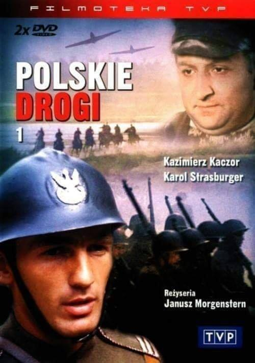  

### 1970

Stamps issued in East Germany to celebrate Lenin's 100th birthday.

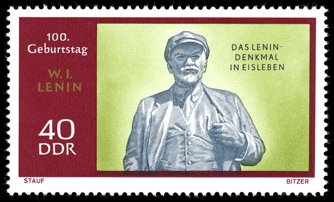  

### 1952

Po sfingowanym procesie opartym na wymuszonych i fałszywych zeznaniach byłych podwładnych został skazany na karę śmierci generał August Emil Fieldorf "Nil".
W uzasadnieniu wyroku napisano:
" "Biorąc pod uwagę olbrzymi ciężar zbrodni, sąd uznał za niezbędne całkowite wyeliminowanie oskarżonego ze społeczeństwa, orzekając karę śmierci".
Wyrok wykonano 24 lutego 1953 roku

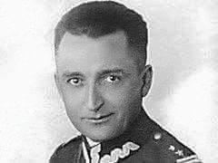  

### 1945

Na wzgórzach Seelow rozpoczęła się pierwsza bitwa na terenie Niemiec, w której udział wzięło 78 550 żołnierzy 1 Armii Wojska Polskiego. Polacy walczyli w szeregach 1 Frontu Białoruskiego dowodzonego przez Gieorgija Żukowa.
Przeciwko tym liczącym ponad milion żołnierzy siłom stanęło 91 tysięcy żołnierzy niemieckich 9 Armii pod dowództwem Theodora Bussego.
Ofensywa rozpoczęła się 16 kwietnia nad ranem od masowego ostrzału niemieckich pozycji z dział i katiusz, który prowadzono od godziny 3 do 5. Było to największe przygotowanie artyleryjskie w historii wojny, wykorzystano wówczas około 8900 dział i katiusz. Po 4 dniach ciężkich walk niemiecka wschodnia linia frontu przestała istnieć i droga do Berlina została otwarta.
W czasie walk zginęło 33 000 żołnierzy radzieckich i 2 300-5 000 żołnierzy polskich, po stronie niemieckiej 12 000 zabitych.

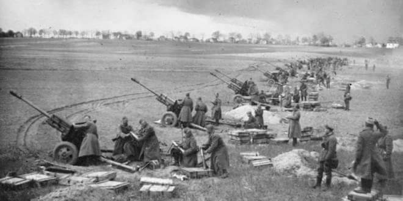  

### 1944

Chodaczków Wielki. Tam Polaków spalono w stodołach
16 kwietnia 1944 r. 4. Pułk Policji SS, złożony z ukraińskich ochotników, a dowodzony przez Niemców, dokonał masowej zbrodni w Chodaczkowie Wielkim. To miejscowość w byłym województwie tarnopolskim. W wyniku bestialskiego, masowego mordu, śmierć ponieść mogło nawet ponad 800 Polaków. Część z nich zginęła w straszliwych mękach. Zostali spaleni żywcem w stodołach ( więcej niż jednej) w tej miejscowości.
Wieś Chodaczków przed wojną liczyła ponad 2800 mieszkańców. Od 1943 roku funkcjonowała tam polska samoobrona mająca na celu obronę przed bandami UPA. W kwietniu 1944 front niemiecko-sowiecki zbliżył się w okolice miejscowości Wieś została zajęta ukraińskimi ochotnikami z 4. Pułku SS złożonej z Ukraińców.
Ukraińska policja po dotarciu do Chodaczkowa rozpoczęła podpalanie zabudowań i eksterminację polskich mieszkańców wsi. Byli zabijani tylko dlatego, że byli Polakami. Wiele ofiar zostało zagnanych do stodół i spalonych żywcem. Ludzie krzyczeli z bólu, strachu i rozpaczy.  Zanim pochłonął ich ogień musieli wiele wycierpieć. Jak bardzo, tego nawet nie jesteśmy w stanie sobie wyobrazić. Nie były to jedyne miejsca kaźni naszych rodaków.  Do domów wrzucano granaty. Zabijano każdego kto uciekał. Nieważne, czy była to kobieta, mężczyzna czy dziecko.  Wiele polskich mieszkańców zginęło w bestialskich sposób zamęczonych. Ukraińcy przed śmiercią ich  maltretowali i okrutnie znęcali  się. Źródła podają, że zginęło od 250 do 862 osób. Ofiary pochowano w zbiorowej mogile przy ruinach kościoła rzymsko-katolickiego.
Do dziś większość Ukraińców tam mieszkających, a będących świadkami,  czy sprawcami zrzuca winę tylko na Niemców. Wiadomo, że mordów dopuszczali się Ukraińcy, często mieszkańcy tej miejscowości. Miejscowi Ukraińcy nie chcą mówić ,bo pewnie niejednemu sprawcy, czy świadkowi zbrodni śnią się mordowani polscy sąsiedzi, pewnie krzyki palonych żywcem ludzi, niektórzy w swoich sumieniach słyszą do teraz.
Wielu z mieszkańców Chodaczkowa Wielkiego, którym udało się ujść z rąk ukraińskich oprawców z życiem,  po wojnie osiedliło się w Gajkowie pod Wrocławiem. Cmentarz w Chodaczkowie Wielkim jest porządkowany w ramach akcji „Mogiłę pradziada ocal od zapomnienia„.
Aby podobne zbrodnie nie wydarzyły się w przyszłości, nie wolno nam o tych co miały miejsce- nie wiedzieć. Informacja – to najskuteczniejsza obrona. Pomordowanym nie możemy już pomóc, ale zapomnieć o nich - to tak jakby bezwiednie pomagać ich mordercom.

Fotografia: Obraz m.Kowalsky Płonące Kresy

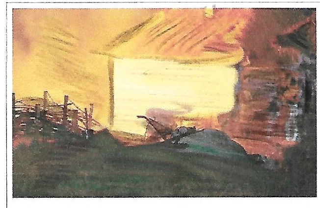  

### 1943

Kierownictwo Niemieckiego Czerwonego Krzyża zwróciło się z oficjalną prośbą do Międzynarodowego Czerwonego Krzyża o natychmiastowe wysłanie do Katynia delegacji międzynarodowej celem zbadania masowych grobów polskich oficerów.
Ciekawostką jest fakt, że głównym inspiratorem włączenia do śledztwa inspektorów MCK był sam minister propagandy III Rzeszy Joseph Goebbels.
Jeszcze tego samego dnia Niemiecki Czerwony Krzyż otrzymał odpowiedź od prezydenta MCK Maxa Haubera, który stwierdził, że udział ekspertów MKCK w pracach ekshumacyjnych w Katyniu będzie możliwy jedynie wtedy, kiedy z wnioskiem zwrócą się wszystkie zainteresowane strony. Dzień później reprezentujący w Genewie Polski Czerwony Krzyż Stanisław Radziwiłł złożył w MCK oficjalną notę Rządu RP w Londynie zawierającą żądanie powierzenia neutralnej komisji zbadanie sprawy śmierci polskich oficerów w Katyniu.

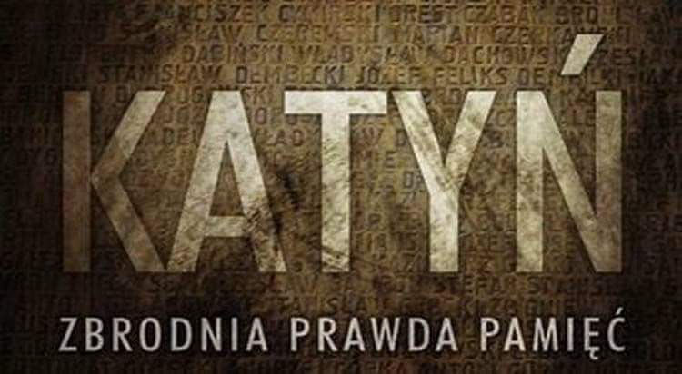  

### 1932

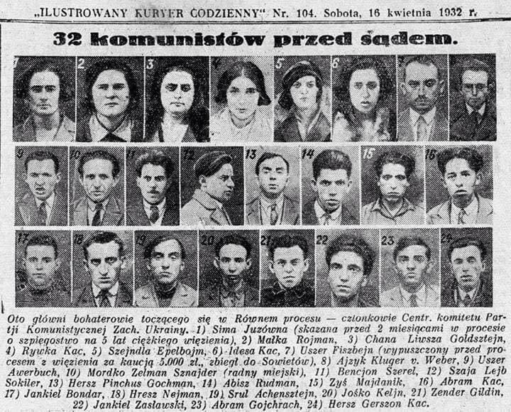  

### 1922

https://pl.wikipedia.org/wiki/Uk%C5%82ad_w_Rapallo

W 1932 r. Rosjanie mieli największy eksport zboża w swojej historii. Pilnie potrzebowali pieniędzy na zbrojenia, aby razem z Hitlerem móc podzielić się Europą (16 kwietnia 1922 roku w Rapallo koło Genui sowiecka Rosja i Niemcy zawarły tajny układ o współpracy wojskowej).
W Jednocześnie, rozkazem Stalina za pomocą okrutnego terroru z wyrokami śmierci włącznie, wywieziono z Ukrainy całe dostępne tam zboże, w tym przeznaczone na zasiew (obecnie próbują robić to samo).
Zagłodzono wtedy na śmierć miliony Ukraińców.
Piszę o tym tylko po to aby przypomnieć, że ci, którzy importowali to zboże, doskonale wiedzieli co się dzieje na Ukrainie!!!!!!
Przypadek ? Nie sądzę. W polityce są tylko znaki. Poznawajmy i rozumnie je czytajmy. Dla własnego bezpieczeństwa. To co robią obecnie w Holandii i innych krajach może skutkować podobną hekatombą, na jeszcze większą skalę.

### 1871

https://pl.wikipedia.org/wiki/Kaiserliche_Marine

### 1746

II powstanie jakobickie: armia brytyjska pokonała wojska jakobickie w bitwie pod Culloden.

Rozegrana 16 lipca 1746 roku bitwa na rozległych wrzosowiskach Culloden była ostatnią bitwą na głównym lądzie Wielkiej Brytanii, a zarazem całkowitą i ostateczną porażką jakobitów w walce o powrót na tron dziedziców dynastii Stuartów. Bonnie Prince Charlie w 1745 roku stacjonując w Glenfinnan zebrał wokół siebie sporą grupę szkockich górali wspierających restaurację Stuartów i ruszył do walki z wojskami hanowerskimi, które okupowały Szkocję. Armia Karola szybko odbiła Perth i Edynburg, po czym miała uderzyć na Londyn. W tym czasie książę liczył na wsparcie Francuzów, którzy także chcieli usunąć z brytyjskiego tronu króla Jerzego II. Miał też nadzieję, że do walki włączą się angielscy jakobici.

Karol dotarł z wojskiem do Anglii 8.XI.1745 roku, zdobywając Carliste i Manchester. Czwartego grudnia armia zatrzymała się w Derby. Jak się okazało, zarówno Francuzi, jak i angielscy sprzymierzeńcy, nie kwapili się do pomocy szkockim rebeliantom. Według źródeł, narada wojskowa księcia Karola z doradcami, odbyła się tego dnia na piętrze budynku, który dziś służy jako pub. Wbrew wcześniejszym planom, książę za namową generałów, postanowił powrócić do Szkocji, by tam stworzyć wielką armię z rosnących zastępów jakobitów. Legendy głoszą, że król Jerzy II chciał już ustąpić z tronu na rzecz młodego Stuarta, jednak nie pozostał na poparcie tej teorii żaden ślad historyczny.

Jakobici zawrócili do Szkocji 6 grudnia. Tymczasem armia angielska, na wieść o odwrocie wojsk Karola, zaczęła się zbroić i podążać ich śladem. W lutym 1746 roku książę osiadł w Inverness, a Anglicy pod dowództwem księcia Cumberland, zwanego Rzeźnikiem - swoje siły rozmieścili w Aberdeen i Dunkeld. Armia jakobicka opuściła Inverness w kwietniu, pozostawiając tam większość zapasów i wybierając na miejsce starcia bezleśne terenu wrzosowiska Culloden.

15 kwietnia 1746 roku rzeźnik Cumberland obchodził hucznie swoje 25-te urodziny. Całe wojsko angielskie piło za jego zdrowie w miejscowości Nairn. Jakobici tkwili więc na wrzosowiskach, czekając na nadejście przeciwnika. Kiedy stało się jasne, że Anglicy są zbyt pijani by walczyć, jeden z generałów szkockich wysunął myśl, by ruszyć na Nairn i zaskoczyć wojsko Cumberlanda. Tak też zrobili. Jednak po całonocnym marszu, o świcie 16 kwietnia, armia szkocka była wciąż ponad 3 km od Nairn. Dowódcy jakobitów postanowili więc powrócić na wrzosowiska, około 16 km od miejsca, do którego dotarli. Anglicy szybko dogonili armię księcia Karola i do konfrontacji doszło około godziny 11. Armia angielska w liczbie około 8810 żołnierzy miała przewagę zbrojeniową i liczebną nad Szkotami. O ile z Inverness wyruszyło ich blisko 5400, o tyle część rozpierzchła się w poszukiwaniu jedzenia, część zasnęła zmęczona całonocnym marszem, a ci, którzy pozostali na polu walki mieli za sobą 30 km spacer i pustkę w brzuchu. Zatem nie dziwi nikogo, że już po godzinie bitwa została ostatecznie zakończona. Straty angielskie wynosiły 59 zabitych i 259 rannych, a Szkoci stracili około 1250 żołnierzy, tyle samo było rannych, a 558 wzięto do niewoli.

Po bitwie rozpoczęły się prześladowania Szkotów, w tym słynne zakazy ubierania się w klanowe kilty i gry na dudach tereny wrzosowiska podlegają opiece National Trust for Scotland. W lipcu otwarto tam nowoczesne centrum informacji turystycznej z interaktywnymi pokazami bitwy. Poszczególne miejsca godne uwagi są bardzo dobrze oznakowane. Nieopodal pola walki wznosi się ponadto kurhan ku czci zabitych jakobitów (Memorial Cairn) i chatka Lanach Cottage, w której po bitwie spalono żywcem 30 jakobitów.

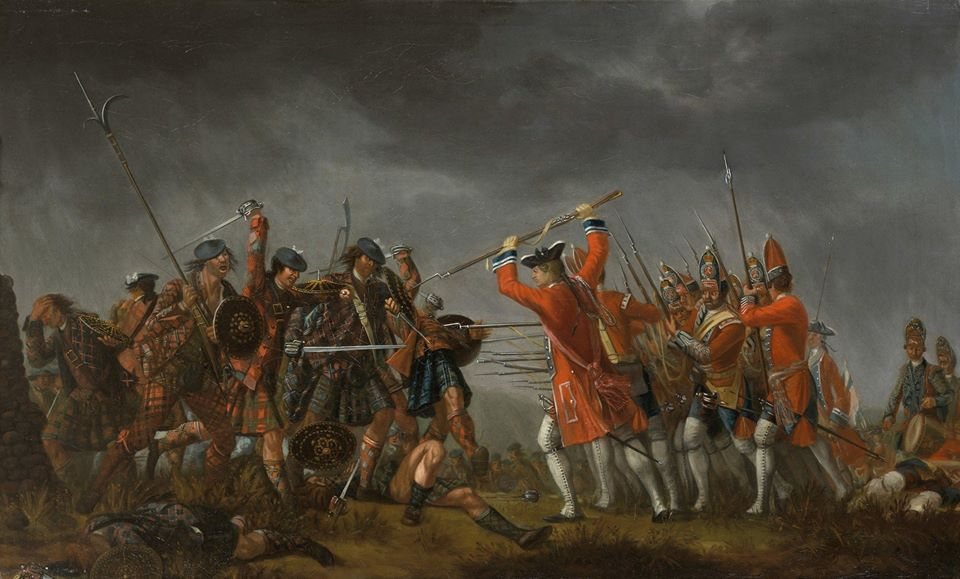  

---

<a href="https://github.com/TomaszWaszczyk/historia.waszczyk.com/edit/master/src/content/april-16.md" target="_blank">Edytuj tę stronę dzieląc się własnymi notatkami!</a>
