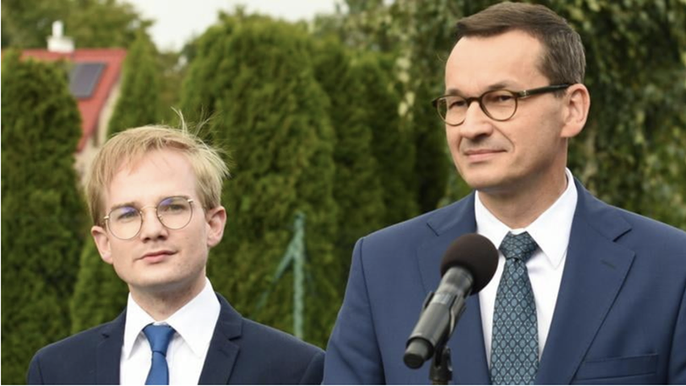
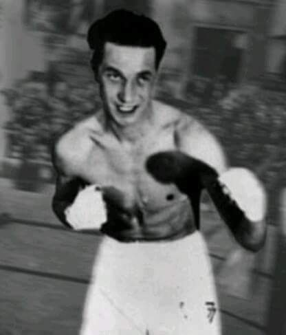
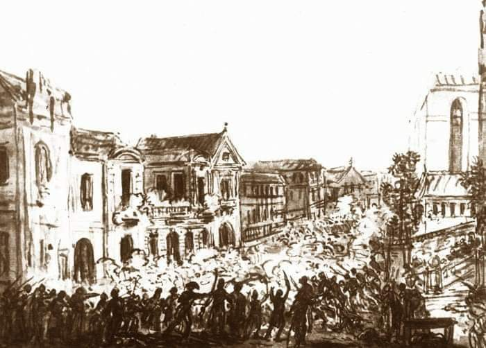

### 2021

"Na łące opodal krzaczka,

Mieszkała kaczka-dziwaczka,

Lecz zamiast trzymać się łąki

szukała dobrej szczepionki.

Raz poszła więc do tawerny:

"Dajcie mi fiolkę Moderny!"

Tuż obok była apteka,

"Poproszę Astra Zeneca!"

Udała się do dilera:

"Chciałabym dawkę Pfizera!"

a potem, nienasycona:

"Gdzie tu dostanę Johnsona?"

W kącie za starym śmietnikiem

ktoś ją ostrzyknął Sputnikiem.

Martwiły się inne kaczki:

"Co będzie z takiej dziwaczki?"

Aż nagle znalazł się kupiec:

"Na obiad można ją upiec!"

Pan kucharz kaczkę starannie

Piekł, jak należy, w brytfannie.

Lecz zdębiał, obiad podając, 

bo z kaczki zrobił się zając -

miał Wi-Fi, czip i walonki...

Takie to były szczepionki!

### 2020

#### Otwarta prywatyzacja państwa

Narodowy Bank Polski skupił na czwartkowym przetargu obligacje skarbowe za 30,7 mld zł. W ciągu miesiąca NBP wydał już na aukcjach obligacji państwowych prawie 50 mld zł i realnie obniża rynkowe oprocentowanie obligacji. Na każdej kolejnej aukcji przeznacza coraz więcej wykreowanych sztucznie pieniędzy, żeby pomóc w ten sposób w finansowaniu deficytu budżetu państwa. Dług państwa na koniec 2019 roku wynosił 973 mld zł, czyli NBP ma w swoim portfelu obligacje stanowiące już 5,01 proc. tego długu. ING łącznie NBP przejmie papiery za 170 mld zł, czyli w banku znajdzie się około 17 proc. państwowego zadłużenia. W skali ostatniego miesiąca, czyli od początku bezpośredniego udziału NBP w aukcjach, złoty osłabił się jednak względem euro o 2 proc., do franka o 2,7 proc., a dolara - o aż 4,8 proc.

NBP finansuje dług państwa to jest nielegalne. Te operacje nie maja na celu zwiększenia płynności (skup od innych banków to OOT), tylko pokrycie bieżących wydatków

#### Ministerstwo Finansów

Ministrowie uciekają z resortu finansów. Na ich miejsce 28-latek (Piotr Patkowski) i zapalona harcerka (Anna Chałupa - nowa wiceminister finansów i wiceszefowa Krajowej Administracji Skarbowej. Jak podają media, jest harcerką i absolwentką ekonomii, a w 2018 roku Marian Banaś powołał ją na dyrektora Izby Administracji Skarbowej we Wrocławiu.)

  

  

Karuzela kadrowa w resorcie finansów trwa. Dwa dni, dwie potężne zmiany. A premier Mateusz Morawiecki zapowiada zwiększenie długu publicznego.

W środę na konferencji prasowej premier Mateusz Morawiecki mówił: - Na pewno będziemy zwiększać dług publiczny, bo wraz z budżetem państwa jest to główny impuls finansowy, który stymuluje gospodarkę.

Tymczasem dzień wcześniej, we wtorek, z resortu odszedł wiceminister Leszek Skiba, który odpowiadał m.in. za politykę makroekonomiczną i legislację podatkową. Skiba, który w resorcie pojawił się w 2015 r., został właśnie wiceprezesem Banku Pekao SA.

W środę z kolei odszedł Tomasz Słaboszowski, również wiceminister i zastępca szefa Krajowej Administracji Skarbowej. Na swoje stanowisko został powołany jeszcze przez ministra finansów Mariana Banasia.

### 1991

,,Jeszcze dziś tkwi w nas pamieć o Numerze 77, który bił Niemców jak chciał'' Borowski T, U nas w Auschwitzu.

17 kwietnia 1991 roku w Bielsku-Białej zmarł Tadeusz Pietrzykowski ps. ,,Teddy - Żelazna Pięść'' - bokser, trener, nauczyciel wychowania fizycznego, podchorąży WP, jeden z pierwszych więźniów niemieckiego obozu koncentracyjnego Auschwitz (nr obozowy 77), bokserski Mistrz Wszechwag obozu koncentracyjnego Auschwitz.

Karierę bokserską rozpoczął w klubie Legia Warszawa, gdzie trenował pod okiem mistrza Feliksa Stamma. W 1937 roku wywalczył tytuł mistrza Warszawy w wadze koguciej. Po wybuchu II wojny światowej uczestniczył jako podchorąży Centrum Wyszkolenia Kawalerii w Grudziądzu w obronie Warszawy. Wiosną 1940 roku próbował przedostać się do Francji i wstąpić do formowanych tam wojsk polskich, niestety został aresztowany przez Niemców i osadzony w więzieniu w Tarnowie, skąd został 14 czerwca tego samego roku, deportowany z pierwszym transportem więźniów do KL Auschwitz. Do historii przeszedł przede wszystkim jako Mistrz Wszechwag obozu koncentracyjnego Auschwitz. Ważący 40 kg Pietrzykowski pokonał m.in. cięższego o 30 kg. byłego zawodowego mistrza Niemiec w wadze średniej Waltera Düninga. W nagrodę za zwycięską walkę otrzymał pół bochenka chleba, kostkę margaryny oraz przydział do pracy w komandzie ,,Tierpfleger''. Szacuje się, że Pietrzykowski stoczył w Auschwitz od 40 do 60 walk. W 1943 został deportowany do KL Neuengamme, gdzie trzymał numer obozowy 17955. Wyzwolenia doczekał 15 kwietnia 1945 roku w obozie Bergen-Belsen. Po wyzwoleniu wstąpił do 1 Dywizji Pancernej gen. Stanisława Maczka, gdzie zajmował się organizacją zajęć sportowych wśród żołnierzy.

  

### 1940

Prawdopodobnie 17 kwietnia 1940 roku został zamordowany w Katyniu Kazimierz Karol Solski (zdjęcie) kapitan artylerii Wojska Polskiego, bohater wojny polsko-bolszewickiej, członek Polskiej Organizacji Wojskowej, adiutant generała Władysława Andersa. 17 września 1939 roku trafił do sowieckiej niewoli. Został osadzony w obozie w Kozielsku, z którego wywieziono go do Katynia 5 listopada 1939 roku.
Miał 40 lat.

  

### 1794

Rozpoczęła się Insurekcja Warszawska- jedna ze zwycięskich bitew podczas Powstania Kościuszkowskiego. Wydarzenie to, nazywane też Powstaniem Warszawskim z 1794 roku, inspirowane w sporej mierze zwycięstwem Tadeusza Kościuszki pod Racławicami, mające na celu przejęcie przez mieszkańców kontroli nad miastem z rąk Imperium Rosyjskiego, rozpoczęło się na Żoliborzu około godziny czwartej. Oddziały Gwardii Pieszej Koronnej zaatakowały w rejonie Żelaznej Bramy rosyjski regiment oraz zajęły jego uzbrojenie. Dwie godziny później powstańcy dokonali ataków na Nalewkach, Bonifraterskiej czy Lesznie, przystąpiono także do generalnego szturmu na ulicę Miodową, gdzie w pałacu Morsztynów stacjonował rosyjski ambasador Osip Igelström.
Od samego początku oddziały powstańcze odnosiły zwycięstwa nad Rosjanami, którzy zaskoczeni opuszczali swoje pozycje w popłochu, a także ponosili spore straty. Na pewien czas sytuacja została opanowana korpus kawalerii pruskiej dowodzony przez gen. Friedricha Gideona Wölcky`ego, który osłaniając oddziały rosyjskie pomógł im wycofać się w stronę Powązek. Zaciekłe walki miały miejsce również w okolicach Pałacu Krasińskich skąd prowadzących ogień powstańców wyparły wojska rosyjskie, które następnie splądrowały obiekt. W tym samym czasie trwały walki na Krakowskim Przedmieściu i w Ogrodzie Saskim, gdzie wojska rosyjskie wykrwawiły się i zmuszone zostały do wycofania się.
Jednym z istotnych wątków tej historii jest zachowanie króla Stanisława Augusta Poniatowskiego, który razem z targowiczanami uciekł do Zamku Królewskiego. Pragnąc opanować i załagodzić sytuację powołał na prezydenta Warszawy współzałożyciela Zgromadzenia Przyjaciół Konstytucji Rządowej Ignacego Wyssogotę Zakrzewskiego, a na komendanta stolicy majora Stanisława Mokronowskiego. Zabiegi te nie przyniosły oczekiwanych efektów. Dopiero następnego dnia, z inicjatywy Mokronowskiego sprowadzono do Warszawy więcej armat, które wykorzystano między innymi do oblężenia pałacu Morsztynów na ulicy Miodowej.
Powstanie zakończyło się sromotną klęską Rosjan 18 kwietnia 1794 roku. Wszystkie siły rosyjskie zostały rozgromione lub zmuszone do ucieczki, do końca dnia skapitulowały ostatnie punkty rosyjskiego oporu. W walce poległo około 500 Polaków i od 2500 do 4000 Rosjan.

  

### 1786

https://pl.wikipedia.org/wiki/Walerian_%C5%81ukasi%C5%84ski

---

<a href="https://github.com/TomaszWaszczyk/historia.waszczyk.com/edit/master/src/content/april-17.md" target="_blank">Edytuj tę stronę dzieląc się własnymi notatkami!</a>
