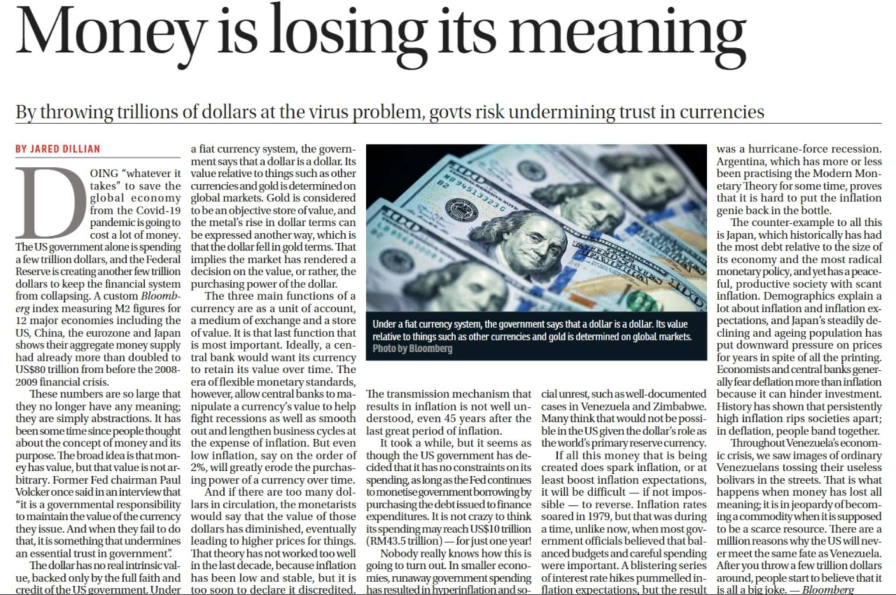
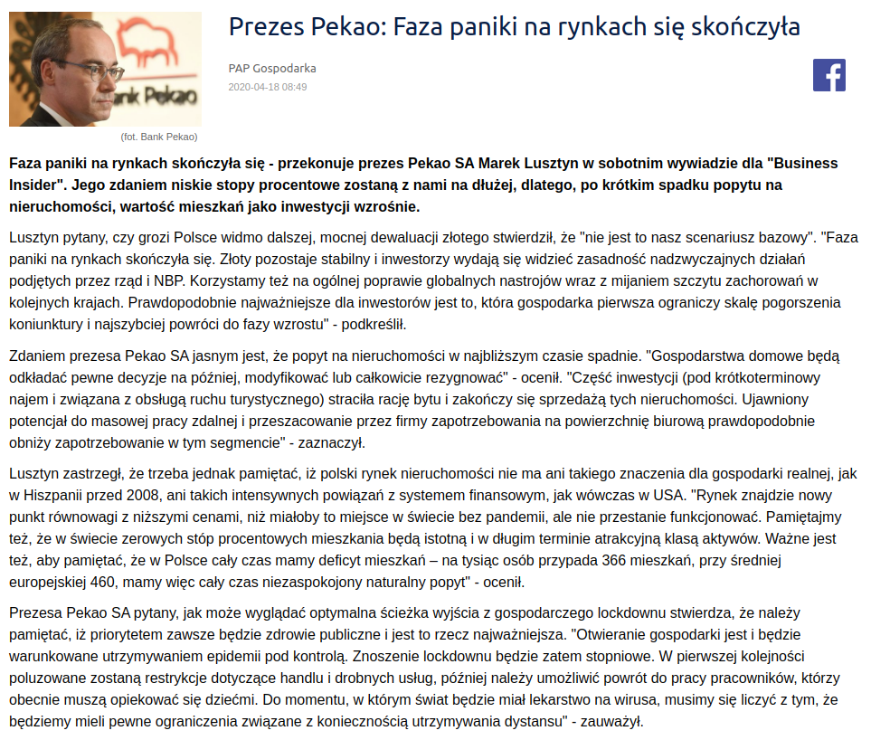
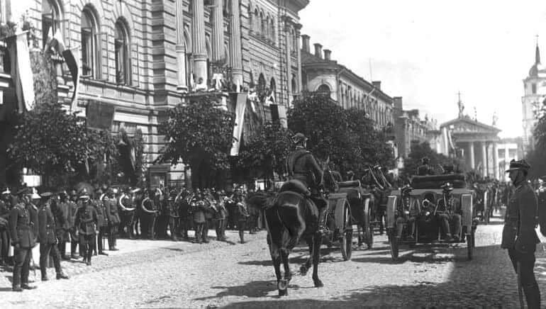
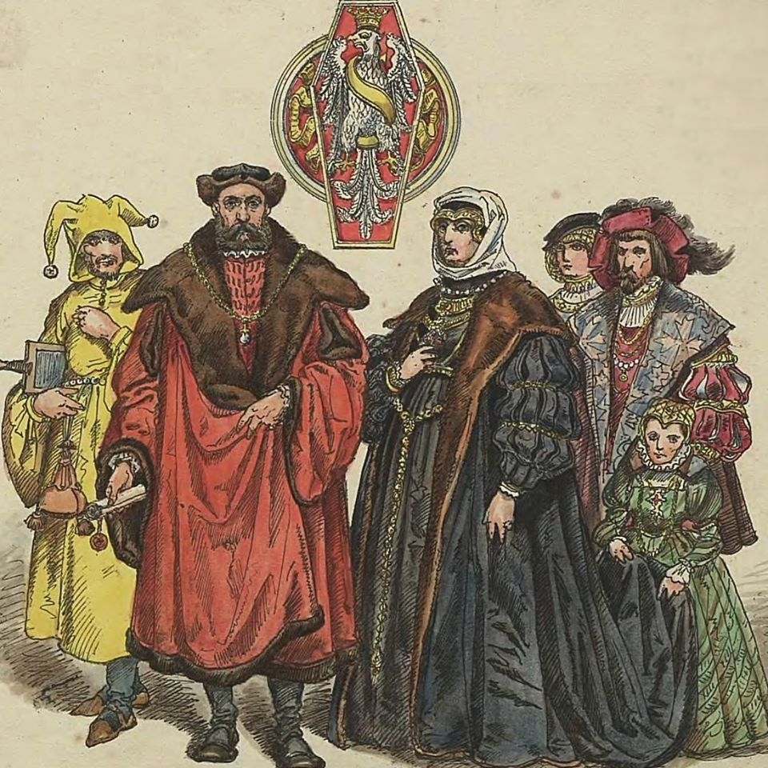

### 2020

  

---

Bez komentarza.

  

---

"Chcesz być milionerem? To nic trudnego. Wystarczy zaufać władzy.

Już przecież to przerabialiśmy. Kiedyś takie banknoty każdy nosił w swoim portfelu.

W 1970 r. średnie wynagrodzenie wynosiło 2 235 zł. Byliśmy wtedy biedni. Chleb kosztował 2,50 zł.

W roku 1994 byliśmy już milionerami. Średnie wynagrodzenie wynosiło wtedy 5,3 mln zł.

Tylko dlaczego znów byliśmy biedni? Ponieważ chleb kosztował już 7,4 tys. zł.

Potem była denominacja i historia zaczęła się od początku.

Chleb kosztował już tylko 0,62 zł, ale nadal byliśmy biedni.

Dlaczego? Przecież ciężko pracowaliśmy.

Dlatego, że niewolnictwo nigdy nie zostało zniesione, ono przybrało tylko inną formę.

Dzisiaj jest najlepszy moment żeby to zrozumieć.

Ten post podzielę na dwie części. Jeśli ktoś próbując przebrnąć przez część I stwierdzi, że właśnie przepalają mu się zwoje w mózgu, niech od razu przejdzie do części II, zanim zrezygnuje z czytania całości.

#### Część I

Rząd ogłosił, że w najbliższym czasie obdarzy polskie przedsiębiorstwa zawrotną kwotą 100 mld zł, w celu ratowania gospodarki.

Skąd rząd weźmie te pieniądze, skoro w budżecie ich nie ma?

Istnieją co najmniej trzy sposoby, żeby zdobyć pieniądze – można je zarobić, można je pożyczyć, albo można je ukraść.

Rząd postanowił pójść tą trzecią drogą.

W tym celu Polski Fundusz Rozwoju wyemituje obligacje na kwotę 100 mld zł., gwarantowane przez państwo. Obligacje te zostaną skupione przez banki komercyjne, od których następnie odkupi je Narodowy Bank Polski.

Czyli ostatecznym wierzycielem PFR zostanie NBP, a banki komercyjne poprzez przepływ pieniądza zainkasują gwarantowane zyski. Tak więc wszystko zostanie w rodzinie i właściwie nikt nikomu nie będzie nic winien, bo kasa będzie się zgadzać.

Co prawda w księgach rachunkowych PFR powstanie zobowiązanie, ale wobec swoich, więc później się to umorzy.

Dlaczego tworzy się takie kombinacje i po prostu rząd nie pożyczy pieniędzy od NBP?

Dzieje się tak z dwóch powodów. Pierwszy to art. 220 ust. 2 Konstytucji RP, który zabrania przewidywania w ustawie budżetowej pokrywania deficytu budżetowego poprzez zaciąganie zobowiązania w centralnym banku państwa.

Drugim powodem jest próba ukrycia rzeczywistego długu publicznego.

Ponieważ faktycznie pieniądze do przedsiębiorców popłyną z PFR a nie z budżetu. Wcześniej zostaną wykreowane przez banki komercyjne.

Po co się tak kombinuje? Po to, żeby premier Morawiecki nadal mógł się chwalić zrównoważonym budżetem pomimo kryzysu, co będzie fikcją, ale w kwitach wszystko będzie się zgadzać.

Odbywa się tutaj właśnie kreatywna księgowość na najwyższym poziomie. Czyli wszyscy kłamią zgodnie z prawem.

Gdzie tutaj jest kradzież, o której pisałem na początku, skoro wszystko jest zgodne z prawem?

O tym właśnie będzie część II.

#### Część II

Jeśli zrozumiałeś część I to znaczy, że należysz do 1% społeczeństwa i jesteś ekonomistą, albo przynajmniej pasjonatem ekonomii.

Jeśli nie zrozumiałeś tego o czym jest część I, to znaczy że należysz do 99% społeczeństwa i jesteś zupełnie normalnym obywatelem, bo nie każdy musi mieć doktorat z ekonomii albo być głównym księgowym.

Żadnej władzy nie zależy na tym żeby obywatele rozumieli jej działalność finansową, ponieważ następnego dnia wszyscy by wyszli na ulice. Dlatego w szkołach nie uczy się podstaw ekonomii.
W szkołach wychowuje się posłusznych obywateli.

Właśnie dlatego tak bardzo się to wszystko komplikuje, żebyś niczego z tego nie zrozumiał i wtedy przyjmiesz bezkrytycznie wszystko co ci wmówi władza.

Żeby pojąć co się obecnie dzieje w tym kraju, trzeba zrozumieć na czym polega funkcja pieniądza na przykładzie chłopa i krowy.

Jeśli chłop wykonał ciężką pracę, to za tę pracę mógł dostać krowę. Krowę mógł doić i mleko zamieniać na inne dobra.

Trudno jednak zamienić krowę na większą ilość mniej wartościowych dóbr, więc ludzie wymyślili pieniądze.

Za wykonaną pracę mógł więc chłop dostać pieniądze, za które mógł kupić albo krowę, albo mleko, albo inne dobra.

Krowę trudno jest podrobić ale pieniądze znacznie łatwiej. Tak więc kiedy pojawiły się pieniądze, pojawili się też ich fałszerze.

Dotychczas, żeby posiadać określone dobra, trzeba było wykonać określoną pracę. Kiedy fałszerze zaczęli podrabiać pieniądze, mogli na tym samym rynku nabywać różne dobra nie wykonując żadnej pracy. Wystarczyło, że mieli fałszywe pieniądze.

Kogoś takiego nazywamy dzisiaj pasożytem.

Czyli, jeśli ktoś się bogacił nie wykonując żadnej pracy, to oznaczało, że inni uczestnicy rynku musieli jeszcze ciężej pracować, żeby utrzymać fałszerzy pieniędzy, czyli pasożytów.

Jeśli fałszywych pieniędzy jest coraz więcej, to zaczynają wypierać pieniądze prawdziwe. To z kolei oznacza, że ludzie uczciwie pracujący muszą pracować coraz ciężej, ponieważ mają na utrzymaniu coraz większą liczbę pasożytów. Dlatego, że większość dóbr, które powstają dzięki ich pracy trafia do oszustów, natomiast im pozostaje tylko niewielka część.

Pieniądz fałszywy miesza się na rynku z pieniądzem realnym i dlatego w pewnym momencie nie można ich odróżnić i wszyscy są przekonani, że wszystkie są prawdziwe.

Jak to się ma do obecnej sytuacji w Polsce?

Polski Fundusz Rozwoju jest spółką akcyjną, której właścicielem jest skarb państwa, ale nie jest jednostką budżetową, czyli jej długi nie obciążają budżetu państwa.

PFR emituje obligacje wartości 100 mld zł, chociaż nie posiada majątku wartości 100 mld zł.

Jeśli więc te obligacje sprzeda bankom, to znaczy że pieniądze, które otrzyma od banków są „pustymi” pieniędzmi, ponieważ nie stoi za nimi żadna realna wartość, żadna praca ani żaden realny majątek, który jest efektem wykonanej pracy.

Nazywając rzecz po imieniu są to fałszywe pieniądze, które trafią na polski rynek. Ponieważ nikt tych pieniędzy nie zarobił.

Jeśli więc otrzymasz wypłatę, to część z tych pieniędzy będzie fałszywa.

Na przykład - jeśli na rynek trafia 20% fałszywych pieniędzy w stosunku do ilości, która jest w obiegu, to z 5 000 zł. wynagrodzenia, które otrzymasz, 1000 zł, będzie fałszywe.

Czyli za kwotę 5 000 zł. będziesz mógł nabyć dobra, za które dotychczas płaciłeś tylko 4 000 zł.

To zjawisko nazywa się inflacją.

Czyli jeśli ty podrobisz pieniądze, to będzie to fałszerstwo. Jeśli rząd sfałszuje pieniądze, nazywa się to inflacją.

Jedno i drugie jest jednak tym samym.

Większość ludzi się temu nie dziwi uznając, że takie są prawa ekonomii, której jednak nie znają.

Problem w tym, że rynek potrzebuje czasu, żeby uruchomić mechanizmy inflacyjne. To może potrwać kilka miesięcy albo dłużej. Kiedy zaczniesz zauważać, że potrzebujesz więcej pieniędzy, żeby żyć na poprzednim poziomie, twój umysł już wtedy nie będzie kojarzył skutku z przyczyną.

Wtedy pobiegniesz do pracodawcy po podwyżkę i będziesz się cieszył, że jesteś bogatszy gdy w rzeczywistości jest to tylko złudzenie, gdyż tak naprawdę, to tylko powróciłeś do poziomu materialnego, w którym już kiedyś byłeś.

Taka finansowa fatamorgana.

Weź kalkulator i policz. Kalkulator nie kłamie. Umysł tak.

Nie należy winić za to pracodawcy, bo to nie on sfałszował pieniądze. On również padł ofiarą oszusta.

To jest przestępstwo doskonałe, kiedy kradnie się dając.

Takiej historii nikt nie przeczyta nawet w najlepszej powieści kryminalnej..

Co się dzieje dzisiaj? Dzisiaj niewolnicy biją pokłony swojemu panu, który rzuca im pieniądze, nie zdając sobie sprawy, że w rzeczywistości on ich w ten sposób okrada.

Co się stało z waszymi pieniędzmi? Wczoraj przecież jeszcze były. Dzisiaj zostaliście bez pieniędzy i bez możliwości ich zarabiania. Nikt się temu nie dziwi?

Ktoś wam zabrał realne pieniądza a w zamian dostaniecie fałszywe. Rachunek będzie się zgadzał a wy nadal niczego nie będziecie rozumieć.

To się właśnie teraz odbywa.

Niemcy w ciągu dwóch dni wypłacili pieniądze przedsiębiorcom.

Dlatego, że je mieli. Realne pieniądze, które gromadzili w czasie koniunktury jako rezerwę na trudne czasy. To były pieniądze tych, którzy je otrzymali, ponieważ to oni je zarabiali i płacili podatki. To są prawdziwe pieniądze, które są efektem ich pracy.

Dlaczego nasz rząd tego nie zrobił? Bo musi je dopiero podrobić a to zajmuje trochę czasu.

Niemcy nie będą mieć inflacji, ponieważ ich pieniądze są prawdziwe.

Nasze dopiero się produkują, bo te które zarobiliśmy zostały przejedzone i przehulane.

Nikt nie pyta co rząd zrobił z pieniędzmi, które zabierał jako podatki?

Niedługo Morawiecki znów wyjdzie na mównicę i powie, że wszyscy będą musieli ponieść ciężar tego kryzysu. To znaczy, WY wszyscy. Nie ONI wszyscy. Wmówi wam, że niedługo potem będziecie milionerami. Będzie miał rację. Zapomni tylko dodać, że będziecie jeszcze bardziej biedni.

#### Kto jest złodziejem?

Wystarczy sprawdzić, kto się będzie bogacił wtedy, kiedy inni będą biednieć.

Zajrzyjcie do majątków banksterów, polityków i ich rodzin i innych cwaniaków w nimi powiązanych.

Może wtedy ktoś zrozumie, że milioner nigdy nie będzie dbał o majątek biedaka, bo gdyby tak było, to by się z nim podzielił i wtedy nie byłby już milionerem.

Znów bogaci będą tanio kupować działki i inne nieruchomości, które będą im sprzedawać biedni. Następnie za 10 lat biedni odkupią je od bogatych po znacznie wyższych cenach i historia się powtórzy. Wtedy zacznie się kolejny kryzys."

<!-- Owszem sprytnie wyjaśnia na czym polega inflacja natomiast całkowicie gubi, jak przychodzi do działań banku centralnego naszego czy Niemiec.
Po pierwsze: rząd może pieniądze pożyczyć zwiększając dług publiczny albo może również je wydrukować nie zwiększając długu. I owszem techniczne rzecz biorąc krótkoterminowo wychodzi na to samo, jeśli NBP skupuje obligacje od PFR a ten od rządu, ale długoterminowo nie.
W księgach rządowych jest deficyt, czyli nie zmieniła się całkowita ilość pieniądza na rynku. Ten deficyt rząd będzie musiał kiedyś spłacić, czyli to, co wydrukowało na poczet ratowania firm, ale też nas artystów, będzie musiało wydobyć z rynków finansowych i "wrzucić je do niszczarki". Jak to zrobi? Prawdopodobnie zwiększy podatki dla Google'a, dla najbogatszych, może opodatkuje bardziej banki, nie wiem. W każdym razie własnie po to, by nie było inflacji,w którymś momencie będzie musiał ściągać pieniądze z rynku.
Po drugie: pakiet stymulacyjny jest koniecznością. Firmy mają zatory, muszą spłacać podwykonawców a nie mają przychodu. Jeśli się nie pomoże firmom i ludziom to wszystko pada jak domino. Upadek jednej firmy powoduje upadek innych firm. Dlatego rząd trochę w ciemno dolewa gotówki wszystkim po trochu, po to, żeby obieg pieniądza cały czas istniał.
Z pieniędzmi jest jak z obiegiem wody. Woda spływa rzekami do mórz, potem paruje a potem spływa. W tym momencie obieg został zatrzymany przez pandemię, dlatego państwo dolewa wody do rzeki a jak ocean się zacznie przelewać będzie jej nadmiar zabierać.
Po trzecie: nieprawdą jest, że rząd Niemiec ma jakieś mityczne oszczędności, które Polska przejadała. Oba nasze kraje mają bardzo niskie zadłużenie a rząd którego nie lubimy doprowadził do zbilansowania wydatków i przychodów pierwszy raz w dziejach III i IV RP. Wszystkie kraje się teraz zadłużają: Niemcy, Wielka Brytania, Stany, Dania, Francja, Włochy. Po prostu tak się działa: antykoniunkturalnie. -->

---

Felieton: Czy państwo może zbankrutować?
 
Nieważne, czy mówimy o przedsiębiorstwie, gospodarstwie domowym, czy rządzie – instytucja, która nie jest w stanie spłacić zaciągniętych długów, staje się bankrutem i basta. A więc odpowiedź na pytanie w tytule powinna być krótka – tak. Tyle że bankructwo kraju wygląda zupełnie inaczej niż upadłość firmy.
Grecy, nie zważając na widmo bankructwa kraju, protestują przeciw planom oszczędnościowym rządu Papandreu Do bankructwa dochodzi wówczas, gdy w kasie państwa brakuje pieniędzy, a  nikt już nie chce ich pożyczyć. Najczęściej dzieje się tak wtedy, gdy kraj w przeszłości wydawał więcej, niż zarabiał, i wpadł w pułapkę zadłużenia. Może odmówić spłat całego zadłużenia, a może to zrobić tylko w odniesieniu do jakiejś jego części. Ale nie zmienia to faktu, że  państwo staje się bankrutem.

Detonatorem kryzysu są zazwyczaj wydarzenia, które gwałtownie pogarszają sytuację finansową dłużnika: w  wypadku firmy jest to recesja, a w wypadku państw – wojny, rewolucje albo poważne zawirowania finansowe. Ale to nie detonator jest przyczyną katastrofy. Grecja stanęła dziś na skraju bankructwa z powodu prowadzonej przez 30 lat nieodpowiedzialnej polityki budżetowej tolerującej corocznie nadmierne deficyty budżetowe i wzrost długu publicznego.

Różnica między sytuacją państwa i firmy polega na tym, że w  razie nadmiernych długów państwo może dodrukować pieniądze i próbować uregulować zobowiązania za ich pomocą. Wówczas najprawdopodobniej wybuchnie hiperinflacja, a zadłużenie zostanie spłacone pieniądzem całkowicie bezwartościowym. Nie da się jednak tak postąpić w odniesieniu do tej części długu, którą zaciągnięto w walutach obcych. Dlatego jeśli dochodzi do kryzysu, zazwyczaj chodzi o bankructwo częściowe, dotyczące długu zagranicznego.

Bankructwo firmy i państwa to niby to samo, ale  wiąże się z zupełnie innymi konsekwencjami. Przede wszystkim zbankrutowanego państwa nie można ani zlikwidować, ani przeprowadzić licytacji jego mienia. Pozostają więc środki nacisku pośredniego –  finansowy ostracyzm, odcięcie od nowych źródeł kredytu, żądanie, aby za  cały import kraj płacił z góry gotówką. Konsekwencje gospodarcze takich poczynań są dla kraju bankruta niezwykle bolesne. Prowadzą zazwyczaj do  ciężkiego kryzysu gospodarczego państwa i drastycznego spadku poziomu życia jego obywateli. Zazwyczaj też zmuszają dany kraj do podjęcia prób wynegocjonowania z wierzycielami choćby częściowej, rozłożonej na raty spłaty zadłużenia. Dzięki temu może on zostać na nowo wpuszczony na  międzynarodowe rynki finansowe.

Historia bankructw państw sięga tysięcy lat. Choć pierwsze znane przypadki odnotowano w starożytnej Grecji (co tworzy ładną klamrę z  czasami dzisiejszymi), problem ten rozplenił się dopiero w XVI i XVII wieku, kiedy zwrotu swoich długów kilkakrotnie odmówiły najbogatsze państwa ówczesnej Europy – Hiszpania i Francja. Za każdym razem powodem były niemożliwe do sfinansowania wydatki militarne. W ciągu ostatnich 200 lat historycy gospodarczy doliczyli się setek wypadków całkowitego lub częściowego bankructwa krajów. Tylko Paragwaj odmówił spłaty swoich długów siedmiokrotnie, Argentyna sześć razy, a Turcja cztery.

Często mieliśmy również do czynienia z epidemiami bankructw. W czasie wielkiego kryzysu na początku lat 30. ubiegłego wieku zobowiązania przestało regularnie spłacać 21 państw, a podczas rekordowego kryzysu zadłużeniowego z początku lat 80. – ponad 30 (w tym również Polska). Wśród najsłynniejszych bankructw warto wymienić dwukrotny upadek finansowy Rosji – całkowitą odmowę spłaty carskich długów przez bolszewików oraz odmowę wykupu przez rząd rosyjski części wyemitowanych obligacji w roku 1998.

Bankructwo kraju to straszliwy cios zadany jego gospodarce. Finansowy parias oczywiście nadal żyje, ale płaci za to  wieloma latami ciężkiego kryzysu. Grecy, choć jak mogą, protestują przeciwko planom oszczędnościowym rządu, zrobiliby lepiej, pomagając mu w opanowaniu sytuacji. A Polacy powinni uważnie się temu przyjrzeć, by  za 10 czy 20 lat nie znaleźć się dokładnie tam, gdzie dziś jest Grecja.

Witold M. Orłowski

---

### Policyjne zakupy w czasie pandemii: wozy wypadowe i 30 milionów sztuk amunicji

Polska policja ogłosiła w ostatnim czasie kilka dużych przetargów.
Jak informuje Radio Zet, zakończono już postępowanie dotyczące zakupu pięciu armatek wodnych, co będzie kosztować prawie 20 milionów złotych. Te pojazdy wykorzystywane są przy okazji różnego rodzaju imprez masowych czy manifestacji.

Komenda Główna Policji planuje też zakup 30 milionów sztuk amunicji. Według ekspertów ma to być "liczbą niesłychaną, przewyższającą dotychczasowe zamówienia dwu-, a nawet trzykrotnie".

Policja wymienia również część floty tzw. wozów wypadowych, używanych przez oddziały prewencji. Mieszczą one 7 funkcjonariuszy z pełnym wyposażeniem: hełmami, kaskami, bronią czy tarczą. Samochody powinny być wyposażone m.in. w nawigację, zestaw głośnomówiący czy kamerę cofania.

Termin składania ofert na dostawę samochodów minął kilka dni temu. Firmy chcące dostarczyć amunicję (według informatorów Radia Zet specyfika zamówienia wskazuje na konkretnego producenta) mają czas do końca kwietnia.

### 1989

Odbyło się spotkanie przewodniczącego NSZZ Solidarność Lecha Wałęsy z generałem Czesławem Kiszczakiem. W jego trakcie podjęta została decyzja o powołaniu Komisji Porozumiewawczej- organu, którego zadaniem miało być czuwanie nad realizacją porozumień zwartych podczas zakończonych 5 kwietnia 1989 roku obrad Okrągłego Stołu. Tego samego dnia w Sejmie doszło do pierwszego po ponad siedmiu latach spotkania Lecha Wałęsy z gen. Wojciechem Jaruzelskim.

  

### 1947

Poniższy tekst to Nota Rządu RP do Rządu ZSRR złożona przez ambasadora Mariana Naszkowskiego (na zdjęciu po prawej) na ręce wiceministra spraw zagranicznych ZSRS Andrieja Wyszyńskiego.
Śc. tajne

Szanowny Panie Wiceministrze,
Na polecenie mojego rządu mam zaszczyt poinformować Pana, że Rząd Rzeczypospolitej Polskiej postanowił całkowicie oczyścić z faszystowskich band Ukraińskiej Armii Powstańczej (UPA) strefę przygraniczną, począwszy od rejonu Brześcia n. Bugiem aż do granicy czechosłowackiej.

Jednocześnie zostanie przeprowadzona ewakuacja ludności ukraińskiej z tychże rejonów do północno-zachodnich obwodów Rzeczypospolitej Polskiej, gdzie przydzielone jej zostaną grunty i gospodarstwa. W związku z ewakuacją zachodzi obawa, że w czasie trwania tego przedsięwzięcia, niepożądane elementy będą starały się przeniknąć na terytorium ZSRS.

Z uwagi na powyższe, proszę Pana o wydanie dyrektywy w sprawie możliwie szczelnego zamknięcia granicy na wymienionym wyżej odcinku. Wspomniana akcja rozpocznie się 20 kwietnia br. i potrwa około dwóch miesięcy. W sprawie tej Marszałek Polski Żymierski zwrócił się do Ministra Sił Zbrojnych Związku SRS Generała Armii Bułganina. Tekst telegramu został wręczony w dniu dzisiejszym.

Proszę przyjąć, Panie Wiceministrze, zapewnienie o głębokim dla Pana szacunku.

Moskwa, 18 kwietnia 1947 r.
Do Ob. Wyszyńskiego A. J.
Wiceministra Spraw Zagranicznych Związku SRS m. Moskwa

  

### 1922

W Wilnie odbyły się uroczystości wieńczące zapoczątkowany tak zwanym buntem Żeligowskiego proces przyłączania do Polski Litwy Środkowej.
Wydarzenie to poprzedziła seria działań polityczno- militarnych, których efektem było stworzenie Litwy Środkowej-niezależnego organizmu państwowego ze stolicą w Wilnie.
Większość, bo ponad 70 procent mieszkańców stanowili Polacy, prawie 13 procent Litwini, a ponad 6 procent Białorusini.
W uchwale Sejmu Wileńskiego zapisano, że:
Ziemia Wileńska stanowi bez warunków i zastrzeżeń nierozerwalną część Rzeczypospolitej Polskiej"
Na zdjęciu uroczystość przyłączenia Litwy Środkowej do Polski.

  

### 1518

Na Wawelu odbył się ślub króla Zygmunta I Starego z drugą żoną Boną Sforzą i jej koronacja na królową Polski.

W historiografii rola królowych często jest niedoceniana, gdyż to zwykle w woli władców upatruje się źródła ważnych postanowień. Królowa Bona do tych niedocenianych akurat z pewnością nie należy: jej wybitna osobowość nie mogła pozostać obojętna ani historykom, ani tym bardziej - jej współczesnym.

Żonę doceniał z pewnością także mąż, Zygmunt I Stary. Choć o zawarciu związku nie zadecydowało - jak w przypadku jego syna Zygmunta Augusta - gorące uczucie, gdyż przed ślubem narzeczonej nie widział - nie było to także czyste wyrachowanie polityczne. Zygmunt chciał mieć za żonę Włoszkę - nie habsburżankę ani księżniczkę mazowiecką, a to dlatego, że kochał renesans i jego ojczyznę - Włochy. Bona była wykształcona i wychowana w tym nowoczesnym duchu, a powinowactwo z cesarzem Maksymilianem I także należało zaliczyć do jej atutów. Silniejsza okazała się w niej jednak rodowa krew Sforzów, kondotierów włoskich, którzy kilkadziesiąt lat wcześniej siłą zdobyli tytuł książąt Mediolanu (sforza znaczy siła). Apodyktyczna i ambitna, dla realizacji celów politycznych często używała intryg. Te cechy charakteru przysłoniły inne, niewątpliwe godne najwyższej pochwały. Gospodarna, starała się budować niezależność finansową władcy poprzez skupianie dóbr ziemskich. Nabyte posiadłości wzorowo organizowała, wprowadzała warzywnictwo i ogrodnictwo, propagowała jarzyny, czyli "włoszczyznę", i sztuciec przydatny w jej spożywaniu - nieznany w Polsce widelec. Dbała o polską młodzież, która zyskała możliwość zdobycia wykształcenia na uczelniach włoskich. Sprawowała mecenat nad uczonymi i pisarzami.

Narastający konflikt z możnymi i szlachtą, wzmocniony przez zdecydowany sprzeciw wobec małżeństwa syna Zygmunta Augusta z Barbarą, zmusił ją do wyjazdu do Bari. Tam zmarła, otruta przez zaufanego doradcę. Scenę tę sugestywnie odmalował Matejko.

  

---

<a href="https://github.com/TomaszWaszczyk/historia.waszczyk.com/edit/master/src/content/april-18.md" target="_blank">Edytuj tę stronę dzieląc się własnymi notatkami!</a>
