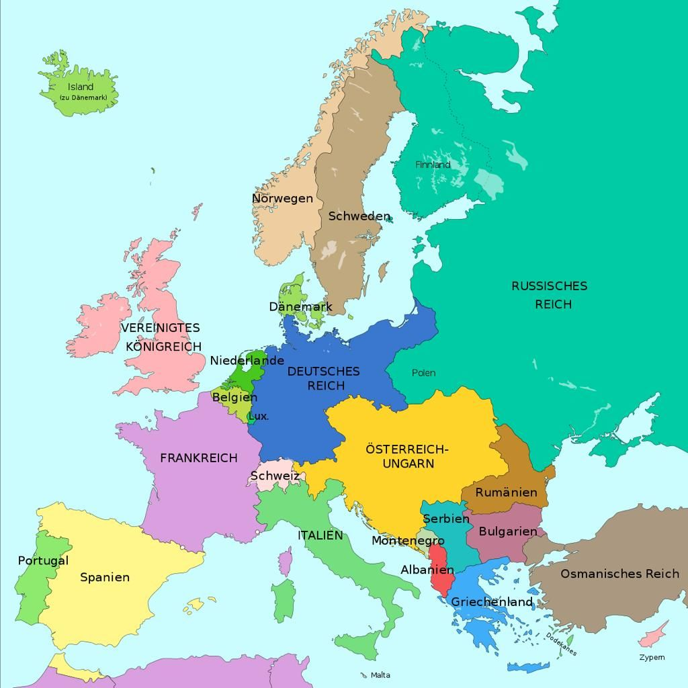
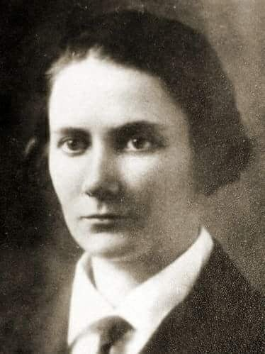
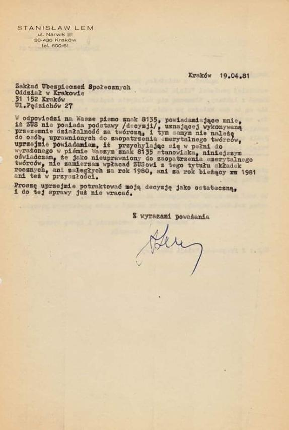
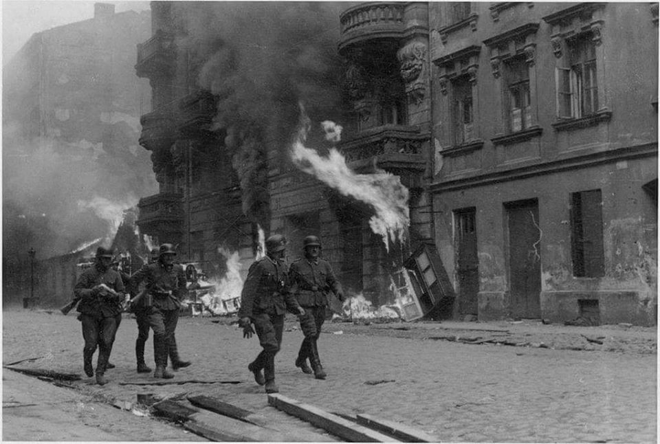
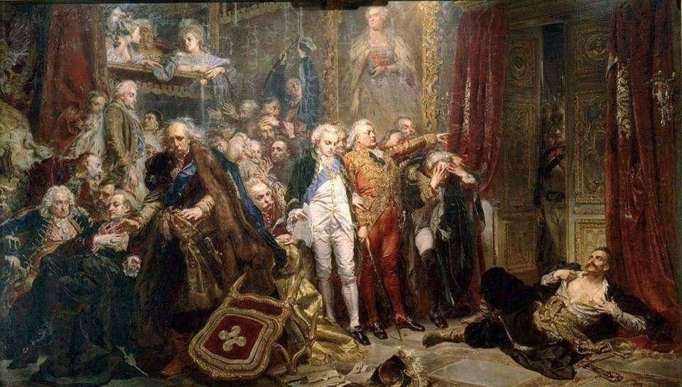

### 2022

Jeszcze nie wszystkie puzzle udaje się dopasować do układanki, ale już wyłania się obraz zasadniczy: Niemcy ze swoim przydupasem Francją, dogadały się z Rosjanami o podziale Europy i wypchnięciu z niej Anglików i USA. Z tej perspektywy wszystko bez problemów da się już wytłumaczyć: bezczelne grilowanie Polski( pamiętajmy o roli Bułgarów), Smoleńsk, blokowanie inwestycji w Polsce np Gazoport, aż w końcu napad na Ukrainę (że wymienię tylko najważniejsze).

Obstrukcja Zachodniej Europy sprowadzająca się do pozorów w pomaganiu Ukrainie w wojennym wysiłku, to tylko konsekwencja wcześniejszych planów. Po położeniu rosyjskich rur na dnie Bałtyku, w interesie i Niemców i Rosjan było zablokowanie węgla, tak aby znów można było robić gaz-geschäft (Niemcy mają słabość do gazu: w czasie II wojny produkowali własny zwany cyklon-B, teraz postanowili wykorzystać równie zbrodniczo równie zbrodniczy gaz rosyjski).

Powinniśmy raz na zawsze zapamiętać: Albo będziemy silnym państwem, albo nie będzie nas w ogóle.

  

### 2011

Nowe Otwarcie. Ogłoszono korektę. Można na jej przykładzie omówić różne psychologiczne sztuczki wywierania wpływu na ludzi.
Ministerstwo Finansów informuje, że kluczowa zmiana dotyczy oskładkowania. Czytamy, że dzięki korektom przedsiębiorcy „zapłacą prawie o połowę mniej”.  
The Rejection Then Retreat Strategy. Tak nazywa się ta technika.  

Co zrobić, jeśli chcesz dostać coś, a ktoś inny wcale nie chce ci tego dać? Poproś o więcej!
Chcesz wprowadzić podwyżkę podatku o 5%? Zażądaj 9%!
A potem?

Potem wsłuchasz się w głos przedsiębiorców i „ustąpisz” proponując obniżkę z 9% na 5%. A jeszcze lepiej z 9% na 4,9%.
Dlaczego?

Bo ten ktoś po drugiej stronie też poczuje się zobowiązany do ustępstw. Zobligowany do rewanżu. Ucieszy go to 4,9%. Niektórzy nawet zaczną być wdzięczni.
Tak to działa. Zasada wzajemności. Opisana przez R. Cialdiniego. Wykorzystywana w technikach manipulacji.

Czy się sprawdza? Każdy teraz może prowadzić własne obserwacje.

Prof. Cialdini został zmanipulowany przy użyciu zasady wzajemności przez jakiegoś miłego skauta. Któregoś dnia skaut zapukał do domu Cialdiniego i złożył mu dwie oferty.
(1) Pierwsza (ta zaplanowana jako „do odrzucenia”): zaproszenie na imprezę harcerską - cena biletu 5 dolarów (czyli nie dość, że trzeba kupić bilet to jeszcze wypada uczestniczyć w imprezie).
Zgodnie z przewidywaniami oferta nie spotkała się z entuzjazmem.
(2) Druga oferta (ta, o którą od początku chodziło): zakup czekoladowego batonika za 1 dolara. Co zrobił Cialdini?
Z wdzięczności kupił 2 batoniki! Chociaż nie lubił czekolady (ale imprez harcerskich jeszcze bardziej). Poza tym zapłacił 2. A 2 to mniej niż 5.

Nasz batonik oferowany jest teraz za 4,9.
Ale dlaczego 4,9 a nie 5?

W tym zakresie też robiono eksperymenty na ludziach. Znamy ceny promocyjne za 4,99. Łatwiej taki towar sprzedać. Wielu nie zauważy, ile naprawdę płaci. Poza tym można napisać „(…) składka zdrowotna zmniejszy się niemal o połowę”.

Otóż nie, składka nie zmniejsza się „niemal o połowę”. Ona się istotnie ZWIĘKSZA. Z kwoty ustalanej ryczałtowo ROŚNIE do poziomu 4,9% dochodu. Mamy WZROST obciążeń związanych z prowadzeniem działalności z 19% do prawie 25%. W tym zakresie nic się nie zmieniło, choć widzę, że niektórzy dali się nabrać.

I uwaga! Z badań wynika, że zasada wzajemności jest niezwykle silną zasadą. Ustępstwo jednej strony wytwarza poczucie zobowiązania drugiej, które obejmuje również nowe obszary. Oddziałuje na przyszłość. Wpływa na reakcję względem propozycji, które jeszcze nie zostały wyartykułowane.

W naszym pakiecie wdzięczności jest nie tylko batonik w promocyjnej cenie 4,9, ale też inne niespodzianki - np. NOWY PODATEK od przychodów…
Taka oto „obniżka”. Ukłon w stronę biznesu i „łagodzenie propozycji”.

Profesorze Cialdini! Proszę monitorować temat Polskiego Ładu i sprawdzić, ilu dało się złapać w manipulacje z zastosowaniem zasady wzajemności. Może przyda się do dalszych badań.

### 1997

W wieku 91 lat zmarła w Warszawie Maria Wittek (zdjęcie) pierwsza w historii Wojska Polskiego kobieta generał brygady Wojska Polskiego.
W roku 1917 wstąpiła do służby w Polskiej Organizacji Wojskowej. Trzy lata później, jako żołnierz Ochotniczej Legii Kobiet brała udział w obronie Lwowa za co otrzymała Krzyż Srebrny Orderu Wojennego Virtuti Militari.
W czasie drugiej wojny światowej pełniła służbę, jako komendantka główna Kobiecych Batalionów Pomocniczej Służby Wojskowej, a następnie, jako komendantka Wojskowej Służby Kobiet przy Komendzie Głównej Związku Walki Zbrojnej – Armii Krajowej. Była uczestniczką Powstania Warszawskiego. Po wojnie, w roku 1949 trafiła na kilka miesięcy do aresztu. Po wyjściu z więzienia pracowała, jako kioskarka. Była pomysłodawczynią stworzenia Komisji Historii Kobiet przy Towarzystwie Miłośników Historii w Warszawie. 2 maja 1991 roku jako pierwsza kobieta w historii Wojska Polskiego została mianowana przez Prezydenta RP Lecha Wałęsę na stopień generała brygady.

  

  

### 1985

https://pl.wikipedia.org/wiki/Pawe%C5%82_Batow

### 1981

  

### 1943

Wybuchło pierwsze miejskie powstanie zbrojne w okupowanej Europie, czyli powstanie w getcie warszawskim. Było to pierwsze tak duże zbrojne wystąpienie przeciwko okupantowi niemieckiemu podjęte przez Żydowską Organizację Bojową i Żydowski Związek Wojskowy. Słabo uzbrojeni powstańcy stawiali opór dobrze wyszkolonej armii niemieckiej , wspartej czołgami i artylerią. Pomoc bojowcom getta nieśli żołnierze Armii Krajowej, Gwardii Ludowej, Socjalistycznej Organizacji Bojowej, Korpusu Bezpieczeństwa oraz Milicji Ludowej Robotniczej Partii Polskich Socjalistów, aczkolwiek możliwości niesienia pomocy powstańcom przez polskie podziemie były bardzo ograniczone i niewystarczające. Przyczyną zbrojnego oporu była likwidacja getta przeprowadzana przez Niemców i formacje kolaborujące, która zmierzała do fizycznej likwidacji Żydów poprzez wywożenie Żydów do obozów natychmiastowej zagłady.
"Powstanie nie było porywem walczących o zwycięstwo i laury, tylko kamieniem rzuconym przeciwko ideologii dzikiej, wyzbytej cech człowieczych i przeciwko olbrzymiej sile państwa w centrum Europy rządzonego przez zgraje morderczych oprawców w obliczu milczącego świata." - pisał profesor Israel Gutman.
Wielką Akcją likwidacji warszawskiego getta kierował SS-Gruppenführer Jürgen Stroop. Niemcy palili dom po domu, oraz likwidowali bunkry, w których ukrywali się Żydzi. Schwytanych Żydów wywożono do ośrodka zagłady w Treblince oraz do obozów pracy w Trawnikach, Poniatowej, Majdanku. 8 maja Niemcy wykryli i otoczyli bunkier dowództwa Żydowskiej Organizacji Bojowej. Zablokowali wszystkie pięć wejść do niego. Z powodu beznadziejnej sytuacji i aby nie wpaść żywym w ręce niemieckie, Arie Wilner wezwał bojowców do popełnienia samobójstwa. Pierwszy, Lutek Rotblat zastrzelił swoją matkę a potem siebie. Większość członków Żydowskiej Organizacji Bojowej z jej dowódcą Mordechajem Anielewiczem poniosła śmierć w bunkrze. Niemieckie oddziały i wspierające je oddziały kolaboracyjne: ukraińskie, litewskie i łotewskie stłumiły powstanie do 13 maja. Tego dnia, czyli 13 maja, żydowski polityk Bundu Szmul Zygielbojm nie mogący znieść biernej postawy zachodu wobec tragedii Żydów popełnił w Londynie samobójstwo.
Niechlubny udział w tłumieniu powstania miała też polska granatowa policja, której funkcjonariusze pełnili straż wokół murów likwidowanego getta. Znane są relacje świadczące o tym, że żołnierze Saperów Praskich Armii Krajowej, którzy 19 kwietnia usiłowali wysadzić mur getta przy ul. Bonifraterskiej i Sapieżyńskiej zostali ostrzelani przez patrole niemieckie i funkcjonariuszy granatowej policji; dwóch żołnierzy AK poległo, czterech zostało rannych. Granatowa policja, o której Stroop pisał: „zachęcona wypłacanymi nagrodami pieniężnymi, stara się odstawić do komendantury każdego Żyda, który pokaże się w mieście'' uczestniczyła też w wyłapywaniu żydowskich uciekinierów po tzw. ''aryjskiej stronie''. Definitywnym końcem powstania było wysadzenie w powietrze Wielkiej Synagogi na Tłomackiem. Wysadzenia synagogi dokonał osobiście Jurgen Stroop. 16 maja 1943 roku Stroop złożył meldunek: „Zlikwidowano 180 Żydów, bandytów i podludzi. Była żydowska dzielnica mieszkaniowa przestała istnieć. Wielka akcja została zakończona wysadzeniem w powietrze warszawskiej synagogi o godzinie 20.15. (...) Ogólna liczba ujętych oraz na pewno zgładzonych Żydów wynosi 56 065”.
Część powstańców, którym udało się wydostać z getta warszawskiego, przedostało się przy pomocy żołnierzy GL w okolice lasu Fidest koło Wyszkowa, gdzie utworzyli oddział im. Obrońców Getta.
Na zdjęciu fotografia z Raportu Stroopa, którą podpisano „Drużyna szturmowa”

  

### 1773

Rozpoczęły się obrady Sejmu Rozbiorowego. Nazwę tę nosi sejm skonfederowany, w którego skład wchodziły Rosja, Prusy i Austria. Mocarstwa zaborcze chciały w ten sposób zatwierdzić dokonany rok wcześniej pierwszy rozbiór Polski.
Sejm ten został zwołany na 19 kwietnia 1773 roku na wcześniejsze żądanie ambasadora rosyjskiego Otto Magnusa von
Stackelberga , posła pruskiego Gédéona
Benoît i austriackiego Karla Reviczkyego, którzy zamierzali przeprowadzić legalizację rozbiorów przez sejm. Jednocześnie mocarstwa utworzyły wspólny fundusz korupcyjny, z kasy którego miano opłacać przychylność posłów i senatorów. 11 kwietnia 1775 sejm zakończył swoją działalność na niekorzyść Polski.

  

### 1770

Kapitan James Cook po raz pierwszy dostrzegł wybrzeże Australii.

W 1770 r. do wschodnich wybrzeży Australii dotarł James Cook - słynny brytyjski podróżnik. Sporządził on dokładne mapy i opisał roślinność. Jako odkrywca, ogłosił tę część kontynentu posiadłością Korony Brytyjskiej i nazwał Nową Południową Walią. Początkowo Anglia wykorzystywała nową posiadłość wyłącznie jako kolonię karną. W 1788 przywieziono tu pierwszych skazańców i założono pierwsze osiedle, Sydney. Z czasem zakładano kolejne, niezależne od siebie kolonie. Przez kolejne blisko 100 lat zsyłano tu więźniów i przestępców.

---

<a href="https://github.com/TomaszWaszczyk/historia.waszczyk.com/edit/master/src/content/april-19.md" target="_blank">Edytuj tę stronę dzieląc się własnymi notatkami!</a>
