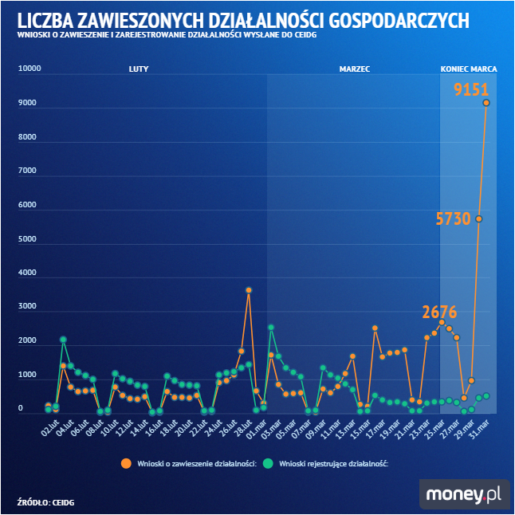
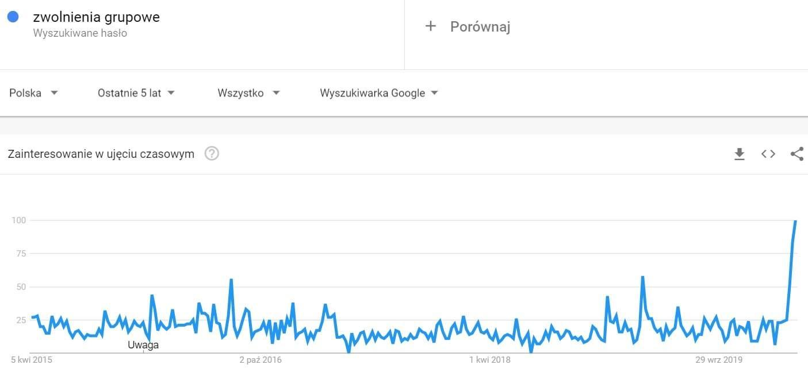
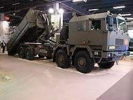
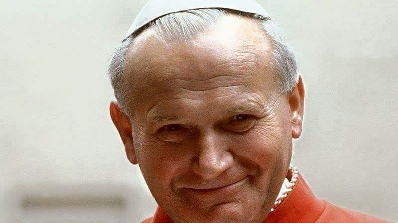
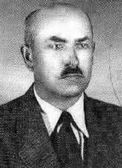
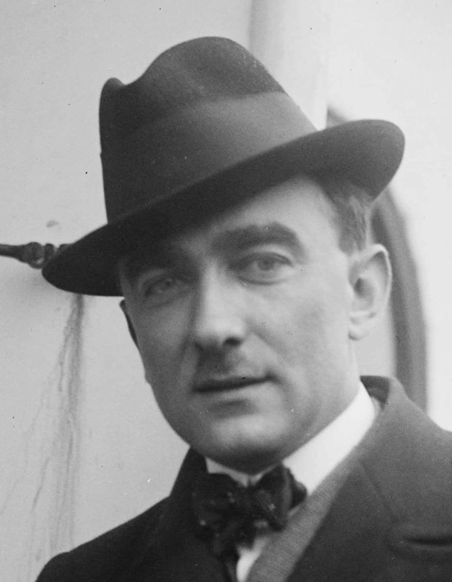

### 2020

Najmniejsi przedsiębiorcy masowo zawieszają działalność gospodarczą - wynika z analizy money.pl. W marcu działalność zawiesiło ponad 48 tys. firm, a tylko w ciągu ostatniego tygodnia ponad 25 tys. - wynika z danych Centralnej Ewidencji i Informacji o Działalności Gospodarczej. Do końca roku może za to przybyć milion bezrobotnych.

Polski biznes się zamyka, chce przeczekać trudne czasy. Ostatnie 7 dni marca to minus 25 tys. podmiotów. Cały biegły miesiąc to 48 815 wstrzymanych biznesów. Przedsiębiorcy po prostu masowo złożyli wnioski o zawieszenie działalności.

Co to oznacza? Nie funkcjonują, nie będą płacić podatków dochodowych, nie będą rozliczać się z VAT. Zawieszona działalność gospodarcza to również wyrejestrowanie z ZUS i koniec z płaceniem składek. To jasny sygnał od przedsiębiorcy: biznesu dla nich w tej chwili nie ma. Tak jak i najmniejszej płynności finansowej, która pozwoliłaby przetrwać epidemię koronawirusa w Polsce.

A warto podkreślić, że zawiesić działalność gospodarczą w myśl przepisów może przedsiębiorca, który nie zatrudnia żadnych pracowników. Na ten krok decydują się zatem na początku najmniejsi na rynku, często są to samozatrudnieni, którzy stracili jedyne zlecenie. Za chwilę będą mogli to zrobić ci, którzy rozstali się z załogą (zatrudnioną do tej pory na podstawie umowy o pracę) pod koniec marca.

Jak wynika z analizy money.pl, w marcu wnioski o zawieszenie działalności złożyło w sumie 48 tys. firm. Większość zaczęła to robić po 12 marca, czyli po oficjalnym ogłoszeniu o konieczności zamknięcia szkół. To właśnie od tego dnia więcej biznesów się w Polsce zawieszało, niż tworzyło. Od początku stycznia takiej daty nie było ani razu. Od 12 marca z kolei nie było dnia, by większa liczba Polaków realizowała marzenie o byciu przedsiębiorcą, niż z nich rezygnowała.

Ostatni tydzień miesiąca był jednak rekordowy. We wtorek 24 marca działalność zawiesiło 2,3 tys. przedsiębiorstw. Środa 25 marca? Kolejne 2,6 tys. wniosków o zawieszenie działalności. Czwartek 26 marca to znów 2,5 tys. wniosków o przerwę w biznesie.

  

---

#### Drugi tydzień z rzędu rekordowa liczba wniosków o zasiłek dla bezrobotnych w USA

16.03 - 23.03 3,3 mln osób.

24.03 - 31.03 6,6 mln osób.

#### O złych spekulantach

Modny wśród ekspertów jest też temat Spekulantów. To zawsze powraca, jak rząd nie daje sobie rady i nie wie co ma robić. A koronnym przykładem wrogiej działalności spekulantów są ceny rękawiczek i masek. Tu wchodzimy w temat podaży i popytu. Walkę na tym froncie, jak dotąd przegrali wszyscy, łącznie z Hitlerem, który za handel rąbanką wprowadził karę śmierci w Generalnej Guberni, a ludzie dalej nią handlowali. Tyle, że dużo drożej było.

Czerwienię się jak pensjonarka musząc tłumaczyć rzeczy, których chyba uczą na kursach przygotowawczych do Liceum Ekonomicznego.

Otóż jak jest 1 jajko i 100 chętnych, żeby je kupić to cena jajka gwałtownie rośnie. Jak się pojawi 50 jajek na 100 chętnych, to zaczyna spadać. Cena rynkowa ustala się mniej więcej jak podaż zrównoważy się z popytem. Działa to też w drugą stronę: jeśli będzie 200 jajek na 100 chętnych. Sprzedawcy zaczną sprzedawać jajka poniżej kosztów produkcji. Myślę, że wielu zostanie z tymi maskami, żelami i rękawiczkami jak Himilsbach z angielskim, bo z tego co widzę, to kto żyw je produkuje. Cena masek od piku spadła już o 40%. Będą potem od rządu domagać się skupu interwencyjnego 🙂

Tak to działa. Trust me. Nie ogłupiajcie ludzi.

---

Odpływ zagranicznego kapitału może być dużym zagrożeniem dla Polski - uważa prof. Konrad Raczkowski, ekonomista, były wiceminister finansów i członek Narodowej Rady Rozwoju przy prezydencie. W rozmowie z BI Polska prof. Raczkowski ocenia tarczę antykryzysową, szanse polskiej gospodarki na szybkie odbicie i wskazuje, co mogłoby spowodować zmiany ładu gospodarczego na świecie.

Mikołaj Kunica, redaktor naczelny Business Insider Polska: Czy naprawdę mamy do czynienia z kataklizmem gospodarczym, który prognozuje coraz więcej ekonomistów?
Prof. Konrad Raczkowski, ekonomista, członek Narodowej Rady Rozwoju: Myślę, że zdecydowana większość z nas, którzy siedzą teraz w domu, jeszcze nie jest świadoma pewnych konsekwencji pandemii koronawirusa. Z pewnością jest to ludzka tragedia w skali globalnej, a z punktu widzenia gospodarki równoczesny i niespotykany na taką skalę szok podażowo-popytowy. Tylko w okresie jednego miesiąca światowa wartość rynkowa została uszczuplona o 23 biliony dolarów, a to dopiero początek. Instytucje międzynarodowe czy rządy poszczególnych państw (za wyjątkiem Chin) pokazały, jak bardzo mają uśpione i nie do końca sprawne systemy reagowania kryzysowego. Nie wspomnę o programach mobilizacji gospodarki, które w dużej części państw nie działają, nie zawierają planów operacyjnych zagrożenia epidemią. Z tego powodu przedsiębiorcy nie posiadają stosownych procedur, zdolności i planów operacyjnych.

Amerykanie w czasie II wojny światowej zwiększyli produktywność przemysłową o 96 proc. i byli w stanie budować składające się z ponad 1,5 mln części bombowce Liberator w zaledwie 63 minuty. Dziś świat zmaga się z brakiem podstawowych zdolności do produkcji zdawałoby się prostych środków ochrony osobistej, czy testów na koronawirusa. Wówczas jednak centra produkcji i surowców były w kraju. Dziś nawet tak silna gospodarka, jak USA, jest uzależniona od masek ochronnych produkowanych w Chinach i Meksyku, a cały amerykański rynek antybiotyków w 97 proc. został zdominowany przez chińskich producentów. To nie oznacza, że „Made in China” miałoby być złe. Pokazuje natomiast, że optymalizacja procesów produkcyjnych musi w rachunku ekonomicznym uwzględniać wyższe ryzyko kryzysu i przerwania ciągłości działania, jak i dobrze rozumiany interes narodowy. Ten kryzys wymaga radykalnych działań rządu, samorządów, czy samych przedsiębiorców i obywateli.

Jak przedsiębiorstwa reagują na kryzys, co powinny robić?
Mądre firmy w pierwszej kolejności muszą odpowiedzieć sobie na pytanie, czy za kilka miesięcy będą w ogóle zdolne do prowadzenia działalności biznesowej, jeżeli nawet udzielone wsparcie z tarczy antykryzysowej będzie daleko niewystarczające. Czy próby utrzymania płynności finansowej za wszelką cenę mają w ogóle sens, czy są dalszym pogrążaniem się i zmniejszaniem zdolności odbudowy w przyszłości, w ramach obecnej, bądź nowej firmy. Warren Buffett zwykł mawiać w takich sytuacjach, że jak znajdziesz się w dziurze, to najważniejszą rzeczą jest przestać kopać. Dla pewnych branż kryzys nie zmienia niczego, a wręcz przeciwnie – zwiększa przychody. Jednak są to wyjątki od reguły, a zdecydowana większość firm już straciła większość przychodów, a inne po prostu stanęły.

---

  

---

### 2012

Huta Stalowa Wola zakupiła 100 procent akcji spółki Jelcz-Komponenty w Jelczu -Laskowicach.
Zakład ten działał w ramach założnego w 1952 roku na terenie fabryki Bertha Werke Zakładu Nadwozi Samochodowych, który następnie przekształcono w Fabrykę Samochodów Ciężarowych.
Przez kilkadziesiąt działania tej firmy powstało tam wiele różnego rodzaju samochodów sygnowanych marką "Jelcz".
Obecnie w Jelczu prowadzona jest produkcja sprzętu zbrojeniowego. Jednym z powstających tam samochodów jest widoczny na zdjęciu wóz amunicyjny Jelcz-P888D53.

  

### 2005

"Papież Polak zmarł 2 kwietnia 2005 o godzinie 21:37. - Nasz ukochany Ojciec Święty Jan Paweł II powrócił do Domu Ojca"- poinformował arcybiskup Leonardo Sandri wiernych obecnych na Placu świętego Piotra.
Już o godzinie 11.30 watykański rzecznik powiedział w jednej ze stacji telewizyjnych, że "wydaje się, że stan papieża jest nieodwracalny".
W momencie śmierci Jana Pawła II obecni byli przy nim między osobisty sekretarz papieża ksiądz Stanisław Dziwisz, kardynał Marian Jaworski, arcybiskup Stanisław Ryłko, ksiądz Tadeusz Styczeń, trzy polskie siostry sercanki pracujące w apartamencie i jego osobisty lekarz doktor Renato Buzzonetti. Potem przybył tam również kardynał Joseph Ratzinger, który siedemnaście dni później został jego następcą.
Metropolita krakowski Karol Wojtyła został papieżem 16 października 1978 roku. Będąc następcą Jana Pawła I wybrał imię Jan Paweł II. Był pierwszym po 450 latach papieżem urodzonym poza terenem Włoch i pierwszym w historii Słowianinem wybranym na tę posługę.
Przesłanie pontyfikatu Jana Pawła II odzwierciedlały słowa wypowiedziane przez niego na początku misji: "Nie lękajcie się, otwórzcie na oścież drzwi Chrystusowi, otwórzcie drzwi jego zbawczej władzy".
Jan Paweł II zasiadał na Stolicy Piotrowej blisko 27 lat.

  

### 1952

Został zamordowany Józef Marcinkowski ps "Łysy"- weteran wojny polsko-bolszewickiej, żołnierz Armii Krajowej, założyciel Ruchu Oporu Armii Krajowej. W 1950 roku został podstępnie zwabiony i aresztowany przez Urząd Bezpieczeństwa. Został oskarżony o próbę zmiany ustroju i 7 maja 1951 roku skazany na karę śmierci. Wyrok wykonano w areszcie mokotowskim w Warszawie.

  

### 1937

Prezydent RP Ignacy Mościcki nadał pośmiertnie Karolowi Szymanowskiemu (na zdjęciu) Wielką Wstęgę Orderu Odrodzenia Polski za twórczość muzyczną o wiekopomnym znaczeniu dla kultury polskiej i ogólnoświatowej. Karol Szymanowski to jeden z najwybitniejszych kompozytorów XX wieku, którego znaczenie dla muzyki polskiej porównać można z pozycją Fryderyka Chopina. Należał do czołowych przedstawicieli Młodej Polski. Wypracował indywidualny styl oparty m.in. na elementach polskiego folkloru, zwłaszcza góralskiego i kurpiowskiego. Jego ważniejsze kompozycje to: 4 symfonie, opery (Król Roger), balety (Harnasie), Stabat Mater, utwory kameralne, fortepianowe (mazurki, Metopy, Maski), skrzypcowe (2 koncerty, Mity), chóralne, pieśni (Pieśni miłosne Hafiza).

  

---

<a href="https://github.com/TomaszWaszczyk/historia.waszczyk.com/edit/master/src/content/april-2.md" target="_blank">Edytuj tę stronę dzieląc się własnymi notatkami!</a>
