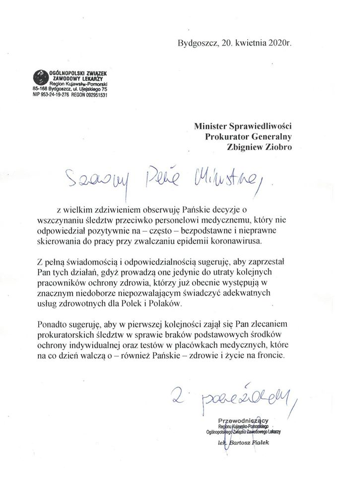
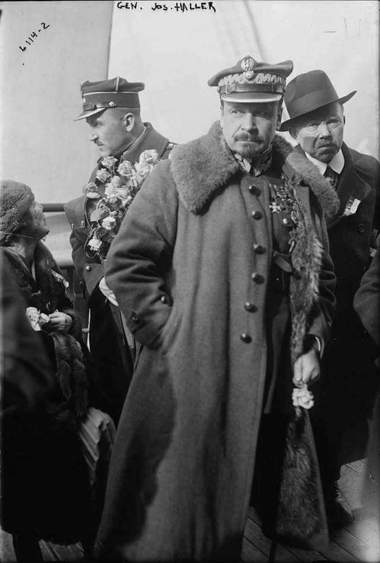
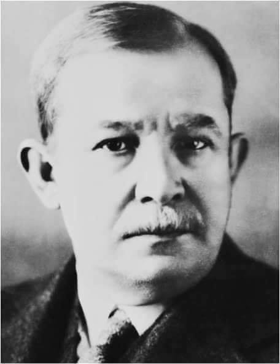
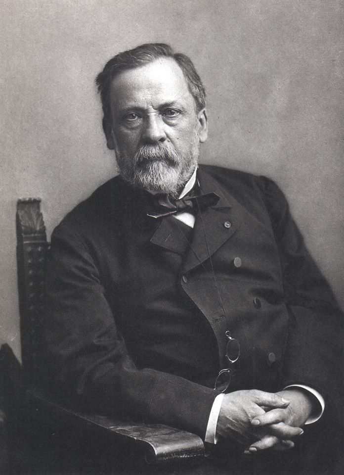

### 2020 - Oszczędności Polaków są bezpieczne – twierdzi prezes Polskiego Funduszu Rozwoju

#### Oszczędności Polaków nie są zagrożone

Borys udzielił wywiadu Radiu Zet. Przyznał, że PFR, aby sfinansować 100-mln program pomocy, będzie teraz emitować obligacje. Nie jest jasne, czy trafią one do inwestorów indywidualnych. – Nie wykluczamy takiej emisji – dodał. Oprócz tego dowiedzieliśmy się, że oprocentowanie obligacji byłoby na poziomie 2 proc. rocznie. – Ale to nie jest sięganie po oszczędności – podkreślił.

Ponoć aż 99,9 proc. rządowego wsparcia trafi do firm prywatnych, a spółek Skarbu Państwa, które z niego skorzystają, będzie „kilkanaście”.

– Budujemy system zintegrowany z ZUS i z KAS, by weryfikować wnioski online, tak żeby pieniądze były w dzień czy dwa – mówił Borys.

W czasie wywiadu powtórzył też wcześniejsze zapewnienie o tym, że rząd nie położy ręki na oszczędnościach nas wszystkich.

> „Trzy tygodnie temu wystarczył jeden artykuł o zamknięciu kilku oddziałów jednego z banków w połączeniu z dyskusją „w sieci” o tym, czy ktoś nie sięgnie po nasze depozyty, aby wywołać kolejki przed bankomatami przez 3 dni. Oczywiście, wszystkie te informacje były nieprawdziwe i już po kilku dniach klienci wracali z pieniędzmi z powrotem do banków, ale wywoływanie takiej gospodarczej i społecznej paniki jest skrajnie nieodpowiedzialne”

---

  

---

  

---

  

---

> Jasne! Poszedłem do sklepu godzinę temu zrobić zakupy podchodzę do kasy płacę karta a tu zonk! Bank odmawia wypłaty! Idę do pobliskiego bankomatu to samo!! Nadmieniam, że środki na koncie mam. Ostatnio ludzie zaczęli masowo wypłacać gotówkę i banki blokują wypłaty. Ps. Nie polecam Banku PEAKO. S.A.

---

### 1940

W Warszawie powstał Związek Odwetu - zbrojna organizacja sabotażowo-dywersyjna będąca częścią struktur Związku Walki Zbrojnej. ZO posiadał rozbudowane struktury organizacyjne i bojowe na terenach Generalnej Guberni oraz wszystkich terenach wcielonych do Rzeszy.
Pierwszym szefem ZO był powołany na rozkaz pułkownika Stefana Roweckiego major Franciszek Niepokulczycki.
Do najgłośniejszej akcji organizacji należy
„Akcja Wieniec” przeprowadzona przeciwko
niemieckiemu transportowi kolejowemu w
nocy z 7 na 8 października 1942 r. ZO
przeprowadził m.in. zamachy bombowe na
dworcach w Berlinie i Wrocławiu.

---

W Krakowie, z inicjatywy gubernatora generalnego powstał Instytut Niemieckich Prac na Wschodzie Institut für Deutsche Ostarbeit).
Do głównych zadań tej uczelni, utworzonej dla również dla upamiętnienia 51 urodzin Adolfa Hitlera należały badania etnograficzno-antropologiczna, za pomocą których próbowano udowodnić tezę o niemieckim charakterze ziem polskich.
Ciekawostką jest fakt, że prezesem tego instytutu był Hans Frank, który sam siebie mianował na to stanowisko. Funkcję dyrektora IDO (skrót) objął starszy radca Rządu Generalnego Gubernatorstwa SA-Hauptsturmführer Wilhelm Coblitz.
Do roku 1942 w IDO zatrudnionych było 150 polskich naukowców. Po tym roku zwolniono z pracy sporą część z nich, a na ich miejsce zatrudniono naukowców rosyjskich powiązanych z Rosyjską Armią Wyzwoleńczą oraz Ukraińców popierających działania Ukraińskiej Powstańczej Armii. Ludzie ci pracowali nad wieloma niemieckimi projektami. Istnieje jednak teza, że głównym powodem ich pracy była chęć ucieczki od wojennej rzeczywistości panującej na Froncie Wschodnim. Władze IDO obiecały ewakuować całą grupę rosyjsko-ukraińską, jednak do Niemiec – a później, w ramach m.in. powojennej Operation Paperclip, do USA i Kanady. Inną formą działalności IDO było zatrudnianie do niewolniczej pracy więźniów obozów koncentracyjnych.
Instytut został rozwiązany w roku 1945.

---

### 1920

W Bismarckhütte (obecnie Chorzów Batory) założony został klub piłkarski Ruch Chorzów- jedna z najbardziej utytułowanych polskich drużyn piłkarskich, 14-krotny mistrz Polski, 3-krotny zdobywca Pucharu Polski, a także ćwierćfinalista Pucharu UEFA w sezonie 1973/74.
Ruch Chorzów jest też pierwszym zdobywcą tytułu mistrza Górnego Śląska.
Zawodnikami grającymi w tej drużynie byli między innymi: Ernest Wilimowski, Gerard Cieślik, Antoni Piechniczek i Andrzej Buncol.

### 1919

Przyjechał do Polski z Francji pierwszy pociąg wiozący żołnierzy 1 Dywizji Strzelców Armii generała Józefa Hallera.
Armia ta, przed wyruszeniem do kraju otrzymała od papieża Benedykta XV sztandar. Był to jedyny przypadek w historii, aby papież ufundował i pobłogosławił sztandar, który obecnie znajduje się w Muzeum Wojska Polskiego w Warszawie. Armia ta wzięła udział w ofensywie majowej na Wołyniu w 1919 roku.

  

### 1873

W Sadzawce ( Siemianowice Śląskie) urodził się Wojciech Korfanty (zdjęcie).
Był politykiem, publicystą, a zarazem obrońcą polskości Górnego Śląska. W działalności politycznej występował przeciwko germanizacyjnym posunięciom władz i partii Centrum. Zgodnie z podstawami programowymi Narodowej Demokracji głosił hasła nierozerwalnej łączności Górnoślązaków z narodem polskim, domagał się równouprawnienia narodowego Polaków. W latach 1903-1912 i w 1918 był posłem w Reichstagu oraz pruskim Landtagu (1903-1918). 25 października 1918 roku wystąpił w Reichstagu z głośnym żądaniem przyłączenia do państwa polskiego wszystkich ziem polskich zabranych po zaborze pruskim (Prusy Królewskie, Gdańsk, Wielkopolska, część Prus Książęcych oraz Śląsk Górny i Średni).
W latach 1922-1930 był posłem na Sejm, związanym z Chrześcijańską Demokracją (ChD). Od października do grudnia. 1923 roku był wicepremierem w rządzie Wincentego Witosa i jego doradcą z ramienia ChD. Od 1924 roku wydawał dzienniki „Rzeczpospolita" i „Polonia". Był przeciwnikiem Józefa Piłsudskiego i po zwycięstwie sanacji stał się obiektem ataków z jej strony. W 1930 roku został aresztowany i wraz z posłami Centrolewicy osadzony w twierdzy brzeskiej.
Od kwietnia 1935 roku był na emigracji w Czechosłowacji.
Zmarł 17 sierpnia 1939 roku w Warszawie.

  

### 1862

Louis Pasteur i Claude Bernard przeprowadzili pierwszy udany test pasteryzacji.

Francuski chemik Ludwik Pasteur przeprowadził pierwszy zabieg pasteryzacji żywności, czyli znacznego przedłużenia jej zdatności do spożycia. Pasteur, który przez lata prowadził badania nad fermentacją (wykazał m.in., że powodują ją drobnoustroje), odkrył, że produkty spożywcze podgrzane do powyżej 70 stopni Celsjusza, ale nie więcej niż 100 stopni, zachowują smak i wartości odżywcze. Dzieje się tak dlatego, że w tej temperaturze giną drobnoustroje chorobotwórcze oraz enzymy, ale przeżywa większość wirusów i tzw. przetrwalników - substancji pozwalających przetrwać organizmom w niekorzystnych warunkach, np. w wysokiej temperaturze. Po pasteryzacji produkty można przechowywać nawet dziesięć dni, a po hermetycznym zamknięciu - wielokrotnie dłużej.

  

---

<a href="https://github.com/TomaszWaszczyk/historia.waszczyk.com/edit/master/src/content/april-20.md" target="_blank">Edytuj tę stronę dzieląc się własnymi notatkami!</a>
