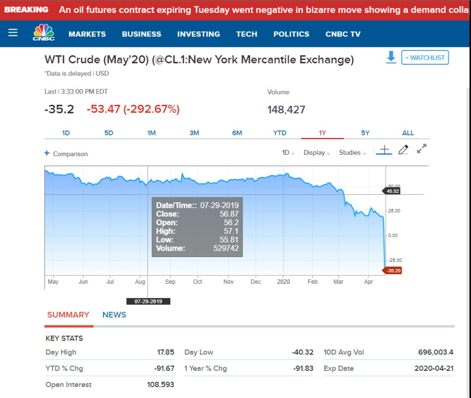

### 2021

Ani IKE, ani ZUS nie gwarantują, że emerytury Polaków będą godziwe - powiedział PAP ekspert ekonomiczny Instytutu Jagiellońskiego i wykładowca SGH dr Artur Bartoszewicz.
Na wtorkowym posiedzeniu Sejmu zaplanowano głosowanie rządowego projektu ustawy o przeniesieniu pieniędzy z otwartych funduszy emerytalnych (OFE) na indywidualne konta emerytalne (IKE) i do ZUS. Projekt zakłada likwidację OFE i daje uczestnikom wybór (sic!-ale wybór, moje) czy zgromadzone środki (ok. 148,6 mld zł) trafią na IKE, czy też zostaną przeniesione na konto w ZUS.

### 2020 - Oszczędności Polaków są bezpieczne – twierdzi prezes Polskiego Funduszu Rozwoju

Wystawca opcji PUT ponosi mniejsze ryzyko niż wystawca opcji CALL. Gdyż cena nie może spaść poniżej zera. Okazuje się, że podałem nieprawdę ;)

---

  

Pamiętam koniec lat osiemdziesiątych. Pamiętam moich dziadkow, rodziców, wujków, sąsiadów. Pamiętam spotkania na targowiskach, wymianę barterową towarów. Ale to co najbardziej mi utkwiło w pamięci to fakt, że ta bliska osoba zza miedzy, zza lady była źródłem informacji o życiu i świecie. Dla moich dziadków i rodziców radio, prasa, telewizja były tylko radziecką propagandą. Dziadek który na początku wojny walczyl z Niemcami, w drugiej jej połowie walczył  z Sowietami powtarzał - miej swój rozum, a jak nie masz, słuchaj madrzejszego. 
Trudno tych twardych ludzi było omamić sowiecką propagandą. Nawet "czarna wołga" była żartem. Codziennie sąsiedzi spotykali się przy płotach. Rozmawiali, dyskutowali, kłócili się. Dziś nie znamy sasiadow z klatki. 
Czasy się zmieniły. Ich dzieci i wnuki nie odróżniają siekiery od młotka. Dziś smiertelnym zagrożeniem życia jest plac zabaw obudowany pianką. 
Przez ostatnie 20 lat nasza rzeczywistością stało się to co promują reklamy, moda, popmedia. Wierzymy gadającym głowom z pudła, a sąsiada mamy za kretyna. 
Wykorzystując nasze lenistwo, krótkowzroczność i wygodę, potężnym tego świata udało się zrobić to, czego nie dokonały najkrwawsze tyraniczne reżimy. 
Człowieka zamieniono w zwierzę hodowlane. Narody stały się bezmyślną trzodą i bydłem. 
Właśnie przechodzimy ostatni etap ostatecznego zadrutowania ryja. 
Właśnie doświadczacie ostatniego etapu procesu pozbawienia nas resztek wolności. 
Po koronawirusie kilka rządów, kilkanaście korporacji będzie wiedzieć o tobie więcej nie tylko niż twoi bliscy, ale również ty sam. 
Twoja przyszłość będzie dla nich tak przewidywalna jak los kury nioski. 
Dzień wolności podatkowej nie będziecie obchodzić w czerwcu, ale jak dobrze pójdzie to oby tylko we wrześniu. 
Uwierzyłeś że w lesie złapiesz wirusa. Uwierzyłeś że maseczka cię zabezpieczy. Uwierzyłeś w tarczę Pinokia. Uwierzyłeś w trotyl, bombę termobaryczną, strzały, mierzeję wiślaną, milion elektrycznych samochodów, przejęcie Condora, komisję Jakiego, komisję Amber Gold, w samo Amber Gold, stocznie promowe, lotnisko w Radomiu i (nomen omen) Baranowie. Uwierzyłeś w Jezusa Króla Polski i zawierzenie polskiej gospodarki Czarnej Madonnie. 
Gdyby dziś mój ojciec wstał z grobu i bym mu to opowiedział, zareagowałby tak jak za każdym razem gdy narozrabialem. 
Przynioslby sznur od prodiża, zabrał do garażu i sprał dupę, że przez tydzień stalbym w szkolnej ławce bojąc się siadać. Nigdy więcej do głowy by mi nie przyszło wierzyć w te brednie. 
Ale dziś nie ma już mądrych mężczyzn. Dziś nie ma już Ojców. Są tylko miękkie pały w rurkach, albo zakłamane cioty bijące swoje żony. Dziś mamy tylko chłopców w partii razem, albo służalcze podnóżki po prawilnej stronie z guanem prezesa na zaroście. 
Zrozumcie!
To nie wirus cię zabije. To nie wirus zabija. Jeśli nawet uwierzyłeś że Bill Gates bierze udział w światowym spisku depopulacji to sprawdź to co napisze poniżej.
To nie AIDS, nie malaria, nie gruźlica, nie ebola, nie grypa, nie szarańcza, nie katastrofy, nie wypadki komunikacyjne i nie aborcja zabijają najwięcej ludzi na świecie. 
Największym zabójca jest...
...
...
...
BIEDA! 
Koronawirus przez rok niech zabije 5 milionów ludzi. Dla porównania - do tej pory od listopada 2019 przez koronawirusa umarło 100 tys.  
Tymczasem rocznie umiera 11 milionów dzieci do 5tego roku życia z głodu. Z powodu braku dostępu do czystej wody rocznie na świecie umiera 40 milionów ludzi przed 30-tym rokiem życia. Ponieważ biedne rodziny nie stać na podstawe leki np takie jak antybiotyki, rocznie z powodu wyleczalnych chorób umiera 3 miliony ludzi. 
Każdy tydzień zatrzymanej gospodarki światowej to wzrost śmiertelności  o kilka procent z powodu powyższych przyczyn. A to tylko pierwszy skutek. 
Czy wiesz jakie rozwiązanie tego problemu szykują ci politycy? 
Pewnie sobie myslisz, że obmyślają skąd wziąć większy helikopter żeby zrzucać "helikopter money", żeby ratować gospodarkę? Pewnie myslisz, że wspierają lekarzy i farmaceutów aby znaleźć lekarstwo i szczepionkę? 
Jeśli tak myślisz to znaczy że jesteś głupkiem. 
Politycy zajmują się tylko jedną rzeczą. Zastanawiają się jakiego winnego znaleźć na którego będzie można zrzucić winę, bo to jedyny sposób aby utrzymać się przy korycie. 
A wiesz czym to się kończy? 
Kończy się zawsze tym samym! Wystarczy znać historię. Historia magistra est.
Przypomne,, że ostatni globalny kryzys gospodarczy zakończył się rokiem 1939! 
Więc zapamietaj jedną rzecz: im bardziej pozwolisz im wcisnąć ci wiarę w wielką Polskę, tym szybciej przyślą ci syna w trumnie jeśli sam wcześniej nie zginiesz z całą rodziną od bomby. 
Abyśmy jutra nie skończyli jak w 1939, nie możemy myśleć jak bezpodstawnie dumni Polacy. Dziś musimy myśleć i działać jak Europejczycy. Jeśli tego nie zrozumiemy i nie zaczniemy wspólnie działać staniemy się wasalem w imadlle amerykansko-chinskim podgryzanym przez Putina jak Ukraina. 
Przestańcie wierzyć w Budapeszt Kaczyńskiego. Węgry juz nas mają w dupie układając się z Niemcami i budując pozycję gospodarczą na Ukrainie. 
Jeśli nawet uwierzyliście w piękny slogan PiSu , "Polska sercem Europy", to odpowiedzcie sobie na pytanie: jak długo bije serce bez mózgu, wątroby czy choćby nerek?!
Nasz obecny rząd nie jest naszym rządem. Nie ma znaczenia z jakiego powodu tak jest. Nie ma znaczenia czy to śpiochy KGB czy po prostu niedouczone tępaki.
To na jaką rzeź nas prowadzą - to ma znaczenie.
Już zrozumialem, że nikt za nas samych nie za dba o nasz interes. Już zrozumialem, że jeśli sam się tym nie zajmę, to sasiad, który liczy na mnie też tego nie zrobi.

---

#### Oszczędności Polaków nie są zagrożone

Borys udzielił wywiadu Radiu Zet. Przyznał, że PFR, aby sfinansować 100-mln program pomocy, będzie teraz emitować obligacje. Nie jest jasne, czy trafią one do inwestorów indywidualnych. – Nie wykluczamy takiej emisji – dodał. Oprócz tego dowiedzieliśmy się, że oprocentowanie obligacji byłoby na poziomie 2 proc. rocznie. – Ale to nie jest sięganie po oszczędności – podkreślił.

Ponoć aż 99,9 proc. rządowego wsparcia trafi do firm prywatnych, a spółek Skarbu Państwa, które z niego skorzystają, będzie „kilkanaście”.

– Budujemy system zintegrowany z ZUS i z KAS, by weryfikować wnioski online, tak żeby pieniądze były w dzień czy dwa – mówił Borys.

W czasie wywiadu powtórzył też wcześniejsze zapewnienie o tym, że rząd nie położy ręki na oszczędnościach nas wszystkich.

> „Trzy tygodnie temu wystarczył jeden artykuł o zamknięciu kilku oddziałów jednego z banków w połączeniu z dyskusją „w sieci” o tym, czy ktoś nie sięgnie po nasze depozyty, aby wywołać kolejki przed bankomatami przez 3 dni. Oczywiście, wszystkie te informacje były nieprawdziwe i już po kilku dniach klienci wracali z pieniędzmi z powrotem do banków, ale wywoływanie takiej gospodarczej i społecznej paniki jest skrajnie nieodpowiedzialne”

---

### Morawiecki: grozi nam deflacja, Premier boi się deflacji

– Hiperinflacja nam nie grozi, w najbliższym czasie będą nam za to groziły zjawiska deflacyjne – ocenił wczoraj premier Mateusz Morawiecki. – Nasza polityka monetarna, regulacyjna i fiskalna są ze sobą w bardzo właściwy sposób skorelowane. Najczęściej podobnego typu kryzysy groziły deflacją. A więc zjawiska, które będą nam w najbliższym czasie groziły, to są zjawiska deflacyjne, są odwrotnością do inflacji – dodał.

Jak sam przyznał rząd będzie walczył teraz o stabilność złotego:

> „Jestem przekonany, że nasza odpowiedź na wyzwania kryzysowe jest kombinacją wielu czynników, które zostały wzięte pod uwagę, jest odpowiedzią również na zagrożenia deflacyjne, na potencjalne upadłości firm, wzrost bezrobocia, deficyt finansów publicznych, który powinien teraz rosnąć, ale do pewnego poziomu, tak samo dług publiczny. Ta wielorakość różnych elementów, które zastosowaliśmy, jest optymalną na dzisiaj mieszanką na ten trudny czas, z którym przyszło nam się borykać.”

Czy ta walka zakończy się sukcesem? Ciężko wyrokować, ale jednego możemy już już pewni: lepiej już było, zaś przed nami ciężkie czasy…

Podczas sesji pytań i odpowiedzi transmitowanej na Facebooku premier Mateusz Morawiecki przyznał, że Polsce grozi deflacja. Możliwe więc, że politycy staną przed przeciwnikiem o wiele bardziej przebiegłym niż inflacja…

---

  

---

  

---

  

---

> Jasne! Poszedłem do sklepu godzinę temu zrobić zakupy podchodzę do kasy płacę karta a tu zonk! Bank odmawia wypłaty! Idę do pobliskiego bankomatu to samo!! Nadmieniam, że środki na koncie mam. Ostatnio ludzie zaczęli masowo wypłacać gotówkę i banki blokują wypłaty. Ps. Nie polecam Banku PEAKO. S.A.

---

### 1940

W Warszawie powstał Związek Odwetu - zbrojna organizacja sabotażowo-dywersyjna będąca częścią struktur Związku Walki Zbrojnej. ZO posiadał rozbudowane struktury organizacyjne i bojowe na terenach Generalnej Guberni oraz wszystkich terenach wcielonych do Rzeszy.
Pierwszym szefem ZO był powołany na rozkaz pułkownika Stefana Roweckiego major Franciszek Niepokulczycki.
Do najgłośniejszej akcji organizacji należy
„Akcja Wieniec” przeprowadzona przeciwko
niemieckiemu transportowi kolejowemu w
nocy z 7 na 8 października 1942 r. ZO
przeprowadził m.in. zamachy bombowe na
dworcach w Berlinie i Wrocławiu.

---

W Krakowie, z inicjatywy gubernatora generalnego powstał Instytut Niemieckich Prac na Wschodzie Institut für Deutsche Ostarbeit).
Do głównych zadań tej uczelni, utworzonej dla również dla upamiętnienia 51 urodzin Adolfa Hitlera należały badania etnograficzno-antropologiczna, za pomocą których próbowano udowodnić tezę o niemieckim charakterze ziem polskich.
Ciekawostką jest fakt, że prezesem tego instytutu był Hans Frank, który sam siebie mianował na to stanowisko. Funkcję dyrektora IDO (skrót) objął starszy radca Rządu Generalnego Gubernatorstwa SA-Hauptsturmführer Wilhelm Coblitz.
Do roku 1942 w IDO zatrudnionych było 150 polskich naukowców. Po tym roku zwolniono z pracy sporą część z nich, a na ich miejsce zatrudniono naukowców rosyjskich powiązanych z Rosyjską Armią Wyzwoleńczą oraz Ukraińców popierających działania Ukraińskiej Powstańczej Armii. Ludzie ci pracowali nad wieloma niemieckimi projektami. Istnieje jednak teza, że głównym powodem ich pracy była chęć ucieczki od wojennej rzeczywistości panującej na Froncie Wschodnim. Władze IDO obiecały ewakuować całą grupę rosyjsko-ukraińską, jednak do Niemiec – a później, w ramach m.in. powojennej Operation Paperclip, do USA i Kanady. Inną formą działalności IDO było zatrudnianie do niewolniczej pracy więźniów obozów koncentracyjnych.
Instytut został rozwiązany w roku 1945.

---

### 1920

W Bismarckhütte (obecnie Chorzów Batory) założony został klub piłkarski Ruch Chorzów- jedna z najbardziej utytułowanych polskich drużyn piłkarskich, 14-krotny mistrz Polski, 3-krotny zdobywca Pucharu Polski, a także ćwierćfinalista Pucharu UEFA w sezonie 1973/74.
Ruch Chorzów jest też pierwszym zdobywcą tytułu mistrza Górnego Śląska.
Zawodnikami grającymi w tej drużynie byli między innymi: Ernest Wilimowski, Gerard Cieślik, Antoni Piechniczek i Andrzej Buncol.

### 1919

Przyjechał do Polski z Francji pierwszy pociąg wiozący żołnierzy 1 Dywizji Strzelców Armii generała Józefa Hallera.
Armia ta, przed wyruszeniem do kraju otrzymała od papieża Benedykta XV sztandar. Był to jedyny przypadek w historii, aby papież ufundował i pobłogosławił sztandar, który obecnie znajduje się w Muzeum Wojska Polskiego w Warszawie. Armia ta wzięła udział w ofensywie majowej na Wołyniu w 1919 roku.

  

### 1873

W Sadzawce ( Siemianowice Śląskie) urodził się Wojciech Korfanty (zdjęcie).
Był politykiem, publicystą, a zarazem obrońcą polskości Górnego Śląska. W działalności politycznej występował przeciwko germanizacyjnym posunięciom władz i partii Centrum. Zgodnie z podstawami programowymi Narodowej Demokracji głosił hasła nierozerwalnej łączności Górnoślązaków z narodem polskim, domagał się równouprawnienia narodowego Polaków. W latach 1903-1912 i w 1918 był posłem w Reichstagu oraz pruskim Landtagu (1903-1918). 25 października 1918 roku wystąpił w Reichstagu z głośnym żądaniem przyłączenia do państwa polskiego wszystkich ziem polskich zabranych po zaborze pruskim (Prusy Królewskie, Gdańsk, Wielkopolska, część Prus Książęcych oraz Śląsk Górny i Średni).
W latach 1922-1930 był posłem na Sejm, związanym z Chrześcijańską Demokracją (ChD). Od października do grudnia. 1923 roku był wicepremierem w rządzie Wincentego Witosa i jego doradcą z ramienia ChD. Od 1924 roku wydawał dzienniki „Rzeczpospolita" i „Polonia". Był przeciwnikiem Józefa Piłsudskiego i po zwycięstwie sanacji stał się obiektem ataków z jej strony. W 1930 roku został aresztowany i wraz z posłami Centrolewicy osadzony w twierdzy brzeskiej.
Od kwietnia 1935 roku był na emigracji w Czechosłowacji.
Zmarł 17 sierpnia 1939 roku w Warszawie.

  

### 1862

Louis Pasteur i Claude Bernard przeprowadzili pierwszy udany test pasteryzacji.

Francuski chemik Ludwik Pasteur przeprowadził pierwszy zabieg pasteryzacji żywności, czyli znacznego przedłużenia jej zdatności do spożycia. Pasteur, który przez lata prowadził badania nad fermentacją (wykazał m.in., że powodują ją drobnoustroje), odkrył, że produkty spożywcze podgrzane do powyżej 70 stopni Celsjusza, ale nie więcej niż 100 stopni, zachowują smak i wartości odżywcze. Dzieje się tak dlatego, że w tej temperaturze giną drobnoustroje chorobotwórcze oraz enzymy, ale przeżywa większość wirusów i tzw. przetrwalników - substancji pozwalających przetrwać organizmom w niekorzystnych warunkach, np. w wysokiej temperaturze. Po pasteryzacji produkty można przechowywać nawet dziesięć dni, a po hermetycznym zamknięciu - wielokrotnie dłużej.

  

---

<a href="https://github.com/TomaszWaszczyk/historia.waszczyk.com/edit/master/src/content/april-20.md" target="_blank">Edytuj tę stronę dzieląc się własnymi notatkami!</a>
