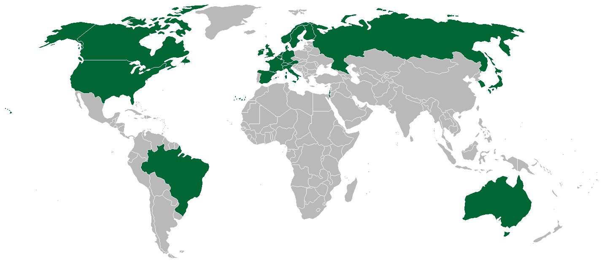

### 2023

Narodowy Bank Polski w 2022 roku stracił ponad 2 miliardy złotych na handlu kontraktami terminowymi na giełdowe indeksy.

  

### 2021

Doroczne orędzie Władimira Putina.

> Sami określimy, gdzie leży czerwona linia

### 2020

Polska w rankingu World Press Freedom Index:
2015 - 18. miejsce
2020 - 62. miejsce

### 1991

Klub Paryski zredukował o 50% polski dług zagraniczny.
Państwom zrzeszonym w Klubie Paryskim, m.in. Francji, RFN, Wielkiej Brytanii i USA, Polska była winna ok. 60 mld dolarów. Wskutek zabiegów rządu Jana Krzysztofa Bieleckiego i prezydenta Lecha Wałęsy udało się umorzyć połowę zadłużenia pod warunkiem kontynuowania wolnorynkowych reform. Ówcześni analitycy sejmowi określali tę decyzję jako bezprecedensową w historii międzynarodowych finansów, porównywalną jedynie do umorzenia niemieckich długów w 1953 r. (50 proc.) i indonezyjskich w latach 1966-70 (60 proc.). Rok później łączne zadłużenie Polski wynosiło „zaledwie” 46 mld dol. Według Ministerstwa Finansów Polska jest dziś zadłużona na ok. 273 mld dolarów.

  

<a href="./documents/april/Acta_Universitatis_Lodziensis_Folia_Oeconomica.pdf" target="_blank">Klub Paryski</a>

### 1945

W Moskwie polski premier Edward Osóbka-Morawski i Józef Stalin podpisali polsko- radziecki układ o przyjaźni, pomocy i wzajemnej współpracy.
Obie strony deklarowały wolę dalszej walki z
Niemcami i ułożenia stosunków powojennych na warunkach ścisłej współpracy politycznej,
gospodarczej i kulturalnej, przy zachowaniu zasady nieingerencji w sprawy wewnętrzne.
Polska i ZSRR zobowiązywały się do udzielania wzajemnej pomocy na wypadek agresji Niemiec lub ich sojuszników na jedno z państw.
Układ zawarto na 20 lat, 8 kwietnia 1965 roku jego ważność została przedłużona na następne 20 lat. Kontynuacją porozumień był podpisany 5 maja 1984 roku podczas pobytu Wojciecha Jaruzelskiego w Moskwie Długofalowy program rozwoju współpracy gospodarczej i naukowo-technicznej między PRL i ZSRR do 2000 roku.
W rzeczywistości porozumienie to oddało Polskę na wiele lat pod pod strefę wpływów ZSRR i spotkało się ze zdecydowanym sprzeciwem polskich władz emigracyjnych oraz Stanów Zjednoczonych i Wielkiej Brytanii.

  

### 1944

Głos Warszawy" zamieścił artykuł pt "Moralność dżungli", który był odpowiedzią na te oto słowa Delegata Rządu na Kraj Jana Stanisława Jankowskiego:
" Do nowych niebezpieczeństw zaliczyć należy działalność agentów sowieckich na naszym gruncie, przybierającą od początku tego roku na sile, równolegle do ofensywy dyplomatycznej ZSRR. Akcja PPR i KRN – to jeszcze jedna nowa przeszkoda w odzyskaniu wolnego, silnego i samodzielnego Państwa. Te agentury obce posługują się wieloma środkami: starają się podkopać zaufanie do naszego Rządu, jego Reprezentacji Krajowej i Armii Krajowej, starają się szerzyć fałsze nie gorsze od
propagandy niemieckiej, prowadzą organizacyjno–dywersyjną akcję w terenie, usiłują przeniknąć do naszych stronnictw politycznych, wywołują starcia z oddziałami AK, denuncjują naszych działaczy do Gestapo..."
W artykule "Głosu Warszawy" czytamy, co następuje:
" Dokoła zbrodni popełnionych przez reakcyjne bandy – mordowania demokratycznych i
lewicowych działaczy, zbrodni już nie tylko denuncjowania w gestapo, przekazywania list, ale wręcz chwytania swych przeciwników i oddawania ich w ręce hitlerowskich oprawców – dokoła tej ohydy cała reakcyjna prasa rozsnuwa zasłonę dymną. Starym, wypróbowanym chwytem – łapaj złodzieja – usiłuje odczuwaną przez zdrową część społeczeństwa zgrozę wobec tych metod skierować przeciwko swym przeciwnikom politycznym. W różnych plugawych i oficjalnych pisemkach coraz częściej pojawiają się oskarżenia o współpracę z
okupantem i gestapo skierowane pod adresem... PPR. Nie przywiązujemy większej wagi do tego, co wypisują znikczemniałe reakcyjne pismaki"

### 1943

Józef Stalin (zdjęcie) wysłał dwie jednobrzmiące tajne depesze do brytyjskiego premiera Winstona Churchilla i prezydenta Stanów Zjednoczonych Franklina DeLano Roosevelta, w których oskarżył generała Władysława Sikorskiego o zmowę z Adolfem Hitlerem. W tym samym piśmie Stalin zarzucił mu również prowadzenie razem z Niemcami wrogiej kampanii przeciwko Związkowi Radzieckiemu. Postawa Stalina była podyktowana faktem, że cztery dni wcześniej władze polskie złożyły w Genewie oficjalne pismo z prośbą o powołanie międzynarodowej komisji, której zadaniem miało być zbadanie szczątków żołnierzy polskich zamordowanych w Katyniu. Nieco wcześniej z taką samą prośbą wystąpiły Niemcy.

  

### 1941

Generalplan Ost

  

### 1920

Zawarta została Umowa warszawska. Naczelny Wódz zdawał sobie sprawę, że bez wolnej Ukrainy nie będzie wolnej Polski, dlatego walka o odzyskanie ukraińskiej niepodległości stała się priorytetem w polityce zagranicznej Piłsudskiego. Marszałek Piłsudski marzył o federacji państw od Bałtyku po Morze Czarne i był nieugięty w dążeniu do realizacji tego projektu. Najwymowniej świadczą o tym słowa wypowiedziane przez Wodza 31 lipca 1919 roku w Belwederze do hr. Michała Kossakowskiego:

> „Mamy takie nieocenione chwile, taką wspaniałą okazję dokonania na wschodzie wielkich rzeczy, zajęcia miejsca Rosji, tylko z odmiennymi hasłami, i wahamy się? […] Siły Rosji nie boję się. Gdybym teraz chciał, szedłbym teraz choćby do Moskwy, i nikt by nie zdołał przeciwstawić się mej sile. […] Zginę raczej, niźlibym miał z czasem rozpaczać, że mi zabrakło odwagi do wyzyskania może jedynej okazji wskrzeszenia całej wielkiej i potężnej Polski”.

Wyjaśniając swoje zamiary w rozmowie z gen. Listowskim, Piłsudski zaznaczył: „Granic 1772 roku tworzyć nie mogę, jak kiedyś chciałem. Polska nie chce tych kresów, Polska nie chce ponosić ofiar, wszystkie partie się wyraźnie wypowiedziały, nie chcemy ponosić kosztów, ani nic dać… a bez wysiłków, ofiar – nic tworzyć nie można! Zatem innego wyjścia nie ma – jak spróbować stworzyć samostijną Ukrainę”. Z kolei Symon Petlura, Naczelny Ataman wojsk Ukraińskiej Republiki Ludowej (URL), nie tracił nadziei na wywalczenie niepodległości państwowej. W tym celu szukał porozumienia z Polakami. Uczestnik wojny polsko-bolszewickiej gen. Tadeusz Kutrzeba w swej pracy „Wyprawa kijowska 1920 roku” napisał: „Petlura reprezentował realne polityczne i wojskowe wartości. Jego program polityczny obejmował ponowne utworzenie rządu URL, która miała być niezależną od Rosji – czy białej, czy czerwonej. Petlurze podporządkował się rząd ukraiński pod prezydentem Mazepą, a armia ukraińska pod wodzą Pawłenki istniała realnie i reprezentowała zbrojnie państwowość ukraińską. Armia ta dowiodła swej bitności podczas swego »pochodu zimowego«, tocząc od 6 grudnia 1919 roku do 5 maja 1920 roku skuteczne partyzanckie walki z siłami sowieckimi. Wreszcie stale wybuchające na Ukrainie powstania przeciwbolszewickie pozwalały sądzić, że wpływy Petlury sięgają w głąb mas ukraińskich. Petlura już rządził na Ukrainie i miał znowu rządzić”.

  

Rząd Rzeczypospolitej Polskiej z jednej strony i Rząd Ukraińskiej Republiki Ludowej z drugiej strony - w głębokim przeświadczeniu, że każdy naród posiada przyrodzone prawo samostanowienia o swoim losie i określenia stosunków swoich z sąsiadami i jednako ożywione chęcią ugruntowania podstaw pod zgodne i przyjazne współżycie dla dobra i rozwoju obu narodów - zgodziły się na następujące postanowienia:

I

Uznając prawo Ukrainy do niezależnego bytu państwowego na terytorium w granicach, jak będą one na północ, wschód i południe określone na zasadzie umów Ukraińskiej Republiki Ludowej z graniczącymi z nią z tych stron sąsiadami, Rzeczpospolita Polska uznaje Dyrektoriat niepodległej Ukraińskiej Republiki Ludowej z głównym atamanem, panem Simonem Petlurą na czele za zwierzchnią władzę Ukraińskiej Republiki Ludowej.

II

Granice między Rzecząpospolitą Polską a Ukraińską Republiką Ludową zostają określone w sposób następujący: na północ od rzeki Dniestru wzdłuż rzeki Zbrucz, a następnie wzdłuż byłej granicy między Austro-Węgrami a Rosją do Wyszegródka, a od Wyszegródka na północ przez wzgórza Krzemienieckie, a następnie po linii na wschód od Zdołbunowa, następnie wzdłuż wschodnich granic administracyjnych powiatu rówieńskiego, dalej na północ wzdłuż granicy byłej guberni mińskiej do przecięcia jej przez rzekę Prypeć, a następnie Prypecią do ujścia jej. Co do powiatów rówieńskiego, dubieńskiego i części krzemienieckiego, które obecnie przypadają Rzeczypospolitej Polskiej, nastąpi później ściślejsze porozumienie.

Szczegółowe określenie linii granicznej powinno być przeprowadzone przez specjalną polsko-ukraińską komisję, złożoną z odpowiednich fachowców.

III

Rząd polski przyznaje Ukrainie terytoria na wschód od linii granicznej, wymienionej w art. II niniejszej umowy - do granic Polski z roku 1772 (przedrozbiorowej), które Polska już posiada lub odzyska od Rosji drogą orężną lub dyplomatyczną.

IV

Rząd ukraiński zobowiązuje się nie zawierać żadnych umów międzynarodowych skierowanych przeciwko Polsce; do tego samego zobowiązuje się Rząd Rzeczypospolitej Polskiej wobec Ukraińskiej Republiki Ludowej.

V

Prawa narodowo-kulturalne, jakie Rząd Polski zabezpieczy obywatelom narodowości ukraińskiej na terytorium Rzeczypospolitej Polskiej, będą nie w mniejszym stopniu zabezpieczone obywatelom narodowości polskiej w granicach Ukraińskiej Republiki Ludowej i odwrotnie.

VI

Zostają zawarte umowy ekonomiczno-handlowe między Rzecząpospolitą Polską a Ukraińską Republiką Ludową.

Sprawa agrarna na Ukrainie będzie rozwiązana przez konstytuantę. Do chwili zwołania konstytuanty prawne stanowisko właścicieli ziemskich polskiej narodowości na Ukrainie określa się na zasadzie specjalnego porozumienia między Rzecząpospolitą Polską a Ukraińską Republiką Ludową.

VII

Zostaje zawarta konwencja wojskowa, która stanowi część integralną niniejszej umowy.

VIII

Umowa niniejsza jest tajna. Nie może być ona przekazana stronie trzeciej czy opublikowana przez nią w całości lub częściowo, jak tylko na skutek wzajemnej zgody obu stron, z wyjątkiem art. 1, który będzie ogłoszony po podpisaniu niniejszej umowy.

IX

Umowa niniejsza wchodzi w życie natychmiast po podpisaniu przez zawierające ją strony.

Podpisano w Warszawie w kwietniu dnia 21 roku 1920 w 2 egzemplarzach sporządzonych w języku polskim i ukraińskim z zastrzeżeniem, iż w razie wątpliwości tekst polski uważany będzie za międzynarodowy.

Kierownik Ministerstwa Spraw Zagranicznych Ukraińskiej Republiki Ludowej

Andrzej Liwicki

Kierownik Ministerstwa Spraw Zagranicznych Rzeczypospolitej Polskiej

Jan Dąbski

### 1773

Podczas obrad Sejmu w Warszawie nowogrodzki poseł Tadeusz Reytan, usiłując nie dopuścić do zatwierdzenia pierwszego rozbioru Polski położył się w drzwiach wejściowych do sali obrad, by uniemożliwić w ten sposób dostanie się do niej innym posłom.
Reytan najpierw stanął w drzwiach do sali, a następnie padł na ziemię z okrzykiem "Po moim trupie". Nic sobie z tego nie robiący posłowie przechodzili po nim jeden po drugim.
Po 36 godzinach leżenia Reytan wycieńczony fizycznie i psychicznie opuścił salę obrad.
8 sierpnia 1780 roku popełnił samobójstwo.

  

### 1909

W Łapach urodził się Józef Kosacki (zdjęcie) inżynier porucznik saperów Polskich Sił Zbrojnych na Zachodzie, ale przede wszystkim wynalazca ręcznego wykrywacza min.
Był absolwentem liceum i gimnazjum imienia Henryka Sienkiewicza w Częstochowie. W roku 1933 ukończył Wydział Elektryczny Politechniki Warszawskiej, uzyskując tytuł inżyniera elektryka. W roku 1934 został plutonowym podchorążym w Batalionie Elektrotechnicznym w Nowym Dworze Mazowieckim. Pracę zawodową rozpoczął w 1934 roku w Państwowym Instytucie Telekomunikacyjnym w Warszawie na stanowisku Kierownika Działu Wzmacniaków Telefonicznych, gdzie pracował do wybuchu wojny.
W czasie wojny obronnej we wrześniu 1939 roku służył w Grupie Technicznej Oddziału Specjalnego Łączności- formacji, która podczas obrony stolicy uruchomiła uszkodzoną przez Niemców radiostację Rozgłośni Polskiego Radia Warszawa II, przez którą do ostatnich chwil obrony miasta przemawiał prezydent Warszawy Stefan Starzyński. W roku 1940 podjął służbę w Polskich Siłach Zbrojnych w Paryżu. Po zakończeniu kampanii francuskiej wyjechał do Wielkiej Brytanii, gdzie w Szkocji rozpoczął służbę w Centrum Wyszkolenia Łączności w Dundee.
Znaczący wpływ na jego dalsze życiowe i zawodowe losy miał wypadek na szkockiej plaży w Arbroath, gdzie patrol 14. Pułku Ułanów Polskiej 10. Brygady Kawalerii dowodzony przez rotmistrza Górskiego wpadł na miny przeciwdesantowe. Właśnie wtedy wpadł na pomysł stworzenia urządzenia wykorzyztującego fale radiowe do wyszukiwania pod ziemią metalowych przedmiotów. Trzy miesiące wytężonej pracy wystarczyły Kosackiemu do stworzenia wykrywacza o nazwie Polish Mine Detector, który zdeklasował 6 innych podobnego zastosowania urządzeń stworzonych przez Brytyjczyków. Wykrywacz ten po raz pierwszy został użyty w II bitwie pod El Alamein w 1942, gdzie znacznie przyczynił się do zwycięstwa Aliantów. Józef Kosacki zrzekł się dobrowolnie patentu na opracowany wynalazek, który później – po pewnych modyfikacjach – stosowany był w wielu armiach aż do lat 90. XX wieku.
Kosacki powrócił do Polski w kwietniu 1947 roku. 9 lat później podjął pracę w Instytucie Badań Jądrowych. W roku 1976 przeszedł na emeryturę. Zmarł 26 kwietnia 1990 roku w Warszawie.

  

### 1368

Król Kazimierz III Wielki wydał Statut żupny. Dokument określa zasady wydobycia i sprzedaży soli na trzy stulecia.

Statut żup krakowskich, jest aktem prawnym, ordynacją Króla Kazimierza III (Wielkiego) wydaną w dniu 22 kwietnia 1368 roku. Przepisy tej ordynacji regulowały zasady wydobycia i obrotu naturalnym bogactwem, kopaliną soli. Nadawały moc prawną dawnym, zwyczajowym normom, ordynacja wprowadzała formalne zasady funkcjonowania żup w celu zwiększenia dochodów i ich dystrybucję. Na mocy ordynacji solnej prywatne żupy bocheńskie i wielickie otrzymały status dóbr królewskich. W dzierżawę objęli je mianowani przez króla żupnicy, urzędnicy królewscy. Ordynacja określała przepisy regulujące handel solą uzyskiwaną z żup krakowskich. Nowe przepisy regulowały produkcję soli, opodatkowanie handlu solą oraz warunki eksportu.

Opiece królewskiej poddano także górników. Ordynacja określała wysokość ich zarobków, gwarantowała pomoc materialną dla pracowników żup i dla ich rodzin w razie wypadków w pracy oraz wprowadzała stałe składki na rzecz samopomocy. Powołany został szpital, mający specjalizować się w pomocy zdrowotnej udzielanej górnikom.

Dzięki tej ordynacji, krakowscy, bocheńscy i wieliccy mieszczanie doczekali się wyróżnienia. Otrzymali możliwość korzystania z części dochodów żupniczych. Kolejną część dochodów, tym razem z eksportu soli przeznaczał król na utrzymanie powołanej w roku 1364 Akademii Krakowskiej. Wszechnica ta od XIX wieku nosi miano Uniwersytetu Jagiellońskiego.

  

---

<a href="https://github.com/TomaszWaszczyk/historia.waszczyk.com/edit/master/src/content/april-21.md" target="_blank">Edytuj tę stronę dzieląc się własnymi notatkami!</a>
