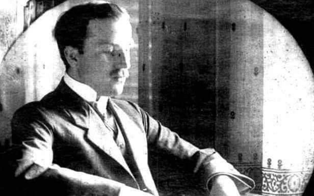
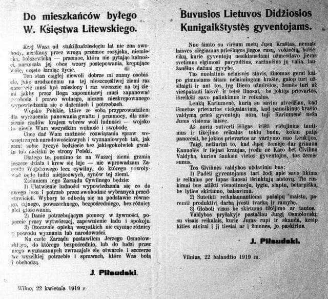
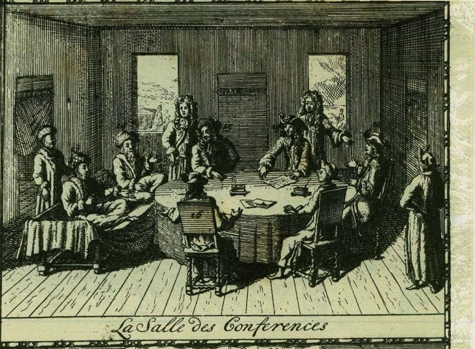
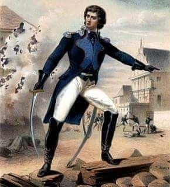

### 2020

Coraz bardziej zdumiewa odklejenie od rzeczywistości najważniejszych osób w państwie. Wygląda na to, że zrobili rzecz niedopuszczalną. Uwierzyli we własną propagandę. Tak jak każdy diler wie, że nie wolno brać swojego towaru, tak politycy muszą rozumieć, że nie bierze się na poważnie własnej propagandy. W przeciwnym wypadku zaczyna się mówić rzeczy wręcz kompromitujące.

Jadwiga Emilewicz powiedziała wczoraj, że "przedsiębiorcy czują się zaopiekowani przez rząd". Pomijając już warstwę językową, przyznać muszę, że nie znam przedsiębiorcy, który czuje się "zaopiekowany". Wiem za to o przedsiębiorcy który był na samochodowym proteście przedsiębiorców. Po kilku dniach przyszli do niego panowie z Policji i wręczyli mu karę administracyjną w wysokości 5000 zł za wysokie ryzyko zakażenia się. Przypominam, że protestujący siedział sam w swoim samochodzie. Ten to dopiero musi czuć się zaopiekowany!

Podobne problemy z odbiorem rzeczywistości ma Jarosław Kaczyński. Już po wybuchu kryzysu w wywiadzie dla RMF FM mówił, że nikt nie obiecywał przedsiębiorcom, że będzie łatwo. A poza tym rozmawiał z bankierami, a ci powiedzieli mu, że nie będzie tak źle. A co uważa nowy wiceminister finansów Piotr Patkowski? Otóż PiS jest partią klasy średniej, ale takiej klasy średniej dla której 4000 zł brutto jest marzeniem.

Równie śmiesznie (a może strasznie?) co w gospodarce jest na froncie wyborczym. Do wyborów zostały trzy tygodnie. Albo cztery, bo nie znamy jeszcze terminu wyborów prezydenckich. Nie mamy też ustawy na podstawie której wybory mają być przeprowadzone. PKW utraciła już prawo do zorganizowania wyborów a nowych przepisów jeszcze nie ma. Jeżeli Gowin jednak postawi się Kaczyńskiemu i na kilka dni przed wyborami nie poprze nowej ustawy która właśnie wróci z Senatu, to okaże się, że nikt nie ma prawa do wydrukowania kart wyborczych.

Nie ma też procedur jak wybory mają zostać przeprowadzone. Nie wiadomo kto wydrukuje karty wyborcze, nie wiadomo jak zostaną one dostarczone wyborcom ani kto przypilnuje, żeby naszej karty do głosowania nie przywłaszczył sobie sąsiad albo roznosiciel tych kart. W Polskiej Wytwórni Papierów Wartościowych twierdzą, że nie zaczną drukować kart, dopóki nie dostaną formalnego zlecenia, a to nie może przyjść do momentu uchwalenia ustawy. Sam druk kart ma im zająć trzy tygodnie, więc być może zdążą na czerwiec, ale nie na 10 maja.

Tymczasem odpowiedzialny za ten cały bardak wicepremier Jacek Sasin twierdzi, że nie widzi żadnych zagrożeń dla przeprowadzenia wyborów. Każdy normalny człowiek widzi takie zagrożenia, ale Sasin nie widzi. Zagrożenia widział nawet Marcin Horała, wprawdzie 3 lata temu, ale widział. Twierdził wtedy, że głosowanie korespondencyjne tworzy dziurę w systemie i umożliwia kupowanie głosów za alkohol, co jest oczywiście naganne. Głosy można legalnie kupować tylko za 500+ i 13 emeryturę.

Uwiąd obecnej władzy coraz mocniej przypomina schyłkowy okres rządów PO. Wtedy to platformersi uciszali opozycję mówiąc, że jak wygra wybory, to będzie mogła przegłosować sobie co tylko będzie chciała. PiS wziął sobie te rady głęboko do serca a nawet poszedł dalej. Poseł Kamil Bortniczuk poważnie stwierdził, że zdalne głosowanie nie musi działać dobrze, a głosy posłów opozycji mogą być nieuznawane, bo PiS i tak ma większość, więc to jak głosuje opozycja nie ma żadnego znaczenia. Pod koniec rządów PO Cezary Gmyz alarmował, że spółki Skarbu Państwa są zarządzane przez służby specjalne, co oczywiście jest skandalem i patologią. Kilka dni temu do zarządu PZU dołączył właśnie niedawny szef CBA Ernest Bejda, co jak rozumiem już Gmyza nie oburza.

Mamy to samo co za PO, tylko bardziej. Mieszanka wybuchowa władzy i wiary we własną propagandę sprawia, że odbija prawie każdemu. Powinno to być wielką przestrogą dla wszystkich, którzy dopiero czekają na swoją kolej w tej grze o tron. Łatwo śmiać się z czyjegoś upadku, znacznie trudniej samemu nie upaść.

Mentzen

---

Holenderski bank centralny (DNB) jest otwarty na cyfrową walutę banku centralnego (CBDC) Unii Europejskiej. Oficjalnie przyznano to w 45-stronicowym raporcie opublikowanym 21 kwietnia.
Holenderski bank centralny „jest gotów odegrać wiodącą rolę”

Bank przyznał, że „jest gotów odegrać wiodącą rolę” w procesie emisji CBDC UE. Oczekuje się, że euro w cyfrowej wersji sprawi, że płatności transgraniczne będą szybsze i tańsze dla wszystkich państw członkowskich. Holandia chce być poligonem doświadczalnym w tym procesie.

Co ciekawe w raporcie wskazano Librę Facebooka jako potencjalne zagrożenie dla stabilności monetarnej i przyznano, że „jest to powód, przez który DNB i inne banki centralne rozważają obecnie wydanie własnej waluty cyfrowej”.

### 1953

W Poznaniu zmarł na atak serca Jan Czochralski - profesor Politechniki Warszawskiej, metalurg, chemik i metaloznawca, twórca prac dotyczących głównie otrzymywania monokryształów i rekrystalizacji metali. Wynalazca stopu, z którego wykonywano panewki do produkcji ślizgowych łożysk kolejowych. Odkryta przez niego metoda otrzymywania monokryształów, nazwana od jego nazwiska metodą Czochralskiego, wyprzedziła o kilkadziesiąt lat swoją epokę i umożliwiła rozwój elektroniki. Dziś wszelkie urządzenia elektroniczne zawierają układy scalone, diody i inne elementy z monokrystalicznego krzemu, otrzymywanego właśnie metodą Czochralskiego.

  

### 1947

https://pl.wikipedia.org/wiki/Gabriel_Janowski

### 1919

Ukazała się wydana w języku polskim i litewskim odezwa Józefa Piłsudskiego do mieszkańców byłego Wielkiego Księstwa Litewskiego.
W swojej treści była ona uzasadnieniem zajęcia terytoriów litewskich przez wojska polskie, a także przedstawiała Polaków nie jako kolejnych okupantów lecz jako wyzwolicieli.

  

### 1714

W Karłowicach podpisany został traktat pokojowy między Polską, a Turcją potwierdzający zawarty 26 stycznia 1699 roku pokój między oboma państwami. Dzieki temu porozumieniu Polska odzyskała zachodnią Ukrainę oraz Podole.

  

### 1794

Podczas Insurekcji Kościuszkowskiej w Wilnie wybuchło powstanie nazywane Insurekcją Wileńską. Na jego czele stanął generał Jakub Jasiński (grafika).
400- osobowy oddział Wojska Polskiego przystąpił do walki z 2000 garnizonem rosyjskim.
Powstanie zakończyło się pełnym sukcesem. Miasto przez cztery miesiące pozostawało w rękach powstańców, którzy w tym czasie odpierali liczne ataki rosyjskie.
Polska załoga broniąca Wilna skapitulowała dopiero 12 grudnia 1794 roku.

  

### 1529

Zawarto hiszpańsko-portugalski układ w Saragossie o podziale stref wpływów, będący dopełnieniem traktatu z Tordesillas z 1494 roku.

Traktat z Tordesillas wyznaczał linię podziału na zachód od Wysp Zielonego Przylądka. W miarę kolejnych odkryć geograficznych powstał problem podziału na wschodzie. Traktat został zawarty w Saragossie 22 kwietnia 1529 r. pomiędzy królem Portugalii Janem III, a królem Hiszpanii i cesarzem rzymskim narodu niemieckiego Karolem V. Bezpośrednim powodem podpisania porozumienia był problem wysp Moluki, wschodzących w skład dzisiejszej Indonezji. Zarówno Portugalia jak i Hiszpania uważały, że traktat z Tordesillas przyznaje im do nich prawo. Ostatecznie zdecydowano, iż podział będzie przebiegał wzdłuż południka 133. Ziemie i morza na wschód od niego należały do Hiszpanii, a na zachód, w tym sporne Moluki do Portugalii.

---

<a href="https://github.com/TomaszWaszczyk/historia.waszczyk.com/edit/master/src/content/april-22.md" target="_blank">Edytuj tę stronę dzieląc się własnymi notatkami!</a>
