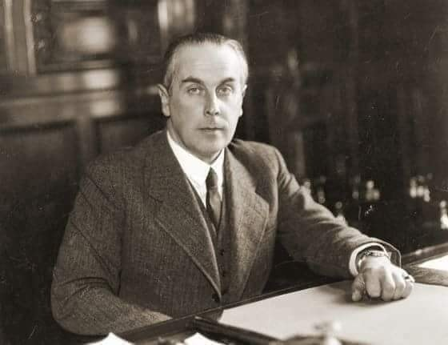
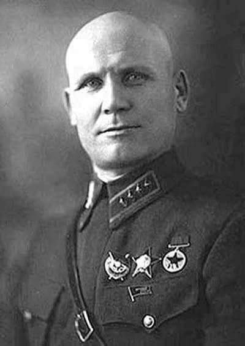
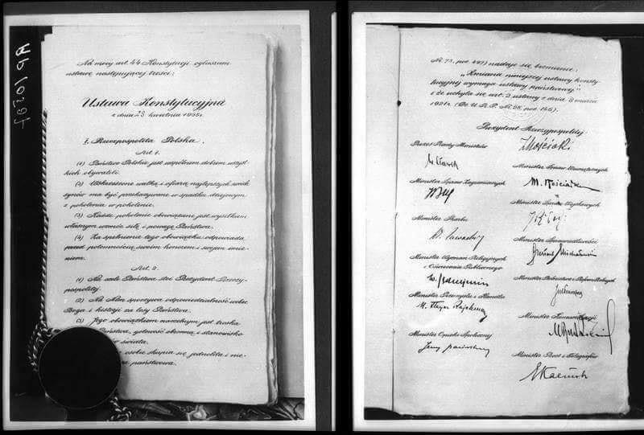
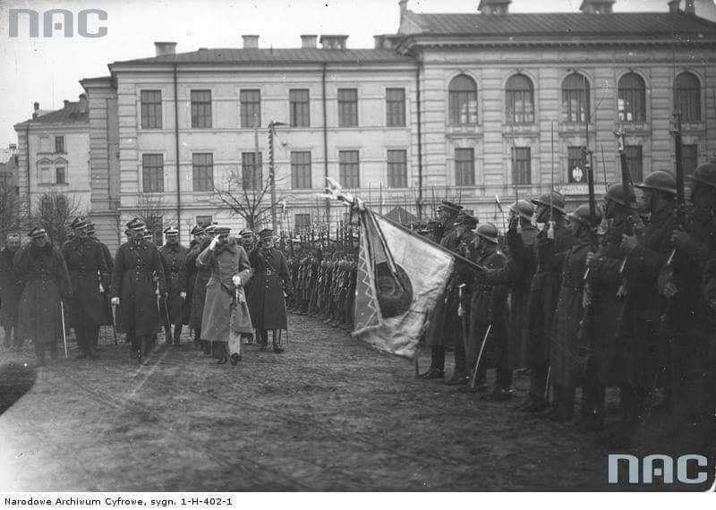

### 2020

#### Canada - towards the UBI

"Potentially thousands of workers who were laid off from small businesses due to the coronavirus pandemic are declining to return to work because the combined income they are receiving from federal stimulus benefits and New York’s unemployment system is more than they made at their jobs.

The fallout also has hindered the ability of small business owners to meet the conditions of the federal Payment Protection Plan loans, which may be forgiven if the money is used to maintain employee payrolls.

For someone making roughly $55,000 a year in their job, they would make the same amount collecting unemployment benefits for the next nine months. For someone who was paid less than that in their job, their income from unemployment benefits could far exceed what they were paid to work."

### 1981

W wieku 89 lat zmarł w Warszawie Henryk Józewski (zdjęcie) -wojewoda wołyński, polityk, minister spraw zagranicznych II RP, artysta, piłsudczyk, orędownik pojednania polsko - ukraińskiego.
Właśnie jako wojewoda prowadził politykę zmierzającą do normalizacji wzajemnego współżycia Polaków i Ukraińców. Był zwolennikiem tworzenia wspólnych organizacji społecznych i szkół. Osobiście zaangażował się w ukrycie Semena Petlury przed władzami sowieckimi. Jednocześnie przeciwny był powiększaniu się wpływów ukraińskich organizacji nacjonalistycznych, co słusznie uzasadniał obawą o przenikanie ich działaczy w struktury władz Wołynia.
W czasie wojny obronnej w 1939 roku był jednym z twórców konspiracji wojskowej.W 1945, po zakończeniu okupacji niemieckiej, nie przerwał wraz z PSD działalności konspiracyjnej, a walki o niepodległość Polski nie uważał za zakończoną. Założył pismo i kolejną grupę konspiracyjną. Był jednym z najdłużej ukrywających się działaczy powojennego podziemia. W 1947 funkcjonariusze Urzędu Bezpieczeństwa wpadli na jego trop i w końcu września 1947 przeprowadzili operację, mającą na celu jego schwytanie. Staremu konspiratorowi udało się wydostać z obławy w Podkowie Leśnej i przemknąć lasami do Milanówka. Po kilku dniach pobytu w Milanówku wyjechał potajemnie do Warszawy. Stolica nie była jednak dobrym miejscem do ukrywania się. Za namową przyjaciół wyjechał na Śląsk i trafił do Gliwic. Od drugiej połowy listopada 1947 do wiosny 1948 przebywał w Gliwicach, następnie we Wrocławiu, po czym w listopadzie 1948 lub na przełomie lutego i marca 1949 powrócił na krótko do Gliwic. Ukrywał się jeszcze w Warszawie, Radomiu i Jaszczowie na Lubelszczyźnie, gdzie został aresztowany przez UB w 1953.

Oskarżony o przestępczą i kontrrewolucyjną działalność oraz próbę obalenia ustroju PRL został skazany na dożywotnie więzienie. W maju 1956 Wojskowy Sąd Garnizonowy w Warszawie na podstawie amnestii zmniejszył mu karę do 12 lat więzienia, a w listopadzie 1956 udzielił rocznej przerwy w odbywaniu kary na leczenie. Po październiku 1956 najpierw zmniejszono Józewskiemu karę do 5 lat, później anulowano wyrok. Nigdy nie ubiegał się o rehabilitację.

Po zwolnieniu zajął się malarstwem. Malował głównie pejzaże i portrety. Od 1958 był członkiem ZPAP. Jego obrazy znajdują się w Muzeum Narodowym w Warszawie.

  

### 1955

Rada miasta Krakowa zdecydowała o nadaniu honorowego obywatelstwa marszałkowi Związku Radzieckiego Iwanowi Koniewowi (zdjęcie). W styczniu 1990 roku zmarły w 1973 roku Koniew został pozbawiony tego tytułu.

  

### 1943

https://pl.wikipedia.org/wiki/Operacja_Mincemeat

### 1935

Prezydent Ignacy Mościcki podpisał konstytucję kwietniową. Nowa ustawa zasadnicza przyznawała prezydentowi nadrzędną pozycję wobec innych organów państwa, czyniąc go odpowiedzialnym za jego losy wobec Boga i historii.

  

### 1919

W cztery dni po wkroczeniu Polaków do Wilna dokonano pogromu Żydów. Dokonać tego miała 2. Dywizja Piechoty Legionów generała Rydza - Śmigłego.
Żydzi zostali oskarżeni o sprzyjanie bolszewikom i strzelanie do wkraczających wojsk polskich. Legioniści zdewastowali cmentarze żydowskie, a także zaatakowali dzielnicę żydowską plądrując mieszkania, sklepy i zabijając ponad 50 osób.
Wspomina jeden z żołnierzy 1. Pułku Ułanów:
„Jacyś cywile z okien strzelają. Myśleliśmy, że to już, a tu z okien, z dachów, zza rogów domów sypią jak cholera, ani kroku postąpić. Wzięliśmy kilku do niewoli, zaraz ich tu przyprowadzą, są między nimi cywilni Żydzi”
Relacje dotyczące tego wydarzenia są dosyć sprzeczne. Tadeusz Piskor- uczestnik walk o Wilno, szef sztabu 2 Dywizji Piechoty Legionów mówił:
„Domy, które zdobywać trzeba było, najeżone były karabinami maszynowymi. Atak czołowy spowodowałby niesłychane straty; należało więc piąć się po dachach, wybijać w murach przejścia, zachodzić na tyły i w ten sposób w pracy bojowej, uciążliwej — zdobywać dom za domem, ulicę za ulicą. Zmuszeni byliśmy ogłosić sądy doraźne przeciwko ludności cywilnej”
Do historii odniósł się również sam Józef Piłsudski, który tak pisał w liście do Ignacego Paderewskiego:
„Znacznie gorzej było z Żydami, którzy przy panowaniu bolszewickim byli warstwą rządzącą. Z wielkim trudem wstrzymałem pogrom, który wisiał po prostu w powietrzu z powodu tego, że ludność żydowska strzelała z okien i dachów i rzucała stamtąd ręczne granaty”
Inną relację podaje francuski dziennikarz i historyk żydowskiego pochodzenia Henri Minczeles:
„Na miejski cmentarz żydowski wdarły się dwie kolumny wojskowe. Mając nadzieję na znalezienie ukrytej broni lub złota wywrócono wiele nagrobków, sprofanowano mnóstwo grobów. Inna kolumna wojskowa, która weszła do centrum miasta, napadła na dzielnicę żydowską. Przez trzy dni żołnierze rabowali i niszczyli miasto. Włamywali się do mieszkań, wypędzali z nich mieszkańców, rabowali, dewastowali sklepy, okrutnie bili Żydów, Polacy zamordowali około 80 osób. Inne oddziały wdarły się na Lipówkę i zmuszały miejscowych Żydów do kopania sobie grobów. Niektórych Żydów przywiązywano do koni i byli ciągnięci przez wiele kilometrów ulicami miasta. Innych z kolei wyrzucano przez okna. Religijnych Żydów, którym obcięto brody, liczono na setki. Kilku spalono żywcem, inni ze związanymi rękoma zostali wrzuceni do Wilii. Trzeciego dnia oddział polskich żołnierzy otoczył budynek w centrum miasta i wypędził z niego wszystkich mieszkańców. Wśród nich byli i pisarze Aaron Wajter, Leiba Jaffe oraz Szmuel Niger. Wajter został przez legionistów zastrzelony, gdyż podejrzewano go o probolszewickie sympatie. Pozostali dwaj byli przez wiele dni więzieni”.

  

### 1911

https://pl.wikipedia.org/wiki/J%C3%B3zef_Cyrankiewicz

### 1858

Urodził się Max Planck, warto wspomnieć, że jego syn Erwin Planck był za zabiciem Hitlera.

---

<a href="https://github.com/TomaszWaszczyk/historia.waszczyk.com/edit/master/src/content/april-23.md" target="_blank">Edytuj tę stronę dzieląc się własnymi notatkami!</a>
