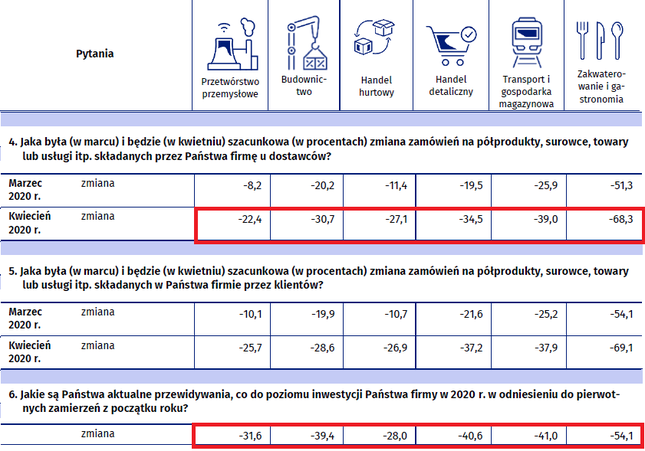
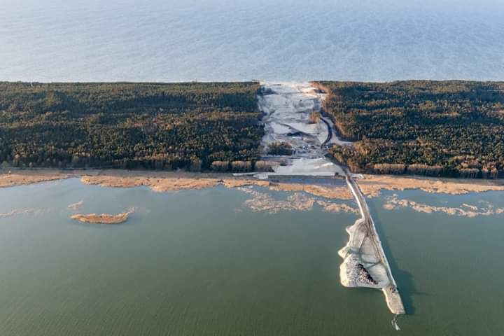
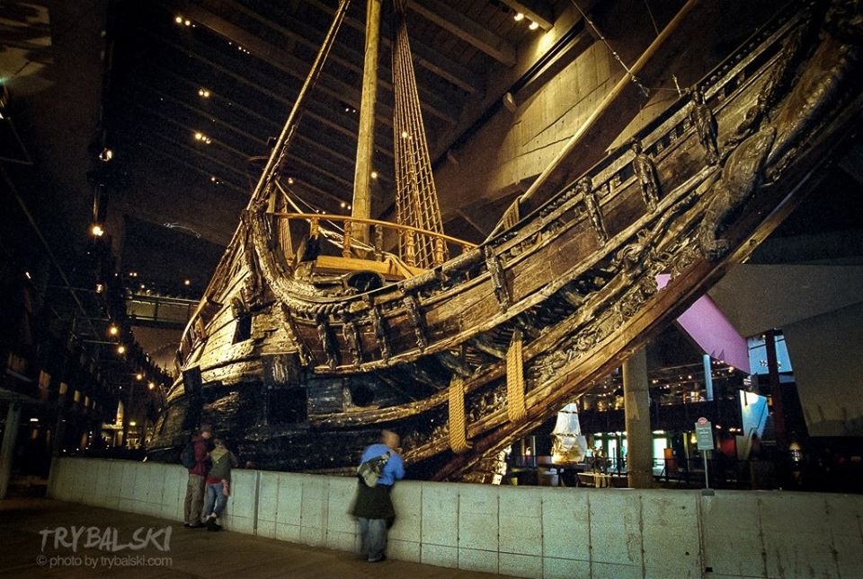

### 2020

> "Klasyczne uwspólnienie długu publicznego byłoby dobrym pomysłem, ale w „normalnych” czasach i na „stabilnym” rynku." - komentuje prof. dr hab. Kamilla Marchewka-Bartkowiak

---

GUS podał, że ilość zamówień w firmach spadła średnio (!!!) o jakieś 30% i w zależności od branży waha się od 23% do nawet 70%. Ilość inwestycji to jakieś 40% w dół. Taka sytuacja utrzymuje się od dwóch miesięcy i według rządu potrwa jeszcze przez 2 lata do szczepionki. Ale ilość etatów według tego samego urzędu w marcu spadła tylko o 0,5%, a banki szacują, że w całym roku PKB spadnie zaledwie o 2 do 4%.

Pamiętam jak podczas ostatniego kryzysu ceny ropy leciały na łeb. Paliwo było tańsze. Z miesiąca na miesiąc nieznacznie wzrosła ilość sprzedanego paliwa w litrach, ale cena spadła jeszcze bardziej, tak całe to paliwo było sprzedane za nieco mniej pieniędzy niż miesiąc wcześniej. Według ekspertów mieliśmy do czynienia wtedy ze spadkiem konsumpcji paliwa.

Gdy naczelnik ogłaszał 4k płacy minimalnej w 2024 roku to wieszano na nim psy. Tymczasem szefu poprosił o potrzymanie piwa i drukarka poszła w ruch. Ten sam GUS podaje inflację w lutym na 4,6, a było to jeszcze przed całym cyrkiem czy pierwszy polskim QE czyli skupem interwencyjnym obligacji przez NBP, tarczami kryzysowymi i spadkiem zamówień. Jak dla mnie 4k płacy minimalnej za 4 lata bardzo możliwy, ale chlebów za to kupimy dużo mniej niż dzisiaj.

  

---

  

  

  

---

> pandemia Covid19
> kryzys finansowy
> drukarki robią brrr
> kryzys klimatyczny
> poważny problem suszy
> płonie Australia, a w Polsce Biebrzański Park Narodowy
> Wielka Brytania nie jest członkiem Unii Europejskiej
> zduszenie gospodarki
> ujemna cena ropy
> drukarki robią brr
> woda będzie droższa niż złoto?
> część rolników jeszcze nie została rozliczona za ostatnią suszę
> obowiązkowe zasłanianie ust i nosa
> milenialsi stoją w kolejkach
> Nowy Jork sparaliżowany
> informacje wywiadowcze "nie potwierdzają i nie zaprzeczają" doniesieniom o słabym stanie zdrowia Kima.
> Coronabond dla ratowania gospodarki włoskiej
> social media zżerane przez fake newsy
> nie wyciągamy wniosków z poprzednich kryzysów
> sektor usług na potężnym kredycie
> Akcmann w zysku
> 3 612% w marcu, 4 144% w I kwartale tego roku. Tyle zarobił Black Swan Protection Protocol Fund.

Brakuje jeszcze lądowania ufo.

---

GUS opublikował dość niepokojące informacje na temat spadku sprzedaży detalicznej w cenach stałych w marcu 2020 r. o 9,0% do analogicznego miesiąca roku poprzedniego.

  

---

Premier: Nie grozi nam hiperinflacja, tylko...

Hiperinflacja nam nie grozi, w najbliższym czasie będą nam za to groziły zjawiska deflacyjne - ocenił we wtorek premier Mateusz Morawiecki. Podkreślił też, że jednym z priorytetów rządu będzie dbałość o stabilność złotego i finansów publicznych.

Podczas sesji pytań i odpowiedzi transmitowanej na Facebooku premier był pytany o obniżone stopy procentowe i zagrożenie hiperinflacją. Odpowiedział, że hiperinflacja nam nie grozi.

"Nasza polityka monetarna, regulacyjna i fiskalna są ze sobą w bardzo właściwy sposób skorelowane. Najczęściej podobnego typu kryzysy groziły deflacją. A więc zjawiska, które będą nam w najbliższym czasie groziły, to są zjawiska deflacyjne; są odwrotnością inflacji" - mówił Morawiecki.

Dodał, że jednym z priorytetów rządu będzie dbałość o stabilność złotego i stabilność finansów publicznych.

"Jestem przekonany, że nasza odpowiedź na wyzwania kryzysowe jest kombinacją wielu czynników, które zostały wzięte pod uwagę, jest odpowiedzią również na zagrożenia deflacyjne, na potencjalne upadłości firm, wzrost bezrobocia, deficyt finansów publicznych, który powinien teraz rosnąć, ale do pewnego poziomu, tak samo dług publiczny. Ta wielorakość różnych elementów, które zastosowaliśmy, jest optymalną na dzisiaj mieszanką na ten trudny czas, z którym przyszło nam się borykać" - zaznaczył.

---

### 2018

  

### 2015

W wieku 93 lat zmarł Władysław Bartoszewski - historyk, dziennikarz, pisarz, senator i dyplomata. Sprawiedliwy wśród Narodów Świata. Obywatel Honorowy Izraela. Kawaler Orderu Orła Białego. Orędownik pojednania polsko-niemieckiego i dialogu międzynarodowego. Prezes Honorowy Polskiego PEN Clubu.
Jako młody chłopak pracował w przychodni Polskiego Czerwonego Krzyża. 19 września 1940 roku na Żoliborzu dostał się do masowej łapanki. Trafił do niemieckiego obozu koncentracyjnego Auschwitz. Otrzymał numer 4427. Prawdopodobnie dzięki staraniom Polskiego Czerwonego Krzyża wyszedł z obozu 8 kwietnia 1941 roku. Zaangażował się działalność konspiracyjnych organizacji: katolickiego Frontu Odrodzenia Polski, Rady Pomocy Żydom ,,Żegota'', Referatu Żydowskiego, Komórki Więziennej Delegatury Rządu na Kraj, Biura Informacji i Propagandy Komendy Głównej AK.
Był uczestnikiem Powstania Warszawskiego odznaczonym za walkę Srebrnym Krzyżem Zasługi z Mieczami (20.09.1944) i Krzyżem Walecznych (4.10.1944). Po wojnie zaangażował się w działania Głównej Komisji Badania Zbrodni Niemieckich w Polsce. Został dziennikarzem ,,Gazety Ludowej'' i zaczął studia na Wydziale Humanistycznym Uniwersytetu Warszawskiego. Przerwały je aresztowanie przez władze stalinowskie. Po raz pierwszy Urząd Bezpieczeństwa aresztował go w lipcu 1945 roku. Jednak zwolniono go natychmiast po interwencji Zofii Rudnickiej, która była wysoką urzędniczką w Ministerstwie Bezpieczeństwa, a z którą w czasie okupacji hitlerowskiej Władysław Bartoszewski współpracował w Radzie Pomocy Żydom. W 1948 roku aresztowany ponownie, o jego uwolnienie postarał się brat szefa UB, Adolf Berman, który w czasie wojny korzystał z pomocy Bartoszewskiego. Kiedy Berman wyjechał do Izraela, Bartoszewski został znów aresztowany i spędził w więzieniu 7 lat. Zrehabilitowano go w 1955 roku. Po wyjściu z więzienia Władysław Bartoszewski wrócił na uniwersytet, został wkrótce skreślony z listy studentów i dokończył studia na Katolickim Uniwersytecie Lubelskim. W sierpniu 1980 r. Władysław Bartoszewski został członkiem NSZZ "Solidarność" i współtworzył Komitet Obrony Więzionych za Przekonania przy Komisji Krajowej "S" W czasie stanu wojennego był internowany w Białołęce i Jaworzu, zwolniony w maju 1982 roku. W latach 1983-84 oraz 86-88 był profesorem wizytującym Uniwersytetu Monachijskiego. W wolnej Polsce pełnił funkcję dyplomaty. Był ambasadorem w Austrii oraz dwukrotnie ministrem spraw zagranicznych. Zajmował się prowadzeniem badań nad dziejami Armii Krajowej, prasy konspiracyjnej i eksterminacji ludności polskiej i żydowskiej podczas okupacji hitlerowskiej.
Był autorem ok. 1500 publikacji prasowych i ok. 50 książek m.in. ,,Warszawski pierścień śmierci'', ,,Dni walczącej Warszawy'', i ,,Losy Żydów w Polsce''. Stał na czele Międzynarodowej Rady Państwowego Muzeum Auschwitz-Birkenau, która działała pod auspicjami Ministerstwa Kultury, a następnie Międzynarodowej Rady Oświęcimskiej. Był fundatorem Fundacji Auschwitz-Birkenau, mającej na celu zachowanie autentyzmu przestrzeni i pozostałości poobozowych.
W marcu 2016 roku podczas czwartych obchodów Europejskiego Dnia Pamięci o Sprawiedliwych w Muzeum POLIN wyróżniony został honorowym tytułem Sprawiedliwego bohatera XX wieku – tytuł ten otrzymali również rotmistrz Witold Pilecki i ksiądz Jan Zieja.

  

### 2014

We Wrocławiu zmarł Tadeusz Różewicz- wybitny poeta, dramaturg, prozaik, scenarzysta filmowy , członek Wydziału VI Twórczości Artystycznej Polskiej Akademii Umiejętności, tłumacz poezji węgierskiej, a w latach 1942-1944 żołnierz Armii Krajowej (pseudonim ''Satyr''). Był twórcą nowej formuły liryki zwróconej ku językowi potocznemu i łamiącej tradycyjne ograniczenia formalne. W swoich wierszach analizował zjawiska kultury współczesnej, odwołując się przy tym krytycznie do mitów i tradycji przeszłości. Najbardziej znane dzieła autorstwa Różewicza to: Niepokój, Głos Anonima, Płaskorzeźba, Kartoteka, Świadkowie, Akt przerywany, Pułapka, Stara Kobieta wysiaduje, Do piachu, Ocalony.
Był laureatem Nagrody Literackiej im. Władysława Reymonta "za twórczość całego życia" (1999), Wielkiej Nagrody Fundacji Kultury za rok 1999, nagrody Nike (2000) za książkę "Matka odchodzi", a także nagrody "Kreator Kultury" przyznanej przez redakcję tygodnika "Polityka", którą otrzymał ''za wierność poezji i sobie. Za świadectwo dane kilku kolejnym epokom oraz pytania, które włączyły polską literaturę i teatr w europejską debatę o najważniejszych doświadczeniach współczesnego człowieka" Tadeusz Różewicz był wielokrotnie wymieniany w gronie kandydatów do otrzymania literackiej Nagrody Nobla. Prywatnie był bratem reżysera i scenarzysty filmowego Stanisława Różewicza oraz poety i podporucznika Armii Krajowej Janusza Różewicza.

  

### 1982

Marek Niedźwiecki poprowadził pierwsze notowanie Listy Przebojów Programu Trzeciego.
Wygrała wówczas piosenka I’ll find My Way Home duetu Jon and Vangelis. Drugie miejsce zajęła piosenka O! Nie rób tyle hałasu zespołu Maanam, która w następnym notowaniu zdobyła pierwsze miejsce.

### 1945

https://pl.wikipedia.org/wiki/Larry_Tesler

### 1961

Wydobyto na powierzchnię szwedzki galeon Vasa, który zatonął w pobliżu sztokholmskiego podczas silnego podmuchu wiatru w portu w 1628 roku (jednostka przechyliła się na jedną z burt i przez luki do środka wdarła się woda).

Zbudowany w 1628 roku szwedzki galeon Vasa miał być jednym z najpotężniejszych okrętów wojennych na Bałtyku. Niedopracowany projekt, na który znaczący wpływ miał król Gustaw Adolf sprawił, że podczas pierwszego rejsu jednostka zatonęła. Wydobyto ją dopiero 333 lata później i po rekonstrukcji umieszczono w muzeum.

Okręt powstał w ramach programu rozbudowy szwedzkiej floty w trakcie wojen polsko-szwedzkich w latach 1626-1629. Według założeń miał to być potężny galeon dysponujący silnym uzbrojeniem artyleryjskim, dzięki któremu byłby jednym z najsilniejszych okrętów na Bałtyku. Prace nad okrętem rozpoczęto w 1625 roku od zabezpieczenia odpowiedniej ilości drewna, potrzebnego do budowy jednostki.

Projektem kierowali początkowo Antonius Monier i Henrik Hybertsson, jednak Monier wycofał się z prac. Stępkę pod Vasę położono w 1626 roku. Niestety rok później Hybertsson zmarł (prawdopodobnie tuż przed wodowaniem okrętu), przez co kontrolę nad pracami przejął Henrik Jacobsson. Podczas budowy duży wpływ na wygląd jednostki miał szwedzki król Gustaw Adolf, który oczekiwał, że galeon będzie nie tylko silnie uzbrojony, ale będzie dysponował smukłym kadłubem oraz licznymi zdobieniami.

Chcąc spełnić oczekiwania władcy, zaprojektowano okręt o długości 61 m, szerokości 11,7 m i wyporności 1210 ton. Żagle miały powierzchnię 1275 m², ale nie wiadomo jaką prędkość zapewniały. Uzbrojenie okrętu stanowiło łącznie 64 dział, w tym 48 dział 24-funtowych, 8 dział 3-funtowych, 2 działa 1-funtowe oraz 6 moździerzy. Załoga liczyła około 437 oficerów, marynarzy i żołnierzy piechoty morskiej.

Budowę galeonu zakończono latem 1628 roku, jednak już podczas prób obciążeniowych, przeprowadzonych w porcie wyszły na jaw problemy z statecznością jednostki. W związku z tym dodano balast z kamienia o masie 120 ton, który miał zrównoważyć dużą wysokość nadbudówek. Pierwszy rejs w pełni ukończonego galeonu zaplanowano na 10 sierpnia 1628 roku.

Okręt dowodzony przez kapitana Söfringa Hanssona wyruszył z portu w Sztokholmie i po przepłynięciu nieco ponad kilometra zaczął przechylać się na lewą burtę. Przechył szybko pogłębił się, a przez otwarte furty działowe do wnętrza zaczęła wlewać się woda. Po kilku minutach jednostka przewróciła się na burtę i zatonęła. Zginęło około 30-50 członków załogi.

Natychmiast powołano specjalną komisję, która miała zbadać przyczyny zatonięcia. Podjęto również próbę wydobycia wraku, ale bez rezultatu. Za przyczynę zatonięcia uznano zbyt długi wąski kadłub, z za wysoko umieszczonym środkiem ciężkości. Nigdy nie wskazano winnych zatonięcia, ponieważ w praktyce winnym był sam Gustaw Adolf, który wymusił taką konstrukcję okrętu.

Po nieudanych próbach podniesienia wraku, wydobyto jedynie działa i część wyposażenia, pozostawiając resztę wraku własnemu losowi na około 300 lat. Dopiero w 1956 roku za sprawą Andersa Franzéna, który ponownie odkrył wrak galeonu, powrócił pomysł wydobycia wraku. Powołano specjalny komitet, który rozpoczął przygotowania do operacji.

Prace rozpoczęto w 1959 roku od wydrążenia tuneli pod znajdującym się na głębokości 32 m wrakiem. Równocześnie przeprowadzono ponad 1300 nurkowań, w trakcie których wydobywano luźne fragmenty okrętu. Szybko okazało się, że mimo spędzenia pod wodą 333 lat, wrak jest w bardzo dobrym stanie, a jedynie elementy żelazne uległy zniszczeniu.

W sierpniu i wrześniu wrak podnoszono stopniowo i przenoszono na głębokość 16 m. Następnie rozpoczęto żmudną operację uszczelnienia kadłuba, która trwała do początku 1961 roku. Finalną operację podniesienia wraku przy pomocy pontonów rozpoczęto 8 kwietnia 1961 roku i zakończono 24 kwietnia. Vasa trafiła następnie do specjalnego doku, w którym przez 17 lat spryskiwano go najpierw wodą, a następnie specjalnym środkiem konserwującym. W 1979 roku przystąpiono do rekonstrukcji okrętu, którą zakończono w latach 90. Obecnie Vasa jest częścią specjalnego muzeum znajdującego się na wyspie Djurgården w Sztokholmie.

  

  

### 1940

Na zdjęciu ogłoszenie o zarządzeniu gubernatora Hansa Franka z 24 kwietnia 1940 roku o obowiązku zgłoszenia się polskich mieszkańców Generalnej Gubernii i Galicji na roboty rolne do Niemiec.

  

### 1915

W Imperium Osmańskim rozpoczęła się rzeź Ormian.

24 kwietnia 1915 r., tureckie wojsko i policja wyłapały ok. 2 tys. mieszkających w Stambule Ormian. Niemal wszyscy zostali natychmiast zamordowani. Ten dzień uważany jest za początek ludobójstwa mniejszości ormiańskiej, które w ciągu następnego roku mogło pochłonąć nawet 1,5 mln ofiar.

Do dziś tamta tragedia dzieli oba narody, ponieważ tureccy politycy i naukowcy twierdzą, że ludobójstwo Ormian nie miało miejsca. Wersja turecka brzmi następująco: po wybuchu I wojny światowej, w której Turcja stanęła po stronie państw centralnych, sprzyjający entencie Ormianie zamierzali wywołać powstanie antytureckie. Deportacje z rejonów walk armii tureckiej z rosyjską stały się więc koniecznością i na tym tle doszło do otwartej wojny turecko-ormiańskiej. Masakry podczas deportacji nie były efektem decyzji rządowych, lecz fatalnej organizacji spowodowanej chaosem wojennym oraz złą wolą dowódców polowych.

### 1914

,,Profesor Karski był wolny od wszelkiej formy szowinizmu. Był wolny od germanofobii, chociaż był żołnierzem Armii Krajowej, która walczyła z niemiecką, hitlerowską III Rzeszą. Był wolny od rusofobii, chociaż - świadom dominacji Związku Sowieckiego nad Polską po 1945 r. - wybrał emigrację. Był wolny od ukrainofobii... Był w ogóle wolny od jakiejkolwiek ksenofobii.
Cechowała go zdolność do rozumienia innego, odwaga mówienia prawdy i nazywania rzeczy po imieniu. A też umiejętność wybaczania i przekraczania horyzontów własnej biografii, własnej krzywdy. Pełna aprobata dla różnorodności i całkowita niezgoda na demagogię, fanatyzm, na nietolerancję.
Dla mnie osobiście Jan Karski był - obok Miłosza, Nowaka-Jeziorańskiego i Giedroycia - wielkim autorytetem polskiej emigracji. Jest to dla mnie symbol tej najlepszej Polski. On czynił Polskę lepszą każdym swoim gestem, każdym swoim wystąpieniem.
To jest ta Polska chrześcijanina - Polska miłosierdzia, a nie inkwizycji. Demokraty, który ceni umiar i broni państwa przed chaosem. Żeby powiedzieć najkrócej: Jan Karski to dawnych Polaków duma i szlachetność.
Myślę, że tym wartościom, które w spadku zostawił nam Jan Karski-Kozielewski, dochować trzeba wierności. Karski nie bał się - to dla mnie ogromnie ważne - nie bał się być w mniejszości. Często płynął pod prąd. Zacytuję Zbigniewa Herberta: wiedział, że trzeba płynąć do źródeł, czyli pod prąd, bo z prądem płyną tylko śmieci.'' (cytat wypowiedzi Adama Michnika , redaktora naczelnego "Gazety Wyborczej", o Janie Karskim)

24 kwietnia 1914 roku urodził się Jan Karski - obywatel Polski i Stanów Zjednoczonych, honorowy obywatel Izraela,
prawnik i dyplomata, historyk, od 1939 w
konspiracji, kurier i emisariusz władz
Polskiego Państwa Podziemnego, świadek
Holokaustu . Za swoją działalność został
odznaczony najwyższymi odznaczeniami
państwowymi – polskim Orderem Orła
Białego i amerykańskim Medalem Wolności
Jan Karski był kurierem i emisariuszem
politycznym. W podziemiu znany był pod
pseudonimem „Witold”. Używał także
innych: „Piasecki”, „Kwaśniewski”,
„Znamierowski”, „Kruszewski”, „Kucharski”.
Dwukrotnie, w tajemnicy przed
administracją niemiecką, udawał się do
getta warszawskiego. Aby zebrać dalsze
materiały, w przebraniu ukraińskiego strażnika wszedł do obozu zagłady, który później zidentyfikował jako Bełżec . Po wojnie przyznał, że błędnie zidentyfikował to miejsce jako obóz zagłady, ponieważ był to obóz przejściowy dla Żydów w Izbicy, z którego odchodziły transporty Żydów do obozu zagłady w Bełżcu.
W 1982 roku otrzymał tytuł Sprawiedliwego wśród Narodów Świata i posadził drzewko na
terenie Yad Vashem w Jerozolimie . Przyjął
go prezydent Izraela . W 1994 roku otrzymał
honorowe obywatelstwo państwa Izrael. W
1995 roku otrzymał Order Orła Białego .
Zmarł 13 lipca 2000 roku w Waszyngtonie.
W 2016 mianowany został pośmiertnie na stopień generała brygady Wojska Polskiego..

  

---

<a href="https://github.com/TomaszWaszczyk/historia.waszczyk.com/edit/master/src/content/april-24.md" target="_blank">Edytuj tę stronę dzieląc się własnymi notatkami!</a>
