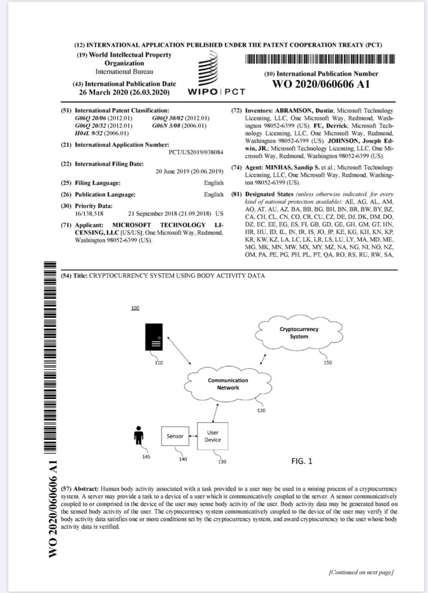
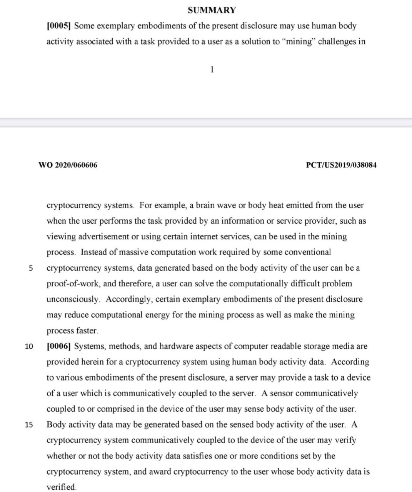
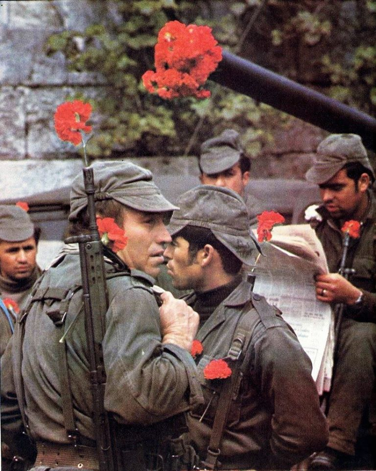
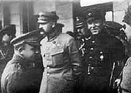
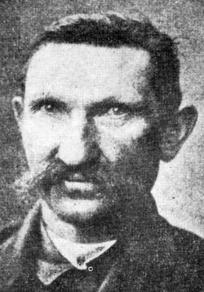
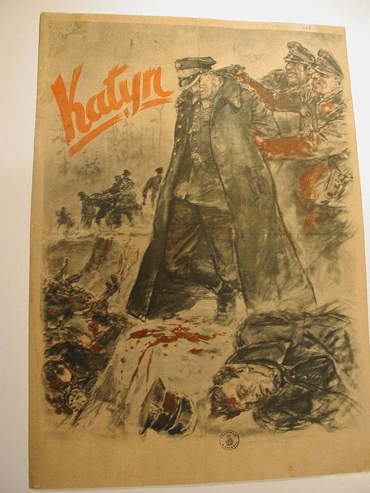
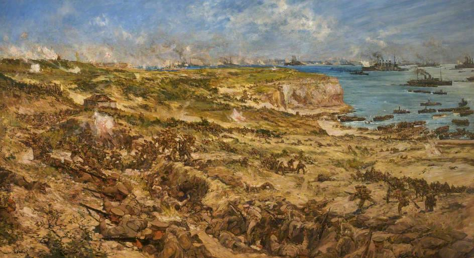
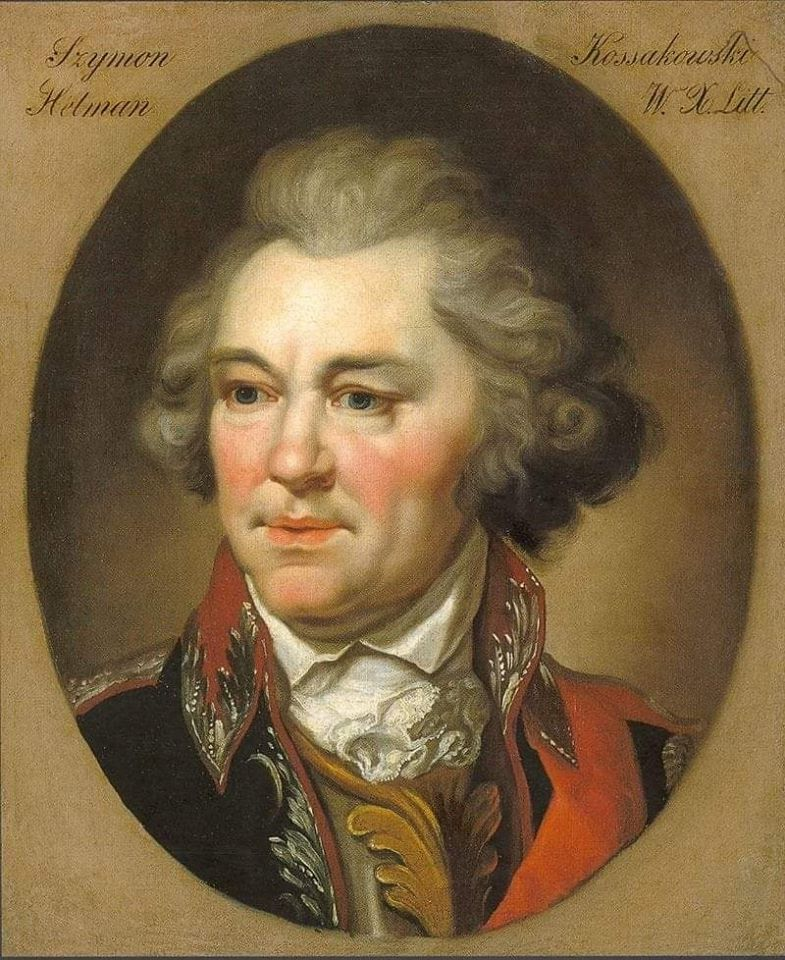

### 2020

> „Instead of massive computation work required by some conventional cryptocurrency systems, data generated based on the body activity of the user can be a proof-of-work, and therefore a user can solve the computationally difficult problem unconsciously”

  

  

More: https://patents.google.com/patent/WO2020060606A1/

### 1974

W Portugalii doszło do wojskowego zamachu stanu („rewolucji goździków“), w wyniku którego został obalony dyktator Marcelo Caetano.

Nie wiadomo, kto pierwszy włożył goździk w lufę jednego z czołgów przetaczających się tego ranka po ulicach Lizbony. Był sezon na goździki. Może te, które wzięły udział w rewolucji i znalazły się także w lufach karabinów i na klapach żołnierskich mundurów, były przygotowane na ślub, który się nie odbył z powodu zamknięcia urzędu stanu cywilnego? Może zostały porzucone przez firmę, która nie była w stanie wysłać ich na eksport, ponieważ lotnisko nie działało? Być może pochodziły z restauracji, która przygotowała je na rocznicę otwarcia lokalu, ale nie było komu pracować, więc kelnerka rozdała kwiaty przechodniom, a oni wręczyli je żołnierzom? Tak czy inaczej, to właśnie goździki stały się symbolem jednego z najbardziej niezwykłych dni w historii Portugalii – 25 kwietnia 1974 r. – i to od nich ówczesne wydarzenia zyskały nazwę – Revoluçao dos Cravos (rewolucja goździków).

W jej wyniku upadł rząd M. Caetano i autorytarny system władzy stworzony przez A. Salazara, ogłoszono swobody obywatelskie i polityczne, a rządy przejęła wojsk. Rada Ocalenia Narodowego; także określenie okresu 1974–76 walki politycznej o władzę i ustrój państwa; forsowanie przemian rewolucyjnych przez lewicowych oficerów i Portugalską Partię Komunistyczną; nacjonalizacja, reforma rolna; narastający chaos gospodarczy i polityczny; po stłumieniu próby puczu grupy komunistycznych wojskowych (1975) stopniowe przejście do rządów cywilnych i parlamentarnych (1976 demokr. konstytucja).

  

### 1920

W czasie wojny polsko- bolszewickiej rozpoczęła się wyprawa kijowska- ofensywa połączonych wojsk II Rzeczpospolitej oraz Armii Ukraińskiej Republiki Ludowej pod dowództwem Józefa Piłsudskiego, Edwarda Rydza -Śmigłego i Semena Petlury skierowana przeciwko połączonym armiom Rosyjskiej Federacyjnej Republiki Radzieckiej oraz Ukraińskiej Socjalistycznej Republiki Radzieckiej pod dowództwem Aleksandra Jegorowa i Siemiona Budionnego.
Była to jedna z największych operacji wojskowych tego konfliktu przeprowadzonych przeciwko bolszewikom. W ciągu prawie każdego jej dnia Polakom i Ukraińcom udawało się zdobywać po drodze do Kijowa kolejne miasta. Ofensywa ta została zakończona 13 czerwca 1920 roku.
Na zdjęciu Piłsudski i Petlura, Kijów, rok 1920.

  

Więcej

Wojna polsko-bolszewicka: rozpoczęła się wyprawa kijowska. Operacja kijowska miała wcielić w życie ideę Józefa Piłsudskiego utworzenia niezależnej od bolszewików Ukrainy, która miała być jednym z państw buforowych oddzielających Polskę od Rosji. Wiedząc jednak o słabości Ukraińców, Marszałek w rzeczywistości zamierzał uprzedzić ruch szykujących się do wojny z Polska bolszewików.

Traktat wersalski ustalił granicę polsko-niemiecką przyznając Polsce Pomorze Wschodnie (bez Gdańska) i prawie cała Wielkopolskę, przewidywał jednocześnie przeprowadzenie plebiscytów na Górnym Śląsku, Warmii i Mazurach. W trakcie konferencji wersalskiej rozpatrywano także sprawę polskich granic na wschodzie. Rada Najwyższa początkowo nie chciała uznać polskich praw do Galicji Wschodniej, a podejmowane przez Polskę działania militarne wywoływały silne sprzeciwy państw zachodnich.

Państwa Ententy dla zbadania sytuacji i możliwości wykorzystania terytorium Ukrainy jako przyczółka dla armii interwencyjnych antybolszewickiej, wysłały do Galicji specjalne komisje. Klęska armii Petlury radykalnie zmieniła nastawienie Rady Najwyższej, która uznała że jedynie Polskie Siły Zbrojne mogą stać się istotnym czynnikiem w walce z bolszewikami. W wyniku takiego stanowiska Rada Najwyższa upoważniła rząd Polski do wprowadzenia zarządu cywilnego w Galicji Wschodniej, do rzeki Zbrucz, stanowiącej przed 1914 rokiem granice austriacko – rosyjską.

Polityka wschodnia odrodzonego państwa polskiego była kształtowana przede wszystkim przez Naczelnika Państwa Józefa Piłsudskiego, który działał poprzez zaufanych oficerów skupionych w adiutanturze Naczelnego Wodza i II Oddziale Sztabu Generalnego WP. Była to działalność zakonspirowana wobec innych władz. Premier i minister spraw zagranicznych Ignacy Paderewski w zasadzie popierał koncepcje Józefa Piłsudskiego i nie interweniował bezpośrednio w sprawy jej realizacji. Józef Piłsudski zmierzał do maksymalnego rozczłonkowania i osłabienia Rosji. Podejmując szeroką akcję dyplomatyczną i propagandową w sprawie budowania federacji Józef Piłsudski przygotowywał niezależnie zaufane kadry na Białorusi, Litwie, i Ukrainie do realizacji swoich zamierzeń. Pilnował by szybko postępował proces tworzenia i rozbudowywania regularnej armii polskiej.

W kwietniu 1919 r. Wojsko Polskie opanowało Wileńszczyznę, w lipcu rozbiły Zachodnio – Ukraińską Republikę Ludową, latem zajęły zachodnie regiony Białorusi z Mińskiem włącznie, a w grudniu dotarły do Dyneburga nawiązując współprace z Łotyszami. Terenów tych nie włączano bezpośrednio w skład państwa, podjęto zabiegi tworzenia bloku państw bałtyckich, ale na skutek oporu Litwinów celu tego nie zrealizowano.

Do Polski przybywały różne misje gospodarcze i wojskowe, rząd Ignacego Paderewskiego zaciągał pożyczki na broń, amunicję, umundurowanie i żywność. Ok. 50% budżetu państwa przeznaczano wyłącznie na potrzeby wojska. W połowie 1919 r. Wojsko Polskie osiągnęło stan w służbie czynnej ok. 500 tys. żołnierzy. W okresie od kwietnia do czerwca 1919 r. do Polski przetransportowano z Francji dobrze wyposażoną Armię Polską gen. Józefa Hallera. Armia ta składała się z sześciu trzypułkowych dywizji, łącznie ok. 80 tys. żołnierzy. W październiku gotowość do działań w strukturach Wojska Polskiego osiągnęła Armia Wielkopolska liczącą ok. 90 tys. żołnierzy. Akt włączenia obydwu armii do struktur Polskich Sił Zbrojnych miał uroczysty charakter i został dokonany w październiku w Krakowie i w Poznaniu.

Stanowisko mocarstw zachodnich wobec Polski miało charakter wybitnie koniunkturalny. W połowie 1919 roku tereny te znajdowały się już całkowicie pod naszą kontrolą, a więc potwierdzono formalnie istniejący już stan rzeczy. Zagwarantowano tym samym zwolennikom restytucji białej Rosji, że dalej Polacy już nie pójdą, a ich obecność będzie skuteczną zaporą przeciw ekspansji bolszewików na zachód.

We wrześniu 1919 r. premier Ignacy Paderewski zażądał jasnego stanowiska Ententy wobec Rosji. Niestety nie uzyskał satysfakcjonującej odpowiedzi, co skłoniło Józefa Piłsudskiego do podjęcia rokowań z Rosjanami na własną rękę. Niestety rozmowy gen. Aleksandra Karnickiego z gen. Antonem Denikinem, prowadzone w Taganrogu zakończyły się fiaskiem. Gen. Denikin, w sytuacji chwilowego powodzenia jego wojsk w ofensywie na kierunku moskiewskim, stał sztywno na stanowisku restauracji jednej, niepodzielnej Rosji w granicach sprzed 1914 r.

W tej sytuacji Józef Piłsudski uznając, że udzielenie pomocy gen. Denikinowi byłoby sprzeczne z polską racją stanu uchylił się od podjęcia aktywnych działań w celu zdławienia bolszewików. Następstwem takiej decyzji było też podjęcie rozmów z przedstawicielem władz Rosji radzieckiej. Tajne rozmowy (ze strony polskiej: komisarz generalny ziem wschodnich – Jerzy Osmołowski, Aleksander Więckowski i Ignacy Boerner) prowadzono początkowo w Białowieży potem w Mikaszewiczach na Podolu. Bolszewików reprezentował Julian Marchlewski.

Strona polska domagała się zaprzestania działań zbrojnych na Ukrainie przeciwko atamanowi Semenowi Petlurze, oddania Dyneburga Łotwie i ustalenia linii demarkacyjnej wzdłuż Berezyny, Ptyczy aż po Zwiahel. Bolszewicy grali na czas by nie dopuścić do podjęcia współdziałania Polaków z Denikinem. W grudniu 1919 r. rozmowy przerwano. Negocjacje delegatów Józefa Piłsudskiego z Julianem Marchlewskim były bardzo źle odbierane przez państwa zachodnie, mocno zaangażowane w wspieranie interwencji antybolszewickiej gen. Denikina. Efektem tego niezadowolenia była decyzja Rady Najwyższej z 21 listopada 1919 r. podjęta w wyniku zdecydowanych nacisków Lloyda Georg’a, która zmieniła wcześniejsze ustalenia w sprawie granic polskich na wschodzie. Nowa decyzja Rady Najwyższej zatwierdzała statut autonomiczny Galicji Wschodniej i przyznawała Polsce jedynie 25 letni mandat Ligi Narodów na zarządzanie tym obszarem, zobowiązując jednocześnie do przeprowadzenia plebiscytu.

8 grudnia 1919 r. Rada Najwyższa podjęła kolejną decyzję utrudniającą poważnie zaistniałą sytuację. Wytyczono sztucznie tzw. linię Curzona, która nijak się miała do linii granicy etnicznej, a która nawiązywała do zachodniej granicy Rosji po trzecim rozbiorze Polski. Podkreślono co prawda, że decyzja ta ma charakter tymczasowy i nie przesądza o zmianach podejmowanych w toku późniejszych porozumień prowadzących do ostatecznego ustalenia granic wschodnich Polski. Takie postawienie sprawy nie zadawalało żadnej ze stron i było wyraźnym zaproszeniem do rozpoczęcia działań zbrojnych i w przyszłości pretekstem do roszczeń terytorialnych.

Dwuznaczne stanowisko mocarstw zachodnich wobec polskich działań na wschodzie, zachodzące zmiany na polskiej scenie politycznej na rzecz wzmocnienia pozycji partii centrowych w Sejmie, konflikty premiera Ignacego Paderewskiego z Józefem Piłsudskim, a także pogarszająca się sytuacja w gospodarce, doprowadziły do kolejnych ataków na rząd i w konsekwencji do jego dymisji. 13 grudnia 1919 r. sformowano nowy rząd centrowy, na czele którego stanął Leopold Skulski.

Tymczasem wojska atamana Semena Petlury zostały rozbite przez gen. Denikina i uległy rozproszeniu, a sam ataman schronił się w grudniu 1919 r. w Polsce. Przewodniczący Ukraińskiej Rady Narodowej Ewhen Petruszewycz dotarł do Wiednia. Sytuację tą wykorzystali bolszewicy i ponownie wtargnęli na Ukrainę spychając wojska gen. Denikina na południe. Do Kijowa powrócił bolszewicki rząd z bułgarskim komunista Christianem Rakowskim na czele.

Na przełomie lat 1919 i 1920 Józef Piłsudski przystąpił do realizacji swego gigantycznego planu rozbicia Rosji i utworzenia systemu Międzymorza tj. bloku państw położonych na obszarze między Bałtykiem i Morzem Czarnym. Front wschodni ustabilizował się nad Berezyna i Horyniem.

W styczniu korpus gen. Śmigłego – Rydza zdobył Duneburg. Uwolnione od bolszewików Inflanty przekazano władzom Łotwy. Miał to być przykład postawy Polaków zachęcający inne narody wschodnioeuropejskie do ścisłej współpracy z Polską.

Na niewielkim skrawku ziemi ukraińskiej z Chmielnikiem, ziemi pozostającej pod kontrolą partyzantki narodowej, utworzono z inicjatywy atamana Semena Petlury nowy rząd Ukrainy, któremu Polska dała poparcie. Polskie poparcie dla rządu Petlury przewidywało współpracę przeciwko bolszewikom w zamian za uznanie granicy polsko – ukraińskiej na Horyniu i Zbruczu.

Po dłuższych oporach ataman Petlura wyraził zgodę na proponowane warunki, czym zraził do siebie większość Ukraińców galicyjskich. Zgody na współdziałanie z Polakami odmówił emigracyjny rząd Petruszewycza w Wiedniu i inni politycy ukraińscy reprezentujący środowiska narodowe.

Niepowodzeniem zakończyły się polskie próby tworzenia sojuszy z innymi narodami wschodnioeuropejskimi. Konferencja w Helsinkach zwołana w dniach 15 – 22 stycznia 1920 r. z udziałem delegacji rządowych Polski, Finlandii, Łotwy, Estonii i Litwy, wskazująca na rosnące zagrożenie ze strony Rosji radzieckiej nie stworzyła jednolitego wspólnego frontu przeciwko bolszewikom. Przeszkodą było przede wszystkim stanowisko delegacji litewskiej, która postawiła znak równości swoich zagrożeń wskazując obok bolszewików także Polskę i Niemcy. Istotną przeszkodą były też roszczenia terytorialne Litwinów do Suwalszczyzny, Wileńszczyzny, a nawet Białegostoku oraz brak zainteresowania do przeprowadzenia plebiscytu.

Po fiasku rozmów z gen. Denikinem Józef Piłsudski próbował jeszcze pozyskać dla swych planów reprezentantów opozycji antybolszewickiej w Rosji. Prowadzone rozmowy z Borysem Sawinkowem, przedstawicielem „eserów”, nie zmieniły sytuacji. Rząd Rumunii, usatysfakcjonowany inkorporacją Besarabii wyraził w marcu 1920 r. gotowość do podpisania pokoju z Rosja radziecką, polskich planów nie poparła Czechosłowacja.

W tej sytuacji koncepcję federalizacji wschodnioeuropejskiej mogła Polska realizować opierając się wyłącznie na własnych siłach. Jedynym sojusznikiem Józefa Piłsudskiego był ataman Semen Petlura i jego wojska oraz niewielkie oddziały sformowane z Białorusinów.

Przygotowania wojenne Polaków poparły zdecydowanie rządy państw zachodnich, głównie Anglii, Francji i Włoch, widząc w nich jeszcze jedna szansę realizacji swoich zamierzeń w przyszłej Rosji.

Uruchomiono szerokim frontem dostawy broni, sprzętu i uzbrojenia oraz niezbędnego wyposażenia dla Wojska Polskiego. W dużej części był to tzw. demobil, zmagazynowany po zakończonej I wojnie światowej. Dostawy sprzętu wojskowego kierowano także ze Stanów Zjednoczonych.

Trwał proces reorganizacji Polskich Sił Zbrojnych, do kraju ściągnięto z Francji Błękitną Armię gen. Józefa Hallera (ok. 80 tys. żołnierzy), w strukturę Polskich Sił Zbrojnych włączono także Armię Wielkopolską (90 tys. żołnierzy). Łącznie pod bronią znalazło się ok. 700 tys. żołnierzy. Naczelnym Wodzem pozostał Józef Piłsudski, któremu 19 marca 1920 r. nadano stopień marszałka Polski. Szefem sztabu armii polskiej został gen. Stanisław Haller, brat gen. Józefa Hallera. W marcu 1920 r. Wojsko Polskie zakończyło reorganizację i w składzie utworzonych sześciu armii osiągnęło gotowość do działań.

Równolegle intensywne przygotowania czyniła też armia bolszewicka, grupując swe siły na terytorium Białorusi. By skryć swoje intencje bolszewicy podjęli zmasowaną inicjatywę dyplomatyczną, proponując różne rozwiązania pokojowe, ocenione jako aroganckie i niewiarygodne.

24 lutego 1920 r. Sejmowa Komisja Spraw Zagranicznych przyjęła oświadczenie ministra Stanisława Grabskiego wyrażające stanowisko Polski do propozycji bolszewików.

„ Polska nie odrzuca tych propozycji, lecz pragnie trwałego zabezpieczenia swych granic wschodnich i usunięcia przyczyn swych krzywd dziejowych ze strony Rosji. Zażądano by ludności ziem należących do Rzeczypospolitej przed rokiem 1772 dać prawo swobody wyboru przynależności państwowej, by przedstawiciele tej ludności wzięli udział w rokowaniach pokojowych oraz by warunki pokoju polsko-radzieckiego zostały zatwierdzone przez reprezentację całego narodu rosyjskiego, a nie tylko przez rząd bolszewicki”.

Rząd bolszewicki grał na zwłokę. Nieszczerość intencji wyszła na jaw gdy odrzucano kolejne propozycje wskazania miejsca dalszych negocjacji i ewentualnego podpisania porozumienia. W tym czasie zostały ewakuowane oddziały Ententy z Archangielska i Murmańska. Odtąd jedyną siłą zbrojną, która mogła stanąć do walki z bolszewikami było Wojsko Polskie.

Gdy przewodniczący delegacji bolszewickiej Cziczerin składał rządowi polskiemu kolejną wersję oferty pokojowej Lew Trocki zapowiadał na wiecu w Moskwie „zmiażdżenie burżuazyjnej Polski”. Pod koniec marca 1920 r. wywiad polski wszedł w posiadanie ustaleń narady wojskowej odbytej w Smoleńsku 20 marca, gdzie przedstawiono opracowane założenia ofensywy przeciw Polsce.

Wyprawa Kijowska:

21 kwietnia 1920 r. doszło w Warszawie do podpisania umowy polsko – ukraińskiej, w której Polska uznała niepodległość Ukrainy w granicach na wschód od dawnej granicy Rosji i Austro – Węgier na Zbruczu, a dyrektoriat Ukraińskiej Republiki Ludowej z atamanem Semenem Petlurą za rząd ukraiński. Strony ustaliły, że rząd Ukraińskiej Republiki Ludowej zrzeka się pretensji do Galicji Wschodniej i części Wołynia; oba rządy przyznały wzajemnie pełne prawa kulturalno-narodowe mniejszościom polskiej i ukraińskiej na swych terytoriach, a sprawę agrarną na Ukrainie, gdzie wielka własność ziemska była w dużej mierze w rękach polskich, rozwiązać miała decyzja Konstytuanty Ukraińskiej.

Do umowy dołączono tajną klauzulę wojskową przewidującą sojusz wojsk polskich i ukraińskich pod dowództwem Wodza Naczelnego – Józefa Piłsudskiego. W Kamieńcu Podolskim wznowić miały działalność władze administracyjne Ukrainy, a po zakończeniu działań operacyjnych wojska polskie miały być wycofane z Ukrainy.

Naczelnik Państwa Józef Piłsudski i generalicja zakładali, że bolszewicy nie pokonani w polu, nie uszanują prędzej czy później żadnego zawartego przez siebie pokoju i nie zrezygnują z roszczeń do ziem Rzeczypospolitej, dawnego zaboru carskiego. Zdecydowano nie czekać biernie, aż przeważające siły rosyjskie uderzą na Polskę. Korzystniejsze rozwiązanie widziano w wykonaniu uderzenia wyprzedzającego, na nierozwinięte jeszcze siły wroga, rozbiciu ich i szybkim zakończeniu działań militarnych na jego terytorium.

Polska jawiła się dla wielu, zarówno w kraju jak i w Europie jako zbyt słaba, by móc podejmować tak wielkie polityczne plany. Przeciwstawiał się kategorycznie takim opiniom Józef Piłsudski przekonując, że Polska ma już znaczną siłę zbrojną, którą nieustannie rozwija, i że Rosja wyniszczona wielką wojną, rozdarta rozlewającą się rewolucją bolszewicką i wojną domową jest do pokonania. Jeżeli będzie kiedykolwiek szansa trwałego odwrócenia koła historii i pokonanie wroga – to właśnie teraz ona nadchodzi.

23 kwietnia Józef Piłsudski przyjechał do Równego na odprawę z dowódcami 2 i 6 Armii – generałami Antonim Listowskim i Wacławem Iwaszkiewiczem, z dowódcą Grupy Uderzeniowej 3 Armii – generałem Edwardem Śmigłym – Rydzem oraz dowódcą 1 Dywizji Jazdy – generałem Janem Romerem.

25 kwietnia 1920 r. o świcie, wojska polskie pod dowództwem Józefa Piłsudskiego ruszyły na całym froncie ukraińskim kierując się na Korosteń, Żytomierz, Berdyczów, Koziatyń i Winnicę.

Doceniając doniosłe znaczenie, tak strategiczne jak i polityczne ofensywy na Ukrainie – Józef Piłsudski zapewnił tej operacji znaczną przewagę sił. Skierował tam niemal połowę piechoty (9 dywizji z 21 istniejących) i prawie połowę kawalerii (4 brygady z 9), potężną artylerię, kolumny samochodów do przewozu wojsk oraz liczne oddziały służb pomocniczych, w tym balony obserwacyjne i lotnictwo.

Siły bolszewickie były zdecydowanie słabsze: 7 dywizji piechoty o znacznie mniejszej wartości bojowej od naszych oraz jedna dywizja i jedna brygada kawalerii.

„Dyspozycja operacyjna do ofensywy na Ukrainę” z 17 kwietnia 1920 r. ustaliła, że: „Ideą przewodnią operacji w pierwszym okresie jest rozdzielenie sił nieprzyjaciela na dwie grupy przez szybkie zajęcie Żytomierza i Koziatyna, odcięcie odwrotu wojskom bolszewickim, stojącym na północ od szosy Zwiahel – Żytomierz oraz zepchnięcie sił stojących na południe od kolei Szepetówka –Koziatyn, w kierunku południowym”.

Ta „Dyspozycja operacyjna” nie wyznaczała niestety najważniejszego dla każdej ofensywy zadania: „- zniszczyć wojska nieprzyjaciela!”.

Plan ofensywy kijowskiej został opracowany, pod osobistym kierownictwem Naczelnego Wodza przez pułkownika Stachiewicza i dwóch adiutantów – Wieniawę i Stanisława Radziwiłła. Tą skrytość argumentowano obawą niedyskrecji gdyby przygotowywał go Sztab Generalny WP (?). Do współpracy nie był wzywany żaden z dowódców armii, a na naradzie z udziałem dowódców armii – gen. Szeptyckiego i gen. Majewskiego, kilka dni przed ofensywą o planie ofensywy nie wspomniano. Będzie to miało swoje konsekwencje.

Przełamanie frontu okazało się łatwiejsze niż przypuszczano, nieprzyjaciel nie przyjmował walki i wycofywał swe siły. Cofająca się kawaleria bolszewicka podpalała mosty i przeprawy na drodze aby opóźnić marsz Polaków. Miejscowa ludność okazywała wiele pomocy naprawiając drogi i witając na gościńcach przemieszczające się kolumny żołnierzy. W nocy 1 Brygada podeszła pod Żytomierz i rano podjęła atak na broniące miasto oddziały 58 Dywizji Piechoty. Po 3 godzinnych walkach bolszewicy wycofali się z miasta, pozostawiając kilkuset jeńców, kilka armat i sporo zaopatrzenia wojskowego w wagonach na dworcu kolejowym. Zdobycia Żytomierza dokonano w wyznaczonym czasie, przy minimalnych stratach własnych. Nie udało się 3 Brygadzie Kawalerii zamknąć wycofujących się z Żytomierza sił bolszewików, które broniąc się zaciekle zmierzały w stronę Kijowa.

Po zajęciu Żytomierza Józef Piłsudski ogłosił odezwę do ludności:

„ Do wszystkich mieszkańców Ukrainy!

Wojska Rzeczypospolitej Polskiej na rozkaz mój ruszyły naprzód, wstępując głęboko na ziemie Ukrainy. Ludność ziem tych czynię wiadomym, że wojska polskie usuną z terenów, przez naród ukraiński zamieszkałych, obcych najeźdźców, przeciwko którym lud ukraiński powstawał z orężem w ręku, broniąc swych sadyb przed gwałtem, rozbojem i grabieżą.

Wojska polskie pozostaną na Ukrainie przez czas potrzebny po to, by władzę na ziemiach tych mógł objąć prawy rząd ukraiński. Z chwilą gdy rząd narodowy Rzeczypospolitej Ukraińskiej powoła do życia władze państwowe, gdy na rubieży staną zastępy zbrojne ludu ukraińskiego, zdolne uchronić kraj ten przed nowym najazdem, a wolny naród sam o losach swoich stanowić będzie mocen – żołnierz polski powróci w granice Rzeczypospolitej Polskiej, spełniwszy szczytne zadanie walki o wolność ludów.

Razem z wojskami polskimi wracają na Ukrainę szeregi walecznych jej synów pod wodza atamana głównego Semeny Petlury, które w Rzeczypospolitej Polskiej znalazły schronienie i pomoc w najcięższych dniach próby dla ludu ukraińskiego.

Wierzę, że naród ukraiński wytęży wszystkie siły, by z pomocą Rzeczypospolitej Polskiej wywalczyć wolność własną i zapewnić żyznym ziemiom swej ojczyzny szczęście i dobrobyt, którymi cieszyć się będzie po powrocie do pracy i pokoju.

Wszystkim mieszkańcom Ukrainy bez różnicy stanu, pochodzenia i wyznania wojska Rzeczypospolitej Polskiej zapewniają obronę i opiekę.

Wzywam naród ukraiński i wszystkich mieszkańców tych ziem, aby niosąc cierpliwie ciężary, jakie trudny czas wojny nakłada, dopomagali w miarę sił swych wojsku Rzeczypospolitej Polskiej w jego krwawej walce o ich własne życie i wolność.

Józef Piłsudski
Wódz Naczelny Wojsk Polskich.
26 kwietnia 1920 r. Kwatera Główna.”

Tego samego dnia ataman Semen Petlura wydał odezwę „Do narodu Ukrainy”, która była odpowiednikiem odezwy Józefa Piłsudskiego. Stwierdził w niej, że „Polska przychodzi Ukrainie z pomocą jako sojusznik w walce z moskiewskimi bolszewikami -okupantami”.

Po 262 latach od ugody Hadziackiej Józef Piłsudski rozpoczął nowy okres współpracy z Ukrainą, czynił to z uporem Litwina i przebiegłością Metternicha, wbrew większości własnego narodu i wbrew ówczesnym rządom Ententy, które chciały odrodzoną Polskę zamknąć w granicach etnograficznych od Warty do linii Curzona. Józef Piłsudski opierał się tylko na własnej intuicji i głębokim przekonaniu, że bez wolnej Ukrainy niepodległa Polska długo nie przetrwa.

Równolegle, na południowym Polesiu ofensywę prowadziła 4 Dywizja Piechoty w kierunku na Kostrzyń oraz oddziały Grupy Operacyjnej pułkownika Rybaka na kierunku Owrucz. Bez większych trudności odrzuciły oddziały 7 i 47 Dywizji biorąc kilkuset jeńców i zdobywając ok. 50 parowozów i blisko 1000 wagonów kolejowych.

W zapale walk popełniano błędy. Dowódca Grupy Operacyjnej, w skład której wchodziła 7 Brygada Jazdy pułkownik Rybak, stawiając zadanie bojowe 7 Brygadzie znacznie przecenił jej możliwości bojowe. Podzielone siły Brygady, broniąc zdobytych wcześniej przepraw (Teterowo i Isza) oraz dworca (Maliny) nie sprostały wycofującym się dywizjom wroga ponosząc ciężkie straty. W dokonanej później analizie gen. Machalski stwierdził, że „ (…) zadanie, które otrzymała Brygada było ponad siły tej garstki bohaterów”. W bitwie tej zginął szef sztabu 7 Brygady, dawny adiutant Józefa Piłsudskiego – rotmistrz Stanisław Radziwiłł.

Sprawca tej klęski, pułkownik Józef Rybak, były sztabowiec armii austriackiej, późniejszy generał i Inspektor Armii, uniknął konsekwencji, wiedział jak klęskę na polu bitwy przekuć w papierowy sukces, pisał w raporcie „ … rajd udał się znakomicie, wzięto 2000 jeńców …”.

Reasumując. W początkowym okresie walk, w wyniku bojów stoczonych w Żytomierzu, Koziatynie, pod Berdyczowem, Korosteniem, Owruczem, Korostyszowem, Holendrami, Malinem, Barem i Zmierzynką wojska nasze osiągnęły powodzenie, wzięły do niewoli ok. 12 tys. jeńców, zdobyły ok. 50 armat, ok. 300 karabinów maszynowych, setki lokomotyw i kilka tysięcy wagonów oraz znaczną ilość zapasów z magazynów wojskowych. Zajęto znaczne obszary, przesuwając front o ok. 70 km na południe i ok. 120 km na północ. Straty własne: ok. 150 zabitych i ok, 300 rannych.

Trzy brygady strzelców siczowych, w sile ok. 15 tys. żołnierzy złożone z galicyjskich Ukraińskich, walczące po stronie bolszewickiej przeszły na naszą stronę. Był to niewątpliwy sukces atamana Semena Petlury.

Rosyjska 14 Armia wycofała się bez większych strat. 12 Armia poniosła duże straty, jej oddziały zostały rozproszone i straciły kontakt z dowództwem. Wstrzymanie przez Naczelnego Wodza działań pościgowych dało możliwość 12 Armii schronić się za Dnieprem i odtwarzać zdolność do walki. Po trzech dniach ofensywy oddziały naszej 3 Armii znalazły się w odległości niespełna 70 km od Kijowa. Nie osiągnięto tego, co winno stanowić główny cel walki – nie zniszczono sił nieprzyjaciela na prawym brzegu Dniepru.

Sytuacja była więc trudna – siły nieprzyjaciela nie zostały rozbite i utracono inicjatywę operacyjną, Naczelny Wódz zdał sobie sprawę, że odsunięcie Sztabu Generalnego WP i dowódców armii w procesie planowania i organizacji działań było błędem. Z pewnością powstały by warianty działań stosowne do rozwoju wydarzeń. Poważnym problemem była też słabo działająca łączność, stąd niejasny obraz sytuacji na froncie.

Józef Piłsudski podjął decyzję o wstrzymaniu ofensywy. Przekazał dowodzenie 3 Armią – gen. Edwardowi Śmigłemu – Rydzowi, któremu polecił osiągnąć gotowość wojsk do ataku na Kijów do 7 maja. 10 dniową przerwę w walkach wykorzystano na podciągnięcie tyłów z zaopatrzeniem i przeprowadzenie przegrupowania sił. Do natarcia na Kijów wyznaczono najlepsze oddziały. Ich zadaniem miało być dotarcie do linii Dniepru od ujścia Prypeci do ujścia Krasnej, zdobycie Kijowa, utrzymanie w całości mostów na Dnieprze i zabezpieczenie miasta przez stworzenie przedmościa.

2 i 6 Armia otrzymały zadania osłony 3 Armii od południa. Na północy 4 Armia gen. Stanisława Szeptyckiego otrzymała zadanie dotarcia do Dniepru między Berezyną a Prypecią i zapewnienie osłony z tego kierunku armii gen. Edwarda Śmigłego – Rydza.

Przewidując ciężkie walki o Kijów, który miał być zdobyty za wszelką cenę, dowództwo 3 Armii nadzwyczaj dokładnie przygotowywało się do tej operacji. Trzy dywizje piechoty miały nacierać na Kijów czołowo, 7 Brygada Jazdy (poturbowana pod Maliami), miała przeprawić się przez Dniepr na północ od Kijowa, a 15 Dywizja na południe od niego i zająć mosty na Dnieprze. Ciężką artylerie, saperów, kolumny pontonowe postawiono do dyspozycji dowódcy 3 Armii.

O świcie 5 maja ruszyły podjazdy szwoleżerów aby rozpoznać sytuację przed Kijowem. Dotarły na przedmieścia bez kontaktu z nieprzyjacielem. Nazajutrz do tramwaju linii podmiejskiej wsiadł pluton szwoleżerów i dojechał bez kłopotów do śródmieścia Kijowa, wracając przyprowadził 8 jeńców, wartowników pilnujących magazyny.

Rankiem 7 maja dowódca 7 Brygady Jazdy gen. Aleksander Romanowicz, nie mogąc przeprawić się na drugi brzeg Dniepru (nie dostarczono pontonów), nie mając łączności z grupa operacyjną pułkownika Józefa Rybaka i co najważniejsze nie mając kontaktu z nieprzyjacielem, chcąc ubiec piechotę i wejść przed nią do miasta, wysłał wzmocnione podjazdy ze swych pułków, by jak najszybciej wjechały do miasta. Zaczął się prawdziwy wyścig, jazda w swej kawaleryjskiej fantazji, jak spuszczone ze smyczy ogary pędziła naprzód – kto pierwszy dotrze do „Złotej Bramy”.

Wieczorem tego dnia gen. Aleksander Romanowicz na czele pozostałych szwadronów, witany owacyjnie przez mieszkańców Kijowa wjechał do miasta.

Tego dnia gen. Edward Śmigły – Rydz nadal przygotowywał się do zdobycia miasta, którego nikt nie bronił. Oczekiwał rozkazu Naczelnego Wodza by rozpocząć natarcie. Zniecierpliwiony tą sytuacją dowódca 1 Brygady Legionów – podpułkownik Stefan Dąb – Biernacki, na własną rękę wysłał kompanię na rozpoznanie przedmieścia. Kompania wkroczyła do Kijowa po południu z zastała tam oddział naszej kawalerii. Powiadomiony dowódca, nie czekając na sygnał z Naczelnego Dowództwa nakazał brygadzie nocny marsz do Kijowa. Po wejściu do miasta pułki 1 Brygady Legionów zluzowały kawalerię pilnującą mostów na Dnieprze i zabezpieczyły ważne obiekty w mieście.

Główny cel operacji, tj. zniszczenie wojsk bolszewickich na prawym brzegu Dniepru, nie został osiągnięty. Dlaczego? Przecież nasze wojska miały przewagę liczebną i jakościową, miały zdecydowanie lepsze wyposażenie: kolumnę samochodową, eskadry samolotów, morale wojska stało wysoko, ożywiał je wielki entuzjazm, obecność Naczelnego Wodza wzmacniała zapał bojowy, przeciwnik stawiał niewielki opór, nasze straty były minimalne w stosunku do liczby jeńców, zdobyczy materiałowej, zagarniętych obszarów.

Ofensywa na Ukrainie nie przyniosła zamierzonego wyniku, wskutek niewłaściwego planowania działań wojennych na najwyższym szczeblu dowodzenia. Natarcie czołowe nie zostało dostatecznie uzupełnione manewrem, zarówno w skali operacyjnej jak i taktycznej. Zagony oskrzydlające z brygad kawalerii były zaplanowane niewłaściwie. Siły te nie mogły powstrzymać wycofujących się głównych sił nieprzyjaciela, nie mogły nawet zadać mu znaczących strat.

Uderzając frontalnie przez Żytomierz i Berdyczów wprost na Kijów, a potem zwlekając przez 10 dni z jego zajęciem i opanowaniem mostów na Dnieprze – Wódz Naczelny Józef Piłsudski umożliwił bolszewikom wycofanie wszystkich oddziałów za Dniepr, oraz ewakuację znacznej części zaopatrzenia i materiałów wojennych.

„(…) Główne nasze uderzenie trafiło w próżnię i nie przyprawiło nieprzyjaciela o znaczniejsze straty”.

Kilka lat później, analizując przebieg operacji wypracowano stanowisko: „(…) należało zastosować manewr rozpoczynając ofensywę z lewego skrzydła, od Polesia, skierowanym na południe mocnym uderzeniem, które odcięłyby od Dniepru wojska bolszewickie znajdujące się na prawobrzeżnej Ukrainie. To umożliwiłoby ich zniszczenie w ataku frontalnym”.

Nasuwa się pytanie, dlaczego plan ofensywy kijowskiej zawierał tyle błędów? Wydaje się, że z przynajmniej dwóch przyczyn. Przede wszystkim, ponieważ był opracowany, jak już wspomniano, przez mało doświadczonych oficerów, można by rzec „po amatorsku”, poza Sztabem Generalnym WP. Na domiar złego plan ten był utrzymywany do końca w tajemnicy, nawet przed głównymi jego wykonawcami – dowódcami armii. Błędem było też rozwiązanie bezpośrednio przed operacją kijowską dowództwa frontu, którym kierował gen. Listowski, nikt nie mógł już skorygować błędów.

Naczelny Wódz objął osobiście dowództwo 3 Armii, tylko armii, szkoda że nie frontu, może wówczas doszedłby do wniosku, że bez manewru oskrzydlającego nie da się osiągnąć celów operacji.

O świcie 9 maja dwa nasze pułki piechoty rozpoczęły walkę o zdobycie przedmieścia po drugiej stronie Dniepru. Parę godzin później, przy odgłosach toczonej jeszcze walki gen. Śmigły – Rydz przyjmował defiladę wojsk wkraczających do stolicy Ukrainy. Defilada wypadła znakomicie, jako ostatni oddział przemaszerowała 6 Dywizja Ukraińska, do której dołączyły grupy powstańców z własnymi orkiestrami.

Obok gen. Edwarda Śmigłego – Rydza na trybunie byli obecni: pułkownik armii francuskiej Hanotte (przydzielony do naczelnego dowództwa), oraz major Yamawaki, attaché wojskowy Japonii w Warszawie, obaj w mundurach, nie było atamana Semena Petlury, co wywołało plotki i spekulacje wśród ludności Kijowa.

Ta demonstracją była kolejnym błędem. Naród ukraiński widząc w swej stolicy obcego generała, a nie swojego przywódcę na czele wojsk ukraińskich, nie odczuwał tego aktu jako wyzwolenie. Decyzja o organizacji siedziby dowództwa wojsk polskich w Kijowie, w odczuciu Ukraińców świadczyła raczej o zmianie okupanta niż wyzwoleniu. Początkowy entuzjazm gasł w oczach i Ukraińcy zamiast chwytać za broń w obronie odzyskiwanej wolności stawali się biernymi obserwatorami rozwoju wydarzeń.

W defiladzie nie wzięła udziału 7 Brygada Jazdy, która pierwsza, samowolnie wkroczyła do Kijowa, nie czekając na rozkaz Naczelnego Wodza. Jej dowódca gen. Aleksander Romanowicz zakończył swoją karierę wojskową.

Wiadomość o „zwycięstwach” na Ukrainie wywołała entuzjazm w kraju, jak również patriotyczne owacje pod adresem armii na plenarnym posiedzeniu Sejmu. Sejm skierował depeszę do Naczelnego Wodza z podzięką za świetne zwycięstwo. Gen. Sosnkowski (wówczas wiceminister spraw wojskowych) informował Józefa Piłsudskiego o: „zmianie nastrojów pod wpływem powodzeń naszych na froncie – nawet przeciwnicy Piłsudskiego na prawicy wysuwają koncepcję korony lub dożywotniej prezydentury dla Piłsudskiego, w zamian za oddanie Dmowskiemu premierostwa i spraw zagranicznych”.

18 maja Józef Piłsudski powrócił do Warszawy, witany entuzjastycznie przez Warszawiaków. Zdawał sobie sprawę, że zakończona „zdobyciem” Kijowa operacja była tylko pozornym zwycięstwem, bo żywe siły nieprzyjaciela nie zostały rozbite. Wiedział, że w „bramie smoleńskiej” gromadziły się już liczne dywizje bolszewickie gotowe do uderzenia na Polskę, wiedział, że z południa Rosji zmierzała w kierunku Ukrainy Armia Konna Budionnego. Uznał, że w tej sytuacji warto podtrzymywać nastrój optymizmu, poczucia siły, pewności siebie i ufności do Naczelnego Wodza – tak potrzebnych w nadciągających dniach próby.

Wieczorem tego dnia odbyło się uroczyste posiedzenie Sejmu, na którym marszałek Trąbczyński przywitał Naczelnego Wodza wracającego „ze szlaku Bolesława Chrobrego” hymnami. Ale część elit, m. in. premier Skulski, minister Kędzior, Wincenty Witos dostrzegali już rodzące się zagrożenie od wschodu.

Jeszcze przed rozpoczęciem operacji kijowskiej Józef Piłsudski wiedział, że bolszewicy przygotowywali w naczelnym dowództwie swych wojsk plan uderzenia na Polskę. Trudno rozstrzygnąć czy była to tylko rutynowa praca sztabu generalnego – opracowanie planu ewentualnych działań, czy podjęte przygotowania operacyjne do postanowionych już zadań ofensywnych. Domeną sztabów jest mieć plany na każdą sytuację, więc jest tu pewna wątpliwość.

Utrata Kijowa wywołała duże wrażenie na znacznej części społeczeństwa w Rosji. Pozwoliło to rządowi bolszewików dość łatwo wzbudzić nastroje zagrożenia ojczyzny i obrony rewolucji. Hasła obrony zagrożonej ojczyzny przyciągnęły do punktów mobilizacyjnych nie tylko robotników i chłopów ale także oficerów i żołnierzy armii carskiej ze sławnym gen. Brusiłowem na czele.

14 maja bolszewicy rozpoczęli działania bojowe na Białorusi, pomagając w ten sposób pośrednio oddziałom na froncie ukraińskim. Dowódca Frontu Północnego gen. Tuchaczewski rozpoczął ofensywę z rejonu Połocka w kierunku na Mołodeczno oraz z rej. Borysowa w kierunku na Mińsk.

Dwa miesiące przed ofensywą kijowską Naczelny Wódz Józef Piłsudski zlikwidował stanowisko dowódcy frontu Białoruskiego, które zajmował gen. Stanisław Szeptycki. Teraz dopiero okazało się jak błędna była to decyzja. Od tego czasu działaniami operacyjnymi trzech polskich frontów kierował osobiście Wódz Naczelny, najpierw z Żytomierza, później z Warszawy. W praktyce okazało się to bardzo trudne, tak trudne, że 17 maja przywrócono gen. Stanisława Szeptyckiego na stanowisko dowódcy frontu. Stracony czas nie sposób było już nadrobić. Gen. Stanisław Szeptycki swoje dowodzenie rozpoczął od ponownego organizowania sztabu Frontu.

1 czerwca rozpoczęła się kontrofensywa z udziałem nowoutworzonej i ściągniętej z głębi kraju Armii Rezerwowej dowodzonej przez gen. Kazimierza Sosnkowskiego, z zadaniem osaczenie głównych sił bolszewickich wysuniętych na kierunku Mołodeczno. Manewr polegał na szybkim natarciu dwóch grup skrzydłowych – od północy Armii Rezerwowej w składzie czterech dywizji piechoty i brygady kawalerii oraz od południa Grupy Operacyjnej gen. Skierskiego, w składzie półtorej dywizji. Pomiędzy skrzydłami, od czoła, znajdowała się 1 Armia, w składzie czterech dywizji piechoty. Manewr nie udał się, pomimo że kierowali nim dowódca Frontu i Wódz Naczelny, nieprzyjaciel zręcznie wymknął się z osaczenia.

W pierwszych dniach czerwca, gdy wojska nasze były w bezpośrednim kontakcie z bolszewikami, Józef Piłsudski wstrzymał pościg, wbrew stanowisku gen. Szeptyckiego, który domagał się kontynuacji kontrofensywy, aż do rozbicia sił wroga i zapewnienia sobie bezpieczeństwa na dłuższy czas.

Gen. Szeptycki napisał później: „w niewykorzystaniu dogodnej dla nas sytuacji z początkiem czerwca widzę jeden z głównych powodów naszych klęsk w lipcu.”

Gen. Kutrzeba w pracy „O wyprawie kijowskiej”, sformułował zastrzeżenia wobec naszej strategii na Białorusi w maju 1920 r. Z ich treści wynika, że: „… Józef Piłsudski nie rozumiał, że na dwóch odrębnych polach bitew – Ukrainy i Białorusi – dwóch decydujących operacji nie można prowadzić jednocześnie, że front północny winien być drugorzędny, aż do chwili powrotu sił z Ukrainy po pokonaniu tam nieprzyjaciela.”

Na froncie północnym należało prowadzić tylko działania blokadowe, powstrzymywać bolszewików w ich pochodzie na zachód. Gen. Stanisław Szeptycki „nalegał…”, ale nie posiadał orientacji w całokształcie sytuacji na froncie wschodnim i nie zdawał sobie sprawy, że na jakiekolwiek wsparcie liczyć nie może. Dlaczego? Między innymi dlatego, że na naradzie dowódców frontów, w przeddzień operacji kijowskiej, tj. 20 kwietnia nie został poinformowany o planowanym jej przebiegu.

Józef Piłsudski nie poinformował o planie operacji najważniejszych dowódców, nie byli też oni informowani o przebiegu działań. Gdyby było inaczej musiałoby dojść do dyskusji, w której postanowiono by, że w razie ataku bolszewików na froncie białoruskim, przed pokonaniem nieprzyjaciela na Ukrainie – Naczelny Wódz nie użyje odwodów na rzecz frontu białoruskiego.

Z oczywistych względów krytyczna ocena gen. Tadeusza Kutrzeby jest sformułowana bardzo oględnie, niemniej wynika z niej jednoznacznie, że zasadniczym błędem Józefa Piłsudskiego było użycie wszystkich rezerw i odwodów z głębi kraju również z frontu ukraińskiego. Tereny na Białorusi były nam zupełnie nie potrzebne. W rezultacie Naczelny Wódz, pozbawiony rezerw, w ciągu następnych dwóch miesięcy stracił możność wpływania na sytuację na frontach, co umożliwiło wojskom bolszewickim dojście pod Warszawę.

Gen. Tadeusz Kutrzeba, długoletni szef Wyższej Szkoły Wojennej, był niewątpliwie autorytetem w dziedzinie strategii.

Atak bolszewików na Polskę:

Zapowiadana Armia Konna Budionnego pojawiła się na froncie ukraińskim w ostatnich dniach maja. Dowódca Armii Konnej – były wachmistrz carskiej kawalerii – Siemion Budionny trzymał swych dywizjonerów i brygadierów żelazna ręką, co raz grożąc im rozstrzelaniem za niewykonanie zadania. Za takim przykładem, szli dowódcy niższych szczebli podobnie traktując swych podwładnych.

Pierwszy kontakt z Kozakami miał miejsce w starciu z 1 pułkiem Ułanów Krechowieckich, 29 maja – był dla nich porażką. Na sąsiednim odcinku frontu zajmowanym przez 13 Dywizję Piechoty (z dawnej Armii gen. Józefa Hallera), dwa bataliony z 50 pułku Strzelców Kresowych uległy niemal całkowitej zagładzie. W pułku, po zwolnieniu ze służby ochotników z Polonii amerykańskiej ich miejsce zajęli niedawno powołani żołnierze. Zaskoczeni przez kawalerię bolszewicką, wskutek niedbalstwa swoich dowódców ulegli w walce.

Żołnierze Armii Budionnego to w dużej części Kozacy z Kubania, potomkowie Zaporożców, przesiedlonych przez carycę Katarzynę do walki z narodami północnego Kaukazu. Razem jedzą, razem śpią …, wspaniała, milcząca wspólnota. Dwie zasadnicze cechy charakteryzowały zarówno dowódców jak i szeregowców tej formacji: zamiłowanie do rabunku i azjatyckie okrucieństwo zapewne odziedziczone po mongolskich przodkach.

Armia Konna unikała walki z polską kawalerią, wolała szarżować na oddziały piesze, zwłaszcza zaskakiwać je w marszu. Tabory przeciwnika, szpitale, ranni, jeńcy – stanowili ich ulubiony cel. Mordowanie bezbronnych i rabunek ich mienia było dla żołnierzy Armii Konnej sprawdzonym sposobem prowadzenia walki.

Wyjście Armii Konnej na tyły wojsk polskich, znajdujących się w Kijowie, zmusiło je do odwrotu. Budionny otrzymał rozkaz atakować Polaków, odciąć im odwrót i zniszczyć. Ale w skład armii polskiej wchodziły także elitarne jednostki, ze sławną 1 Dywizją Piechoty Legionowej na czele. Budionny wiedział, że w otwartej walce ma nikłe szanse i przekonał swych zwierzchników, że lepsze rezultaty osiągnie atakując i dezorganizując zaplecze polskiego frontu.

Najgorsze dla Polaków skutki działań Armii Konnej to wywoływanie paniki wśród ludności cywilnej i rannych żołnierzy w miejscowościach położonych nawet o setki kilometrów na tyłach. Np. w Żytomierzu żołnierze Budionnego spalili szpital z 600 rannymi żołnierzami polskimi, wraz z obsługą szpitala. Ten nowy instrument walki – okrutna jazda Budionnego – taktyka, na którą nie byliśmy przygotowani, stawał się jakąś legendarną, nieprzezwyciężoną siłą.

Po nierozstrzygniętej bitwie pod Brodami Budionny rusza na Lwów. Tam Budionny zderza się z twardą obroną. Polacy poznali już taktykę Armii Konnej i znaleźli skuteczną na nią odpowiedź. Kolejne ataki załamują się, Budionny ponosi duże straty. Kolejne rozkazy o zaprzestaniu walk pod Lwowem zmuszają go do marszu na północ. Po walkach w rejonie Zamościa, na jego drodze stają starzy znajomi – zgrupowanie gen. Stanisława Hallera z 13 Dywizją Piechoty 1 Dywizją Jazdy. Po całodziennej bitwie z częścią Armii Konnej, pobite ale nie zniszczone oddziały Budionnego rozpoczęły odwrót na wschód.

Działania Armii Konnej Budionnego, choć nie spowodowały spektakularnych zwycięstw nad wojskami polskimi w otwartej walce, to jednak odegrały doniosłą rolę w wojnie 1920 r., w tym przede wszystkim:

wymusiły odwrót dotychczas zwycięskich wojsk polskich z Ukrainy;
spowodowały przerzucenie znacznej liczby wojsk polskich z frontu północnego na południowy, ukraiński;
to z kolei tak osłabiło nasz front północny, że umożliwiło Tuchaczewskiemu zmuszenie naszych wojsk do odwrotu, od Berezyny do Wisły i spowodowało zagrożenie istnienie państwa polskiego;
klęska „wyprawy kijowskiej” i zmęczenie społeczeństwa wojną zmusiły Józefa Piłsudskiego do rezygnacji z utworzenia samodzielnego, niezależnego od Rosji państwa ukraińskiego.
Taktyka działania oddziałów Armii Konnej, którą wręcz zafascynował się Józef Piłsudski miała decydujący wpływ na późniejszy kształt polskiej armii. Józef Piłsudski odrzucał wszelkie projekty modernizacji wojsk i zastępowania pułków kawalerii pułkami czołgów. Ta idea utrzymywana była w mocy przez „kawaleryjską” generalicję niemal do września 1939 r.

„(…) Kto miał szczęście lub nieszczęście pode mną służyć wie, że jestem wściekłym ryzykantem. Cały mój wpływ w państwie kładę na to, aby państwo ryzykowało utrzymanie wielkiej ilości kawalerii”.

Jednocześnie z planem zbrojnej agresji Rosji bolszewickiej na Polskę przygotowywano akcję polityczną o charakterze wywrotowym wewnątrz Polski. Z litwackiej SDKPiL oraz żydowskiego odłamu Polskiej Partii Socjalistycznej, komuniści powołują swoją polityczną agenturę pod nazwą Komunistyczna Partia Robotniczej Polski.

W obliczu bolszewickiego potopu, w kraju zarządzono pełną mobilizację wszystkich sił. Kanałami dyplomatycznymi rozesłano prośby o udzielenie sojuszniczej pomocy. W niemal natychmiastowej odpowiedzi, Czesi wspólnie z Niemcami i Austrią sprzeciwili się przewozowi amunicji i broni do Polski. Jedynie Francja przesłała licznych oficerów w charakterze doradców, z szefem sztabu gen. Weygandem na czele. Nie znając warunków wojny manewrowej, nie odegrali oni jednak większej roli w działaniach, współdziałając lojalnie w wykonywaniu decyzji polskiego dowództwa. Wielka Brytania, przodująca w Lidze Narodów, uzależniła swoje pośrednictwo między Polską a Bolszewicką Rosją od spełnienia przez Polskę uwłaczających warunków. Od spełnienia tych warunków uzależniła także wydanie zgody na dowóz amunicji do Polski.

W tak wyjątkowo trudnej dla odradzającej się Rzeczypospolitej chwili, pod presją politycznych stronnictw musiał premier Władysław Grabski pojechać do Spa w Holandii i podpisać układ, który w sprawach Litwy, Gdańska, Cieszyna, Spiżu i Orawy zmuszał Polskę do uznania niekorzystnych dla niej decyzji. Alianci zaś, nie czekając nawet na wynik wojny Polski z Rosją radziecką, wydali zarządzenia pozbawiające nasz kraj znacznej części Śląska Cieszyńskiego, a w Gdańsku wprowadzili międzynarodowy zarząd portu, z gruntu sprzeczny z zasadami Traktatu Wersalskiego.

W tej trudnej dla Polski chwili nakazano nam przeprowadzenie plebiscytu na Warmii i Mazurach. W sytuacji walczącej o przetrwanie Polski, prowadzony faktycznie przez Niemców plebiscyt wypadł niekorzystnie dla Rzeczypospolitej, której przyznano jedynie wąski pas na prawym brzegu Wisły pod Kwidzynem i ważny strategicznie powiat działdowski.

Tymczasem, mimo przyjęcia przez polski rząd brytyjskiego ultimatum, najazd bolszewicki szedł niepohamowanym impetem dalej, a zapowiadana pomoc nie nadchodziła. Bolszewicy odrzucili pośrednictwo angielskie w negocjacjach, proponując Polsce bezpośrednie rozmowy pokojowe. Treścią przedstawionych propozycji bolszewików było rozciągnięcie nad Polską swojego zwierzchnictwa, redukcja armii polskiej do roli policyjnej i ustanowienie wschodniej granicy na linii, która miała pokrywać się z granicą trzeciego rozbioru zaboru rosyjskiego, pokrętnie określana jako tzw. „linią Curzona”.

Decyzje konferencji w Spa doprowadziły do kryzysu rządowego w Polsce. Premier Władysław Grabski znalazł się w ogniu krytyki za zobowiązania, których się podjął. Główny atak prowadzono ze stronnictw centrowych oraz PPS i PSL „Wyzwolenie” Na posiedzeniach Rady Ochrony Państwa doszło do starcia między Dmowskim i Piłsudskim. Endecja postulowała powierzenie funkcji Wodza Naczelnego gen. Józefowi Dowborowi-Muśnickiemu.

Józef Piłsudski zażądał od ROP jednomyślnego poparcia lub dymisji z zajmowanego stanowiska Naczelnika Państwa i Wodza Naczelnego. Gdy ROP poparł Józefa Piłsudskiego, Roman Dmowski z niej ustąpił. Na tle tych sporów rósł ferment polityczny i zajadłość w wypominaniu prawdziwych i rzekomych błędów. Endecja, uważając że położenie Polski jest katastrofalne, przygotowywała zaplecze do walki obronnej na wypadek utracenia Warszawy. Projektowano utworzenie rządu ocalenia oraz tworzono rezerwową armię wielkopolska pod dowództwem gen. Kazimierza Raszewskiego. W tej sytuacji 24 lipca Władysław Grabski podał się do dymisji.

Piłsudski w porozumieniu z Sejmem powołał rząd koalicyjny z Wincentym Witosem, wybitnym działaczem chłopskim na czele.

30 lipca nowy rząd wydał odezwę do chłopów, w której stwierdzono m. in. „Od was, bracia włościanie zależy, czy Polska będzie wolnym państwem ludowym, w którym lud będzie rządził i żył szczęśliwie, czy też stanie się niewolnikiem Moskwy, czy będzie się rozwijać w wolności i dobrobycie, czy też będzie zmuszona pod batem władców Rosji pracować dla najeźdźców i żywić ją swoją krwi i znojem”.

5 sierpnia rząd Wincentego Witosa wydał drygą odezwę do całego narodu stwierdzając: „Pod płaszczykiem rewolucji socjalnej wróg morduje socjalistów polskich, gotowych do pokoju demokratycznego, pod maską robotniczych i komunistycznych haseł idą generałowie carscy na Polskę, aby ją przede wszystkim obrabować i złupić, a potem wydać na pastwę rządów mniejszości znikomej, opartej o rosyjskie bagnety. Czerwona Armia chce zrobić z Polski pustynię, podobną do Rosji dzisiejszej”.

Rokowania polsko – rosyjskie zakończyły się fiaskiem. Zwlekając i pragnąc wyzyskać jak najkorzystniejszą sytuację strategiczną, strona radziecka oświadczyła w końcu, że pełnomocnictwa delegacji polskiej w Baranowiczach są niewystarczające i odstąpiła od stołu. 6 sierpnia Rada Obrony Państwa wydała odezwę „Do ludów świata” zawiadamiając, że Rosja radziecka nie chce pokoju i zamierza zagarnąć Polskę. Wobec nacisku Anglii Rosja radziecka zgodziła się wznowić rokowania w Mińsku. 10 sierpnia udała się tam delegacja polska pod przewodnictwem Jana Dąbskiego. Rozmowy rozpoczęto dopiero 17 sierpnia. Przewodniczący delegacji radzieckiej Karol Daniszewski zażądał od Polski zgody na Linię Curzona, zgodną z granicą po III rozbiorze Rzeczypospolitej, ograniczenie armii polskiej z ok. miliona do 50 tys. żołnierzy, demobilizacji pozostałych sił i przekazanie Rosji radzieckiej broni i sprzętu zdemobilizowanych oddziałów, przerwania w Polsce produkcji broni, powołania „milicji ludowej”, a wreszcie uznania eksterytorialności linii kolejowej Wołkowysk – Białystok – Grajewo. Warunki te, przy zachowaniu pozornej niepodległości Polski, obezwładnić miały wszystkie siły państwa polskiego, tak by mogło się ono stać łatwym łupem Polrewkomu.

Delegacja polska odrzuciła dyktat radziecki. Dowództwo Armii Czerwonej nie przywiązywało jednak większej uwagi do rozmów w Mińsku, realizując wcześniej nakreślone plany. Już pod koniec lipca dowódca frontu południowo – zachodniego gen. Aleksander Jegorow otrzymał zadanie rozbicia 6 Armii polskiej, opanowania Galicji i marszu na Kraków, zaś dowódca frontu północno – zachodniego gen. Michaił Tuchaczewski miał realizując „pochód za Wisłę” zadać Polsce ostateczny cios i nie później niż 12 sierpnia zając Warszawę po obejściu jej od zachodu, podobnie jak uczynił to w 1831 r. gen. Paskiewicz.

W pierwszych dniach sierpnia w Warszawie rozpoczęto przygotowania do rozstrzygającej bitwy. Niemal wszystkie ambasady, z wyjątkiem nuncjatury papieskiej ewakuowano na zachód.

Podbój Polski nie był bynajmniej celem samym w sobie, lecz środkiem jego realizacji bardziej ambitnych zamierzeń. Władze bolszewickiej Rosji zdecydowały o podjęciu ekspansji na zachód, aby zrealizować idee tzw. światowej rewolucji. Pierwszym etapem miało być wprowadzenie dyktatury proletariatu w całej Europie. Na terenach Niemiec, Węgier i Austrii już wcześniej zintensyfikowano działalność agitacyjną i wywrotową. W udzieleniu militarnego wsparcia komunistom państw zachodnich, przeszkadzała bariera, którą stanowiło odgradzające Rosję od krajów Europy nowo odrodzone państwo polskie.

### 1937

W Grabównie w województwie wielkopolskim w wieku 80 lat zmarł Michał Drzymała (zdjęcie) polski chłop, człowiek- symbol oporu wobec zaborcy i germanizacyjnych praktyk stosowanych wobec Polaków przez państwo pruskie.
Zasłynął za sprawą wozu, w którym zamieszkał, zakupionego od cyrku. Przesuwając go codziennie o kilka metrów omijał budowlane prawo pruskie, które stanowiło, że wóz stojący w tym samym miejscu dłużej niż 24 godziny jest domem. Przez kilka lat toczył z władzami pruskimi spór, który w końcowym efekcie poskutkował usunięciem jego wozu. Po fakcie tym Drzymała zamieszkał w lepiance, do której również ze względu na rzekome zagrożenie pożarowe władze zaborcze miały zastrzeżenia.
Siła przekazu i symbolika walki Drzymały z władzami pruskimi była tak ogromna, że po jego śmierci żaden z niemieckich zakładów stolarskich w Wyrzysku nie chciał wykonać trumny. Podjął się tego dopiero jeden z miejscowych polskich zakładów. Michał Drzymała został pośmiertnie odznaczony Krzyżem Kawalerskim Orderu Odrodzenia Polski.

  

### 1943

Polska i ZSRR zerwały stosunki dyplomatyczne. Powodem tego była tzw. "sprawa katyńska" czyli dążenie generała Sikorskiego do wyjaśnienia zbrodni katyńskiej.
Ujawnienie zbrodni przez Niemców posłużyło Sowietom za pretekst do zerwania stosunków dyplomatycznych z rządem polskim w Londynie. 21 kwietnia 1943 roku Stalin wysłał tajne i jednobrzmiące depesze do prezydenta Roosevelta i premiera Churchilla, w których zarzucał rządowi gen. Sikorskiego prowadzenie w zmowie z Hitlerem wrogiej kampanii przeciwko Związkowi Sowieckiemu.
Formalne zerwanie stosunków dyplomatycznych przez Moskwę z polskim rządem na uchodźstwie nastąpiło w nocy z 25 na 26 kwietnia 1943 roku. Był to pierwszy krok sowieckiego dyktatora w kierunku stworzenia własnej marionetkowej ekipy do rządzenia Polską.

  

### 1915

I wojna światowa: desant brytyjski wraz z oddziałami Australian and New Zealand Army Corps (ANZAC) wylądował na tureckim półwyspie Gallipoli.

Gallipoli jest niewielkim półwyspem na Morzu Egejskim u wejścia do cieśniny Dardanele prowadzącej na Morzę Marmara. To tutaj rozegrała się jedna z najkrwawszych kampanii I Wojny Światowej, w której niewyobrażalną porażkę poniosły państwa ententy.

Pod koniec 1914 r. sytuacja na froncie zachodnim (biegnącym przez Belgię i Francję) ustabilizowała się na tyle, iż alianci, aby zapewnić sobie przewagę strategiczną, musieli utworzyć nowy front. Okazja przydarzyła się gdy Rosja, w obliczu zagrożenia turecką napaścią, poprosiła o pomoc sojuszników. Zdecydowano się na częściową realizację planu ataku na Dardanele, opracowanego przez ówczesnego Pierwszego Lorda Admiralicji, niezwykle ambitnego dowódcy – Winstona Churchilla.

Brytyjczycy mieli ograniczone możliwości. Większość floty musiała pozostać na froncie zachodnim, natomiast oddziały lądowe były zbyt wyczerpane, aby dać radę podjąć wielką ofensywę. Zdobycie cieśniny powierzono więc kompletnie nieprzeszkolonym oddziałom australijsko – nowozelandzkim (w skrócie ANZAC). Między 19 lutego a 18 marca 1915r. udało się osiągnąć jedynie połowiczne zwycięstwo polityczne (przerwanie negocjacji Bułgarii z Niemcami) okupione dużymi stratami militarnymi (6 spośród 16 okrętów brytyjskich zostało zatopionych).

Wobec niepowodzenia operacji morskich, dowództwo ententy postanowiło zdobyć Gallipoli drogą lądową. 25 kwietnia 1915 rozpoczęła się inwazja na cieśninę. Ta data w Australii i Nowej Zelandii do dziś jest obchodzona jako dzień ANZAC . Żołnierze tych dwóch nacji po raz pierwszy w życiu ujrzeli na własne oczy okrucieństwo wojny. Błędy logistyczne sprawiły, że ponad połowa Australijczyków wylądowała na niewłaściwych plażach. Kosztowało to utratę dogodnych pozycji strategicznych, co nie bez znaczenia wpłynęło na całą operację.

Pierwsze wielkie bitwy rozpoczęły się 2 dni później. Brytyjczycy bezskutecznie próbowali zdobyć wioskę Thritia. Trzy próby inwazji kosztowały życie wielu tysięcy żołnierzy, po czym i tak walki przybrały charakter wojny pozycyjnej. Następna ofensywa została zaplanowana na sierpień. Część dywizji wylądowała w zatoce Sulva, natomiast oddziały ANZAC zaatakowały wzgórza Sali Bali. Niestety żadnej części planu nie udało się zrealizować tak jak zakładano. W zatoce Sulva Turcy zepchnęli oddziały brytyjskie ponownie do wojny okopowej, natomiast wzgórza udało się opanować jedynie na kilka dni. Ostatecznie cała aliancka operacja, mająca na celu ostateczne rozstrzygnięcie, zakończyła się spektakularnym fiaskiem. 29. sierpnia kampania o cały półwysep była zakończona.

Do listopada liczba poległych wzrosła na tyle, że sytuację zauważył Londyn. Gdy poproszono o przysłanie posiłków, w listopadzie 1915 r. lord Kitchener osobiście odwiedził Galipoli i nakazał ewakuację. Paradoksalnie, to sprawna operacja wycofywania żołnierzy była jedynym sukcesem państw ententy. Ostatnie oddziały opuściły Galipoli 9. Stycznia 1916r.

Liczba ofiar śmiertelnych była ogromna: ponad 140 tys. po stronie aliantów i ponad 250 tys. po stronie Imperium Osmańskiego. Winą za porażkę obarczono m.in. Churchilla, zarzucając mu fatalne przygotowanie planu. Lorda Admiralicji wykluczono z rządu oraz wysłano na front do Francji skąd powrócił w 1917 jako minister zaopatrzenia wojskowego. Nigdy nie wyraził skruchy wobec tego co się wydarzyło. Szczególnie dotkliwie wypunktował to generał dywizji John Lucas podczas lądowania aliantów w Normadii w 1944r.: „Cała ta sprawa nosi posmak Gallipoli i najwyraźniej ten amator nadal siedzi na ławce trenera”.

W bogatej biografii Winstona Churchilla kompania o Galipoli jest uważane za mało znaczący epizod. Nie zapomnieli o nim jednak Australijczycy i Nowozelandczycy, którzy zapamiętali brytyjskiego dowódcę jako człowieka, który traktuje swoich żołnierzy wyłącznie jako mięso armatnie.

  

### 1794

W Wilnie został osądzony, a następnie powieszony Szymon Kossakowski (grafika) zdrajca, uczestnik Konfederacji Barskiej, jeden z głównych orędowników zawiazania Konfederacji Targowickiej, samozwańczy hetman polny litewski.
Był jednym ze zwolenników polityki prowadzonej wobec Polski przez carycę Katarzynę II.
W jednym z listów pisał do niej:
"Nie widzę i nikt dostrzec nie może ogólnego szczęścia kraju naszego, tylko w poważaniu tego sąsiedzkiego mocarstwa ogromnego, mającego własny interes widzieć nas mądrych i szczęśliwych, jako w osobie, którą wieki następne między cuda natury i wielkość kłaść będą – N. Imperatorowej całej Rosji. Nie masz pani wyżej umiejącej cenić prawa ludzkości i prawa rozsądnej wolności i sprawiedliwości: doświadczają i korzystają narody berłu jej poddane, kładąc i wielbiąc ją w mądre przymiotów bóstwa."
W roku 1792 stanął na czele oddziału wojsk rosyjskich, który uderzył na Połock. Był doradcą rosyjskich generałów, którym przedstawiał dane na temat wojsk polskich, a także orędownikiem aresztowania Tadeusza Kościuszki i przyłączenia Litwy do Rosji.

Został powieszony w żółtym szlafroku na szubienicy przed Ratuszem. W momencie zaciskania pętli na szyi skazańca odezwały się dzwony kościoła św. Kazimierza a tłum wiwatował Niech żyje Rzeczpospolita!

  

---

<a href="https://github.com/TomaszWaszczyk/historia.waszczyk.com/edit/master/src/content/april-25.md" target="_blank">Edytuj tę stronę dzieląc się własnymi notatkami!</a>
