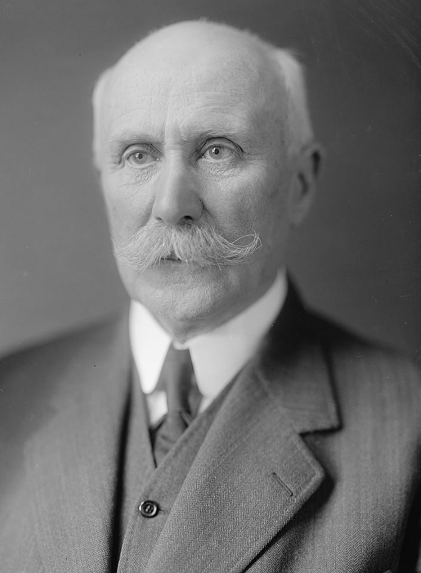
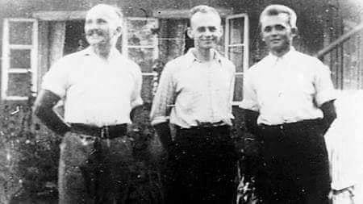
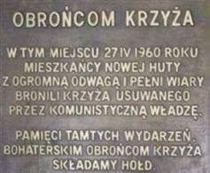
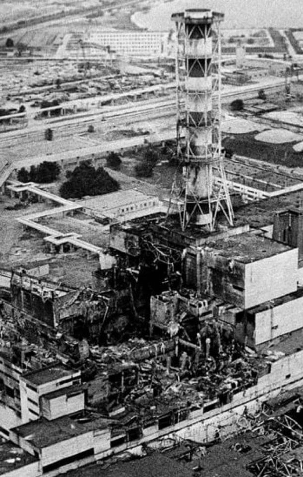
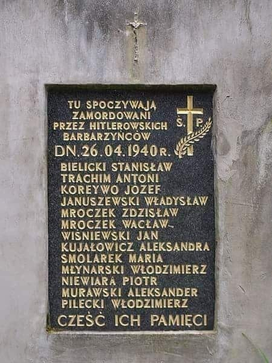
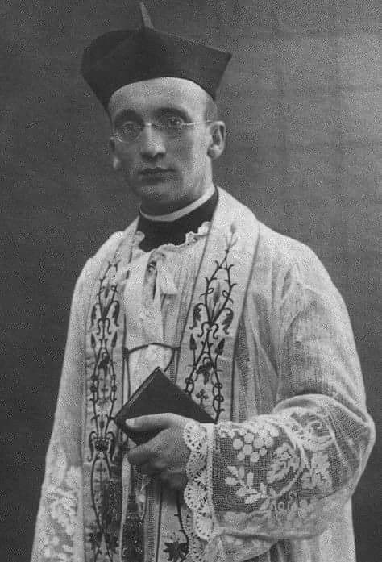
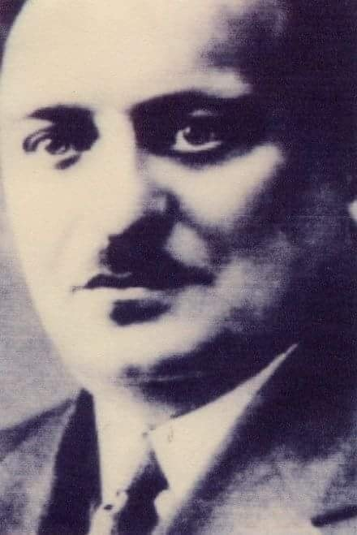
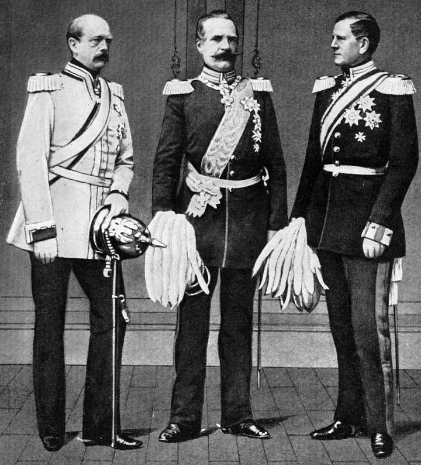

### 2020

Polski rząd persona non grata na obchodach 14 lipca. Prezydent Francji wycofał zaproszenie z okazji dnia Bastylii, ale najgorsze dopiero przed nami.

Narodzie kochany, czas wybrać: cywilizacja wschodu (Putin, Orban, Erdogan...) czy cywilizacja zachodu, o której niegdyś marzyliśmy i za którą nasi ojcowie przelewali krew?

Nadchodzi czas decyzji.

> Macrona rozsierdziło podpisanie przez Andrzeja Dudę ustawy kagańcowej, zaraz po zakończeniu wizyty francuskiego przywódcy. Teraz dochodzą nowe elementy. Francuska korespondentka niemieckiego dziennika Frankfurter Allgemeine Zeitung (FAZ), pisze na łamach gazety, że Francuzom nie podoba się zmiana w ostatniej chwili prawa wyborczego w Polsce i parcia za wszelką cenę do majowych wyborów. FAZ przypomina, że Francja nie zdecydowała się na przeprowadzenie drugiej tury wyborów samorządowych i przeniosła je na bliżej nieokreślony czas.

### 1945

Został aresztowany marszałek Philippe Pétain, szef kolaboracyjnego francuskiego rządu z Vichy.

Upadek Francji w czerwcu 1940 roku doprowadził do podziału terytorium kraju na dwie niezależne strefy. Północno-wschodnia część została podporządkowana Niemcom i do czasu wyzwolenia przez wojska alianckie w 1944 roku była formalnie okupowana. Na terenach południowo-zachodnich powstało natomiast marionetkowe, zależne od Niemców i kolaboracyjne państwo nazywane Republiką Vichy (od miasta, gdzie zlokalizowano siedzibę władz). Głową państwa został marsz. Philippe Petain, a jego zastępcą Pierre Laval. Status Republiki Vichy był mocno kontrowersyjny, zważywszy na jej uzależnienie od III Rzeszy. Niemcy zezwolili Francuzom na posiadanie nielicznej armii, pozostawienie marynarki wojennej i utrzymanie kontroli nad zamorskimi posiadłościami, w tym koloniami w Afryce Północnej. Z formalnego punktu widzenia państwo było kontynuacją istniejącej do czerwca 1940 roku III Republiki. Takiemu stanowi rzeczy sprzeciwiała się koalicja aliancka, dla której Vichy nie stanowiło reprezentacji narodu francuskiego. Jeszcze w czerwcu w Londynie został powołany Komitet Wolnej Francji, który grupował zwolenników niepodległości i niezależności od Niemiec, którzy przedostali się z okupowanej ojczyzny do Wielkiej Brytanii. 18 czerwca gen. Charles de Gaulle za pośrednictwem brytyjskiej stacji radiowej BBC wygłosił przemówienie do narodu, zapowiadając kontynuację walki. Wolni Francuzi zostali uznani przez Brytyjczyków, a następnie przez ich sojuszników, w tym emigracyjne rządy państw okupowanych przez III Rzeszę. Władze Republiki Vichy zaocznie skazały de Gaulle'a na karę śmierci.

Funkcjonowanie Vichy było połączeniem polityki racjonalizmu, pragmatyzmu, ale i kolaboracji z Niemcami. W opinii Petaina i Lavala posłuszeństwo zapewniało względny spokój i niezależność Francji. Była to oczywista fikcja wobec okupacji 2/3 przedwojennego terytorium państwa w Europie oraz wpływu Niemiec na politykę wewnętrzną Vichy. Uwidoczniło się to szczególnie w prześladowaniach ludności żydowskiej oraz walce z niepodległościowym ruchem oporu Resistance. Mimo niemieckich prób przejęcia kontroli nad potężną marynarką wojenną Vichy, okręty francuskie stacjonowały w portach w Tulonie, Mers el-Kebir i Dakarze kontrolowane przez adm. Francoise Darlana. Po lądowaniu oddziałów brytyjsko-amerykańskich w Afryce Północnej w listopadzie 1942 roku siły Vichy przeszły na stronę aliantów, a terytorium Republiki w Europie zostało zajęte przez wojska niemieckie. By nie pozwolić na przejęcie okrętów przez Niemców, Francuzi dokonali wówczas samozatopienia floty zgromadzonej w Tulonie. Francja została wyzwolona w 1944 i 1945 roku przez wkraczających na jej przedwojenne terytorium żołnierzy sił sprzymierzonych. Dotychczasowe kolaboracyjne władze zostały po wojnie osądzone w pokazowym procesie. Na śmierć skazano m.in. Lavala.

Stosunki Vichy z aliantami dalekie były od przyjacielskich. Brytyjskie poparcie dla de Gaulle'a było tylko jednym z elementów sporu. W lipcu 1940 roku Brytyjczycy przejęli siłą francuskie okręty stacjonujące w portach Royal Navy. Dokonali także nieudanej próby zajęcia floty zgromadzonej w Mers el-Kebir, gdzie doszło do wymiany ognia między okrętami obu państw. W konsekwencji zatopiony został pancernik ,,Bretagne", na którym zginęło blisko 1000 ludzi. We wrześniu 1940 roku siły de Gaulle'a próbowały opanować Dakar. Operacja nie przyniosła skutków, doprowadzając do wzrostu napięcia brytyjsko-francuskiego. Mimo nadszarpnięcia wizerunku de Gaulle'a jako przedstawiciela narodu francuskiego, Komitet Wolnej Francji kontynuował działalność. 24 września 1941 roku de Gaulle powołał rząd emigracyjny. W czerwcu 1943 roku w Algierze proklamował powstanie Francuskiego Komitetu Wyzwolenia Narodowego. Przyczyniło się to do konfliktu między de Gaulle'em i adm. Darlanem, który uzurpował sobie prawo do reprezentacji francuskich kolonii jako dowódca floty wiernej Vichy. W czerwcu 1944 roku, już w wyzwalanej przez aliantów Francji, powstał Rząd Tymczasowy Republiki Francuskiej. Na jego czele stanął de Gaulle, który po wojnie odpowiadał za odbudowę francuskiej państwowości.

  

### 1943

Z niemieckiego obozu Auschwitz uciekł rotmistrz Witold Pilecki. Pilecki do obozu trafił dobrowolnie, aby dowiedzieć się o nim jak najwięcej i zorganizować konspirację.

Witold Pilecki, obawiając się dekonspiracji, a także pragnąc, jako naoczny świadek przekazać prawdę o KL Auschwitz, zbiegł z obozu w nocy z 26 na 27 kwietnia 1943 roku. Uciekał wraz z Janem Redzejem (nr 5430) i Edmundem Ciesielskim (nr 12969).
Pilecki rozpoczął tworzenie obozowego ruchu oporu w Auschwitz, który nazwano Związek Organizacji Wojskowej. Jego raporty, przy pomocy Komendy Głównej ZWZ-AK trafiały do aliantów na Zachód. Były to jedne z pierwszych relacji "bezpośredniego świadka", które szczegółowo opisywały przemysłowe okrucieństwo i zezwierzęcenie Niemców. W śmiałych planach Pileckiego było także wywołanie w obozie powstania, a ten zbrojny akt buntu wobec oprawców miał być wsparty z zewnątrz działaniami partyzantów. Tych śmiałych planów jednak KG ZWZ-AK nigdy nie wprowadziła w życie. Pilecki zdecydował się na ucieczkę z Auschwitz pod wpływem coraz liczniejszych aresztowań wśród członków obozowego ruchu oporu. Choć Niemcy nigdy nie wpadli na jego trop, ryzyko wsypy był bardzo duże. Uciekając we trzech podczas nocnej zmiany z oświęcimskiej piekarni, która znajdowała się poza drutami obozu, szli wzdłuż torów kolejowych, doszli do Soły oraz do Wisły. Znaleźli tam łódkę i przepłynęli nią. Poznali księdza i dostali od niego posiłek, a także przewodnika. Dotarli do Bochni przez Tyniec, okolice Wieliczki i Puszczę Niepołomicką. Tam też się ukrywali u rodziny Oborów. Gdy ruszyli dalej, dostali się do Nowego Wiśnicza i tam też Witold znalazł Tomasza Serafińskiego, który to skontaktował go z oddziałami Armii Krajowej. Przedstawił im wtedy projekt ataku na obóz. Plan ten jednak nie został zaakceptowany, ponieważ uznano go za nierealny, gdyż samych SS- manów było około siedem tysięcy. 11 listopada 1943 roku Pileckiego awansowano go na rotmistrza.

  

### 1960

W Nowej Hucie doszło do
starć w obronie krzyża. 19 lat później,
podczas swojej I pielgrzymki do Ojczyzny,
papież odprawiając mszę św. w Mogile,
nawiązał do wydarzeń związanych z budową
kościoła w Nowej Hucie w latach 60.
Walka z Kościołem.
Nowa Huta miała być sztandarowym
projektem budownictwa socjalistycznego. Było to pierwsze w historii Polski „miasto bez
Boga", zbudowane rozmyślnie bez kościoła. W tym miejscu, pomyślanym jako robotnicza
przeciwwaga dla inteligenckiego Krakowa,
wychować miano „nowego człowieka" - homo
sovieticus.

  

### 1986

Doszło do katastrofy w elektrowni atomowej w Czarnobylu koło Prypeci na północy Ukrainy.

Czarnobyl był silnie dotknięty przez II wojnę światową, a w czasie istnienia Związku Radzieckiego pełnił funkcję warsztatu specjalizującego się w naprawach statków położonym na rzece Prypeć. Ze względu na niską populację i łatwy dostęp do wody tereny te zostały wybrane przez Ministerstwo Energii ZSRR na budowę elektrowni, 20 km od Czarnobyla. Budowę czarnobylskiej elektrowni jądrowej im. W.I. Lenina rozpoczęto w 1970 roku. Jednocześnie, w pobliżu wzniesione zostało nowe miasto, Prypeć tzw. miasto satelit, a po uruchomieniu pierwszego reaktora w 1977 roku miasto zostało zaludnione przez 14 000 mieszkańców. Przez swoje dobre połączenia komunikacyje - autobusy, pociągi, a nawet statki - Czarnobyl stał się regionalnym centrum o wielkich perspektywach. Plany Sowietów dotyczących elektrowni w Czarnobylu były rozległe - miała stać się największą elektrownią jądrową na świecie z 12 reaktorami, z których każdy miał mieć moc 1000 MW. 4 reaktory już pracowały, a kolejne 2 były w budowie, kiedy to diametralnie zmieniły się okoliczności.

Katastrofa elektrowni jądrowej w Czarnobylu miała miejsce 26 kwietnia 1986 r. Była to największa katastrofa w historii energetyki jądrowej. Wybuch nastąpił w reaktorze jądrowym bloku energetycznego nr 4, położonym tylko 120 km od stolicy Ukrainy – Kijowa, blisko granicy z Białorusią.

Elektrownia w Czarnobylu była w tamtych czsach jedną z największych na świecie. Poświęcona była strategicznemu programowi wojskowemu dla armii radzieckiej. Awaria spowodowana była zbieżnością kilku czynników. Poza faktem, że reaktor nie posiadał zaktualizowanego systemu bezpieczeństwa, miał niski poziom automatyzacji. W nocy z 26 na 27 kwietnia nieprawidłowo przeprowadzony test bezpieczeństwa doprowadził do przegrzania i częściowego stopienia rdzenia reaktora numer 4, rozkładu chłodzącej go wody i wybuchu powstałego wodoru. Zapaliły się grafitowe elementy, a obudowa reaktora została rozerwana, do atmosfery trafił radioaktywny pył.

O godzinie 1:24 czasu lokalnego, 40-60 sekund po rozpoczęciu eksperymentu, miały miejsce dwie duże eksplozje. Według niektórych badaczy eksplozja była nieunikniona, ponieważ wyciągnięcie głównego pręta kontrolnego ponad maksymalne dozwolone położenie spowodowało wzrost mocy reaktora o ponad 6000 razy w ciągu kilka milisekund. Zanotowano, że systemy bezpieczeństwa były wyłączone lub nawet nie działały w momencie wybuchu, a kombinacja pary wodnej i wodoru wysadziła w powietrze 1200 ton obudowy reaktora i zniszczyła dach. Po kilku sekundach nastąpił drugi wybuch. Według kilku niezależnych badań, podczas gdy pierwsza eksplozja była normalna - chemiczna, druga eksplozja  miała charakter wybuchu jądrowego z siłą 0,3 kilotonów (czyli około 300 ton trotylu). Według świadków, po pierwszym wybuchu widoczny był czerwony płomień, a drugiej eksplozji towarzyszył jasnoniebieski płomień, po której utworzyła się chmura promieniotwórcza nad reaktorem.

Katastrofa atomowa była zbiegiem okoliczności, a eksperyment  powinien zostać przeprowadzony przez inną zmianę, która była do tego specjalnie wyszkolona.  Zostało to jednak przesunięte o dziewięć godzin z powodu nadchodzących uroczystości 1 maja i energii elektrycznej potrzebnej do realizacji planu produkcji. Opóźnienie oznaczało, że eksperyment musiał być przeprowadzony przez inną zmianę. Dzienna zmiana, zaznajomiona z procedurami, dawno już zakończyła pracę. Zmiana popołudniowa szykowała się do odejścia, a nocna, która rozpoczynała pracę o północy, miała przejąć kontrolę reaktora już w trakcie eksperymentu. Zespół ekspertów również odczuwał zmęczenie bezczynnym oczekiwaniem od rana. Zaraz po wypadku pozostałe reaktory zostały odcięte, a elektrownią zarządzano ze sztabu zarządzania kryzysowego, umieszczonego w bunkrze pod budynkiem administracyjnym elektrowni.

Radioaktywny pył zaczął się rozprzestrzeniać do atmosfery ze zniszczonego i palącego się czwartego reaktora elektrowni, które zanieczyściło zarówno środowisko bliższe jak i dalsze. Pierwszym krokiem w likwidowaniu skutków awarii jądrowej w Czarnobylu było ugaszenie pożaru w hali głównej reaktora i dachu maszynowni. Jako pierwsi po wybuchu pożaru przybyły zastępy zakładowej straży pożarnej, wraz ze strażakami z Czarnobyla i Prypeci, którzy ugasili ogień w ciągu trzech godzin od eksplozji lecz w sercu reaktora wciąż płonął grafit...

Strażacy nie zostali poinformowani o niebezpieczeństwie kontaktu z radioaktywnym dymem i odpadami. Możliwe jest też, że w ogóle nie zdawali sobie sprawy, że wypadek to coś więcej niż zwykły pożar instalacji elektrycznych zatem polewali pozostałości reaktora wodą. To pogorszyło sytuację i nastąpiło kilka mniejszych eksplozji wraz z poważnym skażeniem radioaktywnym. Aby zapobiec dalszemu rozprzestrzenianiu się promieniowania do środowiska zrzucono ze śmigłowców kilka tysięcy ton piasku, boru, dolomitu, gliny i ołowiu. Te luźne materiały ugasiły płonący grafit i pochłonęły rozproszone w powietrzu substancje promieniotwórcze. Dwa tygodnie po awarii, organy rządowe ZSRR postanowiły zabezpieczyć cały rozwalony blok elektrowni specjalnym sarkofagiem – betonowym zabezpieczeniem z własnym systemem chłodzenia.

Eksplozja w Czarnobylu spowodowała wyrzucenie w powietrze substancji promieniotwórczych o 1,5 kilometra. Na tej wysokości wiatr od południowego wschodu przesunął radioaktywną chmurę aż do Skandynawii. Chmura przeleciała nad Skandynawią, po czym ponownie wróciła na Ukrainę. W połowie dnia kierunek wiatru zmienił się na zachodni. Druga skażona chmura przeleciała przez Polskę do Czechosłowacji i dalej do Austrii. Tam odbiła się od Alp i przyleciała z powrotem do Polski.  O ile nam dzisiaj wiadomo, nie ma miejsca na świecie, w którym chmury radioaktywne nie były obecne.

Najbardziej dotkniętymi obszarami była Ukraina i Białoruś, które zdecydowały się na ewakuację niektórych części swoich krajów na stałe z powodu skażenia środowiska. W procesie skażenia dużą rolę odgrywały chmury radioaktywnego izotopu jodu. Ten element ma krótki okres połowicznego rozpadu i stosunkowo szybko po awarii naturalnie uległ rozkładowi do nieszkodliwych elementów. W dzisiejszych czasach  zanieczyszczenie radioaktywne składa się głównie z substancji takich jak stront i cez – a to dlatego, że ich czas tzw. połowicznego rozpadu (czas, gdy ilość pierwiastka zmniejsza się o połowę) wynosi 30,2 lat. Związki te zanieczyszczały środowisko przez następne kilka dekad. Izotopy plutonu i ameryku będą obecne na sąsiadujących terenach elektrowni jeszcze przez kilka tysięcy lat, jednak ich promieniowanie ma znikomy wpływ na ludzkie ciało.

Śledztwo w sprawie katastrofy w Czarnobylu zostało oficjalnie zakończone, z wynikiem, że to personel elektrowni nie przestrzegał odpowiednich przepisów bezpieczeństwa. Dyrektor elektrowni Wiktor Briuchanow i naczelny inżynier Nikołaj Fomin zostali skazani na 10 lat pozbawienia wolności, zastępca naczelnego inżyniera ds. bloków III i IV Anatolij Diatłow na 5 lat, kierownik drugiego działu reaktorowego A. Kowalenko i kierownik zmiany B. Rogożkin na 3 lata i inspektor Państwowego Dozoru Jądrowego J. Łauszkin na 2 lata. Początkowo zakładano że proces odbędzie się w Moskwie ale dla dodania większej dramaturgii całego procesu jak i jego rozgłosy postanowiono że proces odbędzie się w Czarnobylu. Katastrofa elektrowni jądrowej zapoczątkowała zmiany w zasadach bezpieczeństwa energetyki jądrowej oraz zapisała nowy rozdział w historii ludzkości.

  

### 1940

W lesie w okolicach wsi Szawjcaria (obenie dzielnica Suwałk ) Niemcy rozstrzelali 13 członków Tymczasowej Rady Ziemi Suwalskiej-pierwszej na Suwalszczyźnie organizacji konspiracyjnej.
Zamordowani zamierzali przeprowadzić zamach na niemieckie kino Filmia przy ulicy Kościuszki 82. Plany te nie powiodły się na skutek denuncjacji jednego z członków grupy, Zygmunta Majchrzaka, byłego podoficera Korpus Ochrony Pogranicza i współpracownika
Abwehry. 16 listopada 1939 roku wszyscy konspiratorzy zostali aresztowani. 10 kwietnia 1940 roku gestapowski sąd doraźny skazał wszystkich na śmierć przez rozstrzelanie.
Na zdjęciu tablica pamiątkowa znajdująca się na zbiorowej mogile, w której pochowano suwalskich konspiratorów.

  

---

W KL Sachsenhausen zamordowany został ksiądz Stanisław Kubista (zdjęcie) wykładowca gimnazjalny, redaktor pisma "Posłaniec Józefa Świętego", współorganizator Muzeum Etnograficznego eksponatów z Chin, Brazylii i Nowej Gwinei, błogosławiony Kościoła Katolickiego.
Pochodził z Kostuchnej w województwie śląskim. W czasie pierwszej wojny światowej uczestniczył w walkach na Froncie Francuskim. Święcenia kapłańskie otrzymał w roku 1927. Do niemieckiego aresztu trafił już na początku drugiej wojny światowej w wyniku aresztowania przez Gestapo w dniu 27 października 1939 roku. W lutym 1940 roku przetransportowany został do obozu przejściowego Zivilgefangenenlager Neufahrwasser w okolicach Stutthofu. 9 kwietnia 1940 roku znalazł się w Sachsenhausen, gdzie otrzymał numer obozowy 21154. Beatyfikowany przez papieża Jana Pawła II w Warszawie 13 czerwca 1999 w grupie 108 polskich męczenników.
Miał 43 lata.

  

---

W Katyniu zamordowany został Karol Stanisław Szymański (zdjęcie) doktor medycyny, psychiatra, podporucznik Wojska Polskiego, lekarz 26. Pułku Piechoty, w roku 1932 odznaczony Krzyżem Kawalerskim Orderu Polonia Restituta za wybitne zasługi oddane medycynie polskiej.
W czasie wojny obronnej we wrześniu 1939 roku służył w szpitalu w Łodzi, a następnie w Lublinie. Do sowieckiej niewoli trafił prawdopodobnie w październiku tego samego roku. Został osadzony w obozie w Kozielsku, a następnie w Katyniu, gdzie zamordowano go od razu po przywiezieniu. Miał 45 lat.

  

---

### 1915

https://pl.wikipedia.org/wiki/Traktat_londy%C5%84ski_(1915)

---

### 1886

Z inicjatywy kanclerza Otto von Bismarcka powstała działająca w Wielkopolsce i na Pomorzu antypolska Komisja Kolonizacyjna.

Kanclerz Niemiec Otto von Bismarck powołał do życia Komisję Kolonizacyjną dla Prowincji Prus Zachodnich i Poznania, czyli de facto dla całego zaboru pruskiego. Miała ona wykupywać z polskich rąk ziemię i osiedlać na niej niemieckie rodziny przesiedlane z głębi Rzeszy. Komisja była jednym z najważniejszych elementów polityki germanizacyjnej, ale na początku istnienia miała wielkie trudności z wypełnianiem swej misji - Niemcy niechętnie przesiedlali się do Wielkopolski, a Polacy robili wszystko, żeby torpedować działalność komisji. W ciągu 30 lat zdołała wykupić ledwie 8 proc. majątków i przesiedlić około 12 tys. niemieckich rodzin. W 1918 r. ludność polska w Wielkopolsce i na Pomorzu nadal stanowiła zdecydowaną większość.

  

---

<a href="https://github.com/TomaszWaszczyk/historia.waszczyk.com/edit/master/src/content/april-26.md" target="_blank">Edytuj tę stronę dzieląc się własnymi notatkami!</a>
