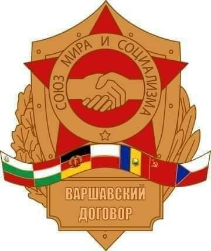
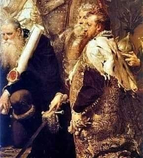

### 1940

Heinrich Himmler wydał oberfuhrerowi Richardowi Gluecksowi rozkaz utworzenia w Oświęcimiu obozu koncentracyjnego.
Przez cały okres istnienia obozu w Auschwitz przewinęło się przez niego ok. 8100–8200 esesmanów oraz ok. 200 nadzorczyń SS. Liczba personelu zmieniała się w czasie i rosła wraz z rozbudową obozu. Część osób pełniła w
nim stałą służbę do końca funkcjonowania
obozu jednak wiele osób tylko przez pewien
czas, po którym odsyłano je do innych
podobnych niemieckich obozów
koncentracyjnych istniejących na terenie
całej okupowanej Europy.

### 1985

W Warszawie podczas obrad przywódców państw Układu Warszawskiego miało miejsce podpisanie porozumienia w sprawie przedłużenia działania tego sojuszu do roku 2005.

  

### 1848

W Krakowie wybuchły antyaustriackie zamieszki, które zostały brutalnie stłumione przez wojsko.
Do rozpędzenia wzburzonych mieszkańców miasta użyto ciężkiej artylerii.
Podczas bombardowania zginęły 32 osoby.
Uroczysty pogrzeb ofiar, który odbył się dwa dni później przerodził się w wielką manifestację patriotyczną.

### 1796

W czasie III rozbioru Polski w Krakowie odbyła się uroczystość przejęcia przez Austriaków rządów w tym mieście.
Ówczesny prezydent Krakowa Filip Lichocki odczytał z tej okazji pod ratuszem specjalny dekret cesarski potwierdzający nadanie Austriakom uprawnień do zarządzania miastem.

### 1792

W Petersburgu została zawiązana Konfederacja Targowicka-porozumienie między polską magnaterią pragnącą obalenia ustaleń Konstytucji 3 maja, a carycą Katarzyną II.Właściwa nazwa tego układu to konfederacja koronna. Miano "targowickiej" zyskała ona od podobnego porozumienia zawartego 18 maja tego samego roku w Targowicy.

### 1584

W wieku 72 lat zmarł w Wilnie wielki hetman litewski i kanclerz Mikołaj Radziwiłł.
Zasłynął jako przeciwnik Unii Lubelskiej, ale również doskonały strateg i dowódca.27 kwietnia 1584 roku w wieku 72 lat zmarł w Wilnie wielki hetman litewski i kanclerz Mikołaj Radziwiłł.
Zasłynął jako przeciwnik Unii Lubelskiej, ale również doskonały strateg i dowódca. Czterokrotnie wojska przez niego dowodzone zwyciężały Rosjan.

  

---

<a href="https://github.com/TomaszWaszczyk/historia.waszczyk.com/edit/master/src/content/april-27.md" target="_blank">Edytuj tę stronę dzieląc się własnymi notatkami!</a>
