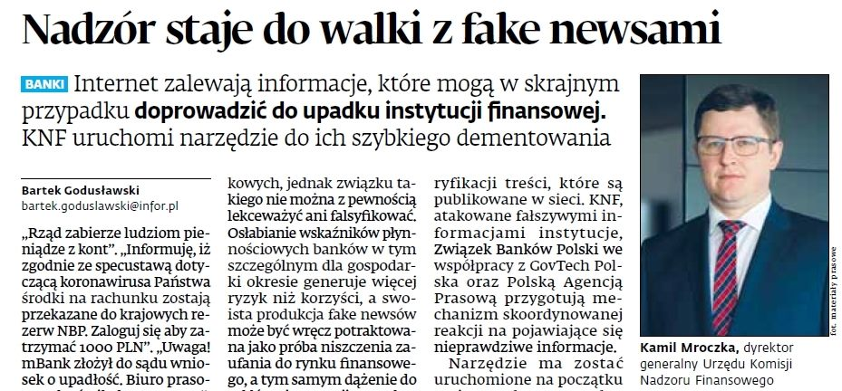

### 2020

  

#### Gold to Reach $3,000—50% Above Its Record, Bank of America Says

> Bank of America Corp. raised its 18-month gold-price target to $3,000 an ounce -- more than 50% above the existing price record -- in a report titled “The Fed can’t print gold.”

#### Germany's Labour Minister Hubertus Heil wants to bring in a ‘right to work from home’ law, which will apply long after the country’s coronavirus lockdown has ended

 Around 25 percent of Germans have been working from home during the lockdown, an increase from 12 percent before the strict measures to contain the spread of Covid-19 were put into place.

Now Heil wants to introduce a permanent right that would allow German employees to decide whether they'd like to work from home for part of the week, or full-time, if their job allows them to do so.

“I am working on a new law for a right to work from home, which I will present by autumn,” he said.  

"Anyone who wants to, and whose workplace allows it, should be able to work from home – even when the corona pandemic is over.

“You can either switch to working from home entirely, or you can decide to do so once or twice per week.”

Under the plan, workers who would prefer to continue to work from the office would be allowed to do so.

“We want to enable more working from home – but not to force them to do so," he said.

---

https://en.wikipedia.org/wiki/Yom_HaZikaron

---

### 1948

W okolicach Suchedniowa w województwie świętokrzyskim funkcjonariusze Wojewódzkiego Urzędu Bezpieczeństwa Publicznego w Kielcach i żołnierze Korpusu Bezpieczeństwa Wewnętrznego zorganizowali obławę na oddział Narodowych Sił Zbrojnych pod dowództwem Aleksandra Życińskiego "Wilczura" (zdjęcie). W wyniku działań bezpieki i KBW postrzelony został jeden partyzant, część uciekła do suchedniowskich lasów, zaś do niewoli trafili Życiński i jego partnerka Józefa Zep "Zośka" będąca w siódmym miesiącu ciąży.
31 lipca 1948 roku Życińskiego skazano na trzykrotną karę śmierci. W uzasadnieniu wyroku napisano, że "skazany został za za założenie i dowodzenie grupą bandytów mającą na celu dokonywanie zamachów na organa bezpieczeństwa publicznego zmierzające do zmiany przemocą ustroju Państwa Polskiego". "Zośka" została skazana na 7 lat więzienia za to, że " pomagała, przetrzymywała w swoim domu partyzantów i sama była członkiem grupy bandyckiej".
Komuniści pozwolili jednak młodym na spotkanie w dniu 5 września 1948 roku, kiedy wzięli ślub. Niespełna trzy tygodnie później, w lesie koło Zgórska wykonano na Życińskim wyrok śmierci przez rozstrzelanie. Miał 22 lata.

  

---

<a href="https://github.com/TomaszWaszczyk/historia.waszczyk.com/edit/master/src/content/april-28.md" target="_blank">Edytuj tę stronę dzieląc się własnymi notatkami!</a>
