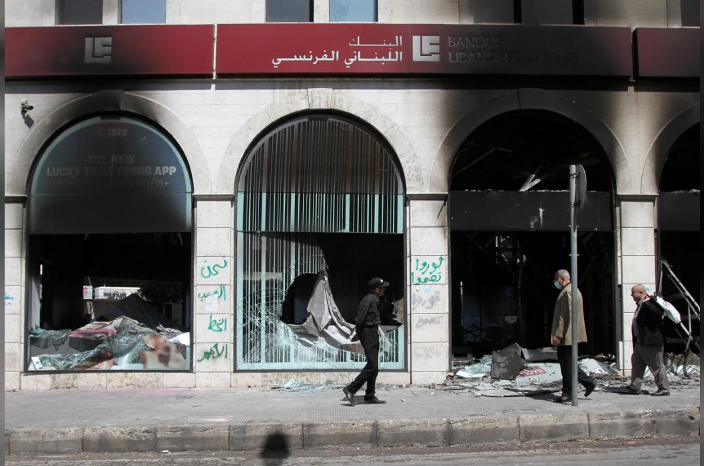
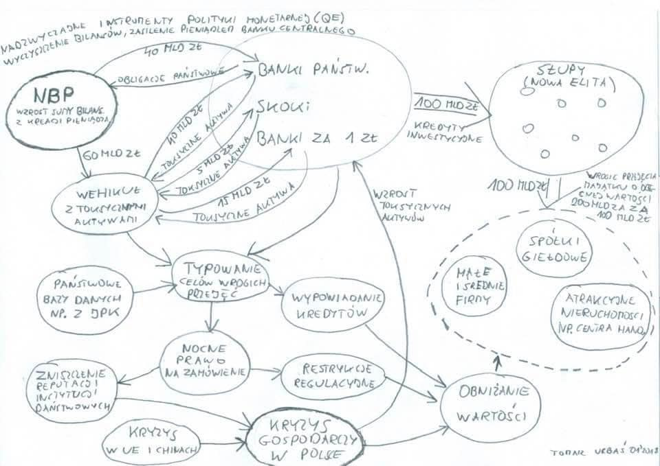
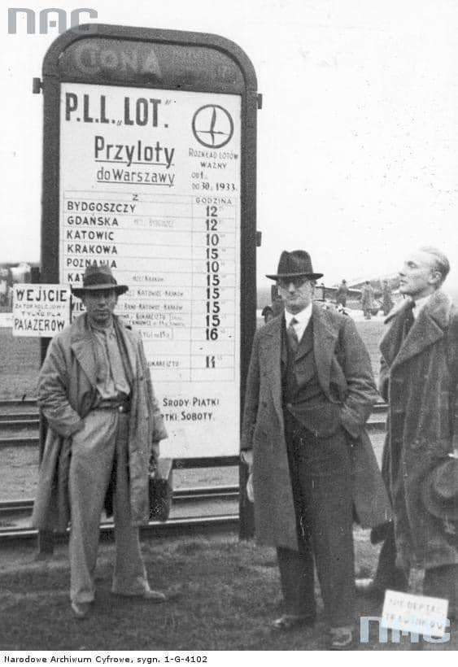
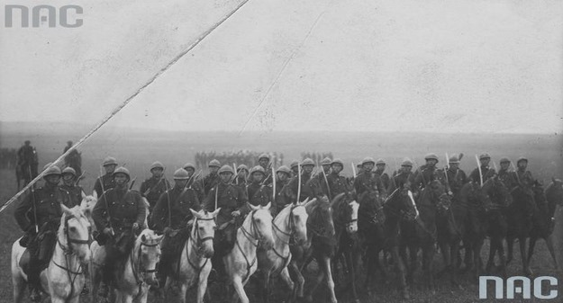
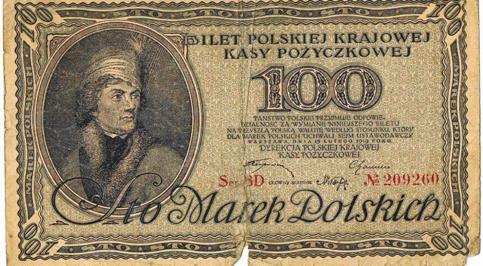
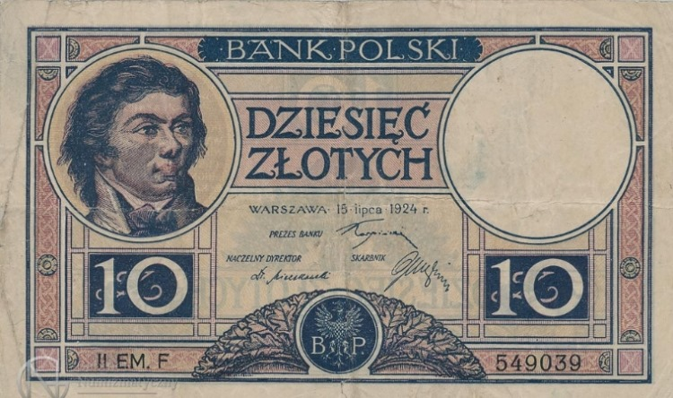

### 2020 - Bankowcy rozmawiają o powołaniu spółki skupującej złe kredyty, gdy kryzys nabierze ostrości. KNF wspiera inicjatywę, ale prywatną

Bankowcy rozmawiają o powołaniu spółki skupującej złe kredyty, gdy kryzys nabierze ostrości. KNF wspiera inicjatywę, ale prywatną, powstanie "bad bank".

Prywatyzacja zysków, nacjonalizacja strat, kiedy bank zarabia to są to jego zarobki. Kiedy bank traci, to są to wasze straty. Czego tutaj nie rozumiecie?

---

  

A collapse in the currency, soaring inflation and spiralling unemployment are convulsing Lebanon, which has been in deep financial crisis since October. A shutdown to fight the new coronavirus has made matters worse for the economy.

Overnight, protesters in Tripoli set several banks and an army vehicle on fire. Soldiers fired in the air and used tear gas and rubber bullets, a security source said. The man who died was in his 20s and it was not immediately clear who was responsible for his death, the source said.

Protesters returned on Tuesday, setting two banks on fire and smashing their facades, prompting the army to redeploy. Dozens of soldiers positioned themselves in a street lined with several banks, and some fired rubber bullets and tear gas.

---

Japonia dołącza do krajów ze skupem obligacji no-limit. Tu jednak warto dodać, że to nie jest wielka nowość i Japończycy są dodatkowo prekursorami skupowania np. ETF czy REITów:

"Warto dodać, że jeszcze długu przed kryzysem Japonia była jednym z największych, o ile nie największym eksperymentatorem monetarnym (np. poprzez wspomniane kupowanie jednostek funduszy ETF, grupujących akcje notowane na giełdzie w Tokio), zaś stopy procentowe w tym kraju należały i wciąż należą do najniższych na świecie.
W amerykańskich mediach nie brak opinii, że w czasie obecnego kryzysu, tak jak po upadku Lehman Brothers, świat zachodni może skorzystać z japońskich doświadczeń – ostatecznie znane z USA i Europy programy luzowania ilościowego (QE) wzorowane były na programie uruchomionym w Japonii już na przełomie wieków."

---

Miały być nowe elity? To proszę jak można temacik ogarnąć. Polityka to jedna wielka zorganizowana grupa przestępcza.

  

---

### 1933

Lotnisko na Polu Mokotowskim. Wiele lat później hasło "LOTem Bliżej" reklamowało polskie linie lotnicze. Chyba wtedy jeszcze niewielu klientów mogło to potwierdzić. Zdjęcie ze zbiorów NAC.

  

### 1924

Minister spraw wojskowych gen. Władysław Sikorski przemianował wszystkie instytucje, formacje i zakłady noszące w nazwie miano „jazda” na „kawaleria”, oraz rozkazał nanieść odpowiednie poprawki w rozkazach, rozporządzeniach, instrukcjach itp.

Konieczność wprowadzenia zmian w strukturach i nazewnictwie polskiej kawalerii zasygnalizował Generalny Inspektora Jazdy generał Tadeusza Rozwadowskiego. To na jego wniosek dotychczasowy termin "jazda" zastąpiony został pojęciem "kawaleria".

Do oficjalnego przemianowania wszystkich formacji i związków posiadających w nazwie słowo "jazda" na "kawalerię" doszło 29 kwietnia 1924 roku, kiedy to minister spraw wojskowych generał Władysław Sikorski rozkazał skorygować nazewnictwo we wszystkich rozkazach, rozporządzeniach i instrukcjach (Dziennik Rozkazów Ministra Spraw Wojskowych Nr 17 z 29 kwietnia 1924 roku).

Reorganizacji dotknęła również formacji kawalerii. Utworzono cztery dywizje i pięć samodzielnych brygad kawalerii oraz trzy nowe dywizjony artylerii konnej.

W efekcie zmian polska kawaleria stała się formacją jeszcze bardziej mobilną operacyjnie, co udowodniły przeprowadzone w sierpniu 1925 roku wielkie manewry na Wołyniu. Ich organizatorami byli generał Rozwadowski oraz szef Sztabu Generalnego Wojska Polskiego generał Stanisław Haller.

Obserwatorami ćwiczeń byli między innymi generał Henry Gouraud (Francja), generał Edmund Ironside (Wielka Brytania) oraz generał Jan Syrovy (Czechosłowacja). Wszyscy oni docenili jakość polskiej kawalerii.

  

---

Marka polska została zastąpiona złotym polskim jako obowiązującą walutą narodową.

28 kwietnia 1924 r. Bank Polski rozpoczął emisję nowej waluty – złotego polskiego, który zastąpił markę. Dla nowej waluty rozważano jednak inne nazwy: piast, pol i lech. Podjęta 96 lat temu przebudowa systemu walutowego była częścią reform premiera Władysława Grabskiego, ratujących Polskę przed katastrofą gospodarczą i polityczną.

Reforma walutowa i uzdrowienie skarbu były najważniejszymi zadaniami powołanego 19 grudnia 1923 r. pozaparlamentarnego gabinetu, na czele którego stanął Władysław Grabski. W chwili obejmowania przez niego urzędu premiera sytuacja gospodarcza w Polsce była wyjątkowo trudna.

Panująca hiperinflacja powodowała, że ceny rosły z dnia na dzień. Pod koniec września 1923 r. za 1 dolara trzeba było zapłacić 75,8 tys. marek polskich, a w połowie stycznia 1924 r. już 9,8 mln.

20 grudnia 1923 r. w wygłoszonym na posiedzeniu Sejmu i Senatu expose premier Grabski, pełniący jednocześnie funkcję ministra skarbu, wskazując najważniejsze zadania rządu stwierdził: "Dominujące znaczenie wśród nich mieć będzie zgodnie z sytuacją, w jakiej nasz kraj dziś się znajduje - naprawa skarbu. Doszliśmy bowiem do takiego stanu, że żaden postęp w żadnej dziedzinie, nawet szkolnictwa, nie mówiąc o reformie rolnej lub udoskonaleniach socjalnych, stają się niemożliwe, jeżeli najpierw - i to wkrótce - nie uporamy się z trudnościami finansowymi, które nie tylko paraliżują wszelkie porywy do udoskonalenia naszego stanu wewnętrznego, ale wytwarzają niebezpieczeństwo zarówno utrzymania pokoju wewnętrznego, jak i stanu obronności naszego kraju, wymagającej znaczniejszych nakładów pieniężnych".

11 stycznia 1924 r. Sejm przyjął "Ustawę o naprawie Skarbu Państwa i reformie walutowej". Zgodnie z nią rząd premiera Grabskiego otrzymał na sześć miesięcy specjalne pełnomocnictwa w zakresie spraw dotyczących zmiany ustawodawstwa podatkowego, wprowadzenia nowego systemu monetarnego i waluty, ogłoszenia statutu Banku Emisyjnego, sprzedaży przedsiębiorstw państwowych oraz zaciągania pożyczek do wysokości 500 milionów franków w złocie.

20 stycznia 1924 r. ukazało się "Rozporządzenie prezydenta Rzeczypospolitej w przedmiocie systemu monetarnego", w którym stwierdzano, że jednostką monetarną w Rzeczypospolitej Polskiej jest złoty. Dla nowej waluty rozważano także inne nazwy: piast, pol i lech.

1 lutego 1924 r. zaprzestano druku marek polskich na pokrycie deficytu skarbowego.

14 kwietnia 1924 r. Prezydent RP wydał rozporządzenie o zmianie ustroju pieniężnego. Ustalono w nim m.in. relację marki polskiej do nowej waluty - złotego: 1,8 mln marek polskich za 1 złotego. Następnego dnia odbyło się spotkanie założycielskie akcjonariuszy Banku Polskiego, na którym wybrano Radę Banku. Jej prezesem został Stanisław Karpiński.

28 kwietnia 1924 r. Bank Polski podjął emisję nowej waluty – złotego polskiego. Wartość nowej jednostki monetarnej - złotego - była równa frankowi szwajcarskiemu i odpowiadała wartości 9/31 grama czystego złota. Za dolara płacono 5 zł 18 gr.

Od 1 lipca 1924 r. marka przestała być prawnym środkiem płatniczym w Polsce. W ostatnim dniu działalności Polskiej Krajowej Kasy Pożyczkowej obieg jej biletów wynosił 570,7 trylionów marek. Wymieniono 543 tryliony marek, co równało się 301,7 mln złotych.

Po kilku miesiącach odczuwania pozytywnych skutków reformy walutowej w lipcu 1924 r. sytuacja ekonomiczna zaczęła się pogarszać. Negatywnie na stan polskiej gospodarki wpłynął dodatkowo nieurodzaj w 1924 r. oraz wojna celna z Niemcami, która wybuchła w połowie 1925 r.

W lipcu 1925 r. kurs złotego zachwiał się. 12 listopada tego roku Bank Polski SA odmówił dalszego wydatkowania walut dla jego podtrzymania. Następnego dnia premier Grabski, który nie zgadzał się z tą decyzją, podał się do dymisji.

Kurs złotego ostatecznie ustabilizował się w 1927 r., a złoty pozostał stabilną walutą do końca okresu międzywojennego.

"Reforma walutowa w 1924 r. była wielkim dziełem, które uratowało Polskę od nieuniknionej katastrofy nie tylko gospodarczej, lecz i politycznej i postawiło niewzruszone, zdrowe podstawy pod rozwój życia państwowego i ekonomicznego Polski" - pisał o dziele Władysława Grabskiego prof. Edward Taylor, ekspert w dziedzinie tematyki skarbowej.

  

  

### 711

Wojska wodza berberyjskiego Tarika ibn Zijada wylądowały na Gibraltarze, rozpoczynając muzułmański podbój Hiszpanii.

Tarik Ibn Zijad, Ṭāriq Ibn Ziyād, żył na przeł. VII i VIII w., berberski wódz wojsk muzułmańskich; jeden z dowódców w armii arabskiej dowodzonej przez Musę Ibn Nusajra, która podbiła Półwysep Iberyjski; na czele berberskich oddziałów przeprawił się 711 na Płw. Iberyjski (skałę Calpe, koło której wylądował, nazwano później Dżabal Tarik ‘góra Tarika’, czyli Gibraltar); stoczył zwycięskie bitwy z armią króla Wizygotów - Rodryga; do ok. 720 armia arabska podbiła Półwysep.

---

<a href="https://github.com/TomaszWaszczyk/historia.waszczyk.com/edit/master/src/content/april-29.md" target="_blank">Edytuj tę stronę dzieląc się własnymi notatkami!</a>
