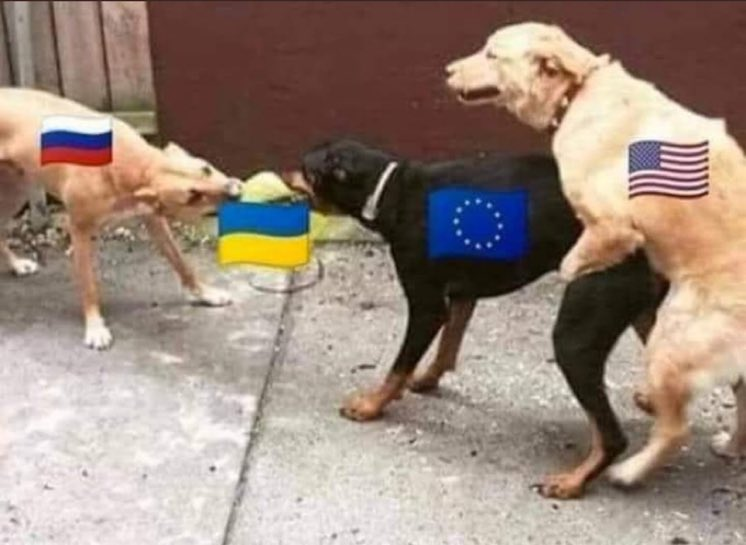
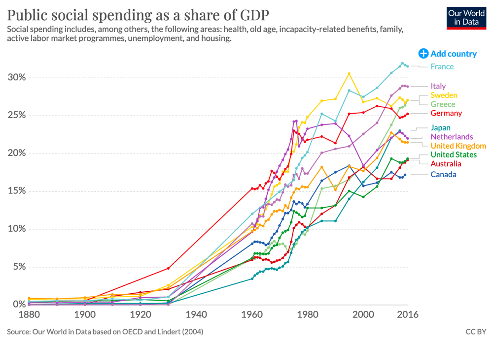
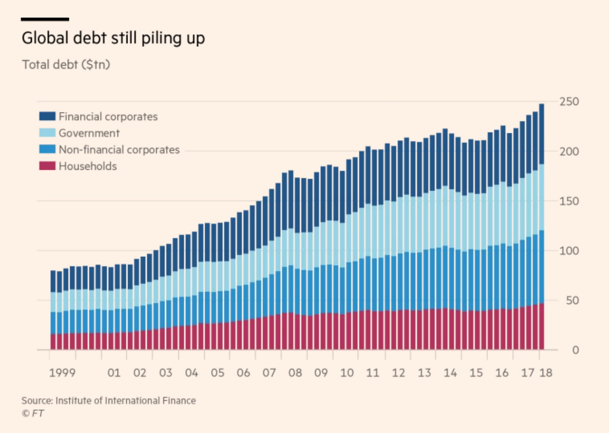
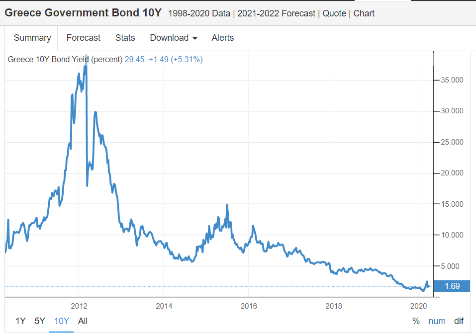
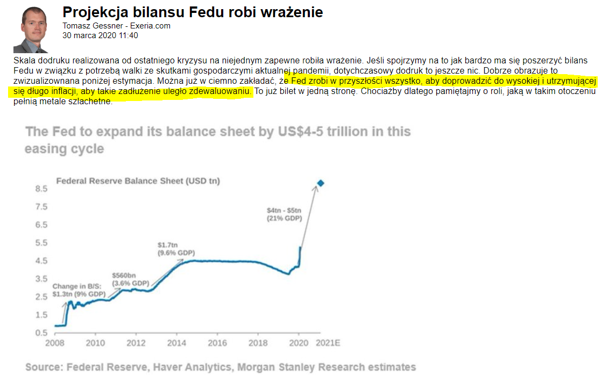
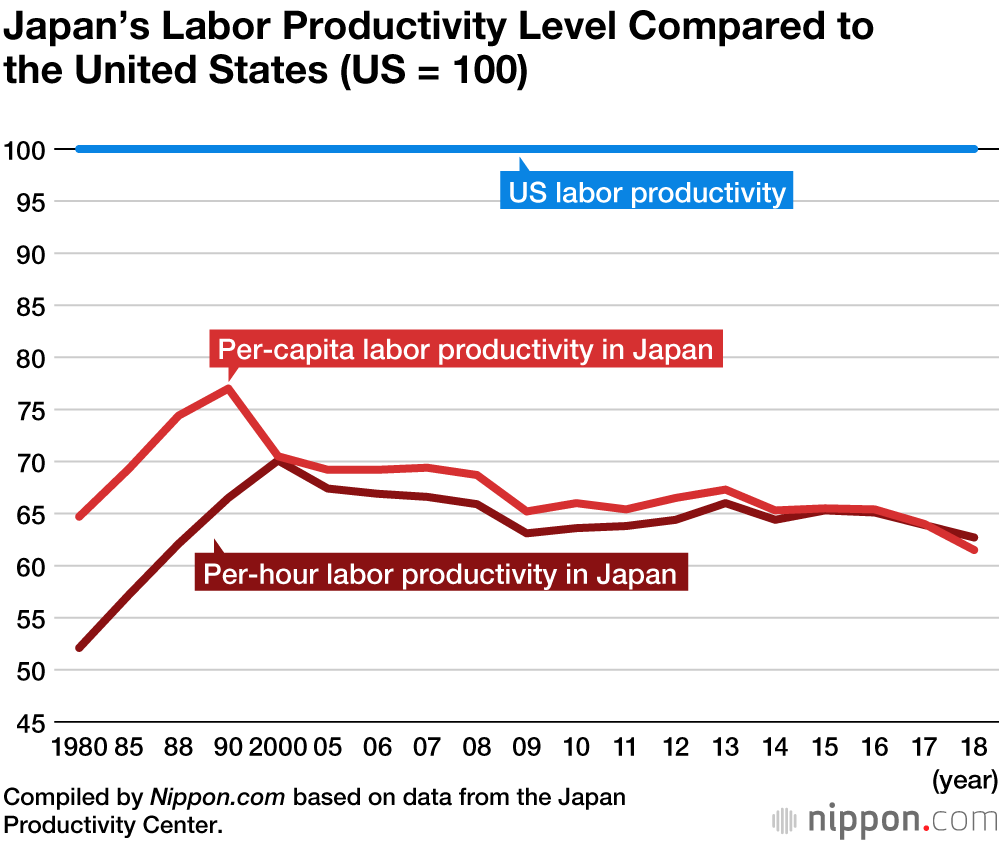
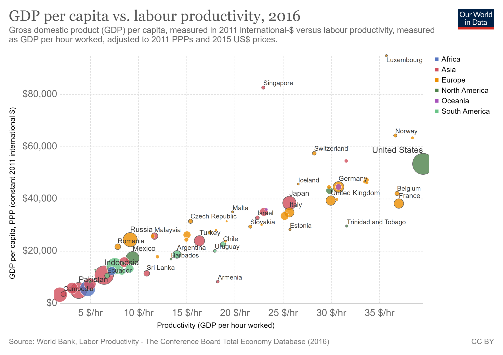
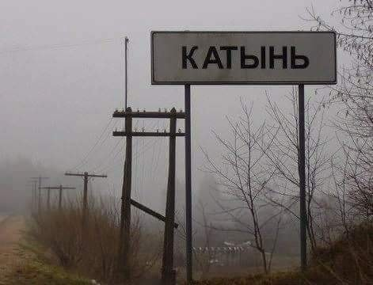
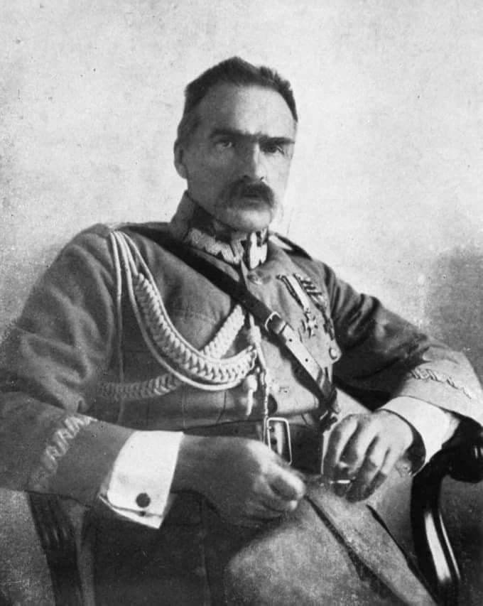

### 2022

Tak widzę najbliższe lata, ale nie wierzę w utrzywanie tego napięcia przez długie dekady:

Im będzie większy kryzys walutowy tym Rosja będzie się przesuwać na zachód.. a pies z prawej będzie wciskał coraz mocniej. Pytanie kto pęknie.

  

### 2020

---

Kryzys związany z epidemią koronawirusa sprawił, że CD Projekt został spółką o największej kapitalizacji w Polsce. Wartość producenta gier to 27,11 miliardów PLN, na drugim miejscu jest PKO BP

---

Interwencja rządów i banków centralnych z roku 2008 była niespotykana i bez precedensu i miała tyle samo krytyków, co zwolenników. Światowa odpowiedź na COVID-19 z 2020 r. to jest już atomowe uderzenie i tym razem słychać samych tego wielbicieli. Przypomnijmy, że banki centralne na świecie i w Polsce obniżyły stopy procentowe i zapowiedziały masowe skupy aktywów o rozmiarach ciężkich do wyobrażenia wychowankom klasycznej ekonomii. Beneficjanci skupu (politycy) mają zamiar zalać rynek pracy i firmy darmowym wsparciem – na początek 2x większym niż programy pomocowe po upadku Lehman Brothers. Kraje takie, jak Wielka Brytania, czy Francja wprowadziły gwarancje kredytowe dla firm na kredyty o wartości 15% PKB, starając się zapobiec niewypłacalności gospodarki. Nawet Niemcy – nasz ulubiony przykład nad Wisłą, których poprawność fiskalna i niezrozumiałe nadwyżki od lat były obiektem żartów, w końcu również odpalają fiskalnego Panzerfausta. Ich program opiewa na 20% PKB, pierwszy raz też od 2013 r. Niemcy wyemitują nowy dług, a federalny rząd dał gwarancje na kredyty na 30% gospodarki Niemiec. Wszystkie wydatki rządowe na świecie tylko w 2020 wyniosą 2% światowego PKB, ale w zarażonych krajach G10 to już będzie prawie 8%. Brzmi dobrze. Oznacza to jednak, że dotychczasowy wzrost gospodarczy - oparty na darmowym długu - reanimujemy i stymulujemy kolejnym jeszcze większym długiem. Do dziś każdy dodatkowy 1 procent wzrostu PKB kosztował nas dodatkowe 3 procenty długu więcej. Teraz zaś ta relacja rośnie do jeden do pięciu. Jeszcze niedawno przeciętnie wydatki publiczne stanowiły 38% PKB w krajach rozwiniętych, lecz po oczekiwanym spadku nominalnego PKB już za chwilę udział tych wydatków wzrośnie do co najmniej 40%, i.e. do najwyższego historycznego poziomu. Nie, nie żyjemy w epoce umacniania się kapitalizmu.

  

Innowacje banków centralnych i rządów będą miały różne konsekwencje. Przykładowo, politycy w przyszłości mogą chcieć dalej polegać na bankach centralnych, by te zaniżały rynkowe stopy procentowe i by skupowały dług, który sam się później spłaca (o czym za chwilę przy CPI) nawet podczas koniunktury i niskiego bezrobocia. Jeśli banki centralne obiecały finansować rządy podczas pandemii wirusa, to dlaczego nie miałyby finansować go pod każdym innym pretekstem? Zielona energia, transformacja węglowa? Piece of cake (sorry, musiałem).

Drugi raz z rzędu największe gospodarki i demokracje Zachodu jawnie wprowadzają permanentny stan dodruku pieniądza, 24/7 interwencjonizmu i teraz jeszcze wynaturzonego keynesizmu, o którym John Maynard na pewno nie śnił. To być może nie jest już kapitalizm – to być może jest wczesny etap rewolucji ekonomicznej, nowego systemu gospodarczego. Są kraje, gdzie ceną władzy dla komunistycznej jest gospodarka rynkowa dla ludzi. U nas, zażartować można, że to etatyzm, prywatyzacja zysków i nacjonalizacja strat są ceną demokracji. Przez kolejną dekadę albowiem banki centralne (nie okłamujmy się, że to się skończy) zobowiązały się wydrukować tyle pieniędzy, ile tylko to będzie konieczne. Taki FED obiecuje mniej więcej kupić po prostu wszystko to, co tylko rząd wyemituje. ECB w sumie podobnie. Nielimitowany popyt na dług państwa oznacza spadek jego ceny, czyli odsetek od obligacji rządowych - rząd pożycza taniej, niż pożyczałby na wolnym rynku od komercyjnych podmiotów. Sektor prywatny przy okazji również.

  

W eurozonie dalsze skupy zawężają spready pomiędzy krajami strefy i znowu słabsze kraje będą pożyczać taniej - a przecież dlatego mieliśmy w 2011 kryzys zadłużeniowy, bo od 1999 słabsze kraje PIIGS zadłużały się za bardzo, za tanio - bo wspólna waluta im na to po prostu pozwalała. I znowu sztuczne subsydiowanie długu spotęgują kolejne wspólne skupy aktywów, gdzie ECB pozbiera równo bundy, jak i włoskie albo greckie odrealnione papiery. ECB jako ostatni handluje nierynkowym greckim długiem i trzyma jego cenę tak nisko, że greckie rentowności spadły z 40% do praktycznie zera. A kapitalizm to swobodna gra popytu i podaży – jeśli cena pieniądza jest nierynkowa, to może znowu napędzamy kolejne systemowe kryzysy wtórne i eksponujemy strukturalne napięcia? Kryzys w Grecji? Jaki kryzys. Strefa euro trzyma się dlatego, bo jeden duży kraj na jej rozpad nie pozwala

  

Zostawmy nierynkowy dług, bo tymczasem CPI, czyli inflacja, jest już bardzo rynkowa. W Polsce bank centralny zaczął skupować rządowy dług, który kosztuje budżet 1 albo 2% rocznie. Tymczasem CPI w Polsce to prawie 5%, stąd z bardzo grubsza dług publiczny spada nam realnie po 3% rok do roku. Przecież dochody państwa, tj. podatki (głównie VAT) i progi podatkowe liczymy od nominalnych cen i nominalnych zarobków... Nie łudźmy się, że jakakolwiek pomoc jest darmowa, że ktoś coś nam daje. Wcześniej, czy później zapłacimy i może nawet zapłacimy podwójnie – poprzez dług publiczny i przez CPI.

  

Stało się nieszczęście, jak dzieje się co jakiś czas w historii świata. 75 lat bez porządnej wojny w Europie to kontynentalny rekord i chyba za bardzo przyzwyczailiśmy się do dobrego. W teorii zaś podczas spowolnienia/recesji firmy mogą/muszą bankrutować, ludzie tracą pracę niestety, rynek się oczyszcza z mniej efektywnych podmiotów i tak to następuje postęp. Przez ostatnie 500 lat to wojny i towarzyszące im kryzysy napędzały rozwój i nadawały tempo. Przykładów jest wiele. To wojna siedmioletnia z połowy XVIII wieku (tak naprawdę pierwsza światowa wojna) podwoiła angielski dług publiczny i zbudowała potęgę londyńskiej giełdy w City. Połowę tego długu i jedną trzecią akcji na giełdzie skupili wówczas Holendrzy i to nie przypadek, że Holandia, pierwsze kapitalistyczne imperium jeszcze z XVII wieku, była przy okazji potęgą morską podbijającą światowe kolonie i po chwili światowe finanse - kapitał przestał mieć narodowość, trzask-prask. Nieprzypadkowo pierwsza rewolucja przemysłowa miała miejsce dokładnie podczas wojen napoleońskich. Rządy Anglii, Belgii, Francji, czy Rosji aktywnie wspierały rozwój banków, kolei żelaznej czy maszyn parowych, nie wspominając o transformacji surowców i powstawaniu nowych szlaków komunikacyjnych, potrzebnych na wojny z Bonaparte. Późniejsze mocarstwo USA zrodziło się z dwóch wojen światowych oraz Lend-Lease, finansowego majstersztyku amerykańskiej administracji. Sławetne kryzysy naftowe lat 70. pozwoliły na wejście smoka japońskiej motoryzacji, downsizing i oszczędne silniki, a SAAB upowszechnił turbodoładowane jednostki silnikowe. Na oko tak to różne kryzysy z tych wszystkich krajów uczyniły potęgi - do dziś to najbardziej rozwinięte kraje świata.

W praktyce co roku nawet podczas koniunktury na świecie znika z rynku 8% firm i ok. 10% miejsc pracy. Teraz rządy mają nadzieję, że przepisy albo zakazy zatrzymają wolny rynek podczas recesji stulecia. W tym celu po latach prosperity administracje przekazują ogromne kwoty firmom, zapewnią dotacje, tani kredyt, by zachować miejsca pracy i zapobiec bankructwom – jak wiadomo przecież płynność traci się tylko raz. Niektóre rządy będą nawet płacić wynagrodzenia za pracodawców (UK, PL). W USA ta pomoc obejmie pożyczki dla małych firm, które - już dziś się mówi – i tak zostaną w przyszłości umorzone. Do tego każdy Amerykanin dostanie za darmo coronavirus check na $ 1200. W Polsce oprócz dopłat do wynagrodzeń i postojowego dla zleceniobiorców i samozatrudnionych oraz zwolnienia z ZUS, pakiet antykryzysowy zawiera wiele udogodnień podatkowych w zakresie PIT, CIT, VAT, innych podatków oraz w procedurach podatkowych. Skupiając się już tylko na Polsce, to chyba nikt z pracodawców nie jest z tej tarczy zadowolony – mówi się za mało, za wolno, za oszczędnie. To jaka kwota będzie zadowalająca? Jest 200, to czy 300 mld będzie już ok? Może 500 mld? Od 1989 uzbieraliśmy 1 bln długu, to gdzie jest granica bólu zatem? Ten festiwal tarczowych roszczeń czasami przybiera karykaturalne kształty i rozmiary, kiedy poważni ludzie żądają całkowitego zwolnienia z ZUS, zwolnienia z opodatkowania, albo zawieszenia kodeksu pracy. Zapamiętałem, kiedy jedna organizacja żądała ślepo kolejnych ulg dla siebie, jednocześnie protestując przeciwko innym ulgom dla konsumentów. Postulaty braku odprowadzania PIT, CIT, czy ZUS powinny rachunkowo również zawierać postulaty braku wypłacania emerytur, rent, czy bankructw samorządów i zaprzestania wypłacania wynagrodzeń służbie zdrowia. Aby być uczciwym do kwadratu, to warto może przemyśleć na nowo umowę społeczną, że w czasie dobrobytu podatki będą wyższe (np. tyle co w Niemczech CIT c. 30%), w zamian za co sektor prywatny kupuje od państwa (czyli podatników) polisę ubezpieczeniową na wypadek kolejnego wirusa. No dobra, żartowałem. Ale na dziś to cała Polska chce za darmo dostać opcje put na poziomie „żeby było tak jak było”, ani kroku w tył. Podczas ożywienia było za dużo państwa i za wysokie podatki, a podczas recesji tego państwa jest za mało, a podatki trzeba znieść – no kaman. Nie da się wszystkiego finansować przez niekontrolowaną emisję długu – bo do tego zaczęły sprowadzać się postulaty dotychczasowych ortodoksyjnych wyznawców wolnego rynku. Dwucyfrowe wzrosty zadłużenia do PKB i drukowanie pieniądza to są wydarzenia bez precedensu, tymczasem oczekiwania są dwa razy większe. Zapomnieliśmy, że pomimo częściowego udomowienia polskiego długu, dalej prawie 300 mld złotych długu państwa denominowane w walutach obcych, ok. 130 mld długu przedsiębiorstw jest denominowane w walutach obcych, a legendarne walutowe kredyty hipoteczne to jeszcze jakieś 120 mld złotych do spłaty. Razem 550 mld zł, mniej więcej ¼ PKB Polski. Nadmierna monetyzacja, nadmierne skokowe zadłużenie to zaproszenie dla zagranicznych spekulantów do wypłukania rezerw walutowych NBP i załamania złotego, co przewróciłoby szybciutko polski sektor bankowy i wskaźniki krajowego zadłużenia. Jeżeli Bank of England potrafił rzucić ręcznik, to NBP również nie jest nieśmiertelny. Tak, wciąż nasz rynek zależy w dużej mierze od zagranicy. Krótkowzroczność i plasterek na kilka miesięcy później będzie palił przez lata. Zmniejszenie składki i ogranie OFE z połowy aktywów zniszczyło GPW na lata - nikt pewnie wtedy nie myślał o wieloletnich konsekwencjach dla oszczędności 16 mln Polaków.

Każdy dług trzeba spłacić, rządy też będą musiały go spłacić – spłacą go z naszych podatków albo spłacą je nasze dzieci, bo dziś nie umiemy skonfrontować się godnie z końcem rozbuchanej konsumpcji na kredyt. Wściekła i paniczna reakcja rynków, banków centralnych, rządów to dla wielu nie tyle reakcja na samego wirusa, co reakcja na igłę, która przebiła przepompowany wiele za wiele razy balon. Wszyscy wiedzą, że balon taki jest, jak każdy widzi, ale przyzwyczajenie do dobrobytu znowu nakazuje po nas choćby potop… Nazwijmy może rzeczy po imieniu, bo od miesiąca przestaliśmy: oczekiwania bail-outu całej światowej prywatnej gospodarki przez państwa kosztem długu finansowanego przez drukarnie to "socjalistyczna gospodarka rynkowa". Socjalistyczna dla firm, ale rynkowa dla pracowników, bo już 3 tygodnie przestroju gospodarki wymazało najwyraźniej 5 lat prosperity, patrząc na masowe redukcje zatrudnienia. Postulaty, że czym mniej państwa w gospodarce, tym dla gospodarki lepiej chyba też już nie obowiązują, bo teraz to państwo daje pieniądze, a nie je zabiera. Umilkły głosy, że państwo nie ma swoich pieniędzy, że dochody czerpie albo z bieżących danin, albo z zadłużania przyszłych pokoleń. Mniej też ostatnio nowatorskich analiz i sondaży, wzmacniających wiedzę ekonomiczną Polaków na temat, skąd się biorą pieniądze na 500+ albo wynagrodzenie minimalne. Pojawiają za to się głosy, że całe pokolenie Japończyków jakoś zestarzało się ładnie po pęknięciu bańki z lat 80., gdzie od 30 lat obserwujemy rachityczne wzrosty przeplatane krótkimi recesjami, niekończącą się walkę z deflacją, najstarsze społeczeństwo na świecie i największy dług publiczny na świecie. Tyle, że tzw. stracone dekady Japonii ekonomiści tłumaczą po latach ratowaniem przez państwo nieefektywnych zombie banków, błędną uprzednio polityką pieniężną oraz tanim długiem. U mnie coś klika 🎵 Być może będziemy mieć w końcu w Polsce drugą Japonię - tylko u nich peg bogactwa nastąpił, kiedy PKB w 1992 wynosił USD 40,000 na głowę Japończyka. U nas po 30 latach kapitalizmu PKB per capita to wciąż niestety USD 15,000.

  

Wszyscy chcieliśmy do kapitalizmu. Nikt na pewno nie świętuje, kiedy krew się leje, ale historia postępu wskazuje, że to jest właśnie okrutna cena postępu, lepszej alokacji zasobów, innowacyjności i zwiększania wydajności pracy, które jako jedyne zwiększają zamożność społeczeństwa. Pierwszy mały postęp już sie dzieje - to 3h dziennie więcej na swoje życie, bo nie ma dojazdów, korków, parkowania, firmowej kawki (która nie wyklucza herbatki), albo chodzenia na kompulsywne lanczyki. No i jeszcze pranie się robi, miasto przejezdne, benzyna po 3 zł. Pewnych rzeczy nie da się zawrócić.
No alt text provided for this image

Paul Krugman powiedział kiedyś, że produktywność może nie jest najważniejsza, ale w długim okresie jest jedyną rzeczą, która w gospodarce się liczy. Zdolność każdej gospodarki do podniesienia standardu życia obywateli zależy całkowicie i jedynie od możliwości zwiększenia wydajności ich pracy. Ale od kilkudziesięciu lat efektywność na Zachodzie stoi, jest to tzw. paradoks produktywności. Tak, pomimo maszyn, komputerów i robotów, mamy od 40 lat coraz wolniejsze przyrosty wydajności pracy. Przeciętna zamożność gospodarstwa domowego w krajach rozwiniętych od boomu powojennego na Zachodzie jest zaś mniej więcej stała. To nie przypadek.

  

Obecne przekonanie, że rząd musi chronić wszystkie firmy, miejsca pracy i dochody za wszelką cenę (czyli cenę zadłużenia na dziesiątki lat), może przetrwać, gdy minie sama pandemia, albo wręcz nasilać się – powrócą stare postulaty nacjonalizacji przestarzałych firm i pojawią się nowe dotyczące dochodu podstawowego. Jeśli politycy będą w stanie obronić miejsca pracy i jako takie dochody w czasie kryzysu, to wiele osób może zastanawiać się, dlaczego w ogóle musimy pracować, jeżeli możemy drukować?

---

⚠️ "W Rezerwie Federalnej jest nieskończona ilość gotówki..." Neel Kashkari (Fed).

⚠️ Bank of England stwierdził w środę, że [tamtejszy] bank centralny może wpompować nielimitowaną ilość pieniądza w gospodarkę.

⚠️Europejski Bank Centralny stwierdził wprost, że w obronie euro nie ma żadnych limitów.

---

### 2016

https://en.wikipedia.org/wiki/Panama_Papers

### 1940

Wyruszył z likwidowanego obozu w Kozielsku pierwszy transport do Katynia wiozący polskich jeńców stalinowskich.
Codziennie z obozu wywożonych było
kilkuset jeńców, których po wydaniu ostatniej racji żywnościowej ładowano do pociągu pod eskortą żołnierzy. Charakterystyczną rzeczą było to, że przewożono ich zawsze w kierunku
zachodnim - chodziło o stworzenie złudzenia, że jadą do domu. Po przybyciu do pobliskiej stacji kolejowej jeńców przeładowywano do autobusu, który przewoził ich na miejsce kaźni. Mordów dokonywano strzałem w potylicę na terenie ośrodka wypoczynkowego NKWD. Polaków zabijano do połowy maja 1940 roku.
W egzekucjach zginęło łącznie ponad 22 000 osób. Była to połowa kadry oficerskiej
polskiego wojska. Zbrodnia ta nie miała
precedensu w dziejach Polski.

  

### 1921

Po zakończeniu wojny polsko-bolszewickiej marszałek Józef Piłsudski (zdjęcie) wydał rozkaz demobilizacji i przejścia Wojska Polskiego na pokojowy etat. Na mocy tego samego rozkazu zlikwidowane zostało Naczelne Dowództwo oraz dowództwa frontów i armii.

  

### 1420

Zostały uchwalone tzw. Cztery artykuły praskie zawierające zasady doktrynalne husytyzmu.
My, burmistrz, rajcy, ławnicy i cały lud miasta Pragi, stolicy królestwa czeskiego i innych wiernych temu królestwu - postanawiamy etc. Niech wiedzą wszyscy wierni chrześcijanie, że królestwo czeskie niezmiennie trwa i z bożą pomocą trwać będzie, na śmierć i życie dokąd tylko można, przy niżej spisanych artykułach.
Po pierwsze: by w królestwie czeskim swobodnie i bezpiecznie głoszono słowo Boże i by księża głosili je bez przeszkód [...].
Po drugie: by Ciało i Krew najświętszego ukrzyżowanego Chrystusa Pana rozdawane były pod postacią chleba i wina, wszystkim wiernym wolnym od grzechu śmiertelnego, jak postanowił Chrystus. Pan i Zbawca [...].
Po trzecie: by (księżom) odebrano i zniesiono ich świecką władzę nad bogactwem, dobrem doczesnym, szkodzącą ich stanowisku, i aby księża dla zbawienia swego wrócili do reguły Pisma św. i żywota apostolskiego, jaki wiódł Chrystus ze swymi apostołami.
Po czwarte: by wszystkie grzechy śmiertelne zwłaszcza jawne, a także inne występki przeciw prawu bożemu karano i potępiano (niezależnie) od stanowiska (grzeszącego). Śmierci są godni ci co popełniają grzechy i ci co potakują (grzechom takim) jak: rozpusta, obżarstwo, cudzołóstwo, złodziejstwo, grabież, nienawiść, kłamstwo, krzywoprzysięstwo, zbędna praca, czary, żądza bogactwa, lichwa, a wśród księży: świętokupstwo, kacerstwo, branie pieniędzy za chrzest, za bierzmowanie, za spowiedź, za komunię, za oleje święte, za wodę (święconą), za msze, targowanie się, kupowanie i sprzedawanie mszy, (branie pieniędzy za msze modlitwy za zmarłych, od postów, za msze zaduszne i inne rzeczy, za kazania za pogrzeb, od (bicia) dzwony, za poświęcenie kościołów, ołtarzy i kaplic, za probostwa, za stanowiska i prałatury, za dostojeństwa, za odpusty; (dalej) stąd wynikające herezje i hańbiące Kościół Chrystusowy: cudzołóstwo i przeklęte płodzenie synów i córek, inne rozpusty. gniew, kłótnie, zwady, obmowa, pozywanie, dręczenie prostego ludu, ograbianie go, (ściąganie) opłat, danin i ofiar. Każdy sprawiedliwy syn swej matki, kościoła świętego, wyrzec się i sprzeciwiać temu. nienawidzić jak diabła i mieć to w obrzydzeniu.
Cztery artykuły praskie - 1421 r. w wyborze, za WHŚ, t. 5, s. 469:

---

<a href="https://github.com/TomaszWaszczyk/historia.waszczyk.com/edit/master/src/content/april-3.md" target="_blank">Edytuj tę stronę dzieląc się własnymi notatkami!</a>
