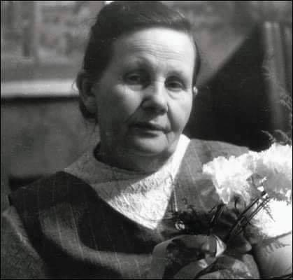
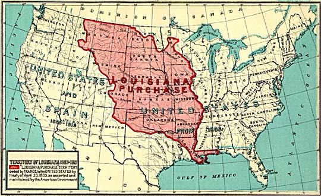

### 2022

Buffett: „rynki finansowe w ostatnich dwóch latach w nadzwyczajny sposób przypominają kasyno, napędzane przez Wall Street”
Munger: „nigdy dotąd na rynkach nie było tyle czystego hazardu co teraz”

### 2021

Inflacja w kwietniu 4,3%!

### 2020

Odrodzenie prekariuszy

Po pandemii będzie więcej pracy tymczasowej. Chociaż niemal wszystkie agencje zatrudnienia musiały w ostatnich tygodniach ograniczyć, niekiedy nawet dwucyfrowo, liczbę pracowników tymczasowych, to teraz branża liczy na mocne odbicie.

---

  

### 2019

Informuję, że 30.04 2019 jest moim ostatnim dniem pracy i od 1.05.2019 nie będę pracownikiem DI
Xelion i całej Grupy Pekao (właścicielem DI Xelion jest Bank Pekao SA). Rozstanie de iure jest za porozumieniem stron,
ale de facto nie miałem wyboru. Podobno powodem rozstania był mój wywiad w sprawie OFE dla Business Insider’a (sic!).
Wyboru też nie miał, jak domniemam, zarząd DI Xelion, do którego nie mam żadnych pretensji. W zaistniałej sytuacji zachowano
się w stosunku do mnie w DI Xelion wzorowo. I chyba tylko tyle można na ten temat (na tym etapie) powiedzieć. Forum na swoim blogu (https://lnkd.in/d8RfvkD ) będę nadal moderował.

<!-- Mój telefon (695333325) zostaje ze mną, a prywatne
adresy email to: piotrw.kuczynski@gmail.com i piotr.kuczynski@upcpoczta.pl -->

### 2015

https://en.wikipedia.org/wiki/Greek_government-debt_crisis#2015

Przy okazji bankructwa Grecji limit wypłaty gtówki był na poziomie 60€.

### 1985

Decyzja Rady Ministrów o przekazaniu OPZZ majątku „byłych związków zawodowych” NSZZ „Solidarność” i CRZZ.

### 1981

Władze wprowadziły kartki na przetwory mięsne, masło, mąkę, ryż oraz kaszę.
Nie była to pierwsza ani ostatnia reglamentacja wprowadzona w tym okresie. Wcześniej, bo 28 lutego 1981 roku, w ramach realizacji postulatów z sierpnia 1980 roku systemem kartkowym objęto mięso, zaś 1 września 1981 roku mydło i proszek do prania.

  

### 1959

  

### 1947

Z lini montażowej Fabryki Ciągników "Ursus" zjechał pierwszy produkowany seryjnie po wojnie polski ciągnik Ursus C-45.
Dokumentację tej maszyny stworzono na podstawie wielu odnalezionych na ziemiach odzyskanych egzemplarzy niemieckiego ciągnika Lanz Bulldog, który to charakteryzował się dużą mocą i wydajnością. Pozostałe niuanse techniczne były już pomysłem polskich konstruktorów.
C-45 uruchamiany był za pomocą specjalnej korby, której przekręcenie wymagało od traktorzysty dosyć sporej krzepy.
Jedną z największych zalet Ursusa C-45 była prosta konstrukcja i łatwa obsługa. Było to istotne w czasach powojennych, gdy brakował nie tylko wykwalifikowanych mechaników, ale nawet osób potrafiących kierować ciągnikami. Tymczasem Ursusa C-45 mógł naprawić prawie każdy kowal.
Do 1957 roku wytworzono ogółem 50 tysięcy ciągników Ursus C-45 przy rocznej produkcji wynoszącej niecałe 6000 sztuk. Ciągniki trafiły również na eksport - sprzedawano je do do Brazylii, Chin i Korei.

  

### 1943

Stanisława Leszczyńska, ''Raport położnej z Oświęcimia''. Fragment.
,,Do maja 1943 roku wszystkie dzieci urodzone w obozie oświęcimskim były w okrutny sposób mordowane: topiono je w beczułce. Czynności tych dokonywały: Schwester Klara i Schwester Pfani. Pierwsza była z zawodu położną i dostała się do obozu za dzieciobójstwo. W związku z objęciem funkcji położnej przeze mnie, zabroniono jej odbierania porodów, albowiem jako „Beurfsverbrecherin” (zawodowy przestępca) była pozbawiona prawa wykonywania swego zawodu. Zlecono jej czynności do których się bardziej nadawała. Powierzono jej także kierowniczą funkcję tzw. blokowej. Do pomocy przydzielono jej niemiecką ulicznicę- rudą piegowatą Schwester Pfani. Po każdym porodzie z pokoju tych kobiet dochodził do uszu położnic głośny bulgot i długo się niekiedy utrzymujący plusk wody. Wkrótce po tym (matka) mogła ujrzeć ciało swojego dziecka rzucone przed blok i szarpane przez szczury. W maju 1943 roku sytuacja niektórych dzieci uległa zmianie. Dzieci niebieskookie i jasnowłose odbierano matkom i wysyłano do Nakła w celu wynarodowienia. Przejmujący skowyt matek żegnał odjeżdżające transporty niemowląt.
Póki maleństwo przebywało przy matce, to już samo macierzyństwo stwarzało promień nadziei. Rozłąka z dzieckiem była straszna. Z myślą o możliwościach odzyskania tych dzieci w przyszłości,
o przywróceniu ich matkom, zorganizowałam sposób oznaczania niemowląt tatuażem, który nie zwracał uwagi SS-manów. Niejedną matkę pocieszała myśl, że odnajdzie kiedyś swoje
utracone szczęście. Dzieci żydowskie były nadal topione z bezwzględna surowością. Nie było mowy o ukryciu dziecka żydowskiego lub zmieszania go z dziećmi nieżydowskimi Schwester Klara i Schwester Pfani na przemian bacznie śledziły Żydówki w czasie porodu. Urodzone dziecko tatuowano numerem matki, topiono w beczułce i wyrzucono przed blok. Los pozostałych dzieci był najgorszy: marły one powolną śmiercią głodową. Skóra ich stawała się cienka, pergaminowata , przeświecały przez nią ścięgna , naczynia krwionośne i kości. Najdłużej przy życiu utrzymywały się dzieci radzieckie, ilość kobiet ze Związku Radzieckiego wynosiła około 50%. Spośród bardzo wielu przeżytych tam tragedii szczególnie żywo zapamiętałam historię pewnej kobiety z Wilna, skazanej na Oświęcim za udzielenie pomocy partyzantom. Bezpośrednio po urodzeniu przez nią dziecka wywołano jej numer (numerem bowiem przywoływano więźnia). Poszłam ją wytłumaczyć lecz to nic nie pomogło, spotęgowało tylko gniew. Zorientowałam się, że wzywają ją do krematorium. Owinęła dziecko w brudny papier i przycisnęła do piersi….. Usta jej poruszały się bezgłośnie, widocznie chciała zaśpiewać maleństwu piosenkę, jak to nieraz czyniły tam matki, nucąc swym maleństwom przeróżne
kołysanki, którymi pragnęły im wynagradzać za dręczące je zimno i głód, za ich niedolę. Nie miała sił….. nie mogła wydobyć głosu… tylko duże obfite łzy wylewały się spod powiek, spływały po jej niezwykle bladych policzkach, padając na główkę małego skazańca. Co było bardziej tragiczne, czy ta jednoczesna śmierć dwóch najbliższych sobie istot, czy też przeżywanie śmierci niemowlęcia, które ginęło na oczach matki, połączona ze świadomością pozostawienia na łasce losu jej żywego dziecka - na to trudno odpowiedzieć. Wśród tych koszmarnych wspomnień snuje się w mej świadomości jedna myśl, jeden motyw przewodni. Wszystkie dzieci urodziły się żywe. Ich celem było żyć!! Przeżyło obóz zaledwie trzydzieści. Kilkaset dzieci wywieziono do Nakła w celu wynarodowienia, ponad 1500 zostało utopionych przez Schwester Klarę i Pfani, ponad 1000 dzieci zmarło na wskutek zimna i głodu
(te przybliżone dane nie obejmują okresu do końca kwietnia 1943).''
Na zdjęciu Stanisława Leszczyńska.

  

---

Pułkownik armii amerykańskiej, oficer łącznikowy przy dowódcy Armii Polskiej na Wschodzie Henry Szymanski opulikował raport dotyczący sowieckiej zbrodni dokonanej na polskich oficerach w Katyniu. Dokument ten przekazał szefowi wywiadu amerykańskiej armii generałowi George'owi Strongowi. Raport nie spotkał się z jakimkolwiek zainteresowaniem ze strony, tak Churchiilla jak i Roosevelta, który stwierdził, iż to wszystko niemiecka propaganda i spisek. Jestem absolutnie przekonany, że Rosjanie tego nie zrobili".

---

### 1942

Warszawski "Biuletyn Informacyjny" opublikował raport Jana Karskiego następującej treści:
"Nędza, głód, zimno i fatalne warunki higieniczne stworzyły tu stosunki potworne. Dajemy kilka przykładów. Istnieje szereg domów tzw. „specjalnych”, zamieszkałych przez największych nędzarzy, gdzie śmierć zbiera wyjątkowe żniwo. Tak np. w domu przy ul. Miłej 46, zamieszkałym obecnie przez 500 osób, zmarło dotychczas 233 osoby, w domu przy ul. Miłej 51, zamieszkałym przez 578 osób, zmarło 260. […]

W wielu mieszkaniach brak zupełny opału. W 17 domach „specjalnych” na ok. 780 izb – 718 nie miało tej zimy w ogóle ognia pod kuchnią. Całe rodziny zamarzły. Ogromna jest również liczba zachorowań. […]

W domu przy ul. Krochmalnej […] w ciągu ostatnich 3 miesięcy zmarło 106 osób; 64 na tyfus plamisty, reszta z głodu. 63 trupy wyrzucono na ulicę z powodu braku środków na normalny pogrzeb. Na tyfus chorowało 365 osób. Spuchnięcia i obrzęki głodowe spotkać można u blisko 100 osób. W ciągu ostatnich 3 miesięcy było wyeksmitowanych 45 rodzin, z których poważną część umieszczono w piwnicach bez podłóg, bez okien itp. W chwili obecnej jest 28 rodzin (140 osób) bez jakichkolwiek środków do życia. Ludzie ci leżą na gołej podłodze, okryci łachmanami, odżywiają się surowymi obierkami. […]"

  

### 1938

Władze wprowadziły w życie plan mobilizacyjny o kryptonimie "W".
Prace nad nim rozpoczęły się już w roku 1935. Twórcą jego podstawowych założeń był generał brygady Wacław Stachiewicz (zdjęcie), a szczegółowe techniki umożliwiające jego realizację opracował zespół dowodzony przez pułkownika dyplomowanego Józefa Wiatra.
Plan zakładał postawienie w stan gotowości bojowej 3/4 sił zbrojnych, dzięki tajnemu powiadamianiu rezerwistów, poprzez dostarczanie kart powołania. Nie wymagało to ogłaszania mobilizacji powszechnej.

  

### 1921

Wszedł w życie traktat ryski- porozumienie między Polską, Rosją i Ukrainą kończące wojnę polsko- bolszewicką.
Ostatecznie w wyniku rokowań granice II
Rzeczypospolitej na wschodzie kończyły się niemal w granicach drugiego zaboru. Polska zyskała część zachodniej Białorusi (bez Mińska) i Ukrainy. Na północy jej rubieże wyznaczała Dźwina, a na południu Zbrucz i Dniestr.
W Rydze reprezentanci Rosji Sowieckiej
zobowiązali się do wypłacenia Polsce
odszkodowania w wysokości 30 mln rubli w złocie. Nigdy zapisów tych nie zrealizowali.
Praktycznie (poza nielicznymi wyjątkami) na papierze pozostały również zobowiązania zwrotu zagrabionych dóbr kultury. Podobnie jak ustalenia dotyczące praw Polaków zamieszkujących państwo sowieckie.
Powrócić do ojczyzny zdołało zaledwie ponad milion rodaków. Resztę – ponad 1,5 mln –spotkał tragiczny los – wysiedlenia, prześladowania, katorga, głód i śmierć.
W Rydze wielkim przegranym okazał się
marszałek Józef Piłsudski, któremu nie udało się zrealizować federalistycznych planów względem Ukrainy, Białorusi i Litwy. Zdaniem prof. Józefa Szaniawskiego: „Traktat ryski
został zawarty wbrew Piłsudskiemu. Wbrew temu co się sądzi, wcale nie miał pełnej władzy”.

  

### 1918

Poniższy tekst to treść manifestu Żydowskiej Socjaldemokratycznej Partii Robotniczej Poalej -Sjon, działającej w Polsce w latach 1905-1950 z dnia 30 kwietnia 1918 roku (pisownia oryginalna):

"Proletarjusze wszystkich krajów łączcie się!Dnia pierwszego maja! Do strajku powszechnego! Towarzysze i towarzyszki! W dniu pierwszym maja, dnia tradycyjnego święta pracujących mas ludz­kości robotniczych wołamy do was, towarzysze studenci i uczniowie: stańcie w szeregi walczącego proletarjatu! W tym dniu gromadzi zjednoczony proletariat rewolucyjny swe siły, by przeciwstawić je potędze burżuazji, która wywoławszy straszną rzeź ludów, Skazała je na najokropniejszą nędze, głód śmierć, zagarniając przy tem sama miljonowe zyski wojenne. Gdy preletarjat rosyjski wzniósł wysoko sztandar walki z kapitalizmem, zmusił militaryzm niemiecki do rokowań pokojowych, już po -krótkim czasie sta­ło się dla nas jasnym że pokój może nam przynieść tylko powszechna rewolucja socjalna. Obecnie zjednoczyły się siły najwsteczniejszej reakcji Ukrainy, Litwy, Finladji, Niemiec, Polski i t. p. starają się stłumić proletarjacką rewolucję rosyj­ską, by odwróciś od siebie gniew mas robotniczych we własnym kraju. Dzisiejszy 1-szy maj winien być dla nich wszystkich zapowiedzią zemsty proletarjatu, zakończenia wojny i położenia kresu ich panowania! Towarzysze i towarzyszki! Połączmy się ze świadomym robotnikiem żydo­wskim, który wszędzie i zawsze walczy o wyzwolenie swoje jako klasy i nacji, by uwolnić się od specyficznych cierpień golasa które są udziałem narodu bez- terytorjalnego, tworzącego wszędzie mniejszość narodową, by na miejsca po­zyskać sobie gwarancje państwowe rozwoju narodowego—autonomję narodową postawiwszy sobie za jeden z celów najbliższych wspomaganie tworzenia wolnego normalnego życia żydowskiego w Palestynie. Do was, studenci i uczniowie, których sumienie i świadomość, reaguje się jeszcze choć z rzadka na tę krźycącą niesprawiedliwość, na to że ci, którzy pra­cują i tworzą wszystkie skarby kultury ludzkiej, są najbardziej eksploatowani, tkwią w biedzie i nędzy; do tych którzy chcą zakończyć nasze cierpienia jako Żydów, do tych wszystkich wołamy,- stańcie pod chorągiew Wszechświatowego Rob. Żyd. Związku Socjaldemokratycznego „Poalej-Sjon“ , pod chorągiew świado­mego robotnika żydowskiego, który na całym święcie prowadzi walkę wraz z ca­łym międzynarodowym proletarjatem przeciwko krwawej wojnie, przeciw eksplo­atacji, uciskowi narodowemu! Za pokój, wolność, samookreślenie narodowe! Za Socjalizm!Towarzysze i towarzyszki! Jeżeli musicie walczyć z trudnościami i przeszkodami do zdobywania wie­dzy, która jest dotychczas monopolem klas posiadających, jeżeli znosicie uniżenia z powodu przynależności do narodu żydowskiego, zjednoczenie się z ruchem ro­botniczym, który walcząc o swoją wolność, daje tą wolność całej ludzkości. Towarzysze i towarzyszki! Dzień 1 maja jest manifestacją międzynarodowego proletarjatu przeciwko jego ciemiężcom! Razem z nim wyjdźmy na alicę pod czerwonym sztandarem. Głośno niech brzmią jego i nasze hasła: Niech żyje 1-szy Maj! Niech żyje strajk powszechny! Precz z wojną! Precz z władzą okupacyjną, radą regencyjną i radą stanu. Niech żyje wolna demokratyczna republika polska!"
Na zdjęciu członkowie Poalej Syjon-Lewica oddziału Szydłowiec (1934)

  

### 1803

USA kupiły od Francji kolonię Luizjana.
- Niepokoicie się o wasze interesy w Nowym Orleanie, to go kupcie - powiedział w 1802 r. ambasadorowi USA szef francuskiej dyplomacji Talleyrand. 30 kwietnia 1803 r. Francuzi za nieco ponad 23 mln ówczesnych dolarów oddali Amerykanom tereny zajmujące 2,14 mln km kw., a obszar ten niemal podwoił powierzchnię USA. Ostatecznie powstało tam 13 nowych stanów stanowiących dziś niemal 25 proc. powierzchni kraju. Odkrywanie Luizjany, nazwanej tak na cześć króla Ludwika XIV, zaczęło się w 1673 r. Z czasem obszar francuskiej Luizjany obejmował obszar pomiędzy Appalachami a Górami Skalistymi, ale nie zamieszkiwało go więcej niż 30 tys. białych. W 1763 r. po przegranej przez Paryż wojnie siedmioletniej część Luizjany przypadła Wielkiej Brytanii i Hiszpanii, by w 1800 r. wrócić na chwilę do Francji.

  

### 1777

https://pl.wikipedia.org/wiki/Carl_Friedrich_Gauss

---

<a href="https://github.com/TomaszWaszczyk/historia.waszczyk.com/edit/master/src/content/april-30.md" target="_blank">Edytuj tę stronę dzieląc się własnymi notatkami!</a>
