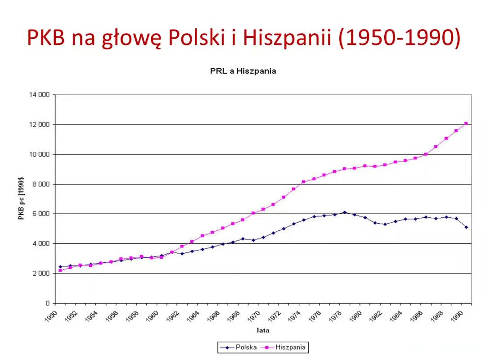

### 2023

> Chcemy stać się światowym potentatem produkcji amunicji. Mamy w tym zakresie zdolności i chcemy je znacznie rozszerzyć - mówił w dzisiejszym programie CafeArmia na antenie Polskiego Radia 24 gość red. Agnieszki Drążkiewicz dyrektor Biura Broni Amunicji i Techniki Rakietowej PGZ S.A. Łukasz Malicki.

### 2022

  

### 2021

  

### 2020

Obserwujemy zapaść państwa. Nie wszyscy to jeszcze widzą, ale za kilka tygodni zobaczą to nawet widzowie TVP. Pomińmy sympatyczne nauczycielki matematyki opowiadające w TVP jakieś androny o liczbach mających parę, pomińmy to, że uczniowie piszący próbną maturę dostali najpierw zadania z matury z 2015 roku a kolejnego dnia z roku 2017 i przejdźmy do prawdziwych katastrof. Dyrektor szpitala w Bytomiu zorganizował kwarantannę lekarzom na sali z chorymi na covid, bez jedzenia i bez środków ochronnych. Dyrektor szpitala w Toruniu zakazał lekarzom zakładania maseczek ochronnych, bo przed niczym nie chronią a poza tym sprowokują pozostały personel do zażądania ochrony. Jeden z oddziałów szpitala został wkrótce później zamknięty przez 22 przypadki koronawirusa. Pozostałym lekarzom odmawia się testów. Chodzą i dalej zarażają. Dyrektor szpitala odmówił też przyjęcia od Uniwersytetu darowizny w postaci przyłbic ochronnych, bo nie miały atestu. Takie rzeczy dzieją się w całej Polsce, ale wiemy o tym mało, bo lekarze mają zakaz wypowiadania się o tym co się dzieje w szpitalach. Firmuje to wszystko minister Szumowski, który stał się najpopularniejszym politykiem w kraju, bo wygląda jakby był zmęczony. A mamy dopiero sam początek epidemii! Wyobrażacie sobie jaki sajgon tam będzie za trzy tygodnie?

Gdzie nie spojrzymy wybija jakaś głupota, jakaś patologia w zarządzaniu lub brak odpowiedzialności decydentów. Mści się obsadzanie wszelkich stanowisk według klucza partyjnego.

A jak wygląda przyjęte przez Sejm prawie miesiąc po rozpoczęciu epidemii Betonowe Koło Ratunkowe dla przedsiębiorców, które dla śmiechu nazywa się Tarczą Antykryzysową? Nie wiadomo, bo nikt go nie rozumie. Powstał oficjalny podręcznik, ale liczy 172 strony i dalej nic nie wyjaśnia. Nie wiadomo nawet czy zwolnienie z ZUS obejmuje również składki po stronie pracownika, nie wiadomo w jakiej wysokości wypłacać wynagrodzenie pracownikom. Za to wiadomo, że pożyczka 5000 zł dla mikroprzesiębiorców, czyli przedsiębiorców zatrudniających mniej niż 9 pracowników, ma nie obejmować tych, którzy nikogo nie zatrudniają. Skąd wiadomo? Z pisma jakiegoś urzędnika, które jest sprzeczne z ustawą, bo wymaga przyjęcia, że 0 jest większe od 9. Widocznie w urzędach pracy na poważnie biorą lekcje matematyki w TVP. Swoją drogą chciałbym się dowiedzieć, czy według pań z TVP zero ma parę i co na to Zbigniew Ziobro.

Agencja Rezerw Materiałowych nie ma podstawowych wyrobów medycznych bo musiała kupić węgiel od upadających kopalni ratowanych przez upadające spółki energetyczne. Fundusz Gwarantowanych Świadczeń Pracowniczych nie ma pieniędzy dla zwalnianych pracowników, bo poszły na świadczenia przedemerytalne, wynagrodzenia młodocianych oraz staże i specjalizacje pracowników medycznych. To zresztą standard, bo 13 emerytura będzie wypłacona z Funduszu Solidarnościowego, który miał być przeznaczony dla niepełnosprawnych. Nie będę już pisał co stało się z Funduszem Rezerwy Demograficznej, który również nie może się uchować, ale teraz by i tak się nie przydał.

Cała nasza gospodarka nie jest w stanie do teraz wyprodukować wystarczającej ilości tak skomplikowanych i technologicznie zaawansowanych produktów jak maseczki i rękawiczki, nie mówiąc już o niezwykle trudnym w produkcji płynie do odkażania.

Tymczasem dla polityków od kilku dni najważniejszym tematem jest to, czy 10 maja odbędą się wybory. Tak, na całym świecie wszyscy przekładają wybory. Nawet w Etiopii, która nie słynie ze sprawnego państwa i wysokiej kultury politycznej, starczyło władzy rozumu, by przełożyć wybory. Wszędzie to rozumieją, tylko nie u nas. Jesteśmy chyba jedynym krajem na całym świecie, gdzie zamiast wirusem wszyscy zajmują się wiosennymi wyborami.

Mamy też bunt zdominowanych przez opozycję samorządów, które odmawiają pomocy przy przeprowadzeniu wyborów. W odpowiedzi władza chce ustanawiać komisarzy, korzystać z pomocy WOT. Gdy prezes Poczty Polskiej twierdzi, że nie jest w stanie obsłużyć wyborów korespondencyjnych zostaje wyrzucony a na jego miejsce trafia wiceminister obrony narodowej.

Idea kompromisu dla dobra państwa jest koncepcją całkowicie obcą zarówno dla koalicji jak i opozycji. Poprawki do ustawy opozycji są z góry odrzucane. Nikt nawet nie udaje, że bierze je pod uwagę. Lepiej przegłosować ustawę z błędem niż przyznać rację komuś z innej partii. Do tego Sejm idzie na zderzenie z Senatem, większość rządową wisi na włosku a pod dywanem buldogi żrą się o miejsca w spółkach.

A czemu u nas za wszelką cenę PiS dąży do wyborów? Bo oni doskonale już wiedzą jakie dramaty będą się odbywać przez kolejne miesiące. Przez najbliższe tygodnie uderzy w nas większa liczba zachorowań, całkowita zapaść szpitali, degrengolada gospodarcza i bezrobocie. Ludziom skończą się pieniądze i zacznie robić się ciepło. Jednym odbije od siedzenia w domu i stania w godzinnych kolejkach do sklepu, inni zaczną kraść z braku pieniędzy. Tak jak już się dzieje na południu Włoch. Mordując gospodarkę i osłabiając ludzką odporność psychiczną bardzo drogo kupujemy czas, do niczego go nie wykorzystując. Nie widać żadnego planu, żadnej przyjętej strategii poza przeczekaniem.

Nasze państwo z dykty i paździerza ma w sobie jeszcze tyle siły i woli, by dać mandat fryzjerce samotnie wychowującej dzieci, która musiała pracować by mieć na jedzenie. Pytanie, czy starczy tej siły, gdy ludzie masowo zaczną łamać mające wątpliwe podstawy prawne zakazy. A zaczną je łamać, bo już widać, że entuzjazm sprzed kilku tygodni wyparował. Nawet dziennikarze już widzą, że bez reklam i sprzedaży gazet ich wynagrodzenia stają pod znakiem zapytania. Orlen z Energą wszystkich reklam nie wykupią a prywatny biznes walczy o przetrwanie i tnie budżet reklamowy. Frustracja będzie z każdym dniem rosnąć w miarę kurczenia się oszczędności. Będzie ciekawie, ale nie czekam na najbliższe tygodnie z niecierpliwością. Powodów do optymizmu na razie nie widać żadnych.

Na zdjęciu ZUS w Świdnicy. Jedno zdjęcie wyraża więcej niż 1000 słów.

  

---

SYNDROM GOTUJĄCEJ SIĘ ŻABY …. Czy DOTYCZY dzisiaj Ciebie ?

SUKCESYWNE PRZESUWANIE GRANIC ...JEST SKANDALICZNE ... masz stać pod sklepem i zachować dystans widząc w bliźnim zagrożenie ...podczas gdy w samym sklepie masz kontakt z wszystkim na czym wirus utrzymuje sie podobno kilka godzin ...
Widziałem jak młoda kobieta urągała starszej osobie .... mówiąc - Co Pani sobie myśli ......ja chce żyć !!! Obłęd bezrefleksyjności.

PROBLEM: Siła oddziaływania i perswazji – stała się widoczna w zachowaniach ludzi – czy ta gotowość do podporządkowania się NAKAZOM INNYCH - jest przejawem:

1. wewnętrznej dyscypliny i odpowiedzialności ? lub może
2. ZEWNĄTRZSTEROWNOŚCI - czyli bezradności w samodzielnym myśleniu, rozwiązywaniu problemów – działaniu i ocenie sytuacji w podejmowaniu decyzji?

ZANIM WYJAŚNIĘ ….kilka definicji …

Wyczerpane EGO
Amerykański psycholog Roy Baumeister i jego współpracownicy zaproponowali model, w którym uznano w świetle badań …że nasza wola zachowuje się tak samo jak mięsień … zużywa się i wyczerpuje czyli ulega zmęczeniu tak samo jak ograniczona zdolność do powtarzania czynności: pompek, przysiadów które jesteś w stanie wykonać …Samoregulacja - czyli podporządkowywanie na skutek kierowania swoimi zachowaniami - wyczerpuje nasze siły życiowe.

Wyczerpane EGO - odnosi się do idei, że samokontrola / samoregulacja czerpie z ograniczonej puli zasobów mentalnych, które można wykorzystać. Kiedy energia dla aktywności umysłowej / spada Twoja samokontrola czyli wola; zazwyczaj traci zdolność do reagowania - co można by uznać za stan wyczerpania ego. W ten sposób zmeczeni sytuacja ...możemy mieć większe skłonności do ULEGŁOŚCI ...BEZ STAWIANIA OPORU.

W szczególności, stan wyczerpania ego upośledza zdolność do kontrolowania siebie …po czym nawet proste zadania stają się kłopotliwe i problemowe!!!! Samokontrola odgrywa ważną rolę w funkcjonowaniu kierowaniu sobą na poziomach indywidualistycznych i interpersonalnych.

CO TO MA WSPÓLNEGO Z ŻABĄ ...?

Syndrom gotującej się żaby w skrócie dotyczy sytuacji, w której ktoś zużywa całą swoją energię na dopasowanie się do okoliczności, do wymogów i nakazów – w obliczu systematycznie rosnących żądań …

ale gdy nadchodzi moment krytyczny, już nie dysponuje żadnymi rezerwami (woli do przeciwstawiania się) i … ponosi porażkę …poddaje się, ulega żądaniom.

Co to oznacza w praktyce ?

Potulnie się godzisz na wszystko do momentu, w którym nie jest już za późno. Można powiedzieć, że utrzymując się w takim błędnym kole będziesz stopniowo odczuwał pogarszanie się swojego stanu psychicznego i emocjonalnego, aż w końcu staniesz się całkowicie wypalony i pozbawiony energii życiowej/ zrezygnowany i PODPORZĄDKOWANY …

czyli POZBAWIONY woli walki I sprzeciwu – poddasz się REGULACJOM I NAKAZOM !!!!!!

STOPNIOWE NIEPOSTRZEGALNE …GOTOWANIE

Żaba włożona do stopniowo podgrzewanej wody wyskoczy z niej ratując swoje życie, jeśli tempo wzrastania temperatury wody przekroczy 0,02° C na minutę.
LECZ ...
Gdy będzie podgrzewana w wodzie w wolniejszym tempie, żaba będzie traktować ją jako komfortową do życia a następnie podporządkowywać ...przyzwyczajać się do stopniowych niedogodności lecz pozostanie w niej tak długo, aż umrze z powodu przegrzania....(wyczerpania ego) ...

Nasz I NIE TYLKO NASZ Rząd – podobnie jak rządy innych krajów – przesuwają granice naszego podporządkowania …robiąc to sukcesywnie krok po kroku …i stopniowo …

MA TO PRZYGOTOWAĆ DO SYTUACJI – w której ogłoszenie faktycznych problemów …związanych:
• Z gospodarką
• Utratą przywilejów - świadczeń
• Utratą oszczędności - bankructw banków
• Wzrostu inflacji - utraty wartości ...
• Upadku gospodarki, stratą pracy
• utraty majątku ....

LUDZIE PRZYJMĄ …bez woli SPRZECIWU …bez protestów …bez wychodzenia na ulicę …bez zamieszek …z REZYGNACJĄ WYCZERPANEGO EGO …. w obliczu zakazów i kar z powodu zgromadzeń

Ludzie zaakceptują wówczas i przyjmą bez walki to, co jest przyczyną złej polityki rządów …upadku setek banków, bankructw wywołanych złą gospodarką, oraz obliczonym PRZEZ FINANSJERE - Z ICH WINY KRYZYSEM …za który zapłacą ludzie …. ( co nie ma nic wspólnego z koronawirusem) ….

3% NAJBOGATSZYCH LUDZI W WYNIKU MALWERSACJI ORAZ OSZUSTW FINANSOWYCH podłej i bezwzględnej polityki … najbardziej obawia się globalnych ZAMIESZEK i oburzenia całej reszty świata …która WYWRÓCI TEN SYSTEM … …

dlatego KORONAWIRUS I PROPAGANDA – są dla nich „zbawianiem” lub nawet …OSTATNIĄ DESKĄ RATUNKU UTRZYMANIA SWOJEJ POZYCJI …. w tym niesprawiedliwym układzie świata ….

---

Zastanawialiście się, jak to było, że kraj, który był ogromny jak pół Europy, w sto lat się zwinął? Zastanawialiście się, jak to się stało, że gówniane mini państewko niemieckie, narodowy kocioł pod Habsburgami i zacofana, komicznie wręcz zacofana, barbarzyńska Rosja potrafiła Polaczków na ponad sto lat wziąć za pysk i na smyczy do budy przypiąć? Zastanawialiście, się dlaczego po 7 lat odzyskania niepodległości, Polaczki znowu miały autorytaryzm, obozy koncentracyjne? Zastanawialiście się, dlaczego kampania wrześniowa padła w dwa tygodnie, a większość elit, w tym generalicja, po prostu, za przeproszeniem, spierdoliła? Albo zrobili debilne powstanie, które skończyło się taką rzezią, że Stalinowi lata by zajęło takie wypatroszenie polskiej młodzieży? Zastanawialiście się?

To teraz już wiecie. Teraz macie przedsmak tego, czym są polskie elity rządowe.

W momencie, gdy wszystko się wali, ludzie płaczą, błagają pomoc, gdy z dnia na dzień tracą pracę, maja kredyty, ci robią wszystko, wszystko, co robią, to knują. Nic innego ich nie obchodzi, tylko jak tu ograć, okraść, na czym się wzbogacić i kogo oszwindlić.

W momencie, gdy lekarze błagają o maseczki, ci blokują kupno ich w Chinach, blokują samolot od Owsiaka. A po co? A po to, żeby narodowe czempiony, do których powsadzali pociotków i kuzynów, mogły se fotki w TV Pereiera robić. Jak bardzo trzeba być zdemoralizowanym, żeby ryzykować życie lekarzy i pielęgniarek, bo trzeba zrobić fotkę podejścia do lądowania?

Co szósty zakażony to ktoś z personelu szpitalnego. Tak, tego personelu, na który szczuli jak naziści na Żydów, a teraz nawet odmówili im podwyżki na czas epidemii. Bo Senat śmiał to zgłosić. Co chwila pada cały oddział do kwarantanny. I co? 

I najpierw zastraszają, prześladują, zwalniają z pracy tak, że personel medyczny boi się już z dziennikarzami pod nazwiskiem mówić. A potem włazi wiceminister zdrowia i wyzywa lekarzy, że to ich wina, że nie przestrzegają procedur.

Jakich, kurwa, procedur, jak wysyłacie po pinć na krzyż maseczek na szpital? Jakich procedur, jak fejs zalany jest błaganiami o pomoc?

Sklepiki na 3 osoby zamknięte, ale markety budowalne przez tygodnie otwarte, kościoły otwarte, parki otwarte. A potem sobie order do pyska wsadzają i krzyczą, jacy są najlepsi z najlepszych.

Jak zrobili akcję Lot do domu, to nawet po 6 tysi od ludzi ściągali, chociaż UE robi dofinansowanie na 75%. Jak robili kwarantannę to tak, że domownicy mogli bez przeszkód wychodzić, więc roznosili tego wirusa szybciej niż Kaczyński się moczy na myśl, że właaaadza właaaadza będzie ciągle w jego rękach.

Na cholerę nam Twoja władza, jak zaraz wszystko może pójść z dymem?

Patrzcie na Merkelową, patrzcie na premiera Włoch i Francji na polityków, którzy, jak to politycy, masę w życiu zrobili złego, czasami nawet bardzo złego. Ale patrzcie, jak działają w obliczu katastrofy, jak rozumieją, bo ktoś im do łba wbił, nie wiem, może społeczeństwo, że teraz nie czas jest na gierki. Teraz jest czas na służbę.

A teraz patrzcie na Kaczyńskiego, który, gdy ludzie cali przestraszeni o własną przyszłość i ze łzami w oczach, wynurza się i mówi, ale o co Wam wszystkim chodzi, przecież można iść normalnie do sklepu, nie przesadzajcie. Wszystko działa. Robimy wybory. Facet, którego od 20 lat partia-matka wozi, karmi i przewija, w momencie tsunami gospodarczego, zamkniętych granic, walącego się biznesu i świata pracy, wojska na ulicach, bredzi coś o konstytucji, którą na oczach milionów podcierał się non stop przez ostatnie lata. I tylko knuje, knuje, jak kogo oszwindlić bez względu na cenę życia ludzkiego. Jak bardzo trzeba gardzić własnym narodem, jak bardzo trzeba mieć życie tych wszystkich listonoszy, seniorów kompletnie w rzyci. Odjedź, starcze, uwolnij ten kraj od siebie, bo zaraz przez Ciebie trupy będziemy tu liczyć w tysiącach.

A za nim ciągnie, niczym muchy do gówna, cała ta zgraja politycznych przydupasów, dla których najważniejsze jest by ze stołu pańskiego coś spadło i by się mogli nażreć. Bo w życiu czymś pożytecznym się nie zajmowali.

I żaden się nie sprzeciwi, żaden. Każdy kilo w majtkach i przestraszony. A teraz wyobraźcie sobie tych wszystkich przydupasów, jak przychodzi do nich Gestapo albo NKWD? Jak oni się jednemu Kaczyńskiemu boją w oczywistej sprawie postawić. Gdzie Wam to tych wszystkich powstańców, gdzie Wam do tych wszystkich wyklętych, zgrajo kundli z podwiniętym ogonem. Wszystko, co potraficie to tylko merdać i aportować.

Mają przykład Czech z maseczkami. To biorą przykład wyborczy z Bawarii. Z tej Bawarii, która od 60 lat ma korespondencyjne wybory. Wcześniej z tej Bawarii podobno mieli ściągać jakieś reparacje, a skończyło się tak, że Saksonia robi testy Polakom z Dolnego Śląska. Tak, Niemcy oprócz siebie, testują także Polaków. Bo w Polsce testów przez tygodnie nie było, a połowę ich robi prywatna spółka na uniwersyteckim sprzęcie, gdyż tak Szumowski był przygotowany, gdy ze stoku cały uśmiechnięty zjeżdżał i śmiał się, że grypa jest groźniejsza.

A teraz cały w strachu boi się nawet mruknąć, że szaleniec u władzy powinien se wybory odpuścić i wreszcie zająć się społeczeństwem, które przerażone o własnej jutro.

Wiecie, co powiedział Pinkas – Główny Inspektor Sanitarny w kraju, na komisji senackiej, gdy go senatorka w LUTYM spytała o epidemie w Chinach: Żeby se pograła w Chińczyka. W Chińczyka, hehe, rozumiecie, w Chińczyka!

Biorą przykład z Bawarii, ale oczywiście nie ten o tym, jak pieniądze obywatelom teraz dawać, bo jeśli lada moment kilka milionów ludzi nie będzie miało pieniędzy, to co do garnka włożą? Cała Europa robi wszystko, by przelać jak najwięcej kasy. Cała. Nawet USA neoliberała Trumpa to samo. Tylko Polska mówi, ojdobrze przesuniemy Wam ZUS. Albo może nawet zwiesimy, ale tylko jak udokumentujecie straty powyżej 50%. Jaki ZUS, jaki ZUS, jak z dnia nadzień idą zwolnienia po kilkaset osób na zakład.

Pięć lat pierdolili, pięć lat o kraju mlekiem i miodem płynącym. Pięć lat, o najlepszych wynikach, o budżecie bez deficytu. I się, za przeproszeniem, zesrali już w pierwszym miesiącu tąpnięcia. Ile osób ma zemrzeć z braku kasy na leki, ile osób ma się zapożyczyć u mafii lichwiarskiej? Ile ma być samobójstw, żeby do Waszego pustego łba dotarło, że teraz jest czas na pomoc? Nie wiem, nazwijcie se je matkoboskowe, jarkowe, 1000+,ale teraz jest czas na bezpośrednią pomoc finansową dla każdego obywatela. Na duży deficyt i przelewanie kasy bezpośrednio na konto. Już nawet neoliberalny Financial Times o tym pisze.

Nie ja, nie my, ale historia was oceni. Tak jak oceniła Smoleńsk, mimo setek pomników, jako jeden wielki polaczkowy rozpierdolnik, aż sami musieliście ze wstydu pochować te wszystkie dojne komisje. Bo ludzie już wiedzą, co tam się stało. Nawet Wasi wyborcy wiedzą, więc taktycznie milczą. Tak samo historia oceni to, jak się zachowaliście w trakcie narodowego dramatu. I Wy już to wiecie. Dlatego tak panicznie boicie się wyborów za rok. Bo wtedy wyjdzie, jak koszmarnie daliście dupy i żaden Kurski tego nie przykryje.

Jesteście hańbą, największą hańbą rządów po 1989 roku. Jeszcze żaden rząd tak kompletnie nie odwrócił się od społeczeństwa w tak krytycznym momencie. I to tylko po to by się nażreć i nażreć władzy.

### 2002

Prezydent Rzeczypospolitej Polskiej Aleksander Kwaśniewski wręczył w uznaniu wybitnych zasług w stworzeniu Światowego Forum Ekonomicznego, za działalność na rzecz międzynarodowej współpracy gospodarczej i ekonomicznej Krzyż Komandorski z Gwiazdą Orderu Zasługi Rzeczypospolitej Polskiej profesorowi Klausowi Szwabowi. Zwracając się do zebranych Prezydent RP powiedział: Mam dziś zaszczyt i przyjemność wręczenia Panu Profesorowi Klausowi Schwabowi Krzyża Komandorskiego z Gwiazdą Orderu Zasługi Rzeczypospolitej Polskiej.

---

  

---

### 1990

  

  

  

  

### 1950

Odbył się próbny lot pierwszego polskiego śmigłowca BŻ -1 GIL.
Maszynę skonstruowaną w Głównym Instytucie Lotnictwa w Warszawie pilotował jej twórca Bronisław Żurakowski.
Mimo, iż testowano go przez 10 lat, ze względu na kilka wypadków i sporą awaryjność nigdy nie wszedł do produkcji.
W drugiej połowie lat osiemdziesiątych jedyny jego egzemplarz został odrestaurowany i przekazany do Muzeum Lotnictwa Polskiego w Krakowie.

  

### 1944

Miała miejsce bitwa w Bronisławach w gminie Rybno. Wtedy to właśnie 25 osobowy Oddział Partyzancki " Socha" dotarł dotarł do tej miejscowości,gdzie postanowił założyć swoją kwaterę. Pod nieobecność dowódcy,który został wezwany do sztabu 500 osoby oddział niemiecki przypuścił atak na partyzantów.
W wyniku zażartej walki zginęło 20 partyzantów, 4 wzięto do niewoli. W kolejnych dniach 2 z nich rozstrzelano na Pawiaku zaś 2 zbiegło z posterunku Schutzpolizei w Chodakowie.

  

### 1943

Apel dowódcy Armii Polskie na Wschodzie generała Władysława Andersa z dnia 4 kwietnia 1943 roku:
"Obowiązkiem żołnierza Polaka jest nie tylko zwyciężać w walce orężnej, musi on także w miarę możliwości i sił, przygotować się do walki, jaka nastąpi, a której uniknąć nie możemy, do walki równie ciężkiej i bezwzględnej, do walki ekonomicznej. Stworzenie sobie możliwości szybszej odbudowy ograbionego przez wrogów Kraju będzie oznaką gotowości do tych przyszłych zmagań. Osiągniemy to przez oszczędzanie dzisiaj i zachowanie tych oszczędności do czasu powrotu do Kraju. Odłożenie pieniędzy w formie oszczędności będzie miało kapitalny wpływ na kształtowanie się cen na obsługującym nas rynku, w wyniku czego, drogą mniejszego wysiłku finansowego, będziemy mogli osiągnąć lepsze warunki egzystencji. Samodzielny Referat Oszczędności Żołnierzy" w Szefostwie Intendentury Armii. Uwzględniono również oszczędności składane w rublach sowieckich na terenie ZSRR. "Przy ustalaniu form oszczędzania oraz warunków lokowania zaoszczędzonych kapitałów poleciłem kierować się jedynie i wyłącznie dobrem oszczędzającego żołnierza.
Wzywam żołnierzy wszystkich stopni Armii Polskiej na Wschodzie do wzięcia udziału we wspólnym wysiłku, zmierzającym do odbudowy naszego gospodarstwa narodowego przez czynne przystąpienie do akcji oszczędnościowej"

  

### 1923

Założono amerykańską wytwórnię filmową Warner Bros.
Bracia Albert, Sam, Harry i Jack Warnerowie założyli w Los Angeles wytwórnię filmową Warner Bros., jedną z najważniejszych w historii kina. Naprawdę nazywali się Aaron, Szmul, Hirsz i Icchak Wonsalowie i pochodzili z rodziny żydowskiego szewca, która pod koniec lat 80. XIX w. wyemigrowała do USA ze wsi Krasnosielc na Mazowszu. Najmocniejszą pozycję w firmie zyskali Sam i Jack, którzy wyprodukowali m.in. pierwszy film dźwiękowy zatytułowany "Śpiewak jazzbandu". Sam zmarł dzień przed premierą, a po jego śmierci pozostali bracia toczyli między sobą walkę o kontrolę nad firmą, którą w latach 50. ostatecznie uzyskał Jack. Z Warner Bros. związane są lub były takie gwiazdy, jak m.in. Clint Eastwood, Mel Gibson, Harrison Ford i Robert De Niro.

  

### 1350

Król Polski Kazimierz III Wielki zawarł w Budzie porozumienie z królem Węgier Ludwikiem I Wielkim, na mocy którego w zamian za pomoc węgierską w walce z Litwą Polacy zobowiązali się do odsprzedania Rusi za sumę 100 tysięcy florenów, w przypadku jeśli Kazimierz doczeka się męskiego potomka. W przypadku gdyby król Polski umarł nie pozostawiwszy syna, tron Polski oraz sporna Ruś miały przejść we władanie króla węgierskiego.
Od zarania naszej państwowości graniczyliśmy od południowego wschodu z Rusią Kijowską. Jedno z najstarszych źródeł mówi, ze Włodzimierz Wielki wyprawił się przeciwko Polsce i przyłączył do Rusi Grody Czerwieńskie (981 r.), które dopiero Bolesław Chrobry, wracając z wyprawy na Kijów, z powrotem wcielił w granice swojego państwa (1018 r.).
Różnorodne kontakty z Rusią uległy kilkuletniej przerwie w czasie krwawych walk pomiędzy spadkobiercami Włodzimierza. Po ostatecznym zwycięstwie syna Włodzimierza, Jarosława Mądrego, panującego nad Rusią od 1019 r., stosunki ponownie się ożywiły. Ruś za panowania tego wybitnego władcy przeżywała okres świetności i potęgi. Wyprawy wojsk ruskich docierały na Mazowsze, Litwę, a nawet do Estonii. Kazimierz Odnowiciel, odbudowując państwo polskie, szukał wsparcia u Jarosława, związki polityczne pieczętując małżeństwem z księżniczką ruską Dobroniegą.
Po śmierci Jarosława Mądrego (1054 r.) Ruś wskutek dokonanego podziału państwa pomiędzy pięciu synów weszła w okres rozbicia dzielnicowego. Jednym z księstw było księstwo halickie, które wyodrębniło się na przełomie XI i XII wieku. Ziemie wchodzące w jego skład, obejmujące dorzecze górnego i środkowego Dniestru oraz częściowo Sanu z Haliczem jako głównym grodem, zjednoczył prawnuk Jarosława Włodzimierz, zwany Włodzimierkiem. Księstwo leżące na południowo-zachodnich kresach ruskiego obszaru etnicznego, w sąsiedztwie groźnych ludów koczowniczych, przede wszystkim Połowców, ze względu na swe bogactwa naturalne (sól) i korzystny układ ' szlaków handlowych przebiegających przez jego terytorium, stanowiło obiekt zainteresowania wielu sąsiadów.
Po trwających wiele dziesięcioleci walkach wewnętrznych dopiero około roku 1200 książę wołyński Roman Mścisłowicz zjednoczył księstwo halickie z księstwem wołyńskim. Stabilizacja nie trwała długo. Wojowniczy Roman, skutecznie zwalczający Połowców i Litwinów, wyruszył przeciwko Polsce, i w bitwie pod Zawichostem w roku 1205, walcząc przeciwko Leszkowi Białemu i Konradowi Mazowieckiemu, zginął. Księstwo halicko-wołyńskie weszło na przeciąg lat 30 w okres poważnego zamętu i walk wewnętrznych.
Dopiero po 30 z górą latach Daniel, syn Romana, zdołał pozbyć się wszystkich współzawodników i objąć w posiadanie ponownie zjednoczone księstwo halickie i wołyńskie (1238 r.). Niedługo potem zwalił się na księstwo najazd tatarski, doprowadzając ziemię halicką do spustoszenia. Daniel musiał uznać zwierzchnictwo tatarskie, choć na tronie książęcym utrzymał się do śmierci w 1264 r. Dotychczasowe trudne położenie Rusi Halickiej od początku XIV wieku weszło w nowe stadium. Coraz to nowi, nie tylko bliżsi, ale i dalsi sąsiedzi zaczęli przejawiać zainteresowanie tym krajem. Należeli do nich przede wszystkim Krzyżacy. Niebezpieczeństwo dla Polski, które wyrażało się możliwością okrążenia państwa od południowego wschodu, rozumiał Kazimierz Wielki. Zakon dzierżył już w swoim ręku ujście Wisły i odcinał Polskę od morza.
Na zainicjowanym przez Kazimierza zjeździe królów w Wyszehradzie w 1335 r., w którym wzięli udział: Karol Robert Węgierski, Jan Luksemburski ze swym synem Karolem i Kazimierz Wielki, omawiano spór Polski z Krzyżakami. Sprawy Rusi były dla Polski o wiele ważniejsze niż dla Węgier, stąd w zamian za poparcie z ich strony mógł Kazimierz mówić o sukcesji andegaweńskiej w Polsce jako rekompensaty za Ruś, zjednując sobie pełną przychylność i życzliwość Karola Roberta.
A na Rusi zaistniała rzeczywiście sytuacja pozwalająca realnie myśleć o sukcesji. Po wymarciu Romanowiczów w roku 1324 zasiadł na tronie halicko-włodzimierskim siostrzeniec Romanowiczów, syn księcia mazowieckiego Trojdena, Bolesław, który przyjąwszy wyznanie wschodnie przybrał imię Jerzego.
Sąsiadami, na których mógł liczyć Jerzy, były Węgry i Polska, bowiem Jerzy był szwagrem Kazimierza Wielkiego. Na drugim zjeździe w Wyszehradzie, w czerwcu 1338 r., na który obok Karola Roberta i Kazimierza Wielkiego przybył Jerzy z "wybranym rycerstwem", uchwalono zasady wspólnego postępowania wszystkich trzech państw w sprawie ruskiej, mające na celu, jak potwierdziły to późniejsze wypadki, przyznanie poparcia Jerzemu ze strony Polski i Węgier. W zamian za udzielone poparcie książę Jerzy na wypadek bezpotomnej śmierci wyznaczył króla Kazimierza swym następcą. Jerzy liczył dopiero 30 lat, jednak zaszła rzecz przez nikogo nie przewidywana i układ stał się niespodzianie aktualny. 7 IV 1340 r. bojarzy ruscy otruli swego księcia, niezadowoleni z jego dotychczasowej polityki. Śmierć ta nastąpiła w trakcie prowadzonych przez Jerzego walk z Tatarami, w czasie których pomagali mu Kazimierz Wielki i Karol Robert.
Na wiadomość o śmierci Jerzego król polski ruszył niezwłocznie na swą pierwszą wyprawę na Ruś, z niewielkim zastępem rycerstwa, wspartego posiłkami węgierskimi, i zajął po krótkiej walce Lwów. Większość bojarów wystąpiła przeciwko Kazimierzowi. Wówczas król zabrał ze Lwowa skarbiec i insygnia książęce oraz wielu osiadłych we Lwowie obcych kupców i powrócił w połowie maja 1340 r. do Krakowa. Niebawem jednak, bo już w czerwcu, z większymi siłami ponowił wyprawę. Wówczas to bojarzy ruscy wezwali na pomoc Tatarów, którzy na przełomie lat 1340/41 dotarli w Lubelskie. Klęska zadana nad Wisłą zmusiła ich do odwrotu. Zajęcie Rusi okazało się dla Kazimierza zadaniem bardzo trudnym. Zrezygnował więc z faktycznego opanowania kraju i zadowolił się uznaniem formalnego zwierzchnictwa nad Rusią. Wyrazem tego zwierzchnictwa stała się umowa zawarta przez króla z jednym z najbardziej wpływowych bojarów Dymitrem Diedką, dzierżącym gród przemyski, o wykonywaniu przez niego roli starosty podległego królowi, który z kolei przyrzekał chronić obrządki, prawa i zwyczaje narodu ruskiego. Układ ten nie był trwały, gdyż Diedko nie zdołał przeszkodzić zajęciu Wołynia przez księcia litewskiego Lubarta. W sprawie ruskiej pojawił się nowy rywal i konkurent - Litwa. Sprzymierzone przeciw Kazimierzowi siły rusko-tatarsko-litewskie nakazały królowi polskiemu szukać pomocy na Zachodzie, a przede wszystkim u papieża. Już jesienią 1343 r. zwrócił się król do Kurii o pomoc pieniężną (dwuletnią dziesięcinę z Polski) na wojnę ruską. Nowe walki rozgorzały w roku następnym przy udziale posiłków węgierskich. Niestety, przebiegu tych walk nie znamy. Zostały one przerwane ze względu na zatarg z Czechami, o czym Kazimierz donosił później papieżowi. Król zawarł umowę z Lubartem, choć na warunkach niezbyt korzystnych. Z ziem ruskich pozostały przy Polsce na stałe ziemia sanoc-ka i przemyska, jaki był los reszty - nie wiadomo. Znamienne jednak było, że od roku 1346 Kazimierz zaczął się tytułować stale panem i dziedzicem Rusi.
Tymczasem konflikt z Czechami o Śląsk zakończył się niezbyt szczęśliwym pokojem w Namysłowie 22.XI.1348 r. Bezpośrednio potem król polski podjął się pośrednictwa między księciem litewskim Kiejstutem a Kurią Papieską w sprawie chrztu. Celem inicjatywy królewskiej miała być neutralność Kiejstuta i Olgierda w przygotowywanej przez Kazimierza walce z Lubartem. Zanim nadeszła odpowiedź papieża, Kazimierz zaczął akcję na Rusi. Przed wyprawą 1349 r. przeprowadził jakieś bliżej nie znane rokowania z Tatarami, w których następstwie Tatarzy odsunęli się od Lubarta, a rola ich w dziejach Rusi stała się od tego czasu epizodyczna.
Kazimierz ruszył na Ruś w jesieni 1349 r. i w ciągu krótkiego czasu opanował nie tylko Lwów i ziemię halicką, ale i obszary leżące na wschód i północ, jak Brześć, Bełz i Włodzimierz. Istnieje prawdopodobieństwo, że zajął także ziemię trembowelską. Lubart, pozbawiony pomocy, zdołał się utrzymać tylko w Łucku.
Wyprawa ta definitywnie zadecydowała o opanowaniu Lwowa i Rusi Halickiej. Sukces był tym większy, że uzyskany został wyłącznie siłami polskimi, co znacznie zmniejszyło ewentualne pretensje sprzymierzeńca węgierskiego do zdobytych przez Polskę ziem ruskich. Stan faktyczny potwierdzony został w układzie z 4 IV 1350 r. w Budzie, w którym Ludwik Węgierski oddawał Kazimierzowi Ruś na trwałe władanie, z tym że w razie jego bezpotomnej śmierci przejdzie ona, podobnie jak Polska, w ręce Ludwika lub jego dziedziców. W wypadku gdyby Kazimierz miał syna, Węgrzy mieliby prawo wykupu Rusi za cenę 100000 florenów.
Walka o Ruś nie była jednak zakończona. Sukcesy Kazimierza, sięgające do średniego Bugu, zaniepokoiły Litwinów. Przygotowali wielką wyprawę przeciwko Polsce w 1350 r. i doszli na ziemię łęczycką. Tu jednak w bitwie pod Zukowem koło Sochaczewa nad Bzurą zostali rozbici. Ponowny najazd Litwinów pod wodzą Kiejstuta doprowadził do spustoszenia ziemi łukowskiej, radomskiej i sandomierskiej. Inne zagony litewskie skierowane zostały na Ruś; tym razem Litwinom z pomocą przyszli Tatarzy. Padł Włodzimierz i Bełz. Wprawdzie Kazimierzowi udało się utrzymać Lwów, ale nie zdołał go ocalić od złupienia i spalenia przez nieprzyjaciela.
Kazimierz, pragnąc rozstrzygnąć walkę na swoją korzyść, zwrócił się o pomoc do Ludwika Węgierskiego i do papieża. Do tego ostatniego o zasiłki pieniężne na koszta walk na Rusi, przede wszystkim na opłacenie oddziałów zaciężnych stacjonujących w wielu grodach. Papież przyznał Polsce czteroletnią dziesięcinę (1351 r.), a Ludwik stanął na czele swych wojsk i udał się do Krakowa, by stąd wspólnie z Kazimierzem skierować się do Lublina. Niestety, w Lublinie Kazimierz obłożnie zachorował. Ludwik zaś, ubezpieczywszy swe prawa sukcesyjne, ruszył sam na czele wojsk polskich i węgierskich przeciw Litwinom. Skierował się na Litwę, na ziemie Kiejstuta, chcąc wymusić porzucenie sprawy ruskiej. Przebiegły książę litewski, jak już parokrotnie to czynił, zjawił się osobiście w obozie Ludwika i zawarł z nim umowę, na mocy której Kiejstut wraz z braćmi i ludem mieli przyjąć chrzest, w zamian za co Ludwik wystara się dlań o koronę królewską. Za ofiarowaną Ludwikowi pomoc żądał Kiejstut poparcia Polski i Węgier w celu odzyskania ziem litewskich zabranych przez Krzyżaków oraz obrony przeciw nim i Tatarom. Polska i Węgry miały zorganizować na Litwie hierarchię kościelną, a układające się trzy państwa, tj. Polska, Węgry i Litwa, miały pozostawać w trwałym przymierzu. Sam Kiejstut zaś miał niezwłocznie udać się do stolicy Węgier, by przyjąć chrzest. Układ został uroczyście zaprzysiężony 15 VIII 1351 r., dzięki czemu zwolniono uwięzionego Lubarta. Nadzieje związane z zawartym układem bardzo szybko się rozwiały. Oto Kiejstut przy pierwszej sposobności uciekł z obozu królewskiego, zrywając cały układ.
Niewątpliwie fiasko układu obarczało dużą winą Ludwika i jego najbliższych doradców, którzy nie znając stosunków i taktyki litewskiej potraktowali umowę z całą powagą, mimo że nie regulowała ona spraw ruskich, o które głównie chodziło, i zawarta była bez zgody Olgierda, co odejmowało jej wszelką wartość praktyczną.
Postępek Kiejstuta oznaczał wznowienie wojny. Nowa wyprawa polsko-węgierska ruszyła już w styczniu 1352 r. Walki rozpoczęły się oblężeniem Bełza bronionego przez ludzi Lubarta. Mimo dużych wysiłków Bełz nie został zdobyty. Sam Ludwik Węgierski, ranny pod murami grodu. odjechał na Węgry, a Kazimierz, zadowoliwszy się hołdem złożonym mu przez kasztelana Drozgę z Bełza, skierował swe oddziały w kierunku ziemi chełmskiej, walcząc z Tatarami wspomagającymi Litwinów. Kazimierz w tej sytuacji zdecydował się na porozumienie z Litwinami, którego podstawą stał się podział państwa halicko-włodzimierskiego. Kazimierz, oprócz dawniej zdobytych ziem zachodnich, zatrzymał Lwów wraz z centrum kraju. Wołyń zaś, Bełz, Chełm i ziemie nadbużańskie pozostały w rękach litewskich. Władztwo Kazimierza pokrywało się mniej więcej z obszarem późniejszego województwa ruskiego.
Rozejm miał trwać do 24 VI 1355 r. Oprócz ustaleń terytorialnych Litwini zobowiązali się nie popierać Tatarów w napadach na Ruś polską, a Kazimierz nie wspierać ewentualnych wypraw węgierskich przeciwko Litwie.
Zawarty rozejm, choć nie przywrócił Kazimierzowi zdobyczy z roku 1349, utwierdził ostatecznie panowanie Polski na Rusi i stanowił zakończenie drugiego etapu walk o spadek po Jerzym Trojdenowiczu.
Wobec wyczerpania się środków, którymi dysponował Kazimierz - ostatnia wyprawa mogła dojść do skutku dzięki zaciągniętym pożyczkom i ofiarności Kościoła - nie można było niczego więcej osiągnąć.
Niestety, pokój nie trwał długo. Lubart, bowiem zerwał rozejm już wiosną 1353 r., wyprawiając się pod Lwów i Halicz, a nawet dotarł aż pod Zawichost. W odpowiedzi na atak Lubarta Kazimierz ruszył pod Bełz. Toczące się walki niczego jednak w ustaleniach rozejmowych z 1352 r. nie zmieniły i traktowane były z obu stron jako starcia graniczne. W walkach tych Polskę wspierały Węgry, a Litwinów Tatarzy. Król polski próbował rozbić sojusz ta tarsko-litewski poprzez akcję dyplomatyczną, jednak bez większych sukcesów.
Dalszych kilka lat niepewnego pokoju zakończyła niespodziewana wyprawa Kazimierza latem 1366 roku. Wojska polskie zajęły Bełz i Chełm, zmuszając rezydującego tu księcia Jerzego Narymuntowicza do złożenia hołdu. Pod koniec sierpnia zajęty został Włodzimierz. Lubart, któremu żaden z braci nie udzielił pomocy, nie był w stanie przeciwstawić się pochodowi wojsk Kazimierza. We wrześniu wyprawa była już ukończona, a w połowie października król był z powrotem w Krakowie, zawarłszy korzystny pokój. Pełne powodzenie swej wyprawy zawdzięczał Kazimierz szybkości działania, podobnie jak miało to miejsce w roku 1349.
Traktat pokojowy zawarty został przede wszystkim z Gedyminowiczami zainteresowanymi sprawami ruskimi. Byli to; Olgierd, Kiejstut, Jawnut i Lubart. Odrębną umowę zawarł król z samym Lubartem. Główne postanowienia traktatu mówiły, że Litwa odstępuje Polsce ziemie nad górnym Bugiem, ziemię bełzką i chełmską oraz część Polesia aż po Lubawkę, Turzysk, Ratno, Koszyr i Owłoczyn, prawie całą ziemię włodzimierską, Krzemieniec, Łopatyn, Boreml i Olesko. Reszta ziem ruskich leżących na wschodzie i północy miała pozostać w rękach litewskich. Lubart zatrzymał ziemię łucką i część ziemi włodzimier-skiej. Kiejstut zatrzymywał nadal Brześć, z terytorium nad środkowym Bugiem, aż po Bielsk i Kobryń. 2a zgodą Kazimierza Jerzy Narymun-towicz utrzymał się w Bełzu i Chełmie.
Cała kampania roku 1366 była trzecim i ostatnim etapem akcji Kazimierza w sprawie ruskiej. Wysiłki trwające z górą ćwierć wieku zapewniły Polsce bezpieczne granice poludniowo-wschodnie.
Konsolidująca się wewnętrznie po niedawnym zjednoczeniu Polska, pozbawiona dostępu do morza i zagrożona atakiem Krzyżaków z północy, nie mogła pozostawić nie zmienionej, niepewnej granicy południowo-wschodniej. Tym bardziej że z sytuacji zamętu i walk wewnętrznych na Rusi Halickiej w każdej chwili mogli skorzystać Tatarzy lub Litwini, a nawet Krzyżacy spoglądający łakomym okiem w pewnym okresie w stronę Rusi. Najmniej gróźb stwarzała ewentualność, zajęcia Rusi przez Węgry.
Kazimierz zrozumiał zawiłość powstałej na południowym wschodzie sytuacji. Polska nie mogła pozostać obojętna wobec wydarzeń na Rusi. Zapewnienie bezpieczeństwa państwa na jego południowo-wschodnim odcinku było nakazem polskiej racji stanu. Uchylenie się od decyzji rozwiązania tego problemu po myśli polskiej podważyłoby w sposób zasadniczy przydomek "Wielkiego", nadany przez historię Kazimierzowi. Trzeba było niewątpliwie być wielkim, by zdecydować się w imię przyszłości państwa na akcję włączenia Rusi w granice Polski.
Nie od rzeczy będzie również przypomnienie, że panowanie Kazimierza na Rusi opierało się formalnie na tytule dziedziczenia po Piaście Jerzym Trojdenowiczu i na układach z Andegawenami. Znalazło to odzwierciedlenie w tytulatu" rżę używanej przez Kazimierza jako "pana i dziedzica ziemi ruskiej" w odniesieniu do Rusi. Rzadko monarcha nasz tytułował się "królem Rusi". Po 1350 r. nastąpiło ścisłe zespolenie Rusi z państwem polskim, wynikające z usilnych starań Kazimierza, by stanowisko Rusi umocnić. Jednym ze sposobów tego umocnienia stała się działalność gospodarcza króla, mająca na celu odbudowanie kraju ze zniszczeń wojennych.
Poza Lwowem wiele miast ruskich otrzymało prawo magdeburskie (Sanok, Śniatyń, Kołomyja), które przyczyniło się do ich szybkiego rozwoju. Podobnie osadzanie na prawie niemieckim nowych osadników na wsi sprzyjało rozwojowi gospodarki rolnej i samorządu poszczególnych wsi. Wielu przybyszów z zachodu, wśród których przeważali Polacy, otrzymało szczodre nadania ziemi, stanowiące zaczątek późniejszych latyfundiów magnackich.
Tego rodzaju akcje gospodarcze sprzyjały wzrostowi wpływów katolickich, łacińskich, już dość silnych za Jerzego Trojdenowicza, od czasów którego działało biskupstwo łacińskie w Przemyślu. Usilne starania Kazimierza zmierzające do utworzenia hierarchii łacińskiej na Rusi (zabiegi o powstanie biskupstwa we Lwowie) zaprzątały uwagę króla do samej śmierci.
Lwów rozpoczął drugi, najdłuższy w swych dziejach rozdział, od chwili wejścia w granice państwa polskiego. Stało się to w roku 1349.
Jak wyglądał pierwszy rozdział dziejów Lwowa, czyli jakie były jego początki?
Przytoczona wyżej wiadomość z Nestora o tym, że "w roku 981 po narodzeniu Chrystusa Pana wyprawił się Włodzimierz na Lachów i zajął grody ich - Przemyśl, Czerwieńsk i inne grody, które są aż do tego dnia pod Rusią", pozwala domyślać się, że owe ziemie, na których leżały wspomniane grody, były terytoriami spornymi między Rusią a Polską już od czasów Mieszka I i Włodzimierza. Władcy polscy, następcy Mieszka - Bolesław Chrobry, Bolesław Śmiały, a później Kazimierz Sprawiedliwy i Leszek Biały, odzyskiwali nie tylko te grody, lecz zdobywali jeszcze Kijów i Halicz, jednak zawsze tylko na krótki okres, a ostatecznie znajdowały się one w posiadaniu Rusinów. Stąd ziemie sanocka i przemyska stanowiły od czasów Włodzimierza ziemie ruskie leżące na pograniczu polsko-ruskim, o czym przekonał się Kazimierz Wielki już w swej pierwszej wyprawie (1340) przeciwko Rusi, gdy wcielił je na zawsze w granice swego państwa. Ziemie spornego pogranicza nie sprzyjały osadnictwu, nic zatem dziwnego, że do połowy XIII wieku nie ma żadnych danych źródłowych o istnieniu grodu lub osady, którą można by utożsamiać ze Lwowem.
Punktem zwrotnym pod tym względem stał się groźny najazd Tatarów w pierwszej połowie XIII wieku, który dotarł aż na Śląsk i Węgry. Po morderczej bitwie pod Legnicą (1241) Tatarzy cofnęli się z rdzennych ziem polskich, ale pozostali na Rusi. Panujący tu książę Daniło rozpoczął ciężką pracę osadniczą. Przeniósł swoją stolicę do Chełma i myślał o jego połączeniu z Haliczem. Zauważył u źródeł Pełtwi najwyższą na tym terenie górę, a przy niej miejsce odludne,-jarami i moczarami poprzeżynane, a gęsto za-rosle lasem. Takie miejsce właśnie było trudno dostępne do jazdy Tatarów. Tu zbudował Daniło gród i oddal go swemu synowi, któremu na imię było Lew. I tak się "Lwi gród", czyli Lwów narodził, co się zdarzyło około roku 1250.
Pierwszy gród istniał tylko do roku 1261, kiedy to został zburzony 2 rozkazu Batuchana. W dwadzieścia dwa lata później (1283) został ponownie odbudowany, silnie tym razem ufortyfikowany, prawdopodobnie przez księcia Lwa. Już w początkowym okresie istnienia Lwów, dzięki korzystnemu usytuowaniu na skrzyżowaniu ważnych szlaków handlowych, stał się ośrodkiem gospodarczym i politycznym, który skutecznie rywalizował z bojarskim Haliczem. Miasto utrzymywało kontakty handlowe z Toruniem, Krakowem, Wrocławiem, Pragą i przypuszczalnie z krajami Półwyspu Bałkańskiego.
W tym stadium rozwoju, hamowanego przez częste najazdy Tatarów, nadszedł rok 1340, a z nim początek nowej ery w dziejach Lwowa - rodzącego się związku z Polską, w kilka lat później ugruntowanego na długie stulecia.

  

---

<a href="https://github.com/TomaszWaszczyk/historia.waszczyk.com/edit/master/src/content/april-4.md" target="_blank">Edytuj tę stronę dzieląc się własnymi notatkami!</a>
