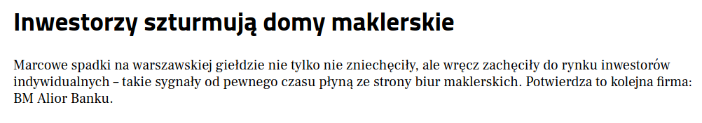

### 2020

Interesujące, ale według mnie groźne. Historycznie okolice dołków oznacza ogromny strach, myślę, polskie "słabe ręce" nadal nie rozumieją w jaki okres gospodarczy wchodzi Polska gospodarka - interwencjonizm państwa w gospodarkę a to daje potencjał dla WIG20 na poziomach ~750PKT

  

Podobne poglądy wyraził również Piotr Kuczyński.

Broker przyznaje, że w marcu założone zostało blisko pięciokrotnie więcej rachunków, aniżeli w styczniu tego roku, z czego ponad 80 proc. w procesach zdalnych. Co więcej, w marcu, w porównaniu do stycznia bieżącego roku, ponad 30-krotnie wzrosła liczba logowań klientów BM Alior Banku do kanałów zdalnych: systemu internetowego, aplikacji pulpit inwestora, aplikacji do notowań czy aplikacji mobilnej Alior Giełda.

W tym czasie ponad 99 proc. zleceń trafiło na giełdę przez kanały online, w tym przede wszystkim za pośrednictwem bankowości elektronicznej oraz aplikacji mobilnej Alior Giełda. Równie dużym zainteresowaniem cieszy się platforma foreksowa Alior Trader, na co wskazuje ponad pięciokrotny przyrost nowych rachunków w marcu w porównaniu ze styczniem tego roku.

Broker postanowił pójść za ciosem i rozpoczął akcję #inwestujzdomu mającą na celu zachęcenie do inwestowania online. BM Alior Banku daje obecnym klientom możliwość otworzenia rachunku za pomocą bankowości internetowej, natomiast osobom niezwiązanym dotychczas z instytucją – założenie go poprzez wniosek internetowy.

- Poprzez szereg działań komunikacyjnych chcemy pokazać klientom, jak wiele mają możliwości inwestowania dzięki naszym platformom. Zależy nam, aby nawet w tym trudnym czasie, mogli wygodnie korzystać z naszych usług przez całą dobę, bez konieczności wychodzenia z domu – wskazuje Jacek Taraśkiewicz, dyrektor BM Alior Banku.

### 1933

<https://en.wikipedia.org/wiki/Executive_Order_6102>

---

<a href="https://github.com/TomaszWaszczyk/historia.waszczyk.com/edit/master/src/content/april-5.md" target="_blank">Edytuj tę stronę dzieląc się własnymi notatkami!</a>
