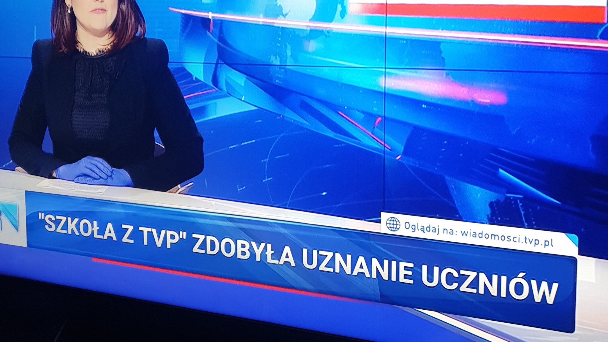

### 2023

Ein technischer Fehler!

Staatliche Zensur, Kontensperrung politischer Gegner oder auch ein Bankrun können für den App-Ausfall vollkommen ausgeschlossen werden. Schliesslich leben die Menschen in Europa in einer Demokratie!

Für alle, die aber Misstrauen äussern gegenüber einer aufkommenden Zentralbankwährung in Form des Digitalen Euros sei gesagt, dass sich niemand Sorgen machen muss! Wer dem Staat und der Zentralbank nur noch ein bisschen mehr Vertrauen schenkt, kann sich schliesslich versichert fühlen, dass sich diese auch um einen kümmern werden. Staatenunabhängiges, zensurresistentes Geld, welches Zugang 24/7 an jedem Ort der Welt gewährt braucht schliesslich kein Mensch!

  

> "Das angekündigte Unity-Update am vergangenen Wochenende hat mal wieder nicht so geklappt wie geplant. Die App funktioniert aktuell gar nicht, das Online-Banking mal ja, mal nein. Der IT-Service muss noch mal zwei Nachtschichten einschieben. Die Kundenreaktionen reichen von Wut und Verzweiflung bis Fatalismus."

---

J. P. Morgan stated about 100 years ago. “Gold is money. Everything else is credit.” And in the words of the American banker and author, Charles R. Morris, "Credit is the air that financial markets breathe, and when the air is poisoned, there’s no place to hide."

### 2022

250 Abramsów dla Polski. Umowa podpisana

---

> Janina Ochojska "Apeluję, żeby NIE PRZEKAZYWAĆ wszystkich środków rządowi polskiemu"

---

Wzrośnie inflacja oraz pojawi się recesja, gdyby Niemcy zrezygnowali z rosyjskiego gazu i ropy.
Najważniejsze, żeby inflacja w Niemczech nie urosła. Co prawda kosztem ukraińskich cywilów, ale nic to.
Liberalnym ekspertom wskaźniki ekonomiczne przesłaniają wszystko.

  

Bloomberg zacytował Sewinga, który na poniedziałkowym briefingu prasowym powiedział, że "jeśli doszłoby do embarga na import - a trzeba o tym pamiętać - to moglibyśmy mówić o inflacji, która przynajmniej tymczasowo byłaby dwucyfrowa".

Prezes banku przewiduje, że w takim wypadku "na stałe pojawi się zjawisko, którego nie widzieliśmy od 30 lat, czyli inflacja długoterminowa".

Największa gospodarka Europy obecnie zmaga się z "gwałtownie" rosnącą inflacją. Według Sewinga Niemcy staną w obliczu "dalszego pogorszenia sytuacji, jeśli dojdzie do wstrzymania importu lub dostaw rosyjskiej ropy i gazu ziemnego"

Bloomberg zinterpretował wypowiedź Sewinga jako "ostrzeżenie".

W niedzielę w internecie zaczęły się pojawiać zdjęcia i materiały wideo przedstawiające masakrę ludności cywilnej z miejscowości Bucza, która została dokonana przez wycofujących się Rosjan. W reakcji na te doniesienia w całej UE zaczęto wzywać do zaostrzenia sankcji przeciwko agresorowi, w tym objęcia nimi ropy i gazu.

Agencja przypomniała, że "inni niemieccy politycy i przedstawiciele wyższej kadry kierowniczej - w tym minister finansów Christian Lindner i prezes ThyssenKrupp Martina Merz - wypowiadali się w podobnych słowach co Sewing". Miało to miejsce przed nagłośnieniem sprawy zbrodni popełnionych w miastach obwodu kijowskiego, w tym w Buczy.

### 2021

Kaczyński: będziemy musieli szybko rozwijać zdolności militarne

Wicepremier Jarosław Kaczyński stwierdził, że Polska będzie musiała szybko rozwijać swoje zdolności obronne, bo świat staje się coraz bardziej niebezpieczny, a „to, co mamy dzisiaj jest niewystarczające”.

Wicepremier i prezes Prawa i Sprawiedliwości był gościem na wirtualnym spotkaniu klubów „Gazety Polskiej”, które odbyło się na portalu społecznościowym Albicla.com, a nagranie z tego wydarzenia zostało wyemitowane w niedzielę w TV Republika. Jarosław Kaczyński mówił m.in. o planach związanych z przyspieszeniem rozwoju gospodarczego, jakie jego zdaniem powinno nastąpić po zakończeniu pandemii koronawirusa.

### 2020

Interesujące, ale według mnie groźne. Historycznie okolice dołków oznacza ogromny strach, myślę, polskie "słabe ręce" nadal nie rozumieją w jaki okres gospodarczy wchodzi Polska gospodarka - interwencjonizm państwa w gospodarkę a to daje potencjał dla WIG20 na poziomach ~750PKT

  

Podobne poglądy wyraził również Piotr Kuczyński.

Broker przyznaje, że w marcu założone zostało blisko pięciokrotnie więcej rachunków, aniżeli w styczniu tego roku, z czego ponad 80 proc. w procesach zdalnych. Co więcej, w marcu, w porównaniu do stycznia bieżącego roku, ponad 30-krotnie wzrosła liczba logowań klientów BM Alior Banku do kanałów zdalnych: systemu internetowego, aplikacji pulpit inwestora, aplikacji do notowań czy aplikacji mobilnej Alior Giełda.

W tym czasie ponad 99 proc. zleceń trafiło na giełdę przez kanały online, w tym przede wszystkim za pośrednictwem bankowości elektronicznej oraz aplikacji mobilnej Alior Giełda. Równie dużym zainteresowaniem cieszy się platforma foreksowa Alior Trader, na co wskazuje ponad pięciokrotny przyrost nowych rachunków w marcu w porównaniu ze styczniem tego roku.

Broker postanowił pójść za ciosem i rozpoczął akcję #inwestujzdomu mającą na celu zachęcenie do inwestowania online. BM Alior Banku daje obecnym klientom możliwość otworzenia rachunku za pomocą bankowości internetowej, natomiast osobom niezwiązanym dotychczas z instytucją – założenie go poprzez wniosek internetowy.

- Poprzez szereg działań komunikacyjnych chcemy pokazać klientom, jak wiele mają możliwości inwestowania dzięki naszym platformom. Zależy nam, aby nawet w tym trudnym czasie, mogli wygodnie korzystać z naszych usług przez całą dobę, bez konieczności wychodzenia z domu – wskazuje Jacek Taraśkiewicz, dyrektor BM Alior Banku.

  

---

Jeśli rząd nie przypomni sobie o dużych firmach, bezrobocie może sięgnąć 25 proc. – uważa znany inwestor giełdowy, który kontroluje grupę Boryszew.

- Przyjęta przez rząd i procedowana właśnie przez parlament tarcza antykryzysowa nie pomoże dużym polskim firmom które mają kłopoty. Ponieważ nie przewidziano dla nich praktycznie żadnego wsparcia, pracę mogą stracić setki tysięcy pracowników. Jeśli te podmioty nie dostaną państwowej pomocy, wkrótce grozi nam ogromne bezrobocie, sięgające nawet 20-25 proc. – mówi Roman Karkosik, przedsiębiorca kontrolujący giełdową grupę Boryszew, jedną z największych w kraju firmę z branży automotive.

Właśnie sektor motoryzacyjny może być jednym z poszkodowanych przez pandemię. Wiele międzynarodowych koncernów z tej branży praktycznie z dnia na dzień przestało działać. Tymczasem polscy producenci podzespołów i części samochodowych, którzy dostarczają swoje produkty tym właśnie światowym firmom odpowiada z około 8 proc. krajowego PKB i ponad 20 proc. naszego eksportu (ponad 30 mld EUR). Ten sektor zatrudnia w Polsce około 150 tys. osób.

- Ponieważ od 1,5 tygodnia stoją wszystkie zakłady produkujące samochody w Europie i nie wiadomo, kiedy zostaną uruchomione, także nasze spółki dostarczające im części są unieruchomione. Pracownicy zostali w domach i czekają na wypłaty, a my czekamy na taką pomoc, jaką dostały tego typu spółki na zachodzie. Bez niej będziemy musieli albo zwolnić załogi, albo zamknąć zakłady, co zresztą na jedno wychodzi – twierdzi Roman Karkosik.

W jego opinii zaproponowany przez władze pakiet pomaga tylko w części problemów, z jakimi borykają się małe firmy, a duże pozostawione praktycznie samym sobie. Konsekwencje pozostawienia tarczy w takim kształcie tego będą dla rządzących ogromne.

Zdaniem Romana Karkosika w pakiecie brakuje następujących elementów:

- Przy zatrzymaniu produkcji państwo powinno wziąć na siebie koszty pracownicze. W Niemczech dla naszych spółek z sektora automotive rząd dofinansowuje od 60 proc. tego typu kosztów, we Francji i Hiszpanii pomoc sięga nawet 100 proc.

- Duże firmy powinny otrzymać „wakacje podatkowe” oraz zwolnienia ze składek ZUS. W ostateczności konieczne jest wydłużenie terminów płatności. Propozycje dla dużych firm nie powinny być gorsze niż te, które otrzymały małe.

- Należy utrzymać limity kredytów bankowych i automatycznie przedłużyć linie kredytowe dla spółek w terminie od 6 do 12 miesięcy.

- Konieczne jest rozwiązanie problemu z ubezpieczeniem transakcji handlowych. Kooperanci mają coraz większe problemy z płynnością i to w całej Europie (coraz trudniej o gwarancje i limity ubezpieczeniowe).

- Procedury pomocowe dla dużych firm powinny być proste, a formalności ograniczone do minimum.

Kontrolowana przez Romana Karkosika grupa Boryszew to zatrudnia łącznie około 8 tys. pracowników, z czego w Polsce około 3,2 tys. Działa nie tylko w segmencie motoryzacyjnym, ale także metalurgicznym oraz chemicznym.

---

W 2015 roku naczelnik publicznie mówił, że na kontach przedsiębiorców znajdują się ogromne ilości pieniędzy, które nie pracują i powinny być inwestowane. Zapowiedział, że wykorzysta zarówno czynniki administracyjne, jak i ekonomiczne aby pieniądze na kontach nie leżały tylko były zainwestowane. Być może to było praprzyczyną okólnika z Kieleckiej skarbówki, aby kontrolować firmy, które mają pieniądze.

Gdy zlikwidujemy większość znaków drogowych to mamy mniej wypadków. Gdy wyłączymy światła na skrzyżowaniach to korki są mniejsze. Gdy policja strajkuje i nie wystawia mandatów ilość stłuczek maleje. Człowiek naturalnie zachowuje się bezpiecznie. Świat jest tak ułożony, że naturalnie gromadzimy zapasy takie, abyśmy przetrwali. Przez tysiące lat ci co nie gromadzili odpowiednich zapasów ginęli. My jesteśmy potomkami tych, którzy gromadzili. Innych potomków nie ma.

Tylko dawniej państwo ze swoim karabinem nie było takie silne. Nie robiło systemu zachęt, przyspieszonej amortyzacji, nie ustalało wysokości stóp procentowych czy kodeksu pracy nakazującego zapłatę za niepracowanie pod groźbą karabinu.

Gdy przedsiębiorca bankrutuje po 2 tygodniach kwarantanny to najczęściej widzę w komentarzach, że co to za przedsiębiorca, który nie ma odłożone pieniędzy na kilka miesięcy. Gdy natomiast pracownik traci pracę to głos jest inny. Wtedy słyszymy co on biedny zrobi.

Oszczędności są ważne. Zgadzam się z tym. Każdy pracownik powinien mieć kilka tysięcy tak, że jak ogłoszą kwarantanne i nie będą mogli pracować to aby przeżyli te kilka miesięcye. To jest naturalne. Problem polega na tym, że mimo braku świadczenia pracy, system narzuca wypłatę pieniędzy. Od pracowników nie wymaga się oszczędności, ale od przedsiębiorców wymaga się, aby mieli na wypłaty odłożone na kilka miesięcy w górę. Ale jak odkłądają to naczelnik mówi, że przedsiębiorcy mają duże oszczędnosci i trzeba je opodatkować, bo leżą bezczynnie w banku, a państwo mogłoby je wydajenij użyć. Tylko one przedsiębiorcom na kontach zalegają. Jak nie kijem uderzyć to marchewką zachęcić.

I mamy chociażby wyrok, który dostał znajomy. Kilka lat temu jego spółka miała jakiś tam spory dochód. On jako udziałowiec większościowy z drugim wspólnikiem uchwalili, że zysk będzie przeznaczony na kapitał zapasowy. Tę decyzję walnego zgromadzenia zaskarżyła trzecia wspólniczna, była żona drugiego wspólnika, której po rozwodzie przypadło kilka udziałów. Młoda sędzina w oparciu o "życiowe doświadczenie" wydała wyrok, że tak dużo kapitału zakładowego nie jest firmie potrzebne i nie można tak krzywdzić mniejszościowego udziałowca i nakazała wypłacić dywidendy. Podatki za tym poszły przeokropne. No bo po co firmie oszczędności. Koledzy kilka dni temu podjęli decyzję o dopłacie do kapitału, aby firma mogła przeżyć. Zgadnijcie który ze wspólników dopłaty nie zrobił. Trudno. Zwindykuje ją pewnie komornik. I tak przelewać CIT-y, dywidendy. Podatki od transferu pieniędzy w jedną stronę, podatki od transferu pieniędzy w drugą. Nawet o poziomie oszczędności w firmie ma prawo decydować 30 letnia sędzina i ona dokładnie wie ile firma powinna mieć gotówki.

A na koniec taka rada. Przedsiębiorcy powinni mieć oszczędności. Schowane, ukryte, zakopane 12 kroków na północ od starego dębu. Firmy niekoniecznie. Gdy firma ma oszczędności to w sytuacji kryzysowej musi je wydać. Gdy nagle lody zaczną być zamrożonym sokiem i będzie trzeba oddać pieniądze to będzie z czego zabierać. Gdy nagle zjawi się była żona wspólnika aby szkodzić, będzie miała na czym się zaspokoić. Gdy Twój pracownik przejedzie po pijanemu zakonnice w ciąży na pasach to naczelnik nie wygra wyborów, ale firma pieniądze straci. Gdy pojawi się jakiekolwiek roszczenie to firma te pieniądze straci. Nie dziwmy się, że firmy oszczędności nie mają. Takie rządy ludzie wybierają. Tak jest system zachęt zbudowany. Tak jest lepiej.

### 1992

Rozpoczęło się trwające do 29 lutego 1996 r oblężenie Sarajewa w czasie wojny domowej w byłej Jugosławii. 4 lata trwała tragedia mieszkańców Sarajewa. 4 lata masakr ludności cywilnej i ostrzałów. Szacuje się, że w mieście w czasie oblężenia zginęło ok. 10 tys.osób. W gronie tym było ponad 1,5 tys. dzieci. Dodatkowo rannych zostało blisko 56 tys. osób, w tym prawie 15 tys. dzieci. Było to najdłuższe i najbardziej krwawe oblężenie w historii…

### 1933

<https://en.wikipedia.org/wiki/Executive_Order_6102>

  

Dear Gold bugs beware "The ides of march" this time around.
Yes, The U.S Government Can Still Confiscate all Gold...

Historically, the government will seize gold when it’s the most valuable, during times when its fiat currency has become utterly devalued. When President Roosevelt made ownership of gold bullions illegal in 1933, the move was preceded by the boom of the Roaring Twenties, then the crash of 1929. Although Roosevelt didn’t call it gold confiscation; he preferred the term “gold hoarding.”

By the 1930s, the US government was facing its most severe financial crisis, and it needed gold (something of value), to stimulate the economy that was running on the fumes of fiat currency. So, it took people’s gold. It was as simple as that. Non-compliance was threatened with severe punishment.

As the banksters pandemic printers go into overdrive, the less valuable their fiat-currency becomes, while gold rises in value. A desperate government might very well begin to eye private gold, yet one more time, as the solution to its problems.

The more power (gold) the government claims, the less power(gold) lies within the hands of its citizens. With the “everything bubble” only getting bigger and bigger, will the world banksters want gold to be under its control or under the control of its citizens?
Time will tell… 

PS: The ides of march was notable for the Romans as a deadline for settling debts.

### 1925

W Ostrowcu Świętokrzyskim urodził się Jerzy Kędziora (zdjęcie) funkcjonariusz Ministerstwa Bezpieczeństwa Publicznego, jeden z najbardziej okrutnych oficerów śledczych, zbrodniarz stalinowski. 
Jest absolwentem szkoły powszechnej i gimnazjum we Lwowie. Podjął tam również naukę w Gimnazjum Handlowym, którego nie ukończył. W roku 1943 wstąpił w szeregi Gwardii Ludowej. Został członkiem grupy bojowej przy Sztabie Głównym Oddziału II Gwardii Ludowej. Rok później rozpoczął służbę w Ludowym Wojsku Polskim. W maju 1945 roku został uczniem Centralnej Szkoły Ministerstwa Bezpieczeństwa Publicznego. Już po miesiącu w pionie śledczym. Od roku 1950 został kierownikiem Sekcji I Wydziału II. Trzy lata później został uczestnikiem Wyższego Kursu Przeszkolenia Oficerów Bezpieczeństwa. W drugiej połowie lat 40. dwukrotnie odznaczony Srebrnym Krzyżem Zasługi. 
Prowadził sprawy kierownictwa Delegatury Sił Zbrojnych i Zrzeszenia Wolność i Niezawisłość. Przesłuchiwał między innymiEdwarda Bzymek-Strzałkowskiego– szefa Brygad Wywiadowczych DSZ-WiN, podpułkownika Łukasza Cieplińskiego, majora Hieronima Dekutowskiego-Zaporę, Władysława Jedlińskiego – oficera wywiadu AK, po wojnie kierownika sieci informacyjnej IV Zarządu Głównego WiN, czy pułkownika Franciszka Niepokólczyckiego. 
Słynął z brutalności, co w roku 1955 wywarło ogromny wpływ na jego karierę w bezpiece. Na fali odwilży, po śmierci Stalina, jego przełożeni wyciągnęli na światło dzienne sprawę pobicia podczas przesłuchania Wacława Dobrzyńskiego, podczas okupacji niemieckiej oficera Sztabu Głównego AL, po wojnie naczelnika wydziału w IV Departamencie MBP, w wyniku czego Dobrzyński zmarł. Pod pretekstem zatajenia przynależności do Polskiego Związku Powstańczego został przeniesiony do Departamentu Szkolenia MBP. W lipcu 1955 został wydalony z szeregów bezpieki, a w styczniu 1956 roku skazany przez Sąd Wojewódzki dla miasta stołecznego Warszawy na trzy lata więzienia z czego odsiedział zaledwie kilka miesięcy. 
Od kilkudziesięciu lat Jerzy Kędziora jest na emeryturze i pobiera wysoką, „resortową” emeryturę. Dopiero kilka lat temu Urząd do Spraw Kombatantów i Osób Represjonowanych pozbawił go uprawnień kombatanckich, będących uhonorowaniem szczególnych zasług dla Polski.

  

### 1919

W czasie wojny bolszewickiej żołnierze 34 pułku piechoty pod dowództwem majora Aleksandra Łuczyńskiego dokonali masakry Żydów w zajetym miesiąc wcześniej Pińsku. Pod ścianą katedry rozstrzelano wówczas 35 osób.

  

### 1883

Dwaj polscy naukowcy z Uniwersytetu Krakowskiego Zygmunt Wróblewski i Karol Olszewski jako pierwsi na świecie dokonali skroplenia tlenu. 8 dni później udało im się skroplić wodór stosowany dziś powszechnie w paliwach rakietowych.

  

### 1573

Otwarty został w Warszawie pierwszy most stały przez Wisłę zwany też mostem mistrza Erazma nazwany tak od imienia jego konstruktora Erazma Cziotko z Zakroczymia.
Budowę tej konstrukcji rozpoczęto w 1567 roku. Most miał 500 metrów długości i był przedłużeniem ulicy Mostowej od strony Pragi.
Inicjatorem budowy mostu Erazma był sam król Zygmunt II August, który Warszawę leżącą na szlaku Wilno-Kraków obrał sobie za miejsce spotkań sejmów. Po śmierci króla patronat nad budową objęła jego siostra i żona króla Stefana Batorego Anna Jagiellonka.
W 1576 roku most został poważnie uszkodzony, ale król Stefan Batory postanowił sobie za cel jego odbudowę. Drewno do tego celu spławiano Sanem aż z Bieszczad. Odbudowę ukończono w 1582 roku.
Pragnąc zwrócić skarbowi niemałe koszty budowy, Batory wprowadził pobieranie opłaty za przejazd, czyli tzw. mostowego. Oto fragmenty jego rozporządzeń na ten temat:
" A iż ta teraz naprawa i kończenie mostu silnego nakładu potrzebuje, tedy potrzeba jest tego, którybykolwiek przez most jechać chciał, aby mostowe tak jako przewóz płacił, żadnego któregokolwiek stanu, dostojeństwa albo przełożeństwa człowieka stąd nie wyjmując...
... a jeśliby kto więc takim płaceniem mostowego się obrażał, tedy będą łodzie przewoźne gotowe, zaczem mu wolno będzie nie przez most jechać, ale się w łodziach przewieźć..."
Historia tej budowli nie trwała jednak długo, ponieważ w 1603 roku został on całkowicie zniszczony przez powódź. Dopiero w 1864 roku otwarto kolejny stały most. Tym razem była to konstrukcja stalowa czyli Most Kierbedzia.

  

### 1566

Delegacja szlachty niderlandzkiej przybyła do hiszpańskiej namiestniczki Niderlandów Małgorzaty Parmeńskiej aby przedstawić petycję (tzw. „kompromis brukselski”) z żądaniami reform. Jeden z dostojników namiestniczki nazwał wówczas delegatów żebrakami (franc. gueux), od czego wziął swą nazwę ruch wyzwoleńczy – gezowie.
Małgorzata - przyrodnia siostra króla Filipa II - była namiestnikiem Niderlandów, należących wówczas do Hiszpanii. Sytuacja w prowincji nie była najlepsza. Reformacja odnosiła znaczne sukcesy, a mieszkańcy północnych części prowincji masowo przyjmowali kalwinizm. Zamierzeniem Filipa II była rekatolicyzacja tych terenów, jednak - mimo wykorzystania radykalnych środków - szło to dosyć opornie.
Pod koniec 1565 roku przedstawiciele szlachty niderlandzkiej podpisali kompromis brukselski, pomiędzy katolickim południem i protestancką północą, a w kwietniu 1566 udali się do namiestniczki z żądaniem zaprzestania prześladowań. Gdy doszło do wyczekiwanego spotkania, jeden z dostojników hiszpańskich powiedział o przybyłych: "Ce n'est qu'un tas de gueux" - "To tylko gromada żebraków".
Gdy wkrótce później wybuchło antyhiszpańskie powstanie, powstańcy przybrali ową szyderczą nazwę "żebraków" i zjednoczeni pod symbolem żebraczej torby, wywalczyli dla swojego kraju niepodległość.

  

---

<a href="https://github.com/TomaszWaszczyk/historia.waszczyk.com/edit/master/src/content/april-5.md" target="_blank">Edytuj tę stronę dzieląc się własnymi notatkami!</a>
