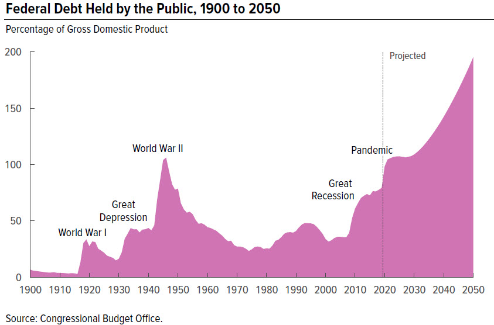
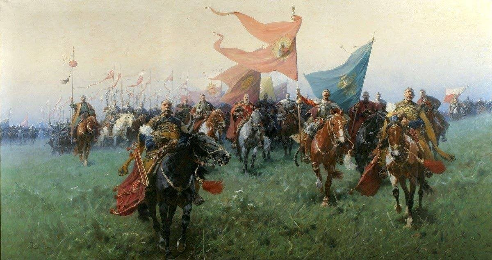
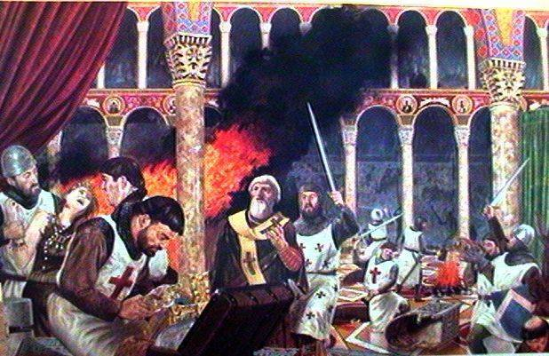
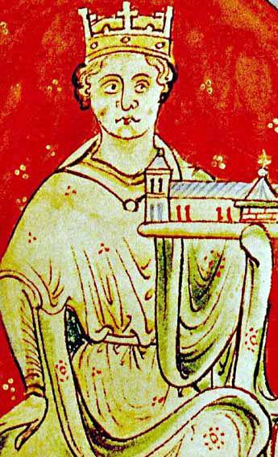

### 2022

Miedwiediew: Celem jest zbudowanie Eurazji od Lizbony po Władywostok

Dmitrij Miedwiediew, zastępca sekretarza Rady Bezpieczeństwa Rosji, były prezydent kraju i sojusznik prezydenta Władimira Putina zabrał głos w sprawie masakry w Buczy. Zapowiedział, że celem rosyjskiej operacji jest "możliwość zbudowania wreszcie otwartej Eurazji - od Lizbony po Władywostok".

W rosyjskiej agencji informacyjnej RIA Novosti pojawił się w niedzielę felieton Timofieja Siergiejcewa zatytułowany "Co Rosja powinna zrobić z Ukrainą".

Autor pisze o potrzebie "deukrainizacji". Przekonuje, że Ukraina musi być pozbawiona suwerenności na co najmniej jedno pokolenie, a "naziści, którzy wzięli broń, muszą zostać zabici w jak największej liczbie".

Siergiejcew uważa, że konieczne jest wyeliminowanie ukraińskiej elity politycznej, ponieważ "nie można jej reedukować". "Zwykli Ukraińcy muszą doświadczyć wszystkich okropności wojny i wchłonąć to doświadczenie jako lekcję historii i zadośćuczynienie za swoją winę" - przekonuje.

"Ukraińskość jest sztucznym antyrosyjskim konstruktem bez własnej treści cywilizacyjnej, podporządkowanym elementem obcej i obcej cywilizacji. Sama debanderyzacja nie wystarczy do denazyfikacji (…) denazyfikacja Ukrainy to także jej nieuchronna deeuropeizacja" - uważa Siergiejcew.

O demilitaryzacji i denazyfikacji Ukrainy pisze natomiast we wtorek były prezydent Dmitrij Miedwiediew. 

"Tych skomplikowanych zadań nie da się wykonać z dnia na dzień. I nie będą one rozwiązywane wyłącznie na polu walki. Najważniejszym celem jest zmiana krwawej i pełnej fałszywych mitów świadomości części dzisiejszych Ukraińców. Celem jest pokój dla przyszłych pokoleń samych Ukraińców i możliwość zbudowania wreszcie otwartej Eurazji - od Lizbony po Władywostok" - przekonuje.

Wcześniej Miedwiediew dodaje, że masakra Buczy była inscenizacją, podobnie jak atak na szpital położniczy w Mariupolu.  

### 2021

  

---

> Czy wiesz że na równoważnik 380PLN w 1990 trzeba było pracować na minimalnym wynagrodzeniu ponad 10 miesięcy? Dziś niecałe 3 dni. W 1990r można było kupić dobra o wartości rynkowej 10 miesięcznych minimalnych wynagrodzeń, dziś zaś o wartości rynkowej 3 dni pracy na tym wynagrodzeniu. Uwzględniając deflacyjny charakter rozwijającego się rynku to przy stałej ilości pieniądza rozbieżność powinna być w drugą stronę co jeszcze bardziej uzmysławia skalę odbierania użytkownikom waluty ich wypracowanych owoców pracy przez emitenta waluty.

---

### 2020 - pomoc dla firm w które koronawirus uderzył wprost

Pisze to, czego nie dowiecie się w TVP! Wczoraj zadzwonił do mnie Maciek. Mój znajomy prowadzi firmę w Polsce (zatrudnia 22 osoby) i w Niemczech (nie zatrudnia nikogo- firma ma minimalne obroty i księgową, którą dostał od państwa na dwa lata za darmo). W Polsce do tej pory nie otrzymał żadnej pomocy. Jest bliski bankructwa i zwolnienia ludzi. Mówi, że ta tarcza to tylko propaganda i że to zwykłe oszukiwanie ludzi.
Wczoraj zadzwoniła do niego księgowa z Niemiec.
-Panie Maćku, czekają na Pana pieniądze.
-Jakie pieniądze?
-Rząd Niemiecki przelał Panu pierwszą pomoc.
-Ale ja nikogo nie zatrudniam!
-Pomoc należy się każdemu, kto zatrudnia do 10 pracowników. Pan pracuje sam, więc zatrudnia Pan do 10 pracowników. Jeśli zatrudniałby Pan powyżej 10 pomoc byłaby znacznie wyższa.
-To ile jest ten pomocy?
-14.000 euro.
-To pożyczka?
-Nie. To pieniądze, żeby Pan przetrwał.
I jeszcze jedno. To pomoc tylko za marzec!!!
Gdyby Pan zatrudniał powyżej 10 osób otrzymałby Pan 44.000 euro.

I teraz epilog.
-W Polsce dla firmy, która zatrudnia 22 osoby realnie 0 pomocy!
-W Niemczech dla firmy, która nie zatrudnia nikogo 14.000 euro tylko za marzec! Bez żadnych formalności!!!

Państwo Niemieckie korzystając z koniunktury odkładało pieniądze na kupkę w ciągu ostatnich 5 lat. Nasz rząd przepuścił wszystkie oszczędności. Dzisiaj rząd niemiecki wstawi niemieckie firmy do lodówki. Za 6-8 miesięcy bedą działały tak jak dzisiaj. Polskie w tym czasie zbankrutują, ponieważ polski rząd wydał wszystko co miał. Układ w samej Europie zmieni się diametralnie. Na niekorzyść Polski. To jest dramat i wyzwanie, przed którym stoimy. To jest sytuacją, w którą Polaków władował Kaczyński. W ciągu 5 lat przetańczyli całe polskie oszczędności na nagrody, limuzyny i stołki. Wiele rządowych programów też było robionych bez głowy. Jakby jutra miało nie być. Dziś te pieniądze powinny służyć na ratowanie miejsc pracy. To zwykła zdrada.

  

---

Jeśli w trakcie kryzysu czerpie się informacje wyłącznie ze środków masowego przekazu, perspektywa może być zniekształcona. Można odnieść wrażenie, że cały świat uznał życie w zamknięciu za jedyną metodę kontroli rozprzestrzeniania się koronawirusa i minimalizowania śmiertelności. Jednak nie bierze to pod uwagę faktycznej obecnej opinii wielu lekarzy.

Setki profesorów związanych z Yale University wystosowało list do Białego Domu. Podpisało go 800 licencjonowanych profesjonalistów, zajmujących się przede wszystkim epidemiologią i medycyną. Nie uznałbym tego za traktat wolnorynkowy, żeby było jasne, i w pewnych punktach nie zgadzam się z tym listem.

---

"Spain is moving to implement a universal basic income as a measure to help workers battered by the coronavirus pandemic. Nadia Calviño, the country's minister for economic affairs, told Spanish broadcaster La Sexta on Sunday evening that the government is planning to introduce it as part of a barrage of policies to help people get back on their feet."

---

FED nalega na transakcje REPO w większości lokalnych banków centralnych.

---

#### Propaganda

  

---

Jarosław Gowin był obrońcą polskiej klasy średniej. Dlatego głosował za zwiększaniem opodatkowania tej grupy społecznej.

Jarosław Gowin był wolnorynkowcem, zwolennikiem niskich i prostych podatków. Dlatego głosował za podwyższaniem podatków, za komplikowaniem ich, za doprowadzeniem do tego, że mamy najbardziej skomplikowany VAT w całej Europie, a gorszy od naszego system podatkowy w całym OECD ma tylko Francja.

Jarosław Gowin był też zwolennikiem dyscypliny budżetowej i niskich wydatków socjalnych. Dlatego głosował za 13 emeryturą i 500+ na każde dziecko.

Jarosław Gowin był przeciwnikiem walki na rympał z Sądem Najwyższym. Dlatego głosował za reformą sądownictwa. Ale się nie cieszył!

Jarosław Gowin jest przeciwnikiem głosowania korespondencyjnego. Dlatego zagłosuje - uwaga - przeciwko. Ale za to będzie namawiał swoich kolegów z partii, żeby zagłosowali za.

Jarosław Gowin na znak protestu odszedł z rządu. Ale zostaje w koalicji i chce aby wicepremierem była jego koleżanka Jadwiga Emilewicz.

Jarosław Gowin jest za a nawet przeciw. Nie chciał, ale musiał. Człowiek z kręgosłupem z żelaza. Lech Wałęsa naszego pokolenia.

---

„Arabska legenda mówi, że Bóg zesłał na
ziemię dżumę i kazał jej zabrać dziesięć
tysięcy istnień ludzkich. Kiedy dżuma
wróciła, okazało się, że liczba zmarłych
sięgnęła pięćdziesięciu tysięcy.
- Dlaczego to zrobiłaś? – spytał z wyrzutem
Najwyższy. – Przecież mówiłtem ci o
dziesięciu tysiącach.
- Ja wzięłam, jak kazałeś, Panie, dziesięć
tysięcy – odparła dżuma. – Czterdzieści
tysięcy zabrał strach."

---

Historia się powtarza. Ludzie, pod wpływem fałszywej nauki wtłaczanej im w szkołach myślą, że Republika Weimarska (państwo niemieckie powstałe po I wojnie światowej) oraz III Rzesza to 2 osobne byty. Z prawnego punktu widzenia było to dokładnie to samo państwo demokratyczne o nazwie Deutsches Reich (Rzesza Niemiecka). Wszystkie działania Hitlera były prawnie umocowane w konstytucji oraz innych prawach. Jak więc nastąpiło to przejście do totalitaryzmu? W nocy z 27 na 28 lutego 1933 został podpalony Reichstag. W odpowiedzi na poczucie zagrożenia u Niemców prezydent Hindenburg wprowadził dekret "o ochronie narodu i państwa", który wprowadził stan wyjątkowy. Ten stan wyjątkowy, sukcesywnie przedłużany do 1945, dał Hitlerowi podstawy do likwidacji wszelkich przejawów wolności w Niemczech.

Można się zastanawiać jak doszło do tego, że, w imię obrony przed urojonym zagrożeniem naród Niemiecki zgodził się na oddanie wszystkich swoich wolności. Jeśli ktoś tego nie rozumie - dokładnie ta sama historia powtarza się dziś w Polsce. W imię walki z koronawirusem Polacy ochoczo godzą się na oddanie swojej podstawowej wolności i wprowadzanie państwa policyjnego. Każde wyjście z domu jest zagrożone mandatem wystawianym na podstawie arbitralnej decyzji napotkanych policjantów. Wysokość kar jest absurdalna, zwłaszcza w stosunku do zarobków. Powody jeszcze bardziej aburdalne - biegając po lesie w celu poprawy kondycji jesteśmy przestępcami. Staliśmy się więźniami własnych domostw. I, tak jak w III Rzeszy, funkcjonujemy w stanie wyjątkowym, w miarę potrzeb sukcesywnie i bez końca przedłużanym.

Na zdjęciu płonący Reichstag.

  

### 2004

Zakończyła się trwająca cztery dni obrona ratusza w irackim mieście Karbala, operacja znana również jako obrona City Hall. Była to seria potyczek między oddziałami rebeliantów pod dowództwem szyickiego przywódcy religijnego Muktady-as Sadra, a polskimi i bułgarskimi żołnierzami Wielonarodowej Dywizji Centrum-Południe pod dowództwem podpułkownika Tomasza Domańskiego i kapitana Grzegorza Kaliciaka.
Początek walk przypadł na jedno z najważniejszych świąt szyickich-święto Aszura. Wobec faktu, iż do miasta zaczęły ściągać olbrzymie ilości pielgrzymów, komendant miejscowej policji irackiej poprosił o pomoc. Jeszcze tego samego dnia wieczorem przybyły z bazy "Juliet" polskie siły szybkiego reagowania. Pierwsze walki rozpoczęły się około godziny pierwszej po północy. Na miejsce walk przybył również bazy "Lima" pluton sił szybkiego reagowania z zapasem amunicji oraz trzema lekko opancerzonymi samochodami Honker, 12 żołnierzami w samochodzie Star z plutonu ochrony kompanii logistycznej 17 WBZ, a także sanitarka z pielęgniarką. Przybyli żołnierze do ratusza, dostając się następnie w środek ciężkich walk o budynek. Tymczasem zmieniły się rozkazy i oddział z bazy „Juliet” dostał polecenie natychmiastowego powrotu do bazy „Charlie” w Al-Hilla. W ratuszu pozostało 14 polskich żołnierzy, pielęgniarka, 3 Honkery, 1 samochód ciężarowy Star oraz 8 żołnierzy bułgarskich z bazy „Kilo”, jak również dwa bułgarskie pojazdy opancerzone BRDM-2.
Następnego dnia (4 kwietnia 2004 roku) w wyniku zakrojonej na szeroką skalę serii zamachów dokonanych przez oddziały Armii Mahdiego, w wyniku których śmierć poniosło 140 irackich cywilów, Polacy i Bułgarzy zostali zmuszeni do przygotowania stanowisk w ratuszu. Sytuację komplikował fakt masowej dezercji oddziałów irackiej policji, obsadzającej wraz z Polakami i Bułgarami ratusz.
W nocy doszło do zainicjowanego przez Szyitów starcia z Polakami i Bułgarami, w którego następstwie śmierć poniosło 80 rebeliantów. Strony polska i bułgarska nie poniosły żadnych strat w ludziach.
Kolejne trzy dni były serią nieustannych ataków szyickich, które były skutecznie odpierane przez polsko-bułgarskie wojska. Jedynie w wyniku ostrzału moździerzowego na dachu budynku City Hall ranny został jeden z żołnierzy bułgarskich. Ze względu na przewagę ogniową obrońców, rebelianci atakowali prawie wyłącznie nocami.
Po czterech dniach wyczerpujących walk z pomocą przybli na miejsce 18 Bielskiego Batalionu Desantowo-Szturmowego. Wykrwawieni rebelianci zostali zmuszeni do wycofania się.
Zastanawiającą ciekawostką jest fakt, że bitwa ta nie znalazła się z początku z szerszym zainteresowaniem polskich mediów. Dopiero cztery lata później w Gazeta Wyborcza zamieściła wywiad z kilkoma weteranami. Niektórzy z nich zostali odznaczeni Gwiazdą Iraku. W 2009 r. kpt. Kaliciak otrzymał Krzyż Kawalerski Orderu Krzyża Wojskowego, a w 2015 (wraz z częścią innych obrońców City Hall) Krzyż Wojskowy.
Podczas obchodów 15 rocznicy tej bitwy prezydent Andrzej Duda powiedział "Rzeczpospolita przez te 15 lat zbiera plony waszej wspaniałej postawy"

### 1994

Rozpoczęło się ludobójstwo w Rwandzie. W zaledwie ok. 100 dni bestialsko zamordowano od 800 tysięcy do nawet ponad miliona Rwandyjczyków których jedyną winą był niewłaściwy wpis w dowodzie osobistym.
Egzaminu z człowieczeństwa nie zdało wtedy też ONZ oraz Kościół Katolicki.

### 1990

Na mocy ustawy podjętej przez rząd Tadeusza Mazowieckiego po 45 latach przestała istnieć Milicja Obywatelska. W jej miejsce powołano nową służbę o nazwie Policja Państwowa.

### 1945

Ministerstwo Bezpieczeństwa Publicznego powołało tzw. Centralne Obozy Pracy. Powstały one na terenach jenieckich obozów niemieckich. Obozy stworzono w Warszawie, Krzesimowie, Potulicach i Jaworznie. Trafiali do nich głównie Ukraińcy schwytani podczas akcji "Wisła".
Na zdjęciu obóz pracy w Jaworznie.

  

### 1939

W Londynie polski minister spraw zagranicznych Józef Beck (zdjęcie) podpisał układ, który miał być gwarancją bezpieczeństwa Polski i sojuszem na wypadek wojny z Niemcami. Układ ten stał się podstawą do głównego układu sojuszniczego, który podpisano 25 sierpnia 1939 roku, a który był odpowiedzią na pakt Ribbentrop- Mołotow.
Układy polskie z Wielką Brytanią stały się dla Hitlera pretekstem do wypowiedzenia 28 kwietnia polsko-niemieckiego układu o nieagresji z 1934 roku.

  

### 1917

USA przystąpiły do I wojny światowej.

I wojna światowa zdziesiątkowała Europę i pozostawiła po sobie głębokie blizny. Każdego roku we Francji archeolodzy wykopują broń, rzeczy osobiste oraz szczątki żołnierzy, którzy walczyli i zginęli na polu bitwy. Są wśród nich Francuzi, Brytyjczycy, Niemcy, ale także Amerykanie, którzy przybyli do Francji w latach 1917-1918, by walczyć ramię w ramię z aliantami. Te wszystkie wykopaliska rzucają nowe światło na mało znany rozdział historii. Dlaczego Amerykanie zdecydowali się przekroczyć Atlantyk i walczyć przeciwko Niemcom? I w jaki sposób USA ukształtowało swą własną przyszłość poprzez włączenie się w ten konflikt?

W 1917 roku francuskie i angielskie oddziały od trzech lat grzęzły w okopach, wyczerpane i dręczone głodem. Ich sytuacja pogarszała się z każdym miesiącem. Wojna z perspektywy frontu zachodniego wydawała się nie mieć końca, a morale żołnierzy dawno osłabło. Wtedy jednak pojawił się cień szansy na to, że historia tego okrutnego konfliktu może się zmienić niemalże z dnia na dzień – Ameryka przystąpiła do wojny.

Żołnierze amerykańscy, wyruszając za ocean myśleli, że będzie to wielka, ale krótka przygoda. Wkrótce jednak przekonali się, że walki na zachodnim froncie niosą za sobą cierpienie, ból i masową rzeź, bez konkretnej perspektywy zwycięstwa. Badania szczątków żołnierzy niemieckich odnalezione na cmentarzu w miejscowości Boult-sur-Suippe we Francji potwierdzają, że działania zbrojne w tamtym okresie były bardzo brutalne.

Co skłoniło Prezydenta Stanów Zjednoczonych Woodrowa Wilsona, by wysłać rzesze rodaków na śmierć, choć początkowo sprzeciwiał się udziałowi USA w konflikcie? 7 maja 1915 roku luksusowy transatlantyk Lusitania z ponad 2 tys. pasażerów na pokładzie, w tym Amerykanami, został storpedowany przez niemieckiego U-boota. Rok później na wyspie Black Tom w Jersey City w Stanach Zjednoczonych doszło do eksplozji, która, jak ustalił wywiad, była efektem ataku terrorystycznego, przeprowadzonego przez niemieckich agentów. Po wprowadzeniu przez Niemcy tzw. nieograniczonej wojny podwodnej, polegającej na zatapianiu wszystkich obcych jednostek znajdujących się na ich wodach oraz przechwyceniu przez Brytyjczyków zaszyfrowanego telegramu, w którym Niemcy proponowały Meksykowi sojusz przeciw Stanom Zjednoczonym, cierpliwość Wilsona i amerykańskiej opinii publicznej się skończyła. 

Armia amerykańska była mała i niedoświadczona, należało więc zasilić jej szeregi nowymi rekrutami. Jednak niewielu obywateli amerykańskich chciało dobrowolnie iść na wojnę. Nie pomogła nawet szeroko zakrojona kampania. W końcu na skutek wydanego przez prezydenta aktu, setki tysięcy żołnierzy zostało zwerbowanych do wojska i wyruszyło do Francji, by wesprzeć aliantów. Doświadczyli najgorszego. W ciągu zaledwie siedmiu miesięcy 53 tys. z nich zginęło, 234 tys. zostało rannych, a 4,5 tys. zaginęło.

Bez udziału Amerykanów I wojna światowa mogła zakończyć się zupełnie inaczej. Oni okazali się być niekwestionowanymi rzemieślnikami zwycięstwa sił alianckich i podnieśli swój kraj do rangi wiodącej siły militarnej i gospodarczej.

  

### 1807

Powstała Legia Polsko-Włoska. Składała się ona z polskich jeńców służących w armii pruskiej,którzy trafili do francuskiej niewoli w 1806 roku. W jej skład weszli również żołnierze, którzy służyli jeszcze w stworzonych wcześniej Legionach Polskich we Włoszech. Legia składała się z 3 pułków piechoty i 1 jazdy pod ogólnym dowództwem gen. Józefa Grabińskiego. Licząca ok. 7 000 ludzi jednostka została 31 marca 1808r. przeformowana w Legię Nadwiślańską na żołdzie francuskim i wysłana za Pireneje na toczącą się tam eojnę z Hiszpanią i Portugalią, zaś gen. Grabiński zrezygnował z dowództwa.
W dekrecie napoleońskim czytamy:
" My Napoleon, cesarz Francuzów postanowiliśmy i stanowimy co następuje:

- Utworzony będzie pułk polskich lansjerów (...)
utrzymywany będzie ze skarbu cesarskiego i ma składać się z 4 szwadronów po 300 ludzi (...) łącznie 1200 lansjerów,
- Legia Polska piesza również płatna ze skarbu
cesarskiego, będzie podniesiona do 6 batalionów w trzech pułkach po 9 kompanii w batalionie i po 150 ludzi w kompanii, łącznie 8100 ludzi i 100 w sztabie,
- Obie polskie formacje mają być skoncentrowane z zakładami we Wrocławiu pod kontrolą i nadzorem
ks. Hieronima (...),
- Dyrektor wojny w Warszawie (...) skieruje do
Wrocławia dla skompletowania tych pułków rekrutów z Polski (...) oraz przyśle do ks.
Hieronima listę nazwisk oficerów dla tej nowej
formacji uwzględniając na niej tych Polaków, którzy dawniej służyli w Legiach Włoskich i Naddunajskiej
(...)”.

  

### 1617

II wojna polsko-rosyjska: początek wyprawy wojsk królewicza Władysława Wazy na Moskwę (pod dowództwem hetmana Jana Karola Chodkiewicza).
Wyprawa Władysława IV na Moskwę była efektem wieloletnich zmagań polsko – moskiewskich, związanych z tzw. dymitriadami oraz okresem wielkiej smuty. W wyniku zawirowań politycznych ostatecznie zaproponowano objęcie tronu moskiewskiego Władysławowi IV – jednak zamierzenia tego nie zrealizowano, carem zaś mianowany został Michał Romanow. Niemniej strona polska nie uznawał Romanowa, i twierdziła że Władysławowi IV należą się pełne prawa do tronu moskiewskiego. Polityczne próby zakończenia konfliktu nie dawały rezultaty i w związku z tym zrodziło się przekonanie, iż tylko zbrojna wyprawa może wymóc traktaty pokojowe na Moskwie. W 1616 roku król Zygmunt III uzyskał zgodę szlachty na jej organizacje. Nie bez znaczenia w niej był udział starosty śremskiego Piotra Opalińskiego, właściciela Sierakowa.
W połowie marca 1617 roku odbyła się konwokacja senatorska, na której dokonano zaprzysiężenia komisarzy mających towarzyszyć królewiczowi.
Było ich ośmiu: kanclerz wielki litewski Lew Sapieha; biskup łucki Andrzej Lipski; kasztelan sochaczewski Konstanty Plichta; kasztelan bełski Stanisław Żórawiński, starosta mozyrski Baltazar Strawiński; wojewodzic lubelski Jakub Sobieski; starosta śremski Piotr Opaliński i Andrzej Męciński z Kurozwęk. Kompletowano również dwór królewski na wyprawę oraz wojska. Dowództwo nad wyprawą król Zygmunt III powierzył hetmanowi wielkiemu litewskiemu Janowi Karolowi Chodkiewiczowi.
Wyprawa na Moskwę wyruszyła 6 kwietnia przy niezwykle szumnym i barwnym wyjściu z Warszawy. Trasa wyprawy wiodła początkowo przez Lublin, Krasnystaw i Włodzimierz Wołyński, do Łucka, gdzie oczekiwano przybycia pozostałych wojsk. Ostatecznie zgromadzono następujące siły: 10 chorągwi husarskich (1050 koni), 8 kozackich (900 koni), 2 rajtarskie (400 koni) i 11 oddziałów piechoty ( 2600 ludzi). 22 czerwca wojska opuściły Łuck idąc pod Krzemieniec nad rzeką Wilią, gdzie zatrzymano się ze względu na zagrożenie inwazją ze strony Turcji. Po kilku dniach ruszono dalej i 11 lipca wojska osiągnęły Horyń pod Lachowcami gdzie następnie skierowano się na Smoleńsk, w którym królewicza oczekiwał Chodkiewicz. W tym czasie siły wyprawy zostały uszczuplone, ponieważ cały czas istniało zagrożenie inwazji tureckiej na południowe ziemie Rzeczypospolitej. Przy królewiczu zostały 4 chorągwie husarskie ( 450 koni), 4 kozackie (400 koni), 2 rajtarskie (400 koni) i 9 oddziałów piechoty (2200 ludzi). W tym czasie Chodkiewicz rozpoczął działania zaczepne i przystąpił do oblężenia twierdzy Dorohobuż. Jego siły liczyły około 4200 żołnierzy w tym 1000 lisowczyków oraz 600 kozaków dońskich. 27 września siły królewicza dotarły do Smoleńska i założyły obóz – wysłano jednocześnie Chodkiewiczowi na pomoc piechotę niemiecką w sile 600 ludzi. Podczas rady wojennej podjęto decyzję o utrzymaniu oblężenia Dorohobuża i 4 października całość wojsk tam się udała, i nastąpiło połączenie sił. Łącznie armia królewska liczyła około 8 tyś. żołnierzy.
Na widok połączonych sił polskich obrońcy twierdzy podjęli decyzje o poddaniu jej Władysławowi. Po ustaleniu warunków kapitulacji bramy miasta otwarto 11 października, do którego wkroczyli Polacy. Część wojsk moskiewskich w liczbie około 70 bojarów i 1000 żołnierzy przeszła na stronę królewską. Jednak sytuacja nie była korzystna – zaczęły się pierwsze przymrozki, brakowało żywności oraz pieniędzy na żołd dla wojska. Rosjanie w tym czasie mieli również ogromne problemy w zorganizowaniu obrony oraz wyprawy odwetowej – brakowało pieniędzy na wojsko, żywności, broni, buntowała się ludność, grasowały bandy kozaków dońskich sprzyjających Polakom. Na wieść o kapitulacji Dorohobuża – załoga kolejnego grodu Wiaźmy, wpadła w panikę i uciekła do Moskwy, pozostawiając go bez całkowitej obrony. Pozostawienie samemu sobie mieszkańcy wysłali poselstwo od Władysława z ofertą swego poddaństwa. Polacy zaskoczeni takim obrotem spraw szybko ruszyli w jego kierunku i 29 października odbył się uroczysty wjazd królewicza do miasta. Na stronę Władysława przechodzili liczni poddani cara Michała Fiedorowicza: bojarzy, dworianie, dzieci bojarskie, strzelcy i inni. Dużą liczbę stanowili również kozacy moskiewscy.
Na wieść o zajęciu Wiaźmy przez Polaków, załoga kolejnego ważnego grodu Możajska również uciekła w popłochu pozostawiając go bez obrony. Chodkiewicz chciał zająć Możajsk, jednak nie zdołał przekonać żołnierzy, którzy szemrali na niedostatek żywności, nędzę oraz brak żołdu.
Rosjanie zdołali się jednak otrząsną i podjęli kontrofensywę – do Możajska wysłano korpus pod dowództwem kniazia Borysa Łykowa liczący 6 tys. żołnierzy a do Wołokołamska kniaziów Dymitra Czerkasskiego i Wasyla Achmaszukowa Czerkasskiego z 5 tyś. wojska. Ci szybko je obsadzili, ufortyfikowali i pobudowali ostróżki.
Jeszcze spod Dorohobuża Chodkiewicz wyprawił lisowczyków pod dowództwem Czaplińskiego w stronę Kaługi, aby tam przeciągnąć na stronę Polską okolicznych kozaków lub ich rozbić, aby uniemożliwić przejście na stronę moskiewską. Zdobył Mieszczkowsk a następnie Kozielsk, gdzie urządził swą główna kwaterę. Jego wojsko liczyło około 3000 ludzi – wliczając to Kozaków moskiewskich oraz różnego rodzaju awanturników. Kaługa była ważnym strategicznym punktem na drodze do Moskwy i w celu jej obrony car wysłał 18 października kniazia Dymitra Pożarskiego i wojewodę Afanasija Gagarina. W wyniku różnych zabiegów jego siły wynosiły około 6000 ludzi.
Chodkiewicz posłał pod Kaługę Piotra Opalińskiego na czele dwóch chorągwi husarskich i jednej rajtarskiej (razem 400 ludzi). Opaliński przykazane miał połączyć się z lisowczykami a następnie odcinać Pożarskiemu dostawy żywności i nękać go wszelkimi dostępnymi sposobami. Po przybyciu w rejon działań Opaliński postawił silny ostróżek pod Towarkowem, skąd wysyłał swoich ludzi na wyprawy łupieżcze w okolice Sierpuchowa i Oboleńska. Wkrótce dołączyły posiłki przysłane mu przez hetmana w postaci chorągwi rajtarskiej (100 ludzi) oraz oddziału piechoty polskiej pod dowództwem Jana Kochanowskiego (300 ludzi). W grudniu Opaliński i Czapliński wybawili podstępem z Kaługi część sił nieprzyjacielskich i stoczyli z nimi zwycięską potyczkę pod Monasterem Ławrientiejewskim. W boju padło około 100 Moskali, a do niewoli dostało się ponad 50, w tym siostrzeniec Pożarskiego.
Kniaź Dymitr nie zrażony tym niepowodzeniem w styczniu 1618 roku wysłał 800 jazdy oraz 400 żołnierzy piechoty pod dowództwem Romana Biegiczewa z zadaniem zbudowania ostróżka między Borowskiem a Kaługą, naprzeciw stanowisk Opalińskiego. Podczas wznoszenia fortyfikacji Moskale zostali zaatakowani przez husarię Konstantego Plichty, rajtarów Potemkina i Denhoffa oraz piechotę Nowowiejskiego. Wywiązała się krótkiej i zaciętej walki – w wyniku której po stronie polskiej padł kapitan Nowowiejski oraz 11 rajtarów i 20 koni a po Moskiewskiej 40 ludzi w tym dowódca Roman Biegiczew. Mimo to odparto uderzenie Polskie i ostróżek postawiono.
W marcu kniaź Dymitr wyprawił na zwiady 120 ludzi pod wodzą sławnego kozackiego rozbójnika Pieczonki. Podjazd wysłany przez Piotra Opalińskiego pod dowództwem rotmistrza Ramułta, dowiedział się o tym i ruszył w pościg. W trakcie pościgu zaskoczył on połowę oddziału moskiewskiego w jakiejś wiosce i wyciął ich niemal do nogi. Tylko trzem udało się przeżyć. W trakcie walki zginął jednak rotmistrz Ramułt, trafiony kulą w głowę. W tym samym miesiącu kolejny podjazd kozacki posłany przez Pożarskiego został zniesiony przez Polaków w tym rejonie działań wojennych. Dopadł do i rozbił pułkownik Czapliński. Pod koniec kwietnia wyszedł Pożarski z Kaługi z wojskiem liczącym 1500 ludzi z zamiarem zdobycia ostróżka Opalińskiego. Nie udało mu się jednak zaskoczyć Polaków. Niedaleko Towarkowa natknął się na lisowczyków, którzy zaczęli go ostrzeliwać. Po półtora godzinnej wymianie ognia, kniaź Dymitr wydał rozkaz odwrotu.
W maju Piotr Opaliński na czele ochotników ze swego pułku oraz 4 chorągwi lisowczyków dokonał wypadu na Kaługę. Kilkudziesięciu kawalerzystom udało się wpaść na posadę i podpalić 15 chałup. W zamian Pożarski wyruszył na nowy polski ostróżek, zbudowany o 5 mil od Towarkowa, gdzie znajdowały się znaczne zapasy broni i żywności. Broniła go tylko garstka pachołków i ciurów. Trzy razy oddziały kniazia szturmowały gródek, tracąc przy tym około 50 ludzi. W końcu jednak załoga uległa – Moskale wymordowali 20 hajduków Opalińskiego, a resztę załogi wzięli do niewoli.
W tym czasie na flance północnej toczone były również boje z siłami carskimi m.in. w rejonie Białej i Możajska, gdzie podjęto próbę zdobycia tej twierdzy – bez efektu. W zimie 1617/1618 armię podzielono na 5 pułków – dowodzonych przez Chodkiewicza, królewicza Władysława, starostę śremskiego Piotra Opalińskiego, starostę parnawskiego Janusza Kiszkę oraz kasztelana połockiego Mikołaja Zieniewicza i rozesłano je na leża zimowe.
W czasie oczekiwania na rozpoczęcie działań wojennych pojawiły się duże problemy z opłaceniem wojska. Zaczęło również brakować żywności i broni. W tym czasie podjęto próby rokowania z carem – jednak nie powiodły się one. Rosjanie grali na zwłokę – opóźniali terminy spotkań wiedząc o tragicznej sytuacji wojsk polskich.
16 czerwca 1618 roku królewicz Władysław wyruszył z Wiaźmy i 28 dotarł pod Krzemieńsk, gdzie wkrótce dołączyły pozostałe pułki m.in. dowodzony przez Piotra Opalińskiego. W dniu 5 lipca zebrane wojska wyruszyły spod grodu – w czasie wymarszu doszło do poważnego incydentu pomiędzy Marcinem Kazanowskim a hetmanem Chodkiewiczem – w całą tą sprawę wplątany był Piotr Opaliński. W trakcie trwania wyprawy Kazanowski usilnie próbował osłabić pozycję hetmana i skłócić go z królewiczem – punktem kulminacyjnym była odmowa Marcina Kazanowskiego przekazania kilku naznaczonych chorągwi pod komendę Piotra Opalińskiego – w trakcie wymarszu Chodkiewicz zauważył brak ich w pułku Opalińskiego i zburzony pobiegł w kierunku Kazanowskiego – ten widząc go w strasznej złości rzucił się do panicznej ucieczki. Natomiast wskazane chorągwie nie czekając nawet na rozkaz szybko dołączyły do pułku Opalińskiego.
7 lipca podeszli Polacy pod Borysów i rozpoczęli oblężenie zamku. Obronę stanowiło około 1200 ludzi dobrze przygotowanych na oblężenie. W tym czasie z Możajska wyruszyło 12 chorągwi moskiewskich, które miały zdobyć polski ostróżek niedaleko Borysowa. Wyprawa ta została jednak rozbita przez lisowczyków. W nocy z 8 na 9 lipca Chodkiewicz wyprawił się z większością wojska pod Możajsk – gdzie udało mu się wciągnąć obrońców w zasadzkę. Doszło tu do największej bitwy w otwartym polu podczas całej kampanii 1617 – 1618. Według przekazów – zginęło ponad 1000 żołnierzy moskiewskich. Grodu jednak nie zdobyto. 15 lipca doszło do kolejnej bitwy – niedaleko Monasteru Pafnutiewskiego chorągwie Lisowczyków rozgromiły wojska moskiewskie zabijając 210 ludzi przy własnych stratach wynoszących 10. W toku kolejnych zmagań militarnych 22 lipca część chorągwi polskich pod wodzą Chodkiewicza pokonała korpus Dymitra Mamstriukowicza mający za zadanie zabezpieczenia drogi zaopatrzenia łączący zamek możajski z Moskwą. 26 lipca chorągwie lisowskie dokonały napadu na wozy idące z zaopatrzeniem dla bronionych zamków gdzie zdobyły 60 wozów. 30 lipca siły polskie zwinęły oblężenie Borysowa i stanęły obozem pod Możajskiem. Chodkiewicz nie posiadał artylerii zdolnej skruszyć mury zamku, więc postanowił wziąć miasto głodem. Założono szczelny kordon mający za zadanie odcinanie wszelkich dostaw do bronionej twierdzy. W trakcie oblegania twierdzy dochodziło do licznych potyczek z nadciągającymi posiłkami z Moskwy. W nocy z 14 na 15 sierpnia udało się części obrońców wyrwać z oblężenia pozostawiając mimo to silny garnizon zamkowy. Polacy tkwili pod Możajskiem jeszcze przez kilka miesięcy. Wojsko Polskie gnębił coraz większy niedostatek – brakło żywności, prochu, wojsko było nieopłacone, na domiar złego w obozie szerzyły się intrygi w otoczeniu dworu królewicza, co podsycało złą atmosferę.
1 września do obozu polskiego przyjechali Lew Sapieha i biskup kamieniecki Adam Nowodworski. Zobaczyli wynędzniałą, zmęczoną armię mimo to próbowali przekonać żołnierzy, aby pozostali na służbie przez kolejny kwartał. Obiecywali, że zaległy żołd będzie wypłacony po 28 października. Większość wojsk nie dała się przekonać. Do domu ruszyły m.in. chorągwie husarskie Plichty, Opalińskiego, Krasińskiego i Żórawińskiego ze starostą śremskim Piotrem Opalińskim na czele. Tak, zatem wyglądał udział Piotra Opalińskiego w wyprawie królewicza Władysława na Moskwę – ostatecznie wojska polskie wsparte zostały około 20 000 tyś Kozaków hetmana Sahajdacznego. Zaporożcy połączyli się z wojskiem Chodkiewicza 8 października. W wyniku prowadzonych walk m.in. przeprowadzono nieudany szturm na Moskwę, Rosjanie zmuszeni zostali do rozpoczęcia rokowań pokojowych zakończonych podpisaniem traktatu 11 grudnia w Dywilnie. Na jego mocy m.in.: strona Polska odzyskała Smoleńsk, Czernihów, Rosław i inne grody. Zatwierdzono wymianę więźniów, zawarto rozejm na okres 14 lat. W wyniku podjętej wyprawy odzyskano większość ziem utraconych przez Wielkie Księstwo Litewskie w ciągu XV i XVI w.

  

### 1204

IV wyprawa krzyżowa: wskutek zatargu z cesarzem bizantyjskim Aleksym V Murzuflosem krzyżowcy rozpoczęli oblężenie Konstantynopola, który upadł 13 kwietnia.
Przyjrzyjmy się faktom: W 1198 po śmierci Celestyna III papieżem zostaje Innocenty III, jeden najzdolniejszych ludzi swoich czasów. Pontyfikat jego wyznaczały trzy wektory: reformy pastoralne wewnątrz Kościoła, walka z herezjami (np. albigensi) i odbicie Ziemi Świętej z rąk muzułmańskich.
W 1201 krzyżowcy zbierali się w Wenecji z zamiarem wyruszenia zaatakować Palestynę. Mimo, że wojska (głównie francuskie i niemieckie) prezentowały się świetnie nie miały szans dotrzeć do miejsca przeznaczenia. Przyczyna była bardzo prosta: brak pieniędzy na zbudowanie floty. Wtedy wenecki doża Enrico Dandalo, finansujący częściowo wyprawę składa „propozycję nie do odrzucenia”: wypożyczę wam flotę, najlepszą na świecie, ale pod dwoma warunkami. Po pierwsze: popłyniecie nie do Palestyny, gdzie Wenecja ma całkiem dobre stosunki z miejscowymi islamskimi władcami a do Egiptu, gdzie nie pozwalają otwierać naszych faktorii. Po drugie: po drodze, w ramach „przysługi przyjacielskiej” zrobicie porządek z paroma naszymi wrogami. Wyprawa ruszyła, najpierw pod dalmatyński Zara (dziś Zadar) należący wtedy do chrześcijańskiego i jak najbardziej katolickiego króla Węgier, który oblegli, zdobyli, złupili (mieli prawo robić to przez 3 dni ówczesnym zwyczajem) i przekazali swojemu mocodawcy. W tym momencie Wyprawa Krzyżowa traci papieskie poparcie i staje się wyprawą „psów wojny”, jakbyśmy to powiedzieli językiem współczesnym.
W roku 1195 w Konstantynopolu dochodzi do jednej z licznych „rewolucji pałacowych” w rodzinie cesarskiej. Obalony i oślepiony zostaje cesarz Izaak II Angelos potem uwięziony z synem Aleksym. Aleksy Angelos uciekł w roku 1201 i znalazł schronienie u swojego szwagra, księcia Filipa Szwabskiego, brata cesarza niemieckiego, który jednocześnie kierował IV wyprawą. Między Aleksym, Filipem i dożą Dandalo doszło w maju 1203 do porozumienia. Wyprawa kieruje się z Zadaru do Konstantynopola. Każdy z nich miał swoje cele: Aleksy – odzyskanie tronu, Dandalo – otworzenie dla Wenecji nowych, niedostępnych rynków zbytu, Filip – odskocznia do cesarskiego tronu w Niemczech. Wszyscy trzej niewątpliwie chcieli zarobić ogromne pieniądze.
W czerwcu 1203 lądują pod Konstantynopolem, 17 lipca zdobywają miasto i przekazują je uwolnionemu Izaakowi II i jego synowi , który ogłoszony zostaje współ-cesarzem z imieniem Aleksy IV. Na początku 1204 lud Konstantynopola burzy się przeciwko cesarskiemu tandemowi, wybucha rewolta. Aleksy IV zostaje zamordowany, Izaak II ponownie uwięziony, umarł. Wojska krzyżowców (jeśli ich tak dalej można nazywać) i flota wenecka stały cały czas u wrót miasta, nie mając zamiaru płynąć dalej. W marcu 1204 dochodzi między nimi do porozumienia: cesarstwo bizantyjskie ma być podzielone między uczestników wyprawy, na tronie ma być osadzony nowy, łaciński cesarz, patriarcha grecki ma być zastąpiony łacińskim. 12 kwietnia, w Wielki Piątek wojska łacinników wkraczają do Konstantynopola ponownie. Najbogatsze i największe miasto ówczesnego świat zostaje wydane na żer zdobywcom, którzy przez trzy dni mieli prawo robić co im się podoba.
To co się wtedy działo budziło zgrozę i przerażenie ówczesnych kronikarzy, którzy nie do jednego byli przyzwyczajeni. Wydarzenia Wielkanocy 1204 w Bizancjum porównywano z tym, co Wandale pod wodzą Genzeryka uczynili w Rzymie w 455 roku. Gwałty, grabieże, mordy, profanacje świątyń, masakra, zbrodnia. Bizantyjczyków uważano za heretyków i bałwochwalców oddających cześć obrazom, w związku z tym zniszczono większość cudownych ikon, upijano się winem liturgicznym, rozlewano „ciało i krew Pańską”. Ci mieszkańcy miasta, którzy uszli z życiem natychmiast je opuścili, żeby nigdy do niego nie wrócić. Większość budowli uległa dewastacji i ruinie. Konstantynopol już nigdy, nawet za czasów imperium ottomańskiego, nie miał odzyskać tej rangi i świetności, którą miał przed rokiem 1204.
16 maja 1204 Baldwin hrabia Flandrii zostaje koronowany w największym wtedy chrześcijańskim kościele koronowany na nowego cesarza Bizancjum. Armie łacinników rozpełzły się po terytorium cesarstwa, każdy z dowódców chciał „wykroić” dla siebie kawałek imperium, Wenecjanie zajęli Kretę, Eubeę i inne wyspy, z których mogli swobodnie kontrolować cały handel lewantyński. Bizantyjczycy utrzymali się tylko na paru odległych od siebie terenach. Cesarstwo Bizantyjskie przestało istnieć. Do roku 1261 na jego terenach będzie panować Cesarstwo Łacińskie.
Skutki tego wydarzenia były przerażające. Największym i trwającym do dziś skutkiem zdobycia Konstantynopola było ostateczne i bezwarunkowe zerwanie Kościoła Wschodu z Kościołem Zachodu. Wszyscy historycy są zgodni, że rok 1054, w którym obrzucono się wzajemnie klątwami miał tylko znaczenie symboliczne i w zasadzie odnoszące się do hierarchii obydwu obrządków. Klątwy między hierarchami padały dość często wcześniej i później. Lud boży nie rozumiał w zasadzie o co chodzi w sporze o „filioque” czy epiklezę, piszący swoją kronikę w roku 1054 historyk dworski Psellos, w ogóle nie zauważa ani wizyty kardynała Humberta ani samego wydarzenia wzajemnego wyklęcia. Kontakty mieszkańców Bizancjum z łacinnikami były potem na tyle sporadyczne, że przeciętny człowiek nie zajmował się problemem schizmy.
Do aktywniejszych kontaktów doszło w czasie I Krucjaty ale były one w miarę poprawne i nacechowane wzajemną ciekawością. Dopiero 12 kwietnia 1204 i późniejsza władza cesarzy łacińskich uzmysłowiły przeciętnemu greckiemu mieszkańcowi Konstantynopola, przeciętnemu księdzu, przeciętnej mniszce i mnichowi (pamiętajmy o szczególnej roli i wyjątkowym autorytecie zakonników w prawosławiu), co to znaczy Zachód. Skala niewyobrażalnych cierpień uczyniona została w imię „prawdziwej religii”.
Należy pamiętać jeszcze o jednym: kultura, nauka i sztuka bizantyjskiego Wschodu stały na poziome, który Zachód miał osiągnąć dopiero na początku renesansu. To musiało być szokujące i traumatyczne wrażenie. Szczególnie silne w ludzie greckim. Od drugiej połowy XIII wieku dochodzi do bardzo silnego przenikania się elit religijnych intelektualnych Wschodu i Zachodu, którego kulminacją jest Sobór Florencki, w którym uczestniczyli również biskupi prawosławni (patriarcha Konstantynopola i 20 biskupów) na którym doszło, w obliczu zagrożenia tureckiego, do podpisania aktu unii.
Unia ta, stworzona i przyjęta przez hierarchów (tylko metropolita Efezu Marek odmówił jej podpisania, za co cesarz go uwięził – praktyka znana praktycznie od momentu uznania chrześcijaństwa za oficjalną religię Rzymu) a całkowicie i bezwarunkowo odrzucona przez mnichów (przede wszystkim z góry Atos), szeregowy kler i nade wszystko wiernych. Oczywiście, że były inne, teologiczne, egzegetyczne i patrystyczne oraz stricte polityczne (np. Moskwa w 1441) powody odrzucenia unii. Ale jakaż musiała być niechęć mieszkańców Konstantynopola do łacinników, skoro w obliczu nawały tureckiej burzyli się przeciwko swoim biskupom i cesarzowi wyglądającym pomocy ze strony Rzymu z okrzykiem: „lepiej turecki turban niż papieska tiara”. Do roku 1204 żywe było przekonanie, że Wschód i Zachód chrześcijański należą do tego samego Kościoła. Od złupienia Konstantynopola dla wszystkich ludzi Wschodu staje się jasnym, że tak nie jest. Szczytem takiego poglądu jest postanowienie synodu konstantynopolitańskiego z 1755 nakazujące ponowny chrzest katolików chcących przejść na prawosławie. Przed pierwszą pielgrzymką Jana Pawła II do Aten w roku 2001 pojawiły protesty odwołujące się wydarzeń z 1204 roku.
Drugim ważnym skutkiem złupienia Konstantynopola, tym razem po stronie zachodniej była powolna kompromitacja wypraw krzyżowych. Uznano, że rycerstwo, szczególnie o takim morale jak uczestnicy IV Krucjaty, nie jest w stanie oswobodzić Jerozolimy. Stąd nieszczęsna Dziecięca Krucjata z 1212 roku, która miała czystymi dziecięcymi sercami uwolnić Grób Pana. Gdy w roku 1218 poniosła sromotną klęskę w Egipcie V Krucjata, a Grób został oswobodzony bez oręża w 1219 w ramach Kustodii Grobu zorganizowanej przez św.Franciszka a potem układami cesarza Fryderyka II Hohenstaufa z muzułmanami (co prawda tylko do 1244) stało się jasne, że nie tędy droga. Niedługo potem św.Tomasz z Akwinu napisze swoją „Summa contra gentiles”, gdzie dokona wykładu wiary chrześcijańskiej muzułmanom posługując się aparatem naukowym „pogańskiego” Arystotelesa i mędrca islamskiego Awerroesa, gdzie odwoła się dwóch kategorii jednoznacznie zrozumiałych dla chrześcijaństwa i islamu, pojęć: Bóg i rozum. W Hiszpanii będą miały miejsce rekonkwisty odwołujące się do idei walki z islamem, ale to już nie to samo.
Trzeci skutek, to paradoksalne zbliżenie Wschodu i Zachodu na płaszczyźnie kultury i myśli religijnej. Religijna sztuka bizantyjska wchodzi do Europy Zachodniej . W XIII wieku powstają wspaniałe mozaiki w absydzie kościoła Santa Maria Maggiore w Rzymie czy w baptysterium florenckim. Zachód zapoznaje się z myślą Ojców greckich. Teolodzy zachodni od końca XIII wieku na równi z czterem doktorami Kościoła Zachodniego: św.św. Ambrożym, Hieronimem, Augustynem i Grzegorzem Wielkim stawiają czterech mędrców Wschodu: św. Atanazego, Bazylego, Grzegorza z Nazjanzu i Jana Chryzostoma. Z kolei na grecki przełożono św. Augustyna i św. Tomasza z Akwinu, dzieła których wywołały prawdziwy szok i doprowadziły do próby zrozumienia teologii łacińskiej wśród uczonych greckich.
Pewnym symbolem tej „wymiany” mogą być słynne lwy weneckie, zrabowane w Konstantynopolu w 1204 roku, które zachwycają nas, podobnie jak weneckie zabytki, do dnia dzisiejszego. A z drugiej strony wiadomo jak tam dotarły.

  

### 1199

Jan bez Ziemi został królem Anglii.
"...Według Rogera z Howden, Ryszard w ostatnich dniach życia wskazał swego brata jako następcę tronu. Nie ma sposobu na określenie, czy to prawda, ale jedno było pewne - wokół umierającego króla znajdowali się ludzie wywodzący się przede wszystkim z rodów anglo-normańskich, którzy chcieli widzieć na tronie Jana..."
"...Tymczasem w tym samym Rouen dwaj wierni towarzysze oczekiwali ze smutkiem na potwierdzenie posępnej wiadomości, którą kilka dni wcześniej przywiózł im posłaniec do Vaudreuil. Wilhelm Le Marechal udał się wtedy natychmiast do miasta Notre-Dame-du-Pre, gdzie rezydował Hubert Walter, arcybiskup Canterbury. Kronikarz przytacza ich krótką rozmowę, gdy w przeddzień Palmowej Niedzieli została potwierdzona fatalna wiadomość. Arcybiskup skłaniał się do tego, by następstwo tronu Ryszarda oddać Arturowi z Bretanii. Na co Wilhelm Le Marechal odparł:
"Artur ma tylko złych doradców, jest podejrzliwy i pyszny. Jeśli postawimy go na czele państwa, przysporzy nam kłopotów, gdyż nie lubi Anglików."
Sam Ryszard wyznaczył na swego dziedzica i następcę Jana Bez Ziemi. "Marechal - rzekł arcybiskup - stanie się zgodnie z waszym życzeniem, lecz mówię wam, nigdy, żadnej rzeczy, jakiej dokonaliście, nie będziecie tak żałować jak tego."
"Zgoda, ale jednak takie jest moje zdanie" - zakończył Le Marechal..."
"...Sukcesja Jana w 1199 roku była mniej oczywista i trudniejsza do przeprowadzenia niż Ryszarda 10 lat wcześniej. Wilhelm Bretończyk uważał, że Jan objął tron „w najbardziej niesprzyjających okolicznościach".
Podczas krucjaty, a następnie niewoli Ryszarda Jan buntował się przeciw bratu i w rezultacie nigdy nie otrzymał poważniejszego dowództwa lub prowincji, którą mógłby rządzić. W 1199 roku nie miał więc żadnego doświadczenia w rządzeniu ani solidnego zaplecza potrzebnego do sprawowania władzy. Jego jedynym samodzielnym doświadczeniem militarnym była nieudana ekspedycja do Irlandii za panowania jego ojca, Henryka II. Poza tym słabości charakteru Jana były już dobrze znane. Nie trzeba było geniusza, aby w 1199 roku wiedzieć, że Plantageneci w osobie Jana nie będą mieli tak dobrego przywódcy, jak to było w przypadku Ryszarda..."

  

Jeden z najgorszych królów Anglii. Uległy wobec króla Francji Filipa II Augusta. Stracił prawie wszystkie kontynentalne posiadłości Plantagenetów.

---

<a href="https://github.com/TomaszWaszczyk/historia.waszczyk.com/edit/master/src/content/april-6.md" target="_blank">Edytuj tę stronę dzieląc się własnymi notatkami!</a>
