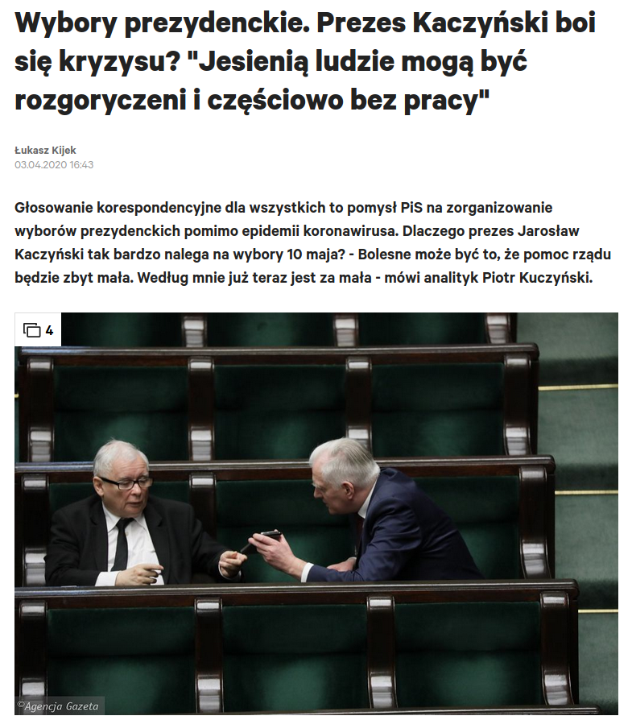
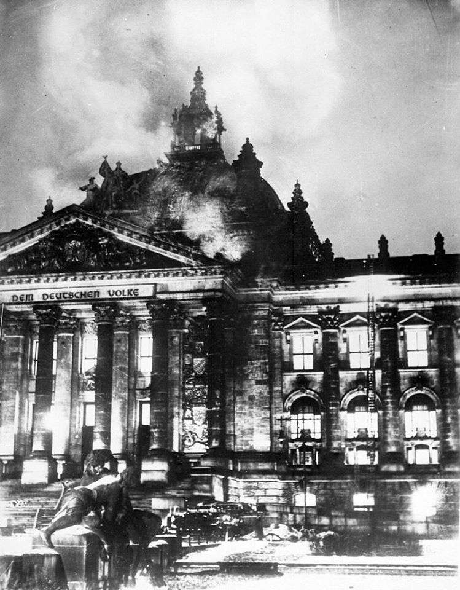
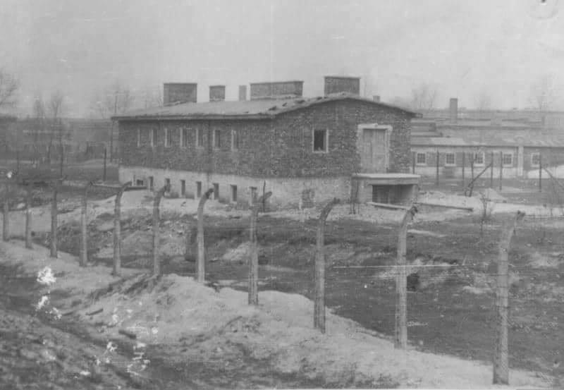
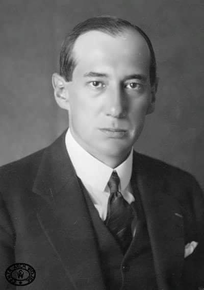
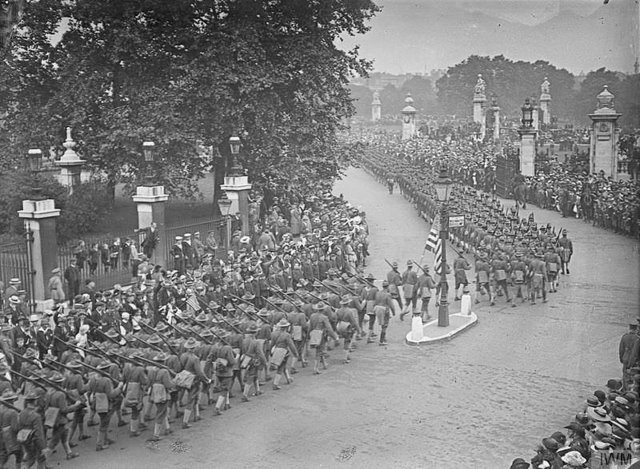
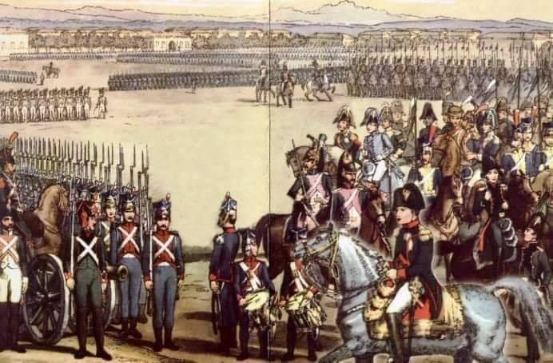

### 2020 - pomoc dla firm w które koronawirus uderzył wprost

Pisze to, czego nie dowiecie się w TVP! Wczoraj zadzwonił do mnie Maciek. Mój znajomy prowadzi firmę w Polsce (zatrudnia 22 osoby) i w Niemczech (nie zatrudnia nikogo- firma ma minimalne obroty i księgową, którą dostał od państwa na dwa lata za darmo). W Polsce do tej pory nie otrzymał żadnej pomocy. Jest bliski bankructwa i zwolnienia ludzi. Mówi, że ta tarcza to tylko propaganda i że to zwykłe oszukiwanie ludzi.
Wczoraj zadzwoniła do niego księgowa z Niemiec.
-Panie Maćku, czekają na Pana pieniądze.
-Jakie pieniądze?
-Rząd Niemiecki przelał Panu pierwszą pomoc.
-Ale ja nikogo nie zatrudniam!
-Pomoc należy się każdemu, kto zatrudnia do 10 pracowników. Pan pracuje sam, więc zatrudnia Pan do 10 pracowników. Jeśli zatrudniałby Pan powyżej 10 pomoc byłaby znacznie wyższa.
-To ile jest ten pomocy?
-14.000 euro.
-To pożyczka?
-Nie. To pieniądze, żeby Pan przetrwał.
I jeszcze jedno. To pomoc tylko za marzec!!!
Gdyby Pan zatrudniał powyżej 10 osób otrzymałby Pan 44.000 euro.

I teraz epilog.
-W Polsce dla firmy, która zatrudnia 22 osoby realnie 0 pomocy!
-W Niemczech dla firmy, która nie zatrudnia nikogo 14.000 euro tylko za marzec! Bez żadnych formalności!!!

Państwo Niemieckie korzystając z koniunktury odkładało pieniądze na kupkę w ciągu ostatnich 5 lat. Nasz rząd przepuścił wszystkie oszczędności. Dzisiaj rząd niemiecki wstawi niemieckie firmy do lodówki. Za 6-8 miesięcy bedą działały tak jak dzisiaj. Polskie w tym czasie zbankrutują, ponieważ polski rząd wydał wszystko co miał. Układ w samej Europie zmieni się diametralnie. Na niekorzyść Polski. To jest dramat i wyzwanie, przed którym stoimy. To jest sytuacją, w którą Polaków władował Kaczyński. W ciągu 5 lat przetańczyli całe polskie oszczędności na nagrody, limuzyny i stołki. Wiele rządowych programów też było robionych bez głowy. Jakby jutra miało nie być. Dziś te pieniądze powinny służyć na ratowanie miejsc pracy. To zwykła zdrada.

  

---

Jeśli w trakcie kryzysu czerpie się informacje wyłącznie ze środków masowego przekazu, perspektywa może być zniekształcona. Można odnieść wrażenie, że cały świat uznał życie w zamknięciu za jedyną metodę kontroli rozprzestrzeniania się koronawirusa i minimalizowania śmiertelności. Jednak nie bierze to pod uwagę faktycznej obecnej opinii wielu lekarzy.

Setki profesorów związanych z Yale University wystosowało list do Białego Domu. Podpisało go 800 licencjonowanych profesjonalistów, zajmujących się przede wszystkim epidemiologią i medycyną. Nie uznałbym tego za traktat wolnorynkowy, żeby było jasne, i w pewnych punktach nie zgadzam się z tym listem.

---

"Spain is moving to implement a universal basic income as a measure to help workers battered by the coronavirus pandemic. Nadia Calviño, the country's minister for economic affairs, told Spanish broadcaster La Sexta on Sunday evening that the government is planning to introduce it as part of a barrage of policies to help people get back on their feet."

---

FED nalega na transakcje REPO w większości lokalnych banków centralnych.

---

#### Propaganda

  

---

Jarosław Gowin był obrońcą polskiej klasy średniej. Dlatego głosował za zwiększaniem opodatkowania tej grupy społecznej.

Jarosław Gowin był wolnorynkowcem, zwolennikiem niskich i prostych podatków. Dlatego głosował za podwyższaniem podatków, za komplikowaniem ich, za doprowadzeniem do tego, że mamy najbardziej skomplikowany VAT w całej Europie, a gorszy od naszego system podatkowy w całym OECD ma tylko Francja.

Jarosław Gowin był też zwolennikiem dyscypliny budżetowej i niskich wydatków socjalnych. Dlatego głosował za 13 emeryturą i 500+ na każde dziecko.

Jarosław Gowin był przeciwnikiem walki na rympał z Sądem Najwyższym. Dlatego głosował za reformą sądownictwa. Ale się nie cieszył!

Jarosław Gowin jest przeciwnikiem głosowania korespondencyjnego. Dlatego zagłosuje - uwaga - przeciwko. Ale za to będzie namawiał swoich kolegów z partii, żeby zagłosowali za.

Jarosław Gowin na znak protestu odszedł z rządu. Ale zostaje w koalicji i chce aby wicepremierem była jego koleżanka Jadwiga Emilewicz.

Jarosław Gowin jest za a nawet przeciw. Nie chciał, ale musiał. Człowiek z kręgosłupem z żelaza. Lech Wałęsa naszego pokolenia.

---

„Arabska legenda mówi, że Bóg zesłał na
ziemię dżumę i kazał jej zabrać dziesięć
tysięcy istnień ludzkich. Kiedy dżuma
wróciła, okazało się, że liczba zmarłych
sięgnęła pięćdziesięciu tysięcy.
- Dlaczego to zrobiłaś? – spytał z wyrzutem
Najwyższy. – Przecież mówiłtem ci o
dziesięciu tysiącach.
- Ja wzięłam, jak kazałeś, Panie, dziesięć
tysięcy – odparła dżuma. – Czterdzieści
tysięcy zabrał strach."

---

Historia się powtarza. Ludzie, pod wpływem fałszywej nauki wtłaczanej im w szkołach myślą, że Republika Weimarska (państwo niemieckie powstałe po I wojnie światowej) oraz III Rzesza to 2 osobne byty. Z prawnego punktu widzenia było to dokładnie to samo państwo demokratyczne o nazwie Deutsches Reich (Rzesza Niemiecka). Wszystkie działania Hitlera były prawnie umocowane w konstytucji oraz innych prawach. Jak więc nastąpiło to przejście do totalitaryzmu? W nocy z 27 na 28 lutego 1933 został podpalony Reichstag. W odpowiedzi na poczucie zagrożenia u Niemców prezydent Hindenburg wprowadził dekret "o ochronie narodu i państwa", który wprowadził stan wyjątkowy. Ten stan wyjątkowy, sukcesywnie przedłużany do 1945, dał Hitlerowi podstawy do likwidacji wszelkich przejawów wolności w Niemczech.

Można się zastanawiać jak doszło do tego, że, w imię obrony przed urojonym zagrożeniem naród Niemiecki zgodził się na oddanie wszystkich swoich wolności. Jeśli ktoś tego nie rozumie - dokładnie ta sama historia powtarza się dziś w Polsce. W imię walki z koronawirusem Polacy ochoczo godzą się na oddanie swojej podstawowej wolności i wprowadzanie państwa policyjnego. Każde wyjście z domu jest zagrożone mandatem wystawianym na podstawie arbitralnej decyzji napotkanych policjantów. Wysokość kar jest absurdalna, zwłaszcza w stosunku do zarobków. Powody jeszcze bardziej aburdalne - biegając po lesie w celu poprawy kondycji jesteśmy przestępcami. Staliśmy się więźniami własnych domostw. I, tak jak w III Rzeszy, funkcjonujemy w stanie wyjątkowym, w miarę potrzeb sukcesywnie i bez końca przedłużanym.

Na zdjęciu płonący Reichstag.

  

### 1990

Na mocy ustawy podjętej przez rząd Tadeusza Mazowieckiego po 45 latach przestała istnieć Milicja Obywatelska. W jej miejsce powołano nową służbę o nazwie Policja Państwowa.

### 1945

Ministerstwo Bezpieczeństwa Publicznego powołało tzw. Centralne Obozy Pracy. Powstały one na terenach jenieckich obozów niemieckich. Obozy stworzono w Warszawie, Krzesimowie, Potulicach i Jaworznie. Trafiali do nich głównie Ukraińcy schwytani podczas akcji "Wisła".
Na zdjęciu obóz pracy w Jaworznie.

  

### 1939

W Londynie polski minister spraw zagranicznych Józef Beck (zdjęcie) podpisał układ, który miał być gwarancją bezpieczeństwa Polski i sojuszem na wypadek wojny z Niemcami. Układ ten stał się podstawą do głównego układu sojuszniczego, który podpisano 25 sierpnia 1939 roku, a który był odpowiedzią na pakt Ribbentrop- Mołotow.
Układy polskie z Wielką Brytanią stały się dla Hitlera pretekstem do wypowiedzenia 28 kwietnia polsko-niemieckiego układu o nieagresji z 1934 roku.

  

### 1917

USA przystąpiły do I wojny światowej.

I wojna światowa zdziesiątkowała Europę i pozostawiła po sobie głębokie blizny. Każdego roku we Francji archeolodzy wykopują broń, rzeczy osobiste oraz szczątki żołnierzy, którzy walczyli i zginęli na polu bitwy. Są wśród nich Francuzi, Brytyjczycy, Niemcy, ale także Amerykanie, którzy przybyli do Francji w latach 1917-1918, by walczyć ramię w ramię z aliantami. Te wszystkie wykopaliska rzucają nowe światło na mało znany rozdział historii. Dlaczego Amerykanie zdecydowali się przekroczyć Atlantyk i walczyć przeciwko Niemcom? I w jaki sposób USA ukształtowało swą własną przyszłość poprzez włączenie się w ten konflikt?

W 1917 roku francuskie i angielskie oddziały od trzech lat grzęzły w okopach, wyczerpane i dręczone głodem. Ich sytuacja pogarszała się z każdym miesiącem. Wojna z perspektywy frontu zachodniego wydawała się nie mieć końca, a morale żołnierzy dawno osłabło. Wtedy jednak pojawił się cień szansy na to, że historia tego okrutnego konfliktu może się zmienić niemalże z dnia na dzień – Ameryka przystąpiła do wojny.

Żołnierze amerykańscy, wyruszając za ocean myśleli, że będzie to wielka, ale krótka przygoda. Wkrótce jednak przekonali się, że walki na zachodnim froncie niosą za sobą cierpienie, ból i masową rzeź, bez konkretnej perspektywy zwycięstwa. Badania szczątków żołnierzy niemieckich odnalezione na cmentarzu w miejscowości Boult-sur-Suippe we Francji potwierdzają, że działania zbrojne w tamtym okresie były bardzo brutalne.

Co skłoniło Prezydenta Stanów Zjednoczonych Woodrowa Wilsona, by wysłać rzesze rodaków na śmierć, choć początkowo sprzeciwiał się udziałowi USA w konflikcie? 7 maja 1915 roku luksusowy transatlantyk Lusitania z ponad 2 tys. pasażerów na pokładzie, w tym Amerykanami, został storpedowany przez niemieckiego U-boota. Rok później na wyspie Black Tom w Jersey City w Stanach Zjednoczonych doszło do eksplozji, która, jak ustalił wywiad, była efektem ataku terrorystycznego, przeprowadzonego przez niemieckich agentów. Po wprowadzeniu przez Niemcy tzw. nieograniczonej wojny podwodnej, polegającej na zatapianiu wszystkich obcych jednostek znajdujących się na ich wodach oraz przechwyceniu przez Brytyjczyków zaszyfrowanego telegramu, w którym Niemcy proponowały Meksykowi sojusz przeciw Stanom Zjednoczonym, cierpliwość Wilsona i amerykańskiej opinii publicznej się skończyła. 

Armia amerykańska była mała i niedoświadczona, należało więc zasilić jej szeregi nowymi rekrutami. Jednak niewielu obywateli amerykańskich chciało dobrowolnie iść na wojnę. Nie pomogła nawet szeroko zakrojona kampania. W końcu na skutek wydanego przez prezydenta aktu, setki tysięcy żołnierzy zostało zwerbowanych do wojska i wyruszyło do Francji, by wesprzeć aliantów. Doświadczyli najgorszego. W ciągu zaledwie siedmiu miesięcy 53 tys. z nich zginęło, 234 tys. zostało rannych, a 4,5 tys. zaginęło.

Bez udziału Amerykanów I wojna światowa mogła zakończyć się zupełnie inaczej. Oni okazali się być niekwestionowanymi rzemieślnikami zwycięstwa sił alianckich i podnieśli swój kraj do rangi wiodącej siły militarnej i gospodarczej.

  

### 1807

Powstała Legia Polsko-Włoska. Składała się ona z polskich jeńców służących w armii pruskiej,którzy trafili do francuskiej niewoli w 1806 roku. W jej skład weszli również żołnierze, którzy służyli jeszcze w stworzonych wcześniej Legionach Polskich we Włoszech. Legia składała się z 3 pułków piechoty i 1 jazdy pod ogólnym dowództwem gen. Józefa Grabińskiego. Licząca ok. 7 000 ludzi jednostka została 31 marca 1808r. przeformowana w Legię Nadwiślańską na żołdzie francuskim i wysłana za Pireneje na toczącą się tam eojnę z Hiszpanią i Portugalią, zaś gen. Grabiński zrezygnował z dowództwa.
W dekrecie napoleońskim czytamy:
" My Napoleon, cesarz Francuzów postanowiliśmy i stanowimy co następuje:

- Utworzony będzie pułk polskich lansjerów (...)
utrzymywany będzie ze skarbu cesarskiego i ma składać się z 4 szwadronów po 300 ludzi (...) łącznie 1200 lansjerów,
- Legia Polska piesza również płatna ze skarbu
cesarskiego, będzie podniesiona do 6 batalionów w trzech pułkach po 9 kompanii w batalionie i po 150 ludzi w kompanii, łącznie 8100 ludzi i 100 w sztabie,
- Obie polskie formacje mają być skoncentrowane z zakładami we Wrocławiu pod kontrolą i nadzorem
ks. Hieronima (...),
- Dyrektor wojny w Warszawie (...) skieruje do
Wrocławia dla skompletowania tych pułków rekrutów z Polski (...) oraz przyśle do ks.
Hieronima listę nazwisk oficerów dla tej nowej
formacji uwzględniając na niej tych Polaków, którzy dawniej służyli w Legiach Włoskich i Naddunajskiej
(...)”.

  

---

<a href="https://github.com/TomaszWaszczyk/historia.waszczyk.com/edit/master/src/content/april-6.md" target="_blank">Edytuj tę stronę dzieląc się własnymi notatkami!</a>
