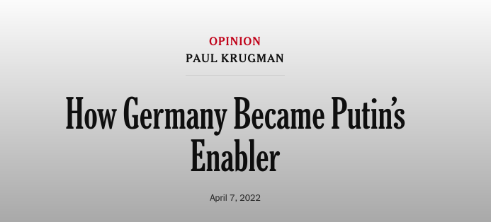
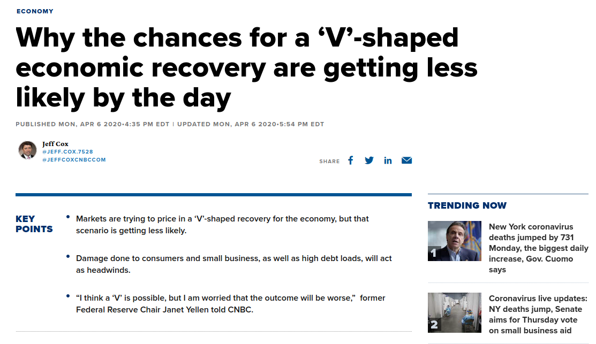
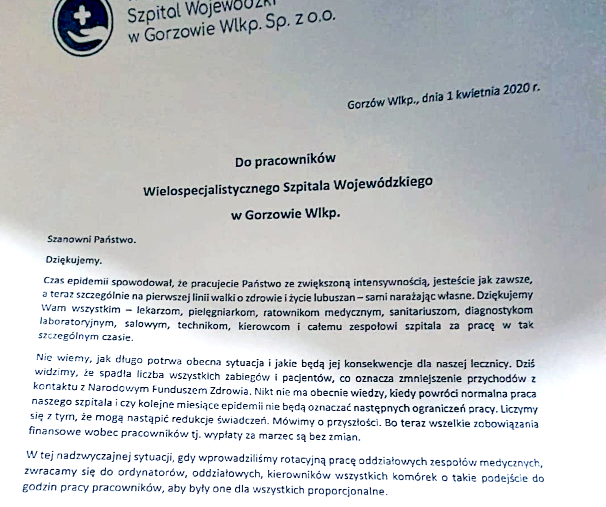
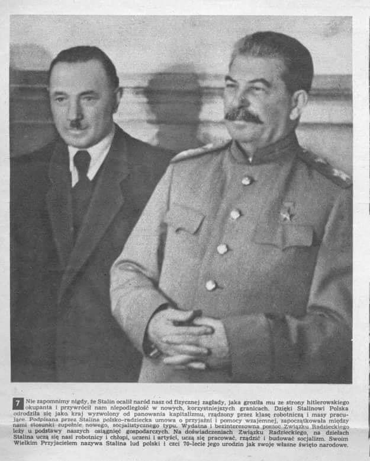
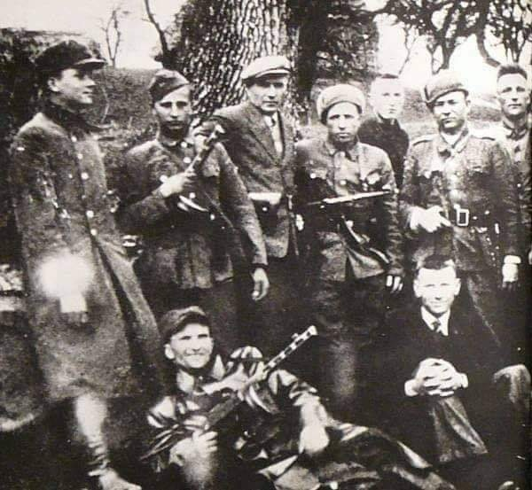
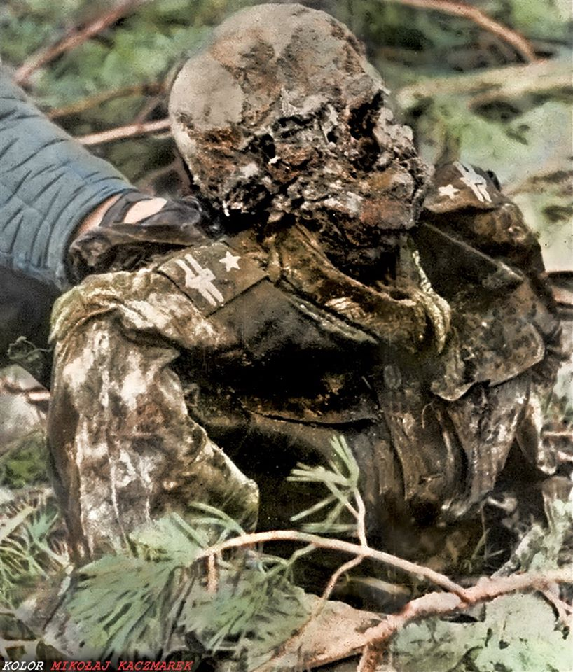
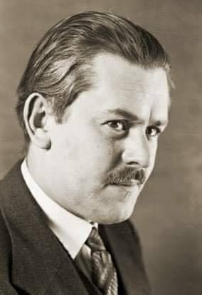
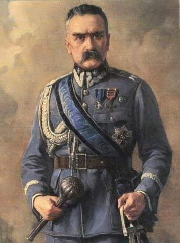
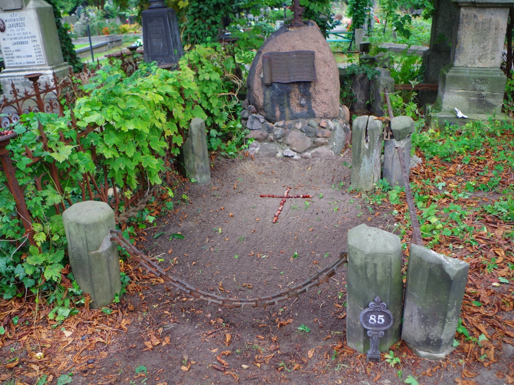

### 2023

PSO Maskpol S.A. dostarczy Siłom Zbrojnym RP kilkadziesiąt tysięcy kompletów kuloodpornych kamizelek zintegrowanych KKZ-01 o wartości ponad 490 mln złotych brutto. Kamizelki trafią do wojsk operacyjnych.
Przedmiotem umowy, zawartej pomiędzy Skarbem Państwa – Agencją Uzbrojenia a PSO Maskpol S.A., jest dostawa w latach 2024-2025 kilkudziesięciu tysięcy kompletów kuloodpornych kamizelek zintegrowanych KKZ-01. Zamówienie zostało podzielone na część gwarantowaną, obejmująca dostawy w 2024 r., a także część opcjonalną, przewidującą kontynuację dostaw w 2025 r., przy czym uruchomienie części opcjonalnej uzależnione jest od możliwości zakontraktowania dostaw seryjnych kamizelek zintegrowanych opracowywanych w ramach projektu TYTAN.
Kamizelka zintegrowana KKZ-01, jako środek wyposażenia indywidualnego żołnierza, została zaprojektowana do jego ochrony w warunkach bojowych przed postrzałem pociskami niektórych rodzajów broni strzeleckiej, bezpośrednimi uderzeniami odłamków oraz skutkami uderzeń niebezpiecznymi przedmiotami. Podstawowe elementy balistyczne kamizelki zapewniają ochronę żołnierza zgodnie z klasą K3 AB wg normy PN-V-87000:2011. Kamizelka umożliwia przenoszenie szerokiej gamy indywidualnego oporządzenia.

> ...

  

### 2022

  

---

Poprzedni system walutowy powstał w Bretton Woods w 1944 r. w czasie II wojny światowej. Teraz też mamy wojnę...
Pepe Escobar, brazylijski analityk geopolityczny zajmujący się Euro-Azją, mówi, że zmienia się porządek świata. Eurazjatycka Unia Gospodarcza (EAEU) i Chiny zaczynają projektować nowy system monetarny i finansowy z pominięciem dolara amerykańskiego i mający na celu konkurowanie z systemem z Bretton Woods https://tiny.pl/92t26
David Morgan, autor "The Silver Manifesto", twierdzi podobnie i dodaje, że nie można tego wykluczyć, jeśli złoto będzie używane jako środek rozliczeniowy za ropę i gaz ziemny https://youtu.be/YJdLTu2imU0
Warto pamiętać, że jest coś takiego jak BRICS -  określenie grupy państw rozwijających się – Brazylii, Rosji, Indii, Chin oraz od 2011 Republiki Południowej Afryki. Nazwa pochodzi od pierwszych liter nazw tych państw. Celem jest stworzenie nowego systemu walutowego.
Jeżeli Rosja wprowadza rozliczenia w złocie, czy to znaczy, że złoto jest złe? Czy pieniądz towarowy ze stuprocentowym pokryciem nie byłby najlepszym systemem monetarnym, zarówno dla gospodarki rynkowej, jak i z perspektywy Kościoła? https://tiny.pl/7nk68

---

Poprzedni system walutowy powstał w Bretton Woods w 1944 r. w czasie II wojny światowej. Teraz też mamy wojnę...
Pepe Escobar, brazylijski analityk geopolityczny zajmujący się Euro-Azją, mówi, że zmienia się porządek świata. Eurazjatycka Unia Gospodarcza (EAEU) i Chiny zaczynają projektować nowy system monetarny i finansowy z pominięciem dolara amerykańskiego i mający na celu konkurowanie z systemem z Bretton Woods 

<!-- https://tiny.pl/92t26 -->
David Morgan, autor "The Silver Manifesto", twierdzi podobnie i dodaje, że nie można tego wykluczyć, jeśli złoto będzie używane jako środek rozliczeniowy za ropę i gaz ziemny 

<!-- https://youtu.be/YJdLTu2imU0 -->
Warto pamiętać, że jest coś takiego jak BRICS -  określenie grupy państw rozwijających się – Brazylii, Rosji, Indii, Chin oraz od 2011 Republiki Południowej Afryki. Nazwa pochodzi od pierwszych liter nazw tych państw. Celem jest stworzenie nowego systemu walutowego.
Jeżeli Rosja wprowadza rozliczenia w złocie, czy to znaczy, że złoto jest złe? Czy pieniądz towarowy ze stuprocentowym pokryciem nie byłby najlepszym systemem monetarnym, zarówno dla gospodarki rynkowej, jak i z perspektywy Kościoła? 

<!-- https://tiny.pl/7nk68 -->

---

  

### 2021

Węgierski bank centralny ogłosił w środę, że rozmiary krajowych rezerw złota wzrosły z 31,5 tony do 94,5 tony. To drugie w ostatnich latach tego typu posunięcie Madziarów – w październiku 2018 r. ogłosili dziesięciokrotny wzrost rezerw, startując z poziomu zaledwie 3,1 tony.

- ''Z historycznej perspektywy złoto pełniło kilka funkcji w różnych systemach finansowych. Chociaż z perspektywy polityki monetarnej metal ten stracił na znaczeniu w latach 70., jego rola jako tradycyjnego aktywa rezerwowego została zachowana. Z racji braku ryzyka kredytowego lub ryzyka trzeciej strony złoto zwiększa zaufanie do kraju we wszystkich realiach gospodarczych i wciąż jest jednym z najważniejszych aktywów rezerwowych świata, obok rządowych obligacji'' – czytamy w komunikacie węgierskiego banku centralnego.

Jak dodano, wpływ na decyzję o zwiększeniu poziomu rezerw miały też „ryzyka wynikające z pandemii koronawirusa”.

- ''Wzrost globalnego zadłużenia oraz inflacji wzmacnia znaczenie złota jako bezpiecznej przystani i środka przechowywania wartości'' – napisano.

### 2020 - „Wrogie przejęcie”. Niemcy chcą chronić swoje firmy

Władze Niemiec chcą zaostrzyć przepisy dotyczące kontroli inwestycji zagranicznych w kraju. Chodzi o to, aby chronić niemieckie firmy przed „wrogim przejęciem” przez inwestorów spoza Unii Europejskiej. Sprawa staje się pilna w obliczu spodziewanej recesji i problemów gospodarczych spowodowanych pandemią koronawirusa.

Jak podaje agencja AFP, powołując się na źródła rządowe, projekt nowelizacji ustawy o stosunkach gospodarczych z zagranicą ma być omawiany na posiedzeniu rządu w Berlinie w tę środę.

Proponowane zmiany przewidują m.in., że wymagające zgłoszenia transakcje przejęcia w obszarze krytycznej infrastruktury oraz cywilnych sektorów bezpieczeństwa w Niemczech będą mogły być uznawane za  nieważne tak długo, aż cała transakcja zostanie sprawdzona i zakwalifikowana jako dopuszczalna.

  

Już od dłuższego czasu widać coraz bardziej aktywny kapitał chiński na terenie Niemiec, a lepiej kupować taniej niż drożej..

---

Na aukcji obligacji i bonów skarbowych rząd polski(?) chciał sprzedać papiery wartościowe za 7mld PLN, jednak strona popytowa pozwoliła skupić jedynie 5mld PLN. Co to oznacza? Oznacza to to, że kapitał instytucjonalny nie jest zainteresowany skupowaniem polskich papierów, to rzadkie wydarzenie oznaczające, że w oczach inwestorów Polska nie jest dobrym miejscem do lokowania kapitału.

---

  

Media masowego przekazu sugerują scenariusz V.

---

#### Degradacja lekarzy jako grupy społecznej cześć dalej, brak sprzętu, wypłat i domino zakażeń. Szpitale na skraju paraliżu

  

Medycy! Ratujcie nas i oszczędzajcie

Szczerze mówiąc nie wierzyłem w ten list. Czytałem i myślałem, że to może być nieśmieszny żart pierwszokwietniowy.

Bo jak można wysyłać człowieka do śmiertelnie niebezpiecznej pracy, dziękować mu za poświęcenie i jednym tchem informować, że w marcu dostanie pełną pensję, ale w kwietniu "to się zobaczy".

Z tego co rozumiem, to nie jest jednostkowy przypadek. Zabiegi planowe wstrzymane, NFZ płaci mniej, zarządy szpitali są w kropce i głowią się skąd wziąć na pensje dla personelu.
A było tak:

"Doktor M. – jak wielu innych lekarzy – ostatni tydzień spędził na kompletowaniu sprzętu. – Jestem oddelegowany do szpitala, który ma leczyć zakażonych koronawirusem, muszę się zabezpieczyć – tłumaczy.

Pełnotwarzową maskę z osłoną oczu i z filtrami dzięki koneksjom towarzyskim załatwił w dużej firmie oponiarskiej. Na Allegro zamówił maskę do nurkowania – też się nada, ale będzie musiał za pomocą rurki termokurczliwej zrobić przejściówkę, by połączyć ją z filtrem. Kupił gumowce. Mówi, że nareszcie poczuł się „jak gość”.

Potem przyszły gorsze wieści. W dyżurce w Wielospecjalistycznym Szpitalu Wojewódzkim w Gorzowie Wielkopolskim, gdzie pracuje, zastał list prezesów do pracowników: „Dziękujemy. Czas epidemii spowodował, że pracujecie państwo ze zwiększoną intensywnością, jesteście jak zawsze, a teraz szczególnie, na pierwszej linii walki o zdrowie i życie Lubuszan – sami narażając własne”.

> Dalej informacja, że w szpitalu spadła liczba zabiegów i pacjentów, czyli przychodów z kontraktu z NFZ, co może mieć konsekwencje. Jakie? „Liczymy się z tym, że mogą nastąpić redukcje świadczeń. Mówimy o przyszłości. Bo wypłaty za marzec są bez zmian” – napisali prezesi."

Dalej informacja, że w szpitalu spadła liczba zabiegów i pacjentów, czyli przychodów z kontraktu z NFZ, co może mieć konsekwencje. Jakie? „Liczymy się z tym, że mogą nastąpić redukcje świadczeń. Mówimy o przyszłości. Bo wypłaty za marzec są bez zmian” – napisali prezesi.

Doktor M.: – Przekaz był jasny: „fajnie, że się narażacie, ale nie wiemy, czy w kwietniu wam zapłacimy”.

Zastraszenie lekarzy oraz zmniejszenie przychodów z powodu braku zleceń ze strony NFZ..

> Nie chcę umierać

To nie jest jednostkowy przypadek. Lekarka anestezjolog i epidemiolog z ponad 20-letnim stażem od pięciu lat ma kontrakt na 200 godzin w szpitalu wojewódzkim na Pomorzu. Nie ma jej w grafiku dyżurów na kwiecień. To oznacza dla niej kryzys finansowy – bo kontrakt to podstawowe źródło dochodów. – Nikt ze mną nawet nie rozmawiał – mówi rozgoryczona. – Niby jesteśmy bohaterami, a traktują nas jak śmieci.

Anestezjolog, 25 lat stażu, kontrakt w szpitalu MSWiA w mieście wojewódzkim. – Dyrektor powiedział mi, że nie ma zbyt wiele planowych zabiegów i żebym jutro nie przychodził do pracy – mówi. – Powiedziałem, że jeden dzień wolny się przyda, ale jeśli mam nie przychodzić także pojutrze, to niech rozwiąże kontrakt, idę do innego szpitala. Jak mu tu zrobią zakaźny, będzie błagał na kolanach, żebym przyszedł podłączać do respiratora ludzi z ciężką niewydolnością oddechową i covidowym zapaleniem płuc.

Nie przyjdzie. – Chcę pomagać ludziom i będę, składałem przysięgę. Ale nie chcę umierać.

Podczas intubacji zakażonego w pomieszczeniu aż gęsto od wirusowego aerozolu. – W szpitalu klinicznym nie ma ani jednej maski FFP3 – mówi anestezjolog.

Lekarz z Bydgoszczy: W walce z wirusem służymy za mięso armatnie

### 2010

Na długoterminową, niekorzystną dla 🇵🇱 umowę z Gazpromem, Donald Tusk z Władimirem Putinem umówili się 7 kwietnia 2010 r. w Smoleńsku. „Jestem pewien, że ten dzień przejdzie do lepszej historii naszych relacji i pozwoli nam jeszcze lepiej współpracować” - stwierdził.

### 2007

  

### 1952

Prezydent Rzeczypospolitej Polskiej Bolesław Bierut tak pisał w liście do Józefa Stalina:
" Towarzysze, niemal codziennie z zachwytem podziwiamy najwspanialszy prezent, jaki dostaliśmy od przyjaciół Rosjan. Tak, tak to Pałac Kultury i Nauki - symbol PRL-u i perła stolicy. Partia rozpoczyna akcję edukacyjno - propagandową , mającą przybliżyć obywatelom czasy, w których to socjalizm triumfował nad karłami reakcji. A cóż innego lepiej symbolizuje
radziecką  potęgę niż Pałac Kultury."

  

### 1943

Powstała Polska Armia Ludowa ( nie mylić z Armią Ludową). Była to lewicowa organizacja zbrojna o charakterze konspiracyjnym licząca kilka tysięcy żołnierzy. W jej skład wchodziła Milicja Ludowa i ta część Korpusu Ochrony Pogranicza, która nie podporządkowała się Armii Krajowej.
PAL działała głównie w Warszawie i
województwie warszawskim oraz w Lublinie i województwach lubelskim, łódzkim i kieleckim. Jej działalność koncentrowała się głównie na sabotażu kolejowym i propagandzie. Została rozwiązana w 1945 roku.

  

### 1941

Niemcy rozpoczęli wysiedlanie Brzezinki i okolic. Na terenach tej wsi utworzonej w XIV wieku powstał niemiecki obóz koncentracyjny Konzentriationslager Auschwitz-Birkenau.
Tak ten czas wspomina Jan Tobiasz, 7 -letni wówczas mieszkaniec Brzezinki:
" To było w kwietniu 1941 roku. – W dniu, w którym nas wysiedlano, spadł jeszcze śnieg. O tym, że Niemcy coś planują, wiadomo było kilka miesięcy wcześniej, gdy we wsi pojawili się esesmani z komandem więźniów i znaczyli domy, malując na nich znaki przypominające „X”. Jednocześnie spisywali, co było w domach, szczególnie wszystkie żelazne sprzęty, nawet kuchenne moździerze. Wtedy też zaczęli rekwirować mieszkańcom dobytek. Zabrali nam dwie krowy i jałówkę. Rano pod nasz dom zajechał wóz, na który mieliśmy się spakować. Rodzicom udało się zabrać łóżko, kufer, pościel. Na opuszczenie domu mieliśmy niewiele ponad godzinę. Początkowo jeszcze rodzice łudzili się, że za jakiś czas będą mogli wrócić do swojego domu. Mama nawet wysyłała nas z ojcem, aby go przewietrzyć. Wkrótce jednak do mieszkańców Brzezinki zaczęły docierać wieści o rozpoczętych przez Niemców wyburzeniach ich domów. Dla moich rodziców, ale także dla innych wysiedlonych to była prawdziwa trauma."
Skalę tego przedsięwięzia oddają liczby, które mówią, że ze znajdujących się we wsi 537 domów oszczędzono tylko 6.

  

### 1940

80 lat temu Stalin podpisał rozkaz wymordowania blisko 22 tysięcy oficerów wojska Polskiego i jeńców wojennych🇵🇱️

Na zdjęciu zwłoki 🇵🇱 ️Majora Adama Solskiego z 57 Pułku Piechoty, zidentyfikowane w 1943 roku w Katyniu.
Prowadził w obozie jenieckim dziennik, który został odnaleziony po jego ekshumacji w 1943 i opublikowany przez Józefa Mackiewicza, a następnie w wielu źródłach historycznych poświęconych Zbrodni Katyńskiej.

Notatnik majora Solskiego zawierał takie oto słowa końcowe :

Niedziela. 7.IV.1940. Rano. Po wczorajszym dniu przydział do „Skitowców”. Pakować rzeczy! do 1140, na odejście do klubu na rewizję.. Obiad w klubie… (nieczytelne) Po rewizji, o godzinie 1655 (nasz polski czas 14 55) opuściliśmy mury i druty obozu Kozielsk Wsadzono nas do wozów więziennych. Takich wozów, jakich w życiu nie widziałem. [mówią] że 50 % wagonów w SSSR spośród osobowych, to wozy więzienne. Ze mną jedzie Józek Kutyba, kapitan Paweł Szyfter i jeszcze major, pułkownik i kilku kapitanów, razem dwunastu. Miejsca najwyżej dla siedmiu.
8.IV. godz. 330 wyjazd ze stacji Kozielsk na zachód. 945 na stacji Jelnia.

8.IV.40 od godziny 12 stoimy w Smoleńsku na bocznicy.

9.IV. rano paręnaście minut przed 5-tą pobudka w więziennych wagonach i przygotowanie się do wychodzenia. Gdzieś mamy jechać samochodami. I co dalej?

9.IV 5 rano

9.IV od świtu dzień rozpoczął się szczególnie. Wyjazd karetką więzienną w celkach (straszne). Przywieziono gdzieś do lasu, coś w rodzaju letniska. Tu szczegółowa rewizja. Zabrano zegarek, na którym była godzina 63o (830) pytano mnie o obrączkę, którą […] zabrano ruble, pas główny – scyzoryk…

Na tym pamiętnik się urywa...

  

### 1952

Prezydent Rzeczypospolitej Polskiej Bolesław Bierut tak pisał w liście do Józefa Stalina:
"Towarzysze, niemal codziennie z zachwytem
podziwiamy najwspanialszy prezent, jaki
dostaliśmy od przyjaciół Rosjan. Tak, tak to
Pałac Kultury i Nauki - symbol PRL-u i perła
stolicy. Partia rozpoczyna akcję edukacyjno -
propagandową , mającą przybliżyć obywatelom
czasy, w których to socjalizm triumfował nad
karłami reakcji. A cóż innego lepiej symbolizuje
radziecką potęgę niż Pałac Kultury."

  

### 1950

W Londynie w wieku 49 lat zmarł na zawał serca Anatol Krakowiecki (zdjęcie) pisarz, dziennikarz więzień sowieckich obozów.
Pochodził z Podgórza w województwie małopolskim. W wieku 17 lat zgłosił się na ochotnika do Wojska Polskiego. W okresie drugiej Rzeczpospolitej pracował jako dziennikarz Ilustrowanego Kuryera Codziennego. Współpracował z kabaretami i teatrzykami rewiowymi oraz czasopismami podróżniczo-geograficznymi.
Znaczący wpływ na jego dalsze losy miała sowiecka agresja na Polskę w dniu 17 września 1939. Trzy tygodnie po wkroczeniu Sowietów podjął próbę przekroczenia granicy polsko-węgierskiej. Został aresztowany przez NKWD 7 października 1939 roku. Został wywieziony do obozu na Kołymie, z którego na mocy zawartego w lipcu 1941 roku polsko-radzieckiego układu Sikorski-Majski wyszedł na wolność 12 kwietnia 1942 roku. Po tym okresie podjął służbę w tworzonych na terenie Związku Radzieckiego Polskich Siłach Zbrojnych na Wschodzie pod dowództwem generała Władysława Andersa. Z formacją tą, jako propagandysta przeszedł cały szlak bojowy. W roku 1946 zamieszkał w Wielkiej Brytanii.
Był autorem wielu książek, utworów scenicznych i poezji lirycznej. Jego najsłynniejszym dziełem jest wydana w roku 1950 "Książka o Kołymie", w której spisał swoje doświadczenia z czasów zsyłki.
Tak w niej między innymi pisał:

"Pakują do wagonu trzydziestu sześciu ludzi. Jednego, Więckowiaka, byłego komendanta posterunku policji musimy wnieść. Ma opuchnięte nogi – cały jest opuchnięty.

W wagonie stoi wmontowany piecyk. Na ten piecyk z nadzieją kierują się uradowane oczy (nie tylko dlatego, że będzie ciepło…).

W naszym wagonie jest tylko kilku skazanych. Reszta, to więźniowie „śledczy”. My już uważamy się za załatwionych, oni będą tułać się od więzienia do więzienia, od śledztwa do śledztwa w poszukiwaniu wyroku. W innych krajach przestępcę wiezie się na miejsce przestępstwa, ażeby łatwiej było przeprowadzić śledztwo. Tutaj „przestępcę” wywozi się z „miejsca przestępstwa” – też żeby było łatwiej przeprowadzić śledztwo. Bodaj czy nie jesteśmy od nich szczęśliwsi, my „skazani”. Chyba tak? Nasze oczy skazańców szukają luk, wypatrują szpar, rozglądają się gorączkowo dookoła.

– Uciekać!

Oto jest myśl, która przeszywa większość umysłów. Tutaj jako sprzymierzeńcy dołączają się przestępcy kryminalni, których ?świat” odnosił się do nas kilka godzin temu tak wrogo. (…)

Nie wiem – skąd wzięło się to żelazo? Wiele takich tajemnic otaczać mnie będzie w przyszłości. Dość, że żelazo jest! Na podłodze, pod dolnymi narami, leży młody człowiek. Inny młody człowiek trzyma żelazo w piecyku. Żelazo jest wreszcie rozpalone, czerwone, sypie iskry, potem wędruje pod nary. Za chwilę słychać syk i dym unosi się w powietrze. Teraz trzeba czekać aż dym się rozpłynie, dopiero wówczas żelazo można powtórnie zagłębić w podłogę wagonu.

A tu pociąg stuka na zwrotnicach i może zatrzymać się? Zaś foszty drewniane, stanowiące podłogę wagonu, są bardzo grube. Ciężka, mozolna i niebezpieczna praca! W wagonie nie ma chyba nikogo, kto nie zdawałby sobie sprawy z tego, co się dzieje. Są jednak tacy, którzy nie chcą widzieć, nie chcą słyszeć. Zaczynają ostrożnie szemrać, że ?dym gryzie w oczy” ? i od tego momentu nabrzmiewa protest. (…)

  

---

Sąd w Warszawie wydał wyrok kary śmierci na Stanisława Skalskiego. Skalski był największym asem myśliwskim polskiego lotnictwa. Na swoim koncie miał udział w prawie wszystkich bitwach lotniczych, w których brali udział Polacy. Oficjalnie zestrzelił 18 niemieckich samolotów. Po wojnie przebywał na emigracji, ale w 1947 roku wrócił do Polski. 4 czerwca 1948 roku został aresztowany przez UB. Zarzucono mu szpiegostwo na szkodę Polski. Wydaną na niego karę śmierci zamieniono 1951 roku na dożywocie, a w 1956 roku uniewinniono go. Zmarł 12 listopada 2004 roku w wieku 89 lat.

  

### 1943

Powstała Polska Armia Ludowa ( nie mylić z Armią Ludową). Była to lewicowa organizacja zbrojna o charakterze konspiracyjnym licząca kilka tysięcy żołnierzy. W jej skład wchodziła Milicja Ludowa i ta część Korpusu Ochrony Pogranicza, która nie podporządkowała się Armii Krajowej.
PAL działała głównie w Warszawie i
województwie warszawskim oraz w Lublinie
i województwach lubelskim, łódzkim i
kieleckim. Jej działalność koncentrowała
się głównie na sabotażu kolejowym i
propagandzie. Została rozwiązana w 1945 roku.

  

### 1938

Ówczesny Sejm RP przyjął Ustawę o ochronie Imienia Józefa Piłsudskiego. Dokument ten powstał bardzo szybko, bo prace nad nim rozpoczęły się już 17 lutego 1938 roku. Ustawa była nie tylko wyrazem kultu zmarłego marszałka, ale przede wszystkim rodzajem cenzury zapobiegającej próbom szkalowania jego imienia.

  

### 1861

Rosyjski oficer Jan Peucker popełnił samobójstwo, nie chcąc strzelać do uczestników patriotycznego pochodu w Warszawie.
Postać Jana Peuckera związana jest z wypadkami rozgrywającymi się w Warszawie w okresie poprzedzającym wybuch powstania styczniowego. Protestując przeciw rozwiązaniu przez władze rosyjskie Towarzystwa Rolniczego ludność Warszawy wzięła masowy udział w manifestacji w dniu 7 kwietnia 1861 r. Pochód wyruszył spod siedziby Towarzystwa przy Placu Ewangelickim (obecnie Małachowskiego) i skierował się w stronę placu Zamkowego. Jeden z oficerów Zarządu Kwatermistrzostwa Wojsk Rosyjskich, podpułkownik Jan Peucker, wiedząc o czynionych przygotowaniach do użycia siły przeciw manifestantom i nie chcąc uczestniczyć w tej masakrze, wystrzałem z pistoletu pozbawił się życia na terenie Zamku Warszawskiego. Namiestnik, zaszokowany jego postawą, kazał wycofać wojsko do koszar, a manifestanci spokojnie opuścili plac. Jest rzeczą oczywistą, iż przez swą śmierć Jan Peucker uratował wówczas życie wielu ludziom. Samobójcza śmierć Peuckera zrobiła wielkie wrażenie na mieszkańcach Warszawy i całego Królestwa, a nawet odbiła się głośnym echem za granicą. Jeszcze kilka lat później Oskar Awejde zeznał, iż śmierć Peuckera oraz podobne czyny innych oficerów rosyjskich napełniły społeczeństwo polskie wiarą i otuchą, iż myśl o wyzwoleniu się z jarzma obudziła się również w narodzie rosyjskim.
Rosyjski działacz niepodległościowy Aleksander Hercen, redagujący w tym czasie w Londynie antycarskie pismo „Kołokoł", na wieść o śmierci Peuckera tak pisał: „...zastrzelił się w Warszawie, aby nie być pomocnikiem katów. Wieczne odpoczywanie, to bohater, ale dlaczego strzał ten został oddany w czystą pierś? Jeśli już strzelać, to lepiej do tych generałów, którzy każą rozstrzeliwać bezbronnych."
Jego mogiła na Cmentarzu Ewangelicko-Augsburskim przy ul. Młynarskiej stała się miejscem pielgrzymek mieszkańców Warszawy. Wykorzystując okoliczność odbywającego się w dniu 15 kwietnia 1861 pogrzebu warszawskiego kupca Edwarda Andrzeja Koelichena, patriotyczna młodzież zgromadziła się na cmentarzu i udekorowała grób Peuckera naręczami kwiatów. Na skutek tych wystąpień władze rosyjskie zakazały udziału w pogrzebach osobom nie należącym do rodziny zmarłego.
Inną formą uczczenia pamięci Jana Pauckera było wybicie w Warszawie srebrnego medalu. Na awersie umieszczono nazwisko i datę śmierci Peuckera, na rewersie zaś widnieje krzyż i złamana szpada w cierniowej koronie, a w otoku napis: „Za cnotliwy czyn." Pochowany został w alei D nr 85.

  

---

<a href="https://github.com/TomaszWaszczyk/historia.waszczyk.com/edit/master/src/content/april-7.md" target="_blank">Edytuj tę stronę dzieląc się własnymi notatkami!</a>
