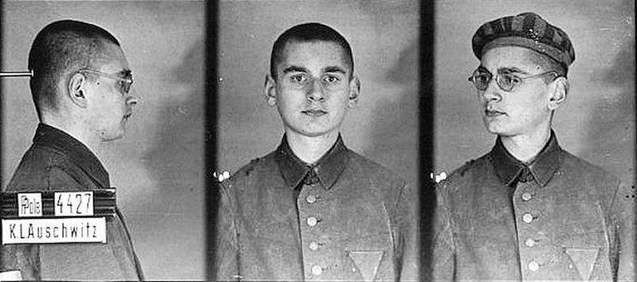

### 2020

RPP "zaskoczyła" i obniżyła stopy. Raty kredytów będą mniejsze.

Wbrew przewidywaniom ekonomistów, Rada Polityki Pieniężnej podczas środowego posiedzenia obniżyła stopy procentowe. Główna stopa referencyjna została obniżona z 1,0 proc. do 0,5 proc.

Bełkot:

> Oprocentowanie depozytów w Narodowym Banku Polskim zostało obniżone do z 0,5 proc. do 0,0 proc., a kredytów - do z 1,5 proc. do 1,0 proc.
> Taki ruch ze strony RPP ma z jednej strony ulżyć kredytobiorcom w trudnym czasie epidemii koronawirusa. Z drugiej, tani kredyt ma stymulować konsumentów i firmy do wydawania pieniędzy i inwestowania, co pobudziłoby gospodarkę do wzrostu.
> Trzy tygodnie temu, 17 marca, Rada Polityki Pieniężnej (RPP) ogłosiła obniżki stóp procentowych - pierwszy raz po pięciu latach przerwy. Główna stawka w banku centralnym spadła wtedy z 1,5 do 1 proc.

Czekamy na negatywne stopy procentowe oraz prawdopodobnie problemy z płynnością niektórych banków.

---

TRZEBA POŻYCZAĆ I ,,DRUKOWAĆ"

Na pierwszy rzut oka świat stanął na głowie. Nawet bowiem ci, którzy normalnie wzdrygają się na myśl o zwiększaniu dziury w budżecie i różnych akcjach płynnościowych banków centralnych mówią, że teraz trzeba tak działać.

Niemcy prowadziły ostatnio politykę zrównoważonego budżetu. Oczywiście nie wszystko da się dokładnie policzyć, w efekcie w ostatnich sześciu latach nie tylko nie było deficytu, ale pojawiała się nawet nadwyżka. W sumie wyniosła ona około 7% PKB, czyli mniej więcej 250 mld euro. Wraz ze wzrostem gospodarki, czyli wartości PKB, doprowadziło to do wyraźnego spadku wskaźnika, który powszechnie uważany jest za jeden z najważniejszych do oceny bezpieczeństwa finansowego krajów. Mam na myśli wartość długu w stosunku właśnie do PKB. W ciągu tych sześciu lat spadł on z prawie 80% do około 60%. Ostatecznych danych za rok 2019 jeszcze nie mamy. Ale nawet w Niemczech, które zrównoważony budżet uważają obecnie za jeden z podstawowych fundamentów polityki państwa przekaz jest jasny: trzeba wydać tyle ile potrzeba, żeby ratować zdrowie i życie, ale także żeby ratować gospodarkę. A to tyle ile trzeba szacują już dzisiaj w sumie, razem z działalnością Europejskiego Banku Centralnego, na 1,2 biliona euro. Oczywiście, podobnie jak przypadku Polski i naszych 212 mld złotych, to nie jest tak, że niemieckie państwo tyle pieniędzy bezpośrednio wpompuje w przedsiębiorstwa, czy w transfery dla tych, którzy tracą pracę. Ale już dzisiaj mówi się, że samych wydatków rządowych może być grubo ponad 150 mld euro. Na ten cel rząd pożyczy 158 mld euro. Uwzględniając wielkość niemieckiej gospodarki mówimy tu o kwotach prawie 5% PKB. Przypominam, nie mam tu na myśli „drukowania” pieniędzy przez Europejski Bank Centralny (EBC), czy kredytów i gwarancji udzielanych przez niemiecki odpowiednik naszego Banku Gospodarstwa Krajowego. To realne pieniądze, które rząd chce przekazać na ratowanie, a potem odbudowanie gospodarki. Dla porównania na razie w Polsce, moim zdaniem, mówimy o kwocie w okolicach 30 - 40 mld złotych, czyli góra 2% PKB. Gdyby odnieść kontekst niemiecki do polskiego, to nasz rząd powinien przygotować przynajmniej 100 mld złotych. Cały niemiecki rządowy pakiet pomocowy to 750 mld euro, czyli ponad 20% PKB. Plus, powtarzam, działania EBC. W naszym przypadku całkowita wartość pakietu to 10% PKB, razem z działaniami Narodowego Banku Polskiego.

Równie agresywnie wygląda to w Stanach Zjednoczonych. Pakiet pomocowy, przygotowany przez rząd to 2 biliony dolarów. I znowu w znacznej części będą to realne pieniądze pochodzące ze zwiększenia deficytu budżetowego, na przykład 1200 USD transferu dla każdego Amerykanina zarabiającego nie więcej, niż 75 tysięcy USD rocznie. Tu już mamy 10% PKB, a do tego trzeba dodać działalność FED-u, czyli amerykańskiego banku centralnego.

USA i Niemcy to szczyt rankingu najbogatszych krajów świata. Ale też porównując je z Polską, wartość pomocy odnoszę do wielkości PKB. Nie zestawiam bezwzględnych wydatków. Oczywiście to też nie jest do końca porównywalne, bo w bogatych krajach możliwości są większe niż w biedniejszych. Po zaspokojeniu podstawowych potrzeb powinno zostawać więcej. Łatwiej jest także pożyczać. Jest większa wiarygodność. To wszystko prawda. Ale i tak polityka realizowana obecnie na świecie w związku z pandemią koronawirusa jest absolutnie bez precedensu. I co najciekawsze nawet mocno niechętni zadłużeniu się państw i drukowaniu pieniędzy przez banki centralne nie kwestionują tego kierunku. Bo to co nas spotyka jest rzeczywiście nadzwyczajne.

To samo musimy robić w naszym kraju. Na razie polska tarcza jest niewystarczająca i mówię to od początku jej ujawnienia. Do takiego samego wniosku doszedł już rząd. Oficjalnie przekaz jest taki, że ponieważ nie znano skali to postanowiono cały pakiet dozować. To co mamy to Tarcza nr 1. Będzie zatem tarcza nr 2, a może nawet i nr 3. Nie do końca zgadzam się z takim podejściem, ale dobrze, że kolejne programy są przygotowywane. Porównanie z innymi krajami pokazuje, że większość z nich od początku przygotowuje znacznie obszerniejsze pod względem wartości pakiety.

A zatem deficyt budżetowy w tym roku wzrośnie. Musi wzrosnąć, jeśli realnie chcemy pomóc gospodarce. I to wyraźnie. A NBP musi „drukować” pieniądz zwiększając płynności w systemie. Na razie jej nie brakuje, ale to się może za chwile skończyć. Innej możliwości nie ma. Choć będzie nam trudniej, niż na przykład Niemcom. Nie tylko dlatego, że Niemcy są bogatsze. Także, a może głównie dlatego, że przez te ostatnie lata fantastycznej koniunktury, zresztą ani tylko u nas, wydawaliśmy za dużo. Nie zbudowaliśmy wystarczającej rezerwy. Nie w sensie środków państwa na rachunku w NBP, ale potencjału dużego wzrostu długu. Teraz mamy tego skutki. Tym bardziej, kiedy sytuacja się uspokoi, będziemy musieli pokazać wiarygodną ścieżkę zmniejszania zadłużenia, które teraz wyraźnie wzrośnie. I ściągnięcia nadmiaru wygenerowanych przez NBP pieniędzy. Inaczej nie będziemy wiarygodni, a to nas będzie wszystkich dużo kosztowało. Tak na marginesie: rząd niemiecki już dzisiaj mówi, że po wygaśnięciu problemów związanych z pandemią wróci do polityki zrównoważonych budżetów. Prawdopodobnie stanie się to najpóźniej w roku 2022.

### 2012

W Monte Sereno zmarł 83-letni Jacek Trzmiel - polski biznesmen żydowskiego pochodzenia, założyciel Commodore International, producenta m.in. komputerów Commodore 64 i Amiga, następnie właściciel Atari Corp., współtwórca komputera Atari ST.

  

### 1991

Rozpoczęło się wycofywanie 53 tysięcy żołnierzy słuźących na terenie Polski jako Północna Grupa Wojsk Radzieckich.
Ważniejszymi garnizonami były obok Legnicy: Świdnica , Borne Sulinowo, Przemków-Trzebień, Bagicz , Brzeg, Burzykowo (dzielnica Stargardu Szczecińskiego ), Chojna, Dębica , Żagań, Wschowa , Oława , Białogard, Świnoujście . Ostatnie oddziały radzieckie wyjechały z Polski w 1993 roku.

  

### 1947

Posiada ponad 5% SNB: https://de.wikipedia.org/wiki/Theo_Siegert

### 1943

W Brzezinie na Wołyniu UPA dokonała mordu na Polakach. Była to druga niestety udana próba najazdu na tę miejscowość. Pierwszą, która miała miejsce tydzień wcześniej skuteczenie odparło 18 przebywających tu rosyjskich partyzantów.
Polaków mordowano bez względu na płeć i wiek za pomocą broni białej (siekiery, widły, noże, bagnety), do uciekających strzelano.
Niektóre ofiary torturowano przed śmiercią.
Zabito około 130 osób, 15 było rannych, 20 osób zdołało zbiec. Jedną z rannych była Ukrainka mieszkająca w Brzezinie, która otrzymała 9 pchnięć nożem, omyłkowo wzięta za Polkę. Wieś całkowicie spalono. Większość ofiar pochowano następnego
dnia w zbiorowej mogile obok budynku szkoły. Ocalałych zabrał do Włodzimierca oddział złożony z około 15 uzbrojonych Polaków.
Na zdjęciu herb Wołynia.

  

### 1941

Po 7 miesiącach pobytu został zwolniony z KL Auschwitz Władysław Bartoszewski (zdjęcie).
W książce pt. "Mój Auschwitz" tak opowiadał swoim pobycie w tym miejscu: „przestaliśmy na przykład roztrząsać, czy
to straszne i niehumanitarne, że biją. W naszym rozumieniu najważniejsze były konkrety: dostać w mordę czy nerki? Lepiej w mordę, byle tylko nie kijem, żeby nie pękła czaszka”.
Samo zwolnienie nie gwarantowało pełnej wolności. Więzień musiał znaleźć sobie pracę, meldować się na komendzie. Za byle bzdurę mógł zostać z powrotem deportowany do
Auschwitz, gdzie zostałby natychmiastowo zgładzony. Wbrew powszechnej opinii nie zwalniano więźniów, których stan był krytyczny. Przecież musieli wyglądać przyzwoicie, aby ludzie patrząc na nich wierzyli, że w Auschwitz nie jest tak źle. Sam więzień musiał na piśmie zaświadczyć, że był zadowolony z pobytu w obozie.
"Opowiadając o moim Auschwitz, wciąż wypełniam dawne zobowiązanie. Nie przeżyłbym, gdyby polski więzień doktor Edward Nowak nie przyjął mnie do obozowego szpitala. A postanowił mnie ratować, bo wierzył, że kiedyś dam świadectwo o tym piekle."
Władysław Bartoszewski nie był jedynym więźniem zwolnionym z Auschwitz. Potwierdzają to min. raporty rotmistrza Witolda Pileckiego, który wspominał o setkach ludzi zwolnionych z Auschwitz.
Sam Bartoszewski tak oto mówił o Pileckim:
" Był bohaterem, bo wykonując zadania konspiracyjnego wywiadu, postanowił sprawdzić, co się dzieje z ludźmi
zgarniętymi w masowych łapankach. Przecież nie miał żadnych gwarancji, że trafi do Auschwitz. To naprawdę wystarczający, może nawet jeszcze większy akt heroizmu, bo
równie dobrze Pilecki ryzykował na przykład, że zostanie rozstrzelany w Palmirach." Z zachowanych dokumentów administracji niemieckiego obozu Auschwitz wynika, że zwolnieniami objęto ogółem prawie 1,6 tys. polskich więźniów politycznych oraz około 9 tysięcy polskich więźniów wychowawczych.
Wśród zwolnionych z Auschwitz znaleźli się m.in tacy ludzie jak: Wiktor Tołkin- późniejszy autor Pomnika Walki i Męczeństwa na Majdanku; Antoni Kocjan - oficer wywiadu Armii Krajowej; Władysław Surmacki - podpułkownik Wojska Polskiego, pierwszy komendant Związku Organizacji Wojskowej Auschwitz-Birkenau.

  

### 1917

https://pl.wikipedia.org/wiki/Tadeusz_Pietrzykowski

---

<a href="https://github.com/TomaszWaszczyk/historia.waszczyk.com/edit/master/src/content/april-8.md" target="_blank">Edytuj tę stronę dzieląc się własnymi notatkami!</a>
