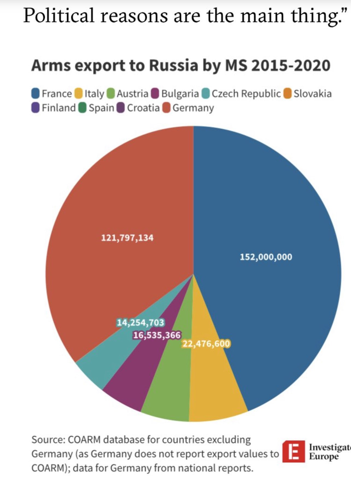
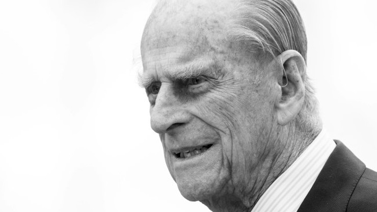
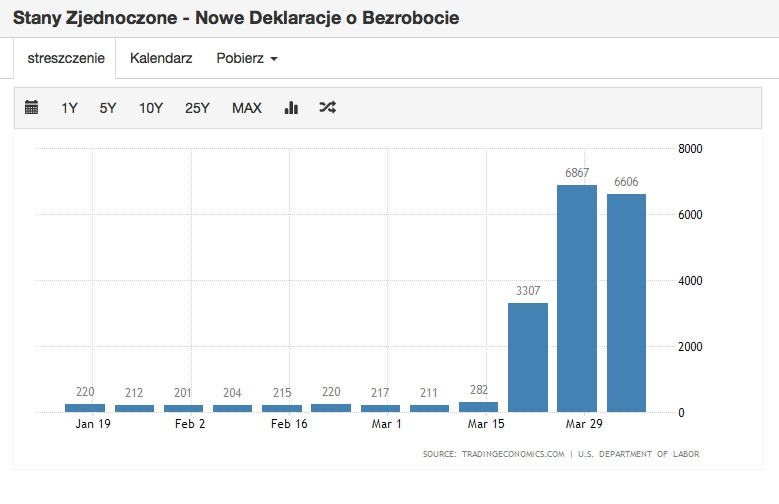
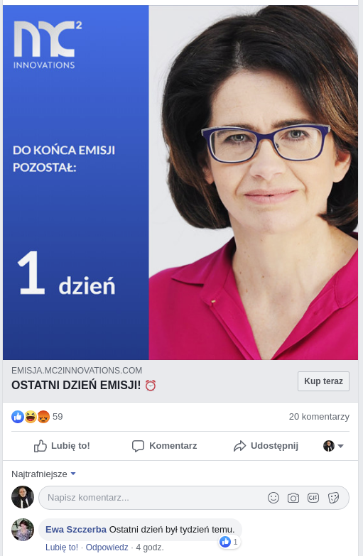
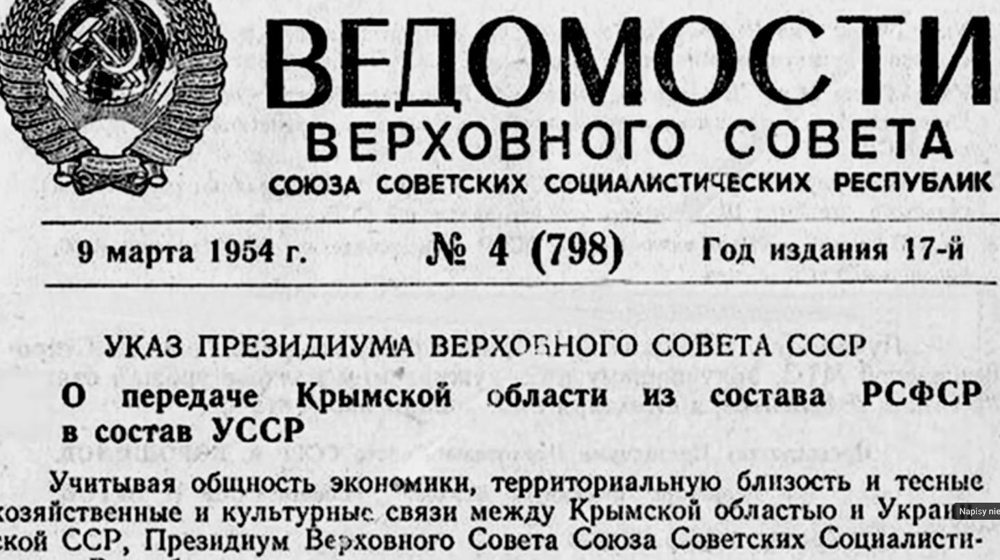
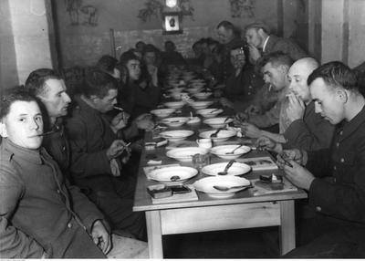
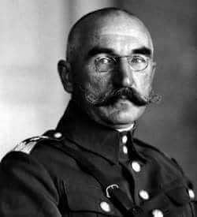
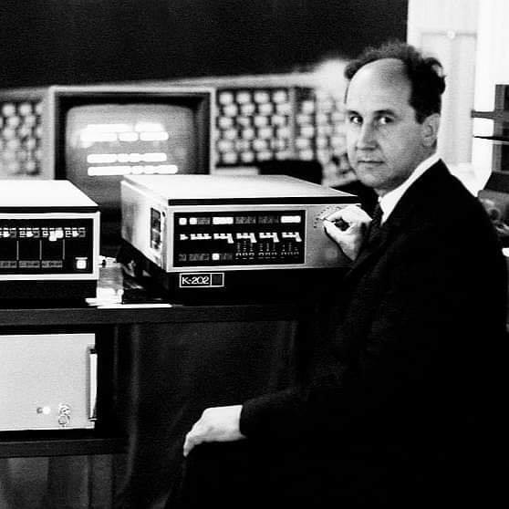
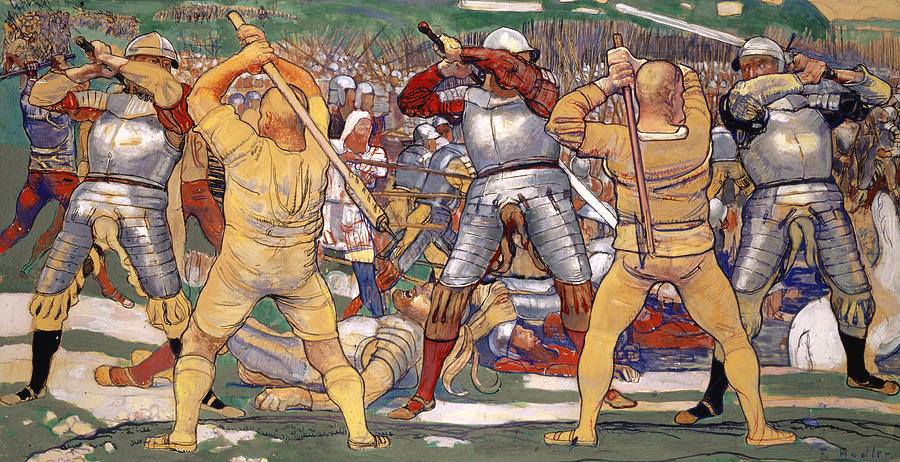

### 2022

Eksport broni do Rosji w latach z nałożonymi sankcjami.

Szukam i szukam, i Węgier nie widzę. Za to mamy dwóch liderów „tolerancyjnego i demokratycznego” świata. Niemcy i Francja.

  

---

> Zgubienie tożsamości narodowej w imię regionów zarządzanych globalnie.

---

Meanwhile in Sri Lanka, where the currency is collapsing and food shortages are increasing. Protesters in Colombo have defied a nationwide curfew and broke the police barricades.

---

### 2021

Książę Filip nie żyje

  

### 2020

  

#### USA

  

Ze Stanów Zjednoczonych nadchodzą same dobre wiadomości: trzeci tydzień z rzędu rośnie liczba bezrobotnych. Łącznie w ciągu ostatnich kilkunastu dni nie musi już pracować prawie 17 miliona ludzi. Dzielni inwestorzy z amerykańskiego z Departamentu Skarbu uczcili ten wzrost salwą wspaniałych notowań; Dow Jones Industrial Average wali pionowo w gorę! Trzeba przyznać, że niemały udział w sukcesie maja bankierzy z Centralnego, którzy te zakupy finansują. Triumfy święci nowoczesna współczesna teoria monetarna znana jako MMT, która pokazała, że nie sztuka pracować jak głupi Chińczyk i produkować wyroby. Teraz ideałem jest nie pracować (stąd takie powodzenie bezrobocia), mieć dobrą szybką drukarkę, a jedyne czego się od Amerykanów wymaga, to zgłosić się po zasiłek i wracać do domu na kwarantannę. W Polsce też już trwają pierwsze próby nowej teorii. Oby się powiodły!

Fed będzie kupował bezpośrednio (już nie z rynku wtórnego) obligacje stanów, hrabstw i miast. Można powiedzieć, że Rezerwa Federalna zdjęła rękawiczki i nie udaje już, że nie ma druku pustego pieniądza.

---

Chichot historii, że przez historyczny kryzys cały polski biznes ma przeprowadzić Pani, której szczytem kariery było prowadzenie Muzeum PRL w Nowej Hucie 😂

https://pl.wikipedia.org/wiki/Jadwiga_Emilewicz

---

> The question is not if but when, history repeats itself "It comes and goes in waves'' - if the perspective is period of 10 50 100 years. I wish/believe that Poland can overcome its "shadows"

---

"9 kwietnia spółka komandytowa Life Science Innovations, w której głównym wspólnikiem jest Szumowski Investments Sp. z o.o. (kiedyś jej wspólnikiem był sam Łukasz Szumowski, ale tuż przed wejściem do rządu przepisał udziały na żonę, z którą ma rozdzielność majątkową), kupiła udziały w startupie BrainScan z Gdyni. Konkretnie 170 udziałów o wartości nominalnej 8,5 tys. zł, które stanowią 24,2 proc. kapitału zakładowego. "Już 27 kwietnia BrainScan dowiedziała się, że otrzyma ponad milion złotych z dotacji z państwowej Agencji Badań Medycznych"

---

#### Mafia

Ministerstwo Rozwoju pracuje nad projektem krajowej karty płatniczej. Wiceminister Tadeusz Kościński w rozmowie z „Forbesem” podczas impact'16 fintech/insurtech zapewnił jednak, że nie chce walczyć z Visą i MasterCardem. Potwierdził przy tym, że pomysł wywołuje także sprzeciw banków. – Indyki nie głosują za świętami. Dlatego muszę przejąć odpowiedzialność za tabelę opłat i prowizji – stwierdził. Nie wykluczył likwidacji opłaty interchange

  

#### Scam

  

### 1954

  

### 1945

Dietrich Boenhoeffer, Admiral Canaris and others got killed by the Nazis in a six hours long matrydom. They died in their imperturbable believe in freedom as the highest value. The German constitution has been built on their principles.

### 1942

W Biuletynie Informacyjnym ukazało się wezwanie Delegatury Rządu RP na Kraj "Do polskich robotników miarodajnych"

Pamiętajcie, że każdy robotnik wywieziony do Niemiec ułatwia Hitlerowi dalsze prowadzenie wojny. Dając się wywieźć do Niemiec nie tylko będziecie znosić gorycz tułaczki i poniewierkę. Nie tylko będziecie traktowani jak niewolnicy, ale równocześnie przyczynicie się do przedłużenia wojny. Opóźnicie moment nadejścia oczekiwanego przez nas z utęsknieniem wyzwolenia. Obowiązkiem waszym jest uniknąć za wszelką cenę poboru na roboty do Niemiec. Niech nikt nie zgłasza się dobrowolnie. Unikakjcie za wszelką cenę łapanek. Moment krytyczny starajcie się przetrzymać w ukryciu. Jeżeli zostaniecie zmuszeni do pracy-pracujcie tak, aby wrogowi niewiele z tego przyszło. Pracując dla Hitlera przyczyniacie się do przedłużenia własnej niedoli. Odmawiając mu pracy - utrudnianie mu prowadzenie dalszej wojny i zbliżacie chwilę jego klęski, która jest nieunikniona.

  

### 1940

Z rąk katów NKWD w Katyniu zginął Henryk Minkiewicz-Odrowąż (zdjęcie)- polski generał, pierwszy dowódca Korpusu Ochrony Pogranicza, działacz polityczny, bliski współpracownik Józefa Piłsudskiego.
Pochodził z Suwałk, był weteranem I wojny światowej, w czasie której walczył w Legionach Polskich. Podczas wojny polsko-bolszewickiej był dowódcą 2 Dywizji Piechoty Legionów.
Po agresji sowieckiej na Polskę 17 września 1939 roku został aresztowany i osadzony w obozie w Kozielsku, w którym przebywał do 7 kwietnia 1940 roku, kiedy to został przewieziony do Katynia. Dwa dni później został zastrzelony.
Miał 69 lat.

  

---

<https://pl.wikipedia.org/wiki/Operacja_Weser%C3%BCbung>

<https://en.wikipedia.org/wiki/Locomotive_Acts>

### 1927

Urodził się Jacek Karpiński, inżynier, elektronik, informatyk, żołnierz batalionu "Zośka", trzykrotnie odznaczony Krzyżem Walecznych.

Twórca pierwszego polskiego mikrokomputera K-202.

➡️ W 1960 roku Karpiński był jednym z sześciu laureatów ogólnoświatowego konkursu młodych talentów techniki UNESCO.
W nagrodę wyjechał do USA, gdzie studiował m. in. na Harvardzie i w Massachusetts Institute of Technology.
Na początku lat 70-tych XX wieku stworzył najlepszy minikomputer (K-202) na świecie.

  

Jacek Karpiński - mógł budować polski przemysł informatyczny. Ale miał pecha. Urodził się za wcześnie...

Jacek Karpiński chciał pracować dla Polski. I wierzył, że "Ruscy sobie kiedyś pójdą. A technologia zostanie". Stworzył pierwszy na świecie komputer osobisty. Wybitny polski wynalazca, nie miał jednak szans na sukces w PRL. Szkoda, bo może dzisiaj bylibyśmy potęgą informatyczną.

W tej historii jest wszystko : wielki talent i wielka zawiść, wielkie nadzieje i równie wielkie porażki. Jacek Karpiński. Genialny polski konstruktor, twórca pierwszej na świecie maszyny do opracowywania długoterminowych prognoz pogody i minikomputera - na 10 lat przed erą pecetów. O takich ludziach kręci się filmy, ich imieniem nazywa się szkoły i ulice. W Polsce na razie doczekał się hasła w Wikipedii, ekspozycji w Muzeum Techniki w Pałacu Kultury i Nauki.....

### 1835

Zbudował prywatne państwo i mordował masowo ludzi: https://pl.wikipedia.org/wiki/Leopold_II_Koburg

### 1388

Wojna austriacko-szwajcarska: zwycięstwo wojsk szwajcarskich w bitwie pod Näfels.
"...Wojowniczy Leopold III wplątał się w konflikt ze Szwajcarami, który wybuchł w grudniu 1385 r. i którego końca nie było widać. Zawarty w lutym następnego roku rozejm miał obowiązywać jedynie do czerwca, po czym wznowiono walki. Leopold nie miał więc za bardzo ani czasu, ani być może nawet chęci, by osobiście zająć się sprawą syna. Poza tym jego położenie nie było zbyt wygodne, ponieważ znajdował się w obozie awiniońskim, a więc nie mógł liczyć na wsparcie Urbana VI. Austriacka klęska w bitwie pod Sempach w lipcu 1386 r. i żołnierska śmierć, jaką poniósł w niej Leopold III, ułatwiły powrót do polityki dynastycznej..."

  

---

<a href="https://github.com/TomaszWaszczyk/historia.waszczyk.com/edit/master/src/content/april-9.md" target="_blank">Edytuj tę stronę dzieląc się własnymi notatkami!</a>
