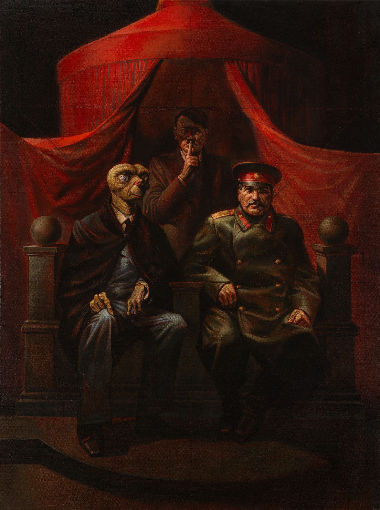
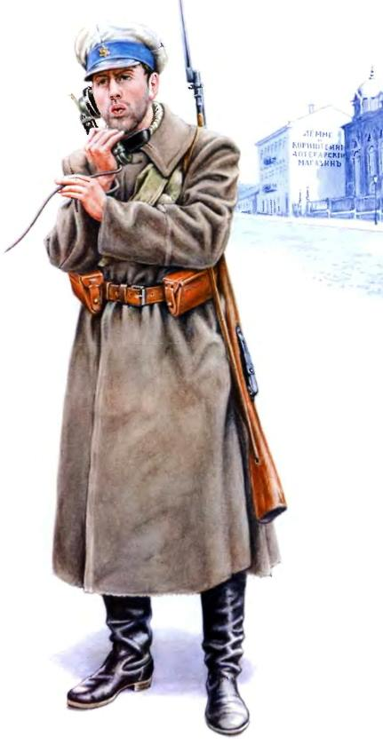
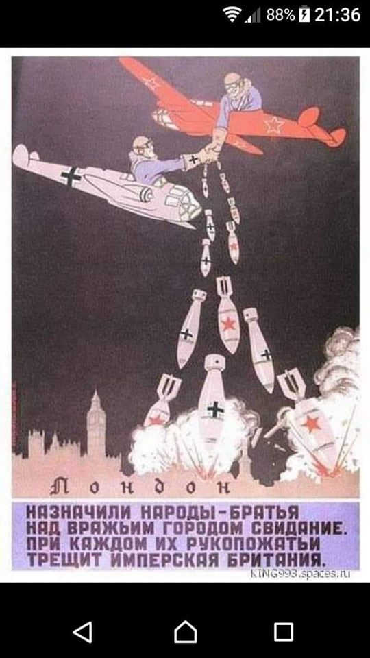
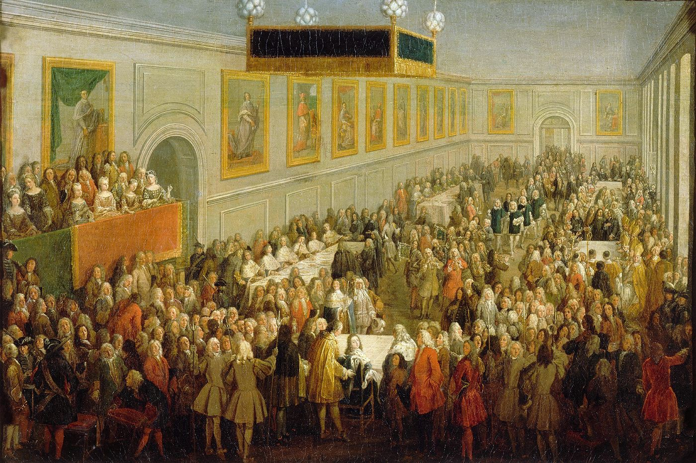
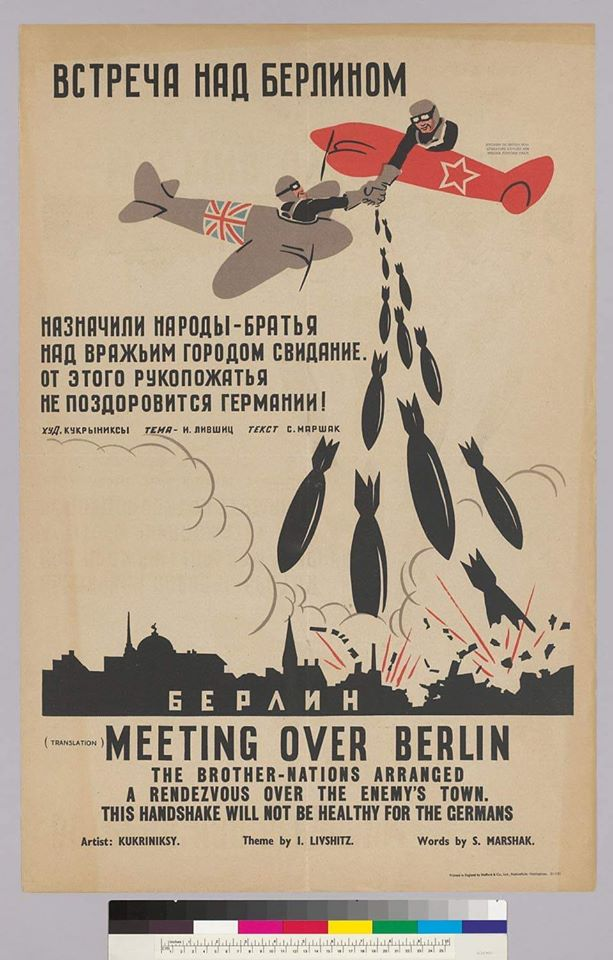
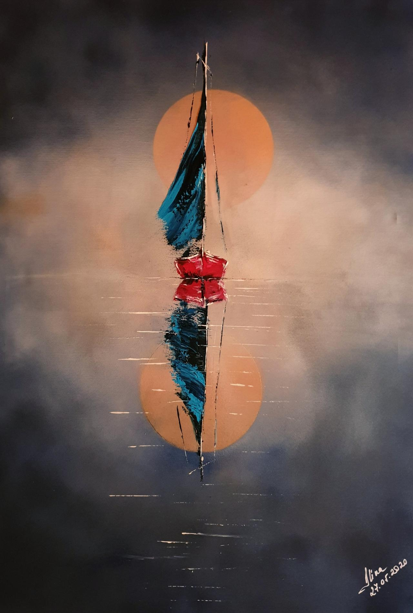

##### "Yalta Conference" Vitaly Komar and Alex Melamid, 1984

Tamara de Lempicka

---

---

Zdjęcie tytułowe przedstawia Władysława Strzemińskiego.

---

  

---

  

---

### 2020

  

---

### The Cantillon Effect at the time of the King of France Louis XV

  

### Назначили народы-братья Над вражьим городом свидание - 1941

  

  

---

Propaganda żydowska

  

---

  

---

<a href="https://github.com/TomaszWaszczyk/historia.waszczyk.com/edit/master/src/content/art.md" target="_blank">Edytuj tę stronę dzieląc się własnymi notatkami!</a>
