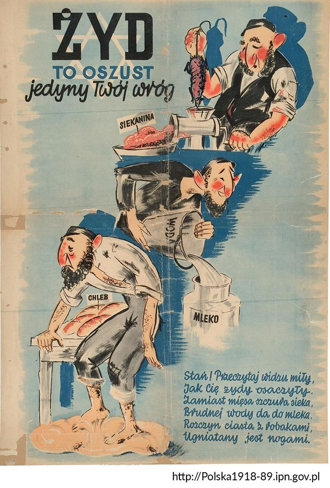

  

  

##### "Yalta Conference" Vitaly Komar and Alex Melamid, 1984

Tamara de Lempicka

https://en.wikipedia.org/wiki/Wu_Wei_%28painter%29

---

---

Zdjęcie tytułowe przedstawia Władysława Strzemińskiego.

---

  

---

  

---

  

---

Stefan Popowski - Wenecja (olej na płótnie, 78 x 62 cm), 1897, Muzeum Narodowe w Krakowie.

  

---

Darek Zabrocki - Windmill Town (grafika komputerowa), 2020

  

---

Mateusz Rafalski - Która godzina? (akryl, spray na płótnie, 100 x 100 cm), 2021.

  

---

Henryk Weyssenhoff - Tajemnicza pieśń (olej na płótnie, 53 x 87,5 cm), 1921, Muzeum Narodowe w Warszawie.

  

---

  

---

  

---

  

---

  

---

### 2020

  

---

Bombelstein

Sentoski malarz

Jankowski

Igor Pali

Rafał Olbiński

  

---

### The Cantillon Effect at the time of the King of France Louis XV

  

### Назначили народы-братья Над вражьим городом свидание - 1941

  

  

---

Propaganda żydowska

  

---

  

  

  

  

---

  

### Teatr

Biesy

Wojciech Pszoniak

---

<a href="https://github.com/TomaszWaszczyk/historia.waszczyk.com/edit/master/src/content/art.md" target="_blank">Edytuj tę stronę dzieląc się własnymi notatkami!</a>
