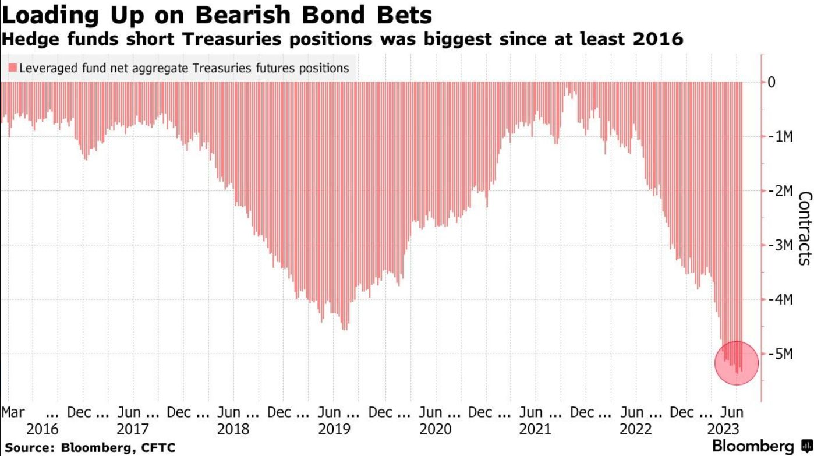
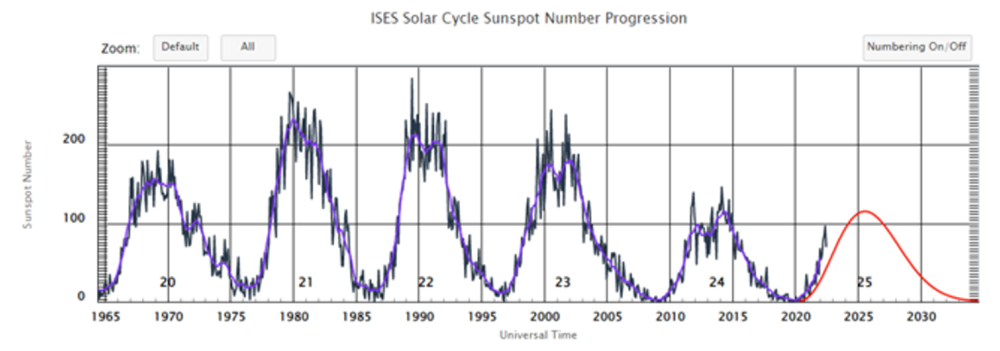
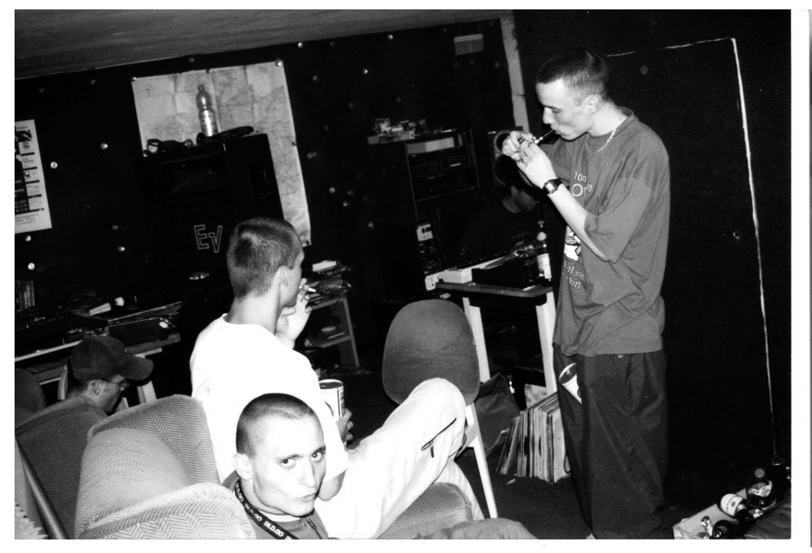
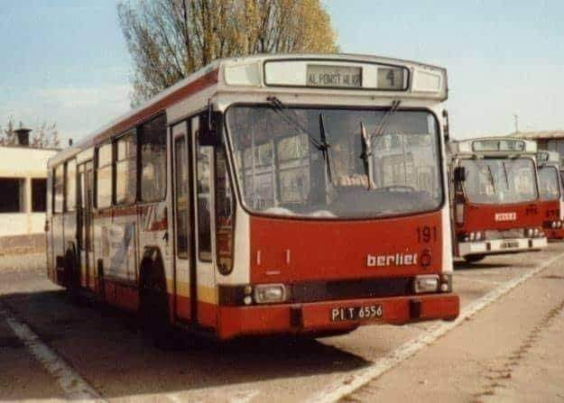
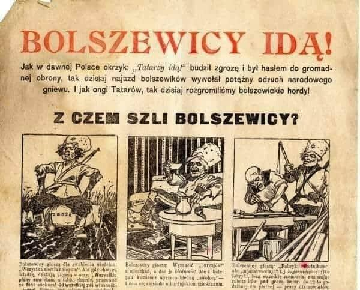
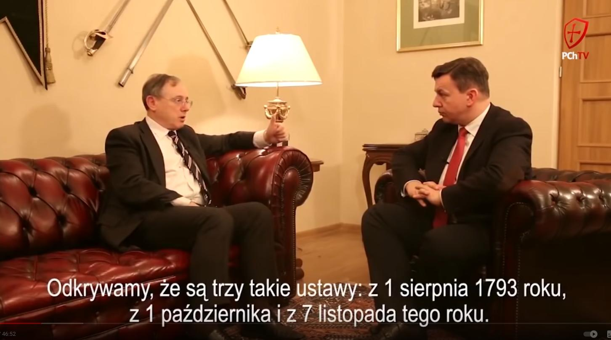

### 2023

Hedge Funds are shorting treasuries at historic levels and are the most short they've been since at least at least 2016.

  

Gentlemans, this is insanity. Short-Term Maturities, I am curious to see a post on these open positions based on Maturity. Value is universal world wide language.

---

  

  

  

  

  

---

<a href="./documents/july/imf-shadow-banking.pdf" target="_blank">IMF</a>

<a href="./documents/july/wp1501.pdf" target="_blank">wp1501.pdf</a>

---

### 2018

<a href="./documents/august/KomunikatdlaklientowI-UPS.pdf" target="_blank">Komunikat dla klientow I-UPS.pdf</a>

<a href="./documents/august/the-central-bank-balance-sheet-as-a-policy-tool-past-present-and-future.pdf" target="_blank">the-central-bank-balance-sheet-as-a-policy-tool-past-present-and-future.pdf</a>

### 2016

<a href="./documents/august/US_war_hawks_Lin.pdf" target="_blank">US war hawks, Lin</a>

### 2000

Witten, Magik (Piotr Łuszcz), Fokus (Wojciech Alszer) i Rahim (Sebastian Salbert) podczas wspólnych wakacji w Niemczech. W 1998 roku, po rozstaniu charyzmatycznego Magika z „Kalibrem 44”, Rahim nieśmiało wrócił do swojego marzenia o nagraniu z przyjacielem wspólnej płyty, a niesamowicie bezpośredni Fokus od razu rzucił pomysł założenia nowego zespołu – „Paktofoniki” („paktu przy dźwiękach głośnika”). Kolejne dwa lata młodzi śląscy hiphopowcy poświęcają na poszukiwania godnego zaufania wydawcy, a przede wszystkim przygotowanie materiału na wspólną płytę. Teraz, w Witten, razem z niemieckimi raperami, nagrywają ostatni, dwujęzyczny utwór „2kilo”. Wydany kilkanaście tygodni później album „Kinematografia” (czyli „filmy” na różne tematy, w trzech różnych stylach ich autorów) okaże się wielkim artystycznym wydarzeniem, prawdziwym przełomem w historii polskiego hip-hopu i zarazem głośną tragedią (osiem dni po premierze Magik wyskoczy z dziewiątego piętra swojego bloku). Dwadzieścia lat po „Kinematografii” Sebastian Salbert „Rahim” opowiedział szczerze Przemkowi Corso o ponad dwudziestu latach swojej muzycznej kariery – książkę „Ludzi z tylnego siedzenia”.

  

### 1972

Fabryka Autobusów w Jelczu zakupiła licencję na produkcję autobusu Berliet PR-100.
Autobus ten znany w Polsce pod nazwą Jelcz Berliet PR -100 lub jak kto woli "Stodoła", był jak na tamte czasy nowoczesną konstrukcją, która doskonale odpowiadała wymaganiom państwowych wówczas firm przewozowych. Posiadał on kanciastą linię nadwozia, duże okna, szerokie drzwi. Zainstalowanie silnika na zwisie tylnym i zastosowanie napędu osi tylnej pozwalało na obniżenie przebiegu podłogi do wartości około 500 mm w drzwiach przednich oraz około 700 mm w drzwiach środkowych.
Jego produkcję zakończono w 1975 roku, a zastąpił go model o nazwie Jelcz Berliet PR 110U.

  

### 1944

 https://pl.wikipedia.org/wiki/Powstanie_warszawskie

️Przysięga Armii Krajowej:

> W obliczu Boga Wszechmogącego  
> i Najświętszej Maryi Panny,  
> Królowej Korony Polskiej,  
> przysięgam być wierny Ojczyźnie mej,  
> Rzeczypospolitej Polskiej.  
> Stać nieugięcie na straży jej honoru,  
> o wyzwolenie z niewoli  
> walczyć ze wszystkich sił,  
> aż do ofiary mego życia.  
> Prezydentowi Rzeczypospolitej Polskiej,  
> Naczelnemu Wodzowi  
> i wyznaczonemu przezeń  
> Dowódcy Armii Krajowej  
> będę bezwzględnie posłuszny  
> a tajemnicy niezłomnie dochowam,  
> cokolwiek by mnie spotkać miało.  
> Tak mi dopomóż Bóg.

---

"Na Saskiej Kępie wredne sowiety, co pomoc mieli dać dla Polaka. Ruskim zwyczajem nas wydymali, smutna jest dola chłopaków z AK."

- to część zapomnianej piosenki powstańczej o mieście, "gdzie Hitler i Stalin, zrobili co swoje". Fajny tekst, ale jakby nie było, bardzo smutny, biorąc pod uwagę to, jak daliśmy się robić Sowietom.

1. sierpnia rozpoczęły się 63 dni największej tragedii w dziejach Polski. To była również największa akcja zbrojna podziemia w okupowanej przez Niemców Europie.

Chcieliśmy być wolni i wolność sobie zawdzięczać - wywalczyliśmy ją na 63 dni. Każdy o tym marzył, to było dla ludności Warszawy coś oczywistego, po prostu zgłosili się tam, gdzie trzeba było. Oni nie kalkulowali, obserwowali 5 lat represji na ulicach, trupów na latarniach, publicznych egzekucji.

Nie mieli prawa tego wytrzymać.

Wytrzymać natomiast musiało dowództwo AK. Powstanie praktcznie nie miało prawa się udać, biorąc pod uwagę fakt, że ledwie 10% miało walczących miało broń, ale przede wszystkim - dowództwo AK opierało się obietnicach pomocy od Sowietów, którzy od '39 roku metodycznie tępili wszelkie przejawy polskości na okupowanych przez siebie terenach. Rozbrajali wszystkich AK-owców, biorących udział w akcji Wisła, a w '43 do dowództwa AK doszły już plotki o zbrodni w lesie katyńskim...

Żaden logiczny argument nie wskazywał na to, że Sowiety chcieliby nam pomóc i że chcieliby słuchać naszego zdania pod jakimkolwiek względem. Tylko skończeni naiwniacy mogli brać za sojusznika akurat Stalina, a niestety takie było myślenie dowództwa Armii Krajowej...

Ponadto, naczelny samobójca AK - Leopold Okulicki, z premedytacją złamał rozkaz naczelnego wodza gen. Sosnkowskiego. Okulicki został wysłany do Warszawy z misją i rozkazem by wszelkimi sposobami zapobiec i nie dopuścić do wybuchu powstania w Warszawie.

Przebywający w Londynie Sosnkowski doskonale zdawał sobie sprawę z tego, w jaki sposób nasi sojusznicy postrzegają potencjalne powstanie i że nie nikt nie zamierza nam pomóc i jesteśmy sami jak w '39.

Niestety Armia Krajowa dostrzegała tylko jednego wroga - Niemców, którzy w lipcu '44 doskonale zdawali sobie sprawę z tego, że przegrają wojnę. Po co zatem wykrwawiać się z wrogiem, którego zaraz u nas i tak nie będzie?

1. sierpnia do walki stawiło się 35 tysięcy powstańców. Każdego kolejnego dnia powstania ginęły średnio 3 tysiące Polaków. Kwiat narodu, ściągnięty przez AK z całego kraju, które oszczędzając siły na Powstanie, nie zrobiło nic na Wołyniu, dając wymordować UPA 100 tysięcy naszych rodaków.

200 tysięcy osób nie doczekało wolnej Warszawy i wolnej Polski. Po tych 2 miesiącach podpisaliśmy akt kapitulacji, a Armia Czerwona, która stacjonowała ledwie na drugim brzegu Wisły, czekała i patrzyła, jak Niemcy metodycznie wyburzają Warszawę, wraz ze wszystkimi bezcennymi zabytkami, muzeami czy kościołami.

Z wielkim trudem słucha się tych wszystkich relacji o egzekucjach, czy Rzezi Woli, gdzie Niemcy przez niemal tydzień, każdego dnia mordowali 10 tysięcy osób.

Powstanie kończy się realizacją rozkazu Hitlera, który karze zniszczyć Warszawę "gdzie Hitler i Stalin, zrobili co swoje".

Jeszcze raz należy podkreślić - Armia Czerwona czekała i pozwoliła Niemcom nie tylko wygrać Powstanie, ale i metodycznie niszczyć Warszawę. Sam Pałac Saski został wyburzony dopiero 28 grudnia 1944, czyli 3 miesiące po zakończeniu walk.

Wyburzanie Warszawy to trwało to stycznia 1945, kiedy to Niemcy sami opóścili miasto w obawie przed manewrem okrążającym ze strony Sowietów.

Warto jest walczyć o wolność.

Tragedia nie poszła zupełnie na marne, powstańcy walczyli o kraj, w którym na stale będą żywe takie wartości jak miłość do ojczyzny, odwaga i gotowość do poświęceń, płacąc za to najwyższą możliwą cenę. To trzeba zapamiętać.

Warszawa to miasto, które przeżyło własną śmierć.

Bądźmy dumni z naszego niedocenionego kraju, który walczył w imię wolności wielu innych narodów.

Powstańcy liczą, że pamięć o nich przetrwa. Pamiętajmy zawsze o naszych Bohaterach w walce o Wolną Polskę. 🇵🇱

---

Heinz Reinefarth był cenionym burmistrzem w Westerland na wyspie Sylt i posłem do Landtagu. W sierpniu 1944 r. w Warszawie na jego rozkaz mordowana była ludność cywilna. W Niemczech nigdy nie odpowiedział za swoje zbrodnie. Po 70 latach mieszkańcy Westerland przełamują milczenie.

---

1920 roku w czasie wojny polsko-bolszewickiej rozpoczęły się trwające tydzień walki na linii Bugu walki między 1. i 4. Armią Wojska Polskiego, a wojskami bolszewickimi. Polacy atakowani byli na odcinku od Brześcia do Wyszkowa. Kilkudniowy opór poskutkował chwilowym zatrzymaniem idących na Warszawę Rosjan, co wykorzystano do wzmocnienia pozycji obronnych wokół stolicy oraz na koncentrację wojsk przewidzianych do kontruderzenia nad Wieprzem.

---

1431 roku w Elblągu odbyła się narada, w czasie której wielki mistrz zakonu krzyżackiego Paul Bellitzer von Russdorff (grafika) spotkał się pruskimi komturami. Ustalone zostało podjęcie ugody z ze zbuntowanym i zagrożonym polską interwencją wielkim księciem litewskim Świdrygiełłą, a także podjęto decyzję o zorganizowaniu przeciwko Polsce ekspedycji złożonej z pospolitego ruszenia stanów, w tym ludności chłopskiej.

---

1944 roku w Berlinie miała miejsce rozmowa Heinricha Himmlera z Adolfem Hitlerem, w czasie której ten pierwszy powiedział:

> Mój Führerze, moment jest niekorzystny. Uważam wszakże za szczęśliwe zrządzenie losu, że Polacy to czynią . Za 5-6 tygodni opuścimy te obszary. Wtedy jednak zniszczona będzie Warszawa, stolica i serce tego 16-17 milionowego narodu, który od siedmiuset lat blokuje wschód, a od bitwy pod Grunwaldem stale zagradza nam drogę w tym kierunku. Warszawa zostanie zniszczona wraz z jej inteligencją . W konsekwencji problem polski przestanie być wielkim problemem dla naszych dzieci, dla dalszych potomków, a nawet już dla nas.

---

Norman Davies
POWSTANIE '44

Fragmenty książki opisujące pierwszy dzień Powstania w Warszawie.

Godzinę „W" wyznaczono na 1 sierpnia o 5.00 po południu. Ale o 13.50 na Żoliborzu młody kapral podchorąży AK „Marek", późniejszy wybitny krytyk muzyczny, miał zaszczyt rozpocząć Powstanie przed wyznaczonym czasem. Prowadząc swoją drużynę do punktu zbiórki, na ulicy Krasińskiego natknął się na zmotoryzowany niemiecki patrol:
Muszę powiedzieć, że był właściwie taki moment, kiedy zupełnie wyraźnie obserwowaliśmy się wzajemnie i widać było, że Niemcy robią jakiś rachunek zysków i strat - czy zacząć starcie, zacząć walkę z nami, czy udać, że nie zwracają uwagi na kilkunastu młodych ludzi, już w butach z cholewami bądź ubranych przynajmniej od spodu w mundury, bo od góry, mimo gorącego dnia, w płaszcze, pod którymi schowana była broń: pistolety maszynowe, broń krótka, granaty- Jak gdyby zastanawiali się, czy doprowadzić do tego starcia, czy nie. W pewnym momencie zdecydowali się i rozpoczęła się walka. Walka, z której wyszliśmy właściwie z pełnym sukcesem, ponieważ obrzuciliśmy samochód niemiecki granatami, sami nie ponieśliśmy strat. Samochód się zapalił. Niemcy zostali pokonani, nam udało się przeskoczyć przez ulicę i dojść na miejsce zbiórki, gdzie już była reszta 9. Kompanii Dywersyjnej, której stanowiliśmy jedną ze składowych części.

O piątej, tak jak było umówione, we wszystkich dzielnicach miasta rozpętało się piekło. Główne placówki Niemców zostały zaatakowane przez grupy młodych śmiałków z biało-czerwonymi opaskami na ramionach. Ludność cywilna znajdowała się jeszcze na ulicach. Niektórzy dostali się w krzyżowy ogień i na zawsze odcięto ich od rodzinnych domów. Wkrótce na szczycie Prudentialu, najwyższego budynku z mieście, powiewał już biało-czerwony sztandar. Zdobyto niemieckie magazyny żywności i umundurowania na Stawkach, gmach PKO i hotel Victoria przy ulicy Jasnej, budynek Sądu Apelacyjnego na placu Krasińskich, gmach Dyrekcji Kolei na Pradze. Straty wraz z rozstrzelanymi przekroczyły 2000 ludzi.
Podobne straty ponieśli alianci podczas desantu na plażach Normandii.

Nie sposób ustalić tożsamości pierwszego poległego powstańca. Ale jedną z pierwszych ofiar z pewnością był „Sadowski" - piętnastoletni syn byłego premiera: „1 sierpnia, w pierwszym dniu Powstania Warszawskiego, został śmiertelnie raniony na ulicy Flory naprzeciwko cukierni Dakowskiego. Według jednego z kolegów, Andersa, który radził, żeby uciekać, miał odpowiedzieć: »Nie po to mnie tu przydzielili«. Tego samego dnia została ciężko ranna i 2 sierpnia zmarła w szpitalu polowym sanitariuszka dywizjonu „Jeleń", do którego należał „Sadowski". Trzydziestoletnia „Danuta" z 1108. Plutonu została postrzelona, kiedy biegła opatrzyć rannego żołnierza podczas ataku na Dom Prasy przy Marszałkowskiej 3/5. Była pieśniarką i kompozytorką i to właśnie ona napisała najpopularniejszą powstańczą piosenkę Hej chłopcy, bagnet na broń. Pozowała także przed wojną do słynnego posągu warszawskiej Syrenki, który Niemcy wywieźli z miasta. Dowództwo AK zostało przeniesione do fabryki mebli Jerzego Kamlera, znajdującej się na Woli przy ulicy Dzielnej 72. Wieczorem 1 sierpnia, oceniając nadesłane raporty, dowiedziano się tam, że wielu kluczowych celów nie udało się zdobyć. Powstańcy nie odnieśli żadnych większych sukcesów na placu Zamkowym, w rejonie twierdzy niemieckich sił policyjnych w alei Szucha i na lotnisku Okęcie
wszystkich tych miejscach mieli znaczne straty. A przede wszystkim nie udało im się zdobyć kontroli ani nad zachodnimi, ani nad wschodnimi krańcami dwóch głównych mostów na Wiśle. Wiedzieli już, że być może czeka ich bardzo długa walka.

Młody rekrut poznaje towarzyszy broni i rusza do walki.

Ostatnie dni lipca spędziłem przy telefonie, jako swego rodzaju oficer dyżurny, oczekując na wezwanie dla mojego plutonu, aby się przyłączył do Powstania.
Telefon zadzwonił rano 1 sierpnia i wyruszyliśmy dwójkami do urzędu celnego przy Dworcu Gdańskim, gdzie był punkt zborny naszej jednostki. Przyszedłem dość wcześnie, ale około godziny trzeciej byli tam już wszyscy - od siedemdziesięciu do siedemdziesięciu pięciu mężczyzn. Było to nasze pierwsze jawne spotkanie. (...)
W Powstaniu mieliśmy działać jako kompania. Naszym dowódcą był „Stasinek" (doktor Sosabowski), którego spotkałem już wcześniej, kiedy dowodził operacjami Palmiry i Skruda. (...) Znaliśmy go jako bardzo dzielnego oficera i wspaniałego dowódcę. (...) Po serdecznych powitaniach, ożywionych rozmowach i chwilach wielkiego podniecenia „Stasinek" zebrał nas i wygłosił krótkie przemówienie. Staliśmy w dwuszeregu w głównym holu urzędu celnego; włożyliśmy biało-czerwone opaski oraz insygnia stopni wojskowych. Po półtora roku działalności w konspiracji była to nasza pierwsza wojskowa uroczystość. (...) Dokładnie o piątej po południu nasza jednostka - Kedyw „Kolegium A" - wypadła z budynku urzędu ceł i wyruszyła w kierunku naszego pierwszego celu: na Umschlagplatz, który był stacją przejściową i skąd wysyłano do obozów zagłady Żydów z całego Dystryktu Warszawa. Był to ten sam budynek, w którym półtora roku wcześniej czekałem na transport do obozu zagłady. Budynku bronił oddział SS, który był uprzedzony o ataku, ponieważ Armia Krajowa utraciła szansę na element zaskoczenia tego samego dnia rano, kiedy Niemcy złapali kilku żołnierzy przenoszących broń. Już w pierwszej godzinie walki ponieśliśmy straty - byli ranni i zabici.
Po zdobyciu Umschlagplatz, gdzie uwolniliśmy grupę pięćdziesięciu Żydów wykonujących niewolniczą pracę dla SS, zostaliśmy w tym budynku na noc. Znaleźliśmy ogromne zapasy żywności i mundurów, a także trochę broni. Natychmiast przebraliśmy się z półcywilnych ubrań w niemieckie buty i mundury, ale aby się odróżniać od Niemców, nosiliśmy na ramieniu biało-czerwone opaski, insygnia wojskowe, a na nowo zdobytych czapkach mieliśmy orzełki. - Sanisław Aronson

Foto: 1 sierpnia 1944, godzina „W” (17.00).
Patrol por. „Agatona” z batalionu „Pięść” na pl. Kazimierza Wielkiego

---

Konsekwencje upadku Powstania Warszawskiego.

Upadek Powstania Warszawskiego niósł ze sobą daleko idące konsekwencje, które przez lata rzutowały na sytuacji Polski i Polaków. Przez lata dyskutowano, czy rozpoczęcia walk o stolicę było uzasadnione, zwłaszcza w kontekście ogromnych strat i zniszczenia niemal całego miasta.

Zakończenie walk o stolicę Polski na początku października 1944 roku było nie tylko militarnym końcem Powstania Warszawskiego, ale i ważnym politycznym aktem, który pociągnął za sobą wiele długofalowych konsekwencji. Najbardziej prozaicznym skutkiem przegranej przez Polaków batalii było utrzymanie kontroli nad miastem przed jednostki niemieckie. Plan wyzwolenia stolicy siłami Polskiego Podziemia zakończył się fiaskiem, a miasto zostało odbite dopiero w styczniu 1945 roku przez prowadzącą ofensywę radziecką Armię Czerwoną. Z tej perspektywy Powstanie Warszawskie stanowiło zwieńczenie nieudanej akcji ,,Burza", która w zamyśle dowódców Armii Krajowej miała pozwolić na opanowanie polskiego terytorium zanim zrobią to Sowieci. Upadek powstania był ostatnim aktem dramatu członków Polskiego Podziemia, którzy konsekwentnie uczestniczyli w walkach z Niemcami, by następnie ustępować pola silniejszej Armii Czerwonej. Zbrojna konfrontacja z Sowietami nie miała bowiem racji bytu wobec ogromnej dysproporcji sił i środków. Z militarnego punktu widzenia samo powstanie miało wpływ na przebieg niemiecko-radzieckiego frontu oraz wynik walk Wehrmachtu z Armią Czerwoną. Wobec dużych strat armii niemieckiej w Warszawie Sowieci mieli ułatwione zadanie w czasie przełamywania linii Wisły i opanowywania zdewastowanego miasta.

Dewastacja, o której mowa była skutkiem nie tylko działań wojennych, ale także celowej polityki niemieckiego okupanta. Warszawa silnie ucierpiała najpierw w czasie Wojny Obronnej 1939 roku, a następnie w trakcie powstania w Getcie Warszawskim. Niemcy prowadzili także rabunek mienia i dóbr kulturalnych, w tym dzieł sztuki, niszczyli także pomniki. Wszystko to złożyło się na obraz miasta zniszczonego przed sierpniem 1944 roku w ok. 25% w stosunku do stanu przedwojennego. Dopiero jednak powstanie sprawiło, że lewobrzeżna część miasta została w połowie obrócona w gruzy. Złożyły się na to ostrzeliwania i eksplozje przeprowadzone przez obie strony konfliktu (szczególnie ostrzał artylerii niemieckiej), jak również podpalenia i wysadzenia budynków przez żołnierzy niemieckich, którzy przeczesywali kolejne dzielnice w poszukiwaniu powstańców i ludności cywilnej. Niemal w całości zniszczone zostało Stare Miasto, a szczególnie mocno ucierpiały Śródmieście, Wola, Mokotów, Żoliborz czy Powiśle, gdzie toczyły się zacięte walki. Jeszcze w trakcie powstania niemiecki dyktator Adolf Hitler wydał rozkaz zrównania miasta z ziemią i wybicia jego mieszkańców. W październiku podobny rozkaz wydał Heinrich Himmler. Był to element zbrodniczej polityki eksterminacyjnej Niemiec względem Polski, szczególnie wobec Warszawy, którą uważano za centrum polskiego życia intelektualnego i patriotycznego. W konsekwencji po upadku powstania do prac przystąpiły niemieckie oddziały, które konsekwentnie, budynek po budynku wyburzały zabudowę miasta. Stolica Polski została także rozszabrowana przez Niemców, którzy wywozili ocalałe jeszcze dobra kulturalne i zabytki. Dzięki poświęceniu pracowników Muzeum Narodowego Polakom udało się uchronić część eksponatów. Aż do ofensywy Armii Czerwonej w styczniu 1945 roku Niemcy dewastowali miasto, zamieniając je w kupę gruzów. Szacuje się, że nawet 85% lewobrzeżnej Warszawy mogło zostać zrównanych z ziemią. Wyburzono niemal wszystkie kościoły, szkoły i budynki użyteczności publicznej, zniszczono bezcenne zabytki polskiej kultury. Zbrodni towarzyszyło prześladowanie ludności cywilnej, w tym masowe mordy i wypędzenia. Powojenna odbudowa miasta była ogromnym wysiłkiem narodu polskiego, który przywrócił dawną świetność stolicy.

Zniszczeniu miasta towarzyszyła fizyczna eksterminacja jego mieszkańców. W czasie walk śmierć poniosło do 150 tys. ludzi, z czego przynajmniej jedna trzecia została zabita w wyniku celowej eksterminacyjnej polityki niemieckiego okupanta. Po upadku powstania Niemcy przystąpili do masowych wysiedleń ludności cywilnej. Polaków gromadzono głównie w obozie przejściowym w Pruszkowie, skąd następnie przesiedlano ich albo na inne obszary Generalnego Gubernatorstwa, albo na przymusowe roboty do III Rzeszy, albo osadzano w niemieckich obozach koncentracyjnych. Łącznie wysiedlonych zostało ok. 650 tys. ludzi, z czego niemal 550 tys. przypadało wyłącznie na ludność samego miasta.

Wreszcie konsekwencje upadku powstania należy rozpatrywać także w kategoriach politycznych. Klęska Polaków wiązała się z porażką koncepcji wyzwolenia stolicy zanim zrobi to Armia Czerwona. Armia Krajowa poniosła w powstaniu ogromne straty osobowe. Blisko 18 tys. żołnierzy mogło zostać zabitych. W powstaniu zginął najbardziej wartościowy, patriotyczny i doświadczony w walce i konspiracji element polskiego społeczeństwa. W efekcie politycznych porozumień mocarstw alianckich Polska miała zostać oddana do radzieckiej strefy wpływów. Wyniszczenie kadry AK pozwoliło Sowietom na znacznie łatwiejsze zainstalowanie posłusznych władz oraz stłumienie oporu antykomunistycznej opozycji. Powołane przez Moskwę marionetkowe organy uzurpowały sobie prawo do reprezentowania polskiego narodu. Gdy zabrakło elit i żołnierzy AK, nikt nie mógł powstrzymać komunistów przed sięgnięciem po władzę. W praktyce AK przestała istnieć, a jej rozwiązanie zostało przypieczętowane w styczniu 1945 roku rozkazem ostatniego komendanta organizacji. Powstanie nie ,,wstrząsnęło sumieniem świata" i nie doprowadziło do odwrócenia niekorzystnych dla Polski zapisów konferencji Wielkiej Trójki alianckiej, na co liczyli jego przywódcy. W efekcie przyniosło niewiele realnych pozytywnych skutków. Przez lata historycy zastanawiali się, czy walka o honor była warta zniszczenia miasta, wybicia ludności i rozbicia AK. Można mieć uzasadnione wątpliwości, choć dzisiaj na Powstanie Warszawskie patrzy się przede wszystkim z perspektywy bohaterstwa jego uczestników i hekatomby mieszkańców, upamiętniając samotny bój polskiej stolicy.

---

### 1920

W czasie wojny polsko-bolszewickiej rozpoczęły się trwające tydzień walki na linii Bugu walki między 1. i 4. Armią Wojska Polskiego, a wojskami bolszewickimi. Polacy atakowani byli na odcinku od Brześcia do Wyszkowa. Kilkudniowy opór poskutkował chwilowym zatrzymaniem idących na Warszawę Rosjan, co wykorzystano do wzmocnienia pozycji obronnych wokół stolicy oraz na koncentrację wojsk przewidzianych do kontruderzenia nad Wieprzem.

  

### 1793

  

> ...chodzi o to, by stworzyć warunki do tego, by francuska armia dokonała eksterminacji wszystkich mieszkańcow i unicestwienia ich dóbr... - na rozkaz Robespierre, Carnot, Barere (masowe morderstwo w Wandei)

Rewolucja Francuska, to właśnie nowy człowiek bez Boga. Rewolucja Radziecka, to nowy człowiek bez klas, również bez Boga.

---

<a href="https://github.com/TomaszWaszczyk/historia.waszczyk.com/edit/master/src/content/august-1.md" target="_blank">Edytuj tę stronę dzieląc się własnymi notatkami!</a>
