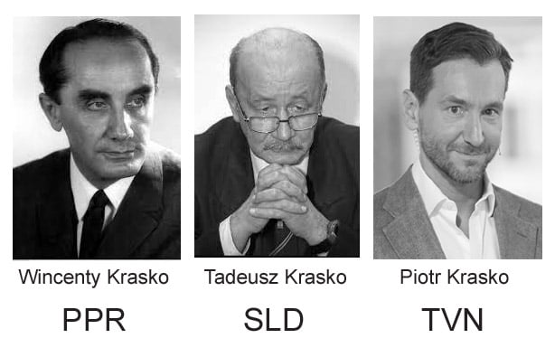
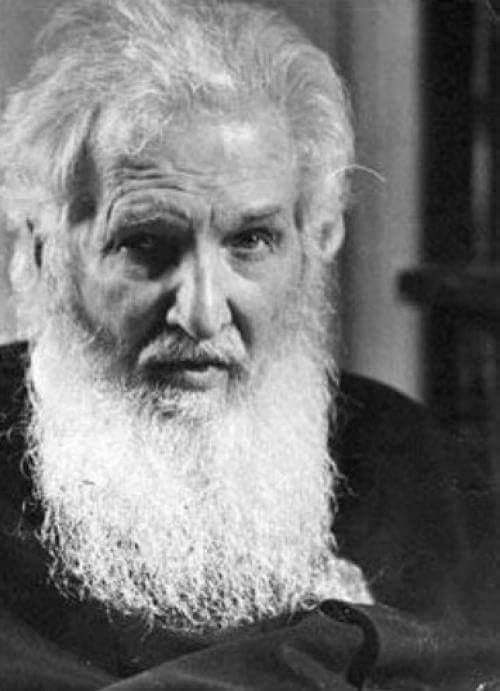
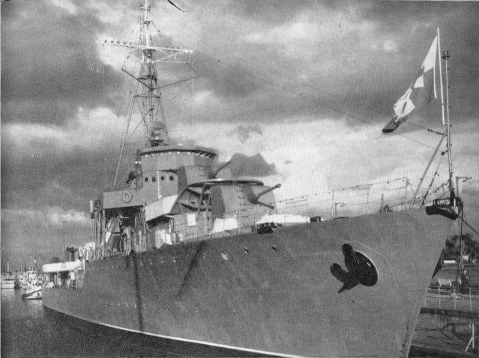

### 2023

> Mapy szerzenia fałszywych teorii pokrywają się z mapami ubóstwa.

---

> Caritas tworzy system pomocy dla uchodźców

Choć doraźne wsparcie poszkodowanych w wyniku wojny na Ukrainie wciąż jest potrzebne, Caritas przechodzi z działania w trybie kryzysowym do rozwiązań systemowych. W całej Polsce funkcjonuje już ponad 30 centrów pomocy uchodźcom Caritas, które obejmują potrzebujących kompleksową pomocą.

– W pierwszych dniach wojny reagowaliśmy głównie na podstawowe potrzeby. Docierających do Polski uchodźców trzeba było nakarmić, ogrzać, dać im pierwsze bezpieczne schronienie – wspomina ks. dr Marcin Iżycki, dyrektor Caritas Polska. – Te potrzeby wciąż występują, zarówno tam, w Ukrainie, gdzie wciąż trwają działania wojenne, jak i wśród osób, które mniejszym niż początkowo strumieniem, ale nadal napływają do Polski. I na te potrzeby nadal odpowiadamy, również we współpracy z naszymi partnerami w Ukrainie, których wspieramy w ich pracy na miejscu. Ale jednocześnie mamy już w naszym kraju ogromną liczbę uchodźców z Ukrainy, którzy potrzebują bardziej kompleksowej pomocy. I właśnie dla nich przygotowaliśmy propozycję systemowych działań – tłumaczy duchowny.

---

👀 2008-2009

  

---

> Zoom's Updated Terms of Service Permit Training AI on User Content Without Opt-Out

---

### 1976

Wincenty Kraśko -  działacz komunistyczny, prawnik i dziennikarz. Poseł na Sejm PRL II, III, IV, V, VI i VII kadencji, członek Rady Państwa w latach 1972–1976. Wiceprezes rady Ministrów w rządzie Piotra Jaroszewicza. Budowniczy Polski Ludowej, utrwalacz socjalizmu.

Tadeusz Kraśko - w czasach PRL zastępca redaktora naczelnego Redakcji Publicystyki Kulturalnej TVP1, szef Redakcji Reportażu i Filmu Dokumentalnego TVP2. Na przełomie lat 70/80 pełnił funkcję radcy ambasady PRL i był dyrektorem Instytutu Kultury Polskiej w Sztokholmie. W wyborach parlamentarnych 2011 do Sejmu RP startował w okręgu wyborczym 19 z listy Sojuszu Lewicy Demokratycznej, mandatu nie uzyskał, otrzymał 164 głosy.

Piotr Kraśko - w czasach PRL występował w Telewizji Polskiej jako prezenter programu dla dzieci i młodzieży 5-10-15. Pracował jako korespondent telewizii publicznej w Rzymie, następnie przeniesiony do Waszyngtonu. Od 27 maja 2008 był gospodarzem głównego wydania Wiadomości, a od 26 stycznia 2012 również redaktorem naczelnym tego programu. Od kwietnia 2016 związany z Grupą TVN.

  

### 1955

https://pl.wikipedia.org/wiki/Zdzis%C5%82aw_Krygowski

### 1943

Arcybiskup  metropolita lwowski Andrzej Szeptycki napisał list pasterski, w którym nawoływał Naród ukraiński do zaprzestania mordów Polaków. 
,,Zwracam się do Was, Wielebni Ojcowie i Drodzy Bracia w okolicznoś­ciach bardzo poważnych.
Wojna, która trwa już blisko cztery lata, zbliża się do końca. Może już bliska jest ta chwilą, kiedy rozstrzygnie się na długie może lata los naszego Kościoła i naszego narodu.
Odczuwam potrzebę porozumienia się z Wami wszystkimi, z tobą Drogi Narodzie Ukraiński. Ojcowie, przeczytajcie podczas najbliższej niedzieli mój list pasterski we wszystkich macierzystych cerkwiach naszej Metropolii: i w tych, w których, duchowny pracuje stale, i w tych, do których tylko dojeżdża proboszcz sąsiedni.
Zwracając się do całego narodu, mam na myśli przede wszystkim starszych i poważniejszych ludzi każdej gminy. Z nimi to w pierwszym rzędzie chcę się porozumieć. Nie znaczy to, ażebym lekceważył myśli i dążenia mło­dzieży. Ona jest przecie kwiatem, przyszłością naszego narodu, ona przecież dla sprawy narodowej ponosiła i ponosi ciężkie ofiary i chciałaby te ofiary jeszcze powiększać. Dla niejednego z młodych ideałem jest oddać życie za Ojczyznę. Ale wy, starsi w gromadzie, jesteście tego świadomi, że młodzież w obecnych czasach chce zanadto rządzić i przewodzić, usuwając nawet starszych od wszelkiego głosu. Często nawet po prostu żądają, ażeby wszyscy podporządkowali się im. Żądania takie nie tylko że są niesprawiedliwe, ale po prostu mogą stać się niebezpieczne dla społeczeństwa i dla całego narodu. W młodzieży musimy cenić gorące uczucie, jakie wnosi ona w każdą, swoją ro­botę. Ale nigdy nie będzie dosyć ażeby jej przypominać, że w kierowaniu sprawami ogółu, czy to w gminie czy w całym narodzie doświadczenie i stary rozum ma co najmniej tyle znaczenia co gorący temperament i uczuciowa wo­la. Biorąc się do decydowania spraw ogółu bez dostatecznego doświadczenia i bez dobrej woli zasięgnięcia rady starszych, młodzież naraża nas wszystkich na poważne niebezpieczeństwa.
Pomiędzy młodzieżą znajdują się też starsi, którzy nią kierują; ale mieliś­my aż nadto dowodów na to, że między tymi kierownikami młodych zbyt często i zbyt łatwo znajdują się agenci naszych wrogów, którzy po prostu prowokują młodzież do czynów bezprawnych, do kroków nierozważnych, które tylko mszczą się na całej gromadzie.
Byliśmy świadkami nawet strasznych morderstw dokonanych przez mło­dych ludzi, może nawet w dobrych zamiarach, ale ze zgubnymi następstwami dla narodu. Widzieliśmy nieraz ludzi, którzy przekazywali naszej młodzieży nakazy naszych narodowych przewodników i rozkazywali dla dobra sprawy kogoś zabić. Było dużo takich wypadków, że sami prowodyrzy młodzieży głośno i publicznie stwierdzali, że agenci którzy nakazywali zabójstwa byli prowokatorami i służyli naszym wrogom. Niestety takie wypadki wytworzy­ły wśród młodzieży fałszywe przeświadczenie; że można kogoś pozbawić życia.     
Kilka już razy przestrzegałem wszystkich wiernych przed strasznymi nas­tępstwami nieprzestrzegania V prawa Bożego, które zabrania mordowania lu­dzi. Nieraz już przestrzegałem przed tymi wszystkimi namiętnościami, które otwierają człowiekowi drogę do tego przestępstwa ściągającego na duszę przekleństwo Niebios, na ciało nakładającego piętno niewinnie przelanej krwi, to piętno, którego nie zmaże żadna pokuta! Przestrzegałem przed złością, przed narodową nienawiścią, przed partyjnymi kłótniami, przed dąże­niem pomsty na wrogach.
Dziś muszę jeszcze raz wrócić do tej przestrogi. Zmienię to tylko chyba, że przestrogę pod adresem młodych skieruję na wasze ręce.
Jesteście ich ojcami — w ważnych chwilach naszej historii strzeżcie wa­szych synów przed przestępstwem, jakie mogłoby na całą wieś ściągnąć wiel­kie nieszczęście.
W czasach, kiedy ludzie przestają rozumieć święte i szczytne ideały chrześcijaństwa, Kościół święty wysoko dzierży sztandar obrony życia i mie­nia ludzkiego. Kościół nigdy nie przestaje głosić nauki praw Bożych, nie przestaje przestrzegać przed przestępstwami, grozić karą Bożą, jaki wskazy­wać narodom drogę wiernego spełnienia woli Bożej, jako jedyną drogę do osiągnięcia lepszej przyszłości. Tak postępuje duchowieństwo nasze w cza­sach obecnych. Posłuszni naszym wskazówkom już nieraz powtarzali wam Ojcowie Duchowni naukę o prawdzie Bożej, która strzeże bliźniego i jego mienie.
Dziś, Drodzy Moi, zwracam się do Was starszych po gromadach, przema­wiam do gospodarzy i gospodyń, do ojców rodzin chrześcijańskich i przypo­minam, że mają oni razem z Kościołem stać na straży ładu społecznego, ży­cia i mienia bliźniego. Są oni członkami Kościoła, ich zatem obowiązkiem jest współpraca z Kościołem w spełnieniu nałożonych im przez Boga obo­wiązków. Wtedy, kiedy jeszcze we wszystkich krajach Europy panowała cie­mność, Kościół Święty nieustanną pracą nad sumieniem ludzkim wytwarzał powoli kulturę i cywilizację i stworzył podstawy, na jakich oparły się pań­stwa średniowiecza.
W tej pracy cywilizacyjnej pomagała duchowieństwu warstwa łudzi star­szych, doświadczonych i wiernych prawom Boskim. Oni pomagali Kościoło­wi w pracy nad ludźmi, walczyli razem z nim z ciemnością samowoli i samolubstwa i powoli kładli podwaliny pod rozwój zasad chrześcijańskich w życiu prywatnym i społecznym.
Zdaje się, że czasy obecne w jakich żyjemy, wymagają od Kościoła takiej samej pracy nad społecznościami ludzkimi. Przyszłość naszego narodu w du­żej mierze zależy od sposobu, w jaki Kościół to swoje zadanie wobec naszego narodu wykona.
A pierwszą i najważniejszą zasadą chrześcijańskiej kultury jest poszano­wanie tego prawa Bożego, które strzeże życia i mienia bliźniego, a w każdych zamieszkach ta zasada jest najbardziej narażona na podeptanie. W naszych czasach, tak samo jak w tej dobie, kiedy to Waregowie zaczęli pracować na Rusi nad stworzeniem początków chrześcijańskiego, państwa - i my musimy zabezpieczyć i obronić te dwie podstawy wszelkiej kultury chrześcijańskiej.
Dlatego dziś, Drodzy Bracia, zwracam się do Was, starszych w gromadzie, i w imieniu Chrystusa Zbawiciela oddaję Wam opiekę i straż nad życiem ludzkim i nad mieniem tych, którym mogłaby grozić śmierć albo utrata całego majątku. Życia i mienia bliźnich strzeżcie w imię cywilizacji chrześcijańskiej i w imię tego chrześcijańskiego ładu społecznego, jaki chcielibyśmy kiedyś wi­dzieć w naszym niepodległym powszechnym państwie ukraińskim. Bądźcie przekonani, że wszystko co zrobicie w kierunku tak pojętej miłości bliźniego, przyniesie błogosławieństwo Boże waszej rodzinie i waszej wiosce. Jesteśmy przekonani, że jeżeli w każdej gromadzie naszego kraju wszyscy starsi obywatele wezmą do serca nasze wezwanie i w chwilach zamieszek i anarchii przy­czynią się do utrzymania chrześcijańskiej wierności prawu Bożemu, jaka musi być początkiem każdego początku, stanowisko Wasze ściągnie na cały naród błogosławieństwo Boże.
A teraz, oto słowa moje do Ciebie, Droga Młodzieży, do Was Drodzy, którzy macie tyle dobrej i szczerej woli, a jednocześnie tak trudne położenie, do Was, których zaufanie i wiarę ludzie tak często nadużywają. Nie dajcie się sprowokować do żadnych czynów bezprawnych. Przecież to w interesie na­szych wrogów: namówić naszych ludzi do nierozważnych kroków, które bę­dą mogły ściągnąć, a nawet muszą ściągnąć wielkie szkody na nasz naród. Nie dajcie mącić ludziom, którzy występki przeciwko prawu Bożemu przedsta­wiają Wam jako konieczność. Pamiętajcie, że nic dobrego dla swego narodu nie osiągniecie przez działalność przeciwną Prawu Bożemu.
We wszystkich ważnych sprawach radźcie się ojców, radźcie się ducho­wieństwa. Oni przecież życzą Wam tylko dobra i kochają Ojczyznę nie mniej od Was. Zachowujcie wszędzie ład społeczny i dbajcie o ten ład tak, jakbyś­cie sami za niego odpowiadali. (...)
Strzeżcie się ludzi, którzy Was namawiają do jakichkolwiek czynów bez­prawnych. Strzeżcie się nakazów, jakie rzekomo pochodzą od prowodyrów partii nacjonalistycznych, a mogą być zwykłą prowokacją naszych wrogów.
To moje wezwanie kieruję nie tylko do Was, mężczyzn, ale także do ko­biet. Waszym zadaniem, kobiety chrześcijańskie, matki rodzin, jest ustrzec sy­nów Waszych od każdego nierozważnego kroku, którym łamaliby oni Prawo Boże. Jeżeli komu wypada być stróżem porządku chrześcijańskiego, to na pewno matka chrześcijanka nie ustąpi pierwszeństwa mężczyznom: one to na pewno zechcą być pierwszymi w wypełnianiu takiego światłego, a w naszych czasach tak ważnego obowiązku. Stojąc na straży Bożego porządku w groma­dzie, Wy Matki chrześcijańskie będziecie ratować sumienia Waszych synów od upadku i nie dacie im zbrukać sumienia niewinnie przelaną krwią; ustrze­żecie ich przed nieszczęściem i pośrednio przyczynicie się do jasnego rozwoju naszego życia narodowego. Wy, kobiety chrześcijańskie, które garniecie się do Sakramentu Komunii Św. częściej niż mężczyźni, macie do spełnienia wielki obowiązek wobec mężów swoich i dzieci, wobec całego narodu.
Gdzie istnieje dobrze zorganizowane bractwo cerkiewne, niech tam na pierwszym zebraniu po przeczytaniu tego listu pasterskiego wszystkie sprawy, o których w tym liście piszę, zostaną wzięte pod obrady. Niech, przede wszy­stkim stwierdzą, czy istnieje w tym kierunku jakie niebezpieczeństwo w wios­ce, czy grozi komu śmierć. Wtedy niech się zastanowią, co można zrobić, aże­by komuś w danym wypadku uratować życie; niech wreszcie wszyscy przy­stąpią do Komunii Świętej z zamiarem prowadzenia takiej ważnej pracy spo­łecznej.                               
W codziennych modlitwach błagam Wszechmogącego, ażeby Wam wszystkim dał Swe błogosławieństwo dla spełnienia Waszych chrześcijań­skich obowiązków, dla zachowania Prawa Bożego, chrześcijańskiej miłości bliźniego i tej mądrej rozwagi, która nawet wśród najtrudniejszych warunków pozwala na wytrwałe zdążanie do celu przeznaczonego przez Wszechmogące­go Boga każdemu narodowi.

Błogosławieństwo Boże naszego Jezusa Chrystusa i miłość Boga Ojca i Świętego Ducha niechaj będzie z Wami wszystkimi.''

  

### 1932

Nastąpiło uroczyste podniesienie bandery RP na niszczycielu ORP "Burza", dowódcą okrętu został kmdr. por. Bolesław Sokołowski (10. VIII 1932 – 11 IV 1933).

  

### 1904

### 1702

W czasie III wojny północnej wojska szwedzkie ponownie zajęły Kraków. Najbardziej spektakularnym wydarzeniem z tym związanym był trwający 4 dni pożar Wawelu. Jego sprawcami byli żołnierze szwedzcy, którzy rozpalalili ogień na jednej z posadzek. Jedna z ówczesnych relacji tak opisuje to wydarzenie:
" Zamek tuteczny tak strasznie zgorzał, że
sklepienia pod dwoma piętrami będące nie
wytrzymały, ale poupadały. Gorzał zamek całe
trzy dni. Przez sobotę i niedzielę ustawicznie w Zygmunta na zamku bito, aby ogień ludzie
zalewali, ale nie rychło, gdy summa ognia vis
zawzięła się była na sobotę. Piętro drugie, alias niższe, które spodem bardzo od gruzu ognistego na sobie leżącego razem urwało się, za któreg upadnięciem ludzie na tej sferze będący różnej kondycyji, jako księża, mieszczanie et alii wpadli tam i wielkim płomieniem ogarnięci zgorzeli tak, że kości zgorzały. Drudzy się chwytali krat żelaznych, ale i ich nie było sposobu ratować oprócz dwóch, którzy po strasznemu popaleniu non vivunt, kiedy ich tak na kratach wiszących księża dysponowali, a potem od ognie strasznie wybuchającego bardziej opaleni poupadali et igne consumpti.
Wielki strach każdego człowieka bierze patrząc na tę sławną Jerozolimę w popiół obróconą.
Kościół katedralny przeciw obroniono, tylko nie bez szkody w tem miejscu, kędy ciborium, bo w tej stronie idące kaplice z blachy odarte były, co nie bez szkody mogło być i płomień z takiej bliskości poczynił szkody. Ludzie katedry bardzo pilnowali i wodą zalewali. Krucyfiks cudowny chciano wynieść i zapędzono się po kilkakroć po niego, ale nadaremno."

---

<a href="https://github.com/TomaszWaszczyk/historia.waszczyk.com/edit/master/src/content/august-10.md" target="_blank">Edytuj tę stronę dzieląc się własnymi notatkami!</a>
