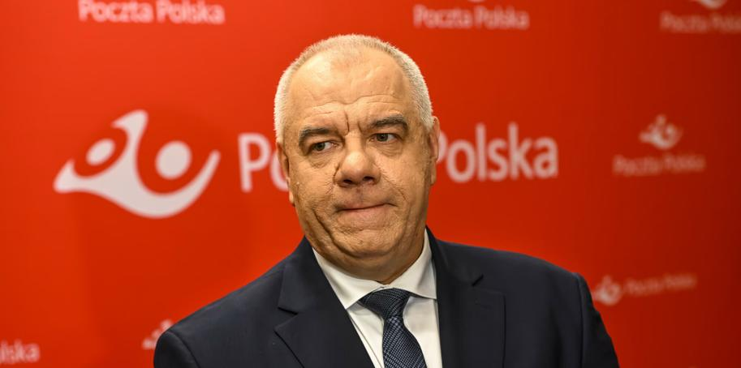
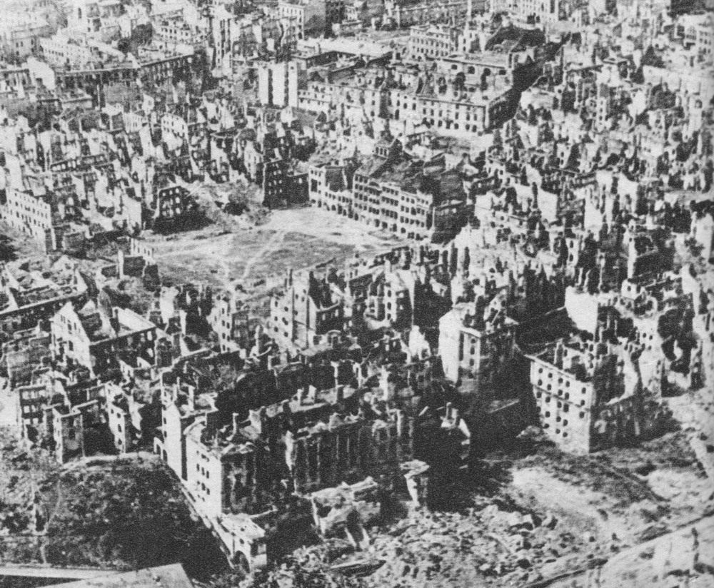
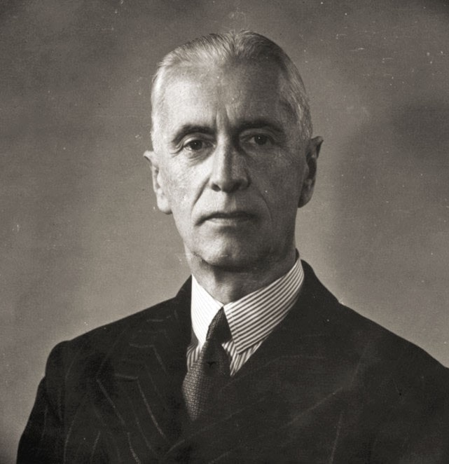

### 2023

> People who destroy whole nations do not have the right to teach us democracy and the values of living freely. - President Putin

---

> Sasin planuje rozbiór Poczty Polskiej?

Pomysł wydzielenia z Poczty Polskiej usług paczkowych i połączenia tego biznesu z logistyką Orlenu jest opracowywany w rządzie — donosi "Rzeczpospolita", powołując się na nieoficjalne ustalenia.

  

---

Emocjonalna reakcja prezydenta Ugandy, Yoweri Museveniego, który oskarżył Bank Światowy o próbę „wywierania nacisku” na rząd w związku z przepisami dotyczącymi społeczności LGBT w tym kraju.

Bank ogłosił, że wstrzymuje wszelkie nowe pożyczki dla kraju, ponieważ ustawa zakazująca związków osób tej samej płci jest sprzeczna z jego wartościami. W oświadczeniu opublikowanym w mediach społecznościowych prezydent Museveni powiedział, że „Uganda🇺🇬 będzie się rozwijać z pożyczkami lub bez”. Napisał również, że to "niefortunne", aby pożyczkodawca próbował „zmusić nas do porzucenia naszej wiary, kultury, zasad i suwerenności za pomocą pieniędzy”.

---

> Vibes

  

---

### 2021

Globalny festiwal zadłużania

Tak wielkiego poziomu długu jak obecnie ludzkość nie osiągnęła nawet w czasach totalnej mobilizacji na potrzeby drugiej wojny światowej. Mało kto bije jednak na alarm, a wręcz przeciwnie, niektórzy ekonomiści wieszczą nawet nadejście „nowej ekonomii”.
Średni poziom długu w krajach rozwiniętych osiągnął w obecnym roku poziom ponad 124 proc. wartości PKB, co stanowi wynik wyższy niż w rekordowym do tej pory 1946 r. Wówczas najbogatsze kraje świata były tuż po wielkiej wojnie, która uzasadniała wszelkie wydatki. Współcześnie twierdzi się, że również trwa wielka wojna,tym razem z koronawirusem, ale bezprecedensowe w swojej skali wydatki budżetowe nie do końca ten fakt oddają. Za skokowy przyrost długu odpowiadają bowiem przede wszystkim wydatki związane z wcielaniem w życie agendy zrównoważonego rozwoju.

---

Coraz bardziej uzasadnione wydaje się wrażenie, że rządzące "elity" - zwłaszcza te działające w skali globalnej - konsekwentnie uruchamiają mechanizmy autodestrukcyjne w jak najliczniejszych obszarach znajdujących się w jakimś stopniu pod ich polityczną, gospodarczą bądź ideologiczną kontrolą.
W obszarze edukacyjno-kulturowym nachalnie promują one coraz bardziej groteskowe formy infantylnego buntu wobec elementarnych części składowych rzeczywistości, takich jak obiektywne kryteria logicznego wnioskowania czy obiektywna ludzka tożsamość płciowa.
W obszarze relacji międzygrupowych uporczywie forsują one neomarksistowską atmosferę permanentnego konfliktu, niezaspokajalnych roszczeń i wszechobecnego resentymentu, której doskonałym przykładem jest choćby to, co funkcjonuje w USA pod mianem "antyrasizmu" (w nawiązaniu do punktu poprzedniego, ostatnio coraz częściej "okazuje się", że rasistowska jest nawet nauczana w dotychczasowej formie matematyka).
W obszarze makroekonomicznym coraz chętniej deklarują one, że pojęcie długu publicznego traci swoje dotychczasowe znaczenie, bo zawsze można go "zadrukować" monetarną makulaturą, co równa się zupełnie otwartemu kierowaniu globalnej gospodarki ku scenariuszowi przewlekłej stagflacji bądź hiperinflacyjnej implozji.
Wreszcie w obszarze rozwoju gospodarczego coraz częściej perorują one o konieczności wejścia na ścieżkę "zerowego wzrostu", co w praktyce prowadzić musi do zapaści cywilizacji przemysłowej wraz z jej wszystkimi osiągnięciami (zgodnie z zasadą, że "aby utrzymać się w tym samym miejscu, trzeba biec ile sił", z czego wynika, iż stanięcie w miejscu równa się nie równowadze, ale konsekwentnej retrogresji).
Pytanie brzmi teraz: dlaczego globalne "elity" postanowiły podjąć tak uparcie zabójcze i samobójcze działania, które należałoby określić mianem nie tyle "wielkiego resetu", co "wielkiego delete'u" - i to takiego, który skasuje również kasujących? W końcu nie sposób sobie wyobrazić, aby były one w stanie zachowywać swoją "elitarną" pozycję nie zdając sobie sprawy z jednoznacznie niszczycielskich skutków wdrażania powyższych agend - zwłaszcza biorąc pod uwagę ich wzajemne napędzanie się i umacnianie.
Być może odpowiedź na niniejszą zagwozdkę kryje się w typologii zła zaproponowanej przez Rudolfa Steinera, wedle której wyróżnić można zło lucyferyczne, arymaniczne i soratyczne. Z typologii tej wynika, że nie każdy rodzaj złych działań musi się wiązać z konwencjonalnie rozumianymi korzyściami dla złoczyńcy, co pozwala na znaczne rozszerzenie gamy intencji możliwych do przypisania "elitom".
Zło lucyferyczne to autodestrukcyjny hedonizm zaciemniający rozum, deformujący sumienie i pozbawiający wolę wszelkiej dyscypliny - zachowania kojarzące się z "uciechami" markiza de Sade. Jest to zło impulsywne i krótkoterminowe, w którym gustują "elity" na dorobku, doskonalące dopiero metody pasożytowania na produktywnej części społeczeństwa i łatwo zachłystujące się uzyskanym w ten sposób bogactwem. Tym samym jest to ten rodzaj zła, który najszybciej uzależnia, ale jednocześnie najszybciej przestaje dawać satysfakcję.
Zło arymaniczne to narzucona kontrola o systemowym charakterze - polityczny i biurokratyczny totalitaryzm, socjoinżynieryjna manipulacja itp. Folgowanie temu gatunkowi zła wymaga sporej dyscypliny organizacyjnej i długoterminowego planowania, więc odnośna satysfakcja wyczerpuje się znacznie wolniej, niż ta związana z jego lucyferycznym odpowiednikiem. Wydaje się jednak, że i na tym polu dzisiejsze "elity" osiągnęły już tyle, ile mogły, zaś reżim sanitarystyczny ostatniego półtorarocza jest tutaj koronną zdobyczą, zadającą produktywnej części społeczeństwa cios na tyle dotkliwy, że musi się on odbyć rykoszetem na samej arymanicznej strukturze kontroli, prowadząc do jej stopniowego uwiądu.
Tutaj dochodzimy do ostatecznej formy zła - zła soratycznego - które polega na sianiu chaosu i zniszczenia rozumianego jako cel sam w sobie. Innymi słowy, w momencie gdy arymaniczne struktury kontroli i pasożytnictwa osiągają swoją maksymalną dopuszczalną masę i zaczynają się walić pod własnym ciężarem, jedynym pozostałym źródłem satysfakcji dla "elit" jest już wyłącznie uczynienie postępującej systemowej destrukcji zjawiskiem maksymalnie dotkliwym i upokarzającym dla swoich ofiar, zwłaszcza na poziomie mentalnym. Stąd zorganizowana wola maksymalnego pozbawienia ludzi - zwłaszcza tych młodszych - ich intelektualnej, moralnej i duchowej trzeźwości w zakresie postrzegania otaczającej rzeczywistości, w tym wmówienia im, że źródłem obserwowanej destrukcji jest w ostatecznym rachunku nie wichrzycielstwo "elit", tylko "opresyjny patriarchat", "systemowy rasizm", "nieskrępowany kapitalizm", "katastrofa klimatyczna" czy wszelkie inne ideologiczne straszaki spreparowane i nachalnie promowane przez owe "elity".
Jaki konstruktywny wniosek wyłania się z powyższej analizy? Przede wszystkim taki, że nie ma już sensu zabiegać o "wymianę elit" czy "systemową transformację" - zwłaszcza na poziomie globalnym - bo jest już na to o wiele za późno. Należy raczej przyjąć podejście "benedyktyńskie" i zabiegać o to, żeby uczynić swoją "małą ojczyznę" - swoją wyspę cywilizowanego życia - maksymalnie niezależną pod względem organizacyjnym i maksymalnie zdrową pod względem intelektualno-kulturowym. Jednocześnie warto zidentyfikować inne potencjalne tego rodzaju wyspy i nawiązać z nimi współpracę - w takim stopniu, w jakim umożliwiają to warunki "soratycznych" zaburzeń komunikacyjnych i blokad logistycznych. Liczenie bowiem na to, że odwróci się kumulację opisanych wyżej niszczycielskich procesów, zdaje się być podręcznikowym wręcz przykładem "kopania się z koniem" i marnotrawienia mentalnych zasobów, które można lepiej spożytkować zupełnie gdzie indziej.
Jeśli komuś narzuca się podobne skojarzenie, to można nazwać opisywane tu podejście odmianą strageii "prepperskiej", z tym, że jest to przede wszystkim "prepperyzm" intelektualny i kulturowy, nie fizyczny, medyczny czy inżynieryjny. Kiedy jednak ma się świadomość, że najpotężniejsze globalne ośrodki wpływu czerpią perwersyjną satysfakcję już wyłącznie z upartego rujnowania cywilizacji, to najroztropnijeszym, co można uczynić, jest zadbanie o to, żeby swój osobisty kawałek cywilizacji otoczyć jak najsolidniejszym murem obronnym. Jest to w gruncie rzeczy konstatacja optymistyczna, bo gdy już ostatecznie rozpadnie sie to, co się rozpaść musi, to może się okazać, że dzieła ewentualnej odbudowy będzie się dokonywać w świecie dużo bardziej zdecentralizowanym i wielobiegunowym - a więc dużo bardziej wolnym i samoświadomym. Ta perspektywa będzie jednak dostępna wyłącznie tym, którzy dokonają w międzyczasie benedyktyńskiej pracy ocalenia tego wszystkiego, co prawdziwe, dobre i piękne, a co soratyczne "elity" usilnie starają się wydać na zatracenie razem ze sobą.

---

### 2020

"Uważamy, że globalna akceptacja, rozpoznawalność marki, energiczność ekosystemu, dominacja, strukturalna odporność, użyteczność technologiczna i etos społeczności bitcoina są przekonującymi dowodami na to, że bitcoin jest najlepszym długoterminowym aktywem dla tych szukających tzw. "store of value". Bitcoin to cyfrowe złoto - to pieniądz twardszy, silniejszy, szybszy i sprytniejszy niż jakikolwiek inny pieniądz, który go poprzedzał. Spodziewamy się, że jego wartość będzie rosła wraz z postępami w warstwie technologicznej, rosnącą adopcją i coraz większym efektem sieci, który napędzał tak wiele tzw. "category killers" w erze nowożytnej."

Michael J. Saylor, CEO, MicroStrategy Incorporated

- Ostre objawy spekulacji

---

NAJGORSZE ZA NAMI?
Mamy za sobą porcję wstępnych danych dotyczących Produktu Krajowego Brutto w większości krajów na świecie w drugim kwartale 2020 roku. Oczywiście zaskoczenia nie ma. Świat się gospodarczo zapadł. Ale drugi kwartał jest już za nami. Czy teraz będzie już tylko lepiej?
W ostatnich dniach poznaliśmy porcję danych opisujących sytuację gospodarczą w drugim kwartale 2020 roku. Nie ma co ukrywać, było fatalnie. Nikogo to zresztą nie zdziwiło, wiedzieliśmy przecież co się stało. Odgórne decyzje dotyczące zamrażania gospodarki, strach przed wychodzeniem z domu lub zakaz takiego wychodzenia, pozrywane łańcuchy dostaw, które prowadziły do tego, że jeśli nawet jakiś kraj miał lepszą sytuację epidemiologiczna, to odczuwał gospodarczo problemy innych krajów, wszystko to musiało oczywiście doprowadzić do zapaści. W USA, największej gospodarce globu PKB spadło o 9,5% w ujęciu rocznym. Tak na marginesie medialnie eksploatowano głównie tzw dane zanualizowane, które pokazały spadek PKB aż o 32,9%. Amerykanie posługują się głównie tym pojęciem, oznacza ono hipotetyczną zmianę PKB w ciągu najbliższego roku przy założeniu, że to co się wydarzyło w ostatnim kwartale, z którego mamy dane, będzie miało miejsce do końca tego najbliższego roku. Wróćmy jednak do ujęcia pokazującego wartość z danego kwartału odniesioną do analogicznego kwartału rok temu. Czyli do tego, czym posługujemy się głównie w Europie. W takim ujęciu w Niemczech spadek PKB wyniósł 11,7%, we Włoszech 17,3%, we Francji 19%, a w Hiszpanii nawet 22,1%. Widać wyraźnie, o tym pisałem wielokrotnie, że tam gdzie udział turystyki w tworzeniu PKB jest większy dane muszą być gorsze z uwagi na obszary zamrażania gospodarek. I to, które branże odbudowują się najtrudniej. 
To już jednak historia. Teraz koncentrujemy się na tym co będzie. A będzie lepiej. Wpompowanie bilionów dolarów i euro ograniczyło skutki zapaści gospodarczej. Uratowało firmy i pracowników, pomogło pośrednio lub bezpośrednio gospodarstwom domowym. Teraz gospodarki ruszają i z pewnością zobaczymy wyraźną poprawę wszystkich wskaźników. Potwierdzeniem tego, że odbudowa pokoronawirusowa będzie szybka są wstępne dane z Chin. Tam apogeum dramatu wydarzyło się w pierwszym kwartale. Drugi kwartał był już na mocnym plusie, PKB wzrosło bowiem o 3,2% w ujęciu rocznym. Oczywiście to wciąż wyraźnie mniej niż przed koronawirusem, kiedy Chiny rozwijały się w tempie 6%, ale jednak widać mocne odbicie. I tak będzie także w innych krajach świata. 
Polskich danych jeszcze nie mamy. Ale cudu oczywiście nie będzie. Drugi kwartał także pokaże mocne tąpniecie. Z drugiej strony już dzisiaj możemy potwierdzić w polskiej gospodarce to, o czym pisałem przed chwilą. Właśnie pokazał się lipcowy PMI, wskaźnik optymizmu menadżerów, z sektora przemysłowego. Osiągnął on poziom 52,8 pkt, wyraźnie zatem lepiej, niż w czerwcu, kiedy mieliśmy 47,2 pkt. Przypomnę, że najniższą wartość, absolutnie katastrofalną, czyli 31,9 pkt, mieliśmy w kwietniu. Był to zresztą najgorszy wynik od rozpoczęcia liczenia PMI w Polsce, czyli od roku 1998. Istotne jest jednak nie tylko to, że PMI rośnie, ale że przekroczył w końcu poziom 50 pkt. Ostatni raz taką sytuację mieliśmy w naszym kraju pod koniec 2018 roku. A przekroczenie 50 pkt oznacza przejście na „dobrą stronę mocy”. Gospodarka powinna się rozwijać. Oczywiście biorąc pod uwagę charakter liczenia PMI nie musi to oznaczać, że PKB będzie na plusie. Może być też tak, że minus będzie zdecydowanie mniejszy. No i to jest realna prognoza, jeśli chodzi o trzeci kwartał. 
Pamiętajmy jednak o jednym. Wskaźniki będą się poprawiać. I to wyraźnie. Ale nie oznacza to absolutnie, że kryzys koronawirusowy się skończył. Programy wsparcia albo się wyczerpały albo wyczerpują. Nowe będą znacznie uboższe, także w Polsce. Firmy zderzają się z nową rzeczywistością, pracownicy z realiami nowego rynku pracy. Owszem, jeśli nawet np. w Niemczech w trzecim kwartale spadek PKB wyniesie 3%, a nie prawie 12% będzie to skokowa wręcz poprawa. Ale to dalej spadek o 3%. W normalnej sytuacji, bez koronawirusa, mówilibyśmy o głębokiej recesji. Takiej, która powoduje gwałtowny wzrost ilości upadłych firm i zwiększenie bezrobocia. I to jest scenariusz na najbliższe miesiące. Biliony dolarów czy euro zasypały w znaczący sposób dziurę wygenerowaną zatrzymaniem gospodarek w drugim kwartale. Ale teraz zderzymy się już z realiami działającej gospodarki. Działającej znacznie słabiej, niż pod koniec 2019 roku. A zatem nie możemy niestety ogłosić końca kryzysu. Dla wielu z nas, także w Polsce, bez postojowego, bez tarczy finansowej, ten kryzys dopiero się zaczyna. A zatem poprawę wskaźników opisujących gospodarkę trzeba dobrze rozumieć. I oczywiście zakładam tu, że ewentualne drugie uderzenie koronawirusa nie będzie miało takich skutków gospodarczych. Bo jeśli będzie miało, jeśli znowu dojdzie na przykład do zamrażania całych branż, to skutki gospodarcze będą dramatyczne. Drugi raz nie będzie się dało pożyczyć czy wydrukować ponad 18 bilionów dolarów w skali świata. A jeśli nawet to konsekwencje tego będa katastrofalne.

---

### 1976

Rząd Piotra Jaroszewicza wprowadził reglamentowaną sprzedaż cukru. Decyzja ta miała być reakcją na tak zwane "ostre objawy spekulacji". Tego samego dnia opublikowano komunikat następującej treści:
"W ostatnich dwóch miesiącach, mimo kierowania na zaopatrzenie rynku wystarczających dla tego okresu ilości cukru, zaistniał nadmierny wykup tego artykułu, brak ciągłości sprzedaży i wystąpiły ostre objawy spekulacji.
Po rozpatrzeniu całokształtu tego problemu, w trosce o zapewnienie normalnego i sprawiedliwego zaopatrzenia w cukier wszystkich ludzi pracy i ich rodzin, [Rada Ministrów] postanowiła wprowadzić na okres przejściowy sprzedaż cukru, na podstawie biletów towarowych w ilości dwa kilogramy cukru miesięcznie na każdego"

### 1949

Zamordowany <https://pl.wikipedia.org/wiki/J%C3%B3zef_Koz%C5%82owski_(1910%E2%80%931949)>

### 1944

Powstanie warszawskie: Winston Churchill po raz kolejny depeszował do Józefa Stalina, pytając o pomoc dla powstańców.
"Zastanawiamy się nad reakcją światowej opinii publicznej, gdy walczący z nazistami powstańcy zostaną pozostawieni sami sobie. Uważamy, że wszyscy trzej powinniśmy uczynić wszystko, co w naszej mocy, by uratować tylu polskich patriotów, ile się tylko da. Liczymy, że wesprzecie polskich patriotów z Warszawy natychmiastowymi zrzutami zaopatrzenia i amunicji - chyba że zgodzi się Pan niezwłocznie wesprzeć w tym zadaniu nasze samoloty? Wyrażamy nadzieję, że się Pan na to zgodzi. Pośpiech jest tu wyjątkowo ważny". Stalin nie miał zamiaru się uginać pod presją sojuszników.
Sprzymierzeńcy nie chcieli na niego zanadto naciskać. Stalin odbił piłeczkę w stronę aliantów depeszą:
"Władze radzieckie oczywiście nie mogą sprzeciwiać się zrzutom broni dokonywanym przez brytyjskie i amerykańskie samoloty w rejonie Warszawy, gdyż jest to sprawa samych Brytyjczyków i Amerykanów. Jednak zdecydowanie sprzeciwiają się temu, by amerykańskie i brytyjskie samoloty, po dokonaniu zrzutów broni w rejonie Warszawy, lądowały na terytorium ZSRR, gdyż rząd radziecki nie życzy sobie jakichkolwiek związków - czy to pośrednich, czy bezpośrednich - z awanturą w Warszawie".

  

---

Prezydent Władysław Raczkiewicz (zdjęcie) zwrócił się do papieża Piusa XII za apelem o ujęcie się i modlitwę w intencji mordowanej przez Niemców ludności cywilnej Warszawy. Tego samego dnia wystosował również telegram do Roosvelta i Churchilla z prośbą o natychmiastową pomoc dla stolicy Polski.

  

### 1935

Mandżukuo, w niejasnych okolicznościach, został tam uprowadzony przez bandytów (NKWD?) i zamordowany Gareth Richard Vaughan Jones. Walijczyk. Dziennikarz. Człowiek, który jako pierwszy informował świat o wielkim głodzie na Ukrainie.

  

---

<a href="https://github.com/TomaszWaszczyk/historia.waszczyk.com/edit/master/src/content/august-12.md" target="_blank">Edytuj tę stronę dzieląc się własnymi notatkami!</a>
