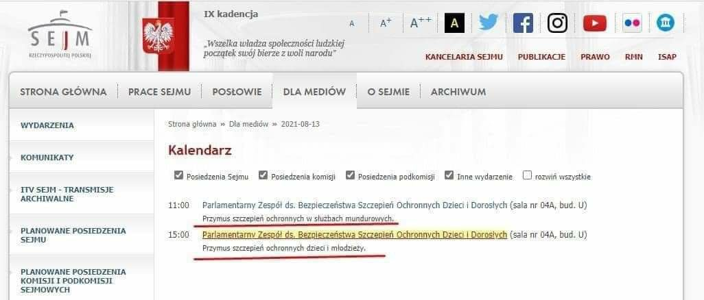
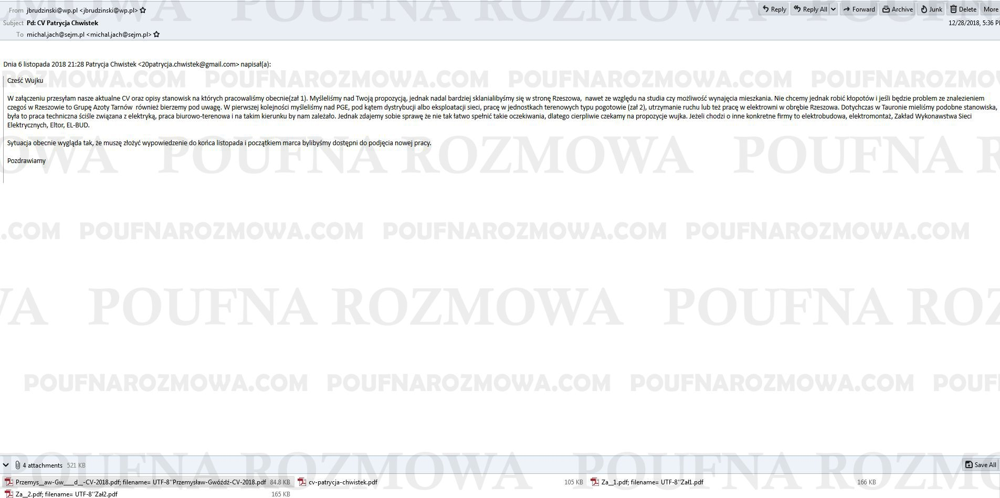
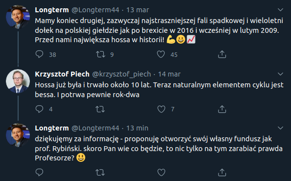
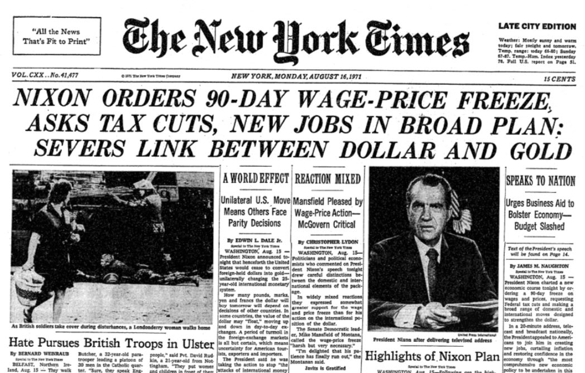
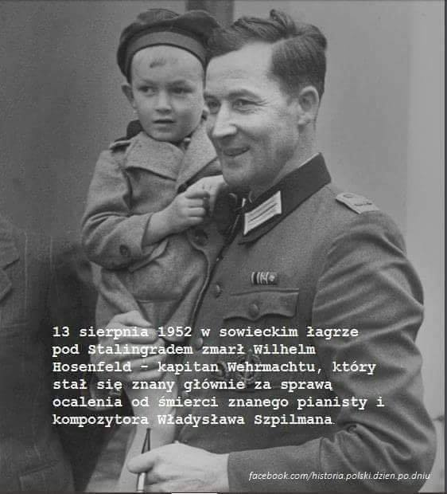
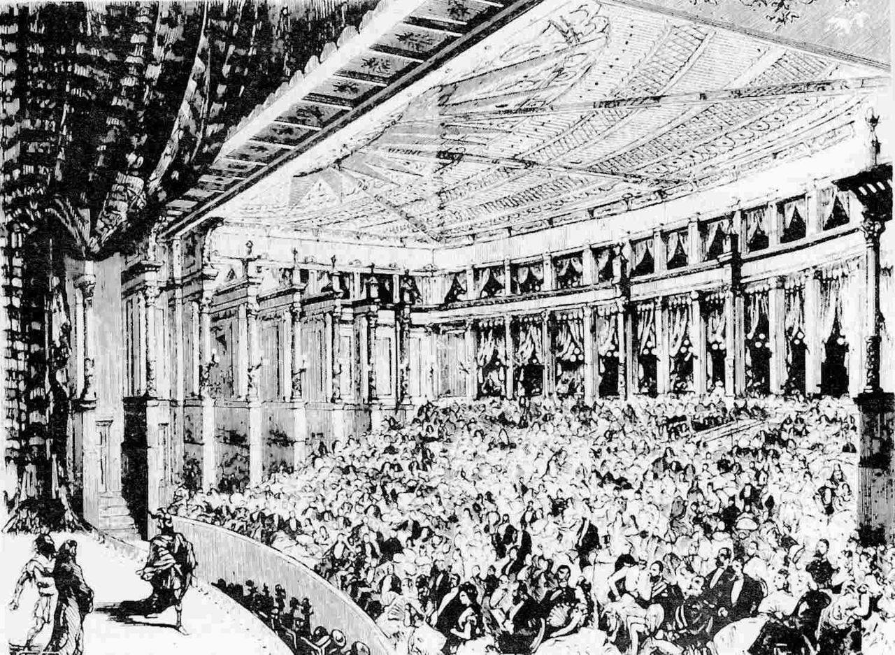

### 2021

NIK skontroluje NBP. Problemem dodruk banknotów

Jak podaje nieoficjalnie RMF FM, Najwyższa Izba Kontroli wejdzie no Narodowego Banku Polskiego. Ma zbadać, czy dochowano rzetelności w trakcie dodruku pieniędzy.

----

  

  

### 2020

  

---

  

<!-- my therapist just told me that i am such a product of capitalism that ive replaced any real joy with accomplishments 

and ive never been so accurately dragged in my life -->

---

### 1971

https://en.wikipedia.org/wiki/Nixon_shock

  

### 1952

W sowieckim łagrze pod Stalingradem zmarł Wilhelm Hosenfeld - kapitan Wehrmachtu, który stał się znany głównie za sprawą ocalenia od śmierci znanego pianisty i kompozytora Władysława Szpilmana.
W 1939 r. jako żołnierz rezerwy został skierowany do Polski. Będąc oficerem wojsk okupacyjnych niósł pomoc polskim obywatelom, w tym Żydom, a także zbiegłym z obozów jeńcom wojennym.
W czerwcu 1940 został przeniesiony do warszawskiej komendy Wehrmachtu, gdzie zarządzał obiektami sportowymi, organizował zawody i ćwiczenia dla Niemców. W czasie Powstania warszawskiego pracował w kontrwywiadzie niemieckim, gdzie zajmował się przesłuchiwaniem cywilów i powstańców. Z tamtego okresu zachowały się jego listy pisane do rodziny. W jednym z nich, datowanym na 23 sierpnia 1944 roku, kapitan Hosenfeld pisze: „Każdego dnia muszę prowadzić przesłuchania. Dziś znów miałem powstańca i 16-letnią dziewczynkę. Z żadnego z nich nie udało się nic wydobyć. Być może uda mi się wyratować dziewczynę. [...] Ci ludzie kierują się patriotyzmem w najczystszej postaci, ale my nie możemy ich oszczędzać. Staram się ratować każdego, kto jest do uratowania. [...] Nie jestem właściwym człowiekiem do prowadzenia takich przesłuchań, a przynajmniej do prowadzenia ich w tak bezwzględny sposób, jaki byłby tu na miejscu i jaki się najczęściej stosuje. A jednak wdzięczny jestem, że muszę to robić, bo przecież mogę niejedno naprawić”. Po upadku Powstania Warszawskiego, w końcowych miesiącach 1944 r., Hosenfeld spotkał błąkającego się po ruinach Warszawy Władysława Szpilmana. Przez kilka tygodni ukrywał go i utrzymywał przy życiu dostarczając mu żywność. Historię tego ocalenia opisał w swoich wspomnieniach sam Szpilman, a Roman Polański pokazał ją w nagrodzonym Oscarami filmie „Pianista”. W ostatnim wywiadzie udzielonym na krótko przed śmiercią Władysław Szpilman powiedział o nim: ,,Byl to nadzwyczajny czlowiek, wielkiej klasy. Nie powtorze panu przebiegu calej rozmowy, jaka z nim odbylem, bo nie moge tego zrobic. I nie mowie o tym rowniez w ksiazce. Ale opowiadal on o strasznych rzeczach. Hosenfeld mogl mnie zastrzelic. Mogl wyjac rewolwer i wystrzelic jedna jedyna kule. Ale jednak tego nie zrobil. Malo tego, on mi bardzo pomogl. Nadzwyczajny czlowiek. Utrzymuje kontakt z jego rodzina. Ratowal tez polskiego ksiedza, stryja obecnego konsula w Hamburgu - Cieciory. Ten oficer Wehrmachtu, ktory w okupowanej Warszawie byl kierownikiem stadionu przy ulicy Mysliwieckiej, uratowal ze dwadziescia osob. (...)Po wojnie trafil on do obozu w Brzesciu nad Bugiem, pozniej do innego z sowieckich obozow. Usilowalem go ratowac. Gdyby trafil do jednego z europejskich obozow, to mozna by sie starac o jego uwolnienie. Ale wydobyc kogos z obozu rosyjskiego nie bylo rzecza mozliwa. Umarl, wedlug oficjalnych danych, na udar mozgu. Pytalem pozniej jego zone, czy to mozliwe. Odpowiedziala, ze chorowal na nadcisnienie, wiec nie mozna tego wykluczyc.''
Dzięki staraniom Władysława Szpilmana Wilm Hosenfeld został w 2009 roku pośmiertnie odznaczony medalem Sprawiedliwy wśród Narodów Świata, a dwa lata wcześniej prezydent RP Lech Kaczyński odznaczył pośmiertnie Wilhelma Hosenfelda Krzyżem Komandorskim Orderu Odrodzenia Polski. Decyzja Prezydenta o nadaniu tak prestiżowego odznaczenia państwowego kapitanowi Wehrmachtu i członkowi NSDAP spotkała się z krytyką m.in. ze strony Ireny Sendlerowej oraz innych przedstawicieli środowisk kombatanckich.

  

### 1899

https://en.wikipedia.org/wiki/Alfred_Hitchcock

### 1876

Na Bayreuther Festspiele odbyła się premiera opery Pierścień Nibelunga Richarda Wagnera.
Utwór zainspirowany został przez średniowieczny epos niemiecki Pieśń o Nibelungach. Składają się nań następujące utwory: Złoto Renu (niem. Das Rheingold), Walkiria (niem. Die Walküre), Zygfryd (niem. Siegfried) i Zmierzch bogów (niem. Götterdäm-merung). Dramat ten, monumentalne dzieło trwające około 14 godzin, jest przeznaczony do wystawiania przez trzy dni.

  

## 1873

Urodził się gen. Józef Haller - legionista, współtwórca Armii Polskiej we Francji, oficer Wojska Polskiego. Był synem uczestnika Powstania Styczniowego. Działał w ruchu skautowym i Towarzystwie Gimnastycznym "Sokół". Współtworzył tajne kursy żołnierskie, podoficerskie i oficerskie, a także był współautorem większości obowiązujących do dzisiaj odznak harcerskich, jak np. Krzyż Harcerski. W czasie I wojny światowej w Legionach. W lutym 1918 r. z II Brygadą Legionów przedostał się przez front austriacko-rosyjski i dołączył do polskich jednostek formowanych w Rosji. Tam objął dowództwo 5 Dywizji Strzelców Polskich, a od marca 1918 r. był dowódcą II Korpusu Polskiego. W maju bił się z Niemcami pod Kaniowem, a następnie przedostał się do Moskwy, zostając dowódcą Polskiej Komisji Wojskowej. W lipcu udał się do Francji, a w październiku 1918 r. został dowódcą Armii Polskiej we Francji. Po powrocie do Polski w kwietniu 1919 r. został m.in. dowódcą Frontu Pomorskiego, który miał przejąć ziemie nad Bałtykiem przyznane Traktatem Wersalskim, on też dokonał symbolicznego aktu zaślubin Polski z morzem w Pucku w lutym 1920 r. Podczas Bitwy Warszawskiej dowodził obroną przedpola. Po wojnie pełnił różne funkcje wojskowe, był też posłem na Sejm z ramienia Chrześcijańskiego Związku Jedności Narodowej. Po krytyce zamachu majowego w 1926 r. został przeniesiony w stan spoczynku. W latach 1936-1939 był aktywnym członkiem antysanacyjnego ugrupowania "Front Morges". Po wybuchu II wojny światowej przedostał się do Francji, a następnie do Wielkiej Brytanii, gdzie został ministrem oświaty w rządzie polskim. Po wojnie pozostał w Anglii i zmarł w Londynie. Jego prochy w 1993 r. powróciły do Polski i spoczęły w krypcie kościoła św. Agnieszki w Krakowie.

---

<a href="https://github.com/TomaszWaszczyk/historia.waszczyk.com/edit/master/src/content/august-13.md" target="_blank">Edytuj tę stronę dzieląc się własnymi notatkami!</a>
