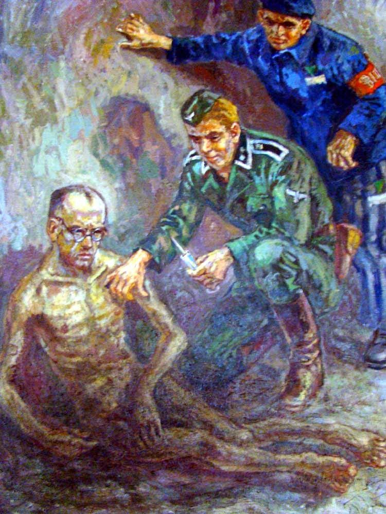

### 2020

<video width="640" height="480" controls>
  <source src="./movies/august/covid.mp4" type="video/mp4">
Your browser does not support the video tag.
</video>

### 1980

https://pl.wikipedia.org/wiki/Sierpie%C5%84_1980

## 1936

<a href="https://en.wikipedia.org/wiki/ORP_Orze%C5%82_(1938)" target="_blank">ORP Orzeł</a>

### 1385

Unia w Krewie lub układ w Krewie, rzadziej umowa krewsko-wołkowyska[1] – akt wydany 14 sierpnia 1385 roku przez wielkiego księcia litewskiego Władysława Jagiełłę w Krewie, stanowiący jego zobowiązania przedślubne wobec Królestwa Polskiego. Wydanie aktu stanowiło wynik rozmów prowadzonych między księciem a panami małopolskimi na zamku w Krewie dotyczących małżeństwa królowej Jadwigi z Jagiełłą. Poprzedziły je jednak długoletnie, prawdopodobnie co najmniej od koronacji Jadwigi, negocjacje między stroną litewską a polską, a także z królową Elżbietą Bośniaczką, matką wciąż nieletniej Jadwigi.

Jagiełło zobowiązywał się przyjąć chrześcijaństwo w obrządku katolickim wraz z rodziną, dworem i możnymi oraz dać wolność Polakom wziętym w niewolę i przebywającym na Litwie. Obiecywał podjąć starania w celu odzyskania ziem utraconych przez Polskę i Litwę, a także zapłacić Wilhelmowi Habsburgowi 200 tysięcy florenów jako odszkodowanie, za zerwane zaręczyny z Jadwigą. Ponadto Jagiełło przyrzekł przyłączyć do Królestwa Polskiego swoje ziemie litewskie i ruskie.

---

1862 roku władze carskie aresztowały Jarosława Dąbrowskiego.
Dąbrowski był jednym z inicjatorów antyrosyjskiego powstania, stał na czele organizacji "Stronnictwo Czerwonych". Aresztowany został na skutek donosu innego Polaka -Alfa Wrześniowskiego, który był członkiem świty wielkiego księcia Konstantego Mikołajewicza.
Dąbrowski spędził 2 lata w pawilonie X Cytadeli Warszawskiej, a w listopadzie 1864 roku został skazany na 15 lat katorgi w obozie na Syberii,do którego na skutek ucieczki z więzienia przejściowego pod Moskwą nie dotarł.

---

W 1980 roku rozpoczął się strajk robotników w Stoczni Gdańsk. Jego bezpośrednią przyczyną było zwolnienie z pracy działaczki Wolnych Związków Zawodowych Anny Walentynowicz. Przywództwo nad strajkiem objął Lech Wałęsa. Postulatami strajkujących było przywrócenie do pracy Anny Walentynowicz oraz właśnie Lecha Wałęsy zwolnionego ze Stoczni w 1976 roku, wzniesienie Pomnika Ofiar Grudnia 1970, zagwarantowanie bezpieczeństwa strajkującym, podwyżka płac o 2000 złotych i przyznanie zasiłków rodzinnych w wysokości wypłacanej milicjantom i funkcjonariuszom Służby Bezpieczeństwa.

---

,,Kości ludzkie są najważniejszym fundamentem pod dzieła Boże'' - powiedział bratu Arnoldowi w styczniu 1941 roku, przed swoim aresztowaniem, jakby widząc przyszłość, w której koło krematorium oświęcimskim można jeszcze znaleźć niedopalone kości ludzkie. Stały się relikwią przez obecność w nim kości świętego. --- Krzysztof Kąkolewski ,,Węzły Wojny''.

14 sierpnia, w wigilię Wniebowzięcia Najświętszej Maryi Panny, 1941 roku blokowy szpitala obozowego Hans Bock (numer obozowy więźnia 5) uśmiercił zastrzykiem z fenolu głodującego od ponad dwóch tygodni ojca Maksymiliana Kolbe. Ojciec Maksymilian dobrowolnie zgłosił się na śmierć w miejsce Franciszka Gajowniczka. 17 października 1971 roku, papież Paweł VI dokonał beatyfikacji ojca Maksymiliana. 10 października 1982 roku, papież Jan Paweł II dokonał jego kanonizacji. W celi głodowej w podziemiach bloku nr 11, gdzie skonał ojciec Maksymilian, znajduje się tablica upamiętniająca jego męczeńską śmierć oraz świeca ofiarowana przez papieża Jana Pawła II. Franciszek Gajowniczek przeżył apokalipsę wojny dożywając sędziwego wieku (95 lat). Zmarł w roku 1995 roku.

Obraz: autorem obrazu był Mieczysław Kościelniak, uczestnik polskiej wojny obronnej 1939, działacz ZWZ, więzień niemieckich obozów koncentracyjnych: Auschwitz, Mauthausen-Gusen, Melk, Ebensee, żołnierz III Armii USA gen. Pattona, a także świadek w procesie beatyfikacyjnym o. Maksymiliana Kolbe.
Pan Mieczysław zaprzyjaźnił się z ojcem Maksymilianem w trakcie pobytu w Auschwitz. Ojciec Maksymilian wyznał mu w tajemnicy: „Ja nie przeżyję obozu, ty go przeżyjesz, ale pamiętaj, że będziesz miał obowiązek jako artysta przekazać to całe piekło obozowe światu”. „Widząc to piekło, postanowiłem malować wszystko, co przeżywałem, ale to było szaleństwo! Skąd wziąć papier, ołówek? Kieszeni nie było w ubraniach, karano za to. Czasem, gdy przyniesiono na apel chorych i umierających, esesman Fitze chwytał leżący pod ścianą kilof i dziurawił nim konających. Tych scen i ich grozy nigdy nie zapomnę! (...) Do olbrzymiego żelaznego walca wypełnionego betonem zaprzęgano ośmiu więźniów, głównie Żydów i księży. Bywało, iż słaby więzień pod wpływem ustawicznego bicia padał, walec miażdżył go. Trudno mi to wspominać, to było straszne - ten «plaster» krwawy oblepiony na walcu, czerwony od krwi. (...) Pracowałem potem w żwirowni i tam zabijano słabych ciężkim stołkiem lub zadeptywano butami. Udało mi się narysować tę scenę i przemycić do rodziny. Miałem już kilka rysunków. Ołówek i papier dostarczył mi kolega pracujący w obozowej kancelarii”. - wspominał niegdyś Mieczysław Kościelniak. Artysta stworzył blisko 300 rysunków ukazujących ogrom bestialstwa w KL Auschwitz. Obecnie prace artysty znajdują się w Państwowym Muzeum Auschwitz-Birkenau. Mieczysław Kościelniak zmarł w 1993 roku.

