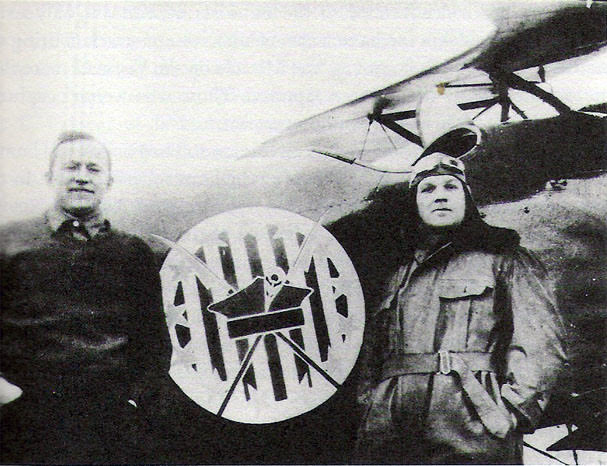
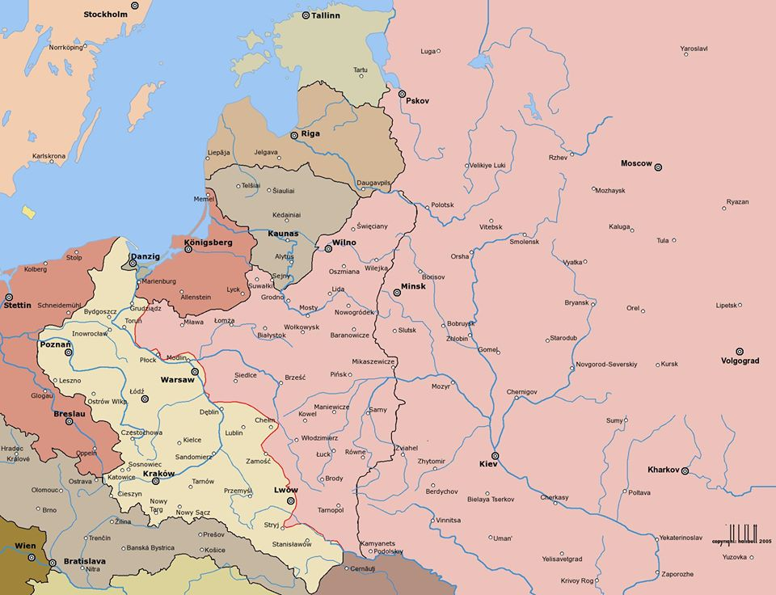
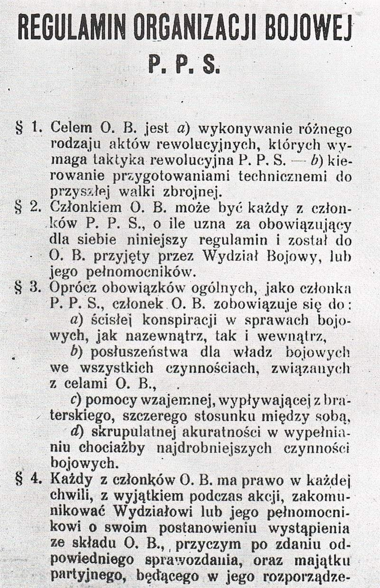

### 2020

One hundred years ago, a fierce battle was fought near Warsaw, which the then British diplomat, Lord d'Abernon, named as the eighteenth most decisive battle in world history. Not only was the war between Poland and Soviet Russia decided there, but also the fate of many European nations, whose existence could have certainly been menaced, had Poland not emerged victorious in 1920. The significance of the Battle of Warsaw, the defeat of the Red Army was reflected in the slogans, under which the Soviets sent its army on a mission to take over Poland:
"To the West! Over the dead body of White Poland shines the road to world-wide conflagration. On our bayonets we shall bring happiness and peace to toiling humanity!" These were the words in the order that, in July 1920, launched the Red Army’s great offensive to the West.

But then it did not succeed. The army of Soviet Russia, sent to conquer Europe for the Communist cause, was arrested by the Polish Army. This took place in August 1920, in the great battle known as the Battle of Warsaw, or „the Miracle on the Vistula River”. None other than Lenin emphasized the power of this battle to change history. He clearly stated the goal set for the Red Army: “Poland as a buffer between Russia and Germany is the mainstay of the entire Treaty of Versailles. By tearing out this element, we would destroy this whole system. We set ourselves the task of capturing Warsaw. [...] However, we failed miserably."

The march on Europe stemmed from the very principle of the ideology which Marx and Engels had already laid down in 1848: since the Communist Manifesto stated that the proletariat would conquer the whole world, then it can only be done with a bayonet, by violence. Lenin took this duty seriously. Contrary to Marx's predictions, it was in Russia where Communist ideology gained its first foothold in the struggle for world domination. Thus, the "red intervention" had to derive from Russia. In the Autumn of 1918, when Germany lost the war on the Western Front, Lenin was already prepared to march on Europe. The Bolshevik’s most important goal was to reach Germany. Getting there would guarantee the revolution’s advantage on the continent, the triumph of Communism and the joint domination of Moscow and Berlin over all of Europe. At the beginning of 1919, the Red Army occupied most of Ukraine and Belarus and attempted to capture the Baltic countries. However, it also had to fight a civil war in Russia itself. After this was settled in its favor, in the spring of 1920, it returned to its external expansion. The Red Army conquered Azerbaijan and continued its offensive against Armenia and Georgia. From January 1920, preparations for an armed attack through Belarus towards Warsaw were being made. It was to be carried out by the Western Front with a new Commander, Mikhail Tukhachevsky, with support from the South-Western Front, in the Ukrainian section, to which Stalin had been nominated as political commissar.

Although Poland was hardly reeling from 123 years of ruinous partitions, the re-emerging state already managed to implement generous social legislation and award women’s suffrage, thus preceding similar effort on the part of the United Kingdom and France by 10 and 26 years respectively. Under the leadership of Józef Piłsudski, a renowned statesman hailing from socialist party, a newly reborn Poland was also building its military and drawing up a new foreign policy. Its essence was to support the independence of Ukraine, with which an alliance would block the possibility of Russia’s imperial expansion towards the West, either under the old Tsarist banner, or the new, red one.

  

Merian C. Cooper and Cedric Fauntleroy fought in the Kosciuszko Squadron of the Polish Air Force during the Polish-Soviet war. Kosciuszko Squadron fought also during the Battle of Britain.

After sealing such an alliance with the leader of the Ukrainian People's Republic, Symon Petliura, Piłsudski sought to preempt the Red Army's offensive by liberating Kiev. However, without the support of the Western powers, Polish forces were not strong enough to accomplish this strategic goal. Tukhachevsky's great attack pushed westward, heading through Warsaw to Berlin. At the end of July, a new task was given by Lenin to Stalin, who was moving with his front in the south. He was ordered to sovietize Czechoslovakia, Hungary, Austria, Romania and "trigger a revolution" in Italy. The Western powers had no idea of these plans. At the time, the British Prime Minister Lloyd George was holding talks in London with Lenin's deputy, Lev Kamenev. For a large part of the Western political elite "the real" Europe began only with Germany. What lay farther east was regarded as the "barbaric periphery" that would best be left under the control of either Russia or Germany. In Munich, 18 years later, another British Prime Minister, Neville Chamberlain was to put it in these blunt words: for these “faraway countries” (depending on the situation: such as Czechoslovakia, Poland, Ukraine or Estonia) it is not worth risking the peace of the citizens of Western Europe. So in 1920, Lloyd George agreed, for the sake of such thinking, to the Sovietization of Poland.

However, the Poles themselves did not accept this verdict. The Red Army’s offensive was stopped by over 900,000 soldiers of the Polish Army, volunteers, often intellectuals and conscripts, mainly peasants and workers, who did not follow the slogan of "class revenge". Piłsudski’s well-planned and perfectly executed counteroffensive maneuver completely broke up the Soviet Western Front. Lenin did not manage to "liberate" Poland and much of Europe. What such "liberation" might have looked like is proved by explicit orders issued at the beginning of August, in the areas occupied by the Red Army: immediately create a system of concentration camps for all potential "enemies of the Soviet rule".

At that point, the Versailles system was saved by Poland for 18 years. For that long, the countries of Central and Eastern Europe, from Estonia and Latvia to Romania and Czechoslovakia, were free to cherish their independence, which they did until Stalin and Hitler consigned this area and its inhabitants into oblivion. Ukraine, which had failed to defend its independence in 1920, under Soviet rule was subjected to the extermination of its population earlier, during the Great Famine. These countries were to fight for their independence for the next half century. In 1980, Poland’s 10-million-strong "Solidarity" movement, also in the month of August, dealt another great blow to the Soviet rule over this area.

Communist totalitarian rule collapsed. However, thinking in imperialist categories when it comes to spheres of influence that allegedly are owed to "traditional" empires continues and, unfortunately, is being revived by some parts of Western political opinion. That is why the year 1920 has to be remembered: Central and Eastern Europe, which today also includes Ukraine, does not wish to belong in anyone's sphere of influence. These countries own the right to independence. A hundred years on, they remember those who defended their existence as well as the price that has to be paid once independence is lost.

Andrzej Nowak, historian, Jagiellonian University/Polish Academy of Sciences

### 1971

https://en.wikipedia.org/wiki/Nixon_shock

### 1920

Linia frontu 15. sierpnia 1920 roku.

Ta mapa pokazuje, w jak złym położeniu byliśmy w tym czasie.

Zwycięstwo w Bitwie Warszawskiej, którą świętujemy właśnie dziś, rozgrywała się 13-25 sierpnia. Jeszcze większy cios zadaliśmy ruskim w wielkiej bitwie nad Niemnem, gdzie odnieśli znacznie większe straty. Cały ruski front poszedł się je**ć. Następnie pasywny Traktat ryski i oddanie Mińska, który zdobyliśmy. Można traktować to jako zmarnowaną szansę.

2. ZDJĘCIE: 15. sierpnia 1939 roku

Ulicami Warszawy uroczyście przemaszerowały nasze wojska, też z okazji rocznicy pobicia bolszewików. Były 2 tygodnie przed wybuchem II Wojny Światowej.

Tego samego dnia niemieckie MSZ wysłało notę ZSRS, w której stwierdzono brak sprzeczności w interesach Berlina i Moskwy.

Tydzień później III Rzesza i ZSRS zawarły tzw. pakt Ribbentrop-Mołotow dzielący Europę środkowo-wschodnią na strefy wpływów dwóch sojuszników. Nasz los został już przesądzony.

Zdjęcie przedstawia Rydza Śmigłego oraz Stefana Starzyńskiego, ówczesnego prezydenta Warszawy, który podczas kampanii wrześniowej zostaje z mieszkańcami stolicy do końca.

Ledwie 4 miesiące od zrobienia tego zdjęcia, tuż przed Bożym Narodzeniem, zostaje rozstrzelany przez Gestapo.

  

### 1906

Miała miejsce tzw "krwawa środa".
Tego dnia Organizacja Bojowa Polskiej Partii Socjalistycznej przeprowadziła w Królestwie Polskim skoordynowaną akcję wymierzoną w władze rosyjskie. W jej efekcie zabitych zostało 80 rosyjskich policjantów, żandarmów i agentów carskiej Ochrany.
Akcja ta miała na celu powstrzymanie represji carskich służących stłumieniu trwającej wówczas rewolucji 1905 roku. Efekt psychologiczny był porażający. W warszawskich koszarach wojsk carskich doszło do paniki, co spowodowało wycofanie się Rosjan na kilka dni z miasta.

  

---

<a href="https://github.com/TomaszWaszczyk/historia.waszczyk.com/edit/master/src/content/august-15.md" target="_blank">Edytuj tę stronę dzieląc się własnymi notatkami!</a>
