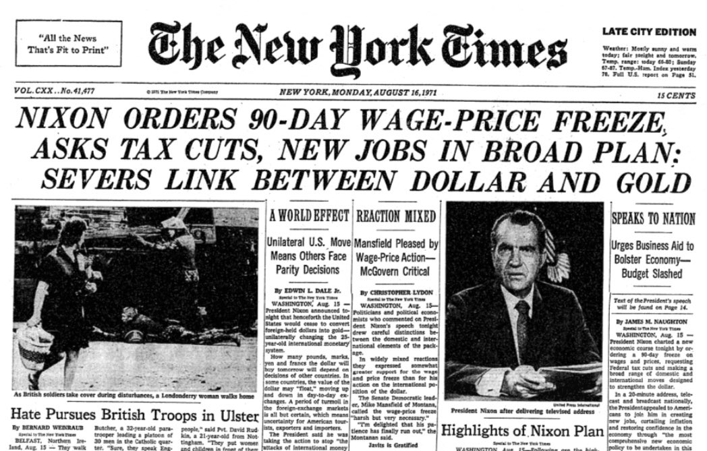
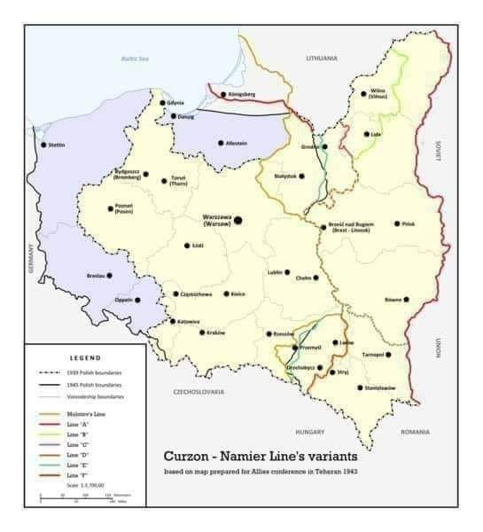
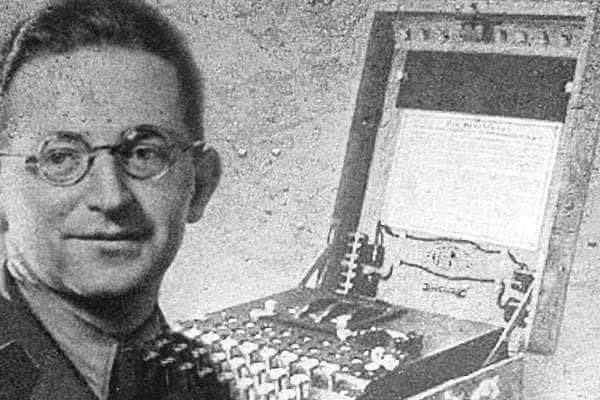

### 2022

  

---

Inflation Reduction Act

---

### 2021

Amerykanie opuszczają Afganistan a to jest efekt:

  

### 2020

Białoruś

  

---

> We must pass The Great Filter - Elon Musk

---

### 2013

Wszelkie aktualizacje samego Core (nie będące aktualizacją protokołu) za-
wsze stawiają na wsteczną kompatybilność. Gdy okazuje się, że nowsza wersja
pracuje inaczej niż wersja starsza - uznaje się wyższość wersji starej. Ideal-
nym przykładem stosowania tej filozofii jest jedyne 8h w historii Bitcoina, gdzie
wprowadzenie nowej wersji Core spowodowało powstanie forka w sieci.
Jedną ze zmian wprowadzanych z wersją 0.8 było wprowadzenie nowego
silnika bazy do przechowywania bloków i indeksów: LevelDB zamiast Berke-
lyDB. BDB zostało tylko do obsługi samego pliku portfela. Nikt nie spodziewał
się, że nowa, wydajniejsza baza danych może spowodować, iż powstanie blok
na tyle skomplikowany, że stary silnik nie da rady go obsłużyć. Górnicy uży-
wający nowej wersji wykopali blok, który był całkowicie zgodny z protokołem -
wszystkie transakcje poprawnie zbudowane i podpisane, limity wielkości i pod-
pisów utrzymane, a jednak Core we wcześniejszych wersjach odrzucały go jako
nieprawidłowy!
Okazało się, że jednym z limitów (nigdzie nie opisanych) jest ilość jedno-
czesnych odwołań do bazy - która to w domyślnych ustawieniach BDB była
znacząco niższa niż LDB. W obliczu katastrofy zdecydowano, że nowa wersja
się myli - kopalnie zmieniły wersję na starą i po około 8h „stary” łańcuch prze-
gonił „nowy” - ponownie stając się najdłuższym.
Ostatecznie w starszych wersjach wprowadzono zmianę konfiguracji BDB
aby obsługiwała więcej wywołań, i po wydaniu poprawki drugie podejście do aktualizacji przeszło już bez echa.

<!-- https://github.com/bitcoin/bips/blob/master/bip-0050.mediawiki -->

Może się wydawać,
że używanie starej wersji nie ma sensu. Jednak
w pewnych sytuacjach aktualizacja dotyczy np. zmian w interfejsie API sa-
mego Core - czyli zapytania (lub odpowiedzi) mają inną strukturę niż wcześniej.
Zmiana taka powoduje więc konieczność aktualizacji wszystkich systemów, jakie
używają Core. Zwykle jednak zmiany takie są wprowadzane stopniowo - „stare”
API jest często dostępne przez kilka kolejnych wersji zanim zostaje ostatecznie
wyłączone. Jeżeli jednak chcemy pracować zawsze na najnowszej wersji - może
to wymagać sporo dodatkowej pracy.
Warto czytać logi zmian - czasem aktualizacja nie wnosi nowej funkcjonal-
ności ani poprawek bezpieczeństwa, i nie musimy jej wgrywać.
Największym ograniczeniem Core jest obsługa portfela. Klient nie jest
w żaden sposób zoptymalizowany pod kątem obsługi tysięcy adresów i trans-
akcji. W pewnym momencie zaczyna zwalniać, aż do absurdalnych kilku/nastu
sekund na każde zapytanie - na przykład o aktualny stan wszystkich adresów.
A przygotowanie transakcji (wyszukanie wolnych wejść pokrywających żądaną
kwotę) potrafi trwać ponad minutę - na szybkim dysku SSD!
Niestety, sporo serwisów (giełd!) nadal używa klienta Core do obsługi bac-
kendu portfeli. Z litości pominę nazwy, a miałem dwa znaczące przypadki ta-
kiego stosowania:
• lata temu kopałem Polcoina, ówcześnie obsługiwanego na kilku giełdach.
Chcąc zrobić market (wystawić oferty sprzedaży) postanowiłem przelać
sporą ilość coinów na jedną z giełd. Ponieważ kopałem w P2Pool, miałem
na portfelu całe mnóstwo małych wejść - napisałem więc skrypt wysyła-
jący po kilka setek coinów. Gdy skrypt zaczął zwracać błąd „transakcja
za duża” zmniejszałem ilość i powtarzałem do skutku - aż opróżniłem
wallet. Trwało to kilka godzin, mój plik portfela przekroczył 150MB a
każda transakcja generowała się kilkanaście sekund. Ostatecznie wysłałem
kilka tysięcy transakcji na giełdę. Giełda przestała działać. Handel co-
inem, wpłaty i wypłaty - wstrzymane. Dostałem miłą informację mailem:
„Proszę więcej tego nie robić, rozwalił nam pan portfel”. Okazało się, że
wszystkie coiny mają u nich „pod spodem” portfele Core danego coina...
• po upadku giełdy brałem udział w odzyskiwaniu coinów z przejętych ser-
werów. Jakież było moje zdziwienie, gdy okazało się, że do obsługi wpłat
BTC giełda miała kilka równolegle uruchomionych Core. Znaczny postęp
- bo nie jeden.

Do użytku „domowego”
Core może się nadawać - przy małej ilości (po-
wiedzmy setki) transakcji opóźnienia są niezauważalne.
Używanie go ma jednak zasadniczą wadę - jeżeli chcemy mieć (widzieć) ak-
tualny stan konta - musimy dać mu się zsynchronizować z siecią. Jeżeli więc
używamy go sporadycznie (raz w tygodniu albo jeszcze rzadziej), przy każ-
dym uruchomieniu musimy poczekać, żeby zaciągnął bloki. Co, w zależności
od sprzętu, internetu i ilości bloków, może trwać godzinę i więcej (jak odpalimy
po np. pół roku).
Jest to więc opcja dla tych, co mają pełny węzeł 24/7 lub regularnie go uży-
wają. W innych przypadkach „zrobię szybko transakcję” może być dość wolne.
Bezpieczeństwo samego portfela jest na niezłym poziomie - jeżeli uży-
jemy hasła do pliku walleta.
Jeżeli nie założymy hasła, każdy komu wpadnie w ręce plik wallet.dat może
wyciągnąć z niego klucze prywatne - i go opróżnić.
Jeżeli jednak założymy hasło, pamiętajmy aby je zapisać. Nie ma bowiem
technicznej możliwości ataku brute-force na hasła o długości 10 i więcej znaków.
Od dłuższego czasu Core obsługuje również portfele HD, możemy więc mieć
backup w formie zapisanego mnemonika. Wcześniej każdy adres był generowany
losowo, i nie było żadnych matematycznych powiązań pomiędzy kolejnymi ad-
resami. Taki model portfela nazywano JBOK („ just bunch of keys” - po prostu
garść kluczy). Generowanie adresów w sposób nie-deterministyczny, domyślny
limit 100 wygenerowanych adresów, oraz domyślne nie-szyfrowanie portfela ro-
dziły kilka problemów, na które wpadali użytkownicy Core.
Przed erą portfeli HD, backup polegał na zrobieniu kopii pliku wallet.dat.
Jakież było zdziwienie ludzi, gdy po odtworzeniu go i zsynchronizowaniu oka-
zywało się, że jest pusty! Jak to w ogóle możliwe?
Core domyślnie generował 100 adresów „na zapas”, i przy każdej transakcji
zużywającej adres - generował kolejny. Jeżeli więc, po wykonaniu kopii zro-
biliśmy ponad 100 transakcji, w aktywnym pliku portfela były nowe adresy -
których nie ma w kopii. Przez to, po odtworzeniu kopii widzieliśmy wszystkie
transakcje wykonane z użyciem adresów, ale kolejne generowane były inne niż
wcześniej - bo nie było standardu HD.
Drugą pułapką było szyfrowanie portfela. W momencie zakładania hasła,
Core generował cały zestaw 100 nowych adresów, a te „z przed szyfrowania”
oznaczał jako „nie używać”. I wszystkie transakcje wykonywane od momentu
zaszyfrowania, używały jako reszty już nowego zestawu adresów. Zestawu, któ-
rego nie mieliśmy w kopii zrobionej przed szyfrowaniem. Jeżeli wiec ktoś nie doczytał, żeby zrobić kopię również PO zaszyfrowaniu portfela - po wykonaniu
transakcji (czasem nawet jednej) mógł narazić się na stratę wszystkich środków.

### 1971

Nixon severs convertibility between US dollar and gold.

  

### 1945

W Moskwie delegacje polska i radziecka podpisały umowę na podstawie której wschodnią granicą Polski stała się tzw "Linia Curzona (nazwana od nazwiska brytyjskiego ministra spraw zagranicznych lorda Georgea Curzona ,który pierwszy w 1919 roku uznał zachodnią granicę Rosji z 1795 roku za linię demarkacyjną rozdzielającą wojska polskie i rosyjskie).
Z polskiej strony porozumienie podpisał premier Tymczasowego Rządu Jedności Narodowej Edward Osóbka Morawski. Stronę rosyjską reprezentował minister spraw zagranicznych Wiaczesław Mołotow.

  

### 1943

<https://pl.wikipedia.org/wiki/Powstanie_w_getcie_bia%C5%82ostockim>

### 1937

https://pl.wikipedia.org/wiki/Strajk_ch%C5%82opski_(1937)

### 1919

<https://pl.wikipedia.org/wiki/I_powstanie_%C5%9Bl%C4%85skie>

### 1905

W Bydgoszczy przy ulicy Wileńskiej 6 urodził się Marian Adam Rejewski pseudonim ,,Pierre Ranaud''- magister filozofii, porucznik oddziałów radiowywiadowczych Polskich Sił Zbrojnych, wybitny matematyk i kryptolog, który w 1932 roku rozwiązał przy współpracy z Henrykiem Zygalskim i Jerzym Różyckim szyfr niemieckiej maszyny Enigma, czyli najważ­niej­szej maszyny szyfru­jącej używanej przez hitle­row­skie Niemcy. Sukces odniesiony przez krypto­logów z Biura Szyfrów umożliwił odczy­ty­wanie przez Brytyj­czyków zaszy­fro­wanej korespon­dencji niemiec­kiej podczas II wojny światowej przyczy­niając się do wygrania wojny przez aliantów.

  

### 1794

W czasie insurekcji kościuszkowskiej do obiegu weszły pierwsze polskie banknoty.
Pomysł ten będący nowym sposobem finansowania armii zrodził się w głowie samego Tadeusza Kościuszki, który inspirowany doświadczeniami amerykańskimi postanowił rozwiązanie to przenieść na polski grunt.
Nazwa "banknot" nie była wtedy jednak nikomu znana, używano określenia "bilet skarbowy". Ciekawostką jest fakt, że już wtedy w Polsce istniały kantory, w których można było dokonywać transakcji w formie ,jak to dziś mówimy "rozmieniania na drobne".
Wartość wyemitowanych wówczas papierowych pieniędzy wyniosła prawie 8 milionów ówczesnych złotych.

### 1264

Statut kaliski

Więcej: Przywilej żydowski Bolesława [Pobożnego] i jego potwierdzenia
, „Biblioteka Warszawska”, t. I, 1880, s. 438 [dostęp 2016-02-03], Cytat: Opierając się na tém wszystkiém, stanowczo twierdzimy, że przerobiony przywilej Bolesława, jest fabrykatem czasów po Kazimierzu W[ielkim]. Dopiéro téż teraz pojmujemy, dlaczego żydzi poznańscy przedstawiając go do potwierdzenia Kazimierzowi Jagiellończykowi, nie przedstawili oryginału onego, ale kopią, bo oryginału rzeczywiście nigdy nie było, a powołanie się na pożar w Poznaniu było tylko zręczném skorzystaniem z okoliczności, zresztą prawdziwéj. (pol.).

---

<a href="https://github.com/TomaszWaszczyk/historia.waszczyk.com/edit/master/src/content/august-16.md" target="_blank">Edytuj tę stronę dzieląc się własnymi notatkami!<a>
