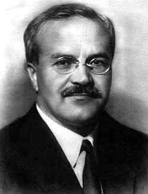

### 2020

U.S. industrial production: two decades of no growth.

### 1989

W Warszawie przewodniczący Solidarności Lech Wałęsa, przewodniczący Zjednoczonego Stronnictwa Ludowego Roman Malinowski i przewodniczący Stronnictwa Demokratycznego Jerzy Jóźwiak przekazali prezydentowi Wojciechowi Jaruzelskiemu notę o powołaniu koalicji, której wspólnym kandydatem na stanowisko premiera został mianowany Tadeusz Mazowiecki.

  

---

https://pl.wikipedia.org/wiki/Sejmowa_Komisja_Nadzwyczajna_do_Zbadania_Dzia%C5%82alno%C5%9Bci_MSW

---

### 1939

Radziecki minister spraw zagranicznych Wiaczesław Mołotow (zdjęcie) odpowiadając na przedstawione dwa dni wcześniej przez niemieckiego ambasadora w Moskwie Friedricha -Wernera von der Schulenburga niemieckie memorandum w sprawie zwrotu w stosunkach niemiecko-radzieckich zaproponował zawarcie paktu o nieagresji zawierającego specjalny tajny protokół precyzujący „zainteresowania umawiających się stron w tych lub innych zagadnieniach  polityki zagranicznej”.
Pierwszym krokiem w tym kierunku ma
być podpisanie umowy kredytowo-
handlowej.

  

### 1937

https://pl.wikipedia.org/wiki/Andrzej_Czechowicz

### 1920

W czasie wojny polsko-bolszewickiej pod Zadwórzem miała miejsce jedna z bitew nazywana mianem "Polskich Termopili".
Do walki z 6 Dywizją I Armii Konnej Siemiona Budionnego stanął Ochotniczy Batalion Lwowski dowodzony przez kapitana Bolesława Zajączkowskiego. Dramatyzmu tej batalii dodaje fakt, że w znacznej części formacja ta składała się z harcerzy i obrońców Lwowa z 1919 roku wywodzących się ze zgrupowania rotmistrza Romana Abrahama, legendarnego obrońcy Góry Stracenia.
Do pierwszych starć z bolszewikami doszło w pobliżu stacji kolejowej w Zadwórzu.Oddziałowi dowodzonenu przez pułkownika Antoniego Dawidowicza udało się obronić dworzec kolejowy. Nadeszły jednak nowe siły bolszewickie. Otoczeni przez wroga żołnierze nie poddali się nawet wtedy, kiedy zabrakło amunicji. Kapitan Zajączkowski o zmierzchu rozkazał pozostałym przy życiu ok. 30 żołnierzom wycofywanie się grupami do borszczowickiego lasu. Ostrzeliwani z broni maszynowej przez sowieckie samoloty, bezbronni, otoczeni przez Rosjan, walczyli jeszcze krótko na kolby w pobliżu budki dróżnika. Sowieci, rozwścieczeni oporem Orląt,
rąbali ich szablami, rannych dobijali kolbami. Polacy przy wsparciu stosunkowo niewielkiego lotnictwa walczyli jednak dalej. Udało im się nawet pozbawić życia 100 kozaków. Mimo tego bolszewicy okazali się być skuteczniejsi.
Po zakończonej bitwie w jej miejscu znaleziono ciała 318 Polaków rozlokowane na stanowiskach bojowych. Aby nie wpaść w ręce wroga, dowódca oddziału wraz z kilkoma żołnierzami popełnił samobójstwo. Zginął wówczas m.in. 19-letni Konstanty Zarugiewicz, uczeń siódmej klasy, obrońca Lwowa z 1918 r., kawaler krzyża Virtuti Militari i Krzyża Walecznych. Jego zwłok nigdy
nie zidentyfikowano. W 29 października 1925 roku jego matka Jadwiga Zarugiewiczowa była osobą, która na cmentarzu Obrońców Lwowa wskazała trumnę ze zwłokami nieznanego żołnierza, którą przewieziono z
najwyższymi honorami do Warszawy i
umieszczono w Grobie Nieznanego Żołnierza.
Obrona Zadwórza zaangażowała znaczne siły sowieckie, co dało czas oddziałom polskim na umocnienie pozycji na przedpolu Lwowa.

  

### 1612

https://pl.wikipedia.org/wiki/Jeremi_Wi%C5%9Bniowiecki

---

<a href="https://github.com/TomaszWaszczyk/historia.waszczyk.com/edit/master/src/content/august-17.md" target="_blank">Edytuj tę stronę dzieląc się własnymi notatkami!</a>
