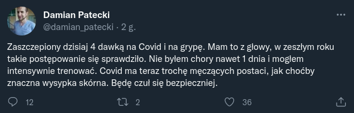
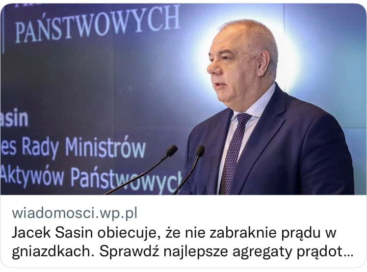
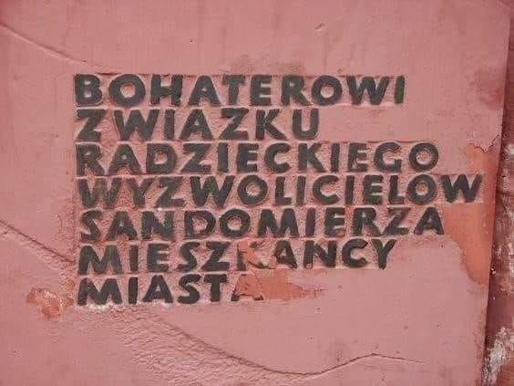
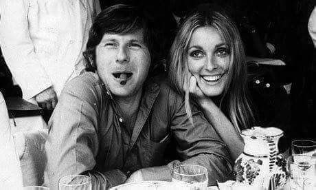
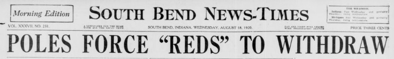
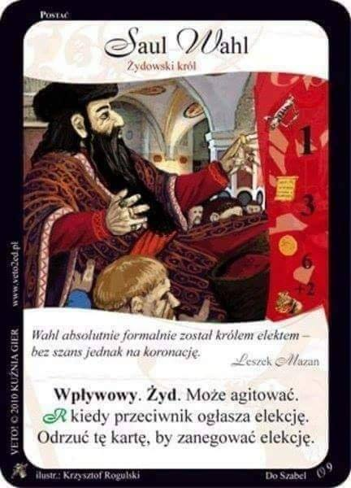

### 2023

<a href="./documents/august/ecb.wp2240-en.pdf" target="_blank">ecb.wp2240-en.pdf</a>

<a href="./documents/august/english_paris2015_agreement.pdf" target="_blank">english_paris2015_agreement.pdf</a>

<a href="./documents/august/Delta-2010-12-benford.pdf" target="_blank">Delta-2010-12-benford.pdf</a>

### 2022

  

  

### 2021

> “Zaszczepienie się szczepionkami zaaprobowanymi przez kompetentne władze jest aktem miłości. I przyczynienie się do tego, by większość osób zaszczepiło się jest aktem miłości; miłości do siebie samych, do rodziny i przyjaciół, miłości do wszystkich narodów” - Papież Franciszek

### 1944

Wojska radzieckie II Frontu Ukraińskiego zajęły Sandomierz. Główną formacją opanowującą miasto był 1180 Pułk Strzelców pod dowództwem podpułkownika Wasyla Skopenki.  Walki na przyczółku sandomierskim pociągnęły za sobą wiele ofiar po obu stronach frontu.
Radziecki dowódca tak pisał o tym wydarzeniu w liście do żony Anny:
"„Podeszliśmy pod jedno z bardzo pięknych miast. Położone jest ono nad stromym brzegiem szerokiej rzeki. Ludzie tam, Aniu, ja wierzę, są dobrzy. Czegoż oni nie wycierpieli w tej niewoli. Faszyści tak łatwo stąd nie odejdą. A tak by się chciało, żeby piękne miasto nie było obiektem działań. W ogóle chciałoby się, żeby Ziemia nasza była nie w ogniu, lecz w kwiatach..."
24 stycznia 1945 roku Skopenko otrzymał awans na stopień pułkownika. Zginął trzy dni później 27 stycznia 1945 roku podczas walk o Wrocław. W szpitalu konając powiedział:
"Pochowajcie mnie na brzegu Wisły, w Sandomierzu. To miasto i ludzie są dla mnie najbliższą rodziną”.

  

Zdjęcie: tablica nagrobna pułkownika Skopenki

## 1941

> "Jedna śmierć to tragedia, milion – to statystyka." - Józef Stalin

Około godziny 20:30 podpułkownik Borys Epow, stacjonujący na zaporze wodnej Dnieprostroj na Ukrainie, otrzymał polecenie samego Józefa Stalina, które nakazywało mu wysadzić obiekt w powietrze.

Powstała wskutek tego fala uderzeniowa miała spowolnić niemieckie natarcie, które od tygodni spychało Sowietów do coraz to głębszej defensywy.

Epow wykonał rozkaz. Wybuch 20 ton materiałów wybuchowych wyrwał w zaporze dziurę o długości ok. 135 metrów. Ale wysadzenie Dnieprostroju nie zatrzymało żołnierzy Hitlera. Spowodowało natomiast ogromne straty w ludności cywilnej, które do dziś są trudne do oszacowania.

Według niektórych historyków fala powodziowa zabrała ze sobą nawet 120 tysięcy ludzi zamieszkujących brzegi Dniepru.

### 1933

W Paryżu urodził się Roman Polański - aktor, reżyser i scenarzysta filmowy.Jeden z najwybitniejszych twórców światowej kinematografii. Początkowo realizował filmy w Polsce (Nóż w wodzie), a następnie za granicą (Wstręt, Tragedia Makbeta, Chinatown, Lokator, Frantic, Gorzkie gody, Tess, Pianista, Auto Widmo). Reżyserował inscenizacje teatralne, m.in Amadeusza P. Shaffera. Więcej informacji o życiu osobistym i zawodowym Romana Polańskiego można znaleźć w jego autobiograficznej książce pt. Roman.
Foto: Roman Polański w towarzystwie swojej żony Sharon Tate (1942-69). Zdjęcie wykonano pod koniec lat sześćdziesiątych.
Nominacje oraz nagrody przyznawane filmom autorstwa Romana Polańskiego:
Nagroda Akademii Filmowej
2002: Pianista (Najlepsza Reżyseria) (nominacja Najlepszy Film)
Złoty Glob
1974: Chinatown (Najlepszy Film)
1974: Chinatown (Najlepsza Reżyseria)
1979: Tess (Najlepszy Film Zagraniczny)(nominacja Najlepsza Reżyseria)
Nagroda BAFTA
1974: Chinatown (Najlepsza Reżyseria)
2003: Pianista (Najlepszy Film)
2003: Pianista (Najlepsza Reżyseria)
Cezar
1979: Tess (Najlepsza Reżyseria)
1979: Tess (Najlepszy Film)
2002: Pianista (Najlepsza Reżyseria)
2002: Pianista (Najlepszy Film)
2010: Autor widmo (Najlepsza Reżyseria)
2010: Autor widmo (Najlepszy Scenariusz Adaptowany)
Orzeł
2003: Pianista (Najlepszy Film)
2003: Pianista (Najlepsza Reżyseria)
2011: Autor widmo (Najlepszy film europejski)
Nagroda na MFF w Cannes
2002: Pianista (Najlepszy Film)
Nagroda na MFF w Berlinie
1965: Wstręt (Specjalna nagroda Jury)
1966: Matnia (Najlepszy Film)
2010: Autor widmo (Najlepsza Reżyseria)
Odznaczenia:
Legia Honorowa (Francja)
Order Sztuki i Literatury(Francja)
Medal Zasłużony Kulturze Gloria Artis (Polska)

  

### 1920

  

### 1918

https://pl.wikipedia.org/wiki/Bitwa_pod_Amiens

Brytyjczycy w 1798 roku, gdy Izba Gmin wprowadziła podatek dochodowy. Przejściowo. Na wojnę z Francją. Uznali - jak pisze Alvin Rabushka - że to "ciężar zbyt ohydny, by nakładać go na człowieka, gdyż ujawnia stan jego finansów urzędnikowi podatkowemu".

Dlatego w 1802 roku - po pokoju w Amiens - go zlikwidowano. Ale potem znów przywrócono. I znów zlikwidowano i znów przywrócono. Zabawny był premier William Gladstone, który w opozycji domagał się jego likwidacji, a jak powracał do władzy - podatek dochodowy powracał razem z nim.

Początkowo płacili go tylko bogaci. Opodatkowano dochody powyżej 60 funtów rocznie, a średni dochód roczny wynosił wówczas 20 funtów. Przez kolejne lata podatkiem obejmowano coraz więcej stanów faktycznych i prawnych, i podwyższano stawki podatkowe. Teraz płacić mają go wszyscy - nawet biedni. Muszą składać na siebie donosy - zwane eufemistycznie "deklaracjami" lub "zeznaniami" - nawet jak nie mają nic do zapłacenia.

Władza lubi wiedzieć o nas jak najwięcej. Służy temu progresja podatkowa. Bo gdyby podatek był proporcjonalny mógłby być pobierany u źródła  - jak "podatek Belki" od "zysków kapitałowych" Dlaczego podatek od "zysków z pracy" pracowników nie może być pobierany przez pracodawców tak samo jak jest pobierany przez banki od ich klientów? Właśnie z powodu inwigilacji. Oczywiście tego się głośno nie mówi.

### 1587

Władcą Polski został litewski rabin, bankier i poborca ceł Saul Wahl.
Naprawdę nazywał się Saul Katzenellenbogen.Jego historia w znacznej mierze opiera się głównie na legendach, a w oficjalnej historii Polski i przez wielu historyków samo istnienie tej postaci poddawane jest w wątpliwość, co nie zmienia faktu,że dodaje to kolorytu naszej historii.
Wahl był prawdopodobnie człowiekiem wielkiej wiedzy i mądrości, co przysporzyło mu wielu sympatyków wśród polskiej szlachty,która po śmierci króla Stefana Batorego miała spore wątpliwości, co do wyboru jego następcy. Jak wiadomo, nowym królem polski został wybrany Zygmunt III Waza, czego nikt nie poddaje w wątpliwość. Natomiast Saul Wahl został "jednodniowym królem " w wyniku pomyłki w dokumentach historycznych, do której nieświadomie doprowadził sam Stefan Batory :) wydając w 1580 roku w Lublinie decyzję o powołaniu samorządu żydowskiego, którego marszałkiem został domniemany Saul Wahl. I to prawdopodobnie w tym miejscu,któryś z kronikarzy zrobił go królem Polski :) Według innych podań miał on w czasie swojego jednodniowego władania wydać masę rozporządzeń i dokumentów dotyczących polskich Żydów.
Tak oto mieliśmy władcę, który podobno wiele zrobił,chociaż być może nawet nie istniał :)

  

---

<a href="https://github.com/TomaszWaszczyk/historia.waszczyk.com/edit/master/src/content/august-18.md" target="_blank">Edytuj tę stronę dzieląc się własnymi notatkami!</a>
