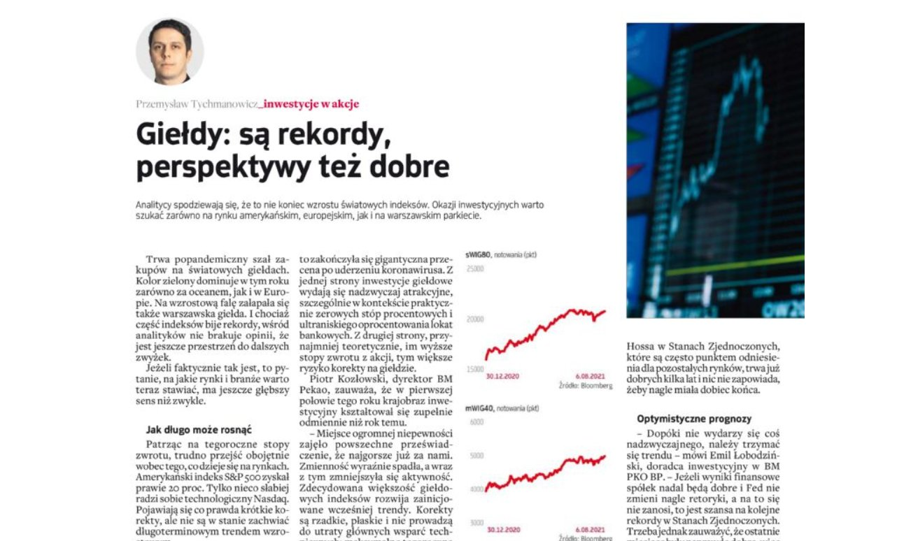
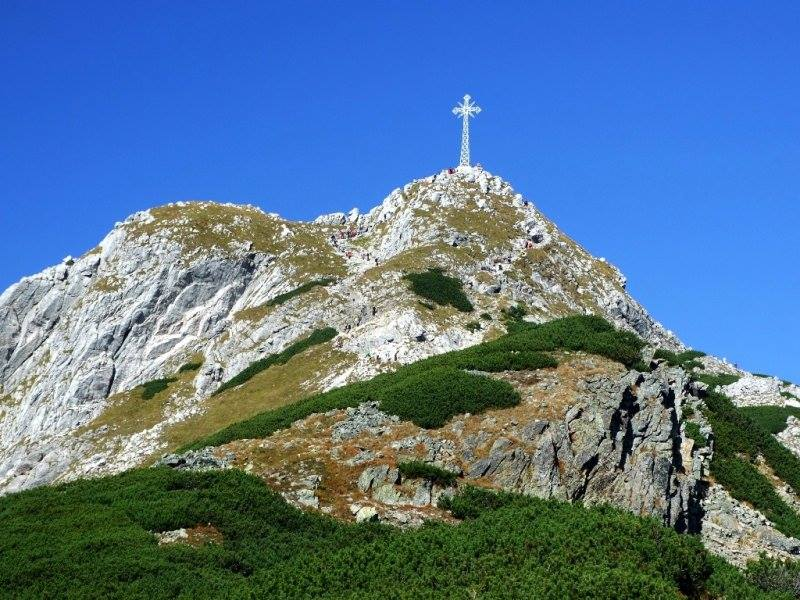

### 2021

  

---

Ashura
### 2020

Buffett kupuje akcje kopalni złota, cena kruszcu znów powyżej 2000 USD
DOROTA SIERAKOWSKA, 18-08-2020
Wczoraj ceny złota zwyżkowały aż o 2,5%, a dzisiaj kontynuują ruch w górę. Tym samym, dzisiaj rano ceny złota na nowo pokonały psychologiczną barierę na poziomie 2000 USD za uncję.
Zwyżka cen złota jest w dużej mierze rezultatem słabości amerykańskiego dolara. US Dollar Index w ostatnich dniach porusza się w dół, oscylując już w okolicach tegorocznych minimów.
Kupującym na rynku złota pomogły także informacje o tym, że spółka Warrena Buffetta, Berkshire Hathaway, kupiła akcje drugiego największego producenta złota na świecie, spółki Barrick Gold. Taki ruch ze strony jednego z największych krytyków inwestowania w złoto świadczy o tym, że nawet Buffett przekonał się do pozytywnych długoterminowych perspektyw dla cen złota. Mimo że najsłynniejszy inwestor świata nie wszedł na rynek kruszcu bezpośrednio, to zainwestował pośrednio, bowiem ceny akcji spółki Barrick Gold są silnie skorelowane z notowaniami złota na globalnym rynku.

---

Dziś, gdy mija pół wieku od śmierci Pawła Jasienicy (1909-1970), warto przypomnieć jego najbardziej osobistą i najbardziej wyklętą książkę – „Rozważania o wojnie domowej”. Jest to nie tylko znakomity esej o socjologii „najazdu wewnętrznego”, ale również o psychologii ludowego oporu.
W „Rozważaniach o wojnie domowej” ci, których życie wdeptano w błoto, o których nawet pamięć miała zaginąć, skoro zagrodzili drogę „postępowi” – przemówili ustami tego, który przeżył. Bóg, który daje życie chroni również pamięć i sam wybiera świadków.
Pisząc o Wandei Jasienica nie budował prostych analogii, po prostu – jako uniwersalne symbole – opisał realne prototypy kontrrewolucji i pierwszego rewolucyjnego ludobójstwa. Dla Jasienicy książka ta, pisana z nikłą (ale jednak) nadzieją publikacji, była również okazją do osobistego świadectwa o uczuciach tych, u boku których kontynuował walkę po wojnie. Co czują ludzie, dla których najpewniejszą nadzieją staje się jedynie godna śmierć?

---

### 1970

Zmarł Paweł Jasienica, pisarz, publicysta i żołnierz Armii Krajowej.

### 1920

19 na 20 sierpnia 1920 r., wybuchło II Powstanie Śląskie – pierwszy ze zrywów śląskich, który osiągnął swoje cele. Miało zademonstrować siłę polskiej ludności i dążenie do zjednoczenia z Polską, było też reakcją na prowadzony przez Niemców terror. Wojciech Korfanty wydał rozkaz rozpoczęcia walki zbrojnej w części powiatów Górnego Śląska.
Powstanie wpłynęło na decyzję Rady Ambasadorów, która zdecydowała o korzystniejszym dla Polski podziale Śląska. Z obszaru plebiscytowego, czyli ponad 11 tys. km², zamieszkanego przez ponad 2 mln osób, do Polski przyłączono 29 proc. obszaru i 46 proc. ludności. Do Polski włączono Katowice, Świętochłowice, Królewską Hutę (obecny Chorzów), Rybnik, Lubliniec, Tarnowskie Góry i Pszczynę. Podział był korzystny dla Polski gospodarczo – na przyłączonym terenie znajdowały się 53 z 67 istniejących kopalni, 22 z 37 wielkich pieców oraz 9 z 14 stalowni. W czerwcu 1922 r. przyznany Polsce obszar Górnego Śląska został przejęty przez polską armię i administrację cywilną.

### 1901

Na pamiątkę 1900. rocznicy urodzin Jezusa Chrystusa dzięki staraniom zakopiańskich górali wspieranych przez ówczesnego proboszcza parafii, księdza Kazimierza Kaszelewskiego na szczycie Wielkiego Giewontu stanął metalowy krzyż. Za wykonanie i zaprojektowanie krzyża odpowiedzialna była krakowska fabryka Józefa Góreckiego. Całość konstrukcji waży 1819 kg, złożona jest z 400 elementów żelaznych. Krzyż ma 17,5 m wysokości, z czego 2,5 m jest wkopane w skały, poprzeczne ramię rozpostarte jest na 5,5 metra. 19 sierpnia 1901 roku 300 osób wzięło udział w uroczystej procesji na szczyt, podczas której poświęcenia krzyża dokonał ks.kanonik kanclerz Władysław Bandurski. Krzyż na Giewoncie stanowi charakterystyczny i rozpoznawlany element zakopiańskiego krajobrazu.

  

## 1793

Ambasador rosyjski Jakov Sieviers reprezentujący carycę Katarzynę II ratyfikował układ rozbiorowy zwany drugim rozbiorem Polski.
Dwaj zaborcy Prusy i Rosja podzieliły Polskę między siebie.
Prusy otrzymały Gdańsk i Toruń oraz
województwa gnieźnieńskie , poznańskie ,
sieradzkie (z Wieluniem ), kaliskie, płockie ,
brzeskokujawskie , inowrocławskie, ziemię
dobrzyńską oraz części krakowskiego ,
rawskiego i mazowieckiego (57 tys. km²). Natomiast Rosja zajęła województwa: mińskie, kijowskie, bracławskie i podolskie oraz części brzeskolitewskiego i wołyńskiego, łącznie było to 250 tys. km2 ziem Rzeczypospolitej zamieszkałych przez 3 mln mieszkańców.
W rozbiorze tym nie brała udziału Austria skonfliktowana w tym czasie z Francją.

---

<a href="https://github.com/TomaszWaszczyk/historia.waszczyk.com/edit/master/src/content/august-19.md" target="_blank">Edytuj tę stronę dzieląc się własnymi notatkami!</a>
