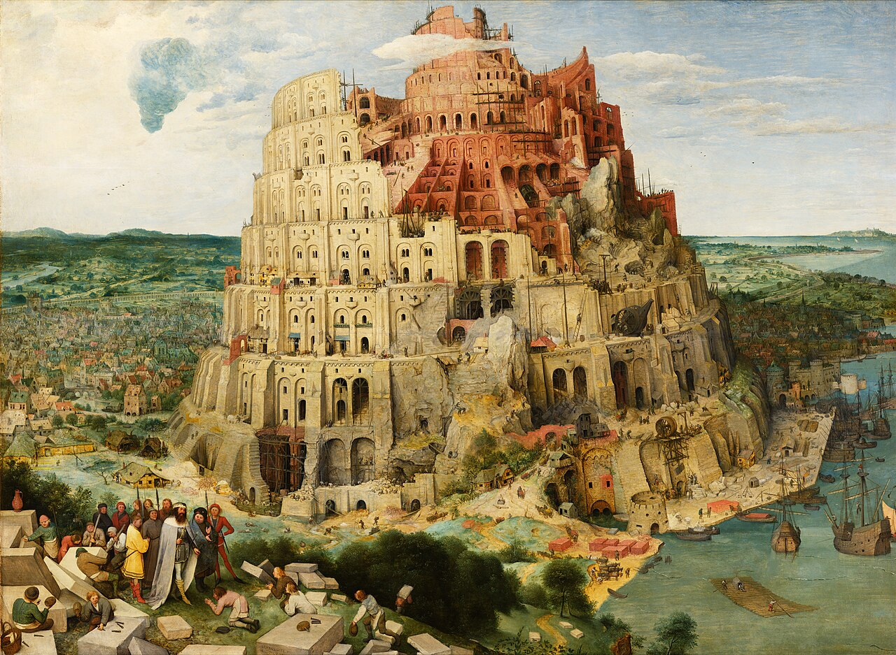
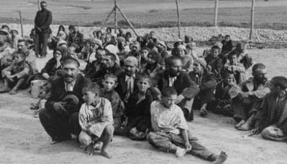
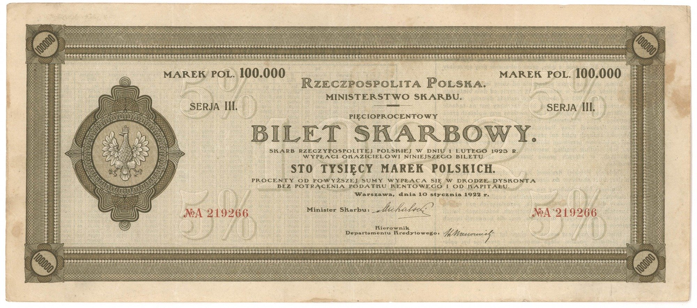

### 2023

  

  

  

> Many forms of such servitude have been tested by rulers over the millennia, but by far the most effective among them is that of “representative democracy” coupled with the “welfare state.” “Representative democracy” is the illusion of universal participation in the use of institutional coercion. The “welfare state” is the reality of universal participation in the process of institutional parasitism. Together, they constitute what Frédéric Bastiat described in his immortal words as “the great fiction through which everybody endeavors to live at the expense of everybody.”

---

Propaganda, "generał"

> Gen. Polko: nie trzeba obawiać się grupy Wagnera. Poradziłby z nią sobie jeden polski batalion

[Słońce na żywo](http://www.astro.uni.wroc.pl/index.php/popularyzacja/slonce-na-zywo)

[Qatar](https://climateknowledgeportal.worldbank.org/country/qatar/climate-data-historical)

---

<video width="640" height="480" controls>
<source src="./movies/august/ukraine.mp4" type="video/mp4">
Your browser does not support the video tag.
</video>

---

### 2021

The IMF has just approved a helicopter drop of $650 billion in SDRs to boost global liquidity. An allocation of SDRs hasn't happened since 2009.

“This is a historic decision – the largest SDR allocation in the history of the IMF and a shot in the arm for the global economy at a time of unprecedented crisis. The SDR allocation will benefit all members, address the long-term global need for reserves, build confidence, and foster the resilience and stability of the global economy. It will particularly help our most vulnerable countries struggling to cope with the impact of the COVID-19 crisis,” IMF Managing Director Kristalina Georgieva said.

### 1944

Niemcy likwidujący obóz cygański w KL Auschwitz pozbawili życia 2897 Romów. Była to masowa eksterminacja trzeciej,co do liczebności grupy etnicznej w tym miejscu. Transporty z Romami zaczęły tu docierać już 9lipca 1941 roku.
W grudniu 1942 roku Niemcy wydali zarządzenia nakazujące osadzenie Romów w obozach koncentracyjnych. Wybrano w tym celu Auschwitz. Romowie byli deportowani całymi
rodzinami do obozu Auschwitz II-Birkenau.
Pierwszy transport dotarł 26 lutego 1943 roku. Wówczas Familienzigeunerlager był jeszcze w
budowie. Po jej zakończeniu znajdowały się tam 32  baraki mieszkalne i 6 sanitarnych.Od lutego 1943 roku do lipca 1944 roku za drutami Auschwitz znalazło się 21 tysięcy Romów kobiet,mężczyzn i dzieci. Do tej liczby należy dodać również 1700 Romów przywiezionych z Białegostoku,których nie ujęto na żadnej z list i z uwagi na podejrzenie zarazy tyfusa zlikwidowano od razu.
Większość spośród więźniów Zigeunerlager zmarła wskutek chorób. Szczególnie cierpiały dzieci deportowne lub urodzone w obozie.
Wśród nich szerzyły się choroby - rak wodny, szkarlatyna, odra i dyfteryt. Na dzieciach zbrodnicze eksperymenty medyczne przeprowadzał obozowy lekarz Josef Mengele.
Wszystkie zmarły lub zostały zgładzone. Według relacji świadków to właśnie Mengele 2 sierpnia 1944 roku podczas wieczornego apelu kazał wystąpić wszystkim lekarzom i pielęgniarkom Polakom i skierował ich do karnej kompanii w Birkenau.
Likwidcja obozu romskiego w Auschwitz miała nastąpić już w maju 1944 roku,ale zaniechano tego,ponieważ obawiano się i to całkiem zasadnie buntu więzniów.
Cyganów ostrzegł kierownik obozu cygańskiego Unterscharführer SS Georg Bonigut. Nakazał, by nie opuszczali baraków. 16 maja wieczorem obóz otoczyło około 50-60 SS-manów. Próbowali wygonić więźniów z baraków. Nikt nie wyszedł.
Niemcy zrezygnowali z obawy przed stratami. Wśród więźniów była znaczna liczba byłych żołnierzy Wehrmachtu. Obawiali się również, że iskra oporu mogłaby się przedostać na inne
rejony obozu.
23 maja 1944 roku z Birkenau przeniesiono do Auschwitz ponad 1,5 tysiąca Cyganów. Zostali później wywiezieni do obozu w Buchenwaldzie.
Dwa dni później do obozu we Flossenburgu wysłano 82 Cyganów, a do Ravensbrueck - 144 Cyganki. W obozie familijnym pozostało
niespełna 3 tysiące osób.
Jak już wspomniałem w nocy z 2 na 3 sierpnia 1944 roku na rozkaz Himmlera rozpoczęto likwidację obozu. Oto fragment wspomnień jednego ze świadków:
" Po południu podstawiono na obozową rampę kolejową w Birkenau pusty pociąg towarowy, a następnie przyprowadzono z KL Auschwitz I
wyselekcjonowanych z obozu BIIe Cyganów i osadzonych w blokach nr 10 i 11 w obozie macierzystym w dniu 23 V 1944 r. - 1408 Cyganów i Cyganek, których postanowiono zachować przy życiu i skierować do innych obozów koncentracyjnych. Wyjeżdżający żegnali się poprzez druty ogrodzenia obozowego z Cyganami pozostającymi w obozie BIIe. Około godziny 19.00
wyruszył z rampy kolejowej w Birkenau pociąg towarowy, w którym było 918 mężczyzn, w tym 105 chłopców w wieku 9 do 14 lat oraz 490 kobiet.
Pociąg skierowano do KL Buchenwald. 1408 osób - Cyganów figurowało jeszcze w dniach 3 i 4 sierpnia w zestawieniach zatrudnienia w KL
Auschwitz II jako znajdujących się w transporcie do innego obozu. Odpisano ich ze stanu liczbowego obozu po otrzymaniu zawiadomienia o przejęciu ich przez KL Buchenwald."
Według współczesnych szacunków, w wyniku prześladowań i terroru w latach panowania III Rzeszy śmierć poniosło około połowy populacji Romów, zamieszkujących obszary okupowane
przez Niemców.
W 2001 roku na terenie Państwowego Muzeum Auschwitz-Birkenau otwarta została stała ekspozycja upamiętniająca martyrologię Cyganów.

  

### 1990

https://en.wikipedia.org/wiki/Gulf_War

Wygrywa USA: https://pl.wikipedia.org/wiki/Agresja_Iraku_na_Kuwejt

### 1871

Założono Archiwum Skarbowe w Warszawie.

  

---

<a href="https://github.com/TomaszWaszczyk/historia.waszczyk.com/edit/master/src/content/august-2.md" target="_blank">Edytuj tę stronę dzieląc się własnymi notatkami!</a>
