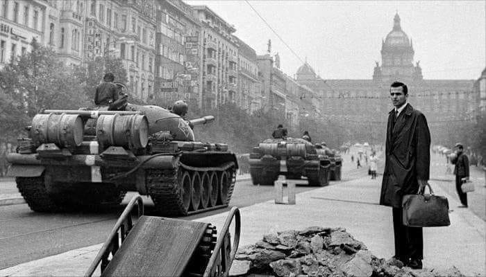

### 1968

Wojska Układu Warszawskiego rozpoczęły w Czechosłowacji zbrojną interwencję pod kryptonimem "Dunaj". Celem tej operacji było powstrzymanie reform politycznych i gospodarczych oraz liberalizacji praw.
Według szaunków w interwencji uczestniczyło blisko pół miliona żołnierzy w tym druga,co do liczebnej wielkości II Armia Wojska Polskiego.
Jedynym krajem UW, który nie zdecydował się wziąć w tym udziału była Rumunia.

  

---

<a href="https://github.com/TomaszWaszczyk/historia.waszczyk.com/edit/master/src/content/august-20.md" target="_blank">Edytuj tę stronę dzieląc się własnymi notatkami!</a>
